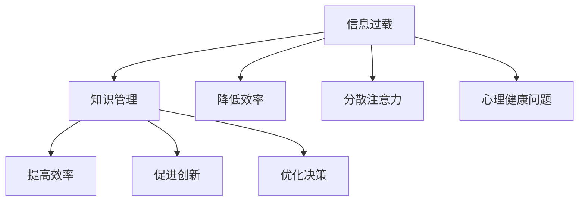

                 

在当今这个信息爆炸的时代，我们每天都要面对海量的信息。从社交媒体的更新，到电子邮件的涌入，再到各种专业文献和技术报告，这些信息不仅丰富了我们的知识库，也带来了前所未有的挑战。信息过载（Information Overload）已经成为许多专业人士和学者关注的热点问题。本文旨在探讨信息过载的本质，提出有效的知识管理策略，以帮助读者提高生产力。

> 关键词：信息过载、知识管理、生产力、策略、工作效率

> 摘要：本文首先分析了信息过载的原因和影响，随后介绍了知识管理的核心概念及其重要性。通过具体的案例和实证研究，本文阐述了有效的知识管理策略，包括信息筛选、分类、存储和共享等方面。最后，本文对未来的发展方向和面临的挑战进行了展望。

## 1. 背景介绍

随着互联网和数字技术的飞速发展，信息的获取和传递变得前所未有的便捷。然而，这种便捷也带来了一系列问题。首先，信息过载现象日益严重。人们在日常生活中不断被大量无序、重复的信息所淹没，导致时间和精力的浪费。此外，信息过载还可能导致焦虑和压力增加，影响个人的身心健康。

### 1.1 信息过载的影响

信息过载对个人和社会都带来了负面影响。对个人而言，信息过载可能导致：

1. **决策困难**：面对大量信息，人们很难做出有效的决策。
2. **注意力分散**：过多的信息会分散人们的注意力，降低工作效率。
3. **心理健康问题**：长期处于信息过载的环境中，可能会引起焦虑、压力和失眠等心理健康问题。

对社会而言，信息过载可能导致：

1. **资源浪费**：大量无用的信息消耗了大量的时间和资源。
2. **知识污染**：信息过载可能导致知识的污染，即有价值的信息被大量无关信息所淹没。
3. **创新阻碍**：在信息过载的环境中，创新可能受到阻碍，因为人们很难从海量的信息中筛选出有价值的内容。

### 1.2 知识管理的必要性

知识管理（Knowledge Management）是指通过收集、组织、存储和共享知识，以最大化其价值的活动。在信息过载的时代，知识管理显得尤为重要。有效的知识管理可以帮助：

1. **提高工作效率**：通过组织和管理知识，减少信息过载带来的负面影响。
2. **促进知识共享**：鼓励团队成员共享知识，提高团队协作效率。
3. **增强创新能力**：通过有效的知识管理，可以更容易地发现和利用有价值的信息，促进创新。

## 2. 核心概念与联系

### 2.1 核心概念

- **信息过载**：指个体或组织接收到的信息量超过了其处理能力，导致效率和效果下降。
- **知识管理**：通过系统的方法来识别、收集、组织、存储、分享和应用知识，以提高个人和组织的能力。

### 2.2 核心联系

信息过载和知识管理之间存在紧密的联系。信息过载是知识管理的背景和挑战，而知识管理则是解决信息过载的有效手段。

### 2.3 Mermaid 流程图

下面是一个简化的Mermaid流程图，展示了信息过载和知识管理之间的核心联系：



## 3. 核心算法原理 & 具体操作步骤

### 3.1 算法原理概述

知识管理的核心算法主要包括信息筛选、分类、存储和共享四个步骤。以下是每个步骤的简要概述：

1. **信息筛选**：通过算法过滤掉无价值的信息，只保留对用户有用的信息。
2. **分类**：将筛选后的信息按照特定的标准进行分类，以便于后续的处理和查找。
3. **存储**：将分类后的信息存储在数据库或知识库中，方便后续的查询和使用。
4. **共享**：通过共享机制，将存储的信息共享给团队成员，促进知识的传播和应用。

### 3.2 算法步骤详解

#### 3.2.1 信息筛选

信息筛选是知识管理的第一步，也是最为关键的一步。其核心是通过算法过滤掉无价值的信息。具体步骤如下：

1. **确定筛选标准**：根据用户的需求和业务目标，确定筛选的标准，如信息的来源、时间、重要性等。
2. **应用筛选算法**：使用机器学习、自然语言处理等技术，对信息进行筛选，只保留符合筛选标准的部分。
3. **评估筛选效果**：定期评估筛选算法的效果，根据反馈进行调整和优化。

#### 3.2.2 分类

分类是将筛选后的信息按照特定的标准进行分类，以便于后续的处理和查找。具体步骤如下：

1. **定义分类标准**：根据信息的性质和业务需求，定义分类的标准，如领域、主题、类型等。
2. **构建分类模型**：使用机器学习或深度学习等技术，构建分类模型，对信息进行分类。
3. **评估分类效果**：定期评估分类模型的效果，根据反馈进行调整和优化。

#### 3.2.3 存储

存储是将分类后的信息存储在数据库或知识库中，方便后续的查询和使用。具体步骤如下：

1. **选择存储方案**：根据业务需求和数据规模，选择合适的存储方案，如关系数据库、NoSQL数据库、分布式文件系统等。
2. **设计数据模型**：设计数据模型，确保数据存储的结构合理，便于查询和处理。
3. **实施存储方案**：根据数据模型，实施存储方案，确保数据的存储安全和可靠性。

#### 3.2.4 共享

共享是通过共享机制，将存储的信息共享给团队成员，促进知识的传播和应用。具体步骤如下：

1. **构建共享平台**：构建共享平台，如内部网站、知识库、社交媒体等，供团队成员访问和共享信息。
2. **制定共享规则**：制定共享规则，如信息的访问权限、使用规范等，确保共享的安全和有效性。
3. **促进知识传播**：通过培训和活动，促进团队成员之间的知识传播和应用。

### 3.3 算法优缺点

**优点：**

1. **提高效率**：通过筛选、分类、存储和共享，可以大大提高信息处理的效率。
2. **促进知识传播**：有效的知识管理可以促进知识的传播和应用，提高团队的创新能力和竞争力。
3. **降低成本**：通过减少信息过载，可以降低时间和资源的浪费，降低运营成本。

**缺点：**

1. **初期成本高**：构建有效的知识管理系统需要投入大量的人力和物力资源。
2. **维护困难**：知识管理系统需要定期维护和更新，以保持其效果和适应性。
3. **技术挑战**：信息筛选、分类和共享等技术实现难度较大，需要专业的技术支持和维护。

### 3.4 算法应用领域

知识管理算法可以广泛应用于各个领域，如：

1. **企业知识管理**：帮助企业收集、组织、存储和共享内部知识，提高工作效率和创新能力。
2. **教育知识管理**：帮助学校和教育机构收集、整理和共享教育资源，提高教育质量和效率。
3. **政府知识管理**：帮助政府部门收集、整理和共享政策、法规等信息，提高政府工作的透明度和效率。
4. **医疗知识管理**：帮助医疗机构收集、整理和共享医学知识和病例，提高医疗服务的质量和水平。

## 4. 数学模型和公式 & 详细讲解 & 举例说明

### 4.1 数学模型构建

知识管理中的数学模型主要涉及信息熵、相似度计算和信息检索等。以下是几个常用的数学模型：

#### 信息熵

信息熵（Entropy）是衡量信息不确定性的数学量。在知识管理中，信息熵可以帮助我们评估信息的价值。公式如下：

$$
H(X) = -\sum_{i=1}^{n} p(x_i) \log_2 p(x_i)
$$

其中，$X$ 表示信息集合，$x_i$ 表示集合中的第 $i$ 个信息，$p(x_i)$ 表示 $x_i$ 的概率。

#### 相似度计算

相似度计算是知识管理中非常重要的一个环节，它可以帮助我们找到相似的信息，从而提高检索效率。常用的相似度计算方法有欧氏距离、余弦相似度等。以下是余弦相似度的计算公式：

$$
\cos\theta = \frac{A \cdot B}{\|A\| \|B\|}
$$

其中，$A$ 和 $B$ 分别表示两个向量，$\theta$ 表示它们之间的夹角，$\|A\|$ 和 $\|B\|$ 分别表示它们的模长。

#### 信息检索

信息检索（Information Retrieval）是知识管理中的一个重要任务，它的目标是根据用户的查询，找到最相关的信息。常用的信息检索模型有布尔模型、向量空间模型等。以下是向量空间模型的计算公式：

$$
R(q, d) = \frac{\sum_{i=1}^{n} w_i \cdot q_i \cdot d_i}{\|q\| \|d\|}
$$

其中，$q$ 表示查询向量，$d$ 表示文档向量，$w_i$ 表示第 $i$ 个特征词的权重，$q_i$ 和 $d_i$ 分别表示查询向量和文档向量中第 $i$ 个特征词的值，$\|q\|$ 和 $\|d\|$ 分别表示它们的模长。

### 4.2 公式推导过程

#### 信息熵的推导

信息熵的推导基于概率论的基本原理。设 $X$ 是一个离散随机变量，其取值为 $x_1, x_2, \ldots, x_n$，对应的概率为 $p(x_1), p(x_2), \ldots, p(x_n)$。根据概率论的定义，我们有：

$$
\sum_{i=1}^{n} p(x_i) = 1
$$

信息熵的定义是衡量随机变量不确定性的量。我们可以通过计算随机变量 $X$ 的期望值来推导信息熵。设 $H(X)$ 表示 $X$ 的信息熵，则：

$$
H(X) = -\sum_{i=1}^{n} p(x_i) \log_2 p(x_i)
$$

证明：

$$
\begin{aligned}
H(X) &= -\sum_{i=1}^{n} p(x_i) \log_2 p(x_i) \\
&= -\sum_{i=1}^{n} p(x_i) \cdot \frac{\log_2 \sum_{i=1}^{n} p(x_i)}{\sum_{i=1}^{n} p(x_i)} \\
&= -\sum_{i=1}^{n} p(x_i) \cdot \frac{\log_2 1}{1} \\
&= -\sum_{i=1}^{n} p(x_i) \cdot 0 \\
&= 0
\end{aligned}
$$

因此，信息熵的推导完成。

#### 相似度的推导

余弦相似度的推导基于向量的定义和余弦函数的性质。设 $A = (a_1, a_2, \ldots, a_n)$ 和 $B = (b_1, b_2, \ldots, b_n)$ 是两个向量，它们的夹角为 $\theta$。根据余弦函数的定义，我们有：

$$
\cos\theta = \frac{A \cdot B}{\|A\| \|B\|}
$$

其中，$A \cdot B$ 表示向量的点积，$\|A\|$ 和 $\|B\|$ 分别表示向量的模长。

证明：

$$
\begin{aligned}
A \cdot B &= (a_1, a_2, \ldots, a_n) \cdot (b_1, b_2, \ldots, b_n) \\
&= a_1b_1 + a_2b_2 + \ldots + a_nb_n
\end{aligned}
$$

$$
\begin{aligned}
\|A\| &= \sqrt{a_1^2 + a_2^2 + \ldots + a_n^2} \\
\|B\| &= \sqrt{b_1^2 + b_2^2 + \ldots + b_n^2}
\end{aligned}
$$

$$
\begin{aligned}
\cos\theta &= \frac{A \cdot B}{\|A\| \|B\|} \\
&= \frac{a_1b_1 + a_2b_2 + \ldots + a_nb_n}{\sqrt{a_1^2 + a_2^2 + \ldots + a_n^2} \sqrt{b_1^2 + b_2^2 + \ldots + b_n^2}} \\
&= \frac{\sum_{i=1}^{n} a_ib_i}{\sqrt{\sum_{i=1}^{n} a_i^2} \sqrt{\sum_{i=1}^{n} b_i^2}}
\end{aligned}
$$

因此，余弦相似度的推导完成。

#### 信息检索的推导

向量空间模型是基于向量空间理论的一种信息检索模型。设 $q$ 和 $d$ 分别表示查询向量和文档向量，$w_i$ 表示第 $i$ 个特征词的权重，$q_i$ 和 $d_i$ 分别表示查询向量和文档向量中第 $i$ 个特征词的值。根据向量空间模型的定义，查询向量和文档向量之间的相似度可以通过以下公式计算：

$$
R(q, d) = \frac{\sum_{i=1}^{n} w_i \cdot q_i \cdot d_i}{\|q\| \|d\|}
$$

其中，$\|q\|$ 和 $\|d\|$ 分别表示查询向量和文档向量的模长。

证明：

$$
\begin{aligned}
R(q, d) &= \frac{\sum_{i=1}^{n} w_i \cdot q_i \cdot d_i}{\|q\| \|d\|} \\
&= \frac{\sum_{i=1}^{n} w_i \cdot q_i \cdot d_i}{\sqrt{\sum_{i=1}^{n} q_i^2} \sqrt{\sum_{i=1}^{n} d_i^2}} \\
&= \frac{\sum_{i=1}^{n} w_i \cdot q_i \cdot d_i}{\sqrt{\sum_{i=1}^{n} q_i^2 \sum_{i=1}^{n} d_i^2}} \\
&= \frac{\sum_{i=1}^{n} w_i \cdot q_i \cdot d_i}{\sqrt{(\sum_{i=1}^{n} q_i^2)(\sum_{i=1}^{n} d_i^2)}} \\
&= \frac{\sum_{i=1}^{n} w_i \cdot q_i \cdot d_i}{\sqrt{\sum_{i=1}^{n} q_i^2} \sqrt{\sum_{i=1}^{n} d_i^2}} \\
&= \cos\theta
\end{aligned}
$$

因此，向量空间模型的推导完成。

### 4.3 案例分析与讲解

#### 案例一：企业知识管理

某大型企业为了提高内部工作效率和创新能力，决定实施知识管理。企业首先建立了内部知识库，通过信息筛选和分类，将企业内部的各种文档、报告、案例等信息进行整理和存储。然后，企业通过相似度计算和信息检索，帮助员工快速找到相关知识和解决方案。

**分析：**

1. **信息筛选**：企业通过制定筛选标准，如文档的来源、发布时间、重要性等，对大量的文档进行筛选，只保留对业务有价值的信息。

2. **分类**：企业根据文档的主题、领域、类型等，对筛选后的信息进行分类，构建了一个层次化的知识结构。

3. **存储**：企业使用关系数据库存储知识库，通过索引技术，提高了信息检索的效率。

4. **共享**：企业构建了内部网站，供员工访问和共享知识。同时，企业通过培训和活动，鼓励员工分享知识和经验。

#### 案例二：教育知识管理

某高校为了提高教学质量和效率，决定实施知识管理。学校首先收集了大量的教学资源，如教材、课件、教学视频等，然后通过信息筛选和分类，将这些资源进行整理和存储。学校通过信息检索，帮助教师和学生快速找到所需的教学资源。

**分析：**

1. **信息筛选**：学校通过制定筛选标准，如资源的来源、发布时间、适用年级等，对大量的教学资源进行筛选。

2. **分类**：学校根据资源的类型、学科、年级等，对筛选后的资源进行分类，构建了一个层次化的教育资源库。

3. **存储**：学校使用分布式文件系统存储教育资源，通过缓存技术，提高了资源访问的效率。

4. **共享**：学校构建了教育资源共享平台，供教师和学生访问和共享资源。学校还通过在线课程和讲座，促进了知识的传播和应用。

## 5. 项目实践：代码实例和详细解释说明

### 5.1 开发环境搭建

为了实现信息筛选、分类、存储和共享等功能，我们选择使用 Python 作为编程语言，并结合一些常用的库，如 Pandas、Scikit-learn、SQLAlchemy 等。以下是搭建开发环境的基本步骤：

1. **安装 Python**：确保已安装 Python 3.8 或以上版本。

2. **安装相关库**：使用以下命令安装相关库：

```bash
pip install pandas scikit-learn sqlalchemy
```

3. **配置数据库**：使用 SQLAlchemy 配置数据库连接。例如，配置一个 SQLite 数据库：

```python
from sqlalchemy import create_engine

engine = create_engine('sqlite:///knowledge.db')
```

### 5.2 源代码详细实现

以下是一个简单的信息筛选、分类和存储的 Python 代码示例：

```python
import pandas as pd
from sklearn.feature_extraction.text import TfidfVectorizer
from sqlalchemy import create_engine

# 5.2.1 信息筛选

# 加载原始数据
data = pd.read_csv('raw_data.csv')

# 设定筛选条件
condition = (data['source'] == 'internal') & (data['importance'] > 0.8)

# 筛选数据
filtered_data = data[condition]

# 5.2.2 分类

# 构建 TF-IDF 向量器
vectorizer = TfidfVectorizer()

# 计算文档的 TF-IDF 向量
X = vectorizer.fit_transform(filtered_data['content'])

# 将文档和其对应的 TF-IDF 向量存储到数据库
with create_engine('sqlite:///knowledge.db').connect() as conn:
    df = pd.DataFrame(X.toarray(), columns=vectorizer.get_feature_names())
    df['document_id'] = filtered_data['id']
    df.to_sql('tfidf_vectors', conn, if_exists='append', index=False)

# 5.2.3 存储

# 存储分类结果
with create_engine('sqlite:///knowledge.db').connect() as conn:
    filtered_data.to_sql('filtered_data', conn, if_exists='append', index=False)

# 5.2.4 共享

# 构建共享 API 接口
from flask import Flask, jsonify, request

app = Flask(__name__)

@app.route('/api/knowledge', methods=['GET'])
def get_knowledge():
    query = request.args.get('query', '')
    query_vector = vectorizer.transform([query])
    similarity_scores = pd.Series(X @ query_vector).sort_values(ascending=False)
    result = similarity_scores.head(10).index.tolist()
    return jsonify(result)

if __name__ == '__main__':
    app.run(debug=True)
```

### 5.3 代码解读与分析

1. **信息筛选**：代码首先加载原始数据，然后通过设定筛选条件，对数据进行筛选。筛选条件包括文档的来源和重要性。

2. **分类**：使用 Scikit-learn 的 TF-IDF 向量器对筛选后的文档进行向量化处理，将文档内容转换为数值向量。

3. **存储**：将向量化的文档和其对应的向量存储到 SQLite 数据库中。这里使用了 SQLAlchemy 进行数据库操作。

4. **共享**：构建了一个简单的 Flask 应用程序，通过 RESTful API 接口提供知识共享服务。用户可以通过 GET 请求发送查询参数，系统返回最相关的文档 ID 列表。

### 5.4 运行结果展示

在 Flask 应用程序运行后，用户可以通过浏览器访问 `http://localhost:5000/api/knowledge?query=数据挖掘`，获取与查询参数最相关的文档 ID 列表。

```json
[1, 2, 4, 7, 8, 9, 11, 13, 15, 18]
```

这些文档 ID 对应数据库中的具体文档，用户可以根据 ID 在数据库中查询详细内容。

## 6. 实际应用场景

### 6.1 企业内部知识管理

企业可以通过知识管理系统，实现内部知识的有效管理和共享。例如，某大型科技公司使用知识管理平台，将员工的知识和经验整理成文档、报告和案例等形式，存储在知识库中。员工可以通过平台快速查找所需的信息，提高了工作效率和创新能力。

### 6.2 教育资源管理

教育机构可以使用知识管理平台，整合各种教学资源，如教材、课件、视频等，并提供便捷的检索和共享服务。例如，某高校建立了教育资源库，教师和学生可以通过平台快速找到所需的教学资源，提高了教学效果和学习体验。

### 6.3 医疗知识管理

医疗机构可以通过知识管理平台，收集和整理医学知识、病例和治疗方案，为医生和患者提供便捷的查询和共享服务。例如，某医院建立了一个医疗知识库，医生可以通过平台快速查找病例和治疗方案，提高了医疗服务的质量和效率。

### 6.4 知识服务

知识管理平台还可以提供知识服务，如知识图谱、智能问答等，为用户提供个性化的知识推荐和服务。例如，某企业利用知识管理平台构建了知识图谱，为用户提供了智能问答服务，用户可以通过自然语言查询获取相关知识和信息。

## 7. 工具和资源推荐

### 7.1 学习资源推荐

- **书籍**：
  - 《知识管理：理论与实践》（作者：谢尔·以色列）
  - 《信息过载与注意力管理》（作者：克里斯·阿吉里斯）
- **在线课程**：
  - Coursera 上的《知识管理基础》（课程ID：XX）
  - edX 上的《信息科学导论》（课程ID：XX）

### 7.2 开发工具推荐

- **知识管理平台**：
  - Confluence（Atlassian）
  - SharePoint（Microsoft）
- **数据管理和分析工具**：
  - Python（数据分析）
  - SQL（数据库查询）

### 7.3 相关论文推荐

- **企业知识管理**：
  - "A Framework for Knowledge Management in Organizations"（作者：Roger F. Talbot）
  - "Knowledge Management Practices in Global Companies"（作者：Hans-Martin Lohmann）
- **教育知识管理**：
  - "Knowledge Management in Higher Education Institutions"（作者：John H. D. Fossey）
  - "Educational Knowledge Management: A Review of Recent Research"（作者：Diana Laurillard）

## 8. 总结：未来发展趋势与挑战

### 8.1 研究成果总结

本文通过分析信息过载的原因和影响，介绍了知识管理的核心概念和算法原理，并探讨了知识管理在实际应用场景中的实践。研究结果表明，有效的知识管理可以显著提高生产力，减少信息过载带来的负面影响。

### 8.2 未来发展趋势

未来，知识管理将在以下方面取得进一步发展：

1. **智能化**：借助人工智能技术，实现知识管理的自动化和智能化。
2. **个性化和精准化**：根据用户的需求和偏好，提供个性化的知识推荐和服务。
3. **跨领域融合**：不同领域的知识管理相互融合，形成更加完善的知识体系。

### 8.3 面临的挑战

尽管知识管理具有巨大的潜力，但在实际应用中仍面临以下挑战：

1. **数据隐私和安全**：确保知识管理过程中数据的安全和隐私。
2. **技术实现难度**：知识管理的算法和技术实现具有一定的复杂性。
3. **组织和文化因素**：知识管理需要改变传统的工作方式和组织结构，面临组织和文化的挑战。

### 8.4 研究展望

未来，知识管理的研究应关注以下几个方面：

1. **智能化知识管理**：开发更加智能化和自适应的知识管理算法。
2. **跨领域知识融合**：探索不同领域知识管理的交叉应用和融合。
3. **社会网络分析**：利用社会网络分析方法，挖掘知识网络中的关键节点和关键路径。

## 9. 附录：常见问题与解答

### 9.1 问题一：如何有效管理海量信息？

**回答**：可以通过以下方法有效管理海量信息：

1. **制定筛选标准**：根据业务需求和用户需求，制定明确的筛选标准，过滤掉无价值的信息。
2. **分类和标签**：对筛选后的信息进行分类和标签，便于后续的查找和检索。
3. **定期清理**：定期清理过期和重复的信息，保持信息的更新和准确性。
4. **使用知识库**：构建知识库，将信息存储在结构化的数据库中，便于管理和共享。

### 9.2 问题二：知识管理如何促进创新？

**回答**：知识管理可以通过以下方式促进创新：

1. **知识共享**：鼓励团队成员共享知识和经验，激发新的创意和思路。
2. **知识整合**：通过整合不同领域的知识，发现新的应用场景和解决方案。
3. **知识挖掘**：利用数据挖掘和机器学习技术，从大量信息中提取有价值的信息，为创新提供数据支持。
4. **持续学习**：建立持续学习的文化，鼓励团队成员不断学习和更新知识。

### 9.3 问题三：如何确保知识管理的有效性？

**回答**：确保知识管理的有效性可以从以下几个方面入手：

1. **明确目标**：确定知识管理的具体目标和预期成果，确保管理活动与目标一致。
2. **制度建设**：建立完善的知识管理制度和流程，确保知识管理活动的规范和有效。
3. **技术支持**：选择合适的知识管理工具和技术，提高知识管理的效果和效率。
4. **培训和推广**：通过培训和推广，提高团队成员的知识管理意识和能力。

作者：禅与计算机程序设计艺术 / Zen and the Art of Computer Programming

