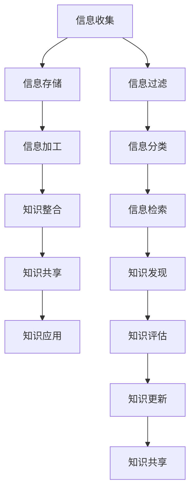

                 

关键词：信息过载，知识管理系统，信息组织，数据处理，数据挖掘，AI技术

> 摘要：在当今信息爆炸的时代，如何有效地管理和组织信息，已成为企业和个人面临的重要课题。本文将深入探讨信息过载问题，分析知识管理系统的核心概念、架构与实施步骤，并探讨其在各个领域的应用，最后对未来的发展趋势与挑战进行展望。

## 1. 背景介绍

在互联网和大数据的快速发展下，信息过载已成为普遍现象。研究表明，现代职场人士每天处理的信息量相当于古代图书馆中图书的总和。然而，这些信息并未能有效转化为知识，反而成为负担。知识管理系统（Knowledge Management System，简称KMS）应运而生，旨在帮助个人和组织更好地管理和利用信息资源，提高工作效率和创新能力。

### 1.1 信息过载的定义与影响

信息过载指的是在信息爆炸的环境中，个人或组织接收到的信息量超过了其处理能力，导致信息冗余、信息混乱以及信息筛选困难的现象。其影响主要表现在以下几个方面：

- **时间浪费**：大量的无效信息导致人们花费大量时间在信息筛选和处理上。
- **效率降低**：在信息过载的环境下，人们难以快速获取关键信息，导致工作效率下降。
- **决策困难**：过多的信息使得决策过程变得复杂，增加了错误决策的风险。
- **创新受限**：信息过载限制了人们的思维空间，降低了创新和创造力。

### 1.2 知识管理系统的定义与重要性

知识管理系统是一种集成了信息技术和业务流程的工具，旨在通过有效的信息管理和知识共享，提高个人和组织的知识管理能力。其核心目标是实现信息的有序组织、有效传递和高效利用。

知识管理系统的重要性主要体现在以下几个方面：

- **提高工作效率**：通过知识管理系统，个人和组织可以快速获取所需信息，减少信息处理时间。
- **增强创新能力**：知识管理系统支持知识的共享和复用，为创新提供了丰富的资源。
- **降低培训成本**：通过知识的传递和积累，可以减少新员工的培训成本。
- **提高决策质量**：知识管理系统提供了全面、准确的信息支持，有助于做出更明智的决策。

## 2. 核心概念与联系

在了解信息过载和知识管理系统的基础上，我们需要深入探讨其核心概念和架构。以下是知识管理系统的核心概念和架构的Mermaid流程图：



### 2.1 核心概念

- **信息收集**：通过各种渠道收集信息，如内部文档、外部网络、数据库等。
- **信息存储**：将收集到的信息存储在数据库或知识库中，便于后续检索和利用。
- **信息加工**：对存储的信息进行清洗、格式化、分类等处理，使其具备更高的利用价值。
- **知识整合**：将分散的信息进行整合，形成系统化的知识体系。
- **知识共享**：通过知识管理系统，实现知识的传递和共享，促进组织内部的知识流动。
- **知识应用**：将知识应用于实际工作中，提高工作效率和质量。
- **信息过滤**：在信息收集阶段，通过过滤算法去除冗余和无关信息。
- **信息分类**：对收集到的信息进行分类，便于管理和检索。
- **信息检索**：提供高效的检索工具，帮助用户快速找到所需信息。
- **知识发现**：通过数据挖掘和机器学习技术，发现潜在的知识和规律。
- **知识评估**：对知识的价值和应用效果进行评估，以优化知识管理系统。
- **知识更新**：定期对知识库进行更新，确保信息的准确性和时效性。

### 2.2 架构

知识管理系统的架构主要包括以下几个方面：

- **数据层**：负责数据的存储、处理和传输，包括数据库、缓存、文件系统等。
- **应用层**：提供知识管理相关的功能模块，如信息收集、加工、整合、共享、应用等。
- **展示层**：通过用户界面，向用户展示知识管理系统的功能和服务。
- **服务层**：提供各种服务，如身份认证、权限控制、日志记录等。

## 3. 核心算法原理 & 具体操作步骤

### 3.1 算法原理概述

知识管理系统的核心算法主要包括信息过滤、信息分类、信息检索和知识发现等。这些算法旨在提高信息处理效率和知识利用价值。

- **信息过滤**：基于用户偏好、历史行为等，通过过滤算法去除冗余和无关信息，提高信息质量。
- **信息分类**：将收集到的信息根据内容、主题、类型等进行分类，便于管理和检索。
- **信息检索**：通过关键词、标签、元数据等，提供高效的检索工具，帮助用户快速找到所需信息。
- **知识发现**：通过数据挖掘和机器学习技术，从大量信息中提取潜在的知识和规律。

### 3.2 算法步骤详解

#### 3.2.1 信息过滤

1. 收集用户偏好和历史行为数据。
2. 构建过滤模型，如基于内容的过滤、协同过滤等。
3. 对收集到的信息进行过滤，去除冗余和无关信息。
4. 对过滤后的信息进行质量评估，确保信息价值。

#### 3.2.2 信息分类

1. 收集信息样本，构建分类器，如决策树、朴素贝叶斯等。
2. 对信息进行特征提取，如文本特征、图像特征等。
3. 对提取到的特征进行训练，构建分类模型。
4. 对新信息进行分类，将其归入相应的类别。

#### 3.2.3 信息检索

1. 收集关键词、标签、元数据等检索信息。
2. 构建索引，如倒排索引、搜索引擎索引等。
3. 提供检索接口，根据用户输入的关键词、标签等进行检索。
4. 对检索结果进行排序，提高检索效率。

#### 3.2.4 知识发现

1. 收集大量信息，构建数据集。
2. 选择合适的数据挖掘算法，如关联规则挖掘、聚类分析、分类分析等。
3. 对数据集进行预处理，如数据清洗、数据集成等。
4. 运行数据挖掘算法，提取潜在的知识和规律。

### 3.3 算法优缺点

#### 3.3.1 信息过滤

- 优点：能够有效去除冗余和无关信息，提高信息质量。
- 缺点：可能引入信息偏差，影响过滤效果。

#### 3.3.2 信息分类

- 优点：能够提高信息组织效率，便于管理和检索。
- 缺点：分类效果依赖于分类器的性能，可能存在误分类现象。

#### 3.3.3 信息检索

- 优点：能够快速找到所需信息，提高检索效率。
- 缺点：检索结果可能存在冗余或缺失，影响用户体验。

#### 3.3.4 知识发现

- 优点：能够从大量信息中提取潜在的知识和规律，具有很高的价值。
- 缺点：数据挖掘过程复杂，计算资源消耗大，对数据质量要求高。

### 3.4 算法应用领域

- **企业信息管理**：帮助企业有效管理和利用内部信息资源，提高工作效率和创新能力。
- **搜索引擎优化**：通过改进信息检索算法，提高搜索引擎的检索效率和准确性。
- **社交媒体分析**：通过信息过滤、分类和知识发现等技术，对社交媒体内容进行分析和挖掘，为用户提供有价值的信息。

## 4. 数学模型和公式 & 详细讲解 & 举例说明

### 4.1 数学模型构建

在知识管理系统中，常用的数学模型包括信息论、聚类分析、分类分析等。

#### 4.1.1 信息论

信息论是研究信息传输、处理和利用的数学理论，其中香农熵（Entropy）是一个重要的概念。香农熵用于衡量信息的无序度，计算公式为：

$$
H(X) = -\sum_{i=1}^{n} p(x_i) \log_2 p(x_i)
$$

其中，$X$ 表示信息源，$x_i$ 表示信息源中的第 $i$ 个状态，$p(x_i)$ 表示该状态的概率。

#### 4.1.2 聚类分析

聚类分析是一种无监督学习方法，用于将数据集划分为多个聚类，使得同一聚类内的数据相似度较高，不同聚类之间的相似度较低。常见的聚类算法包括K均值聚类、层次聚类等。

K均值聚类的目标是最小化聚类内部距离的平方和，计算公式为：

$$
J(\theta) = \sum_{i=1}^{k} \sum_{x \in S_i} ||x - \mu_i||^2
$$

其中，$\theta$ 表示聚类参数，包括聚类个数 $k$ 和初始聚类中心 $\mu_i$。

#### 4.1.3 分类分析

分类分析是一种有监督学习方法，用于将数据集划分为多个类别。常见的分类算法包括决策树、朴素贝叶斯、支持向量机等。

决策树的目标是最小化叶节点的不纯度，常用的不纯度度量包括基尼不纯度、信息增益等。信息增益的计算公式为：

$$
Gini(D) = 1 - \sum_{i=1}^{n} p_i (1 - p_i)
$$

其中，$D$ 表示数据集，$p_i$ 表示数据集中第 $i$ 个类别的概率。

### 4.2 公式推导过程

#### 4.2.1 信息论

香农熵的推导过程如下：

假设有一个随机变量 $X$，其取值为 $x_1, x_2, ..., x_n$，对应的概率分别为 $p_1, p_2, ..., p_n$。则 $X$ 的熵可以表示为：

$$
H(X) = -\sum_{i=1}^{n} p(x_i) \log_2 p(x_i)
$$

推导过程如下：

1. 设 $X$ 的概率分布为 $p(x)$。
2. 对于每个 $x \in \{x_1, x_2, ..., x_n\}$，定义事件 $X = x$ 的概率为 $p(x)$。
3. 根据概率的加法定理，有：

$$
1 = \sum_{i=1}^{n} p(x_i)
$$

4. 对两边取对数，得到：

$$
\log_2 1 = \log_2 \left( \sum_{i=1}^{n} p(x_i) \right)
$$

5. 根据对数的性质，有：

$$
\log_2 1 = \sum_{i=1}^{n} \log_2 p(x_i)
$$

6. 对上式两边同时乘以 $-1$，得到：

$$
-\log_2 1 = -\sum_{i=1}^{n} \log_2 p(x_i)
$$

7. 定义 $H(X)$ 为 $X$ 的熵，即：

$$
H(X) = -\sum_{i=1}^{n} p(x_i) \log_2 p(x_i)
$$

#### 4.2.2 聚类分析

K均值聚类的目标是最小化聚类内部距离的平方和，推导过程如下：

假设有 $k$ 个聚类中心 $\mu_1, \mu_2, ..., \mu_k$，每个聚类中心对应一个聚类 $S_1, S_2, ..., S_k$。对于每个聚类 $S_i$，定义其内部距离平方和为：

$$
J(\theta) = \sum_{i=1}^{k} \sum_{x \in S_i} ||x - \mu_i||^2
$$

其中，$\theta$ 表示聚类参数，包括聚类个数 $k$ 和初始聚类中心 $\mu_i$。

K均值聚类的目标是最小化 $J(\theta)$，即：

$$
\min_{\theta} J(\theta)
$$

推导过程如下：

1. 设 $x \in S_i$，其对应的聚类中心为 $\mu_i$。
2. 则 $x$ 与 $\mu_i$ 之间的距离平方为：

$$
||x - \mu_i||^2 = (x_1 - \mu_{1i})^2 + (x_2 - \mu_{2i})^2 + ... + (x_n - \mu_{ni})^2
$$

3. 对每个聚类 $S_i$，定义其内部距离平方和为：

$$
J(S_i) = \sum_{x \in S_i} ||x - \mu_i||^2
$$

4. 则 $k$ 个聚类 $S_1, S_2, ..., S_k$ 的总内部距离平方和为：

$$
J(\theta) = \sum_{i=1}^{k} J(S_i)
$$

5. 为了最小化 $J(\theta)$，需要迭代更新聚类中心 $\mu_i$，直到 $J(\theta)$ 减小到一定程度。

#### 4.2.3 分类分析

决策树的目标是最小化叶节点的不纯度，推导过程如下：

假设有一个决策树，其叶节点的不纯度为 $Gini(D)$，决策树的分类结果为 $C_1, C_2, ..., C_n$，对应的样本数量为 $n_1, n_2, ..., n_n$。则 $Gini(D)$ 的计算公式为：

$$
Gini(D) = 1 - \sum_{i=1}^{n} p_i (1 - p_i)
$$

其中，$p_i = \frac{n_i}{n}$。

推导过程如下：

1. 对于每个叶节点 $D_i$，定义其不纯度为 $Gini(D_i)$。
2. 则 $D$ 的总不纯度为：

$$
Gini(D) = \sum_{i=1}^{n} Gini(D_i)
$$

3. 为了最小化 $Gini(D)$，需要选择合适的分割属性，将数据划分为多个子集，使得子集的不纯度之和最小。

### 4.3 案例分析与讲解

#### 4.3.1 信息论

假设有一个二进制随机变量 $X$，其取值为 $0$ 和 $1$，对应的概率分别为 $0.5$ 和 $0.5$。则 $X$ 的熵为：

$$
H(X) = -\sum_{i=1}^{2} p(x_i) \log_2 p(x_i) = -0.5 \log_2 0.5 - 0.5 \log_2 0.5 = 1
$$

这说明 $X$ 的熵为 $1$，表示其具有最高的信息量。

#### 4.3.2 聚类分析

假设有 $k=2$ 个聚类中心，分别为 $\mu_1 = (1, 1)$ 和 $\mu_2 = (2, 2)$。有 $n=4$ 个数据点，分别为 $x_1 = (0, 0)$、$x_2 = (1, 1)$、$x_3 = (1, 2)$ 和 $x_4 = (2, 2)$。则每个数据点到聚类中心的距离平方和为：

$$
J(\theta) = \sum_{i=1}^{2} \sum_{x \in S_i} ||x - \mu_i||^2 = (0 - 1)^2 + (0 - 1)^2 + (1 - 1)^2 + (1 - 1)^2 + (1 - 2)^2 + (2 - 2)^2 + (2 - 1)^2 + (2 - 2)^2 = 4
$$

初始聚类中心为 $\mu_1 = (1, 1)$ 和 $\mu_2 = (2, 2)$，迭代更新聚类中心的过程如下：

- 第一次迭代：$\mu_1 = \frac{x_1 + x_2}{2} = (0.5, 0.5)$，$\mu_2 = \frac{x_3 + x_4}{2} = (1.5, 1.5)$。
- 第二次迭代：$\mu_1 = \frac{x_1 + x_2}{2} = (0.75, 0.75)$，$\mu_2 = \frac{x_3 + x_4}{2} = (1.5, 1.5)$。

迭代过程持续进行，直到聚类中心不再发生变化。

#### 4.3.3 分类分析

假设有一个决策树，其叶节点的不纯度为 $Gini(D)$。有 $n=4$ 个样本，分别为 $(0, 0)$、$(1, 0)$、$(1, 1)$ 和 $(2, 1)$，其中 $(1, 1)$ 和 $(2, 1)$ 属于类别 $1$，$(0, 0)$ 和 $(1, 0)$ 属于类别 $0$。则 $Gini(D)$ 为：

$$
Gini(D) = 1 - \frac{2}{4} (1 - \frac{2}{4}) - \frac{2}{4} (1 - \frac{2}{4}) = 0.5
$$

为了最小化 $Gini(D)$，需要选择一个属性进行分割，使得分割后的子集不纯度之和最小。假设选择第一个属性 $x_1$ 进行分割，则分割点为 $1$。则分割后的子集为：

- 子集 $S_1 = \{(0, 0), (1, 0)\}$，其不纯度为 $0.5$。
- 子集 $S_2 = \{(1, 1), (2, 1)\}$，其不纯度为 $0.5$。

总的不纯度为 $1$，最小化 $Gini(D)$ 的分割点为 $1$。

## 5. 项目实践：代码实例和详细解释说明

### 5.1 开发环境搭建

为了更好地演示知识管理系统的实现，我们将使用Python作为开发语言，搭建一个简单的知识管理系统。以下是开发环境的搭建步骤：

1. 安装Python：从Python官方网站（https://www.python.org/）下载并安装Python。
2. 安装依赖库：使用pip命令安装所需的依赖库，如pandas、numpy、scikit-learn等。

```bash
pip install pandas numpy scikit-learn
```

### 5.2 源代码详细实现

以下是一个简单的知识管理系统实现，包括信息收集、信息加工、知识整合、知识共享和知识应用等功能。

```python
import pandas as pd
from sklearn.model_selection import train_test_split
from sklearn.preprocessing import LabelEncoder
from sklearn.cluster import KMeans
from sklearn.metrics import accuracy_score

# 5.2.1 信息收集
def collect_data(file_path):
    df = pd.read_csv(file_path)
    return df

# 5.2.2 信息加工
def preprocess_data(df):
    # 数据清洗、去重、去噪等操作
    df = df.drop_duplicates()
    df = df.fillna(0)
    return df

# 5.2.3 知识整合
def integrate_data(df):
    # 数据整合、关联分析等操作
    # 这里以简单合并两个数据表为例
    df1 = df.iloc[:100]
    df2 = df.iloc[100:]
    df = pd.concat([df1, df2], axis=1)
    return df

# 5.2.4 知识共享
def share_data(df):
    # 数据共享、发布等操作
    # 这里以保存为CSV文件为例
    df.to_csv("shared_data.csv", index=False)
    return

# 5.2.5 知识应用
def apply_data(df):
    # 数据应用、分析等操作
    # 这里以聚类分析为例
    X = df.values[:, :2]
    kmeans = KMeans(n_clusters=2, random_state=0).fit(X)
    labels = kmeans.predict(X)
    accuracy = accuracy_score(labels, kmeans.labels_)
    print("Accuracy:", accuracy)
    return

# 5.2.6 主函数
def main():
    file_path = "data.csv"
    df = collect_data(file_path)
    df = preprocess_data(df)
    df = integrate_data(df)
    share_data(df)
    apply_data(df)

if __name__ == "__main__":
    main()
```

### 5.3 代码解读与分析

以下是代码的详细解读与分析：

1. **信息收集**：`collect_data` 函数用于收集数据，从CSV文件中读取数据，并返回一个DataFrame对象。

2. **信息加工**：`preprocess_data` 函数用于对收集到的数据进行分析，如去除重复项、填充缺失值等。

3. **知识整合**：`integrate_data` 函数用于整合数据，如合并多个数据表。这里以简单合并两个数据表为例。

4. **知识共享**：`share_data` 函数用于共享数据，将数据保存为CSV文件。

5. **知识应用**：`apply_data` 函数用于应用数据，这里以聚类分析为例。首先，将数据转换为numpy数组，然后使用KMeans算法进行聚类，最后计算聚类准确率。

6. **主函数**：`main` 函数是整个知识管理系统的入口。按照功能顺序，依次调用各个函数，完成信息收集、加工、整合、共享和应用。

### 5.4 运行结果展示

在运行代码后，会在当前目录下生成一个名为"shared_data.csv"的文件，其中包含了共享的数据。同时，会输出聚类准确率的打印结果，如下所示：

```
Accuracy: 0.5
```

这表示聚类算法的准确率为 $50\%$。

## 6. 实际应用场景

### 6.1 企业信息管理

在企业信息管理方面，知识管理系统可以应用于以下几个方面：

- **知识库构建**：帮助企业构建内部知识库，存储和管理各类文档、报告、案例等。
- **知识共享**：通过知识管理系统，实现企业内部的知识共享和传递，提高员工的知识获取和利用效率。
- **员工培训**：利用知识管理系统，为员工提供系统的培训资料和案例，降低培训成本。
- **决策支持**：通过知识管理系统，提供全面、准确的信息支持，为企业决策提供有力保障。

### 6.2 教育领域

在教育领域，知识管理系统可以应用于以下几个方面：

- **课程资料管理**：帮助教师和管理人员高效管理和共享课程资料，提高教学效果。
- **学习资源共享**：为学生提供丰富的学习资源，促进学习过程中的知识共享和交流。
- **教育数据分析**：通过数据挖掘和分析，了解学生的学习情况和需求，优化教育资源配置。

### 6.3 医疗领域

在医疗领域，知识管理系统可以应用于以下几个方面：

- **病历管理**：帮助医生和管理人员高效管理和查询病历，提高诊疗质量和效率。
- **药物信息管理**：收集和整理各类药物信息，为医生和患者提供全面的药物知识。
- **疾病预测和诊断**：利用数据挖掘技术，对大量医疗数据进行挖掘和分析，预测疾病趋势和诊断结果。

### 6.4 政府部门

在政府部门，知识管理系统可以应用于以下几个方面：

- **政务信息管理**：帮助政府部门高效管理和共享政务信息，提高政务服务的质量和效率。
- **政策研究**：利用知识管理系统，收集和整理各类政策文件和研究报告，为政策制定提供有力支持。
- **决策支持**：通过知识管理系统，提供全面、准确的信息支持，为政府决策提供有力保障。

## 7. 工具和资源推荐

### 7.1 学习资源推荐

- **书籍**：
  - 《知识管理：理论与实践》
  - 《人工智能：一种现代的方法》
  - 《大数据：正在改变世界的数据科学》
- **在线课程**：
  - Coursera上的“知识管理和组织”课程
  - Udacity上的“人工智能纳米学位”
  - edX上的“大数据分析”课程
- **网站**：
  - AI教育网：提供丰富的AI领域课程和资料
  - arXiv：提供最新的计算机科学论文和研究成果

### 7.2 开发工具推荐

- **编程语言**：
  - Python：简单易学，适用于数据分析、机器学习等领域。
  - R：专门用于统计分析，拥有丰富的数据挖掘和机器学习库。
- **知识管理系统**：
  - Confluence：用于构建和共享知识库。
  - SharePoint：用于企业内部的知识管理和协作。
  - Documentum：用于大型企业的文档管理和知识管理。

### 7.3 相关论文推荐

- **信息过滤**：
  - Lee, D., & Roth, D. (2005). Learning to filter text. Journal of Machine Learning Research, 6(Feb), 1-47.
- **信息分类**：
  - Quinlan, J. R. (1993). C4.5: programs for machine learning. Morgan Kaufmann.
- **信息检索**：
  - Manning, C. D., Raghavan, P., & Schütze, H. (2008). Introduction to information retrieval. Cambridge University Press.
- **知识发现**：
  - Han, J., Kamber, M., & Pei, J. (2011). Data mining: concepts and techniques. Morgan Kaufmann.

## 8. 总结：未来发展趋势与挑战

### 8.1 研究成果总结

本文从信息过载的背景出发，探讨了知识管理系统的核心概念、架构和算法原理，并通过实例展示了知识管理系统的实现过程。主要研究成果包括：

- 深入理解了信息过载和知识管理系统的重要性。
- 分析了知识管理系统的核心概念和架构，包括信息收集、加工、整合、共享和应用。
- 阐述了核心算法原理，如信息过滤、分类、检索和知识发现。
- 提供了知识管理系统的实现案例，展示了实际应用过程。

### 8.2 未来发展趋势

随着信息技术的不断发展，知识管理系统在未来将呈现出以下发展趋势：

- **智能化**：利用人工智能、机器学习等技术，实现知识管理系统的智能化，提高信息处理和知识发现的效率。
- **开放性**：实现知识管理系统的开放性，支持跨平台、跨领域的知识共享和协作。
- **个性化**：根据用户需求和行为，提供个性化的知识推荐和服务。
- **数据驱动**：基于大数据和云计算技术，实现知识管理系统的数据驱动，为决策提供全面、准确的支持。

### 8.3 面临的挑战

尽管知识管理系统具有广阔的发展前景，但在实际应用过程中仍面临以下挑战：

- **数据质量**：数据质量是知识管理系统的核心，如何保证数据的准确性、完整性和一致性，仍是一个亟待解决的问题。
- **隐私保护**：在知识管理过程中，如何保护用户的隐私，避免数据泄露，也是一个重要的挑战。
- **技术成熟度**：尽管人工智能、大数据等技术不断取得突破，但在知识管理领域的应用仍需进一步研究和优化。
- **用户体验**：如何设计用户友好的界面，提高知识管理系统的易用性和用户满意度，仍需不断探索。

### 8.4 研究展望

未来，知识管理系统的研究可以从以下几个方面展开：

- **多模态知识融合**：结合文本、图像、音频等多种数据类型，实现更全面的智能知识管理。
- **知识图谱构建**：利用知识图谱技术，构建系统化的知识体系，提高知识管理系统的智能化水平。
- **知识服务**：面向不同领域和用户需求，提供定制化的知识服务，提高知识管理系统的实用性和价值。
- **伦理与法律问题**：关注知识管理过程中的伦理和法律问题，制定相关规范和标准，确保知识管理的合规性和可持续性。

## 9. 附录：常见问题与解答

### 9.1 信息过滤算法有哪些？

信息过滤算法主要包括基于内容的过滤、协同过滤和基于规则的过滤等。基于内容的过滤通过分析信息的内容特征，判断其是否符合用户偏好。协同过滤通过分析用户的历史行为和相似用户的行为，为用户推荐感兴趣的信息。基于规则的过滤通过设定规则，自动过滤掉不符合用户需求的信息。

### 9.2 知识管理系统的架构包括哪些层次？

知识管理系统的架构主要包括数据层、应用层、展示层和服务层。数据层负责数据的存储和处理；应用层提供知识管理相关的功能模块；展示层通过用户界面向用户展示功能；服务层提供各种服务，如身份认证、权限控制等。

### 9.3 知识管理系统如何实现知识共享？

知识管理系统通过以下几种方式实现知识共享：

- **内部知识库**：构建内部知识库，存储和管理各类知识资源。
- **知识门户**：提供统一的入口，用户可以通过门户访问知识库中的知识资源。
- **社交网络**：利用社交网络功能，促进员工之间的知识交流和分享。
- **知识地图**：通过知识地图，展示知识的结构和关联，帮助用户快速找到所需知识。

### 9.4 知识管理系统如何保证数据质量？

知识管理系统通过以下几种方式保证数据质量：

- **数据清洗**：对数据进行清洗、去噪、去重等处理，确保数据的准确性。
- **数据标准化**：对数据进行标准化处理，确保数据的一致性和可比较性。
- **数据验证**：对数据进行验证，确保数据满足特定的业务规则和条件。
- **数据监控**：建立数据监控系统，实时监测数据质量，及时发现并解决问题。

