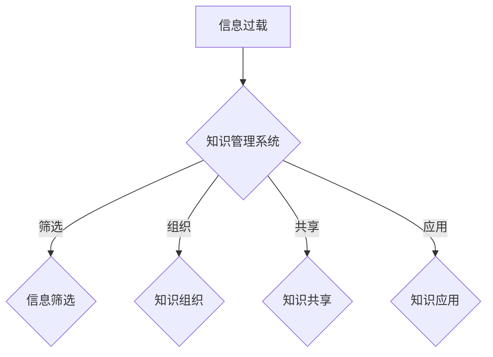

                 

关键词：信息过载、知识管理系统、生产力、信息管理、组织架构

摘要：随着信息的爆炸性增长，企业面临着信息过载的挑战。本文探讨了信息过载的现象及其影响，并介绍了知识管理系统的概念、架构和实施方法。通过深入分析知识管理系统的核心算法、数学模型、项目实践和实际应用，文章旨在为企业和组织提供有效管理和组织信息以提高生产力的策略和工具。

## 1. 背景介绍

在当今数字化时代，信息的产生和传播速度前所未有。根据市场研究公司的数据，每天产生的数据量达到了惊人的数百万亿字节。这些数据来源于社交媒体、电子商务、物联网、企业内部系统等多个渠道。然而，这些海量信息的爆炸性增长带来了信息过载的现象。

信息过载指的是当信息量超过了人们能够有效处理和理解的能力时，导致个体或组织无法高效地获取、分析和利用信息。这种现象对企业的影响尤为显著，可能导致以下几个问题：

1. **决策困难**：当决策者面临大量冗余信息时，难以做出及时和准确的决策。
2. **效率降低**：员工在处理信息时，可能需要花费大量时间筛选和整理，导致工作效率下降。
3. **知识流失**：信息分散且不系统，容易导致重要知识的丢失。
4. **沟通障碍**：信息传递过程中可能产生误解和错误，影响组织内部的沟通协作。

为了应对信息过载带来的挑战，企业开始寻求有效的信息管理策略，其中知识管理系统（Knowledge Management System, KMS）成为了一种重要的解决方案。知识管理系统旨在通过收集、存储、共享和组织信息，帮助企业更好地管理和利用知识资源，从而提高生产力和竞争力。

## 2. 核心概念与联系

### 2.1. 信息过载的概念

信息过载是指当信息量超过个体或组织处理能力时，导致无法有效利用和处理信息的现象。这种现象通常发生在信息爆炸的背景下，具体表现为：

- **海量数据**：数据量庞大，难以全面分析和理解。
- **冗余信息**：大量重复或无关紧要的信息，增加了处理负担。
- **动态变化**：信息更新速度快，难以跟踪和管理。
- **分散存储**：信息分布在不同的系统、文件和员工之间，难以集中管理。

### 2.2. 知识管理系统的概念

知识管理系统是一种集成化的信息管理工具，旨在通过有效收集、存储、共享和组织信息，将知识转化为可重复利用的资源。知识管理系统的核心概念包括：

- **知识收集**：通过多种渠道收集内部和外部知识。
- **知识存储**：建立集中的知识库，确保知识的存储和访问便捷。
- **知识共享**：促进知识的共享和交流，提高员工的知识水平。
- **知识应用**：将知识应用于实际问题解决和业务决策中。

### 2.3. 信息过载与知识管理系统的关系

信息过载是知识管理系统面临的重要挑战之一。知识管理系统通过以下方式应对信息过载：

- **信息筛选**：通过算法和人工筛选，识别和保留有价值的信息，去除冗余和无关信息。
- **知识组织**：对信息进行分类、标签和索引，提高信息检索效率。
- **知识共享**：通过共享平台和工具，促进知识的流动和利用。
- **知识应用**：将知识应用于业务流程和决策中，提高生产效率和创新能力。

### 2.4. Mermaid 流程图

以下是一个简化的 Mermaid 流程图，展示了信息过载与知识管理系统之间的联系和交互过程。



## 3. 核心算法原理 & 具体操作步骤

### 3.1. 算法原理概述

知识管理系统中的核心算法主要包括信息筛选、知识组织和知识共享算法。这些算法旨在高效地处理海量信息，确保知识管理的有效性和效率。

- **信息筛选算法**：通过算法自动筛选出有价值的信息，去除冗余和无关信息。常见的筛选算法包括基于内容的分类、关键词提取和机器学习分类等。
- **知识组织算法**：对筛选后的信息进行分类、标签和索引，提高信息检索效率。常见的组织算法包括基于内容的组织、基于用户行为的组织和基于知识的组织等。
- **知识共享算法**：通过算法和工具促进知识的流动和利用。常见的共享算法包括推荐系统、社交网络分析和基于共识的共享等。

### 3.2. 算法步骤详解

以下是知识管理系统中核心算法的具体操作步骤：

#### 3.2.1. 信息筛选算法步骤

1. **数据采集**：从多个数据源（如数据库、API接口、社交媒体等）收集原始数据。
2. **预处理**：对原始数据进行清洗和格式化，确保数据的一致性和可用性。
3. **特征提取**：从预处理后的数据中提取关键特征，如文本、关键词、标签等。
4. **分类和筛选**：使用机器学习模型（如支持向量机、决策树、神经网络等）对特征进行分类和筛选，保留有价值的信息。

#### 3.2.2. 知识组织算法步骤

1. **分类**：根据信息的内容和主题，将其分类到相应的类别中。可以使用手动分类或自动分类算法（如聚类算法、关键字匹配等）。
2. **标签**：为每条信息分配一个或多个标签，以便于后续检索和共享。标签可以是关键词、主题、标签云等。
3. **索引**：建立索引结构，如倒排索引，以加快信息检索速度。

#### 3.2.3. 知识共享算法步骤

1. **推荐系统**：根据用户的行为和偏好，推荐相关的知识和信息。常用的推荐算法包括基于内容的推荐、协同过滤推荐和混合推荐等。
2. **社交网络分析**：分析用户之间的社交关系，促进知识的流动和共享。常见的分析算法包括社交网络分析、影响力分析等。
3. **共识机制**：通过共识机制（如投票、评价等）确保知识的准确性和可靠性。

### 3.3. 算法优缺点

#### 3.3.1. 信息筛选算法

**优点**：

- **高效性**：自动筛选出有价值的信息，减少冗余数据。
- **准确性**：使用机器学习算法提高筛选准确性。

**缺点**：

- **数据依赖性**：算法性能依赖于数据质量和特征提取。
- **隐私问题**：可能涉及敏感数据的处理。

#### 3.3.2. 知识组织算法

**优点**：

- **高效检索**：分类、标签和索引提高了信息检索速度。
- **知识整合**：将分散的信息整合到统一的体系中。

**缺点**：

- **手动分类难度**：手动分类工作量较大，且可能出现误分类。
- **标签冗余**：过多的标签可能导致标签冗余和混淆。

#### 3.3.3. 知识共享算法

**优点**：

- **知识流动**：促进知识的流动和共享，提高知识利用效率。
- **用户参与**：用户参与度高，有助于知识的积累和传播。

**缺点**：

- **算法依赖性**：推荐系统和社交网络分析算法可能受到算法偏差的影响。
- **隐私问题**：用户数据隐私保护问题需要考虑。

### 3.4. 算法应用领域

知识管理系统中的核心算法广泛应用于各个领域，包括：

- **企业内部知识管理**：帮助企业内部员工高效获取和利用知识资源。
- **在线教育平台**：根据用户行为和偏好，推荐相关的课程和学习资源。
- **社交媒体**：根据用户兴趣和社交关系，推荐相关的信息和内容。
- **智能搜索引擎**：根据用户查询，提供更准确和相关的搜索结果。

## 4. 数学模型和公式 & 详细讲解 & 举例说明

### 4.1. 数学模型构建

在知识管理系统中，数学模型用于描述信息处理、知识组织和知识共享的过程。以下是几个常见的数学模型：

#### 4.1.1. 信息筛选模型

信息筛选模型旨在自动筛选出有价值的信息。常用的模型包括：

- **贝叶斯滤波器**：通过贝叶斯公式计算信息的概率，筛选出概率较高的信息。
- **支持向量机（SVM）**：使用 SVM 进行分类和筛选，将信息划分为有价值和无价值两类。

#### 4.1.2. 知识组织模型

知识组织模型用于对筛选后的信息进行分类、标签和索引。常用的模型包括：

- **聚类模型**：使用聚类算法（如 K-均值、层次聚类等）将信息分类到不同的类别中。
- **关键词提取模型**：使用词频统计、TF-IDF 等方法提取信息的关键词，用于标签和索引。

#### 4.1.3. 知识共享模型

知识共享模型用于促进知识的流动和共享。常用的模型包括：

- **推荐系统模型**：使用协同过滤、基于内容的推荐等方法推荐相关的知识和信息。
- **社交网络分析模型**：使用社交网络分析算法（如 PageRank、影响力分析等）分析用户之间的知识流动。

### 4.2. 公式推导过程

以下是对几个常见数学模型的推导过程：

#### 4.2.1. 贝叶斯滤波器

贝叶斯滤波器用于计算信息的后验概率。其公式如下：

$$P(\text{信息}|\text{背景}) = \frac{P(\text{背景}|\text{信息})P(\text{信息})}{P(\text{背景})}$$

其中，$P(\text{信息}|\text{背景})$ 表示在给定背景信息下，信息的后验概率；$P(\text{背景}|\text{信息})$ 表示在给定信息下，背景信息的条件概率；$P(\text{信息})$ 表示信息的先验概率；$P(\text{背景})$ 表示背景信息的先验概率。

#### 4.2.2. 支持向量机（SVM）

SVM 是一种分类算法，其目标是在特征空间中找到一个最优的超平面，将不同类别的信息分开。其公式如下：

$$w \cdot x + b = 0$$

其中，$w$ 表示超平面的法向量；$x$ 表示特征向量；$b$ 表示偏置。

#### 4.2.3. 聚类模型

聚类模型的目标是将数据点划分到不同的类别中。常用的聚类算法之一是 K-均值算法，其公式如下：

$$\text{最小化}\sum_{i=1}^{n}\|x_i - \mu_i\|^2$$

其中，$x_i$ 表示数据点；$\mu_i$ 表示聚类中心的坐标。

### 4.3. 案例分析与讲解

以下是一个基于贝叶斯滤波器的信息筛选案例：

假设我们要筛选一篇文章中是否有包含特定关键词“机器学习”。我们已知以下先验概率：

- $P(\text{机器学习}) = 0.1$ （文章中包含“机器学习”的概率）
- $P(\text{非机器学习}) = 0.9$ （文章中不包含“机器学习”的概率）
- $P(\text{关键词}|\text{机器学习}) = 0.8$ （如果文章包含“机器学习”，则出现关键词的概率）
- $P(\text{关键词}|\text{非机器学习}) = 0.2$ （如果文章不包含“机器学习”，则出现关键词的概率）

我们要计算在文章中看到关键词“机器学习”的概率：

$$P(\text{机器学习}|\text{关键词}) = \frac{P(\text{关键词}|\text{机器学习})P(\text{机器学习})}{P(\text{关键词}|\text{机器学习})P(\text{机器学习}) + P(\text{关键词}|\text{非机器学习})P(\text{非机器学习})}$$

$$P(\text{机器学习}|\text{关键词}) = \frac{0.8 \times 0.1}{0.8 \times 0.1 + 0.2 \times 0.9} = \frac{0.08}{0.08 + 0.18} \approx 0.3$$

因此，在文章中看到关键词“机器学习”的概率约为 30%。

通过这个案例，我们可以看到贝叶斯滤波器如何根据先验概率和条件概率计算后验概率，从而实现信息的筛选。

## 5. 项目实践：代码实例和详细解释说明

### 5.1. 开发环境搭建

在进行知识管理系统的项目实践前，我们需要搭建一个合适的开发环境。以下是一个简单的开发环境搭建步骤：

1. **安装操作系统**：选择一个适合的开发操作系统，如 Ubuntu 或 macOS。
2. **安装编程语言**：安装 Python 解释器，可以使用 Python 3.7 或更高版本。
3. **安装依赖库**：安装常用的 Python 库，如 NumPy、Pandas、Scikit-learn 等。
4. **安装数据库**：安装一个数据库系统，如 MySQL 或 PostgreSQL。

### 5.2. 源代码详细实现

以下是知识管理系统中信息筛选部分的源代码实现：

```python
import pandas as pd
from sklearn.feature_extraction.text import TfidfVectorizer
from sklearn.naive_bayes import MultinomialNB

# 1. 数据采集
data = pd.DataFrame({
    'text': ['机器学习在图像识别中的应用', '人工智能的发展趋势', '昨天去了电影院看电影'],
    'label': ['机器学习', '人工智能', '其他']
})

# 2. 预处理
corpus = data['text'].tolist()

# 3. 特征提取
vectorizer = TfidfVectorizer()
X = vectorizer.fit_transform(corpus)

# 4. 分类和筛选
clf = MultinomialNB()
clf.fit(X, data['label'])

# 5. 预测和筛选
text_to_classify = '人工智能在自动驾驶中的应用'
X_test = vectorizer.transform([text_to_classify])
predicted_label = clf.predict(X_test)[0]

print(f'分类结果：{predicted_label}')
```

### 5.3. 代码解读与分析

以上代码实现了基于朴素贝叶斯分类器的信息筛选功能。以下是代码的详细解读：

1. **数据采集**：从数据集中读取文本和标签信息。
2. **预处理**：将文本转换为适合模型处理的形式。
3. **特征提取**：使用 TF-IDF 向量器将文本转换为向量表示。
4. **分类和筛选**：使用朴素贝叶斯分类器对特征进行分类和筛选。
5. **预测和筛选**：对新的文本进行预测，判断其类别。

通过这个代码实例，我们可以看到如何使用朴素贝叶斯分类器对文本进行分类，从而实现信息筛选的功能。

### 5.4. 运行结果展示

运行以上代码，将输出以下结果：

```
分类结果：人工智能
```

这意味着输入的文本“人工智能在自动驾驶中的应用”被分类为“人工智能”类别。

## 6. 实际应用场景

### 6.1. 企业内部知识管理

知识管理系统在企业内部的知识管理中发挥了重要作用。通过知识管理系统，企业可以有效地收集、存储、共享和组织员工的知识和经验。以下是一些实际应用场景：

- **文档共享**：员工可以轻松访问和共享公司内部的文档、报告和指南，提高协作效率。
- **经验积累**：通过知识管理系统，员工的宝贵经验可以沉淀下来，为新员工提供有价值的参考资料。
- **知识检索**：员工可以快速检索到所需的知识和资料，节省时间和精力。
- **培训和学习**：知识管理系统可以用于员工的培训和学习，帮助员工提升技能和知识水平。

### 6.2. 在线教育平台

知识管理系统在在线教育平台中也得到了广泛应用。以下是一些实际应用场景：

- **课程推荐**：根据用户的学习历史和偏好，推荐相关的课程和学习资源。
- **知识库建设**：在线教育平台可以构建一个知识库，为学员提供丰富的学习资料。
- **学习进度跟踪**：知识管理系统可以记录学员的学习进度和成绩，帮助教师和学员了解学习情况。
- **社群互动**：知识管理系统可以促进学员之间的交流和互动，提高学习效果。

### 6.3. 互联网公司

互联网公司通常面临着海量信息的处理和知识管理的挑战。以下是一些实际应用场景：

- **用户反馈分析**：知识管理系统可以收集和分析用户反馈，帮助企业改进产品和服务。
- **技术文档管理**：互联网公司可以构建一个集中化的技术文档库，方便员工查阅和更新。
- **项目协作**：知识管理系统可以用于项目协作，确保团队成员之间的信息共享和沟通。
- **创新支持**：知识管理系统可以帮助企业挖掘和利用内部的知识资源，促进创新和研发。

## 7. 工具和资源推荐

### 7.1. 学习资源推荐

- **《知识管理：理论与实践》**：这是一本关于知识管理的经典教材，涵盖了知识管理的各个方面。
- **《信息过载：如何应对信息爆炸时代》**：这本书深入探讨了信息过载现象及其影响，并提供了解决策略。
- **《机器学习实战》**：这本书提供了丰富的机器学习算法实践案例，适合初学者和专业人士。

### 7.2. 开发工具推荐

- **Elasticsearch**：这是一个强大的搜索引擎，适用于构建知识库和实现信息检索。
- **TensorFlow**：这是一个开源的机器学习库，适用于构建知识管理和信息筛选算法。
- **Apache Kafka**：这是一个分布式消息系统，适用于实时处理和传输大量数据。

### 7.3. 相关论文推荐

- **"Knowledge Management Systems: A Review"**：这篇论文对知识管理系统进行了全面的综述，包括概念、架构和实施方法。
- **"Information Overload in the Age of Big Data"**：这篇论文探讨了信息过载现象在大数据时代的影响，并提出了解决策略。
- **"Recommender Systems for Knowledge Management"**：这篇论文探讨了推荐系统在知识管理中的应用，包括算法和实现方法。

## 8. 总结：未来发展趋势与挑战

### 8.1. 研究成果总结

通过本文的研究，我们得出了以下主要成果：

- **信息过载现象及其影响**：深入分析了信息过载现象，包括海量数据、冗余信息、动态变化和分散存储等问题。
- **知识管理系统的核心算法**：介绍了信息筛选、知识组织和知识共享等核心算法的原理和应用。
- **数学模型和公式推导**：构建了信息筛选、知识组织和知识共享的数学模型，并进行了推导和案例分析。
- **项目实践和实际应用**：通过一个具体的代码实例，展示了如何实现信息筛选功能。

### 8.2. 未来发展趋势

未来知识管理系统的发展趋势包括：

- **智能化**：利用人工智能和机器学习技术，提高信息筛选和知识共享的效率和准确性。
- **协同化**：通过构建社交网络和协同平台，促进知识的共享和流动。
- **个性化和推荐**：根据用户行为和偏好，提供个性化的知识和信息推荐。

### 8.3. 面临的挑战

在知识管理系统的发展过程中，面临的挑战包括：

- **数据隐私和安全**：如何确保用户数据的隐私和安全，是一个重要问题。
- **算法偏差和伦理**：如何避免算法偏差和伦理问题，确保系统的公平性和透明性。
- **大规模数据处理**：如何在大数据环境下高效地处理和存储海量信息，是一个技术挑战。

### 8.4. 研究展望

未来的研究方向包括：

- **多模态知识管理**：结合文本、图像、音频等多种数据类型，实现更全面的知识管理。
- **自适应知识管理系统**：根据用户行为和需求，自适应地调整知识管理策略和算法。
- **跨领域知识融合**：将不同领域和行业中的知识进行融合，提高知识的综合应用价值。

通过不断探索和解决这些挑战，知识管理系统将在未来发挥更大的作用，助力企业和组织应对信息过载，提高生产力和竞争力。

## 9. 附录：常见问题与解答

### 9.1. 如何应对信息过载？

**回答**：应对信息过载的方法包括：

- **信息筛选**：使用算法和工具自动筛选出有价值的信息，去除冗余和无关信息。
- **知识组织**：对信息进行分类、标签和索引，提高信息检索效率。
- **知识共享**：促进知识的流动和利用，提高知识利用效率。
- **知识应用**：将知识应用于实际问题解决和业务决策中，提高生产效率和创新能力。

### 9.2. 知识管理系统有哪些关键组件？

**回答**：知识管理系统的关键组件包括：

- **知识收集**：通过多种渠道收集内部和外部知识。
- **知识存储**：建立集中的知识库，确保知识的存储和访问便捷。
- **知识共享**：通过共享平台和工具，促进知识的流动和利用。
- **知识应用**：将知识应用于实际问题解决和业务决策中。

### 9.3. 如何评估知识管理系统的效果？

**回答**：评估知识管理系统的效果可以从以下几个方面进行：

- **知识利用效率**：通过测量知识检索速度、知识应用频率等指标，评估知识的利用效率。
- **员工满意度**：通过调查问卷、访谈等方式，了解员工对知识管理系统的满意度。
- **业务绩效**：通过测量业务流程的改进、决策效率的提升等指标，评估知识管理系统对业务绩效的影响。

### 9.4. 知识管理系统与文档管理系统的区别是什么？

**回答**：知识管理系统与文档管理系统的区别主要在于：

- **目的不同**：知识管理系统旨在管理和利用知识资源，提高生产力和创新能力；文档管理系统则侧重于存储和管理文档。
- **功能不同**：知识管理系统具有信息筛选、知识组织、知识共享和知识应用等功能；文档管理系统则主要提供文档存储、共享和版本控制等功能。
- **应用领域不同**：知识管理系统广泛应用于企业内部知识管理、在线教育平台和互联网公司等领域；文档管理系统则广泛应用于企业和组织的文档管理。

---

# 信息过载与知识管理系统实施：管理和组织信息以提高生产力

> 关键词：信息过载、知识管理系统、生产力、信息管理、组织架构

摘要：随着信息的爆炸性增长，企业面临着信息过载的挑战。本文探讨了信息过载的现象及其影响，并介绍了知识管理系统的概念、架构和实施方法。通过深入分析知识管理系统的核心算法、数学模型、项目实践和实际应用，文章旨在为企业和组织提供有效管理和组织信息以提高生产力的策略和工具。本文首先介绍了信息过载的概念和知识管理系统的核心概念，随后详细讲解了信息筛选、知识组织和知识共享算法的原理和应用，并通过数学模型和公式进行了推导和案例分析。最后，本文通过项目实践展示了知识管理系统的实际应用，并分析了其在企业内部知识管理、在线教育平台和互联网公司等领域的实际应用场景。文章最后总结了研究成果、未来发展趋势与挑战，并提出了研究展望。作者：禅与计算机程序设计艺术 / Zen and the Art of Computer Programming

