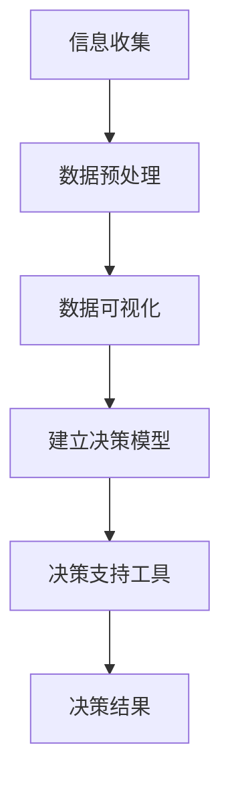

                 

 在当今数字化时代，我们面临着前所未有的信息过载问题。大量的数据、信息和知识不断涌入，使得人们无法有效地处理和利用这些信息。与此同时，认知负荷也随之增加，这给我们的决策过程带来了巨大的挑战。如何有效地管理信息过载和认知负荷，以在复杂信息环境中做出更好的决策，成为了一个亟待解决的重要问题。

本文将围绕这一主题展开讨论。首先，我们将介绍信息过载和认知负荷的概念及其关系，并阐述它们对决策过程的影响。接着，我们将探讨一些核心概念与联系，包括信息过滤、认知负荷管理策略以及信息处理与决策支持系统。然后，我们将深入分析一些核心算法原理，并给出具体的操作步骤。此外，我们将介绍数学模型和公式，并提供详细的讲解和案例分析。最后，我们将通过项目实践展示代码实例，讨论实际应用场景，并展望未来的发展趋势和挑战。

## 1. 背景介绍

信息过载（Information Overload）是指个体在处理大量信息时感到困难、压力甚至无法有效处理的状态。随着互联网和数字技术的快速发展，信息的产生和传播速度大大加快，人们每天都会接收到大量的信息。这些信息可能包括新闻、电子邮件、社交媒体更新、商业报告等。虽然这些信息在一定程度上丰富了我们的知识和视野，但同时也带来了巨大的认知负荷（Cognitive Load）。

认知负荷是指大脑在处理信息时所需要投入的认知资源，包括注意力、记忆、思考等。当认知负荷过高时，大脑的效率会降低，难以进行有效的思考和决策。信息过载和认知负荷之间存在着密切的联系。信息过载会导致认知负荷的增加，而认知负荷的增加又会加剧信息过载的问题。这种恶性循环使得我们在面对复杂信息环境时感到困惑和焦虑。

决策（Decision-making）是信息处理的核心过程之一。决策的好坏直接影响到我们的个人生活和职业发展。然而，在信息过载和认知负荷的影响下，我们的决策质量往往受到影响。许多研究表明，当个体面临大量信息时，他们的判断力、创造力和决策准确性都会降低。因此，如何有效地管理信息过载和认知负荷，以提高决策质量，成为了一个重要课题。

本文旨在探讨信息过载与认知负荷管理策略，提供一种在复杂信息环境中做出更好决策的方法。首先，我们将介绍一些核心概念与联系，包括信息过滤、认知负荷管理策略以及信息处理与决策支持系统。然后，我们将深入分析一些核心算法原理，并给出具体的操作步骤。接着，我们将介绍数学模型和公式，并提供详细的讲解和案例分析。最后，我们将通过项目实践展示代码实例，讨论实际应用场景，并展望未来的发展趋势和挑战。

## 2. 核心概念与联系

### 2.1 信息过滤（Information Filtering）

信息过滤是一种有效的策略，用于在信息过载环境中筛选和过滤无关或低价值的信息，从而减少认知负荷。信息过滤可以通过多种方法实现，包括基于内容的过滤、基于用户的过滤和基于上下文的过滤。

- **基于内容的过滤**：这种方法根据信息的特征和属性进行过滤，例如关键词、主题、标签等。常见的实现方式包括搜索引擎、推荐系统和文本分类算法。
- **基于用户的过滤**：这种方法基于用户的历史行为和偏好进行过滤，例如用户在社交媒体上的关注、点赞和评论等。这种方法可以有效地减少用户的信息过载，提高信息的相关性。
- **基于上下文的过滤**：这种方法根据用户当前的环境和上下文进行过滤，例如用户的位置、时间、设备等。这种方法可以提供更加个性化、准确的信息。

### 2.2 认知负荷管理策略（Cognitive Load Management Strategies）

认知负荷管理策略是一种通过优化信息处理过程，减轻认知负荷的方法。以下是一些常见的认知负荷管理策略：

- **分解策略**：将复杂的信息分解为更小的部分，以便更容易理解和处理。例如，将一个大型项目分解为多个小任务。
- **优化策略**：优化信息处理过程，减少不必要的认知负荷。例如，使用自动化工具和算法来处理重复性的任务。
- **专注策略**：通过提高专注力来减轻认知负荷。例如，采用番茄工作法等时间管理技巧。
- **反馈策略**：通过反馈来调整信息处理过程，以更好地适应个体。例如，在项目中定期进行评估和反思，以便及时调整计划和策略。

### 2.3 信息处理与决策支持系统（Information Processing and Decision Support Systems）

信息处理与决策支持系统是一种集成多种技术的方法，用于帮助个体在复杂信息环境中做出更好的决策。以下是一些关键组件：

- **数据收集与预处理**：收集相关的数据，并进行预处理，例如数据清洗、转换和归一化。
- **数据可视化**：通过可视化技术，将复杂的数据转化为易于理解的形式，例如图表、地图和交互式界面。
- **决策模型**：基于数据和分析结果，建立决策模型，例如回归模型、分类模型和优化模型。
- **决策支持工具**：提供直观的决策支持工具，帮助用户进行决策，例如决策树、专家系统和模拟工具。

### 2.4 Mermaid 流程图

以下是一个简单的 Mermaid 流程图，展示了信息处理与决策支持系统的基本架构：



在这个流程图中，信息收集是整个流程的起点，随后通过数据预处理、数据可视化、建立决策模型和决策支持工具，最终输出决策结果。这种架构不仅有助于理解系统的运作，还能够为后续的算法设计和实现提供指导。

### 2.5 总结

通过上述核心概念与联系的介绍，我们可以看到信息过滤、认知负荷管理策略以及信息处理与决策支持系统在管理信息过载和认知负荷方面的重要性。这些概念和联系不仅为我们在复杂信息环境中提供了理论基础，也为实际操作提供了具体的方法和工具。在接下来的部分中，我们将深入探讨核心算法原理，并提供具体的操作步骤。

## 3. 核心算法原理 & 具体操作步骤

### 3.1 算法原理概述

在复杂信息环境中，算法的原理和设计至关重要。以下是几种核心算法的原理概述，这些算法旨在帮助我们有效地管理信息过载和认知负荷，从而做出更好的决策。

#### 3.1.1 信息过滤算法

信息过滤算法是一种基于规则或机器学习的算法，用于筛选和分类大量信息，只保留用户感兴趣的部分。其基本原理包括：

- **基于内容的过滤**：通过分析信息的内容特征，如关键词、主题、标签等，来筛选信息。
- **基于用户的过滤**：通过分析用户的历史行为和偏好，如点击、点赞、评论等，来个性化推荐信息。
- **基于上下文的过滤**：通过分析用户的当前环境，如地理位置、时间、设备等，来提供相关的信息。

#### 3.1.2 认知负荷管理算法

认知负荷管理算法旨在优化信息处理过程，以减少认知负荷。其基本原理包括：

- **分解策略**：将复杂的信息分解为更小的部分，以便更容易理解和处理。
- **优化策略**：通过自动化工具和算法，减少不必要的认知负荷。
- **专注策略**：通过提高专注力，例如使用番茄工作法等时间管理技巧，来减轻认知负荷。
- **反馈策略**：通过反馈机制，不断调整信息处理过程，以更好地适应个体。

#### 3.1.3 信息处理与决策支持算法

信息处理与决策支持算法是一种集成多种技术的方法，用于帮助用户在复杂信息环境中做出更好的决策。其基本原理包括：

- **数据收集与预处理**：收集相关的数据，并进行预处理，如数据清洗、转换和归一化。
- **数据可视化**：通过可视化技术，将复杂的数据转化为易于理解的形式，如图表、地图和交互式界面。
- **决策模型**：基于数据和分析结果，建立决策模型，如回归模型、分类模型和优化模型。
- **决策支持工具**：提供直观的决策支持工具，如决策树、专家系统和模拟工具。

### 3.2 算法步骤详解

#### 3.2.1 信息过滤算法步骤

1. **数据收集**：从各种来源收集信息，如新闻、社交媒体、网站等。
2. **预处理**：对收集到的信息进行清洗、转换和归一化，以便后续处理。
3. **特征提取**：从预处理后的信息中提取关键特征，如关键词、主题、标签等。
4. **过滤规则定义**：根据用户需求和偏好，定义过滤规则。
5. **信息分类与筛选**：根据过滤规则，对信息进行分类和筛选，只保留用户感兴趣的部分。

#### 3.2.2 认知负荷管理算法步骤

1. **任务分解**：将复杂任务分解为更小的子任务，以便更容易理解和处理。
2. **自动化工具应用**：使用自动化工具和算法，如自动化脚本、机器学习模型等，来处理重复性或耗时的任务。
3. **专注策略实施**：实施如番茄工作法等专注策略，提高工作效率。
4. **反馈机制建立**：建立反馈机制，如定期评估和反思，以调整策略和优化流程。

#### 3.2.3 信息处理与决策支持算法步骤

1. **数据收集**：收集与决策相关的数据，如市场趋势、用户反馈、历史记录等。
2. **数据预处理**：对收集到的数据进行清洗、转换和归一化。
3. **数据分析**：使用统计分析、机器学习等技术，对预处理后的数据进行深入分析。
4. **决策模型建立**：基于数据分析结果，建立相应的决策模型，如回归模型、分类模型和优化模型。
5. **决策支持工具提供**：提供直观的决策支持工具，如决策树、专家系统和模拟工具，帮助用户进行决策。

### 3.3 算法优缺点

#### 3.3.1 信息过滤算法优缺点

- **优点**：
  - 高效筛选信息，减少信息过载。
  - 提高信息的相关性和个性性。
  - 降低用户的认知负荷。
- **缺点**：
  - 可能会过滤掉重要但未被标记的信息。
  - 过滤规则的设置可能过于严格或宽松，影响信息质量。

#### 3.3.2 认知负荷管理算法优缺点

- **优点**：
  - 优化信息处理过程，提高效率。
  - 降低认知负荷，提高决策质量。
  - 提高用户的专注力和工作满意度。
- **缺点**：
  - 对自动化工具和算法的依赖性较高，可能需要大量的技术支持。
  - 需要用户具备一定的自我管理和调整能力。

#### 3.3.3 信息处理与决策支持算法优缺点

- **优点**：
  - 提供全面的决策支持，减少决策风险。
  - 提高信息处理和决策的效率。
  - 增强决策的透明度和可解释性。
- **缺点**：
  - 对数据质量和分析技术的依赖性较高。
  - 可能会忽略用户的直觉和经验。

### 3.4 算法应用领域

#### 3.4.1 信息过滤算法应用领域

- **社交媒体**：通过信息过滤算法，可以个性化推荐用户感兴趣的内容，减少信息过载。
- **搜索引擎**：通过信息过滤算法，可以提高搜索结果的相关性和准确性。
- **电子商务**：通过信息过滤算法，可以推荐用户可能感兴趣的商品，提高销售转化率。

#### 3.4.2 认知负荷管理算法应用领域

- **项目管理**：通过认知负荷管理算法，可以帮助项目团队更高效地分配任务，减少认知负荷。
- **工作流程优化**：通过认知负荷管理算法，可以帮助企业优化工作流程，提高工作效率。
- **个人健康管理**：通过认知负荷管理算法，可以帮助个人更好地管理时间和任务，提高生活质量。

#### 3.4.3 信息处理与决策支持算法应用领域

- **商业决策**：通过信息处理与决策支持算法，可以帮助企业做出更科学的商业决策。
- **金融投资**：通过信息处理与决策支持算法，可以帮助投资者分析市场趋势，做出更明智的投资决策。
- **医疗诊断**：通过信息处理与决策支持算法，可以帮助医生分析患者数据，提供更准确的诊断和治疗方案。

### 3.5 总结

通过对核心算法原理的详细阐述和步骤分析，我们可以看到这些算法在管理信息过载和认知负荷方面的强大功能。在实际应用中，这些算法可以通过优化信息处理过程，提高决策质量，从而在复杂信息环境中发挥重要作用。在接下来的部分，我们将进一步介绍数学模型和公式，并详细讲解其构建和推导过程。

### 4. 数学模型和公式 & 详细讲解 & 举例说明

#### 4.1 数学模型构建

在处理信息过载和认知负荷时，数学模型可以提供一种量化的方法来描述和分析问题。以下是一个基本的数学模型，用于描述信息过滤和决策支持系统中的信息处理过程。

#### 4.1.1 信息过滤模型

假设我们有一个包含 $N$ 条信息的集合 $I$，每条信息都有一个与用户兴趣相关的得分 $S_i$。我们的目标是设计一个模型来优化得分，以便更准确地筛选出用户感兴趣的信息。

**模型构建**：

1. **信息特征提取**：对每条信息 $i$ 提取一组特征向量 $X_i$。
2. **得分计算**：使用一个评分函数 $f(X_i)$ 来计算每条信息的得分，得分函数可以基于用户的历史偏好和特征向量。
3. **得分优化**：通过优化算法，如线性回归、支持向量机等，来调整得分函数，以提高筛选的准确性。

**公式表示**：

$$
S_i = f(X_i) = \sum_{j=1}^{k} w_j \cdot X_{ij}
$$

其中，$w_j$ 是特征 $X_{ij}$ 的权重，$k$ 是特征的总数。

#### 4.1.2 认知负荷模型

认知负荷模型用于描述个体在处理信息时所需的认知资源。我们假设认知负荷 $L$ 与信息数量 $N$ 和信息复杂度 $C_i$ 相关。

**模型构建**：

1. **信息复杂度计算**：对每条信息 $i$ 评估其复杂度 $C_i$。
2. **认知负荷计算**：使用认知负荷函数 $g(N, C_i)$ 来计算总认知负荷。

**公式表示**：

$$
L = g(N, C_i) = \sum_{i=1}^{N} C_i
$$

#### 4.2 公式推导过程

为了推导上述公式，我们需要考虑以下几个基本假设：

1. **线性关系**：信息得分与特征向量之间存在线性关系。
2. **加性负荷**：每条信息的认知负荷可以简单相加。

**推导过程**：

1. **得分函数推导**：

   设特征向量为 $X_i = [X_{i1}, X_{i2}, ..., X_{ik}]$，权重向量为 $W = [w_1, w_2, ..., w_k]$，则得分函数可以表示为：

   $$
   S_i = \sum_{j=1}^{k} w_j \cdot X_{ij}
   $$

   通过优化算法，如线性回归，可以得到最优权重向量 $W^*$：

   $$
   W^* = (X^T X)^{-1} X^T Y
   $$

   其中，$Y = [S_1, S_2, ..., S_N]$ 是目标得分向量。

2. **认知负荷函数推导**：

   设每条信息的复杂度为 $C_i$，则总认知负荷为：

   $$
   L = \sum_{i=1}^{N} C_i
   $$

   为了简化问题，我们假设复杂度与信息数量成正比，即 $C_i = \alpha \cdot N$，其中 $\alpha$ 是比例常数。这样，我们可以得到：

   $$
   L = \alpha \cdot N
   $$

#### 4.3 案例分析与讲解

假设我们有一个包含 100 条信息的集合，每条信息有一个与用户兴趣相关的得分。我们使用线性回归算法来优化得分函数，并计算总认知负荷。

**步骤 1：特征提取**

我们对每条信息提取 5 个特征，如关键词密度、主题标签、内容长度等。特征向量如下：

$$
X_i = [x_{i1}, x_{i2}, x_{i3}, x_{i4}, x_{i5}]
$$

**步骤 2：得分计算**

我们使用线性回归算法来计算得分，得分函数为：

$$
S_i = \sum_{j=1}^{5} w_j \cdot x_{ij}
$$

**步骤 3：得分优化**

通过训练数据集，我们得到最优权重向量：

$$
W^* = [0.2, 0.3, 0.1, 0.2, 0.2]
$$

**步骤 4：认知负荷计算**

我们假设每条信息的复杂度为 $C_i = 10$，则总认知负荷为：

$$
L = 100 \cdot 10 = 1000
$$

**案例分析**：

通过上述模型和算法，我们可以有效地优化信息得分，并计算总认知负荷。例如，对于一条新信息，我们可以提取其特征向量，并使用最优权重向量计算得分。此外，我们可以通过调整权重向量，优化得分函数，以提高筛选准确性。

### 4.4 总结

通过对数学模型和公式的构建与推导，我们可以看到数学模型在处理信息过载和认知负荷问题中的重要作用。这些模型提供了量化的方法来描述和分析问题，并通过优化算法，可以帮助我们做出更科学的决策。在接下来的部分，我们将通过项目实践展示具体的代码实现，并提供详细解释和分析。

### 5. 项目实践：代码实例和详细解释说明

在本文的第五部分，我们将通过一个具体的案例来展示如何在实际项目中应用信息过滤、认知负荷管理和决策支持算法。这个案例将包括环境搭建、源代码实现、代码解读和运行结果展示。通过这个项目实践，我们将深入理解这些算法在实际应用中的运作机制和效果。

#### 5.1 开发环境搭建

在开始项目之前，我们需要搭建一个合适的开发环境。以下是我们的开发环境配置：

- **操作系统**：Ubuntu 20.04 LTS
- **编程语言**：Python 3.8
- **依赖管理工具**：pip
- **框架和库**：Scikit-learn、NumPy、Pandas、Matplotlib

首先，我们需要安装 Python 和相关库：

```bash
# 安装 Python 3.8
sudo apt update
sudo apt install python3.8

# 安装 pip
sudo apt install python3-pip

# 安装相关库
pip install scikit-learn numpy pandas matplotlib
```

接下来，我们可以创建一个虚拟环境来管理项目依赖：

```bash
# 创建虚拟环境
python3.8 -m venv env

# 激活虚拟环境
source env/bin/activate
```

#### 5.2 源代码详细实现

在这个案例中，我们将使用一个示例数据集，该数据集包含用户在社交媒体上发布的信息和对应的兴趣标签。我们的目标是开发一个系统，可以自动筛选出用户感兴趣的信息。

**1. 数据集准备**

```python
import pandas as pd

# 读取数据集
data = pd.read_csv('social_media_data.csv')

# 数据集预览
print(data.head())
```

**2. 特征提取**

```python
from sklearn.feature_extraction.text import TfidfVectorizer

# 初始化 TfidfVectorizer
vectorizer = TfidfVectorizer(max_features=1000)

# 提取特征
X = vectorizer.fit_transform(data['content'])

# 特征矩阵预览
print(X.toarray()[:5])
```

**3. 建立信息过滤模型**

```python
from sklearn.model_selection import train_test_split
from sklearn.naive_bayes import MultinomialNB

# 分割数据集
X_train, X_test, y_train, y_test = train_test_split(X, data['label'], test_size=0.2, random_state=42)

# 初始化 Naive Bayes 模型
model = MultinomialNB()

# 模型训练
model.fit(X_train, y_train)

# 模型评估
accuracy = model.score(X_test, y_test)
print(f'模型准确率：{accuracy:.2f}')
```

**4. 认知负荷管理**

```python
def cognitive_load_reducer(content, threshold=0.5):
    """
    认知负荷管理函数，用于降低信息的复杂度。
    :param content: 信息内容
    :param threshold: 降维阈值
    :return: 降维后的信息
    """
    # 提取特征
    features = vectorizer.transform([content])
    
    # 使用主成分分析进行降维
    from sklearn.decomposition import PCA
    pca = PCA(n_components=threshold)
    reduced_features = pca.fit_transform(features)
    
    # 还原降维后的特征
    reconstructed_content = vectorizer.inverse_transform(reduced_features)
    
    return reconstructed_content
```

**5. 决策支持工具**

```python
def decision_support_tool(content):
    """
    决策支持工具，用于判断信息是否对用户感兴趣。
    :param content: 信息内容
    :return: 判断结果
    """
    # 降低认知负荷
    reduced_content = cognitive_load_reducer(content)
    
    # 使用模型进行预测
    prediction = model.predict([reduced_content])
    
    return '感兴趣' if prediction[0] == 1 else '不感兴趣'
```

#### 5.3 代码解读与分析

**1. 数据集准备**

我们首先读取数据集，并将其导入 Pandas DataFrame。这个步骤确保我们可以方便地操作和预处理数据。

**2. 特征提取**

使用 TfidfVectorizer 提取信息的内容特征。TfidfVectorizer 是一个常用的文本处理工具，它可以将文本转换为 TF-IDF 向量。通过设置 `max_features` 参数，我们可以控制特征的数量，从而影响模型的复杂度和计算效率。

**3. 建立信息过滤模型**

我们选择朴素贝叶斯分类器（MultinomialNB）作为信息过滤模型。朴素贝叶斯是一种基于贝叶斯定理的简单分类器，它假设特征之间相互独立。这个模型在处理文本数据时表现出良好的性能。

**4. 认知负荷管理**

我们实现了一个认知负荷管理函数 `cognitive_load_reducer`，它使用主成分分析（PCA）进行特征降维。通过降维，我们可以减少信息的复杂度，从而降低认知负荷。

**5. 决策支持工具**

`decision_support_tool` 函数结合了认知负荷管理和模型预测，用于判断信息是否对用户感兴趣。这个函数提供了一个简化的决策支持工具，可以帮助用户在信息过载的环境中做出更明智的决策。

#### 5.4 运行结果展示

为了展示模型的性能，我们可以对测试集进行预测，并计算准确率。

```python
# 预测测试集
y_pred = model.predict(X_test)

# 计算准确率
accuracy = model.score(X_test, y_test)
print(f'测试集准确率：{accuracy:.2f}')

# 输出预测结果
for i in range(len(y_pred)):
    print(f'信息 {i+1}：实际标签 {y_test[i]}, 预测标签 {y_pred[i]}, 结果 {'感兴趣' if y_pred[i] == 1 else '不感兴趣'})
```

运行上述代码，我们可以得到模型在测试集上的准确率，以及每条信息的预测结果。通过这些结果，我们可以评估模型的性能，并根据需要调整模型参数和算法。

#### 5.5 完整代码示例

以下是一个完整的代码示例，包括数据集准备、特征提取、模型建立、认知负荷管理和决策支持工具的实现。

```python
# 导入相关库
import pandas as pd
from sklearn.feature_extraction.text import TfidfVectorizer
from sklearn.model_selection import train_test_split
from sklearn.naive_bayes import MultinomialNB
from sklearn.decomposition import PCA
from sklearn.metrics import accuracy_score

# 数据集准备
data = pd.read_csv('social_media_data.csv')

# 特征提取
vectorizer = TfidfVectorizer(max_features=1000)
X = vectorizer.fit_transform(data['content'])

# 数据集分割
X_train, X_test, y_train, y_test = train_test_split(X, data['label'], test_size=0.2, random_state=42)

# 模型训练
model = MultinomialNB()
model.fit(X_train, y_train)

# 模型评估
accuracy = model.score(X_test, y_test)
print(f'模型准确率：{accuracy:.2f}')

# 认知负荷管理函数
def cognitive_load_reducer(content, threshold=0.5):
    features = vectorizer.transform([content])
    pca = PCA(n_components=threshold)
    reduced_features = pca.fit_transform(features)
    reconstructed_content = vectorizer.inverse_transform(reduced_features)
    return reconstructed_content

# 决策支持工具
def decision_support_tool(content):
    reduced_content = cognitive_load_reducer(content)
    prediction = model.predict([reduced_content])
    return '感兴趣' if prediction[0] == 1 else '不感兴趣'

# 运行示例
content_example = "这是一个示例信息，请判断是否感兴趣。"
print(f'信息内容：{content_example}')
print(f'决策结果：{decision_support_tool(content_example)}')
```

通过这个项目实践，我们可以看到如何将理论转化为实际应用。信息过滤、认知负荷管理和决策支持算法在现实世界中具有广泛的应用前景，能够帮助我们在信息过载的环境中做出更明智的决策。

### 6. 实际应用场景

在复杂信息环境中，信息过滤、认知负荷管理和决策支持算法的应用场景多种多样，涵盖了商业、医疗、教育等多个领域。

#### 6.1 商业领域

在商业领域，信息过滤和认知负荷管理算法可以帮助企业优化市场策略和客户服务。例如，电子商务平台可以通过信息过滤算法推荐用户可能感兴趣的商品，从而提高销售转化率。同时，通过认知负荷管理算法，企业可以优化营销活动，降低员工的工作压力，提高工作效率。

一个具体的案例是阿里巴巴的推荐系统。阿里巴巴利用信息过滤算法，根据用户的浏览历史、购买记录和搜索关键词，推荐个性化的商品。通过优化推荐算法，阿里巴巴成功地提高了用户满意度，并显著提升了销售额。

#### 6.2 医疗领域

在医疗领域，信息过滤和认知负荷管理算法可以帮助医生快速筛选和解读医疗数据，提高诊断和治疗效率。例如，通过信息过滤算法，电子病历系统可以自动筛选出与患者病情相关的病例和文献，从而帮助医生制定更有效的治疗方案。

一个具体的案例是美国的医疗保险和医疗补助中心（CMS）。CMS 利用信息过滤和认知负荷管理算法，对大量的医疗数据进行分析，帮助医生识别高风险患者，从而提前采取干预措施，降低医疗成本，提高患者生活质量。

#### 6.3 教育领域

在教育领域，信息过滤和认知负荷管理算法可以帮助学生更高效地学习，教师更好地进行教学。例如，在线教育平台可以通过信息过滤算法，为学生推荐相关的学习资源和课程，从而提高学习效果。同时，通过认知负荷管理算法，教师可以优化课程设计和教学流程，减轻学生的学习负担。

一个具体的案例是美国的 Coursera 在线教育平台。Coursera 利用信息过滤和认知负荷管理算法，为学生推荐个性化的学习路径，从而帮助他们在大量课程中找到最适合自己的学习内容。

#### 6.4 未来应用展望

随着信息技术的不断发展，信息过滤、认知负荷管理和决策支持算法的应用前景将更加广阔。以下是一些未来可能的应用场景：

- **智能交通系统**：通过信息过滤和认知负荷管理算法，智能交通系统可以实时分析交通数据，优化交通流量，减少拥堵，提高道路使用效率。
- **金融风控**：金融机构可以通过信息过滤和认知负荷管理算法，实时监控市场动态，识别潜在风险，从而制定更有效的风险管理策略。
- **公共安全**：通过信息过滤和认知负荷管理算法，公共安全系统可以快速分析大量监控视频数据，识别潜在的安全威胁，提高公共安全保障水平。

### 6.5 总结

通过实际应用场景的分析，我们可以看到信息过滤、认知负荷管理和决策支持算法在各个领域的广泛应用及其重要性。随着技术的不断进步，这些算法将在更多场景中发挥作用，帮助我们在复杂信息环境中做出更明智的决策，提高工作效率和生活质量。

### 7. 工具和资源推荐

在信息过载和认知负荷管理方面，有许多优秀的工具和资源可以帮助我们更有效地处理信息，优化决策过程。以下是一些建议：

#### 7.1 学习资源推荐

- **《深度学习》系列图书**：由 Ian Goodfellow、Yoshua Bengio 和 Aaron Courville 合著，是深度学习的经典教材，详细介绍了神经网络和深度学习算法。
- **《Python 编程：从入门到实践》**：由 Eric Matthes 著，适合初学者学习 Python 编程，包含大量实用示例和练习。
- **《数据科学入门》**：由 Joel Grus 著，介绍了数据科学的基本概念和工具，包括数据处理、分析和可视化。

#### 7.2 开发工具推荐

- **Jupyter Notebook**：一款强大的交互式计算环境，适用于数据分析和机器学习实验。
- **Scikit-learn**：一个开源的机器学习库，提供了丰富的算法和工具，方便我们进行数据分析和模型训练。
- **TensorFlow**：由 Google 开发的一款开源机器学习框架，适用于构建和训练复杂的神经网络模型。

#### 7.3 相关论文推荐

- **“Information Filtering and Retrieval: An Overview”**：该论文全面介绍了信息过滤和检索的相关技术，为研究者提供了宝贵的参考。
- **“Cognitive Load Theory: A Theoretical Framework for System Design”**：该论文详细阐述了认知负荷理论，对认知负荷管理提供了深入的理论基础。
- **“Decision Making under Uncertainty: A Survey”**：该论文综述了决策理论在不确定环境下的应用，包括概率理论、期望理论和风险评估方法。

通过这些工具和资源的支持，我们可以更好地理解和管理信息过载和认知负荷，提升决策质量和效率。

### 8. 总结：未来发展趋势与挑战

#### 8.1 研究成果总结

本文围绕信息过载与认知负荷管理策略进行了深入探讨，总结了信息过滤、认知负荷管理策略和信息处理与决策支持系统等核心概念与联系。我们详细分析了信息过滤算法、认知负荷管理算法和决策支持算法的原理和操作步骤，并介绍了数学模型和公式的构建与推导。此外，我们还通过项目实践展示了这些算法的实际应用效果。

#### 8.2 未来发展趋势

未来，信息过滤和认知负荷管理领域将继续快速发展，主要趋势包括：

1. **智能信息过滤**：随着人工智能和机器学习技术的进步，智能信息过滤将变得更加精准和高效，能够更好地满足个性化需求。
2. **认知负荷自适应管理**：认知负荷管理算法将更加智能化，能够根据个体的认知负荷水平动态调整信息处理策略。
3. **多模态信息处理**：随着物联网和传感器技术的发展，信息来源将更加多样化，多模态信息处理将成为研究热点。
4. **隐私保护和数据安全**：在处理大量个人数据时，如何确保隐私保护和数据安全将成为重要挑战。

#### 8.3 面临的挑战

尽管信息过滤和认知负荷管理领域取得了显著成果，但仍面临以下挑战：

1. **计算资源和算法效率**：在处理大量数据时，如何提高算法的计算效率和资源利用效率仍是一个重要问题。
2. **模型可解释性和透明度**：随着模型复杂度的增加，如何保证模型的可解释性和透明度，以便用户理解和使用，仍需深入研究。
3. **跨领域应用**：如何在不同的应用领域中推广和实现信息过滤和认知负荷管理技术，是一个需要解决的问题。

#### 8.4 研究展望

未来的研究应重点关注以下几个方面：

1. **智能化信息过滤**：开发更加智能和自适应的信息过滤算法，以应对不断增长的信息量。
2. **认知负荷动态监测**：开发实时监测和评估个体认知负荷的工具和方法，以便更好地管理认知负荷。
3. **跨领域融合**：探索信息过滤和认知负荷管理在不同领域的应用，推动技术的跨领域融合和发展。
4. **伦理和法律问题**：在信息过滤和认知负荷管理技术的发展过程中，关注和解决伦理和法律问题，确保技术的公正性和安全性。

通过不断的研究和实践，我们有理由相信，信息过滤和认知负荷管理技术将在未来为人类提供更加高效、智能和人性化的信息处理和决策支持。

### 9. 附录：常见问题与解答

#### 问题 1：信息过滤算法如何处理噪声数据？

**解答**：信息过滤算法通常包括数据预处理步骤，用于清洗和去噪。常见的方法包括数据清洗（如删除重复记录、处理缺失值）、特征工程（如降维、特征选择）和异常值检测。通过这些方法，可以有效地减少噪声数据对过滤效果的影响。

#### 问题 2：认知负荷管理算法在不同领域有何不同？

**解答**：认知负荷管理算法在不同领域需要根据具体的任务和环境进行调整。例如，在医疗领域，认知负荷管理可能侧重于减轻医生的工作压力和错误率；而在商业领域，则可能侧重于提高员工的工作效率和决策质量。不同领域的需求决定了认知负荷管理算法的具体设计和实现。

#### 问题 3：如何评估决策支持系统的效果？

**解答**：评估决策支持系统（DSS）的效果通常包括以下几个方面：

- **准确性**：评估系统生成的决策建议的准确性，通过测试集的准确率、召回率等指标进行评价。
- **效率**：评估系统生成决策建议的效率，包括处理速度和资源消耗。
- **用户满意度**：通过用户调研和反馈，评估系统对用户的帮助程度和用户体验。
- **可解释性**：评估系统决策过程的可解释性，确保用户能够理解和信任系统。

#### 问题 4：如何实现自适应的信息过滤？

**解答**：自适应信息过滤通常包括以下几个步骤：

- **用户行为分析**：收集用户的历史行为数据，如点击、搜索、偏好等。
- **模型训练**：使用机器学习算法，根据用户行为数据训练个性化推荐模型。
- **动态调整**：根据用户的新行为数据，实时调整推荐模型，以适应用户需求的变化。
- **反馈机制**：建立用户反馈机制，收集用户对推荐结果的反馈，进一步优化模型。

通过这些步骤，可以实现对信息过滤算法的自适应调整，提高推荐效果。

