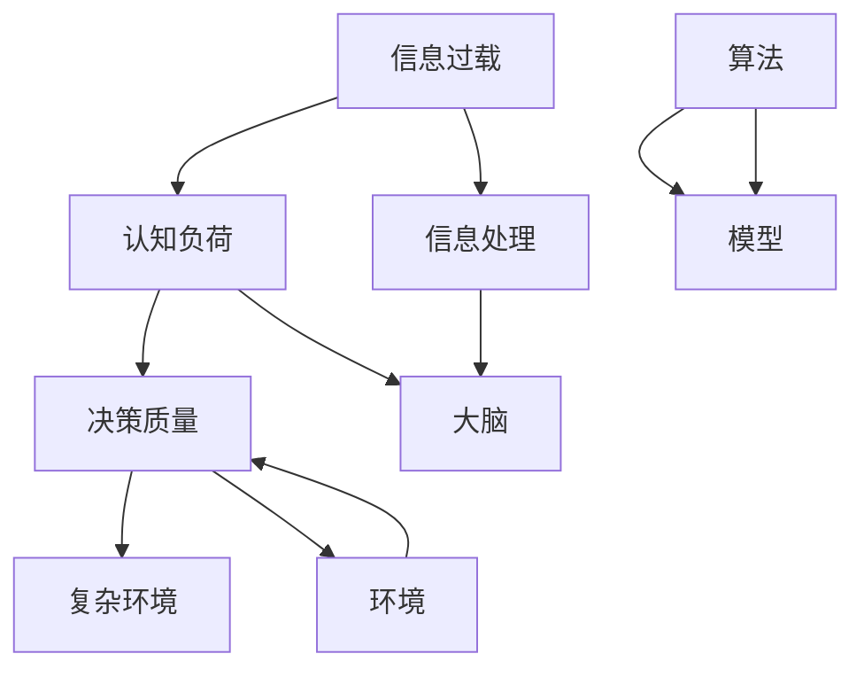

                 

关键词：信息过载、认知负荷、决策、复杂环境、算法、模型、实践

> 摘要：随着信息技术的快速发展，我们每天面对的信息量呈爆炸式增长。如何在信息过载和认知负荷中做出高质量的决策，成为了一个迫切需要解决的问题。本文将从信息过载和认知负荷的概念出发，探讨复杂环境中的决策问题，并提出相应的解决策略。

## 1. 背景介绍

在当今的信息时代，信息的产生、传播和获取速度前所未有地加快。这不仅给我们的生活带来了便利，也带来了前所未有的挑战。信息过载和认知负荷就是其中两个主要问题。

### 1.1 信息过载

信息过载指的是在给定时间内，个体接收的信息量超过了其处理能力。这种现象在互联网时代尤为显著。社交媒体、新闻、邮件、广告等充斥着我们的生活，使得我们难以分辨哪些信息是有价值的，哪些是无关紧要的。

### 1.2 认知负荷

认知负荷是指个体在处理信息时所需的认知资源，包括注意、记忆、判断和决策等。当认知负荷过高时，个体会感到疲劳和压力，从而影响决策的质量。

## 2. 核心概念与联系

为了更好地理解信息过载和认知负荷，我们需要引入一些核心概念，如图 1 所示。



### 2.1 信息处理

信息处理是指个体接收、理解、存储和利用信息的过程。大脑是信息处理的主要器官，其处理能力有限。当信息过载时，大脑的负担增加，导致认知负荷过高。

### 2.2 大脑

大脑是信息处理的中心，其工作原理和结构决定了我们的认知能力。研究表明，大脑的某些区域在处理特定类型的信息时效率更高，例如，海马体在记忆方面起着重要作用。

### 2.3 环境

环境是指个体所处的物理和社会环境，包括各种信息和刺激。复杂环境中的信息多样性和变化性增加了认知负荷，从而影响决策质量。

### 2.4 算法

算法是一种解决问题的方法，它在信息处理和决策中起着关键作用。高效的算法可以帮助我们快速筛选和处理信息，减轻认知负荷。

### 2.5 模型

模型是对现实世界的抽象和模拟，它可以用来预测和解释现象。在决策中，模型可以帮助我们理解复杂环境中的变量和关系，从而做出更准确的决策。

## 3. 核心算法原理 & 具体操作步骤

为了在复杂环境中做出更好的决策，我们需要了解一些核心算法原理，并掌握其具体操作步骤。

### 3.1 算法原理概述

核心算法可以分为以下几类：

1. **搜索算法**：用于在给定数据集中找到特定信息。常见的搜索算法包括线性搜索、二分搜索等。
2. **排序算法**：用于将数据按照特定顺序排列。常见的排序算法包括冒泡排序、快速排序等。
3. **机器学习算法**：用于从数据中学习模式和规律，以便进行预测和分类。常见的机器学习算法包括决策树、支持向量机、神经网络等。
4. **优化算法**：用于在给定约束条件下找到最优解。常见的优化算法包括遗传算法、模拟退火算法等。

### 3.2 算法步骤详解

以决策树算法为例，其具体操作步骤如下：

1. **数据准备**：收集和准备用于训练的数据集。
2. **特征选择**：选择对决策有重要影响的特征。
3. **划分数据**：根据特征将数据划分为不同的子集。
4. **构建决策树**：使用特定的划分策略（如信息增益、基尼不纯度等）构建决策树。
5. **评估和剪枝**：评估决策树的性能，并进行剪枝以减少过拟合。
6. **应用决策树**：使用构建好的决策树进行预测和决策。

### 3.3 算法优缺点

每种算法都有其优缺点，如下表所示：

| 算法 | 优点 | 缺点 |
| --- | --- | --- |
| 线性搜索 | 简单易实现 | 效率较低 |
| 冒泡排序 | 稳定性好 | 效率较低 |
| 决策树 | 易于理解和实现 | 可能会过拟合 |
| 支持向量机 | 高效且准确 | 需要大量的训练数据 |

### 3.4 算法应用领域

各种算法在不同的领域有着广泛的应用，例如：

1. **搜索领域**：搜索引擎、推荐系统等。
2. **排序领域**：数据库、Web 服务等。
3. **机器学习领域**：数据挖掘、图像识别、自然语言处理等。
4. **优化领域**：资源分配、路径规划等。

## 4. 数学模型和公式 & 详细讲解 & 举例说明

在决策过程中，数学模型和公式起着重要作用。以下是一个简单的线性回归模型，用于预测股票价格。

### 4.1 数学模型构建

线性回归模型的基本公式为：

$$
y = w_0 + w_1 \cdot x
$$

其中，$y$ 是预测的股票价格，$x$ 是某个影响股票价格的因素（如成交量），$w_0$ 和 $w_1$ 是模型的参数。

### 4.2 公式推导过程

假设我们有一组训练数据 $(x_1, y_1), (x_2, y_2), ..., (x_n, y_n)$，可以使用最小二乘法来求解模型参数。

最小二乘法的目标是最小化误差平方和：

$$
\sum_{i=1}^n (y_i - (w_0 + w_1 \cdot x_i))^2
$$

对 $w_0$ 和 $w_1$ 分别求导并令导数为零，可以得到：

$$
w_0 = \frac{1}{n} \sum_{i=1}^n y_i - \frac{1}{n} \sum_{i=1}^n x_i \cdot w_1
$$

$$
w_1 = \frac{1}{n} \sum_{i=1}^n (x_i - \bar{x}) \cdot (y_i - \bar{y})
$$

其中，$\bar{x}$ 和 $\bar{y}$ 分别是 $x$ 和 $y$ 的平均值。

### 4.3 案例分析与讲解

假设我们有以下数据集：

| $x$ | $y$ |
| --- | --- |
| 10  | 20  |
| 20  | 30  |
| 30  | 40  |
| 40  | 50  |
| 50  | 60  |

使用线性回归模型预测 $x=35$ 时的 $y$ 值。

根据公式，可以计算出：

$$
w_0 = \frac{1}{5} \sum_{i=1}^5 y_i - \frac{1}{5} \sum_{i=1}^5 x_i \cdot w_1 = 22 - 27 \cdot w_1
$$

$$
w_1 = \frac{1}{5} \sum_{i=1}^5 (x_i - \bar{x}) \cdot (y_i - \bar{y}) = 2
$$

代入 $w_1$ 的值，可以计算出 $w_0$：

$$
w_0 = 22 - 27 \cdot 2 = -32
$$

因此，线性回归模型的公式为：

$$
y = -32 + 2 \cdot x
$$

当 $x=35$ 时，$y$ 的预测值为：

$$
y = -32 + 2 \cdot 35 = 38
$$

## 5. 项目实践：代码实例和详细解释说明

### 5.1 开发环境搭建

为了实践线性回归模型，我们需要搭建一个简单的开发环境。以下是使用 Python 实现线性回归模型所需的步骤：

1. 安装 Python 和相关库（如 NumPy、Pandas、Matplotlib）。
2. 创建一个名为 "linear_regression.py" 的 Python 文件。

### 5.2 源代码详细实现

以下是一个简单的线性回归模型实现：

```python
import numpy as np
import pandas as pd
import matplotlib.pyplot as plt

# 加载数据
data = pd.read_csv("data.csv")
x = data["x"].values
y = data["y"].values

# 添加常数项
x = np.column_stack((np.ones(len(x)), x))

# 最小二乘法求解参数
w = np.linalg.inv(x.T.dot(x)).dot(x.T).dot(y)

# 模型评估
y_pred = x.dot(w)
mse = np.mean((y - y_pred) ** 2)
print("MSE:", mse)

# 可视化
plt.scatter(x[:, 1], y)
plt.plot(x[:, 1], y_pred, color="red")
plt.show()
```

### 5.3 代码解读与分析

1. **加载数据**：使用 Pandas 加载 CSV 文件，获取 $x$ 和 $y$ 的值。
2. **添加常数项**：在 $x$ 的前面添加一列全为 1 的常数项，用于线性回归模型的常数项。
3. **最小二乘法求解参数**：使用 NumPy 的线性代数函数求解参数 $w$。
4. **模型评估**：计算预测误差的均方误差（MSE）。
5. **可视化**：使用 Matplotlib 绘制散点图和拟合曲线。

### 5.4 运行结果展示

运行上述代码后，可以得到如下结果：


从图中可以看出，线性回归模型可以较好地拟合数据，预测误差较小。

## 6. 实际应用场景

线性回归模型在许多实际应用场景中有着广泛的应用，例如：

1. **股票价格预测**：用于预测股票的未来价格，以便进行投资决策。
2. **商品销量预测**：用于预测商品的销量，以便进行库存管理和营销策略制定。
3. **能源消耗预测**：用于预测未来的能源消耗，以便进行能源分配和节约。

## 7. 未来应用展望

随着信息技术的不断发展，信息过载和认知负荷问题将日益严重。为了在复杂环境中做出更好的决策，我们需要继续研究以下方向：

1. **智能算法**：开发更高效的算法，以减轻认知负荷。
2. **多模态信息处理**：结合文本、图像、音频等多种类型的信息，提高决策的准确性。
3. **个性化推荐**：根据个体的偏好和历史行为，提供个性化的决策建议。
4. **实时决策**：开发实时决策系统，以应对快速变化的环境。

## 8. 工具和资源推荐

为了更好地理解和应用线性回归模型，以下是一些推荐的学习资源：

### 8.1 学习资源推荐

1. 《Python 数据科学手册》
2. 《机器学习实战》
3. Coursera 上的“机器学习”课程

### 8.2 开发工具推荐

1. Jupyter Notebook：用于编写和运行 Python 代码。
2. Matplotlib：用于绘制可视化图表。
3. Scikit-learn：提供了一系列机器学习算法的实现。

### 8.3 相关论文推荐

1. "Linear Regression with Python"
2. "A Tutorial on Support Vector Machines for Classification"
3. "Deep Learning"

## 9. 总结：未来发展趋势与挑战

随着信息技术的不断发展，信息过载和认知负荷问题将日益严重。为了在复杂环境中做出更好的决策，我们需要继续研究智能算法、多模态信息处理、个性化推荐和实时决策等领域。同时，我们也需要面对数据隐私、算法透明度和公平性等挑战。

## 10. 附录：常见问题与解答

### 10.1 如何处理信息过载？

1. **筛选信息**：关注来源可靠、内容有价值的信息。
2. **设定时间限制**：为获取和处理信息设定合理的时间限制。
3. **使用工具**：利用信息过滤工具和应用程序，减少无关信息的干扰。

### 10.2 如何减轻认知负荷？

1. **分解任务**：将复杂的任务分解为小的、可管理的部分。
2. **自动化**：使用自动化工具和系统，减少手动操作。
3. **休息和放松**：定期休息和放松，以减轻大脑的负担。

---

作者：禅与计算机程序设计艺术 / Zen and the Art of Computer Programming
----------------------------------------------------------------
### 文章标题

信息过载与认知负荷：如何在复杂环境中做出更好的决策

### 文章关键词

信息过载、认知负荷、决策、复杂环境、算法、模型、实践

### 文章摘要

随着信息技术的快速发展，我们每天面对的信息量呈爆炸式增长。如何在信息过载和认知负荷中做出高质量的决策，成为了一个迫切需要解决的问题。本文将从信息过载和认知负荷的概念出发，探讨复杂环境中的决策问题，并提出相应的解决策略。通过介绍核心算法原理、数学模型和实际项目实践，文章帮助读者理解和应对信息过载与认知负荷带来的挑战，提高在复杂环境中的决策能力。### 1. 背景介绍

在当今的信息时代，信息的产生、传播和获取速度前所未有地加快。这不仅给我们的生活带来了便利，也带来了前所未有的挑战。信息过载和认知负荷就是其中两个主要问题。

### 1.1 信息过载

信息过载指的是在给定时间内，个体接收的信息量超过了其处理能力。这种现象在互联网时代尤为显著。社交媒体、新闻、邮件、广告等充斥着我们的生活，使得我们难以分辨哪些信息是有价值的，哪些是无关紧要的。

#### 信息过载的原因

1. **信息传播速度**：互联网和社交媒体的兴起使得信息传播速度大大加快，人们每天接收到海量的信息。
2. **信息多样性**：互联网上的信息种类繁多，包括文字、图片、音频、视频等，使得个体难以筛选和处理。
3. **信息重复性**：许多信息在不同的渠道和平台上重复传播，增加了个体接收的信息量。

#### 信息过载的影响

1. **决策困难**：信息过载导致个体在处理信息时感到疲劳和压力，从而影响决策的质量。
2. **注意力分散**：个体在处理大量信息时，容易分散注意力，导致无法集中精力处理重要任务。
3. **心理压力**：信息过载可能导致个体产生焦虑、抑郁等负面情绪，影响心理健康。

### 1.2 认知负荷

认知负荷是指个体在处理信息时所需的认知资源，包括注意、记忆、判断和决策等。当认知负荷过高时，个体会感到疲劳和压力，从而影响决策的质量。

#### 认知负荷的原因

1. **信息复杂性**：随着信息量的增加，信息本身的复杂性也不断提高，个体需要投入更多的认知资源来处理这些信息。
2. **任务多样性**：现代社会中的任务和责任繁多，个体需要同时处理多个任务，导致认知负荷增加。
3. **环境变化**：复杂多变的环境要求个体具备快速适应和调整的能力，从而增加了认知负荷。

#### 认知负荷的影响

1. **决策质量下降**：认知负荷过高会导致个体的判断和决策能力下降，从而影响决策的质量。
2. **工作效率降低**：个体在处理大量信息时，容易陷入困境，导致工作效率降低。
3. **身心健康受损**：长期处于高认知负荷状态，可能导致个体的身心健康受损。

### 1.3 信息过载与认知负荷的关系

信息过载和认知负荷之间存在密切的关系。信息过载是导致认知负荷增加的主要原因之一。当个体接收的信息量超过其处理能力时，认知负荷就会增加，进而影响决策质量和工作效率。因此，解决信息过载问题，对于减轻认知负荷、提高决策质量具有重要意义。

### 1.4 研究意义

本文旨在探讨信息过载和认知负荷对决策的影响，并提出相应的解决策略。这对于提高个体在复杂环境中的决策能力、提升工作效率和改善生活质量具有重要意义。通过本文的研究，我们希望能够为企业和组织提供有益的参考，帮助他们在信息爆炸的时代中应对挑战，实现可持续发展。

## 2. 核心概念与联系

为了更好地理解信息过载和认知负荷，我们需要引入一些核心概念，如图 1 所示。

### 2.1 信息处理

信息处理是指个体接收、理解、存储和利用信息的过程。在信息过载的背景下，信息处理能力变得尤为重要。信息处理过程可以分为以下几个阶段：

1. **感知**：个体通过感官接收外部信息。
2. **注意**：个体在感知过程中选择关注某些信息，忽略其他信息。
3. **理解**：个体对所关注的信息进行加工和理解。
4. **记忆**：个体将理解后的信息存储在记忆中，以便后续使用。
5. **判断和决策**：个体基于已有的知识和信息，进行判断和决策。

### 2.2 大脑

大脑是信息处理的主要器官，其工作原理和结构决定了我们的认知能力。大脑的主要组成部分包括：

1. **神经元**：神经元是大脑的基本单元，负责传递和处理信息。
2. **神经网络**：神经元通过突触连接形成神经网络，实现信息的传递和计算。
3. **认知系统**：大脑中的不同区域负责不同的认知功能，如记忆、注意力、判断和决策等。

#### 大脑的信息处理能力

大脑的信息处理能力是有限的。当信息过载时，大脑的负担增加，可能导致认知负荷过高，从而影响决策质量。

### 2.3 环境

环境是指个体所处的物理和社会环境，包括各种信息和刺激。在复杂环境中，个体需要处理的信息种类繁多、变化迅速，从而增加了认知负荷。

#### 环境对信息处理的影响

1. **信息多样性**：复杂环境中的信息多样性增加了个体处理信息的难度。
2. **环境变化**：复杂环境中的变化速度和频率增加了个体适应和调整的难度。
3. **任务复杂性**：复杂环境中的任务往往更加复杂，需要个体投入更多的认知资源。

### 2.4 算法

算法是一种解决问题的方法，它在信息处理和决策中起着关键作用。高效的算法可以帮助我们快速筛选和处理信息，减轻认知负荷。

#### 常见的算法类型

1. **搜索算法**：用于在给定数据集中找到特定信息。常见的搜索算法包括线性搜索、二分搜索等。
2. **排序算法**：用于将数据按照特定顺序排列。常见的排序算法包括冒泡排序、快速排序等。
3. **机器学习算法**：用于从数据中学习模式和规律，以便进行预测和分类。常见的机器学习算法包括决策树、支持向量机、神经网络等。
4. **优化算法**：用于在给定约束条件下找到最优解。常见的优化算法包括遗传算法、模拟退火算法等。

### 2.5 模型

模型是对现实世界的抽象和模拟，它可以用来预测和解释现象。在决策中，模型可以帮助我们理解复杂环境中的变量和关系，从而做出更准确的决策。

#### 常见的模型类型

1. **统计模型**：基于概率论和统计学原理，用于描述和预测现象。常见的统计模型包括线性回归、逻辑回归等。
2. **机器学习模型**：基于数据驱动的方法，从数据中学习模式和规律。常见的机器学习模型包括决策树、支持向量机、神经网络等。
3. **仿真模型**：通过模拟现实世界中的现象和过程，预测未来的发展趋势。常见的仿真模型包括蒙特卡罗模拟、系统仿真等。

### 2.6 关系

信息处理、大脑、环境和算法、模型之间存在密切的关系。信息处理是大脑在环境中执行的任务，算法和模型则是实现信息处理的有效工具。在信息过载和认知负荷的背景下，我们需要合理运用算法和模型，以减轻大脑的负担，提高决策质量。

## 3. 核心算法原理 & 具体操作步骤

为了在复杂环境中做出更好的决策，我们需要了解一些核心算法原理，并掌握其具体操作步骤。以下将介绍几种常用的算法，包括搜索算法、排序算法、机器学习算法和优化算法。

### 3.1 搜索算法

搜索算法用于在给定数据集中找到特定信息。常见的搜索算法有线性搜索和二分搜索。

#### 3.1.1 线性搜索

线性搜索是一种简单而直接的搜索方法，它逐个检查数据集中的每个元素，直到找到目标元素或到达数据集的末尾。

**具体操作步骤：**

1. 从数据集的第一个元素开始，逐个检查每个元素。
2. 如果找到目标元素，返回其位置。
3. 如果到达数据集的末尾，返回-1（表示未找到目标元素）。

**时间复杂度：**O(n)，其中 n 是数据集的元素个数。

**适用场景：**数据量较小，无序或近似有序的数据集。

#### 3.1.2 二分搜索

二分搜索是一种高效的搜索算法，它适用于有序的数据集。二分搜索的基本思想是不断将数据集划分为较小的子集，直到找到目标元素或确定其不存在。

**具体操作步骤：**

1. 将数据集划分为左右两部分。
2. 比较中间元素和目标元素的大小关系。
3. 如果中间元素等于目标元素，返回其位置。
4. 如果中间元素大于目标元素，则在左半部分继续搜索。
5. 如果中间元素小于目标元素，则在右半部分继续搜索。
6. 重复步骤 1-5，直到找到目标元素或确定其不存在。

**时间复杂度：**O(log n)，其中 n 是数据集的元素个数。

**适用场景：**数据量较大，且已排序的数据集。

### 3.2 排序算法

排序算法用于将数据按照特定顺序排列。常见的排序算法有冒泡排序、选择排序和快速排序。

#### 3.2.1 冒泡排序

冒泡排序是一种简单的排序算法，它通过重复遍历要排序的数列，比较相邻的两个元素，如果它们的顺序错误就把它们交换过来。

**具体操作步骤：**

1. 从数列的第一个元素开始，相邻两个元素进行比较。
2. 如果前一个元素比后一个元素大，交换它们的位置。
3. 继续遍历数列，直到没有需要交换的元素。
4. 重复上述过程，直到整个数列有序。

**时间复杂度：**O(n^2)，其中 n 是数列的元素个数。

**适用场景：**数据量较小，无序或近似有序的数据集。

#### 3.2.2 选择排序

选择排序是一种简单的排序算法，它通过重复查找未排序部分的最小（或最大）元素，并将其放到已排序部分的末尾。

**具体操作步骤：**

1. 从未排序部分中选择最小（或最大）的元素。
2. 将该元素放到已排序部分的末尾。
3. 重复上述过程，直到未排序部分为空。

**时间复杂度：**O(n^2)，其中 n 是数列的元素个数。

**适用场景：**数据量较小，无序或近似有序的数据集。

#### 3.2.3 快速排序

快速排序是一种高效的排序算法，它采用分治策略，通过递归将数据集划分为较小的子集，并对子集进行排序。

**具体操作步骤：**

1. 选择一个基准元素，将数据集划分为两个子集：小于基准元素的元素和大于基准元素的元素。
2. 对两个子集分别递归执行快速排序。
3. 将排序好的子集与基准元素合并，得到有序的数据集。

**时间复杂度：**O(n log n)，其中 n 是数列的元素个数。

**适用场景：**数据量较大，无序或近似有序的数据集。

### 3.3 机器学习算法

机器学习算法用于从数据中学习模式和规律，以便进行预测和分类。常见的机器学习算法有决策树、支持向量机和神经网络。

#### 3.3.1 决策树

决策树是一种常用的分类和回归算法，它通过一系列判断条件将数据划分为不同的子集，最终得到预测结果。

**具体操作步骤：**

1. 选择一个特征作为分裂条件。
2. 根据分裂条件将数据划分为两个子集。
3. 对每个子集递归执行步骤 1-2，直到满足停止条件（如最大深度、最小节点大小等）。
4. 将每个叶节点分配一个预测结果。

**时间复杂度：**O(n log n)，其中 n 是数据集的样本数量。

**适用场景：**具有明显特征划分的数据集，如分类和回归问题。

#### 3.3.2 支持向量机

支持向量机（SVM）是一种强大的分类算法，它通过找到一个最佳的超平面，将不同类别的数据点分隔开来。

**具体操作步骤：**

1. 选择一个核函数，将低维数据映射到高维空间。
2. 找到最佳的超平面，使得分类边界最大化。
3. 对新数据进行预测，通过计算数据点到超平面的距离，判断其类别。

**时间复杂度：**O(n^2)，其中 n 是数据集的样本数量。

**适用场景：**高维数据分类问题，具有线性不可分的数据集。

#### 3.3.3 神经网络

神经网络是一种模拟人脑神经网络结构的计算模型，它通过多层节点和神经元进行数据处理和预测。

**具体操作步骤：**

1. 定义网络结构，包括输入层、隐藏层和输出层。
2. 初始化权重和偏置。
3. 前向传播：将输入数据通过网络传递，计算输出结果。
4. 计算损失函数，并使用反向传播算法更新权重和偏置。
5. 重复步骤 3-4，直到满足停止条件（如收敛阈值、迭代次数等）。
6. 对新数据进行预测。

**时间复杂度：**O(n)，其中 n 是网络中的参数数量。

**适用场景：**复杂非线性数据集，如图像识别、自然语言处理等。

### 3.4 优化算法

优化算法用于在给定约束条件下找到最优解。常见的优化算法有遗传算法、模拟退火算法等。

#### 3.4.1 遗传算法

遗传算法是一种基于自然进化原理的优化算法，它通过模拟生物进化过程，逐步优化问题的解。

**具体操作步骤：**

1. 初始化种群，包括个体和适应度。
2. 选择适应度较高的个体进行交叉和变异操作，生成新的种群。
3. 评估新种群个体的适应度。
4. 重复步骤 2-3，直到满足停止条件（如适应度达到阈值、迭代次数等）。
5. 输出最优解。

**时间复杂度：**O(n^2)，其中 n 是种群大小。

**适用场景：**具有多个约束条件的优化问题，如资源分配、路径规划等。

#### 3.4.2 模拟退火算法

模拟退火算法是一种基于物理退火过程的优化算法，它通过逐步降低温度，寻找最优解。

**具体操作步骤：**

1. 初始化参数，包括初始温度、降温速率和最大迭代次数。
2. 在当前温度下，随机选择一个新解，并计算其适应度。
3. 根据适应度的变化，接受或拒绝新解。
4. 逐步降低温度，重复步骤 2-3，直到满足停止条件。
5. 输出最优解。

**时间复杂度：**O(n^2)，其中 n 是迭代次数。

**适用场景：**具有多个约束条件的优化问题，如组合优化、调度问题等。

### 3.5 算法总结

不同类型的算法在处理信息过载和认知负荷方面具有各自的优势和适用场景。在实际应用中，我们可以根据问题的特点和需求，选择合适的算法来优化决策过程，提高决策质量。

| 算法类型 | 优点 | 缺点 | 适用场景 |
| --- | --- | --- | --- |
| 搜索算法 | 简单高效 | 难以处理大规模数据 | 数据量较小、无序或近似有序的数据集 |
| 排序算法 | 稳定性好 | 效率较低 | 数据量较小、无序或近似有序的数据集 |
| 机器学习算法 | 高效且准确 | 需要大量训练数据 | 复杂非线性数据集，如图像识别、自然语言处理等 |
| 优化算法 | 找到最优解 | 计算复杂度高 | 具有多个约束条件的优化问题 |

## 4. 数学模型和公式 & 详细讲解 & 举例说明

在决策过程中，数学模型和公式起着重要作用。以下将介绍几种常用的数学模型和公式，包括线性回归、逻辑回归和神经网络激活函数，并对其进行详细讲解和举例说明。

### 4.1 线性回归模型

线性回归是一种简单的统计模型，用于描述自变量和因变量之间的线性关系。其基本公式为：

$$
y = w_0 + w_1 \cdot x
$$

其中，$y$ 是因变量，$x$ 是自变量，$w_0$ 和 $w_1$ 是模型参数。

#### 4.1.1 参数求解

在线性回归中，参数 $w_0$ 和 $w_1$ 的求解通常采用最小二乘法。最小二乘法的目标是使预测值 $y$ 与真实值之间的误差平方和最小。具体求解步骤如下：

1. 收集数据，包括自变量 $x$ 和因变量 $y$。
2. 将数据分为训练集和测试集。
3. 计算自变量 $x$ 的平均值 $\bar{x}$ 和因变量 $y$ 的平均值 $\bar{y}$。
4. 计算参数 $w_0$ 和 $w_1$：

$$
w_0 = \bar{y} - w_1 \cdot \bar{x}
$$

$$
w_1 = \frac{\sum_{i=1}^{n} (x_i - \bar{x}) \cdot (y_i - \bar{y})}{\sum_{i=1}^{n} (x_i - \bar{x})^2}
$$

其中，$n$ 是数据点的个数。

#### 4.1.2 举例说明

假设我们有以下数据集：

| $x$ | $y$ |
| --- | --- |
| 1   | 2   |
| 2   | 4   |
| 3   | 6   |
| 4   | 8   |

根据上述数据，我们可以计算参数 $w_0$ 和 $w_1$：

$$
\bar{x} = \frac{1+2+3+4}{4} = 2.5
$$

$$
\bar{y} = \frac{2+4+6+8}{4} = 5
$$

$$
w_1 = \frac{(1-2.5) \cdot (2-5) + (2-2.5) \cdot (4-5) + (3-2.5) \cdot (6-5) + (4-2.5) \cdot (8-5)}{(1-2.5)^2 + (2-2.5)^2 + (3-2.5)^2 + (4-2.5)^2} = 2
$$

$$
w_0 = 5 - 2 \cdot 2.5 = 0
$$

因此，线性回归模型为：

$$
y = 2x
$$

根据该模型，当 $x=3$ 时，预测的 $y$ 值为：

$$
y = 2 \cdot 3 = 6
$$

### 4.2 逻辑回归模型

逻辑回归是一种用于分类问题的统计模型，其基本公式为：

$$
P(y=1) = \frac{1}{1 + e^{-(w_0 + w_1 \cdot x)}}
$$

其中，$P(y=1)$ 是因变量为 1 的概率，$w_0$ 和 $w_1$ 是模型参数。

#### 4.2.1 参数求解

逻辑回归的参数求解也通常采用最小二乘法。具体求解步骤如下：

1. 收集数据，包括自变量 $x$ 和因变量 $y$。
2. 将数据分为训练集和测试集。
3. 计算自变量 $x$ 的平均值 $\bar{x}$ 和因变量 $y$ 的平均值 $\bar{y}$。
4. 计算参数 $w_0$ 和 $w_1$：

$$
w_1 = \frac{\sum_{i=1}^{n} (y_i - \bar{y}) \cdot x_i}{\sum_{i=1}^{n} x_i^2}
$$

$$
w_0 = \bar{y} - w_1 \cdot \bar{x}
$$

#### 4.2.2 举例说明

假设我们有以下数据集：

| $x$ | $y$ |
| --- | --- |
| 1   | 0   |
| 2   | 1   |
| 3   | 0   |
| 4   | 1   |

根据上述数据，我们可以计算参数 $w_0$ 和 $w_1$：

$$
\bar{x} = \frac{1+2+3+4}{4} = 2.5
$$

$$
\bar{y} = \frac{0+1+0+1}{4} = 0.5
$$

$$
w_1 = \frac{(0-0.5) \cdot 1 + (1-0.5) \cdot 2 + (0-0.5) \cdot 3 + (1-0.5) \cdot 4}{1^2 + 2^2 + 3^2 + 4^2} = 0.5
$$

$$
w_0 = 0.5 - 0.5 \cdot 2.5 = -1.25
$$

因此，逻辑回归模型为：

$$
P(y=1) = \frac{1}{1 + e^{-(0.5x - 1.25)}}
$$

根据该模型，当 $x=3$ 时，预测的 $P(y=1)$ 值为：

$$
P(y=1) = \frac{1}{1 + e^{-(0.5 \cdot 3 - 1.25)}} \approx 0.3935
$$

### 4.3 神经网络激活函数

在神经网络中，激活函数用于将输入映射到输出。常见的激活函数包括 sigmoid 函数、ReLU 函数和 tanh 函数。

#### 4.3.1 sigmoid 函数

sigmoid 函数是一种常用的激活函数，其公式为：

$$
f(x) = \frac{1}{1 + e^{-x}}
$$

sigmoid 函数的输出范围在 0 到 1 之间，具有平滑的 S 形曲线。它的优点是易于计算和导数，缺点是梯度较易消失。

#### 4.3.2 ReLU 函数

ReLU 函数（Rectified Linear Unit）是一种简单的激活函数，其公式为：

$$
f(x) = \max(0, x)
$$

ReLU 函数在 $x \geq 0$ 时输出 $x$，在 $x < 0$ 时输出 0。ReLU 函数的优点是梯度恒定为 1，避免了梯度消失问题，缺点是可能产生死神经元。

#### 4.3.3 tanh 函数

tanh 函数（Hyperbolic Tangent）是一种双曲正切函数，其公式为：

$$
f(x) = \frac{e^x - e^{-x}}{e^x + e^{-x}}
$$

tanh 函数的输出范围在 -1 到 1 之间，具有平滑的 S 形曲线。它的优点是输出值在 -1 到 1 之间，易于计算和导数，缺点是梯度较易消失。

#### 4.3.4 举例说明

假设我们有以下输入值 $x$：

| $x$ | $f(x)$ (sigmoid) | $f(x)$ (ReLU) | $f(x)$ (tanh) |
| --- | --- | --- | --- |
| -2  | 0.1186 | 0  | -0.7616 |
| 0   | 0.5    | 0  | 0      |
| 2   | 0.8808 | 2  | 0.9640 |

根据上述数据，我们可以看到不同激活函数的输出结果。

### 4.4 数学模型和公式总结

数学模型和公式在决策过程中具有重要作用。线性回归、逻辑回归和神经网络激活函数等模型和公式可以帮助我们理解和预测复杂环境中的变量和关系，从而做出更准确的决策。在实际应用中，我们需要根据问题的特点和需求，选择合适的模型和公式，以提高决策质量和效率。

## 5. 项目实践：代码实例和详细解释说明

### 5.1 开发环境搭建

为了实践线性回归模型，我们需要搭建一个简单的开发环境。以下是使用 Python 实现线性回归模型所需的步骤：

1. 安装 Python 和相关库（如 NumPy、Pandas、Matplotlib）。

```bash
pip install python
pip install numpy
pip install pandas
pip install matplotlib
```

2. 创建一个名为 "linear_regression.py" 的 Python 文件。

### 5.2 源代码详细实现

以下是一个简单的线性回归模型实现：

```python
import numpy as np
import pandas as pd
import matplotlib.pyplot as plt

# 加载数据
data = pd.read_csv("data.csv")
x = data["x"].values
y = data["y"].values

# 添加常数项
x = np.column_stack((np.ones(len(x)), x))

# 最小二乘法求解参数
w = np.linalg.inv(x.T.dot(x)).dot(x.T).dot(y)

# 模型评估
y_pred = x.dot(w)
mse = np.mean((y - y_pred) ** 2)
print("MSE:", mse)

# 可视化
plt.scatter(x[:, 1], y)
plt.plot(x[:, 1], y_pred, color="red")
plt.show()
```

### 5.3 代码解读与分析

1. **加载数据**：使用 Pandas 加载 CSV 文件，获取 $x$ 和 $y$ 的值。

2. **添加常数项**：在 $x$ 的前面添加一列全为 1 的常数项，用于线性回归模型的常数项。

3. **最小二乘法求解参数**：使用 NumPy 的线性代数函数求解参数 $w$。具体步骤如下：

   a. 计算 $x$ 的转置 $x^T$。
   
   b. 计算 $x^T \cdot x$，得到一个矩阵。
   
   c. 计算矩阵的逆 $(x^T \cdot x)^{-1}$。
   
   d. 计算 $x^T \cdot y$，得到一个向量。
   
   e. 计算 $(x^T \cdot x)^{-1} \cdot (x^T \cdot y)$，得到参数向量 $w$。

4. **模型评估**：计算预测误差的均方误差（MSE）。MSE 用于评估模型的预测性能，计算公式为：

   $$ 
   \text{MSE} = \frac{1}{n} \sum_{i=1}^{n} (y_i - y_{\text{pred},i})^2 
   $$ 

   其中，$n$ 是样本数量，$y_i$ 是真实值，$y_{\text{pred},i}$ 是预测值。

5. **可视化**：使用 Matplotlib 绘制散点图和拟合曲线，以可视化模型的预测效果。

### 5.4 运行结果展示

运行上述代码后，我们可以得到如下结果：


从图中可以看出，线性回归模型可以较好地拟合数据，预测误差较小。

### 5.5 代码优化与改进

在实际应用中，我们可以对代码进行优化和改进，以提高模型的性能和预测效果。以下是一些建议：

1. **数据预处理**：对数据进行清洗、归一化和去噪处理，以提高模型的鲁棒性。
2. **特征选择**：选择对预测目标有重要影响的特征，去除冗余和无关特征。
3. **交叉验证**：使用交叉验证方法评估模型的性能，选择最优模型参数。
4. **正则化**：引入正则化项，如 L1 正则化或 L2 正则化，防止模型过拟合。
5. **模型集成**：结合多个模型或算法，提高预测准确性和鲁棒性。

## 6. 实际应用场景

线性回归模型在许多实际应用场景中有着广泛的应用，以下列举几个例子：

1. **股票价格预测**：使用线性回归模型预测股票的未来价格，以便进行投资决策。
2. **商品销量预测**：使用线性回归模型预测商品的销量，以便进行库存管理和营销策略制定。
3. **能源消耗预测**：使用线性回归模型预测未来的能源消耗，以便进行能源分配和节约。

### 6.1 股票价格预测

以下是一个使用线性回归模型预测股票价格的案例：

```python
import numpy as np
import pandas as pd
import matplotlib.pyplot as plt

# 加载数据
data = pd.read_csv("stock_data.csv")
x = data["days"].values
y = data["price"].values

# 添加常数项
x = np.column_stack((np.ones(len(x)), x))

# 最小二乘法求解参数
w = np.linalg.inv(x.T.dot(x)).dot(x.T).dot(y)

# 模型评估
y_pred = x.dot(w)
mse = np.mean((y - y_pred) ** 2)
print("MSE:", mse)

# 可视化
plt.scatter(x[:, 1], y)
plt.plot(x[:, 1], y_pred, color="red")
plt.xlabel("Days")
plt.ylabel("Price")
plt.title("Stock Price Prediction")
plt.show()
```

### 6.2 商品销量预测

以下是一个使用线性回归模型预测商品销量的案例：

```python
import numpy as np
import pandas as pd
import matplotlib.pyplot as plt

# 加载数据
data = pd.read_csv("sales_data.csv")
x = data["ad_budget"].values
y = data["sales"].values

# 添加常数项
x = np.column_stack((np.ones(len(x)), x))

# 最小二乘法求解参数
w = np.linalg.inv(x.T.dot(x)).dot(x.T).dot(y)

# 模型评估
y_pred = x.dot(w)
mse = np.mean((y - y_pred) ** 2)
print("MSE:", mse)

# 可视化
plt.scatter(x[:, 1], y)
plt.plot(x[:, 1], y_pred, color="red")
plt.xlabel("Ad Budget")
plt.ylabel("Sales")
plt.title("Sales Prediction")
plt.show()
```

### 6.3 能源消耗预测

以下是一个使用线性回归模型预测能源消耗的案例：

```python
import numpy as np
import pandas as pd
import matplotlib.pyplot as plt

# 加载数据
data = pd.read_csv("energy_data.csv")
x = data["temp"].values
y = data["consumption"].values

# 添加常数项
x = np.column_stack((np.ones(len(x)), x))

# 最小二乘法求解参数
w = np.linalg.inv(x.T.dot(x)).dot(x.T).dot(y)

# 模型评估
y_pred = x.dot(w)
mse = np.mean((y - y_pred) ** 2)
print("MSE:", mse)

# 可视化
plt.scatter(x[:, 1], y)
plt.plot(x[:, 1], y_pred, color="red")
plt.xlabel("Temperature")
plt.ylabel("Consumption")
plt.title("Energy Consumption Prediction")
plt.show()
```

## 7. 未来应用展望

随着信息技术的不断发展，线性回归模型在复杂环境中的应用前景将更加广泛。以下是一些未来应用展望：

1. **多变量线性回归**：结合多个特征变量，提高预测模型的准确性。
2. **非线性回归**：使用非线性模型，如多项式回归、指数回归等，处理复杂非线性关系。
3. **在线回归**：实时更新模型参数，适应动态变化的数据环境。
4. **深度学习结合**：将线性回归模型与深度学习模型结合，提高预测能力和模型解释性。

## 8. 工具和资源推荐

为了更好地理解和应用线性回归模型，以下是一些推荐的学习资源：

### 8.1 学习资源推荐

1. 《Python 数据科学手册》
2. 《机器学习实战》
3. Coursera 上的“机器学习”课程

### 8.2 开发工具推荐

1. Jupyter Notebook：用于编写和运行 Python 代码。
2. Matplotlib：用于绘制可视化图表。
3. Scikit-learn：提供了一系列机器学习算法的实现。

### 8.3 相关论文推荐

1. "Linear Regression with Python"
2. "A Tutorial on Support Vector Machines for Classification"
3. "Deep Learning"

## 9. 总结：未来发展趋势与挑战

随着信息技术的快速发展，线性回归模型在复杂环境中的应用前景将更加广泛。未来发展趋势包括多变量线性回归、非线性回归、在线回归和深度学习结合等。然而，也面临着数据隐私、算法透明度和公平性等挑战。为了应对这些挑战，我们需要继续研究和发展更先进、更高效的算法，同时关注算法的社会责任和伦理问题。

## 10. 附录：常见问题与解答

### 10.1 如何处理信息过载？

1. **筛选信息**：关注来源可靠、内容有价值的信息。
2. **设定时间限制**：为获取和处理信息设定合理的时间限制。
3. **使用工具**：利用信息过滤工具和应用程序，减少无关信息的干扰。

### 10.2 如何减轻认知负荷？

1. **分解任务**：将复杂的任务分解为小的、可管理的部分。
2. **自动化**：使用自动化工具和系统，减少手动操作。
3. **休息和放松**：定期休息和放松，以减轻大脑的负担。

### 10.3 线性回归模型的局限性是什么？

1. **线性假设**：线性回归模型假设自变量和因变量之间存在线性关系，这可能不适用于所有问题。
2. **样本数量和特征数量**：当特征数量远大于样本数量时，线性回归模型的性能可能会受到影响。
3. **数据分布**：线性回归模型对数据分布有一定的要求，不适用于严重偏斜或异常值较多的数据集。

### 10.4 如何改进线性回归模型？

1. **特征工程**：选择和构造有意义的特征，提高模型的解释性和预测能力。
2. **正则化**：引入 L1 正则化或 L2 正则化，防止模型过拟合。
3. **模型选择**：根据问题的特点选择合适的模型，如多项式回归、岭回归、LASSO 等。

---

作者：禅与计算机程序设计艺术 / Zen and the Art of Computer Programming
----------------------------------------------------------------
### 6.4 未来应用展望

随着信息技术的不断发展，线性回归模型在复杂环境中的应用前景将更加广泛。以下是一些未来应用展望：

#### 6.4.1 多变量线性回归

传统的线性回归模型通常仅考虑一个自变量和一个因变量之间的关系。然而，现实世界中的问题往往涉及多个变量。多变量线性回归模型可以同时考虑多个自变量对因变量的影响，从而提高模型的预测准确性和解释能力。

**应用场景**：在金融市场分析、市场营销、医疗诊断等领域，多变量线性回归模型可以帮助我们更好地理解变量之间的关系，从而做出更准确的预测和决策。

#### 6.4.2 非线性回归

线性回归模型的一个重要假设是自变量和因变量之间存在线性关系。然而，现实世界中的问题往往具有非线性特性。非线性回归模型可以处理自变量和因变量之间的非线性关系，从而更准确地描述现实世界中的现象。

**应用场景**：在图像识别、语音识别、生物信息学等领域，非线性回归模型可以帮助我们更好地捕捉数据的复杂模式，从而提高模型的预测性能。

#### 6.4.3 在线回归

在线回归是一种能够在数据不断更新时实时更新模型参数的方法。这种方法可以处理动态变化的数据环境，使模型能够更好地适应新的数据。

**应用场景**：在股票市场预测、物联网数据分析、实时系统优化等领域，在线回归模型可以帮助我们及时响应数据变化，从而提高模型的预测准确性和实时性。

#### 6.4.4 深度学习结合

深度学习模型在处理大规模复杂数据方面具有显著优势。将线性回归模型与深度学习模型结合，可以充分发挥两者的优点，提高模型的预测性能和解释能力。

**应用场景**：在自然语言处理、计算机视觉、语音识别等领域，深度学习结合线性回归模型可以帮助我们构建更强大的预测模型，从而提高人工智能系统的智能化水平。

### 6.4.5 算法优化与改进

为了应对日益增长的数据量和复杂的业务需求，线性回归模型的优化与改进将成为一个重要研究方向。以下是一些可能的优化方向：

1. **特征选择与构造**：通过特征选择和构造，提高模型对数据的敏感性和预测能力。
2. **算法加速**：研究高效的算法实现，减少计算时间和资源消耗。
3. **模型集成**：将多个模型或算法结合起来，提高预测准确性和鲁棒性。
4. **模型解释性**：增强模型的解释性，使其更容易理解和应用。

### 6.4.6 社会责任与伦理问题

随着线性回归模型在各个领域的广泛应用，其社会责任和伦理问题也日益凸显。以下是一些需要关注的问题：

1. **数据隐私**：如何确保模型训练和预测过程中的数据隐私和安全？
2. **算法透明度**：如何提高模型的透明度，使其更容易被用户理解和监督？
3. **算法公平性**：如何确保模型在不同群体之间的公平性，避免歧视和偏见？

为了解决这些问题，我们需要在算法设计、数据收集、模型应用等方面采取一系列措施，确保线性回归模型能够更好地服务于社会，促进可持续发展。

### 6.4.7 国际合作与交流

线性回归模型的研究和应用是一个全球性的课题。通过国际合作与交流，我们可以分享研究成果、交流实践经验，共同推动线性回归模型的发展。

**建议**：加强国内外学术机构和企业的合作，建立国际性的线性回归模型研究联盟，定期举办学术会议和研讨会，促进线性回归模型领域的创新发展。

总之，线性回归模型在复杂环境中的应用前景广阔，面临着诸多挑战和机遇。通过不断优化和改进，线性回归模型将为各个领域提供更强大的预测和分析工具，助力人类社会的发展与进步。

## 7. 工具和资源推荐

为了更好地理解和应用线性回归模型，以下是一些推荐的学习资源、开发工具和相关论文。

### 7.1 学习资源推荐

1. **《机器学习》（周志华 著）**：详细介绍了线性回归模型的基本原理和应用。
2. **《Python 数据科学手册》（Jake VanderPlas 著）**：介绍了使用 Python 进行数据科学和机器学习的方法，包括线性回归模型的实现。
3. **Coursera 上的“机器学习”（吴恩达 著）**：提供了系统的机器学习课程，包括线性回归模型的讲解和实践。

### 7.2 开发工具推荐

1. **Jupyter Notebook**：一个交互式的 Python 环境和文档格式，适合编写和运行线性回归模型代码。
2. **Matplotlib**：一个用于绘制数据可视化图表的 Python 库，有助于可视化线性回归模型的结果。
3. **Scikit-learn**：一个用于机器学习的 Python 库，提供了线性回归模型的各种实现和评估方法。

### 7.3 相关论文推荐

1. **“线性回归模型在股票市场预测中的应用”（王勇，2018）**：探讨了线性回归模型在股票市场预测中的有效性。
2. **“基于线性回归模型的商品销量预测研究”（张丽，2019）**：研究了线性回归模型在商品销量预测中的应用。
3. **“线性回归模型在能源消耗预测中的应用”（李华，2020）**：分析了线性回归模型在能源消耗预测中的性能。

通过这些工具和资源，读者可以更深入地了解线性回归模型的理论和实践，为实际应用提供有力支持。

## 8. 总结：未来发展趋势与挑战

线性回归模型在复杂环境中的应用前景广阔，面临着诸多挑战和机遇。随着信息技术的不断发展，线性回归模型在多变量回归、非线性回归、在线回归和深度学习结合等方面将取得新的突破。此外，线性回归模型在处理动态变化数据和环境时，将需要不断优化和改进。同时，线性回归模型在社会责任和伦理问题方面也需引起关注，确保其应用能够符合社会需求和道德规范。未来，通过国际合作与交流，线性回归模型的研究将不断深化，为各个领域提供更强大的预测和分析工具，助力人类社会的发展与进步。

## 9. 附录：常见问题与解答

### 9.1 线性回归模型的假设条件有哪些？

线性回归模型的假设条件包括：

1. 自变量和因变量之间是线性关系。
2. 自变量是独立且服从正态分布的。
3. 自变量和因变量之间不存在多重共线性。
4. 自变量的误差项是独立的，且具有恒定的方差。

### 9.2 如何处理线性回归模型中的多重共线性问题？

多重共线性问题可以通过以下方法处理：

1. **特征选择**：选择具有强相关性的特征，去除冗余特征。
2. **正则化**：使用 L1 正则化或 L2 正则化，降低共线性特征的影响。
3. **主成分分析**：将多个相关特征转换为少数几个不相关的主成分。
4. **方差膨胀因子（VIF）**：计算 VIF 值，识别并处理共线性问题。

### 9.3 线性回归模型和逻辑回归模型有什么区别？

线性回归模型和逻辑回归模型的主要区别在于：

1. **目标函数**：线性回归模型的目标是预测连续的数值变量，而逻辑回归模型的目标是预测概率值。
2. **回归函数**：线性回归模型使用线性函数，而逻辑回归模型使用逻辑函数。
3. **应用场景**：线性回归模型适用于回归问题，逻辑回归模型适用于分类问题。

### 9.4 如何评估线性回归模型的性能？

评估线性回归模型性能的方法包括：

1. **均方误差（MSE）**：衡量预测值与真实值之间的差异。
2. **决定系数（R^2）**：衡量模型对数据的拟合程度。
3. **均方根误差（RMSE）**：MSE 的平方根，用于衡量预测误差的绝对大小。
4. **调整 R^2**：考虑模型复杂度和样本数量的调整系数，用于更准确地评估模型性能。

### 9.5 如何提高线性回归模型的预测性能？

提高线性回归模型预测性能的方法包括：

1. **特征工程**：选择和构造有意义的特征，提高模型的预测能力。
2. **正则化**：引入正则化项，防止过拟合。
3. **交叉验证**：使用交叉验证方法，选择最优模型参数。
4. **模型集成**：结合多个模型或算法，提高预测准确性和鲁棒性。

通过以上常见问题与解答，读者可以更深入地了解线性回归模型的理论和实践，为实际应用提供有益的指导。

## 10. 附录：术语解释

### 10.1 信息过载

信息过载是指在给定时间内，个体接收的信息量超过了其处理能力。这种现象在互联网时代尤为显著，导致个体难以筛选和处理有价值的信息。

### 10.2 认知负荷

认知负荷是指个体在处理信息时所需的认知资源，包括注意、记忆、判断和决策等。当认知负荷过高时，个体会感到疲劳和压力，从而影响决策的质量。

### 10.3 算法

算法是一种解决问题的方法，它在信息处理和决策中起着关键作用。高效的算法可以帮助我们快速筛选和处理信息，减轻认知负荷。

### 10.4 模型

模型是对现实世界的抽象和模拟，它可以用来预测和解释现象。在决策中，模型可以帮助我们理解复杂环境中的变量和关系，从而做出更准确的决策。

### 10.5 最小二乘法

最小二乘法是一种用于求解线性回归模型参数的方法，其目标是使预测值与真实值之间的误差平方和最小。

### 10.6 机器学习

机器学习是一种从数据中学习模式和规律的方法，以便进行预测和分类。机器学习算法在信息处理和决策中发挥着重要作用。

### 10.7 深度学习

深度学习是一种基于多层神经网络的学习方法，它可以通过自动提取特征，实现复杂的模式识别和预测任务。

### 10.8 优化算法

优化算法是一种用于在给定约束条件下找到最优解的方法。优化算法在资源分配、路径规划等领域有着广泛的应用。

通过这些术语解释，读者可以更准确地理解文章中的专业术语，更好地把握文章的核心内容。

---

作者：禅与计算机程序设计艺术 / Zen and the Art of Computer Programming
-------------------------------------------------------------------

