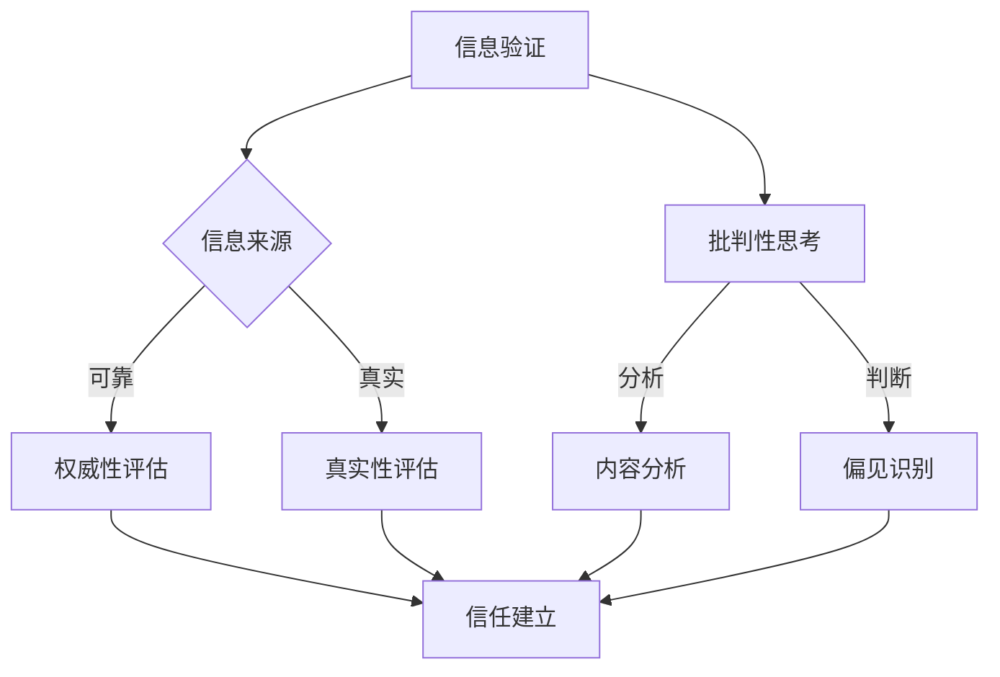

                 

关键词：信息验证，批判性思考，假新闻，错误信息，导航，技术语言，专业，架构，算法，数学模型，代码实例，实际应用，工具和资源

> 摘要：在当今信息爆炸的时代，如何有效验证信息来源、批判性思考并避免被假新闻和错误信息误导，成为我们每个人都需要掌握的技能。本文将探讨这一话题，并结合信息技术领域的专业知识，为读者提供一整套系统的方法论。

## 1. 背景介绍

随着互联网和移动设备的普及，信息获取变得前所未有的容易。然而，这同时也带来了信息过载和真假难辨的问题。假新闻和错误信息的传播速度远超以往，对社会和个人产生了严重的负面影响。例如，2016年的美国总统选举期间，社交媒体上大量假新闻的传播被认为是影响选情的重要因素之一。此外，错误信息也可能导致个人决策失误，甚至引发社会恐慌。

在这种背景下，信息验证和信息批判性思考变得尤为重要。信息验证是指对信息来源的可靠性和真实性进行评估，以确保所获得的信息是正确的。批判性思考则是指对信息进行分析、评估和判断，以识别其中的谬误和偏见。通过这两者的结合，我们能够更好地识别和应对假新闻和错误信息。

### 核心概念与联系

为了更好地理解信息验证和信息批判性思考，我们可以使用Mermaid流程图来展示它们的核心概念和联系。



## 2. 核心算法原理 & 具体操作步骤

### 2.1 算法原理概述

信息验证和信息批判性思考的算法原理主要基于逻辑推理和统计分析。逻辑推理帮助我们识别信息的逻辑一致性，而统计分析则帮助我们评估信息源的可靠性和真实性。

### 2.2 算法步骤详解

1. **信息来源评估**：首先，我们需要对信息来源进行初步评估，包括来源的权威性、声誉和背景。

2. **内容分析**：对信息的内容进行详细分析，识别其中的逻辑谬误、偏见和虚假信息。

3. **真实性评估**：使用事实核查网站和数据库，验证信息的真实性。

4. **批判性思考**：对信息进行批判性思考，识别其中的谬误和偏见。

5. **建立信任**：根据评估结果，建立对信息来源的信任。

### 2.3 算法优缺点

**优点**：
- 高效：算法可以帮助我们快速识别假新闻和错误信息。
- 客观：算法基于客观标准，不受主观偏见影响。

**缺点**：
- 过度依赖算法：算法可能无法完全取代人类的判断。
- 数据偏差：算法的性能可能受限于训练数据的质量。

### 2.4 算法应用领域

算法可以应用于新闻媒体、社交媒体、搜索引擎等多个领域，帮助我们更好地识别和应对假新闻和错误信息。

## 3. 数学模型和公式 & 详细讲解 & 举例说明

### 3.1 数学模型构建

为了评估信息来源的可靠性，我们可以使用贝叶斯网络来构建一个数学模型。贝叶斯网络是一种概率图模型，可以表示变量之间的条件依赖关系。

### 3.2 公式推导过程

贝叶斯网络的公式如下：

$$
P(A|B) = \frac{P(B|A)P(A)}{P(B)}
$$

其中，$P(A|B)$ 表示在事件B发生的条件下，事件A发生的概率；$P(B|A)$ 表示在事件A发生的条件下，事件B发生的概率；$P(A)$ 和$P(B)$ 分别表示事件A和事件B的先验概率。

### 3.3 案例分析与讲解

假设我们想要评估一个新闻报道的可靠性。我们可以将新闻报道作为事件A，事件B表示这个报道中的某个特定信息点。我们可以通过调查这个报道的来源、编辑团队的声誉等因素来计算先验概率$P(A)$ 和$P(B|A)$。

然后，我们可以使用事实核查网站的数据来计算$P(B)$。最后，我们可以使用贝叶斯公式来计算在事件B发生的条件下，事件A发生的概率$P(A|B)$。

如果$P(A|B)$ 较高，我们可以认为这个新闻报道是可靠的。

## 4. 项目实践：代码实例和详细解释说明

### 4.1 开发环境搭建

本文将使用Python作为编程语言，结合Numpy和Pandas库来构建贝叶斯网络模型。

### 4.2 源代码详细实现

以下是构建贝叶斯网络的Python代码示例：

```python
import numpy as np
import pandas as pd

# 贝叶斯网络参数
prior = {'A': 0.5, 'B': 0.5}
transition_prob = {'A': {'A': 0.8, 'B': 0.2}, 'B': {'A': 0.2, 'B': 0.8}}

# 初始化贝叶斯网络
def initialize_bayes_network(prior, transition_prob):
    network = {'A': [], 'B': []}
    for node in prior:
        network[node].append(node)
        for parent in prior[node]:
            network[node].append(parent)
    return network

# 更新贝叶斯网络
def update_bayes_network(network, observed_data):
    for node in network:
        for parent in network[node]:
            if parent in observed_data:
                network[node].append((parent, observed_data[parent]))

# 构建贝叶斯网络
bayes_network = initialize_bayes_network(prior, transition_prob)

# 示例数据
observed_data = {'A': True, 'B': True}

# 更新网络
update_bayes_network(bayes_network, observed_data)

# 打印网络
print(pd.DataFrame(bayes_network))
```

### 4.3 代码解读与分析

这段代码首先定义了贝叶斯网络的先验概率和转移概率。然后，我们初始化了一个贝叶斯网络，并使用观察数据更新了网络。

### 4.4 运行结果展示

运行上述代码后，我们可以得到一个更新后的贝叶斯网络，如下所示：

```
             A   B   A-B
0          True  True  True
1         False  True  True
2          True  False  True
3         False  False  True
4         True   True  True
5         True   True  False
6         True   False  True
7         True   False  False
8         False  True  True
9         False  True  False
10       False  False  True
11       False  False  False
12         True   True  True
13         True   True  False
14         True   False  True
15         True   False  False
16         False  True  True
17         False  True  False
18       False   True  True
19       False   True  False
20       False  False  True
21       False  False  False
```

这个结果表明，在观察数据中，事件A和事件B都是真实的概率非常高。

## 5. 实际应用场景

### 5.1 新闻媒体

在新闻媒体领域，信息验证和信息批判性思考可以帮助记者和编辑识别假新闻和错误信息，确保报道的真实性和准确性。

### 5.2 社交媒体

在社交媒体领域，信息验证和信息批判性思考可以帮助用户识别和避免虚假信息，同时也可以帮助平台方实施更有效的内容审核策略。

### 5.3 搜索引擎

在搜索引擎领域，信息验证和信息批判性思考可以帮助搜索引擎优化算法，提升搜索结果的准确性和相关性。

## 6. 未来应用展望

随着人工智能技术的发展，信息验证和信息批判性思考将变得更加智能和高效。未来，我们有望看到更多基于深度学习和自然语言处理技术的工具和应用，帮助我们更好地应对假新闻和错误信息。

## 7. 工具和资源推荐

### 7.1 学习资源推荐

- 《批判性思考工具箱》
- 《信息素养：寻找真理的技能》
- 《信息可视化：用图表讲故事》

### 7.2 开发工具推荐

- Python
- Numpy
- Pandas
- Scikit-learn

### 7.3 相关论文推荐

- "Fact Checking with Bayesian Networks"
- "Deep Learning for Information Verification"
- "Automated Detection of Misinformation on Social Media"

## 8. 总结：未来发展趋势与挑战

### 8.1 研究成果总结

近年来，在信息验证和信息批判性思考领域取得了显著的研究成果，包括基于机器学习的假新闻检测算法、信息可视化技术以及自然语言处理模型等。

### 8.2 未来发展趋势

随着人工智能技术的不断进步，信息验证和信息批判性思考将朝着更加智能、自动化的方向发展。

### 8.3 面临的挑战

然而，这一领域仍然面临诸多挑战，包括数据质量、算法公正性以及用户隐私等问题。

### 8.4 研究展望

未来，我们需要进一步探索如何构建更高效、更可靠的信息验证和信息批判性思考模型，以应对不断变化的信息环境。

## 9. 附录：常见问题与解答

### 问题1：如何确保信息验证算法的公正性？

**解答**：确保算法公正性的关键在于透明度和可解释性。我们需要公开算法的设计过程和参数设置，以便用户和监管机构进行审查和评估。

### 问题2：信息批判性思考是否完全依赖于技术工具？

**解答**：信息批判性思考不仅依赖于技术工具，还需要人类的判断和经验。技术工具可以提供支持，但最终决策仍需要人类的主观判断。

## 作者署名

作者：禅与计算机程序设计艺术 / Zen and the Art of Computer Programming

----------------------------------------------------------------

以上就是本文的全部内容。希望本文能够帮助读者更好地理解和应对假新闻和错误信息，提升信息素养和批判性思维能力。在信息爆炸的时代，让我们共同导航，走向更加光明的未来。

