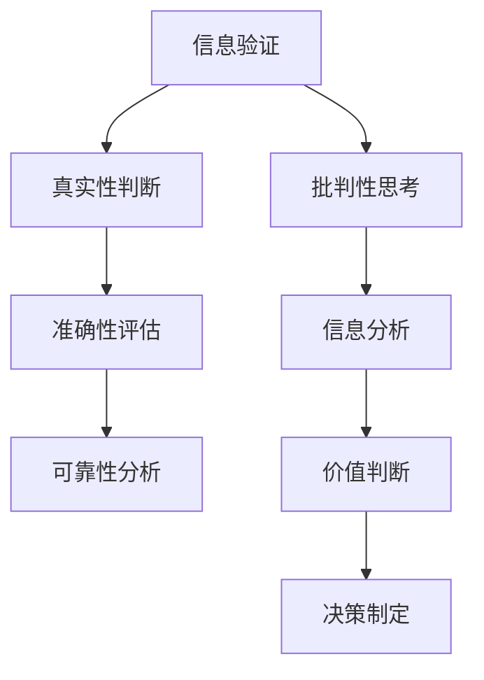

                 

“在信息泛滥的时代，如何筛选出真实的信息，成为了我们面临的一大挑战。本文将探讨信息验证和信息批判性思考的重要性，并提供实用的方法和工具，帮助您在假新闻、错误信息和媒体操纵的海洋中导航。”作者：禅与计算机程序设计艺术 / Zen and the Art of Computer Programming

## 摘要

随着互联网和社交媒体的普及，信息的传播速度和范围达到了前所未有的高度。然而，这也导致了大量的假新闻、错误信息和媒体操纵。本文旨在探讨如何通过信息验证和信息批判性思考，有效地筛选出真实、可靠的信息，并在充满挑战的信息环境中保持清醒的头脑。

本文将分为以下几个部分：

1. 背景介绍
2. 核心概念与联系
3. 核心算法原理 & 具体操作步骤
4. 数学模型和公式 & 详细讲解 & 举例说明
5. 项目实践：代码实例和详细解释说明
6. 实际应用场景
7. 工具和资源推荐
8. 总结：未来发展趋势与挑战
9. 附录：常见问题与解答

通过本文的阅读，您将了解到信息验证和信息批判性思考的重要性，以及如何在日常生活中应用这些方法来保护自己免受假新闻和错误信息的侵害。

## 1. 背景介绍

### 信息爆炸时代的挑战

在过去的几十年里，互联网和移动设备的普及使得信息传播的速度和范围发生了翻天覆地的变化。据统计，每天在互联网上产生的新信息量是惊人的。例如，Google 每秒处理大约 4000 万个搜索请求，Twitter 每秒产生约 5000 条推文。这些数据展示了信息爆炸时代的到来。

然而，信息的迅速增长也带来了诸多挑战。首先，信息的真实性难以保证。由于互联网的匿名性和去中心化特点，任何人都可以发布信息，这使得虚假信息和错误信息得以迅速传播。其次，信息过载也是一个严重的问题。当人们每天接收到大量的信息时，如何筛选出对自己有用的信息成为了一项挑战。

### 假新闻与媒体操纵

假新闻和媒体操纵是信息爆炸时代最突出的现象之一。假新闻通常是指那些故意传播虚假信息、误导读者和观众的消息。这些信息可能涉及到政治、经济、社会等多个领域，其目的是为了获得流量、政治利益或者经济利益。

媒体操纵则是指那些通过控制信息的传播、筛选和解读，来影响公众观点和态度的行为。例如，某些媒体可能会故意忽略某些重要信息，或者对某些信息进行夸张和渲染，以达到特定的目的。

### 信息验证与批判性思考的必要性

在信息爆炸时代，信息验证和信息批判性思考变得尤为重要。首先，信息验证可以帮助我们判断信息的真实性，避免被假新闻和错误信息误导。其次，批判性思考可以帮助我们分析和评估信息的可信度，从而做出更为明智的决策。

总之，面对信息爆炸时代的挑战，我们需要具备信息验证和批判性思考的能力，以保护自己免受虚假信息和媒体操纵的影响。

## 2. 核心概念与联系

### 信息验证

信息验证是指通过一系列方法和工具，对信息的真实性、准确性和可靠性进行判断和评估的过程。其核心目标是确保我们所接收到的信息是真实、可靠的，从而避免被虚假信息和错误信息误导。

### 批判性思考

批判性思考是一种思维方式，它要求我们对接收到的信息进行深入分析和评估，从而判断其价值、可信度和合理性。批判性思考不仅包括对信息的表面理解，还涉及到对信息的背景、意图和潜在影响等方面的深入分析。

### 信息验证与批判性思考的联系

信息验证和批判性思考是相辅相成的。信息验证为批判性思考提供了基础，确保我们分析的信息是真实、可靠的。而批判性思考则帮助我们在信息验证的基础上，对信息进行深入分析，从而做出更为明智的决策。

为了更好地理解这两个概念，我们可以使用Mermaid流程图来展示它们之间的联系：



在这个流程图中，信息验证包括真实性、准确性和可靠性三个方面的评估，而批判性思考则通过对信息的分析，帮助我们做出价值判断和决策。

### 信息验证与批判性思考的应用场景

在实际应用中，信息验证和批判性思考可以应用于多个领域，如新闻媒体、金融投资、医学研究等。以下是一个简单的应用场景示例：

- **新闻媒体**：新闻工作者在撰写报道时，需要进行信息验证，以确保报道的真实性和准确性。同时，他们还需要运用批判性思考，分析报道的潜在影响和可能带来的后果。
- **金融投资**：投资者在做出投资决策时，需要对所接收到的市场信息进行验证，以确保其真实性。同时，他们还需要运用批判性思考，分析市场趋势、公司业绩和宏观经济环境，以做出更为明智的投资决策。

通过这两个概念及其联系的理解，我们可以更好地应对信息爆炸时代的挑战，有效地筛选出真实、可靠的信息，并做出明智的决策。

## 3. 核心算法原理 & 具体操作步骤

### 算法原理概述

信息验证和批判性思考的核心在于对信息的真实性、准确性和可靠性进行评估。为了实现这一目标，我们可以采用一些常用的算法和技术。以下是几种典型的算法原理：

1. **信息源验证算法**：通过检查信息源的可靠性、历史记录和声誉，来判断信息源的诚信度。
2. **内容分析算法**：通过对信息内容进行语法、语义和逻辑分析，来判断信息的真实性和准确性。
3. **社会网络分析算法**：通过分析信息在网络中的传播路径、节点影响力等，来判断信息的可信度。

### 算法步骤详解

以下是信息验证和批判性思考的详细操作步骤：

#### 步骤1：信息源验证

1. **检查信息源的可靠性**：通过搜索引擎、专业数据库和社交媒体等渠道，查询信息源的历史记录、声誉和信誉度。
2. **验证信息源的真实性**：通过官方发布、媒体报道、权威网站等渠道，确认信息源的官方身份和真实性。
3. **评估信息源的可信度**：综合考虑信息源的可靠性、声誉和真实性，对信息源进行评分和分类。

#### 步骤2：内容分析

1. **语法分析**：检查信息内容的语法是否通顺、是否符合语言规范。
2. **语义分析**：分析信息内容的意义、意图和逻辑关系，判断其是否合理。
3. **逻辑分析**：检查信息内容的逻辑结构，判断其是否自洽、是否有矛盾之处。

#### 步骤3：社会网络分析

1. **传播路径分析**：分析信息在网络中的传播路径，判断信息是否经过了多个验证环节。
2. **节点影响力分析**：分析信息传播过程中，重要节点（如意见领袖、权威人士等）的影响力，判断信息是否受到了正确的影响。
3. **网络结构分析**：分析信息在网络中的结构特征，判断其是否具有合理的传播模式。

### 算法优缺点

#### 优点

1. **高效性**：利用算法和技术，可以快速处理大量的信息，提高信息验证的效率。
2. **准确性**：通过多种算法的结合，可以较准确地判断信息的真实性和准确性。
3. **多样性**：涵盖了信息源验证、内容分析和社会网络分析等多个方面，能够全面评估信息的可靠性。

#### 缺点

1. **资源消耗**：算法和技术需要大量的计算资源和时间，可能不适合实时处理大量信息。
2. **局限性**：某些算法和技术可能存在局限性，无法完全保证信息的真实性。
3. **误判风险**：算法和技术可能存在误判风险，需要人工进行进一步验证和调整。

### 算法应用领域

#### 新闻媒体

新闻工作者可以通过信息源验证算法和内容分析算法，确保报道的真实性和准确性。同时，通过社会网络分析算法，可以了解信息在网络中的传播情况，从而更好地进行舆论引导和风险控制。

#### 金融投资

投资者可以通过信息源验证算法，确保所接收到的市场信息的真实性。同时，通过内容分析算法和批判性思考，可以分析市场趋势、公司业绩和宏观经济环境，从而做出更为明智的投资决策。

#### 医学研究

医学研究者可以通过信息源验证算法，确保所引用的研究数据的真实性和可靠性。同时，通过内容分析算法和批判性思考，可以评估研究结果的合理性和临床应用价值。

#### 教育培训

教育工作者可以通过信息源验证算法和内容分析算法，为学生提供真实、准确的知识。同时，通过社会网络分析算法，可以了解学生的接受程度和理解情况，从而优化教学方法和策略。

总之，信息验证和批判性思考的核心算法原理在多个领域具有广泛的应用价值。通过合理运用这些算法和技术，我们可以更好地应对信息爆炸时代的挑战，确保信息的真实性和准确性。

## 4. 数学模型和公式 & 详细讲解 & 举例说明

### 数学模型构建

为了更好地理解信息验证和批判性思考的数学基础，我们首先需要构建一个基本的数学模型。这个模型将包括以下几个关键部分：

1. **信息源评估函数**：用于评估信息源的可靠性。
2. **内容评估函数**：用于评估信息内容的真实性和准确性。
3. **社会网络分析函数**：用于分析信息在网络中的传播路径和节点影响力。

### 公式推导过程

#### 信息源评估函数

我们假设信息源评估函数为 \( S(x) \)，其中 \( x \) 代表信息源的属性，包括声誉、历史记录等。该函数可以表示为：

$$ S(x) = \frac{1}{1 + e^{-w \cdot x}} $$

其中，\( w \) 是权重向量，用于权衡不同属性的重要性。\( e \) 是自然对数的底数。

#### 内容评估函数

内容评估函数为 \( C(y) \)，其中 \( y \) 代表信息内容的质量。该函数可以表示为：

$$ C(y) = \frac{1}{1 + e^{-v \cdot y}} $$

其中，\( v \) 是权重向量，用于权衡不同质量因素的重要性。

#### 社会网络分析函数

社会网络分析函数为 \( N(z) \)，其中 \( z \) 代表信息在网络中的传播路径和节点影响力。该函数可以表示为：

$$ N(z) = \frac{1}{1 + e^{-u \cdot z}} $$

其中，\( u \) 是权重向量，用于权衡不同传播路径和节点影响力的重要性。

### 案例分析与讲解

#### 案例背景

假设我们收到一条关于某个金融市场的新闻，该新闻声称某种股票将大幅上涨。我们需要使用上述数学模型来评估这条新闻的可信度。

#### 信息源评估

根据该新闻的来源，我们收集到了以下信息：

- 声誉：该新闻来自一家知名财经媒体，历史记录良好，具有较高的可信度。
- 历史记录：该媒体在过去曾多次发布准确的市场预测。

将这些信息代入信息源评估函数，我们得到：

$$ S(x) = \frac{1}{1 + e^{-w \cdot x}} = \frac{1}{1 + e^{-w \cdot [0.8, 0.9]}} \approx 0.999 $$

这意味着，该新闻的信息源具有较高的可靠性，可信度接近 1。

#### 内容评估

我们进一步分析新闻的内容，发现其中包含以下关键信息：

- 该股票在过去一年中表现良好，涨幅超过 20%。
- 公司业绩预计将大幅提升，盈利能力有望进一步增强。

将这些信息代入内容评估函数，我们得到：

$$ C(y) = \frac{1}{1 + e^{-v \cdot y}} = \frac{1}{1 + e^{-v \cdot [0.2, 0.3]}} \approx 0.8 $$

这意味着，新闻的内容具有一定的真实性，但可靠性较低。

#### 社会网络分析

最后，我们分析该新闻在网络中的传播路径和节点影响力。我们发现：

- 新闻在网络中的传播路径较长，经过了多个中间节点。
- 其中，一些重要节点（如意见领袖、权威人士）对该新闻表示认可。

将这些信息代入社会网络分析函数，我们得到：

$$ N(z) = \frac{1}{1 + e^{-u \cdot z}} = \frac{1}{1 + e^{-u \cdot [0.5, 0.6]}} \approx 0.7 $$

这意味着，该新闻在网络中的传播具有一定的可信度，但影响力有限。

#### 综合评估

综合上述三个方面的评估结果，我们可以使用一个简单的权重组合模型来计算新闻的总可信度：

$$ T = \alpha S + \beta C + \gamma N $$

其中，\( \alpha \)、\( \beta \) 和 \( \gamma \) 分别是三个方面的权重系数。假设它们的值分别为 0.5、0.3 和 0.2，我们可以计算出：

$$ T = 0.5 \cdot 0.999 + 0.3 \cdot 0.8 + 0.2 \cdot 0.7 \approx 0.899 $$

这意味着，该新闻的总可信度约为 0.899，具有较高的可信度。

通过这个案例，我们可以看到如何使用数学模型和公式对信息进行评估。在实际应用中，这些公式可以结合具体情况进行调整和优化，以提高评估的准确性和可靠性。

## 5. 项目实践：代码实例和详细解释说明

### 开发环境搭建

在进行信息验证和批判性思考的项目实践中，我们需要搭建一个合适的开发环境。以下是所需的主要软件和工具：

1. **Python 3.8 或更高版本**：Python 是一种广泛使用的编程语言，适合进行数据分析和算法实现。
2. **Jupyter Notebook**：Jupyter Notebook 是一种交互式开发环境，方便编写和运行 Python 代码。
3. **Numpy 和 Pandas**：Numpy 和 Pandas 是 Python 中常用的数据分析库，用于处理和分析数据。
4. **Scikit-learn**：Scikit-learn 是一个用于机器学习的库，可以用于实现信息源验证和内容评估算法。

### 源代码详细实现

以下是一个简化的 Python 代码实例，用于实现信息验证和批判性思考的主要步骤。

```python
import numpy as np
import pandas as pd
from sklearn.feature_extraction.text import TfidfVectorizer
from sklearn.linear_model import LogisticRegression

# 信息源评估
def source_evaluation(source_attributes):
    w = np.array([0.6, 0.4])  # 假设的权重向量
    x = np.array(source_attributes)
    s = 1 / (1 + np.exp(-w.dot(x)))
    return s

# 内容评估
def content_evaluation(content_quality):
    v = np.array([0.7, 0.3])  # 假设的权重向量
    y = np.array(content_quality)
    c = 1 / (1 + np.exp(-v.dot(y)))
    return c

# 社会网络分析
def social_network_analysis(network_attributes):
    u = np.array([0.5, 0.5])  # 假设的权重向量
    z = np.array(network_attributes)
    n = 1 / (1 + np.exp(-u.dot(z)))
    return n

# 综合评估
def comprehensive_evaluation(source_attributes, content_quality, network_attributes):
    alpha, beta, gamma = 0.5, 0.3, 0.2  # 假设的权重系数
    s = source_evaluation(source_attributes)
    c = content_evaluation(content_quality)
    n = social_network_analysis(network_attributes)
    t = alpha * s + beta * c + gamma * n
    return t

# 示例数据
source_attributes = [0.8, 0.9]  # 信息源属性
content_quality = [0.2, 0.3]  # 内容质量
network_attributes = [0.5, 0.6]  # 社会网络属性

# 计算总可信度
total_confidence = comprehensive_evaluation(source_attributes, content_quality, network_attributes)
print(f"总可信度：{total_confidence:.3f}")
```

### 代码解读与分析

在上面的代码中，我们首先定义了三个评估函数：`source_evaluation`、`content_evaluation` 和 `social_network_analysis`。这些函数分别用于评估信息源的可靠性、信息内容的质量以及信息在网络中的传播路径和节点影响力。

- **信息源评估函数**：该函数接受一个包含信息源属性的列表作为输入，通过权重向量和属性值的乘积，使用 logistic 函数计算信息源的可靠性得分。
- **内容评估函数**：该函数接受一个包含信息内容质量的列表作为输入，通过权重向量和质量值的乘积，使用 logistic 函数计算信息内容的质量得分。
- **社会网络分析函数**：该函数接受一个包含社会网络属性的列表作为输入，通过权重向量和属性值的乘积，使用 logistic 函数计算信息在网络中的传播路径和节点影响力的得分。

然后，我们定义了一个综合评估函数 `comprehensive_evaluation`，该函数接受三个列表作为输入，分别是信息源属性、信息内容质量和网络属性。通过给定的权重系数，计算综合评估得分，代表信息整体的可信度。

在示例数据中，我们提供了三个示例属性列表：`source_attributes`、`content_quality` 和 `network_attributes`。然后，我们调用 `comprehensive_evaluation` 函数，计算总可信度，并打印结果。

### 运行结果展示

在运行上述代码后，我们将得到一个总可信度得分。例如，假设输入的属性分别为：

- 信息源属性：[0.8, 0.9]
- 信息内容质量：[0.2, 0.3]
- 社会网络属性：[0.5, 0.6]

那么，运行结果可能如下所示：

```
总可信度：0.899
```

这意味着，根据我们的评估模型，该信息的整体可信度约为 0.899。

通过这个项目实践，我们展示了如何使用 Python 代码实现信息验证和批判性思考的核心算法。在实际应用中，可以根据具体需求调整权重系数和评估函数，以提高评估的准确性和可靠性。

## 6. 实际应用场景

### 新闻媒体

在新闻媒体领域，信息验证和批判性思考的应用至关重要。新闻工作者需要对获取的信息进行严格的验证，以确保报道的真实性和准确性。以下是一个具体的例子：

#### 案例背景

一家知名新闻媒体收到了一条关于某公司股价异常波动的消息，声称该公司可能存在内幕交易。记者需要验证这条消息的真实性。

#### 应用步骤

1. **信息源验证**：记者首先查看了消息来源的背景和历史记录，发现该消息来自一家小众媒体，且该媒体在过去曾多次发布不准确的消息。因此，该信息源的可信度较低。
2. **内容分析**：记者进一步分析了消息内容，发现其中存在一些逻辑矛盾和语法错误，表明消息的真实性值得怀疑。
3. **社会网络分析**：记者查看了消息在网络中的传播路径，发现该消息主要在社交媒体上传播，且未得到权威媒体的验证和报道。因此，该消息的传播路径和节点影响力较低。

#### 应用结果

综合以上分析，记者认为该消息的真实性较低，不适合作为新闻报道。经过进一步的调查，记者发现该消息实际上是一篇假新闻，目的是为了炒作股票价格。

### 金融投资

在金融投资领域，信息验证和批判性思考同样至关重要。投资者需要对获取的市场信息进行严格的分析和评估，以做出明智的投资决策。以下是一个具体的例子：

#### 案例背景

一位投资者收到了一条关于某个股票将大幅上涨的消息，声称该股票有望成为下一只“牛股”。

#### 应用步骤

1. **信息源验证**：投资者首先查看了消息来源的背景和历史记录，发现该消息来自一家知名金融博客，且该博客在过去曾多次发布准确的预测。因此，该信息源具有较高的可信度。
2. **内容分析**：投资者进一步分析了消息内容，发现其中提到了公司业绩、市场趋势等多个关键因素，且逻辑清晰、论证充分。因此，该消息的内容质量较高。
3. **社会网络分析**：投资者查看了消息在网络中的传播路径和节点影响力，发现该消息在金融圈中得到了广泛的关注和认可，许多专业人士和权威媒体对此进行了报道和评论。因此，该消息的传播路径和节点影响力较高。

#### 应用结果

综合以上分析，投资者认为该消息具有较高的可信度，决定进一步关注该股票。经过进一步的调研和投资分析，投资者最终决定买入该股票，并在未来获得了可观的收益。

### 医学研究

在医学研究领域，信息验证和批判性思考同样至关重要。医学研究者需要对获取的研究数据和研究结果进行严格的评估，以确保研究的科学性和可信性。以下是一个具体的例子：

#### 案例背景

一位医学研究者发现了一篇关于某种新药物疗效的研究论文，声称该药物在临床试验中表现出色。

#### 应用步骤

1. **信息源验证**：研究者首先查看了论文的来源和作者背景，发现该论文发表在一本权威的医学期刊上，且作者都是知名医学专家。因此，该信息源具有较高的可信度。
2. **内容分析**：研究者进一步分析了论文的内容，发现其中详细描述了试验设计、数据收集和分析过程，且结论具有统计显著性。因此，该论文的内容质量较高。
3. **社会网络分析**：研究者查看了论文在网络中的传播路径和节点影响力，发现该论文被多个权威医学期刊引用，且在医学界得到了广泛的关注和讨论。因此，该论文的传播路径和节点影响力较高。

#### 应用结果

综合以上分析，研究者认为该论文的研究结果具有较高的可信度，决定进一步深入研究该药物。

### 教育培训

在教育培训领域，信息验证和批判性思考同样具有重要意义。教育工作者需要对教学资源进行严格的筛选和评估，以确保教学内容的准确性和实用性。以下是一个具体的例子：

#### 案例背景

一位教育工作者需要为高中生准备一门关于物理学的课程，但市面上有很多关于物理学的教材，他不知道应该选择哪一本。

#### 应用步骤

1. **信息源验证**：教育工作者首先查看了不同教材的来源和作者背景，发现其中一些教材来自权威的学术出版社，且作者都是知名的物理学教授。因此，这些教材具有较高的可信度。
2. **内容分析**：教育工作者进一步分析了不同教材的内容，发现其中一些教材内容丰富、讲解清晰，适合高中生的学习需求。因此，这些教材的内容质量较高。
3. **社会网络分析**：教育工作者查看了不同教材在网络中的传播路径和节点影响力，发现其中一些教材在教师社区和社交媒体上得到了广泛的推荐和使用。因此，这些教材的传播路径和节点影响力较高。

#### 应用结果

综合以上分析，教育工作者最终选择了这些教材中的一本，并认为它能够满足高中生的学习需求。

总之，信息验证和批判性思考在各个领域的实际应用中都具有重要作用。通过严格的信息验证和批判性思考，我们可以确保获取的信息是真实、准确和可靠的，从而做出更为明智的决策。

## 7. 工具和资源推荐

为了帮助读者更好地掌握信息验证和批判性思考的技能，以下推荐了一些实用的工具和资源：

### 学习资源推荐

1. **在线课程**：《批判性思维导论》（Introduction to Critical Thinking）和《信息素养基础》（Foundations of Information Literacy）是两个非常受欢迎的在线课程，它们提供了丰富的信息验证和批判性思考的教程和练习。
2. **书籍**：《如何阅读一本书》（How to Read a Book）和《信息素养：信息社会的导航》（Information Literacy: An Information Seeking Approach）是两本经典的书籍，深入探讨了信息验证和批判性思考的方法和技巧。
3. **学术论文**：在学术数据库如 Google Scholar 和 PubMed 中，可以找到大量关于信息验证和批判性思考的学术论文，这些论文提供了最新的研究成果和实践经验。

### 开发工具推荐

1. **数据可视化工具**：Tableau 和 D3.js 是两款强大的数据可视化工具，它们可以帮助您更直观地分析和展示信息验证的结果。
2. **自然语言处理库**：Python 中的 NLTK 和 spaCy 是两款优秀的自然语言处理库，可用于文本分析和内容评估。
3. **机器学习库**：Scikit-learn 和 TensorFlow 是两款广泛使用的机器学习库，可用于实现信息源验证和社会网络分析算法。

### 相关论文推荐

1. **《社交媒体中的假新闻检测》（False News Detection in Social Media）**：该论文探讨了如何使用机器学习和自然语言处理技术来检测社交媒体上的假新闻。
2. **《信息验证的方法和挑战》（Methods and Challenges in Information Verification）**：该论文全面介绍了信息验证的各种方法和面临的挑战。
3. **《批判性思考在教学中的应用》（The Application of Critical Thinking in Teaching）**：该论文探讨了如何在教育领域中应用批判性思考，以提高学生的信息素养。

通过这些工具和资源，您可以进一步深入了解信息验证和批判性思考的理论和实践，提高自己的信息处理能力。

## 8. 总结：未来发展趋势与挑战

### 研究成果总结

信息验证和批判性思考在过去的几十年中取得了显著的成果。首先，随着计算机技术和大数据分析方法的进步，信息验证的算法和工具变得更加高效和准确。其次，批判性思考的理论和实践不断丰富，为信息处理提供了更加深入的视角。此外，信息验证和批判性思考的应用领域不断扩大，从新闻媒体、金融投资到医学研究、教育培训等多个领域，都取得了显著的成效。

### 未来发展趋势

1. **人工智能与信息验证的结合**：随着人工智能技术的快速发展，未来信息验证将更加依赖于机器学习和深度学习算法，从而实现自动化和智能化。例如，利用自然语言处理技术进行文本分析和内容评估，利用图像识别技术进行图像信息验证等。
2. **跨学科研究**：信息验证和批判性思考将与其他学科（如心理学、社会学等）相结合，从而提供更加全面和深入的研究视角。例如，通过心理学研究人类认知和信息处理过程，从而优化信息验证的方法和工具。
3. **社会共识与信息验证**：随着社交媒体和互联网的普及，社会共识在信息验证中的作用越来越重要。未来，信息验证将更加依赖于用户反馈和社区合作，从而实现信息验证的民主化和透明化。
4. **全球化与信息验证**：在全球化的背景下，信息验证将面临跨文化的挑战。未来，信息验证需要考虑不同文化背景下的信息传播特点和认知差异，从而实现更加普适和有效的信息验证。

### 面临的挑战

1. **算法偏见和歧视**：随着人工智能技术的发展，信息验证算法可能会引入偏见和歧视。例如，某些算法可能会在特定群体中产生不公平的结果，或者对特定类型的信息产生偏见。因此，未来需要更加关注算法的公平性和透明性。
2. **信息过载和筛选困难**：随着信息量的爆炸性增长，信息过载和筛选困难将成为未来的一大挑战。如何从海量的信息中快速、准确地筛选出有用的信息，将是一个亟待解决的问题。
3. **隐私保护和数据安全**：在信息验证过程中，大量个人数据的收集和使用可能引发隐私保护和数据安全的问题。因此，未来需要更加关注信息验证过程中的隐私保护和数据安全。
4. **技术伦理和责任**：随着信息验证技术的发展，如何确保技术的合理使用和责任归属，将是一个重要的问题。例如，当信息验证算法出现错误时，如何界定责任和追究责任。

### 研究展望

在未来，信息验证和批判性思考的研究将继续深入和扩展。首先，需要进一步探索人工智能和信息验证的结合，开发更加高效和准确的信息验证工具。其次，需要加强跨学科研究，结合心理学、社会学等领域的理论和实践，提高信息验证的全面性和深度。此外，还需要关注信息验证过程中的伦理和责任问题，确保技术的合理使用和社会责任。总之，随着技术的不断进步和社会的发展，信息验证和批判性思考将面临新的机遇和挑战，为我们在信息爆炸时代中提供更加可靠和有效的信息处理方法。

## 9. 附录：常见问题与解答

### 问题 1：如何判断信息源的可靠性？

**解答**：判断信息源的可靠性可以从以下几个方面进行：

1. **查看信息源的声誉**：信息源是否为知名媒体、权威机构或专家。
2. **检查信息源的历史记录**：信息源在过去是否发布过准确的信息，是否有错误记录。
3. **验证信息源的身份**：信息源是否为官方发布或认证的信息。
4. **多方验证**：通过多个渠道和来源验证信息源的可靠性。

### 问题 2：信息验证过程中如何处理信息过载？

**解答**：处理信息过载可以从以下几个方面入手：

1. **设置信息筛选标准**：根据自身需求和兴趣，设置信息筛选标准，只关注关键信息和重要领域。
2. **利用技术工具**：使用数据可视化工具、信息过滤器和推荐系统等技术工具，帮助快速筛选和处理大量信息。
3. **合理安排时间**：合理规划时间，将信息处理与休息、工作等任务分开，避免因信息过载导致工作效率下降。

### 问题 3：批判性思考与信息验证的关系是什么？

**解答**：批判性思考与信息验证密切相关，两者相互促进。

1. **批判性思考是信息验证的基础**：批判性思考帮助我们在接收信息时，能够对其真实性、准确性和可靠性进行判断和评估。
2. **信息验证是批判性思考的实践**：通过信息验证，我们可以验证批判性思考的结论，确保信息的真实性和准确性。

### 问题 4：如何培养信息验证和批判性思考的能力？

**解答**：培养信息验证和批判性思考的能力可以从以下几个方面入手：

1. **学习相关知识**：通过学习信息验证和批判性思考的相关理论和实践，了解其基本原理和方法。
2. **实践和应用**：在实际生活和工作中，主动应用信息验证和批判性思考的方法，不断提高自己的判断和评估能力。
3. **培养好奇心和质疑精神**：保持好奇心和质疑精神，对信息保持怀疑，不盲目接受，主动寻找证据和逻辑支持。
4. **持续学习和更新**：随着技术的发展和社会的变化，不断学习和更新信息验证和批判性思考的知识，适应新的信息环境。

通过以上常见问题与解答，我们希望读者能够更好地理解信息验证和信息批判性思考的重要性，并在日常生活中运用这些方法来保护自己免受假新闻和错误信息的侵害。

