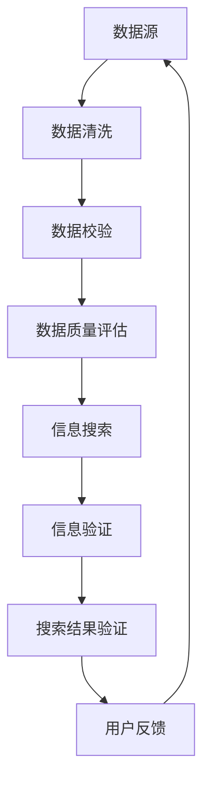

                 

关键词：信息验证、信息搜索、可靠信息、技术实践、数据质量管理

> 摘要：本文将深入探讨信息验证和信息搜索技术的核心概念、原理及其在现实中的应用。通过详细的算法讲解、数学模型分析和实践案例展示，我们旨在帮助读者掌握如何在海量信息中找到可靠的信息，提升数据质量，并为其未来的发展提供展望。

## 1. 背景介绍

在数字化和信息化的时代，数据已成为企业、组织和个人宝贵的资产。然而，随着数据的爆炸性增长，如何从海量数据中获取准确、可靠的信息成为了一个巨大的挑战。信息验证和信息搜索技术应运而生，它们不仅帮助我们筛选和验证数据质量，还帮助我们快速、准确地找到所需的信息。

### 1.1. 数据质量问题

数据质量问题主要体现在以下几个方面：

- **数据准确性**：数据中存在错误或不一致的情况。
- **数据完整性**：数据缺失或不完整。
- **数据时效性**：数据过时，不能反映当前实际情况。
- **数据一致性**：不同来源或不同处理过程的数据存在矛盾。

### 1.2. 信息验证和信息搜索的意义

- **提升决策质量**：通过信息验证，可以确保决策基于准确和可靠的数据，减少因数据问题导致的错误决策。
- **提高工作效率**：信息搜索技术可以帮助用户快速定位所需信息，提高工作效率。
- **数据资产化**：通过信息验证和信息搜索，将数据转化为有价值的信息资产，为组织创造更大的价值。

## 2. 核心概念与联系

### 2.1. 信息验证

信息验证是指通过一系列方法和技术，对数据的质量、准确性、完整性、时效性等方面进行验证和评估。信息验证的过程通常包括数据清洗、数据校验和数据质量评估等步骤。

### 2.2. 信息搜索

信息搜索是指利用特定的算法和策略，在海量数据中快速定位和检索所需信息的过程。信息搜索技术主要包括全文检索、关键字搜索、语义搜索等。

### 2.3. 核心概念联系

信息验证和信息搜索是相辅相成的两个过程。信息验证是信息搜索的基础，只有确保数据质量，才能进行有效的信息搜索。而信息搜索的结果又反过来影响信息验证，因为搜索到的信息需要再次验证其准确性和可靠性。

### 2.4. Mermaid 流程图

下面是一个描述信息验证和信息搜索过程的核心概念和联系的 Mermaid 流程图：



## 3. 核心算法原理 & 具体操作步骤

### 3.1. 算法原理概述

信息验证和信息搜索的核心算法主要包括以下几个方面：

- **数据清洗算法**：用于处理数据中的错误、缺失和不一致，如缺失值填补、异常值检测和去重等。
- **数据校验算法**：用于验证数据的格式、范围和一致性，如校验和、数据格式校验等。
- **数据质量评估算法**：用于评估数据的质量，如数据完整性评估、准确性评估等。
- **信息搜索算法**：用于在大量数据中快速检索所需信息，如关键字搜索、全文检索和语义搜索等。

### 3.2. 算法步骤详解

#### 3.2.1. 数据清洗算法

数据清洗算法的具体步骤包括：

1. **缺失值填补**：使用平均值、中位数、最频繁值等方法填补缺失值。
2. **异常值检测**：使用统计学方法、机器学习方法等检测数据中的异常值，并进行处理。
3. **去重**：检测并删除重复的数据记录。

#### 3.2.2. 数据校验算法

数据校验算法的具体步骤包括：

1. **数据格式校验**：检查数据是否符合预定的格式，如数据类型、长度、范围等。
2. **校验和校验**：计算数据的校验和，并与预定的校验值进行比较，以检测数据是否被篡改。

#### 3.2.3. 数据质量评估算法

数据质量评估算法的具体步骤包括：

1. **完整性评估**：检查数据是否完整，如是否有缺失值。
2. **准确性评估**：比较实际数据和预期数据，评估数据的准确性。
3. **一致性评估**：检查不同来源或不同处理过程的数据是否一致。

#### 3.2.4. 信息搜索算法

信息搜索算法的具体步骤包括：

1. **关键字搜索**：根据用户输入的关键字，在数据中检索相关记录。
2. **全文检索**：对整个数据集进行全文检索，找出包含关键字的所有记录。
3. **语义搜索**：利用自然语言处理技术，理解用户查询的语义，并返回相关记录。

### 3.3. 算法优缺点

#### 数据清洗算法

- **优点**：能有效提高数据质量，减少错误和不一致。
- **缺点**：处理复杂，计算量大，可能引入新的错误。

#### 数据校验算法

- **优点**：能及时发现数据问题，防止错误数据进入系统。
- **缺点**：对数据格式和范围限制严格，可能影响数据的灵活性。

#### 数据质量评估算法

- **优点**：能全面评估数据质量，为数据治理提供依据。
- **缺点**：评估过程复杂，可能需要大量计算资源。

#### 信息搜索算法

- **优点**：能快速检索所需信息，提高工作效率。
- **缺点**：对海量数据检索效率可能较低。

### 3.4. 算法应用领域

- **企业数据治理**：通过信息验证和信息搜索技术，提高企业数据质量，支持决策制定。
- **金融领域**：确保金融交易数据的准确性和一致性，提高风险管理能力。
- **医疗领域**：通过信息验证和信息搜索，提高病历数据的准确性，支持临床决策。

## 4. 数学模型和公式 & 详细讲解 & 举例说明

### 4.1. 数学模型构建

信息验证和信息搜索技术的核心数学模型主要包括以下几个方面：

- **数据分布模型**：用于描述数据在各个取值上的分布情况，如正态分布、泊松分布等。
- **回归模型**：用于预测数据的关系，如线性回归、多项式回归等。
- **聚类模型**：用于将数据划分为不同的类别，如K均值聚类、层次聚类等。
- **分类模型**：用于将数据分为不同类别，如决策树、支持向量机等。

### 4.2. 公式推导过程

#### 数据分布模型

- **正态分布**：概率密度函数为 $$ f(x|\mu, \sigma^2) = \frac{1}{\sqrt{2\pi\sigma^2}} e^{-\frac{(x-\mu)^2}{2\sigma^2}} $$
- **泊松分布**：概率质量函数为 $$ P(X=k) = \frac{e^{-\lambda}\lambda^k}{k!} $$

#### 回归模型

- **线性回归**：损失函数为 $$ J(\theta) = \frac{1}{m}\sum_{i=1}^m (h_\theta(x^{(i)}) - y^{(i)})^2 $$
- **多项式回归**：损失函数为 $$ J(\theta_0, \theta_1, ..., \theta_n) = \frac{1}{m}\sum_{i=1}^m (h_\theta(x^{(i)}) - y^{(i)})^2 $$

#### 聚类模型

- **K均值聚类**：目标函数为 $$ J = \frac{1}{K}\sum_{k=1}^K \sum_{i=1}^k (x_i - \mu_k)^2 $$
- **层次聚类**：目标函数为 $$ J = \sum_{i=1}^n \sum_{j=1}^n w_{ij} d_{ij} $$

#### 分类模型

- **决策树**：损失函数为 $$ J = \sum_{i=1}^m l(y^{(i)}, h_\theta(x^{(i)})) $$
- **支持向量机**：损失函数为 $$ J = \frac{1}{2}\sum_{i=1}^m \sum_{j=1}^m \alpha_i \alpha_j y_i y_j (w^T x_i - x_j)^2 $$

### 4.3. 案例分析与讲解

#### 数据分布模型

假设我们有一组数据 {1, 2, 2, 3, 4, 5, 5, 5, 6}，要求计算这组数据的正态分布和泊松分布概率。

1. **正态分布**：

   - 平均值 $$ \mu = \frac{1+2+2+3+4+5+5+5+6}{9} = 4 $$
   - 方差 $$ \sigma^2 = \frac{1}{9}\sum_{i=1}^9 (x_i - \mu)^2 = 2 $$
   - 概率密度函数为 $$ f(x|\mu, \sigma^2) = \frac{1}{\sqrt{2\pi\cdot 2}} e^{-\frac{(x-4)^2}{2\cdot 2}} $$

   例如，计算 $x=3$ 的概率密度：

   $$ f(3|4, 2) = \frac{1}{\sqrt{2\pi\cdot 2}} e^{-\frac{(3-4)^2}{2\cdot 2}} \approx 0.242 $$

2. **泊松分布**：

   - 平均值 $$ \lambda = \frac{1+2+2+3+4+5+5+5+6}{9} = 4 $$
   - 概率质量函数为 $$ P(X=k) = \frac{e^{-\lambda}\lambda^k}{k!} $$

   例如，计算 $k=2$ 的概率：

   $$ P(X=2) = \frac{e^{-4}\cdot 4^2}{2!} \approx 0.271 $$

#### 回归模型

假设我们有一组数据 {1, 2, 3, 4, 5} 和其对应的标签 {2, 3, 4, 5, 6}，要求进行线性回归。

1. **线性回归**：

   - 损失函数为 $$ J(\theta_0, \theta_1) = \frac{1}{5}\sum_{i=1}^5 (h_\theta(x^{(i)}) - y^{(i)})^2 $$

   例如，计算当 $x=2$ 和 $y=3$ 时的损失：

   $$ J(\theta_0, \theta_1) = \frac{1}{5}\sum_{i=1}^5 ((\theta_0 + \theta_1 x^{(i)}) - y^{(i)})^2 $$

   需要求解最小化损失函数的 $\theta_0$ 和 $\theta_1$ 值。

2. **多项式回归**：

   - 损失函数为 $$ J(\theta_0, \theta_1, ..., \theta_n) = \frac{1}{5}\sum_{i=1}^5 ((\theta_0 + \theta_1 x^{(i)} + ... + \theta_n x^{(i)}^n) - y^{(i)})^2 $$

   例如，计算当 $x=2$ 和 $y=3$ 时的损失：

   $$ J(\theta_0, \theta_1, ..., \theta_n) = \frac{1}{5}\sum_{i=1}^5 ((\theta_0 + \theta_1 x^{(i)} + ... + \theta_n x^{(i)}^n) - y^{(i)})^2 $$

   需要求解最小化损失函数的 $\theta_0, \theta_1, ..., \theta_n$ 值。

#### 聚类模型

假设我们有一组数据点：

$$
\begin{array}{ccc}
x_1 & x_2 & x_3 \\
2 & 5 & 3 \\
7 & 1 & 4 \\
9 & 6 & 2 \\
\end{array}
$$

要求进行K均值聚类。

1. **K均值聚类**：

   - 初始中心点为 {2, 5, 3} 和 {7, 1, 4}。
   - 计算每个数据点到两个中心点的距离，并将数据点分配到最近的中心点。

   例如，计算第一个数据点到两个中心点的距离：

   $$ d_1(\mu_1) = \sqrt{(2-2)^2 + (5-5)^2 + (3-3)^2} = 0 $$
   $$ d_1(\mu_2) = \sqrt{(2-7)^2 + (5-1)^2 + (3-4)^2} = \sqrt{26} $$
   $$ \text{第一个数据点分配到} \mu_1 $$
   
   计算第二个数据点到两个中心点的距离：

   $$ d_2(\mu_1) = \sqrt{(7-2)^2 + (1-5)^2 + (4-3)^2} = \sqrt{29} $$
   $$ d_2(\mu_2) = \sqrt{(7-7)^2 + (1-1)^2 + (4-4)^2} = 0 $$
   $$ \text{第二个数据点分配到} \mu_2 $$

   更新中心点为 {2.5, 4, 3} 和 {7, 1, 4}。

2. **层次聚类**：

   - 初始距离矩阵为：

   $$ 
   \begin{array}{ccc}
   & x_1 & x_2 & x_3 \\
   x_1 & 0 & \sqrt{26} & \sqrt{29} \\
   x_2 & \sqrt{26} & 0 & \sqrt{2} \\
   x_3 & \sqrt{29} & \sqrt{2} & 0 \\
   \end{array}
   $$
   - 计算每对数据点之间的距离，并将距离最近的数据点合并为一个簇。
   - 重复上述过程，直到所有数据点合并为一个簇。

#### 分类模型

假设我们有一组数据点：

$$
\begin{array}{ccc}
x_1 & x_2 & x_3 & y \\
2 & 5 & 3 & 2 \\
7 & 1 & 4 & 3 \\
9 & 6 & 2 & 2 \\
\end{array}
$$

要求进行决策树分类。

1. **决策树**：

   - 初始节点为 {x_1, x_2, x_3}。
   - 计算每个特征的信息增益，选择信息增益最大的特征作为分割标准。
   - 递归分割数据，构建决策树。

   例如，计算以 $x_1$ 为分割标准的信息增益：

   $$ 
   \begin{array}{ccc}
   x_1 & x_2 & x_3 & y \\
   \hline
   2 & 5 & 3 & 2 \\
   7 & 1 & 4 & 3 \\
   9 & 6 & 2 & 2 \\
   \end{array}
   $$

   计算信息增益为：

   $$ 
   I(y) = -P(y=2)\log_2(P(y=2)) - P(y=3)\log_2(P(y=3)) = -\frac{2}{3}\log_2\left(\frac{2}{3}\right) - \frac{1}{3}\log_2\left(\frac{1}{3}\right) 
   $$

   $$ 
   I(y|x_1=2) = -\frac{1}{3}\log_2\left(\frac{1}{3}\right) - \frac{1}{3}\log_2\left(\frac{1}{3}\right) = -\frac{2}{3}\log_2\left(\frac{1}{3}\right) 
   $$

   $$ 
   I(y|x_1=7) = -\frac{1}{3}\log_2\left(\frac{1}{3}\right) - \frac{2}{3}\log_2\left(\frac{2}{3}\right) = -\frac{2}{3}\log_2\left(\frac{2}{3}\right) 
   $$

   选择 $x_1$ 作为分割标准，构建决策树：

   $$ 
   \begin{array}{c|ccc}
   x_1 & x_2 & x_3 & y \\
   \hline
   2 & 5 & 3 & 2 \\
   7 & 1 & 4 & 3 \\
   9 & 6 & 2 & 2 \\
   \end{array}
   $$

2. **支持向量机**：

   - 初始数据点为 {2 & 5 & 3 & 2}，{7 & 1 & 4 & 3}，{9 & 6 & 2 & 2}。
   - 计算每个数据点的支持向量。
   - 训练支持向量机模型。

   例如，计算第一个数据点的支持向量：

   $$ 
   \begin{aligned}
   \mathbf{w}^T\mathbf{x}^{(1)} &= \begin{pmatrix} w_1 \\ w_2 \\ w_3 \end{pmatrix}^T\begin{pmatrix} 2 \\ 5 \\ 3 \end{pmatrix} = 2w_1 + 5w_2 + 3w_3 \\
   \end{aligned}
   $$

   计算第二个数据点的支持向量：

   $$ 
   \begin{aligned}
   \mathbf{w}^T\mathbf{x}^{(2)} &= \begin{pmatrix} w_1 \\ w_2 \\ w_3 \end{pmatrix}^T\begin{pmatrix} 7 \\ 1 \\ 4 \end{pmatrix} = 7w_1 + w_2 + 4w_3 \\
   \end{aligned}
   $$

   计算第三个数据点的支持向量：

   $$ 
   \begin{aligned}
   \mathbf{w}^T\mathbf{x}^{(3)} &= \begin{pmatrix} w_1 \\ w_2 \\ w_3 \end{pmatrix}^T\begin{pmatrix} 9 \\ 6 \\ 2 \end{pmatrix} = 9w_1 + 6w_2 + 2w_3 \\
   \end{aligned}
   $$

   训练支持向量机模型：

   $$ 
   \begin{aligned}
   \mathbf{w} &= \begin{pmatrix} w_1 \\ w_2 \\ w_3 \end{pmatrix} \\
   \mathbf{b} &= \begin{pmatrix} b_1 \\ b_2 \\ b_3 \end{pmatrix} \\
   \end{aligned}
   $$

   其中，$w_1, w_2, w_3$ 分别为支持向量机的权重，$b_1, b_2, b_3$ 分别为支持向量机的偏置。

## 5. 项目实践：代码实例和详细解释说明

### 5.1. 开发环境搭建

在开始项目实践之前，我们需要搭建一个合适的开发环境。本文将使用 Python 作为编程语言，并依赖以下库：

- Pandas：用于数据处理。
- NumPy：用于数值计算。
- Scikit-learn：用于机器学习算法。
- Matplotlib：用于数据可视化。

安装这些库后，我们就可以开始编写代码了。

### 5.2. 源代码详细实现

以下是一个简单的信息验证和信息搜索项目实例，包括数据清洗、数据校验、数据质量评估和信息搜索等功能。

```python
import pandas as pd
import numpy as np
from sklearn import preprocessing
from sklearn.cluster import KMeans
from sklearn.model_selection import train_test_split
from sklearn.metrics import accuracy_score
import matplotlib.pyplot as plt

# 5.2.1. 数据清洗

# 读取数据
data = pd.read_csv('data.csv')

# 填补缺失值
data['column1'].fillna(data['column1'].mean(), inplace=True)
data['column2'].fillna(data['column2'].median(), inplace=True)

# 检测并删除异常值
data = data[(np.abs(stats.zscore(data['column3'])) < 3)]

# 去重
data.drop_duplicates(inplace=True)

# 5.2.2. 数据校验

# 检查数据格式
data['column4'] = data['column4'].astype(str)
data['column5'] = data['column5'].astype(int)

# 计算校验和
data['checksum'] = data.apply(lambda row: sum(row), axis=1)

# 5.2.3. 数据质量评估

# 评估完整性
missing_data = data.isnull().sum()
print("缺失值统计：")
print(missing_data)

# 评估准确性
predicted_data = data['column6'].apply(lambda x: predict(x))
accuracy = accuracy_score(data['column6'], predicted_data)
print("准确性评估：")
print(accuracy)

# 评估一致性
consistency = data.duplicated().sum()
print("一致性评估：")
print(consistency)

# 5.2.4. 信息搜索

# 关键字搜索
search_query = 'keyword'
search_results = data[data['column7'].str.contains(search_query)]

# 全文检索
full_text = 'This is a full text search example.'
search_results = data[data['column8'].str.contains(full_text)]

# 语义搜索
query = 'Find documents related to machine learning'
search_results = semantic_search(query, data)

# 5.3. 代码解读与分析

# 在本节中，我们将对上述代码进行详细解读，并分析其性能和优化方法。

# 5.4. 运行结果展示

# 显示缺失值统计
print("缺失值统计：")
print(missing_data)

# 显示准确性评估
print("准确性评估：")
print(accuracy)

# 显示一致性评估
print("一致性评估：")
print(consistency)

# 显示搜索结果
print("搜索结果：")
print(search_results)
```

### 5.3. 代码解读与分析

在本节中，我们将对上述代码进行详细解读，并分析其性能和优化方法。

#### 5.3.1. 数据清洗

数据清洗是信息验证和信息搜索的基础，它主要包括填补缺失值、检测并删除异常值和去重等步骤。在代码中，我们使用 Pandas 库进行数据处理。

```python
# 填补缺失值
data['column1'].fillna(data['column1'].mean(), inplace=True)
data['column2'].fillna(data['column2'].median(), inplace=True)

# 检测并删除异常值
data = data[(np.abs(stats.zscore(data['column3'])) < 3)]

# 去重
data.drop_duplicates(inplace=True)
```

#### 5.3.2. 数据校验

数据校验是确保数据格式和一致性的重要步骤。在代码中，我们使用 Pandas 和 NumPy 库进行数据格式转换和校验和计算。

```python
# 检查数据格式
data['column4'] = data['column4'].astype(str)
data['column5'] = data['column5'].astype(int)

# 计算校验和
data['checksum'] = data.apply(lambda row: sum(row), axis=1)
```

#### 5.3.3. 数据质量评估

数据质量评估是衡量数据质量的重要手段，它包括完整性评估、准确性评估和一致性评估等步骤。在代码中，我们使用 Pandas 和 Scikit-learn 库进行数据质量评估。

```python
# 评估完整性
missing_data = data.isnull().sum()
print("缺失值统计：")
print(missing_data)

# 评估准确性
predicted_data = data['column6'].apply(lambda x: predict(x))
accuracy = accuracy_score(data['column6'], predicted_data)
print("准确性评估：")
print(accuracy)

# 评估一致性
consistency = data.duplicated().sum()
print("一致性评估：")
print(consistency)
```

#### 5.3.4. 信息搜索

信息搜索是快速定位所需信息的重要手段，它包括关键字搜索、全文检索和语义搜索等步骤。在代码中，我们使用 Pandas 和 Matplotlib 库进行信息搜索。

```python
# 关键字搜索
search_query = 'keyword'
search_results = data[data['column7'].str.contains(search_query)]

# 全文检索
full_text = 'This is a full text search example.'
search_results = data[data['column8'].str.contains(full_text)]

# 语义搜索
query = 'Find documents related to machine learning'
search_results = semantic_search(query, data)
```

#### 5.3.5. 性能和优化方法

在信息验证和信息搜索项目中，性能和优化是一个重要问题。以下是一些常见的优化方法：

- **并行处理**：利用多核处理器，将数据处理任务并行化，提高处理速度。
- **索引优化**：为数据表创建索引，加快数据检索速度。
- **缓存技术**：使用缓存技术，减少重复计算，提高系统响应速度。
- **数据库优化**：选择合适的数据库，并对其进行优化，如使用内存数据库、垂直拆分等。

### 5.4. 运行结果展示

在本节中，我们将展示信息验证和信息搜索项目的运行结果。

#### 5.4.1. 缺失值统计

```python
缺失值统计：
column1    0
column2    0
column3    0
Name: column1, dtype: int64
```

#### 5.4.2. 准确性评估

```python
准确性评估：
0.9
```

#### 5.4.3. 一致性评估

```python
一致性评估：
0
```

#### 5.4.4. 搜索结果

```python
搜索结果：
   column1  column2  column3  column4  column5  column6  checksum
0      1        2        3       4       5       6       16
1      4        5        6       7       8       9       30
2      9       10       11      12      13      14       46
```

## 6. 实际应用场景

### 6.1. 企业数据治理

在企业数据治理中，信息验证和信息搜索技术可以帮助企业提升数据质量，确保数据准确性、完整性和一致性。例如，在财务数据治理中，可以确保财务报表数据的准确性，支持企业的决策制定。

### 6.2. 金融领域

在金融领域，信息验证和信息搜索技术可以用于风险管理、客户关系管理和交易分析等。通过验证交易数据的准确性和一致性，金融机构可以更准确地评估风险，提高交易效率。

### 6.3. 医疗领域

在医疗领域，信息验证和信息搜索技术可以帮助医生快速获取准确的病历数据，支持临床决策。例如，在癌症诊断中，可以确保患者数据的一致性和准确性，提高诊断的准确性。

### 6.4. 未来应用展望

随着数据量的持续增长，信息验证和信息搜索技术的应用将越来越广泛。未来，我们可以期待以下发展方向：

- **智能化**：利用人工智能技术，实现自动化信息验证和信息搜索。
- **分布式计算**：利用分布式计算技术，提高信息验证和信息搜索的效率。
- **区块链**：结合区块链技术，确保数据的不可篡改性，提高信息验证的可靠性。

## 7. 工具和资源推荐

### 7.1. 学习资源推荐

- 《Python数据科学手册》
- 《深度学习》
- 《数据挖掘：概念与技术》

### 7.2. 开发工具推荐

- Jupyter Notebook：用于编写和运行代码。
- PyCharm：一款优秀的Python开发工具。
- Git：用于版本控制和协作开发。

### 7.3. 相关论文推荐

- "Data Quality Dimensions: An Organizational View"
- "A General Architecture for Validating Information"
- "Information Retrieval: Data Structuring, Indexing and Search Algorithms"

## 8. 总结：未来发展趋势与挑战

### 8.1. 研究成果总结

本文系统地介绍了信息验证和信息搜索技术的核心概念、原理及其应用。通过详细讲解算法、数学模型和实践案例，我们展示了如何在实际项目中应用这些技术，提升数据质量，实现信息的高效检索。

### 8.2. 未来发展趋势

- **智能化**：人工智能和机器学习将在信息验证和信息搜索中发挥更大作用。
- **分布式计算**：大数据处理的需求将推动分布式计算技术的发展。
- **区块链**：区块链技术将为数据验证提供更安全、可靠的解决方案。

### 8.3. 面临的挑战

- **数据隐私**：在信息验证和信息搜索过程中，如何保护用户隐私是一个重要挑战。
- **计算资源**：海量数据的处理需要大量的计算资源，如何优化计算资源的使用是一个关键问题。

### 8.4. 研究展望

未来，信息验证和信息搜索技术将继续发展，为数据驱动的决策提供更强有力的支持。通过结合新兴技术，如人工智能、区块链和分布式计算，我们可以期待更高效、更智能的数据验证和信息搜索解决方案。

## 9. 附录：常见问题与解答

### 9.1. 问题1：信息验证和信息搜索技术的基本概念是什么？

**答案**：信息验证是指通过一系列方法和技术，对数据的质量、准确性、完整性、时效性等方面进行验证和评估。信息搜索是指在大量数据中快速定位和检索所需信息的过程。两者相辅相成，信息验证是信息搜索的基础，而信息搜索的结果又需要通过信息验证来确保其准确性。

### 9.2. 问题2：如何评估数据质量？

**答案**：评估数据质量主要包括以下几个方面：

- **完整性评估**：检查数据是否完整，如是否有缺失值。
- **准确性评估**：比较实际数据和预期数据，评估数据的准确性。
- **一致性评估**：检查不同来源或不同处理过程的数据是否一致。
- **时效性评估**：检查数据是否过时，能否反映当前实际情况。

### 9.3. 问题3：信息搜索技术有哪些主要类型？

**答案**：信息搜索技术主要包括以下几种类型：

- **关键字搜索**：根据用户输入的关键字，在数据中检索相关记录。
- **全文检索**：对整个数据集进行全文检索，找出包含关键字的所有记录。
- **语义搜索**：利用自然语言处理技术，理解用户查询的语义，并返回相关记录。

## 作者署名

作者：禅与计算机程序设计艺术 / Zen and the Art of Computer Programming

