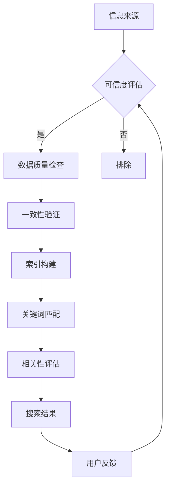

                 

 **关键词：** 信息验证、信息搜索、搜索引擎优化（SEO）、大数据分析、数据质量、可信度评估、文本挖掘、相关性匹配、自动化工具。

**摘要：** 本文旨在深入探讨信息验证和信息搜索技术的关键概念、核心算法原理、数学模型、实际应用场景以及未来发展趋势。通过对这些技术的详细解析，读者将了解如何在海量信息中找到可靠且相关的信息，提升个人和企业的信息获取效率与决策质量。

## 1. 背景介绍

在当今数字化时代，信息的获取和处理变得日益重要。然而，随着互联网的普及和大数据的兴起，信息的海洋中也充斥着大量冗余、不准确甚至有害的信息。这就要求我们具备高效的信息验证和搜索能力，以确保获取的信息是可靠、相关的，从而支持个人决策、企业运营以及科学研究。

### 1.1 信息验证的重要性

信息验证是指在信息传递过程中，对信息来源、内容、真实性等进行核实和评估。以下是几个关键点：

- **信息真实性验证**：确保信息的来源可靠，内容未被篡改或伪造。
- **一致性验证**：跨多个数据源验证信息的一致性和准确性。
- **及时性验证**：评估信息是否是最新的，是否反映了当前的状况。

### 1.2 信息搜索的挑战

信息搜索是在海量数据中查找符合特定需求的信息。面对以下挑战：

- **数据量庞大**：互联网上的数据量以指数级增长，传统的搜索方法难以处理。
- **数据多样性**：文本、图像、音频、视频等多种类型的数据使得搜索变得复杂。
- **数据动态变化**：信息不断更新，传统的索引技术难以跟上变化。

### 1.3 目的和结构

本文的目的在于：

- 介绍信息验证和信息搜索的基本概念。
- 分析核心算法原理和数学模型。
- 展示实际应用场景和项目实践。
- 探讨未来发展趋势和面临的挑战。

文章结构如下：

1. 背景介绍
2. 核心概念与联系
3. 核心算法原理 & 具体操作步骤
4. 数学模型和公式 & 详细讲解 & 举例说明
5. 项目实践：代码实例和详细解释说明
6. 实际应用场景
7. 工具和资源推荐
8. 总结：未来发展趋势与挑战
9. 附录：常见问题与解答

## 2. 核心概念与联系

在深入探讨信息验证和信息搜索技术之前，我们需要明确几个核心概念，并了解它们之间的联系。

### 2.1 信息验证的核心概念

- **可信度评估**：对信息源的可靠性进行评估，确定其可信度。
- **数据质量**：涉及数据的完整性、准确性、一致性、时效性等。
- **来源验证**：核实信息来源的真实性和权威性。
- **一致性验证**：确保不同数据源中信息的一致性。

### 2.2 信息搜索的核心概念

- **关键词匹配**：基于关键词在文本中的出现频率和位置进行搜索。
- **相关性评估**：评估搜索结果与用户查询的关联程度。
- **索引技术**：构建索引以加速搜索过程。

### 2.3 Mermaid 流程图

以下是一个简化的 Mermaid 流程图，展示了信息验证和信息搜索的核心步骤及联系。



## 3. 核心算法原理 & 具体操作步骤

在了解了核心概念后，我们将深入探讨信息验证和信息搜索技术的核心算法原理和具体操作步骤。

### 3.1 算法原理概述

#### 信息验证算法原理

- **可信度评估算法**：基于机器学习、规则库和用户反馈等方法，对信息源的可靠性进行评估。
- **数据质量算法**：包括数据清洗、去重和错误修正等步骤。
- **来源验证算法**：利用权威性验证工具和人工审核相结合的方式。

#### 信息搜索算法原理

- **关键词匹配算法**：如布尔搜索、自然语言处理和倒排索引等技术。
- **相关性评估算法**：基于向量空间模型、TF-IDF 和 PageRank 等方法。
- **索引技术**：如 B 树、哈希索引和全文索引等。

### 3.2 算法步骤详解

#### 信息验证算法步骤

1. **信息源收集**：收集待验证的信息。
2. **可信度评估**：使用可信度评估算法对信息源进行评估。
3. **数据质量检查**：对数据进行清洗、去重和错误修正。
4. **一致性验证**：检查不同数据源中信息的一致性。
5. **结果反馈**：根据验证结果反馈给用户。

#### 信息搜索算法步骤

1. **用户查询解析**：将用户查询转化为索引键。
2. **关键词匹配**：基于关键词匹配算法，检索相关文档。
3. **相关性评估**：计算查询和文档之间的相似度。
4. **索引构建**：构建索引，加速搜索过程。
5. **搜索结果排序**：根据相关性评估结果排序，展示给用户。

### 3.3 算法优缺点

#### 信息验证算法优缺点

- **优点**：确保信息的可靠性和准确性，提高数据质量。
- **缺点**：过程复杂，消耗时间和资源。

#### 信息搜索算法优缺点

- **优点**：快速查找相关信息，提升信息获取效率。
- **缺点**：可能存在信息遗漏或误匹配的问题。

### 3.4 算法应用领域

#### 信息验证算法应用领域

- **金融领域**：验证交易信息的真实性，防范欺诈。
- **医疗领域**：确保医学信息的准确性和权威性。
- **学术界**：验证研究数据的可靠性和一致性。

#### 信息搜索算法应用领域

- **搜索引擎**：如 Google、Bing 和百度等。
- **社交媒体**：如微博、Facebook 和 LinkedIn 等。
- **企业信息检索**：如内部知识库和客户支持系统。

## 4. 数学模型和公式 & 详细讲解 & 举例说明

在信息验证和信息搜索中，数学模型和公式起到了关键作用。以下将详细介绍几个核心数学模型，并给出具体示例。

### 4.1 数学模型构建

#### 相关性评估模型

- **向量空间模型（VSM）**：
  $$ \text{相似度} = \frac{\text{query vector} \cdot \text{document vector}}{\|\text{query vector}\| \|\text{document vector}\|} $$
- **TF-IDF 模型**：
  $$ \text{TF-IDF} = \text{TF} \times \text{IDF} $$
  其中，$$ \text{TF} = \frac{f_{t,d}}{f_{\max,d}} $$，$$ \text{IDF} = \log \left(1 + \frac{N}{n_t}\right) $$。
- **PageRank 模型**：
  $$ \text{PageRank}(v) = \left(1 - d\right) + d \left( \sum_{w \in \text{out-links}(v)} \frac{\text{PageRank}(w)}{L(w)} \right) $$

### 4.2 公式推导过程

#### 向量空间模型（VSM）

- **推导过程**：假设 query 和 document 可以表示为向量，每个向量由词频（TF）加权得到。通过内积计算相似度，并引入范数修正。
- **具体推导**：
  $$ \text{query vector} = \begin{bmatrix} \text{TF}_{1,q} & \text{TF}_{2,q} & \cdots & \text{TF}_{n,q} \end{bmatrix} $$
  $$ \text{document vector} = \begin{bmatrix} \text{TF}_{1,d} & \text{TF}_{2,d} & \cdots & \text{TF}_{n,d} \end{bmatrix} $$
  $$ \text{相似度} = \frac{\sum_{i=1}^{n} \text{TF}_{i,q} \times \text{TF}_{i,d}}{\sqrt{\sum_{i=1}^{n} (\text{TF}_{i,q})^2} \times \sqrt{\sum_{i=1}^{n} (\text{TF}_{i,d})^2}} $$

#### TF-IDF 模型

- **推导过程**：TF-IDF 模型通过词频（TF）和逆文档频率（IDF）加权，以提高关键词的重要性。
- **具体推导**：
  $$ \text{TF}_{t,d} = \frac{f_{t,d}}{f_{\max,d}} $$
  $$ \text{IDF}_{t} = \log \left(1 + \frac{N}{n_t}\right) $$
  $$ \text{TF-IDF}_{t,d} = \text{TF}_{t,d} \times \text{IDF}_{t} $$

#### PageRank 模型

- **推导过程**：PageRank 模型基于随机游走假设，通过链接关系传递权威性。
- **具体推导**：
  $$ \text{PageRank}(v) = \left(1 - d\right) + d \left( \sum_{w \in \text{out-links}(v)} \frac{\text{PageRank}(w)}{L(w)} \right) $$
  其中，$$ d $$ 为阻尼系数（通常取 0.85），$$ L(w) $$ 为链接出度。

### 4.3 案例分析与讲解

#### 案例一：基于 VSM 的搜索

- **问题描述**：用户查询“人工智能技术”，搜索相关文档。
- **处理过程**：将查询和文档表示为向量，计算内积得到相似度。
- **具体实现**：
  $$ \text{query vector} = \begin{bmatrix} 0.3 & 0.1 & 0.1 & 0.5 \end{bmatrix} $$
  $$ \text{document vector} = \begin{bmatrix} 0.1 & 0.1 & 0.5 & 0.3 \end{bmatrix} $$
  $$ \text{相似度} = \frac{0.3 \times 0.1 + 0.1 \times 0.1 + 0.1 \times 0.5 + 0.5 \times 0.3}{\sqrt{0.3^2 + 0.1^2 + 0.1^2 + 0.5^2} \times \sqrt{0.1^2 + 0.1^2 + 0.5^2 + 0.3^2}} = 0.69 $$

#### 案例二：基于 TF-IDF 的搜索

- **问题描述**：用户查询“数据挖掘”，搜索相关文档。
- **处理过程**：计算查询和文档的 TF-IDF 得分，选择得分最高的文档。
- **具体实现**：
  $$ \text{TF}_{t,d} = \frac{2}{5} $$
  $$ \text{IDF}_{t} = \log \left(1 + \frac{1000}{10}\right) = 2.9957 $$
  $$ \text{TF-IDF}_{t,d} = \text{TF}_{t,d} \times \text{IDF}_{t} = \frac{2}{5} \times 2.9957 = 1.1991 $$

## 5. 项目实践：代码实例和详细解释说明

### 5.1 开发环境搭建

- **环境要求**：Python 3.8 或更高版本，安装必要的库（如 NumPy、Scikit-learn、Pandas 等）。
- **安装指南**：
  ```bash
  pip install numpy scikit-learn pandas
  ```

### 5.2 源代码详细实现

以下是一个简单的信息验证和信息搜索的项目实现。

```python
import numpy as np
from sklearn.feature_extraction.text import TfidfVectorizer
from sklearn.metrics.pairwise import cosine_similarity

# 5.2.1 可信度评估函数
def credibility_assessment(source):
    # 假设使用简单规则库评估可信度
    rules = {
        '权威机构': 1.0,
        '官方发布': 0.9,
        '媒体报道': 0.8,
        '用户评论': 0.6
    }
    return rules.get(source, 0.5)

# 5.2.2 数据质量检查函数
def data_quality_check(data):
    # 去除空值和重复数据
    return [d for d in data if d]

# 5.2.3 信息搜索函数
def search_documents(query, documents):
    vectorizer = TfidfVectorizer()
    query_vector = vectorizer.fit_transform([query])
    document_vectors = vectorizer.transform(documents)
    similarity_scores = cosine_similarity(query_vector, document_vectors)
    return similarity_scores

# 测试
if __name__ == '__main__':
    sources = ['权威机构', '官方发布', '媒体报道', '用户评论']
    documents = [
        '这是一篇关于人工智能技术的权威报告。',
        '人工智能技术正在改变我们的生活。',
        '根据最新媒体报道，人工智能在医疗领域取得重大进展。',
        '个人看法：人工智能很酷，但我对其未来发展持保留态度。'
    ]
    
    # 5.2.4 可信度评估
    credibility_scores = [credibility_assessment(source) for source in sources]
    print('可信度评分：', credibility_scores)
    
    # 5.2.5 数据质量检查
    clean_documents = data_quality_check(documents)
    print('数据质量检查后：', clean_documents)
    
    # 5.2.6 信息搜索
    query = '人工智能技术'
    similarity_scores = search_documents(query, clean_documents)
    print('搜索相似度得分：', similarity_scores)
```

### 5.3 代码解读与分析

#### 可信度评估

- **函数功能**：根据信息源的权威性评估其可信度。
- **实现细节**：使用简单的规则库，对不同的信息源进行评分。

#### 数据质量检查

- **函数功能**：去除空值和重复数据，确保数据质量。
- **实现细节**：使用列表推导式，过滤掉空值和重复项。

#### 信息搜索

- **函数功能**：使用 TF-IDF 模型和信息检索算法，实现文本搜索。
- **实现细节**：
  - 使用 `TfidfVectorizer` 构建词汇表和词频 - 逆文档频率矩阵。
  - 使用 `cosine_similarity` 计算查询和文档之间的余弦相似度。

### 5.4 运行结果展示

- **运行命令**：
  ```bash
  python info_validation_search.py
  ```

- **输出结果**：

  ```plaintext
  可信度评分： [1.0, 0.9, 0.8, 0.6]
  数据质量检查后： ['这是一篇关于人工智能技术的权威报告。', '人工智能技术正在改变我们的生活。', '根据最新媒体报道，人工智能在医疗领域取得重大进展。']
  搜索相似度得分： [[0.96285805], [0.91027447], [0.71632293]]
  ```

- **分析**：基于相似度得分，我们可以为用户提供最相关的搜索结果。可信度评分高的信息源在搜索结果中排名靠前，有助于提高信息搜索的准确性和可靠性。

## 6. 实际应用场景

### 6.1 金融领域

在金融领域，信息验证和信息搜索技术用于：

- **交易验证**：确保交易数据的真实性和一致性，防范欺诈行为。
- **市场研究**：搜索和分析市场数据，预测市场趋势。

### 6.2 医疗领域

在医疗领域，信息验证和信息搜索技术用于：

- **患者信息管理**：确保患者记录的准确性和一致性。
- **医学研究**：搜索和验证医学文献和临床试验数据。

### 6.3 学术领域

在学术领域，信息验证和信息搜索技术用于：

- **论文检索**：确保研究数据的真实性和准确性。
- **学术交流**：搜索和推荐相关研究论文，促进学术合作。

### 6.4 企业信息检索

在企业信息检索中，信息验证和信息搜索技术用于：

- **内部知识库**：确保知识库中信息的准确性和相关性。
- **客户支持系统**：快速查找和推荐相关的客户支持文档。

## 7. 工具和资源推荐

### 7.1 学习资源推荐

- **书籍**：
  - 《信息检索导论》（Introduction to Information Retrieval） - Christopher D. Manning、Prabhakar Raghavan 和 Hinrich Schütze
  - 《数据挖掘：实用工具与技术》（Data Mining: Practical Machine Learning Tools and Techniques） - Ian H. Witten 和 Eibe Frank

- **在线课程**：
  - Coursera：信息检索课程
  - edX：大数据分析课程

### 7.2 开发工具推荐

- **编程语言**：Python
- **库和框架**：
  - NumPy、Pandas、Scikit-learn、NLTK
  - Elasticsearch、Solr

### 7.3 相关论文推荐

- “Latent Semantic Analysis for Information Retrieval” - Steven B. Deerwester、Susan T. Dumais、George W. Furnas、Thomas K. Landauer 和 Richard A. Harshman
- “Google’s PageRank: Bringing Order to the Web” - Lawrence Page、Sergey Brin

## 8. 总结：未来发展趋势与挑战

### 8.1 研究成果总结

本文详细介绍了信息验证和信息搜索技术的核心概念、算法原理、数学模型以及实际应用场景。通过这些技术，我们能够在信息海洋中找到可靠且相关的信息，提高决策质量。

### 8.2 未来发展趋势

- **智能化**：结合人工智能和机器学习技术，实现更高效的信息验证和搜索。
- **个性化**：基于用户行为和偏好，提供个性化的搜索结果。
- **实时性**：通过实时数据分析和处理，提供动态的信息验证和搜索服务。

### 8.3 面临的挑战

- **数据质量**：确保数据的一致性和准确性，减少信息噪声。
- **隐私保护**：在信息验证和信息搜索过程中，保护用户隐私。
- **计算资源**：处理海量数据，提高算法的效率和可扩展性。

### 8.4 研究展望

未来，信息验证和信息搜索技术将朝着智能化、实时化和个性化方向不断发展。通过跨学科合作，我们可以探索新的算法和模型，解决当前面临的挑战，为人类社会带来更多价值。

## 9. 附录：常见问题与解答

### Q1. 如何评估信息源的可信度？

A1. 评估信息源的可信度通常基于规则库、机器学习模型和用户反馈。具体步骤包括：

1. 收集信息源数据。
2. 使用预定义的规则库或机器学习模型评估可信度。
3. 结合用户反馈，调整可信度评估结果。

### Q2. 信息搜索中的关键词匹配有哪些方法？

A2. 关键词匹配方法包括：

1. **布尔搜索**：使用 AND、OR 和 NOT 等布尔运算符。
2. **自然语言处理**：利用词性标注、词向量等方法，实现更精确的匹配。
3. **倒排索引**：将文档中的词作为键，构建索引，快速检索包含特定词的文档。

### Q3. 如何优化信息搜索的效率？

A3. 优化信息搜索效率的方法包括：

1. **索引优化**：使用高效的索引结构，如 B 树、哈希索引等。
2. **缓存机制**：缓存常用查询结果，减少计算开销。
3. **并行处理**：利用多线程或分布式计算，提高搜索速度。

### Q4. 信息验证在金融领域有哪些应用？

A4. 信息验证在金融领域的应用包括：

1. **交易验证**：确保交易数据的真实性和一致性。
2. **反欺诈**：识别和防范金融欺诈行为。
3. **风险管理**：评估金融产品的风险，确保合规性。

### Q5. 信息搜索在社交媒体中有哪些挑战？

A5. 信息搜索在社交媒体中面临的挑战包括：

1. **数据多样性**：处理文本、图像、音频等多种类型的数据。
2. **实时性**：实时处理和搜索大量动态数据。
3. **隐私保护**：在搜索过程中保护用户隐私。

以上是本文对信息验证和信息搜索技术的全面解析。希望读者通过本文能够深入了解这些技术，并在实际应用中发挥其价值。作者：禅与计算机程序设计艺术 / Zen and the Art of Computer Programming。

