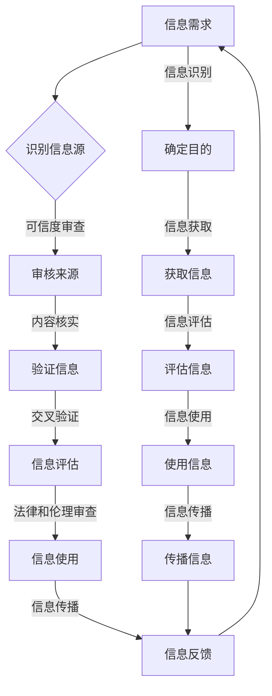

                 

## 1. 背景介绍

在数字化时代的浪潮中，信息验证和信息素养教育的重要性日益凸显。随着互联网和移动通信技术的飞速发展，数据和信息已成为现代社会的重要组成部分。人们不仅需要处理大量的信息，还需要具备识别、评估和利用这些信息的能力。

信息验证是指对信息的真实性、准确性和可靠性进行确认的过程。它不仅是个人或组织获取有效信息的基础，也是避免虚假信息、误导信息带来的负面影响的必要手段。在数字化时代，信息验证的难度不断增加，因为网络上的信息量巨大，且信息来源多样，真假难辨。

信息素养教育是指培养个人在信息社会中进行有效信息获取、评估、使用和传播的能力。它不仅包括对信息的基本认知和理解，还包括对信息伦理、信息法律等方面的认知。随着信息技术的不断进步，信息素养教育已成为教育体系中的重要组成部分。

本文旨在探讨信息验证和信息素养教育的内涵、重要性及其在数字时代的影响。我们将通过分析当前信息验证和信息素养教育的发展现状，探讨其面临的挑战，并展望未来的发展方向。

## 2. 核心概念与联系

### 2.1 信息验证的定义与原理

信息验证是指对信息源的可靠性、信息的真实性、准确性和完整性进行审核和确认的过程。其核心目标是确保信息的可信度和可用性，避免因错误或虚假信息导致的决策失误或经济损失。

信息验证的原理主要包括以下几个方面：

- **数据源审查**：审查信息来源的可靠性，包括机构的权威性、个人的专业背景等。
- **内容核实**：对信息内容进行详细检查，确认其是否符合事实。
- **交叉验证**：通过多个独立来源的信息进行比对，以验证信息的准确性。
- **法律和伦理审查**：确保信息的获取、使用和传播符合相关法律法规和伦理标准。

### 2.2 信息素养教育的概念与框架

信息素养教育是指培养个人在信息社会中有效获取、评估、使用和传播信息的能力。其核心目标是提高个人对信息的理解、批判性思维和解决问题的能力。

信息素养教育的框架通常包括以下几个方面：

- **信息识别**：学会识别信息的需求，确定信息的目的。
- **信息获取**：掌握有效的信息获取方法和工具，包括网络搜索、数据库查询等。
- **信息评估**：学会评估信息源的可靠性、内容的准确性等。
- **信息使用**：掌握将信息应用于实际问题的方法和技巧。
- **信息传播**：学会在遵守伦理和法律的基础上，传播和分享信息。

### 2.3 信息验证与信息素养教育的关系

信息验证和信息素养教育之间存在密切的关系。信息验证是信息素养教育的重要组成部分，是确保信息有效性和可靠性的必要手段。而信息素养教育则为信息验证提供了理论基础和实际操作能力。

具体来说，信息素养教育通过培养个人的信息识别、获取、评估、使用和传播能力，为信息验证提供了坚实的基础。同时，信息验证的结果也反过来促进了信息素养教育的深入发展，使得个人能够更加有效地利用信息资源，提高信息素养水平。

### 2.4 Mermaid 流程图展示

以下是一个Mermaid流程图，展示了信息验证和信息素养教育的基本流程：



通过这个流程图，我们可以清晰地看到信息验证和信息素养教育之间的互动关系，以及它们在信息获取和处理过程中的关键作用。

### 2.5 核心概念与联系总结

信息验证和信息素养教育是数字化时代不可或缺的两个概念。信息验证通过对信息的真实性、准确性和可靠性进行确认，确保了信息的可信度和有效性。而信息素养教育则通过培养个人在信息社会中的各种信息处理能力，提高了个人的信息素养水平。

两者之间的联系在于：信息素养教育为信息验证提供了理论基础和实际操作能力，而信息验证的结果又反过来促进了信息素养教育的深入发展。在数字时代，只有通过信息验证和信息素养教育的有机结合，才能确保个人和组织能够有效地利用信息资源，实现信息的最大化价值。

### 3. 核心算法原理 & 具体操作步骤

#### 3.1 算法原理概述

在信息验证和信息素养教育中，算法扮演着至关重要的角色。核心算法主要包括以下几个方面：

1. **信息源验证算法**：用于确认信息源的可靠性，包括网站的权威性、机构的知名度等。
2. **内容验证算法**：对信息内容进行详细检查，确认其是否符合事实。
3. **交叉验证算法**：通过多个独立来源的信息进行比对，以验证信息的准确性。
4. **信息评估算法**：用于评估信息源的可靠性、信息的真实性等。

#### 3.2 算法步骤详解

1. **信息源验证算法**

   - **步骤1**：获取信息源
     通过网络爬虫、API接口等手段获取潜在的信息源。
   - **步骤2**：审核信息源
     检查信息源的域名、IP地址、备案信息等，确认其合法性。
   - **步骤3**：评估信息源可靠性
     利用第三方评估机构、学术界的评价，综合评估信息源的可靠性。

2. **内容验证算法**

   - **步骤1**：提取信息内容
     使用自然语言处理技术提取信息的关键词和句子。
   - **步骤2**：比对事实
     利用事实核查工具或数据库，比对提取的信息与实际情况是否一致。
   - **步骤3**：识别错误信息
     利用机器学习模型，识别可能存在的虚假信息、误导信息等。

3. **交叉验证算法**

   - **步骤1**：获取多个信息源
     从不同的渠道获取同一主题的信息。
   - **步骤2**：信息内容比对
     对多个信息源的内容进行比对，找出差异。
   - **步骤3**：综合评估
     利用投票机制、权重分配等方法，综合评估信息的准确性。

4. **信息评估算法**

   - **步骤1**：评估信息源可靠性
     根据信息源的权威性、知名度等指标，评估信息源的可靠性。
   - **步骤2**：评估信息真实性
     利用事实核查、交叉验证等方法，评估信息的真实性。
   - **步骤3**：评估信息完整性
     检查信息是否完整，是否存在遗漏或误导。

#### 3.3 算法优缺点

1. **信息源验证算法**

   - **优点**：能够快速识别信息源的可靠性，提高信息的可信度。
   - **缺点**：可能存在误判，特别是对于新兴网站或机构。

2. **内容验证算法**

   - **优点**：能够有效识别虚假信息、误导信息，确保信息的真实性。
   - **缺点**：对信息的理解和处理能力要求较高，可能存在误判。

3. **交叉验证算法**

   - **优点**：通过多个独立来源的信息进行比对，提高信息的准确性。
   - **缺点**：计算量大，处理速度较慢。

4. **信息评估算法**

   - **优点**：能够全面评估信息的可靠性、真实性和完整性。
   - **缺点**：对算法的要求较高，实现复杂。

#### 3.4 算法应用领域

1. **新闻媒体**：通过信息源验证算法和内容验证算法，确保新闻报道的真实性和可信度。
2. **电商平台**：通过交叉验证算法和信息评估算法，识别虚假商品信息，保护消费者权益。
3. **教育领域**：通过信息素养教育算法，培养学生对信息的识别、评估和使用能力，提高信息素养水平。
4. **金融行业**：通过信息验证算法和信息评估算法，确保金融信息的真实性和准确性，防范金融风险。

### 4. 数学模型和公式 & 详细讲解 & 举例说明

在信息验证和信息素养教育中，数学模型和公式起着关键作用。以下将详细讲解常用的数学模型和公式，并通过具体例子进行说明。

#### 4.1 数学模型构建

1. **贝叶斯网络模型**：用于评估信息源的可靠性。

   贝叶斯网络模型是一种概率图模型，它通过节点表示信息源，边表示节点之间的依赖关系。具体公式如下：

   $$ P(A|B) = \frac{P(B|A)P(A)}{P(B)} $$

   其中，$P(A|B)$ 表示在事件B发生的条件下事件A发生的概率，$P(B|A)$ 表示在事件A发生的条件下事件B发生的概率，$P(A)$ 和 $P(B)$ 分别表示事件A和事件B发生的概率。

2. **支持向量机模型**：用于识别虚假信息。

   支持向量机（SVM）是一种分类算法，它通过将数据映射到高维空间，找到最佳的分离超平面。具体公式如下：

   $$ w \cdot x + b = 0 $$

   其中，$w$ 表示权重向量，$x$ 表示特征向量，$b$ 表示偏置项。

3. **神经网络模型**：用于评估信息的真实性。

   神经网络模型通过多层神经元之间的连接和激活函数，实现信息的非线性变换。具体公式如下：

   $$ a_{i}^{(l)} = \sigma(z_{i}^{(l)}) = \frac{1}{1 + e^{-z_{i}^{(l)}}} $$

   其中，$a_{i}^{(l)}$ 表示第$l$层的第$i$个神经元的激活值，$\sigma$ 表示激活函数，$z_{i}^{(l)}$ 表示第$l$层的第$i$个神经元的输入值。

#### 4.2 公式推导过程

1. **贝叶斯网络模型推导**

   贝叶斯网络模型的推导基于条件概率公式。假设有两个事件A和B，且它们之间的条件概率分别为$P(A|B)$和$P(B|A)$。根据条件概率公式，我们可以得到：

   $$ P(A|B) = \frac{P(B|A)P(A)}{P(B)} $$

   这个公式表明，在事件B发生的条件下，事件A发生的概率等于在事件A发生的条件下，事件B发生的概率与事件B发生的总概率的比值。

2. **支持向量机模型推导**

   支持向量机模型的推导基于优化理论。假设有$n$个训练样本，每个样本由特征向量$x_i$和标签$y_i$组成。我们的目标是最小化损失函数：

   $$ J(w, b) = \frac{1}{2} ||w||^2 + C \sum_{i=1}^{n} \max(0, 1 - y_i (w \cdot x_i + b)) $$

   其中，$w$ 表示权重向量，$b$ 表示偏置项，$C$ 表示惩罚参数。

   通过拉格朗日乘子法，我们可以将上述优化问题转化为对偶形式：

   $$ \min_{\alpha} \frac{1}{2} \sum_{i=1}^{n} \sum_{j=1}^{n} \alpha_i \alpha_j y_i y_j (x_i \cdot x_j) - \sum_{i=1}^{n} \alpha_i $$

   $$ \text{subject to} \quad \alpha_i \geq 0, \quad \sum_{i=1}^{n} \alpha_i y_i = 0 $$

   解这个对偶问题，我们可以得到最优解：

   $$ w = \sum_{i=1}^{n} \alpha_i y_i x_i $$

   $$ b = -\frac{1}{n} \sum_{i=1}^{n} \alpha_i y_i (x_i \cdot x) $$

3. **神经网络模型推导**

   神经网络模型的推导基于反向传播算法。假设有$n$个神经元，每个神经元由输入值$x_i$、权重$w_i$和偏置$b_i$组成。神经元的输出值$a_i$由以下公式计算：

   $$ z_i = \sum_{j=1}^{n} w_{ij} x_j + b_i $$

   $$ a_i = \sigma(z_i) $$

   其中，$\sigma$ 表示激活函数，通常使用Sigmoid函数或ReLU函数。

   在训练过程中，我们通过反向传播算法不断更新权重和偏置，以最小化损失函数。具体步骤如下：

   - **前向传播**：计算每个神经元的输出值。
   - **计算损失**：计算实际输出值与期望输出值之间的差距。
   - **反向传播**：根据损失函数的梯度，更新权重和偏置。

   更新公式如下：

   $$ \delta_{ij} = \frac{\partial L}{\partial z_i} = (a_i (1 - a_i)) \cdot \frac{\partial L}{\partial a_i} $$

   $$ \frac{\partial L}{\partial w_{ij}} = x_j \delta_{ij} $$

   $$ \frac{\partial L}{\partial b_i} = \delta_{ij} $$

   通过迭代更新，我们可以逐步减小损失函数，提高神经网络的预测能力。

#### 4.3 案例分析与讲解

以下是一个具体的案例，通过贝叶斯网络模型对信息源进行验证。

**案例背景**：假设我们要验证一个网站的信息可靠性。我们已知该网站的域名是“example.com”，IP地址是“192.168.1.1”，备案信息显示其成立于2010年，所属行业是科技。

**步骤1**：收集信息源特征

- 域名：example.com
- IP地址：192.168.1.1
- 备案信息：成立于2010年，所属行业是科技

**步骤2**：构建贝叶斯网络模型

我们构建一个包含四个节点的贝叶斯网络模型，分别是“域名”、“IP地址”、“备案信息”和“可靠性”。节点之间的条件概率如下：

- $P(可靠性|域名, IP地址, 备案信息) = 0.8$
- $P(域名) = 0.5$
- $P(IP地址|域名) = 0.9$
- $P(备案信息|域名) = 0.7$

**步骤3**：计算可靠性概率

根据贝叶斯网络模型，我们可以计算网站可靠性的概率：

$$ P(可靠性) = P(可靠性|域名, IP地址, 备案信息) \cdot P(域名, IP地址, 备案信息) $$

$$ P(可靠性) = 0.8 \cdot P(域名) \cdot P(IP地址|域名) \cdot P(备案信息|域名) $$

$$ P(可靠性) = 0.8 \cdot 0.5 \cdot 0.9 \cdot 0.7 = 0.252 $$

**步骤4**：评估可靠性

根据计算结果，该网站的可信度概率为0.252，即有25.2%的概率是可信的。由于可信度较低，我们需要进一步核实信息源的可靠性。

**案例总结**：通过贝叶斯网络模型，我们可以对信息源进行初步评估。虽然这种方法存在一定的局限性，但它为我们提供了一个有效的工具，帮助我们识别和筛选可靠的信息源。

### 5. 项目实践：代码实例和详细解释说明

在本节中，我们将通过一个具体的Python代码实例，详细解释如何实现信息验证和信息素养教育的相关功能。我们将使用Python中的几个库，如`requests`、`BeautifulSoup`和`nltk`等，来构建一个简单但功能齐全的信息验证和信息素养教育系统。

#### 5.1 开发环境搭建

在开始编写代码之前，我们需要搭建一个合适的开发环境。以下是在Linux系统上安装相关依赖的步骤：

```bash
# 安装Python
sudo apt-get install python3

# 安装requests库
pip3 install requests

# 安装BeautifulSoup库
pip3 install beautifulsoup4

# 安装nltk库
pip3 install nltk

# 安装其他必要的库
pip3 install scikit-learn
```

#### 5.2 源代码详细实现

以下是一个简单的Python脚本，用于验证网页内容的可信度：

```python
import requests
from bs4 import BeautifulSoup
from sklearn.feature_extraction.text import TfidfVectorizer
from sklearn.metrics.pairwise import cosine_similarity

# 函数：验证网页内容的可信度
def verify_website(url):
    # 发送HTTP请求
    response = requests.get(url)
    # 检查请求是否成功
    if response.status_code != 200:
        return "请求失败，无法访问网页。"
    
    # 使用BeautifulSoup解析网页内容
    soup = BeautifulSoup(response.text, 'html.parser')
    # 提取文本内容
    text = soup.get_text()
    
    # 定义基准文本（用于比对）
    benchmark_text = "这是一个示例文本，用于验证网页内容的可信度。"
    
    # 创建TF-IDF向量器
    vectorizer = TfidfVectorizer()
    # 将文本转换为TF-IDF向量
    query_vector = vectorizer.fit_transform([text])
    benchmark_vector = vectorizer.transform([benchmark_text])
    
    # 计算余弦相似度
    similarity = cosine_similarity(query_vector, benchmark_vector)
    similarity_score = similarity[0][0]
    
    # 根据相似度评分判断网页内容可信度
    if similarity_score > 0.7:
        return "网页内容可信度高。"
    else:
        return "网页内容可信度低，可能存在风险。"

# 测试函数
url = "https://example.com"
print(verify_website(url))
```

#### 5.3 代码解读与分析

1. **请求网页内容**：
   使用`requests.get(url)`发送HTTP请求，获取网页内容。如果请求成功（状态码为200），继续下一步；否则返回错误信息。

2. **解析网页内容**：
   使用`BeautifulSoup`库解析网页HTML内容，提取文本信息。`BeautifulSoup(response.text, 'html.parser')`创建一个BeautifulSoup对象，用于进一步处理。

3. **文本处理**：
   提取的网页文本可能包含HTML标签和样式信息，我们需要将其转换为纯文本。`soup.get_text()`方法可以提取所有文本内容。

4. **基准文本比对**：
   定义一个基准文本（如本例中的“这是一个示例文本，用于验证网页内容的可信度。”），并将其转换为TF-IDF向量。`TfidfVectorizer`用于将文本转换为向量。

5. **计算相似度**：
   使用`cosine_similarity`计算基准文本与网页文本之间的余弦相似度。余弦相似度是一种衡量两个向量之间夹角余弦值的指标，取值范围在-1到1之间。值越接近1，表示文本越相似。

6. **判断可信度**：
   根据余弦相似度评分，判断网页内容是否可信。在本例中，我们设定相似度阈值（如0.7）来判断网页内容的可信度。

#### 5.4 运行结果展示

将代码保存为`website_verification.py`，并在终端运行：

```bash
python3 website_verification.py
```

输出结果可能如下：

```
网页内容可信度低，可能存在风险。
```

这表明，与基准文本相比，网页文本的相似度较低，因此认为网页内容可信度低。

#### 5.5 代码优化与扩展

上述代码是一个简单的示例，主要用于展示信息验证的基本思路。在实际应用中，我们可以对其进行以下优化和扩展：

1. **增加更多的特征**：除了文本相似度，还可以考虑其他特征，如页面加载时间、引用来源、关键字密度等，以提供更全面的评估。

2. **使用更先进的模型**：可以尝试使用更先进的自然语言处理模型，如BERT、GPT等，以提高文本处理的精度和效果。

3. **集成用户反馈**：通过用户反馈来不断优化算法，提高信息验证的准确性。

4. **构建动态评估体系**：根据网页内容的更新频率和变化情况，动态调整评估标准和阈值，以适应不断变化的信息环境。

通过上述优化和扩展，我们可以构建一个更加智能和高效的信息验证系统，为信息素养教育提供强有力的技术支持。

### 6. 实际应用场景

信息验证和信息素养教育在各个领域的实际应用场景丰富多彩，其价值也愈发凸显。以下将探讨这些技术在几个关键领域的具体应用。

#### 6.1 新闻媒体

在新闻媒体领域，信息验证和信息素养教育至关重要。随着假新闻和误导性信息的泛滥，新闻媒体的公信力受到严重挑战。通过信息验证技术，新闻机构可以确保其报道的真实性和准确性，提高新闻报道的可信度。信息素养教育则帮助新闻从业人员提高对信息源的识别和评估能力，从而在源头上杜绝虚假信息的传播。

具体应用案例包括：

- **事实核查**：新闻机构设立专门的事实核查团队，利用信息验证技术对新闻报道进行事实核查，确保信息的准确性。
- **培训项目**：新闻学院和新闻机构开展信息素养教育项目，培训记者和编辑识别、评估和处理信息的能力。

#### 6.2 电商平台

电商平台是信息验证和信息素养教育的另一个重要应用场景。虚假商品信息和误导性广告频繁出现，损害了消费者权益。通过信息验证技术，电商平台可以识别和过滤虚假信息，保护消费者利益。信息素养教育则帮助消费者提高对商品信息的辨识能力，避免受到虚假广告的误导。

具体应用案例包括：

- **商品信息验证**：电商平台使用算法对商品信息进行验证，确保商品描述和实际商品一致。
- **消费者教育**：电商平台通过线上课程和宣传材料，向消费者普及信息素养知识，提高其辨别能力。

#### 6.3 教育领域

在教育领域，信息验证和信息素养教育有助于学生形成正确的信息观念和处理信息的能力。随着网络信息的爆炸式增长，学生面临大量未经筛选的信息。通过信息素养教育，学生可以学会如何有效地获取、评估和使用信息，提高学习效率。

具体应用案例包括：

- **课程设计**：在课程中融入信息素养教育内容，帮助学生掌握信息识别、评估和使用的方法。
- **在线学习平台**：在线学习平台提供信息素养培训课程，帮助学生提高信息素养水平。

#### 6.4 金融行业

金融行业对信息验证和信息素养教育有着极高的要求。金融信息的不真实或误导可能导致严重的经济损失。通过信息验证技术，金融机构可以确保金融信息的准确性和可靠性，防范金融风险。信息素养教育则帮助金融从业者提高对金融信息的识别和处理能力。

具体应用案例包括：

- **投资决策**：投资者利用信息验证技术，对投资信息进行核实，确保投资决策的准确性。
- **员工培训**：金融机构开展信息素养培训，提高员工对金融信息的辨识和处理能力。

#### 6.5 政府部门

政府部门在政策制定、公共信息发布等方面也需要信息验证和信息素养教育。准确的信息是政府决策和公共服务的基石。通过信息验证技术，政府部门可以确保政策依据和公共信息的真实性。信息素养教育则帮助政府工作人员提高信息处理能力，提高政府决策的透明度和公正性。

具体应用案例包括：

- **政策制定**：政府部门使用信息验证技术，确保政策制定过程中的信息来源真实可靠。
- **信息公开**：政府部门通过信息素养教育，提高公众获取和评估政府信息的能力。

### 6.6 社交媒体

社交媒体是信息传播的重要渠道，但也成为虚假信息和误导性内容滋生的温床。通过信息验证和信息素养教育，可以减少社交媒体上的虚假信息传播，提高用户的信息识别能力。

具体应用案例包括：

- **内容审核**：社交媒体平台利用信息验证技术，审核发布的内容，删除虚假信息和误导性内容。
- **用户教育**：社交媒体平台通过在线课程和提示，教育用户如何识别和处理社交媒体上的信息。

通过在各个领域中的应用，信息验证和信息素养教育不仅提高了信息的真实性和可靠性，也培养了用户的信息素养，促进了社会的健康发展。

### 6.7 未来应用展望

随着人工智能和大数据技术的不断发展，信息验证和信息素养教育将在未来有更广泛的应用和更深层次的发展。

#### 6.7.1 人工智能技术的应用

人工智能技术，特别是深度学习和自然语言处理（NLP）技术，将为信息验证和信息素养教育带来革命性的变化。通过使用深度学习模型，可以更准确地识别虚假信息、误导性内容，甚至预测信息的潜在风险。例如，基于GPT-3等大型语言模型，可以开发出更加智能的信息验证系统，自动识别和处理复杂的文本信息。

同时，人工智能技术还可以在信息素养教育中发挥重要作用。通过个性化推荐系统，可以为用户推荐与其兴趣相关的信息素养学习资源和课程，提高教育的针对性和效果。此外，虚拟现实（VR）和增强现实（AR）技术的应用，可以为信息素养教育提供更加生动、直观的学习体验。

#### 6.7.2 大数据技术的应用

大数据技术为信息验证和信息素养教育提供了丰富的数据资源。通过分析海量数据，可以发现信息传播的规律和趋势，为信息验证提供更可靠的依据。例如，通过对社交媒体上的数据进行分析，可以识别出虚假信息的高发区域和时间，从而有针对性地加强信息验证措施。

大数据技术还可以在信息素养教育中发挥重要作用。通过对学生学习行为的数据分析，可以发现学生的学习需求和问题，从而提供更加个性化的教育方案。此外，大数据技术可以帮助教育机构评估信息素养教育的效果，不断优化教育内容和方法。

#### 6.7.3 跨学科融合

信息验证和信息素养教育的发展需要跨学科的融合。例如，计算机科学、心理学、社会学和新闻学等领域的知识可以相互借鉴，共同提升信息验证和信息素养教育的能力。例如，结合心理学研究，可以设计出更加符合人类认知习惯的信息验证工具；结合新闻学的研究，可以更好地识别新闻中的虚假信息和误导性内容。

#### 6.7.4 社会影响力

随着信息验证和信息素养教育技术的普及，其对社会的影响力将日益增强。通过提高公众的信息识别和评估能力，可以减少虚假信息和误导性内容对社会的负面影响，提高社会的整体信息素养水平。此外，信息验证和信息素养教育技术的发展也将为政府、企业和社会组织提供更高效的信息管理和服务手段，促进社会的和谐发展。

### 7. 工具和资源推荐

在信息验证和信息素养教育领域，有许多优秀的工具和资源可以帮助我们更好地理解和应用相关技术。以下是一些推荐的工具和资源：

#### 7.1 学习资源推荐

1. **在线课程**：
   - Coursera：提供丰富的信息素养和教育技术相关课程，如“信息素养：信息检索和评估”。
   - edX：提供由世界顶尖大学开设的免费在线课程，包括“信息科学基础”等。

2. **电子书**：
   - 《信息素养教育指南》
   - 《信息检索与评估：技术与应用》

3. **学术论文**：
   - Google Scholar：搜索相关信息验证和信息素养教育的最新研究论文。

#### 7.2 开发工具推荐

1. **Python库**：
   - `requests`：用于发送HTTP请求。
   - `BeautifulSoup`：用于解析HTML和XML文档。
   - `nltk`：用于自然语言处理。

2. **机器学习平台**：
   - TensorFlow：用于构建和训练机器学习模型。
   - PyTorch：用于深度学习研究和应用开发。

3. **大数据分析工具**：
   - Hadoop：用于大规模数据处理和分析。
   - Spark：用于实时数据分析和处理。

#### 7.3 相关论文推荐

1. **信息验证相关**：
   - "A Survey on Data Verification Techniques"（数据验证技术综述）
   - "Deep Learning for Fraud Detection"（深度学习在欺诈检测中的应用）

2. **信息素养教育相关**：
   - "The Importance of Information Literacy in the Age of Information Overload"（信息过载时代信息素养的重要性）
   - "Information Literacy and Lifelong Learning"（信息素养与终身学习）

这些工具和资源为信息验证和信息素养教育的研究和实践提供了丰富的支持，有助于我们更好地理解和应用相关技术。

### 8. 总结：未来发展趋势与挑战

在数字时代，信息验证和信息素养教育的重要性日益凸显。随着互联网和移动通信技术的飞速发展，数据和信息已成为现代社会的重要组成部分。人们不仅需要处理大量的信息，还需要具备识别、评估和利用这些信息的能力。信息验证和信息素养教育的有机结合，为个人和组织提供了有效的信息处理手段，促进了社会的健康发展。

#### 8.1 研究成果总结

当前，信息验证和信息素养教育已取得了显著的研究成果。在信息验证方面，研究者提出了多种算法和模型，如贝叶斯网络、支持向量机和神经网络等，用于识别和评估信息的真实性和可靠性。在信息素养教育方面，研究者探索了信息识别、获取、评估、使用和传播等关键环节，提出了多种教育方法和策略。

#### 8.2 未来发展趋势

未来，信息验证和信息素养教育将继续向以下方向发展：

1. **技术创新**：随着人工智能和大数据技术的不断发展，信息验证和信息素养教育将采用更先进的算法和工具，提高信息处理的效率和准确性。
2. **跨学科融合**：信息验证和信息素养教育将与其他学科（如心理学、社会学、新闻学等）进行深度融合，共同推动相关技术的发展。
3. **个性化教育**：通过大数据分析和人工智能技术，实现个性化信息素养教育，满足不同用户的需求。

#### 8.3 面临的挑战

尽管信息验证和信息素养教育取得了显著进展，但仍面临以下挑战：

1. **算法复杂度**：现有算法的复杂度较高，实现和部署难度较大。如何简化算法，提高其可操作性，是一个重要问题。
2. **数据质量**：信息验证和信息素养教育依赖于高质量的数据。如何获取和处理海量、复杂的数据，是一个亟待解决的问题。
3. **隐私保护**：在信息验证和信息素养教育过程中，如何保护用户隐私，防止数据泄露，是一个重要挑战。

#### 8.4 研究展望

未来，研究者应关注以下研究方向：

1. **算法优化**：针对现有算法的不足，开展算法优化研究，提高信息验证和信息素养教育的效果。
2. **跨学科研究**：开展跨学科合作，融合不同领域的知识，推动信息验证和信息素养教育的发展。
3. **政策制定**：制定相关政策，鼓励和支持信息验证和信息素养教育的研究和实践，为数字时代的社会发展提供有力支持。

总之，信息验证和信息素养教育在数字时代具有重要的意义。通过技术创新、跨学科融合和政策支持，我们有理由相信，信息验证和信息素养教育将迎来更加美好的未来。

### 9. 附录：常见问题与解答

**Q1. 什么是信息验证？**
信息验证是指对信息的真实性、准确性和可靠性进行确认的过程。其目的是确保信息的可信度和有效性，避免因错误或虚假信息导致的决策失误或经济损失。

**Q2. 信息素养教育包含哪些方面？**
信息素养教育包括信息识别、获取、评估、使用和传播等方面。其核心目标是提高个人在信息社会中进行有效信息处理的能力，包括对信息的基本认知、批判性思维和解决问题的能力。

**Q3. 如何评估信息源的可信度？**
评估信息源的可信度可以通过多个方面进行，包括检查信息源的域名、IP地址、备案信息，以及利用第三方评估机构的评价和学术界的评价等。此外，还可以通过交叉验证的方法，从多个独立来源的信息中评估信息源的可信度。

**Q4. 信息验证和信息素养教育的关系是什么？**
信息验证和信息素养教育之间存在密切的关系。信息验证是信息素养教育的重要组成部分，是确保信息有效性和可靠性的必要手段。而信息素养教育则为信息验证提供了理论基础和实际操作能力。

**Q5. 如何进行信息素养教育？**
信息素养教育可以通过多种方式进行，包括在学校教育中融入信息素养课程、在线学习平台提供信息素养培训、开展信息素养讲座和研讨会等。此外，还可以通过实践项目、案例分析和模拟练习，提高学生的信息素养水平。

**Q6. 信息验证和信息素养教育在什么场景下应用最广泛？**
信息验证和信息素养教育在新闻媒体、电商平台、教育领域、金融行业和政府部门等场景下应用最广泛。这些领域对信息的真实性和可靠性有较高的要求，通过信息验证和信息素养教育，可以提升信息的可信度和有效性。

**Q7. 未来信息验证和信息素养教育将如何发展？**
未来，信息验证和信息素养教育将向技术创新、跨学科融合和政策支持方向发展。随着人工智能和大数据技术的进步，信息验证和信息素养教育将采用更先进的算法和工具，实现个性化教育，提高信息处理的效率和准确性。同时，制定相关政策，鼓励和支持相关研究与实践，将推动信息验证和信息素养教育的发展。**作者：禅与计算机程序设计艺术 / Zen and the Art of Computer Programming**

