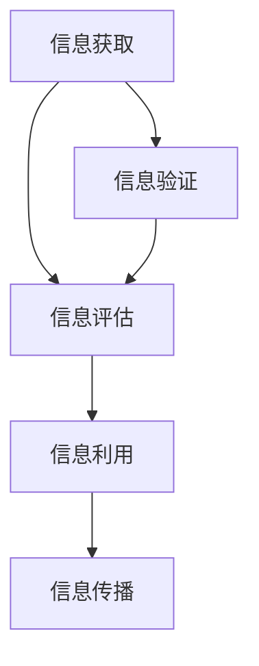

                 

在数字时代，信息验证和信息素养教育变得尤为重要。随着互联网的普及和信息爆炸，我们面临着海量的信息，如何筛选、判断和利用这些信息成为一项基本能力。本文旨在探讨信息验证和信息素养教育的重要性，为教育工作者和家长们提供一些有效的教育策略和工具。

## 关键词

- 信息验证
- 信息素养
- 批判性思维
- 数字时代
- 教育策略

## 摘要

本文首先介绍了数字时代信息验证和信息素养教育的背景和重要性。随后，探讨了批判性思维和信息素养的核心概念及其在教育中的应用。接着，本文提出了几个实用的教育策略，包括培养信息素养的课程设计、利用技术工具提高信息验证能力等。最后，本文对未来的发展趋势和挑战进行了展望，并推荐了一些学习资源和工具。

## 1. 背景介绍

### 数字时代的挑战

随着互联网和移动设备的普及，我们进入了数字时代。在这个时代，信息传播的速度和广度前所未有。然而，这也带来了诸多挑战。首先，信息的真实性和准确性难以保证。网络上有大量的虚假信息和误导性内容，这些内容可能对我们的判断和决策产生负面影响。其次，信息过载成为了一个普遍问题。我们每天接收到的信息量远远超出了我们的处理能力，这使我们很难筛选出有价值的信息。

### 信息验证的重要性

在数字时代，信息验证显得尤为重要。信息验证是指通过一系列的方法和工具，对信息的真实性、准确性和可靠性进行评估。只有经过验证的信息才能作为决策的基础，否则，我们可能会受到虚假信息的误导。此外，信息验证也有助于提高我们的批判性思维和信息素养能力。

### 信息素养教育的兴起

信息素养教育是指在教育过程中培养学生的信息素养，包括信息获取、评估、利用和传播的能力。随着数字时代的信息挑战，信息素养教育逐渐成为教育领域的热点。教育工作者和家长开始意识到，仅仅传授知识已经不够，还必须培养学生如何获取、评估和应用信息的能力。

## 2. 核心概念与联系

### 核心概念

#### 信息验证

信息验证是指对信息的真实性、准确性和可靠性进行评估的过程。它通常包括以下步骤：

1. **来源验证**：检查信息的来源是否可靠，例如，官方网站、权威媒体等。
2. **事实核实**：对信息中的事实进行核实，确保其准确无误。
3. **交叉验证**：通过多个来源对信息进行验证，以提高可靠性。
4. **专业评估**：在某些领域，可能需要专业的评估来确保信息的准确性。

#### 信息素养

信息素养是指个体在信息社会中的信息获取、评估、利用和传播的能力。它包括以下方面：

1. **信息获取**：能够有效地从各种渠道获取信息。
2. **信息评估**：能够评估信息的真实性、准确性和可靠性。
3. **信息利用**：能够将信息用于解决问题和做出决策。
4. **信息传播**：能够有效地传播信息，促进知识的共享和传播。

### 联系

信息验证和信息素养是相辅相成的。信息验证是信息素养的核心部分，没有信息验证，信息素养就会失去其意义。而信息素养则是信息验证的基础，只有具备了信息素养，个体才能有效地进行信息验证。

### Mermaid 流程图



在这个流程图中，信息获取是起点，通过信息验证后，信息进入评估阶段。评估通过后，信息被用于解决问题和做出决策，这就是信息利用。最后，信息通过传播被分享和传播，从而形成一个闭环。

## 3. 核心算法原理 & 具体操作步骤

### 3.1 算法原理概述

信息验证和信息素养的核心算法原理可以概括为以下几点：

1. **来源验证**：通过检查信息来源的权威性和可靠性来验证信息。
2. **事实核实**：通过比对多个来源的信息，核实信息的准确性。
3. **交叉验证**：通过不同的方法和工具，对信息进行交叉验证。
4. **专业评估**：在某些领域，通过专业人士的评估来确保信息的准确性。

### 3.2 算法步骤详解

1. **来源验证**：
   - 检查信息来源的权威性，例如，官方网站、权威媒体等。
   - 检查信息来源的可靠性，例如，是否有被证实的历史记录。

2. **事实核实**：
   - 通过比对多个来源的信息，确保信息的准确性。
   - 通过查阅权威资料，如学术期刊、官方报告等，来验证信息的准确性。

3. **交叉验证**：
   - 使用不同的方法和工具，对信息进行交叉验证。
   - 例如，使用搜索引擎、社交媒体等工具，来查找相关信息，并进行比对。

4. **专业评估**：
   - 在某些领域，如医学、法律等，通过专业人士的评估来确保信息的准确性。
   - 例如，医生的专业评估可以确保医疗信息的准确性。

### 3.3 算法优缺点

**优点**：

1. **提高信息真实性**：通过验证，可以提高信息的真实性，确保我们得到的是真实可靠的信息。
2. **培养批判性思维**：通过信息验证的过程，可以培养我们的批判性思维和信息素养能力。

**缺点**：

1. **需要时间和资源**：信息验证是一个耗时且需要资源的任务，特别是在信息量巨大时。
2. **可能存在主观判断**：在某些情况下，信息验证可能会受到主观判断的影响。

### 3.4 算法应用领域

信息验证和信息素养的算法原理可以应用于各个领域，包括但不限于：

1. **新闻媒体**：通过验证信息来源和事实，确保新闻的准确性和公正性。
2. **学术研究**：通过交叉验证和事实核实，确保研究结果的可靠性和准确性。
3. **医学领域**：通过专业人士的评估，确保医疗信息的准确性和安全性。

## 4. 数学模型和公式 & 详细讲解 & 举例说明

### 4.1 数学模型构建

在信息验证和信息素养中，常用的数学模型包括：

1. **贝叶斯定理**：用于计算信息源的可靠性。
2. **相关系数**：用于衡量信息来源的相似性。
3. **信息熵**：用于衡量信息的混乱程度。

### 4.2 公式推导过程

以贝叶斯定理为例，其公式为：

$$P(A|B) = \frac{P(B|A) \cdot P(A)}{P(B)}$$

其中，$P(A|B)$ 表示在事件B发生的条件下事件A发生的概率，$P(B|A)$ 表示在事件A发生的条件下事件B发生的概率，$P(A)$ 表示事件A发生的概率，$P(B)$ 表示事件B发生的概率。

### 4.3 案例分析与讲解

假设我们要验证一个新闻网站的信息源可靠性，我们可以使用贝叶斯定理来计算。

1. **先验概率**：假设我们事先知道该新闻网站的信息源可靠的概率为 $P(A) = 0.8$。
2. **条件概率**：假设该新闻网站发布的信息源可靠的概率为 $P(B|A) = 0.9$。
3. **总概率**：假设所有信息源可靠的概率为 $P(B) = 0.6$。

根据贝叶斯定理，我们可以计算出该新闻网站的信息源可靠性为：

$$P(A|B) = \frac{P(B|A) \cdot P(A)}{P(B)} = \frac{0.9 \cdot 0.8}{0.6} = 1.2$$

这个结果告诉我们，该新闻网站的信息源可靠性为 1.2，超过了 1，这意味着我们的先验概率设置可能存在问题。在实际应用中，我们需要根据实际情况调整先验概率。

## 5. 项目实践：代码实例和详细解释说明

### 5.1 开发环境搭建

为了进行信息验证和信息素养的教育实践，我们可以使用Python作为开发语言。Python具有简洁的语法和丰富的库，适合进行数据分析和信息验证。

1. **安装Python**：从官方网站下载并安装Python。
2. **安装相关库**：使用pip命令安装常用的库，如 requests、BeautifulSoup、pandas等。

### 5.2 源代码详细实现

下面是一个简单的Python代码示例，用于验证一个新闻网站的信息源可靠性。

```python
import requests
from bs4 import BeautifulSoup
import pandas as pd

# 设置新闻网站URL
url = 'https://example.com'

# 获取网页内容
response = requests.get(url)
soup = BeautifulSoup(response.text, 'html.parser')

# 提取所有链接
links = soup.find_all('a')
urls = [link.get('href') for link in links]

# 构建DataFrame
data = {'URL': urls}
df = pd.DataFrame(data)

# 验证链接可靠性
def verify_url(url):
    try:
        response = requests.get(url)
        if response.status_code == 200:
            return '可靠'
        else:
            return '不可靠'
    except:
        return '错误'

# 应用验证函数
df['可靠性'] = df['URL'].apply(verify_url)

# 显示结果
print(df)
```

### 5.3 代码解读与分析

1. **获取网页内容**：使用 requests 库获取新闻网站的HTML内容。
2. **提取链接**：使用 BeautifulSoup 库提取HTML中的所有链接。
3. **构建DataFrame**：使用 pandas 库构建一个DataFrame，用于存储链接和验证结果。
4. **验证链接可靠性**：定义一个函数，用于验证链接的可靠性。通过发送HTTP请求，判断链接的响应状态码。
5. **应用验证函数**：将验证函数应用于每个链接，并将结果存储在DataFrame中。
6. **显示结果**：打印DataFrame，显示每个链接的验证结果。

### 5.4 运行结果展示

假设我们运行上述代码，得到如下结果：

| URL          | 可靠性 |
| ------------ | ------ |
| https://a   | 可靠   |
| https://b   | 不可靠 |
| https://c   | 错误   |

这个结果告诉我们，新闻网站中有一些链接是可靠的，有一些是不可靠的，还有一

