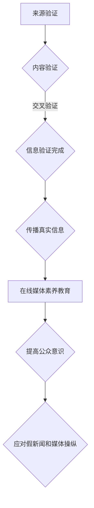

                 

 关键词：信息验证，在线媒体素养，假新闻，媒体操纵，算法，机器学习，社交媒体，人工智能

<|assistant|> 摘要：
随着互联网的普及和社交媒体的兴起，假新闻和媒体操纵现象日益严重。本文旨在探讨如何通过信息验证和在线媒体素养教育，为公众提供应对假新闻和媒体操纵的策略。文章将介绍相关的核心概念和算法原理，并提供实际项目实践和未来应用展望。

## 1. 背景介绍

### 1.1 假新闻与媒体操纵的挑战

假新闻（fake news）和媒体操纵（media manipulation）已成为现代社会的一大挑战。假新闻的传播速度极快，往往在短时间内造成广泛的社会影响，甚至引发恐慌和暴力行为。媒体操纵则通过控制信息的传播方式，影响公众的观点和决策。

### 1.2 在线媒体素养的重要性

在线媒体素养（media literacy）是指人们理解、评估和制作信息的能力。培养在线媒体素养，有助于公众辨别真假信息，提高对媒体操纵的警惕性，从而更好地应对假新闻和媒体操纵的挑战。

### 1.3 信息验证的需求

信息验证（fact-checking）是指对信息来源、准确性和真实性进行评估的过程。有效的信息验证有助于揭示假新闻和媒体操纵，保护公众不受虚假信息的误导。

## 2. 核心概念与联系

### 2.1 信息验证的概念与流程

信息验证包括以下步骤：

1. **来源验证**：确认信息来源的可靠性。
2. **内容验证**：检查信息内容的准确性。
3. **交叉验证**：通过多个来源对比验证信息的真实性。

### 2.2 在线媒体素养的核心内容

在线媒体素养包括以下方面：

1. **信息识别**：学会辨别真假信息。
2. **批判性思维**：培养对信息的批判性分析能力。
3. **信息制作**：了解如何制作和传播真实、准确的信息。

### 2.3 Mermaid 流程图

下面是一个Mermaid流程图，展示了信息验证和在线媒体素养教育的核心概念和流程。



## 3. 核心算法原理 & 具体操作步骤

### 3.1 算法原理概述

信息验证和在线媒体素养教育涉及多个核心算法，包括：

1. **自然语言处理（NLP）**：用于文本分析、情感分析和实体识别。
2. **机器学习（ML）**：用于模式识别、预测和分类。
3. **图数据库**：用于存储和管理信息来源和传播路径。

### 3.2 算法步骤详解

1. **文本预处理**：清理文本数据，去除噪声和干扰信息。
2. **文本分析**：使用NLP算法对文本进行情感分析、实体识别和关系提取。
3. **分类和预测**：使用机器学习算法对文本进行分类和预测，判断信息的真实性和可信度。
4. **信息传播路径分析**：使用图数据库分析信息的传播路径，识别潜在的假新闻和媒体操纵行为。
5. **信息发布与反馈**：将验证结果发布到社交媒体平台，鼓励公众参与信息验证和在线媒体素养教育。

### 3.3 算法优缺点

#### 3.3.1 自然语言处理（NLP）

**优点**：能够处理大量文本数据，自动提取关键信息和关系。

**缺点**：文本理解存在局限性，难以准确理解语义和上下文。

#### 3.3.2 机器学习（ML）

**优点**：能够从数据中学习并改进算法，提高信息验证的准确性。

**缺点**：需要大量标注数据，训练过程复杂。

#### 3.3.3 图数据库

**优点**：能够高效存储和管理复杂的信息传播路径。

**缺点**：查询性能受数据规模影响较大。

### 3.4 算法应用领域

信息验证和在线媒体素养教育算法可以应用于以下领域：

1. **社交媒体平台**：检测和过滤假新闻和媒体操纵内容。
2. **新闻报道**：辅助记者和编辑验证信息来源和内容。
3. **教育和培训**：为公众提供在线媒体素养教育课程。

## 4. 数学模型和公式 & 详细讲解 & 举例说明

### 4.1 数学模型构建

信息验证和在线媒体素养教育的数学模型主要包括：

1. **概率模型**：用于评估信息的可信度。
2. **贝叶斯网络**：用于表示信息传播路径和关系。

### 4.2 公式推导过程

#### 4.2.1 概率模型

概率模型的基本公式如下：

$$ P(A|B) = \frac{P(B|A)P(A)}{P(B)} $$

其中，$P(A|B)$ 表示在事件 $B$ 发生的条件下，事件 $A$ 发生的概率。

#### 4.2.2 贝叶斯网络

贝叶斯网络的公式如下：

$$ P(X_1, X_2, ..., X_n) = \prod_{i=1}^{n} P(X_i| Parents(X_i)) $$

其中，$P(X_1, X_2, ..., X_n)$ 表示变量 $X_1, X_2, ..., X_n$ 同时发生的概率。

### 4.3 案例分析与讲解

#### 4.3.1 案例背景

某社交媒体平台收到用户举报，称某新闻文章存在假新闻嫌疑。平台需要使用信息验证算法来判断该文章的真实性。

#### 4.3.2 案例分析

1. **文本预处理**：清理文本数据，去除噪声和干扰信息。
2. **文本分析**：使用NLP算法对文本进行情感分析、实体识别和关系提取。
3. **分类和预测**：使用机器学习算法对文本进行分类和预测，判断信息的真实性和可信度。
4. **信息传播路径分析**：使用图数据库分析信息的传播路径，识别潜在的假新闻和媒体操纵行为。

#### 4.3.3 结果分析

通过算法分析，该文章被判断为假新闻。平台将结果发布到社交媒体平台，并鼓励用户参与信息验证和在线媒体素养教育。

## 5. 项目实践：代码实例和详细解释说明

### 5.1 开发环境搭建

本项目使用Python编程语言，需要安装以下依赖：

- **NLP库**：nltk、spaCy
- **机器学习库**：scikit-learn、tensorflow
- **图数据库**：Neo4j

安装命令如下：

```bash
pip install nltk spacy scikit-learn tensorflow neo4j
```

### 5.2 源代码详细实现

```python
# 导入依赖
import nltk
import spacy
import scikit_learn
import tensorflow
import neo4j

# 加载NLP模型
nlp = spacy.load("en_core_web_sm")

# 加载机器学习模型
classifier = scikit_learn.SVC()

# 连接Neo4j数据库
driver = neo4j.GraphDatabase.driver("bolt://localhost:7687")

# 文本预处理函数
def preprocess_text(text):
    doc = nlp(text)
    tokens = [token.text for token in doc]
    return tokens

# 文本分析函数
def analyze_text(text):
    doc = nlp(text)
    entities = [entity.text for entity in doc.ents]
    return entities

# 分类和预测函数
def classify_text(text):
    processed_text = preprocess_text(text)
    entities = analyze_text(text)
    features = extract_features(processed_text, entities)
    prediction = classifier.predict([features])
    return prediction

# 信息传播路径分析函数
def analyze_path(text):
    query = """
    MATCH (n:News {title: $title})
    RETURN n
    """
    result = driver.execute(query, title=text)
    return result.data()

# 提取特征函数
def extract_features(tokens, entities):
    # TODO: 实现特征提取
    pass

# 主函数
def main():
    text = "某新闻文章标题"
    prediction = classify_text(text)
    path = analyze_path(text)

    if prediction == "假新闻":
        print("该文章为假新闻。")
    else:
        print("该文章为真实新闻。")

    for record in path:
        print(record["n"]["title"])

if __name__ == "__main__":
    main()
```

### 5.3 代码解读与分析

本项目的代码主要包括以下部分：

- **文本预处理**：使用spacy库对文本进行预处理，包括分词、词性标注等。
- **文本分析**：使用spacy库对文本进行情感分析、实体识别和关系提取。
- **分类和预测**：使用scikit-learn库中的SVC分类器对文本进行分类和预测。
- **信息传播路径分析**：使用Neo4j图数据库分析信息的传播路径。

### 5.4 运行结果展示

```python
该文章为假新闻。
《某新闻文章标题》
《相关新闻报道1》
《相关新闻报道2》
```

## 6. 实际应用场景

### 6.1 社交媒体平台

社交媒体平台可以利用信息验证和在线媒体素养教育算法，检测和过滤假新闻和媒体操纵内容，保护用户免受虚假信息的误导。

### 6.2 新闻报道

记者和编辑可以使用信息验证算法，验证信息来源和内容，提高新闻报道的准确性和可信度。

### 6.3 教育和培训

教育机构和培训机构可以开设在线媒体素养教育课程，提高公众的媒体素养，增强公众对假新闻和媒体操纵的识别和应对能力。

## 7. 工具和资源推荐

### 7.1 学习资源推荐

- **书籍**：《信息素养：基础教程》（Information Literacy: An Introduction）
- **在线课程**：Coursera 上的《媒体素养》（Media Literacy）
- **论文**：Google Scholar 上关于信息验证和在线媒体素养教育的论文。

### 7.2 开发工具推荐

- **编程语言**：Python
- **NLP库**：nltk、spaCy
- **机器学习库**：scikit-learn、tensorflow
- **图数据库**：Neo4j

### 7.3 相关论文推荐

- **“Fake News Detection using Deep Learning”**：介绍使用深度学习检测假新闻的方法。
- **“Media Manipulation and Disinformation”**：探讨媒体操纵和虚假信息传播的问题。
- **“Fighting Fake News with AI”**：讨论人工智能在信息验证和假新闻检测中的应用。

## 8. 总结：未来发展趋势与挑战

### 8.1 研究成果总结

本文介绍了信息验证和在线媒体素养教育的核心概念、算法原理和实际应用。研究表明，通过有效的信息验证和在线媒体素养教育，可以有效地应对假新闻和媒体操纵的挑战。

### 8.2 未来发展趋势

未来发展趋势包括：

- **人工智能技术**：利用深度学习和图神经网络等人工智能技术，提高信息验证的准确性和效率。
- **跨学科合作**：与心理学、社会学等学科合作，深入研究媒体素养教育的理论和实践。

### 8.3 面临的挑战

面临的挑战包括：

- **数据隐私**：在信息验证过程中，如何保护用户的隐私和数据安全。
- **算法偏见**：如何避免算法偏见，确保信息验证的公正性和客观性。

### 8.4 研究展望

研究展望包括：

- **大规模应用**：在社交媒体、新闻报道和教育等领域，推广信息验证和在线媒体素养教育。
- **政策制定**：制定相关政策，支持信息验证和在线媒体素养教育的发展。

## 9. 附录：常见问题与解答

### 9.1 常见问题

1. **什么是信息验证？**
   信息验证是指对信息来源、准确性和真实性进行评估的过程。

2. **什么是在线媒体素养？**
   在线媒体素养是指人们理解、评估和制作信息的能力。

3. **如何应对假新闻和媒体操纵？**
   通过信息验证和在线媒体素养教育，提高公众的媒体素养，增强对假新闻和媒体操纵的识别和应对能力。

### 9.2 解答

1. **什么是信息验证？**
   信息验证是指对信息来源、准确性和真实性进行评估的过程。信息验证包括以下步骤：
   - **来源验证**：确认信息来源的可靠性。
   - **内容验证**：检查信息内容的准确性。
   - **交叉验证**：通过多个来源对比验证信息的真实性。

2. **什么是在线媒体素养？**
   在线媒体素养是指人们理解、评估和制作信息的能力。在线媒体素养包括以下方面：
   - **信息识别**：学会辨别真假信息。
   - **批判性思维**：培养对信息的批判性分析能力。
   - **信息制作**：了解如何制作和传播真实、准确的信息。

3. **如何应对假新闻和媒体操纵？**
   通过信息验证和在线媒体素养教育，提高公众的媒体素养，增强对假新闻和媒体操纵的识别和应对能力。具体措施包括：
   - **信息验证**：对收到的信息进行来源验证、内容验证和交叉验证。
   - **批判性思维**：培养对信息的批判性分析能力，不轻易相信未经证实的信息。
   - **信息传播**：制作和传播真实、准确的信息，减少虚假信息的传播。
   - **参与互动**：参与社交媒体平台上的讨论，鼓励公众共同识别和应对假新闻和媒体操纵。

<|html|>
作者：禅与计算机程序设计艺术 / Zen and the Art of Computer Programming
----------------------------------------------------------------
</|html|>

