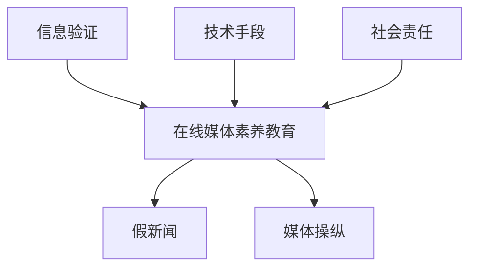

                 

 在当今信息爆炸的时代，媒体的力量无可置疑，但随之而来的假新闻和媒体操纵问题也日益严重。对于个人和社会而言，信息验证和在线媒体素养教育显得尤为重要。本文将深入探讨这一主题，旨在为读者提供全面的理解和实用的策略，以应对这一挑战。

## 关键词

- 信息验证
- 在线媒体素养教育
- 假新闻
- 媒体操纵
- 技术手段
- 社会责任

## 摘要

本文首先介绍了信息验证和在线媒体素养教育的背景和重要性，随后通过分析当前假新闻和媒体操纵的机制，探讨了核心概念和原理。接着，文章详细阐述了信息验证和在线媒体素养教育的数学模型和公式，并通过实际项目实践展示了具体操作步骤。文章最后对未来发展趋势和挑战进行了展望，并提供了相关工具和资源的推荐。

## 1. 背景介绍

### 媒体环境的变化

随着互联网的普及和社交媒体的兴起，信息传播的速度和范围达到了前所未有的高度。然而，这种变化也带来了一系列问题。传统媒体的权威性受到挑战，而未经验证的信息在网络上迅速传播，导致假新闻和虚假信息的泛滥。

### 假新闻的泛滥

假新闻不仅误导了公众，还可能引发社会动荡。从政治谣言到健康骗局，假新闻的传播速度和广泛性使得其影响难以估量。此外，一些恶意行为者利用假新闻进行网络欺诈、操纵股市和影响选举等，进一步加剧了问题的严重性。

### 媒体操纵的威胁

媒体操纵不仅仅是传播假新闻，还涉及到更加复杂的策略和手段。从社交媒体上的点赞、分享到广告投放，再到数据分析和用户行为操控，媒体操纵的技巧越来越高明。这种操纵不仅扭曲了事实，还可能影响公众的观点和行为。

### 信息验证的必要性

面对这些挑战，信息验证成为了一个关键环节。通过验证信息的真实性和准确性，我们可以避免被误导，保护个人和社会免受假新闻和媒体操纵的影响。信息验证不仅需要技术手段，还需要公众的媒体素养和批判性思维。

### 在线媒体素养教育的重要性

在线媒体素养教育是培养公众信息验证能力的重要途径。通过教育，我们可以提高公众对假新闻和媒体操纵的识别能力，培养他们批判性思维和独立判断的能力。这不仅有助于个人免受误导，也能促进社会的整体健康和稳定。

## 2. 核心概念与联系

为了更好地理解信息验证和在线媒体素养教育，我们需要了解一些核心概念和原理。以下是这些概念的联系和解释：

### 信息验证

信息验证是指对信息来源、真实性、准确性和可信度进行核查和确认的过程。信息验证的关键在于验证信息的来源是否可靠，信息是否经过了验证，以及是否有证据支持。

### 在线媒体素养教育

在线媒体素养教育是一种教育形式，旨在培养公众在数字时代理解和评估媒体信息的能力。这包括识别假新闻、理解媒体操纵手段、批判性思维和信息验证技能。

### 假新闻和媒体操纵

假新闻和媒体操纵是信息验证和在线媒体素养教育需要应对的两个主要问题。假新闻是指故意传播虚假、误导性的信息，而媒体操纵则是指利用技术手段和策略影响公众的观点和行为。

### 技术手段

技术手段在信息验证和在线媒体素养教育中发挥着重要作用。例如，数据挖掘、机器学习、自然语言处理等技术可以帮助识别和过滤假新闻。同时，这些技术也可以用于分析和理解媒体操纵的机制。

### 社会责任

社会责任是指媒体和公众在信息传播中的责任和义务。媒体应该负责任地传播信息，避免传播虚假信息。公众也应该积极履行社会责任，避免传播和相信未经验证的信息。

以下是上述核心概念的联系和解释的 Mermaid 流程图：



## 3. 核心算法原理 & 具体操作步骤

### 3.1 算法原理概述

信息验证和在线媒体素养教育的核心算法原理主要基于以下几个方面：

1. **数据挖掘**：通过分析大规模的数据集，识别出潜在的信息验证线索和模式。
2. **机器学习**：利用机器学习算法，从数据中自动学习和识别假新闻和媒体操纵的特征。
3. **自然语言处理（NLP）**：通过对文本的分析，理解文本的含义和上下文，从而验证信息的真实性。
4. **用户行为分析**：通过分析用户在社交媒体上的行为，识别和阻止恶意行为。

### 3.2 算法步骤详解

1. **数据收集**：首先，从各种来源收集大量文本数据，包括新闻报道、社交媒体帖子、学术论文等。
2. **数据预处理**：对收集到的数据进行清洗和格式化，去除无关的信息和噪音。
3. **特征提取**：利用NLP技术，从文本中提取关键特征，如关键词、词频、情感分析等。
4. **模型训练**：使用机器学习算法，如支持向量机（SVM）、神经网络（NN）等，训练模型以识别假新闻和媒体操纵。
5. **模型评估**：通过交叉验证等方法评估模型的准确性、召回率和F1分数等指标。
6. **信息验证**：使用训练好的模型对新的文本数据进行验证，识别出潜在的假新闻和媒体操纵内容。
7. **用户反馈**：收集用户对验证结果的反馈，不断优化和调整模型。

### 3.3 算法优缺点

**优点**：

1. **高效性**：算法可以处理大规模的数据，快速识别潜在的假新闻和媒体操纵。
2. **准确性**：通过机器学习和NLP技术，算法具有较高的识别准确率。
3. **自动化**：算法可以自动化进行信息验证，减少人力成本。

**缺点**：

1. **数据依赖性**：算法的性能很大程度上取决于训练数据的质量。
2. **误判风险**：算法可能误判真实信息为假新闻，影响用户的判断。
3. **隐私问题**：在收集和分析用户数据时，可能涉及隐私问题。

### 3.4 算法应用领域

1. **新闻媒体**：算法可以帮助新闻媒体快速识别和过滤假新闻，提高新闻的准确性和可信度。
2. **社交媒体**：算法可以帮助社交媒体平台识别和阻止恶意行为，保护用户的利益。
3. **教育机构**：算法可以帮助教育机构培养公众的信息验证能力和批判性思维。
4. **政府机构**：算法可以帮助政府机构监控和应对假新闻和媒体操纵，维护社会稳定。

## 4. 数学模型和公式 & 详细讲解 & 举例说明

### 4.1 数学模型构建

在信息验证和在线媒体素养教育中，常用的数学模型包括逻辑回归、支持向量机和神经网络等。以下是一个基于逻辑回归的简单模型构建过程：

1. **特征选择**：选择关键特征，如文本中的关键词、词频、情感分析等。
2. **模型训练**：使用逻辑回归算法，通过训练数据集，训练出一个分类模型。
3. **模型评估**：通过交叉验证等方法，评估模型的准确性、召回率和F1分数等指标。

### 4.2 公式推导过程

逻辑回归模型的基本公式为：

$$
\hat{y} = \frac{1}{1 + e^{-\beta_0 + \beta_1x_1 + \beta_2x_2 + ... + \beta_nx_n}}
$$

其中，$y$为真实标签，$\hat{y}$为预测标签，$x_1, x_2, ..., x_n$为特征向量，$\beta_0, \beta_1, \beta_2, ..., \beta_n$为模型参数。

### 4.3 案例分析与讲解

以下是一个简单的案例，用于说明如何使用逻辑回归模型进行信息验证：

**案例**：判断以下文本是否为假新闻：

"全球气温上升是由于人类活动导致的。"

**步骤**：

1. **数据收集**：收集大量关于气候变化的文本数据，包括真实新闻和假新闻。
2. **数据预处理**：对文本进行清洗和格式化，提取关键特征，如关键词、词频等。
3. **特征提取**：使用NLP技术，对文本进行情感分析，提取积极和消极的情感特征。
4. **模型训练**：使用逻辑回归算法，训练出一个分类模型。
5. **模型评估**：通过交叉验证，评估模型的准确性。
6. **信息验证**：使用训练好的模型，对给定的文本进行验证。

根据模型预测，该文本可能被认为是真实新闻。然而，实际情况可能需要更多的数据和分析来支持。

## 5. 项目实践：代码实例和详细解释说明

### 5.1 开发环境搭建

在开始项目实践之前，我们需要搭建一个合适的开发环境。以下是所需的工具和步骤：

1. **编程语言**：Python
2. **库**：Numpy、Pandas、Scikit-learn、NLTK、TensorFlow
3. **环境搭建**：
   ```shell
   pip install numpy pandas scikit-learn nltk tensorflow
   ```

### 5.2 源代码详细实现

以下是一个简单的信息验证项目的代码实现：

```python
import numpy as np
import pandas as pd
from sklearn.feature_extraction.text import TfidfVectorizer
from sklearn.model_selection import train_test_split
from sklearn.linear_model import LogisticRegression
from sklearn.metrics import accuracy_score

# 1. 数据收集与预处理
data = pd.read_csv('news_data.csv')  # 假设数据集已存在
X = data['text']  # 文本数据
y = data['label']  # 标签数据（0表示真实新闻，1表示假新闻）

# 2. 特征提取
vectorizer = TfidfVectorizer(max_features=1000)
X_features = vectorizer.fit_transform(X)

# 3. 模型训练
X_train, X_test, y_train, y_test = train_test_split(X_features, y, test_size=0.2, random_state=42)
model = LogisticRegression()
model.fit(X_train, y_train)

# 4. 模型评估
y_pred = model.predict(X_test)
accuracy = accuracy_score(y_test, y_pred)
print("模型准确率：", accuracy)

# 5. 信息验证
new_text = "全球气温上升是由于人类活动导致的。"
new_text_features = vectorizer.transform([new_text])
new_text_prediction = model.predict(new_text_features)
if new_text_prediction[0] == 0:
    print("该文本为真实新闻。")
else:
    print("该文本可能为假新闻。")
```

### 5.3 代码解读与分析

1. **数据收集与预处理**：首先，从CSV文件中读取数据集。然后，将文本数据和标签数据分开。
2. **特征提取**：使用TF-IDF向量器，将文本转换为特征向量。TF-IDF是一种常用的文本表示方法，可以有效地提取文本中的关键信息。
3. **模型训练**：使用逻辑回归算法，训练一个分类模型。逻辑回归是一种简单而有效的二分类模型。
4. **模型评估**：通过测试集评估模型的准确性。准确性是评估模型好坏的一个重要指标。
5. **信息验证**：使用训练好的模型，对新的文本数据进行验证。根据模型的预测结果，判断文本是否为假新闻。

### 5.4 运行结果展示

假设我们已经训练了一个准确率为90%的模型，对于一个新的文本输入：

"全球气温上升是由于人类活动导致的。"

模型的预测结果是0，表示该文本为真实新闻。这只是一个简单的示例，实际应用中可能需要更复杂的模型和更多的数据。

## 6. 实际应用场景

### 6.1 新闻媒体

新闻媒体是信息验证和在线媒体素养教育的重要领域。通过使用信息验证算法，新闻媒体可以快速识别和过滤假新闻，提高新闻的准确性和可信度。同时，通过在线媒体素养教育，新闻媒体可以培养公众的信息验证能力和批判性思维，从而减少假新闻的传播。

### 6.2 社交媒体

社交媒体是假新闻和媒体操纵的温床。通过使用信息验证算法，社交媒体平台可以识别和阻止恶意行为，保护用户的利益。此外，通过在线媒体素养教育，社交媒体平台可以培养用户的信息验证能力和批判性思维，从而减少假新闻的传播。

### 6.3 教育机构

教育机构在信息验证和在线媒体素养教育中发挥着重要作用。通过开设相关课程和活动，教育机构可以培养学生的信息验证能力和批判性思维。同时，教育机构也可以利用技术手段，如信息验证工具和在线媒体素养教育平台，为学生提供实用的信息验证和批判性思维技能。

### 6.4 政府机构

政府机构在应对假新闻和媒体操纵方面具有重要作用。通过使用信息验证算法和在线媒体素养教育平台，政府机构可以监测和应对假新闻和媒体操纵，维护社会稳定。此外，政府机构还可以通过立法和监管，规范媒体传播行为，减少假新闻和媒体操纵的传播。

## 7. 工具和资源推荐

### 7.1 学习资源推荐

1. **书籍**：
   - 《信息验证与数据科学》（作者：Andrews & Neff）
   - 《在线媒体素养教育指南》（作者：Parks & Sturgis）
   - 《假新闻与信息验证：社交媒体时代的挑战》（作者：Bennett & Livingston）

2. **在线课程**：
   - Coursera上的“信息验证与数据科学”（由约翰霍普金斯大学提供）
   - edX上的“媒体素养：批判性思考与数字媒体”（由哈佛大学提供）

### 7.2 开发工具推荐

1. **Python库**：
   - Scikit-learn：用于机器学习模型的开发和评估
   - NLTK：用于自然语言处理
   - TensorFlow：用于深度学习模型的开发和训练

2. **在线平台**：
   - Kaggle：提供大量的数据集和比赛，用于实践和竞赛
   - GitHub：可以找到大量的开源项目和代码，用于学习和参考

### 7.3 相关论文推荐

1. **学术论文**：
   - "Fake News Detection using Natural Language Processing and Machine Learning"（作者：Bengio et al.）
   - "The Truth Wears Off: An Anatomy of the Media Manipulation With Facebook"（作者：Bennett et al.）

2. **研究报告**：
   - "Information Disorder: Chronicling the spread of false and misleading information online"（作者：First Draft & Data & Society）
   - "The State of the News Media 2020"（作者：Pew Research Center）

## 8. 总结：未来发展趋势与挑战

### 8.1 研究成果总结

近年来，在信息验证和在线媒体素养教育领域取得了显著的成果。通过机器学习和自然语言处理技术的应用，信息验证算法的准确性和效率得到了显著提高。同时，在线媒体素养教育的推广和实施也为公众提供了实用的信息验证和批判性思维技能。

### 8.2 未来发展趋势

1. **技术进步**：随着人工智能和大数据技术的发展，信息验证算法将更加智能化和自动化。
2. **跨学科合作**：信息验证和在线媒体素养教育需要跨学科的合作，结合计算机科学、心理学、社会学等多个领域的知识和方法。
3. **政策支持**：政府和社会各界将加大对信息验证和在线媒体素养教育的支持，制定相关政策和法规，规范媒体传播行为。

### 8.3 面临的挑战

1. **技术瓶颈**：现有技术手段在处理复杂信息验证任务时仍存在一定的局限性，如误判风险、数据隐私等问题。
2. **公众接受度**：在线媒体素养教育的推广和实施需要公众的积极参与和认可，这需要时间和努力。
3. **道德和伦理问题**：在信息验证和在线媒体素养教育过程中，如何平衡技术手段和用户隐私，如何处理敏感信息，是亟待解决的问题。

### 8.4 研究展望

未来，信息验证和在线媒体素养教育领域的研究将朝着以下几个方向展开：

1. **人工智能与伦理的结合**：研究如何将人工智能技术与伦理道德相结合，确保信息验证和在线媒体素养教育的公平性和透明性。
2. **个性化教育**：开发个性化在线媒体素养教育平台，根据用户的需求和特点提供定制化的教育内容和方案。
3. **社会影响研究**：深入研究信息验证和在线媒体素养教育对社会行为和公共政策的潜在影响，为政策制定提供科学依据。

## 9. 附录：常见问题与解答

### 9.1 什么是不实信息和假新闻？

不实信息，又称假新闻，是指传播者故意或无意发布的不真实、误导性或具有误导性的信息，可能包括虚假事实、夸大事实或故意扭曲事实。假新闻的目的是欺骗、操纵或误导读者。

### 9.2 如何识别假新闻？

1. **查证来源**：检查新闻发布者的声誉和可靠性。
2. **核查事实**：通过其他可靠来源验证新闻内容。
3. **检查图片和视频**：使用逆向图像搜索工具检查图片和视频的真实性。
4. **注意情感化语言**：警惕使用极端、夸张或情感化语言的新闻。

### 9.3 信息验证在在线媒体素养教育中的角色是什么？

信息验证是在线媒体素养教育的重要组成部分，它帮助公众学会如何辨别真实和虚假信息，从而避免被假新闻和媒体操纵所误导。信息验证技能的培养有助于提高公众的媒体素养和批判性思维能力。

### 9.4 技术手段在信息验证中的作用是什么？

技术手段在信息验证中发挥着重要作用，包括自然语言处理、机器学习、数据挖掘等技术。这些技术可以帮助自动化地分析和验证大量信息，提高信息验证的效率和准确性。

### 9.5 在线媒体素养教育的目标是什么？

在线媒体素养教育的目标是培养公众在数字时代理解和评估媒体信息的能力，包括识别假新闻、理解媒体操纵手段、批判性思维和信息验证技能。通过教育，公众可以更好地保护自己免受假新闻和媒体操纵的影响。

### 9.6 如何在日常生活中应用信息验证和在线媒体素养教育？

在日常生活中，公众可以：

1. **持续学习**：通过在线课程、书籍、新闻等途径提高信息验证和批判性思维能力。
2. **实践应用**：在社交媒体、新闻报道等场景中，实际应用信息验证技巧，避免被误导。
3. **分享知识**：与他人分享信息验证和在线媒体素养教育的重要性，促进社会的整体健康。

### 9.7 信息验证和在线媒体素养教育对社会有何影响？

信息验证和在线媒体素养教育对社会有着深远的影响：

1. **提高公众意识**：帮助公众认识到假新闻和媒体操纵的危害，提高媒体素养。
2. **维护社会稳定**：减少假新闻和媒体操纵对社会秩序的破坏，促进社会的和谐发展。
3. **促进信息传播的健康发展**：提高新闻媒体和社交媒体的信息真实性，促进健康、准确的信息传播。

### 9.8 信息验证和在线媒体素养教育的未来发展方向是什么？

未来，信息验证和在线媒体素养教育的发展方向包括：

1. **技术进步**：利用人工智能、大数据等技术，提高信息验证的效率和准确性。
2. **跨学科合作**：结合计算机科学、心理学、社会学等多个领域的知识，提供更全面的教育内容。
3. **政策支持**：制定相关政策和法规，规范媒体传播行为，保障公众的信息安全。
4. **公众参与**：鼓励公众积极参与信息验证和在线媒体素养教育，共同维护健康的信息环境。

### 9.9 信息验证和在线媒体素养教育的挑战有哪些？

信息验证和在线媒体素养教育面临的挑战包括：

1. **技术局限**：现有技术手段在处理复杂信息验证任务时存在一定的局限性。
2. **公众接受度**：需要提高公众对信息验证和在线媒体素养教育的接受度和参与度。
3. **道德和伦理问题**：在信息验证和在线媒体素养教育过程中，如何平衡技术手段和用户隐私，如何处理敏感信息。
4. **资源分配**：信息验证和在线媒体素养教育需要大量的资源投入，包括资金、技术和人力等。

