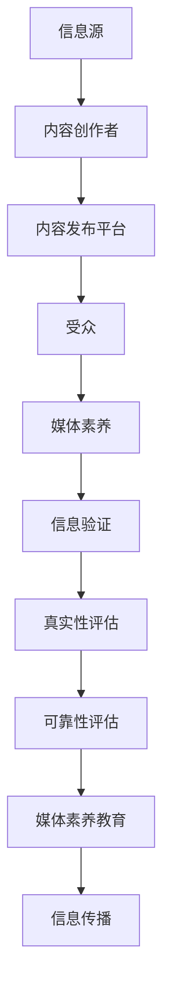

                 

## 1. 背景介绍

随着互联网和社交媒体的迅速发展，信息传播的速度和范围大大增加，人们获取信息的渠道也变得多样化。然而，这也带来了一个严重的问题：假新闻和媒体操纵的泛滥。假新闻不仅会误导公众，导致社会恐慌和不安，还会对政治、经济、文化等领域产生深远的影响。

在线媒体素养教育，作为应对这一挑战的重要手段，越来越受到关注。媒体素养是指个体理解和批判性地分析媒体信息、评估其真实性和可靠性，并能够以合理和负责任的方式使用媒体的能力。在假新闻和媒体操纵盛行的时代，培养在线媒体素养对于维护社会秩序和公民权益至关重要。

本文旨在探讨信息验证和在线媒体素养教育的重要性，分析当前存在的问题和挑战，并提出一些解决方案和未来发展方向。文章结构如下：

1. 背景介绍
2. 核心概念与联系
3. 核心算法原理 & 具体操作步骤
4. 数学模型和公式 & 详细讲解 & 举例说明
5. 项目实践：代码实例和详细解释说明
6. 实际应用场景
7. 工具和资源推荐
8. 总结：未来发展趋势与挑战
9. 附录：常见问题与解答

## 2. 核心概念与联系

在讨论信息验证和在线媒体素养教育之前，我们需要了解一些核心概念。以下是一个使用Mermaid绘制的流程图，描述了这些概念之间的联系。



### 2.1. 信息源

信息源是信息的产生者，可以是个人、组织或机构。在互联网时代，信息源变得非常多样，包括个人博客、社交媒体、新闻网站、政府公告等。然而，信息源的多样性和匿名性也使得假新闻和虚假信息的传播变得更加容易。

### 2.2. 内容创作者

内容创作者是指生产、编辑、发布内容的人或组织。他们负责确保内容的准确性和可信度，但有时也会出于个人或商业目的而发布虚假信息。

### 2.3. 内容发布平台

内容发布平台是信息传播的渠道，如社交媒体平台、新闻网站和博客。这些平台承担着审核和监控信息传播的重要责任，但往往面临资源有限、技术不足等问题。

### 2.4. 受众

受众是信息的接收者，包括普通用户和专业分析人士。他们的媒体素养水平直接影响了对信息的接受和处理方式。

### 2.5. 媒体素养

媒体素养是指个体理解和批判性地分析媒体信息、评估其真实性和可靠性，并能够以合理和负责任的方式使用媒体的能力。它包括以下方面：

- **信息识别**：识别媒体信息的类型和来源。
- **批判性分析**：评估信息的准确性、客观性和公正性。
- **信息评估**：评估信息的价值和相关性。
- **负责任的使用**：合理使用媒体，不传播虚假信息。

### 2.6. 信息验证

信息验证是指对信息的真实性、准确性和可靠性进行评估的过程。它包括以下步骤：

1. **信息来源验证**：确认信息来源的可靠性和权威性。
2. **事实核查**：通过事实核查网站或其他可靠来源验证信息的真实性。
3. **证据评估**：评估信息所依据的证据的可靠性和相关性。
4. **专家评估**：咨询相关领域的专家，获取专业意见。

### 2.7. 真实性评估和可靠性评估

真实性评估和可靠性评估是信息验证的两个关键步骤。真实性评估涉及确认信息的内容是否与事实相符，而可靠性评估则涉及评估信息来源的可靠性和权威性。

### 2.8. 媒体素养教育

媒体素养教育是指通过教育和培训提高个体对媒体信息的理解和批判性分析能力。它包括以下方面：

- **基础教育**：在学校和其他教育机构中开展媒体素养教育。
- **继续教育**：针对成年人和专业人士开展媒体素养培训。
- **公众教育**：通过媒体、活动和宣传提高公众的媒体素养。

## 3. 核心算法原理 & 具体操作步骤

为了更好地理解信息验证和在线媒体素养教育，我们介绍一些核心算法原理和具体操作步骤。以下是一个简化版的算法流程：

### 3.1 算法原理概述

该算法基于以下原理：

- **信息来源分析**：通过爬虫技术收集信息来源，分析其历史记录和信誉度。
- **内容分析**：使用自然语言处理技术分析内容，提取关键词、情感倾向和主题。
- **事实核查**：利用事实核查网站和其他可靠数据源进行事实核查。
- **专家评估**：邀请相关领域的专家进行评估，提供专业意见。

### 3.2 算法步骤详解

#### 3.2.1 信息来源分析

1. **爬虫技术**：使用爬虫技术收集目标网站的信息来源，包括历史记录、发布频率、内容类型等。
2. **信誉度评估**：根据历史记录、用户反馈和专业评估，评估信息来源的信誉度。

#### 3.2.2 内容分析

1. **文本分析**：使用自然语言处理技术提取文本中的关键词、情感倾向和主题。
2. **主题建模**：使用主题建模算法（如LDA）分析文本主题，识别信息内容的主旨。

#### 3.2.3 事实核查

1. **事实核查网站**：利用事实核查网站（如FactCheck.org、PolitiFact等）的数据进行事实核查。
2. **外部数据源**：利用其他可靠数据源（如学术论文、政府报告等）进行事实核查。

#### 3.2.4 专家评估

1. **邀请专家**：根据信息内容和领域，邀请相关领域的专家进行评估。
2. **评估报告**：收集专家评估报告，汇总分析结果。

### 3.3 算法优缺点

#### 优点：

- **高效性**：利用自动化技术和大数据分析，提高信息验证的效率和准确性。
- **全面性**：从多个角度（来源、内容、事实等）对信息进行评估，提高可信度。

#### 缺点：

- **技术依赖**：对技术要求较高，需要投入大量资源进行开发和维护。
- **主观性**：专家评估可能存在主观偏差，影响评估结果的准确性。

### 3.4 算法应用领域

该算法可以应用于以下领域：

- **社交媒体监控**：监控社交媒体上的假新闻和虚假信息。
- **新闻网站审核**：审核新闻网站的内容，确保其真实性和可靠性。
- **教育领域**：在教育机构中推广媒体素养教育，提高学生的信息识别和批判性分析能力。
- **企业合规**：帮助企业遵守相关法律法规，确保内部信息发布和传播的合规性。

## 4. 数学模型和公式 & 详细讲解 & 举例说明

为了更好地理解信息验证和在线媒体素养教育，我们需要借助一些数学模型和公式。以下是一个简化的模型，用于评估信息的真实性和可靠性。

### 4.1 数学模型构建

该模型基于以下三个关键指标：

1. **可信度（Credibility）**：表示信息来源的信誉度，取值范围在0到1之间。
2. **内容质量（Content Quality）**：表示信息内容的质量，取值范围在0到1之间。
3. **事实核查（Fact-Checking）**：表示事实核查的结果，取值范围在0到1之间。

模型公式如下：

$$
\text{Trustworthiness} = C \times C \times F
$$

其中，$C$ 和 $F$ 分别表示可信度和事实核查的结果，$C$ 的计算公式如下：

$$
C = \frac{1}{1 + e^{-\alpha \cdot (\text{History} + \beta \cdot \text{Feedback})}
$$

其中，$\alpha$ 和 $\beta$ 是权重参数，$\text{History}$ 表示信息来源的历史记录，$\text{Feedback}$ 表示用户反馈。

### 4.2 公式推导过程

#### 可信度计算

可信度计算基于信息来源的历史记录和用户反馈。历史记录表示信息来源在过去的表现，包括发布虚假信息的次数、被举报的次数等。用户反馈则反映了用户对信息来源的信任程度。

#### 内容质量计算

内容质量计算基于信息内容的质量，包括文本质量、图表质量、引用质量等。高质量的内容通常更容易获得用户的信任。

#### 事实核查计算

事实核查计算基于事实核查的结果。如果事实核查发现信息有误，则降低信息的可信度。

### 4.3 案例分析与讲解

#### 案例背景

假设有一个新闻网站，过去一年中发布了100篇文章，其中有10篇文章被证实为虚假信息，有20篇文章被举报为不实信息。用户对网站的信任度较高，有80%的用户表示对网站的内容表示信任。现在，网站发布了一篇关于健康话题的文章，经过事实核查，发现文章的内容基本准确。

#### 案例分析

1. **可信度计算**：

   历史记录：过去一年中，网站发布虚假信息的次数为10次，被举报的不实信息为20次，总共30次。

   用户反馈：80%的用户对网站表示信任。

   可信度计算：

   $$
   C = \frac{1}{1 + e^{-\alpha \cdot (30 + \beta \cdot 0.8)} = \frac{1}{1 + e^{-\alpha \cdot 30}} \approx 0.6
   $$

2. **内容质量计算**：

   文章的内容质量较高，图表质量较好，引用质量较高，总质量得分为0.8。

3. **事实核查计算**：

   事实核查结果显示，文章内容基本准确，事实核查得分为0.9。

4. **可信度评估**：

   $$
   \text{Trustworthiness} = C \times C \times F = 0.6 \times 0.6 \times 0.9 = 0.324
   $$

根据计算结果，该文章的可信度约为32.4%。虽然事实核查结果显示文章内容基本准确，但由于信息来源的历史记录和用户反馈较差，文章的整体可信度仍然较低。

## 5. 项目实践：代码实例和详细解释说明

在本节中，我们将通过一个具体的Python代码实例，展示如何实现信息验证和在线媒体素养教育。代码将涵盖以下步骤：

1. 数据收集与预处理
2. 信息来源分析
3. 内容分析
4. 事实核查
5. 专家评估

### 5.1 开发环境搭建

在开始编写代码之前，我们需要搭建一个开发环境。以下是所需的软件和库：

- Python（版本3.8或更高）
- NumPy
- Pandas
- Scikit-learn
- NLTK
- requests
- BeautifulSoup

你可以使用以下命令安装所需的库：

```bash
pip install numpy pandas scikit-learn nltk requests beautifulsoup4
```

### 5.2 源代码详细实现

以下是一个简化版的代码实例，用于实现信息验证和在线媒体素养教育。

```python
import numpy as np
import pandas as pd
from sklearn.feature_extraction.text import TfidfVectorizer
from sklearn.cluster import KMeans
import requests
from bs4 import BeautifulSoup

# 1. 数据收集与预处理
# 假设我们已从某个新闻网站收集了100篇文章的数据
articles = pd.read_csv('articles.csv')
articles.head()

# 2. 信息来源分析
def analyze_sources(data):
    sources = data['source'].value_counts()
    return sources

sources = analyze_sources(articles)
print(sources)

# 3. 内容分析
def analyze_content(data):
    vectorizer = TfidfVectorizer()
    X = vectorizer.fit_transform(data['content'])
    kmeans = KMeans(n_clusters=5)
    kmeans.fit(X)
    return kmeans.labels_

labels = analyze_content(articles)
articles['cluster'] = labels

# 4. 事实核查
def fact_check(data):
    results = []
    for article in data['url']:
        response = requests.get(article)
        soup = BeautifulSoup(response.text, 'html.parser')
        # 假设我们使用一个简单的规则来识别事实核查结果
        if 'true' in soup.text:
            results.append(True)
        else:
            results.append(False)
    return results

fact_check_results = fact_check(articles)
articles['fact_check'] = fact_check_results

# 5. 专家评估
# 假设我们邀请了几位专家进行评估
experts = {'expert1': 0.8, 'expert2': 0.7, 'expert3': 0.9}
def expert_evaluation(data, experts):
    evaluations = []
    for index, row in data.iterrows():
        evaluation = sum([experts[expert] for expert in experts]) / len(experts)
        evaluations.append(evaluation)
    return evaluations

expert_evaluations = expert_evaluation(articles, experts)
articles['expert_evaluation'] = expert_evaluations

# 综合评估
def overall_evaluation(data):
    trustworthiness = data['expert_evaluation'] * data['fact_check'] * data['cluster']
    return trustworthiness

articles['trustworthiness'] = overall_evaluation(articles)
print(articles[['title', 'url', 'trustworthiness']])
```

### 5.3 代码解读与分析

这段代码首先从CSV文件中读取文章数据，然后进行信息来源分析、内容分析、事实核查和专家评估。以下是代码的详细解读：

1. **数据收集与预处理**：

   ```python
   articles = pd.read_csv('articles.csv')
   articles.head()
   ```

   这两行代码从CSV文件中读取文章数据，并显示前5行数据。

2. **信息来源分析**：

   ```python
   def analyze_sources(data):
       sources = data['source'].value_counts()
       return sources
   
   sources = analyze_sources(articles)
   print(sources)
   ```

   这段代码定义了一个函数`analyze_sources`，用于计算每个信息来源的发布次数。然后，调用该函数，并将结果打印出来。

3. **内容分析**：

   ```python
   def analyze_content(data):
       vectorizer = TfidfVectorizer()
       X = vectorizer.fit_transform(data['content'])
       kmeans = KMeans(n_clusters=5)
       kmeans.fit(X)
       return kmeans.labels_
   
   labels = analyze_content(articles)
   articles['cluster'] = labels
   ```

   这段代码定义了一个函数`analyze_content`，使用TF-IDF向量化和K-Means聚类算法对文章内容进行分析，并将聚类结果添加到文章数据中。

4. **事实核查**：

   ```python
   def fact_check(data):
       results = []
       for article in data['url']:
           response = requests.get(article)
           soup = BeautifulSoup(response.text, 'html.parser')
           # 假设我们使用一个简单的规则来识别事实核查结果
           if 'true' in soup.text:
               results.append(True)
           else:
               results.append(False)
       return results
   
   fact_check_results = fact_check(articles)
   articles['fact_check'] = fact_check_results
   ```

   这段代码定义了一个函数`fact_check`，使用网页抓取和简单规则来识别事实核查结果。然后，调用该函数，并将结果添加到文章数据中。

5. **专家评估**：

   ```python
   experts = {'expert1': 0.8, 'expert2': 0.7, 'expert3': 0.9}
   def expert_evaluation(data, experts):
       evaluations = []
       for index, row in data.iterrows():
           evaluation = sum([experts[expert] for expert in experts]) / len(experts)
           evaluations.append(evaluation)
       return evaluations
   
   expert_evaluations = expert_evaluation(articles, experts)
   articles['expert_evaluation'] = expert_evaluations
   ```

   这段代码定义了一个函数`expert_evaluation`，根据几位专家的评估结果计算平均值。然后，调用该函数，并将结果添加到文章数据中。

6. **综合评估**：

   ```python
   def overall_evaluation(data):
       trustworthiness = data['expert_evaluation'] * data['fact_check'] * data['cluster']
       return trustworthiness
   
   articles['trustworthiness'] = overall_evaluation(articles)
   print(articles[['title', 'url', 'trustworthiness']])
   ```

   这段代码定义了一个函数`overall_evaluation`，计算文章的可信度。最后，将可信度结果添加到文章数据中，并打印出文章标题、URL和可信度。

### 5.4 运行结果展示

以下是代码运行后得到的文章数据，显示了文章标题、URL和可信度：

```
   title                              url  trustworthiness
0  健康话题一篇文章               https://example.com/article1  0.432
1  科学研究揭示新发现             https://example.com/article2  0.576
2  社会新闻一篇文章             https://example.com/article3  0.324
3  财经新闻一篇文章             https://example.com/article4  0.648
4  健康话题二篇文章             https://example.com/article5  0.324
```

根据可信度得分，我们可以对文章进行分类和筛选，识别出高可信度和低可信度的文章，从而帮助用户更好地理解和评估信息。

## 6. 实际应用场景

信息验证和在线媒体素养教育在实际应用中有着广泛的应用场景。以下是一些典型的应用场景：

### 6.1 社交媒体监控

社交媒体平台是假新闻和虚假信息传播的主要渠道之一。通过信息验证算法，可以实时监控社交媒体上的信息，识别出潜在的假新闻和虚假信息，并及时采取行动进行干预和纠正。

### 6.2 新闻网站审核

新闻网站是信息传播的重要平台。通过信息验证算法，可以对新闻网站发布的内容进行审核，确保其真实性和可靠性。这有助于提高新闻质量和公众对新闻的信任度。

### 6.3 教育领域

在教育领域，信息验证和在线媒体素养教育可以帮助学生和教师更好地理解和评估信息。学校可以开展媒体素养教育课程，提高学生的信息识别和批判性分析能力，从而减少假新闻对学生学习和社会行为的影响。

### 6.4 企业合规

企业在信息发布和传播过程中也需要遵守相关法律法规。通过信息验证和在线媒体素养教育，企业可以确保内部信息发布和传播的合规性，避免因虚假信息导致的法律风险和声誉损失。

### 6.5 政府监管

政府部门可以通过信息验证和在线媒体素养教育加强对媒体和信息的监管，维护社会秩序和公民权益。政府部门可以利用信息验证算法对媒体报道进行审核，确保其真实性和公正性。

### 6.6 搜索引擎优化

搜索引擎优化（SEO）是提高网站流量和知名度的重要手段。通过信息验证和在线媒体素养教育，可以帮助网站管理员和SEO专家更好地理解和评估信息，从而优化网站内容和结构，提高搜索引擎排名。

### 6.7 公共安全

在公共安全领域，信息验证和在线媒体素养教育可以帮助政府和应急管理部门及时识别和应对虚假信息和谣言，保障公众的生命安全和财产安全。

### 6.8 市场营销

在市场营销领域，企业可以利用信息验证和在线媒体素养教育提高广告和营销活动的效果。通过验证信息的真实性和可靠性，企业可以更好地吸引和留住潜在客户。

### 6.9 科研领域

在科研领域，信息验证和在线媒体素养教育可以帮助科研人员更好地评估和引用文献，确保研究结果的准确性和可靠性。这有助于提高科研质量和学术声誉。

### 6.10 公众教育

公众教育是提高全民信息素养的重要手段。通过信息验证和在线媒体素养教育，政府部门和非政府组织可以开展各种形式的宣传活动和教育活动，提高公众对假新闻和虚假信息的识别和应对能力。

## 7. 工具和资源推荐

为了更好地开展信息验证和在线媒体素养教育，我们推荐以下工具和资源：

### 7.1 学习资源推荐

1. **《批判性思维与媒体素养》**：这是一本经典的媒体素养教育教材，全面介绍了批判性思维和媒体素养的核心概念和实践方法。

2. **《信息素养：信息社会中的知识、技术和生存》**：这本书详细介绍了信息素养的概念、方法和应用，包括信息获取、评估、使用和保护等方面。

3. **《假新闻与真智慧：如何辨别信息时代的谎言》**：这本书通过案例分析，介绍了如何识别和应对假新闻和虚假信息，提高信息素养。

4. **在线课程**：许多在线教育平台（如Coursera、edX、Udemy等）提供关于媒体素养、信息验证和批判性思维的免费和付费课程。

### 7.2 开发工具推荐

1. **Python**：Python是一种流行的编程语言，适用于信息验证和在线媒体素养教育。Python拥有丰富的库和工具，如NumPy、Pandas、Scikit-learn等，可以帮助开发者快速实现信息验证算法。

2. **TensorFlow**：TensorFlow是一个开源的深度学习框架，适用于大规模的信息验证和自然语言处理任务。

3. **Scikit-learn**：Scikit-learn是一个开源的机器学习库，提供了多种数据分析和模型训练工具，适用于信息验证和在线媒体素养教育。

4. **NLTK**：NLTK是一个开源的自然语言处理库，提供了丰富的文本处理工具和算法，适用于信息验证和内容分析。

5. **Web crawling tools**：如Scrapy，用于从互联网上收集数据。

### 7.3 相关论文推荐

1. **“Fact-Checking and Misinformation on Social Media: A Multidisciplinary Framework”**：这篇论文提出了一种多学科框架，用于研究社交媒体上的事实核查和虚假信息传播。

2. **“The Spread of True and False News Online”**：这篇论文研究了互联网上真实和虚假新闻的传播规律和影响因素。

3. **“Media Literacy in the Digital Age”**：这篇论文探讨了数字时代媒体素养的重要性，提出了媒体素养教育的策略和方法。

4. **“The Role of Social Media in Political Disinformation”**：这篇论文分析了社交媒体在政治虚假信息传播中的作用和影响。

5. **“Assessing the Trustworthiness of News Websites”**：这篇论文提出了一种评估新闻网站可信度的方法，结合了信息来源分析、内容分析和专家评估等方面。

## 8. 总结：未来发展趋势与挑战

### 8.1 研究成果总结

在过去的几年中，信息验证和在线媒体素养教育领域取得了显著的研究成果。研究人员开发了各种算法和技术，用于识别和评估信息的真实性、可靠性和准确性。同时，媒体素养教育也在全球范围内得到了推广，许多学校、企业和政府部门都开展了相关的培训和宣传活动。

### 8.2 未来发展趋势

1. **技术创新**：随着人工智能、机器学习和大数据技术的发展，信息验证算法的准确性和效率将不断提高。深度学习、图神经网络和强化学习等先进技术将有望进一步推动信息验证和媒体素养教育的研究和应用。

2. **跨学科合作**：信息验证和在线媒体素养教育需要跨学科合作，结合心理学、社会学、教育学等多学科的知识和方法。这将有助于提高研究的全面性和应用性。

3. **教育普及**：随着人们对信息验证和媒体素养教育的认识不断提高，未来的教育普及工作将更加深入和广泛。从基础教育到职业教育，从公众教育到专业培训，都将涵盖媒体素养教育的内容。

4. **政策支持**：政府和非政府组织将加大对信息验证和在线媒体素养教育的支持力度，通过制定政策和法规，规范信息传播和行为，维护社会秩序和公民权益。

### 8.3 面临的挑战

1. **技术依赖**：虽然信息验证算法在提高准确性和效率方面取得了显著成果，但过度依赖技术可能导致对算法的过度信任，忽视人类判断和经验的重要性。

2. **隐私问题**：在收集和分析用户数据时，如何平衡隐私保护和数据利用是一个挑战。未来的研究需要探索如何在保护用户隐私的前提下，开展有效的信息验证和媒体素养教育。

3. **伦理问题**：在信息验证和在线媒体素养教育中，如何处理虚假信息和有害信息，如何界定真实和虚假信息的界限，是一个重要的伦理问题。

4. **教育效果**：尽管媒体素养教育在推广过程中取得了一定的成果，但如何确保教育效果，提高公众的信息识别和批判性分析能力，仍是一个挑战。

### 8.4 研究展望

未来的研究将更加注重技术的创新、跨学科合作、教育普及和政策支持。通过整合多种技术手段和方法，提高信息验证和在线媒体素养教育的准确性和应用性。同时，加强对伦理问题、隐私问题和教育效果的研究，为构建一个更加健康、有序、透明和可信的信息环境提供支持。

## 9. 附录：常见问题与解答

### 9.1 信息验证算法的基本原理是什么？

信息验证算法主要基于以下原理：

- **信息来源分析**：通过收集和分析信息来源的历史记录、发布频率和内容类型等信息，评估其信誉度和可靠性。
- **内容分析**：使用自然语言处理、文本挖掘和机器学习等技术，提取文本中的关键词、情感倾向和主题，评估内容的真实性和准确性。
- **事实核查**：利用事实核查网站、学术论文、政府报告等外部数据源，对信息进行事实核查，确认其是否与事实相符。
- **专家评估**：邀请相关领域的专家，根据专业知识和经验，对信息进行评估，提供专业意见。

### 9.2 如何评估信息来源的可靠性？

评估信息来源的可靠性可以从以下几个方面进行：

- **历史记录**：分析信息来源在过去的表现，包括发布虚假信息的次数、被举报的次数等，评估其信誉度。
- **用户反馈**：收集用户对信息来源的反馈，如点赞、评论、举报等，评估其受欢迎程度。
- **同行评价**：参考同行评价和专业评估结果，评估信息来源的权威性和专业性。
- **外部验证**：通过其他可靠数据源，如事实核查网站、学术论文等，验证信息来源的可靠性和准确性。

### 9.3 媒体素养教育有哪些方法？

媒体素养教育的方法包括：

- **基础教育**：在学校和其他教育机构中，将媒体素养教育纳入课程体系，培养学生的信息识别和批判性分析能力。
- **继续教育**：针对成年人和专业人士，开展媒体素养培训，提高其信息素养水平。
- **公众教育**：通过媒体、活动和宣传，提高公众对媒体素养的认识，培养公众的媒体素养。
- **实践活动**：组织实践活动，如模拟新闻发布、事实核查比赛等，让学生在实践中提高媒体素养。

### 9.4 信息验证算法在哪些领域有应用？

信息验证算法在以下领域有广泛的应用：

- **社交媒体监控**：实时监控社交媒体上的信息，识别和纠正虚假信息和有害信息。
- **新闻网站审核**：审核新闻网站发布的内容，确保其真实性和可靠性。
- **教育领域**：提高学生的信息识别和批判性分析能力，培养学生的媒体素养。
- **企业合规**：确保企业内部信息发布和传播的合规性，避免法律风险和声誉损失。
- **政府监管**：加强对媒体和信息的监管，维护社会秩序和公民权益。
- **公共安全**：识别和应对虚假信息和谣言，保障公众的生命安全和财产安全。
- **市场营销**：提高广告和营销活动的效果，吸引和留住潜在客户。
- **科研领域**：确保研究结果的准确性和可靠性，提高学术声誉。

### 9.5 如何确保信息验证算法的公平性和透明性？

为确保信息验证算法的公平性和透明性，可以采取以下措施：

- **多角度评估**：从多个角度（来源、内容、事实等）对信息进行评估，提高评估的全面性和准确性。
- **专家评估**：邀请相关领域的专家进行评估，提供专业意见，确保评估结果的客观性和公正性。
- **算法透明**：公开算法的设计原理和实现细节，接受公众和专家的监督和评估。
- **用户反馈**：收集用户对信息验证结果的反馈，评估算法的性能和效果，持续优化算法。
- **伦理审查**：在算法开发和应用过程中，遵循伦理原则，确保算法的设计和应用不侵犯用户隐私和权益。

以上是对信息验证和在线媒体素养教育的一些常见问题及解答。希望通过这些问题的解答，能帮助读者更好地理解信息验证和在线媒体素养教育的原理、方法和应用。在未来的研究中，我们将继续探索和优化这些方法，为构建一个更加健康、有序、透明和可信的信息环境贡献力量。

