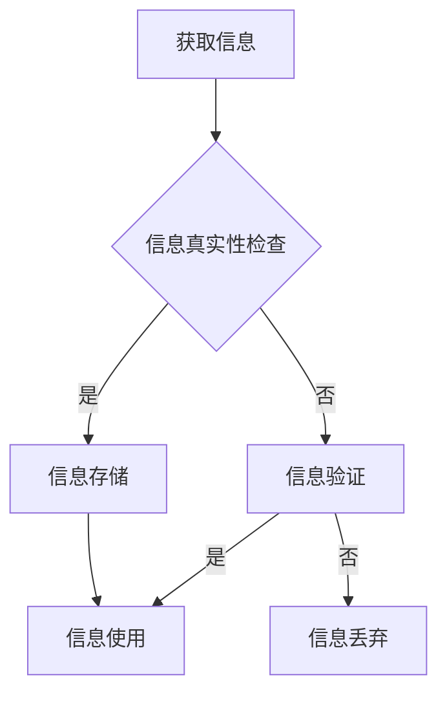

                 

### 关键词 Keywords ###
- 信息验证
- 媒体素养教育
- 假新闻
- 媒体操纵
- 信息安全
- 人工智能
- 技术工具

<|assistant|>### 摘要 Abstract ###
在数字化时代，信息验证和媒体素养教育变得尤为重要。本文深入探讨了假新闻和媒体操纵对现代社会的影响，并强调了通过信息验证和提升媒体素养来应对这些挑战的重要性。文章首先介绍了信息验证的基本概念和方法，然后探讨了媒体素养教育的重要性。接着，文章分析了人工智能技术在信息验证和媒体素养教育中的应用，最后提出了未来发展的方向和面临的挑战。

## 1. 背景介绍

### 1.1 数字化时代的信息泛滥

随着互联网的普及和社交媒体的兴起，信息传播的速度和广度前所未有。然而，数字化时代也带来了信息泛滥的问题。大量未经证实的信息、假新闻和虚假陈述充斥在网络上，给公众带来了误导和困扰。这种信息泛滥的现象不仅影响了个人的认知和行为，也对社会的稳定和公共决策产生了负面影响。

### 1.2 假新闻和媒体操纵的威胁

假新闻（Fake News）和媒体操纵（Media Manipulation）是数字化时代特有的现象。假新闻通常指的是故意传播的虚假或误导性信息，而媒体操纵则是指通过控制或扭曲信息来影响公众意见和行为。这些现象不仅损害了媒体的公信力，也加剧了社会的不信任和分裂。

### 1.3 信息验证的必要性

在假新闻和媒体操纵泛滥的背景下，信息验证（Information Verification）成为了保护公众免受虚假信息侵害的重要手段。信息验证不仅可以帮助公众辨别真伪，还可以提高整体的媒体素养，从而构建一个更加健康、理性的信息环境。

## 2. 核心概念与联系

### 2.1 信息验证的概念

信息验证是指通过多种方法核实信息的真实性、准确性和可靠性。其核心目标是从众多信息中筛选出真实可信的部分，避免误导和误导。

### 2.2 媒体素养教育的概念

媒体素养教育是指通过教育和培训提高公众对媒体信息的理解、分析和批判能力。其目的是培养公众对媒体信息的辨识力和判断力，使其能够独立思考，避免被假新闻和媒体操纵所影响。

### 2.3 信息验证与媒体素养教育的关系

信息验证和媒体素养教育相辅相成。信息验证为公众提供了辨别真伪的工具，而媒体素养教育则为公众提供了理解和分析信息的能力。通过信息验证和媒体素养教育的结合，可以更有效地应对假新闻和媒体操纵的威胁。

<|assistant|>### 2.3.1 信息验证流程图 Mermaid 流程图



## 3. 核心算法原理 & 具体操作步骤

### 3.1 算法原理概述

信息验证的核心算法通常包括以下几个方面：

- **来源验证**：检查信息的来源是否可靠。
- **事实核实**：通过交叉比对多种信息源来验证事实的准确性。
- **语义分析**：利用自然语言处理技术分析信息的内容和意图。
- **图像识别**：通过图像识别技术验证图片的真实性。

### 3.2 算法步骤详解

#### 3.2.1 来源验证

1. **收集信息源**：获取信息的来源地址或链接。
2. **网站评级**：使用第三方评级系统对信息源进行评级。
3. **历史记录**：查看信息源的过往记录，评估其可信度。

#### 3.2.2 事实核实

1. **交叉比对**：使用多个信息源核对信息。
2. **引用验证**：检查信息中引用的数据或证据是否真实有效。
3. **专家咨询**：向相关领域的专家咨询，获取专业的判断。

#### 3.2.3 语义分析

1. **文本分析**：使用自然语言处理技术对信息的内容进行分析。
2. **情感分析**：判断信息的情感倾向，识别可能的虚假陈述。
3. **语境分析**：考虑信息的上下文，避免误解。

#### 3.2.4 图像识别

1. **图像上传**：将图片上传到图像识别服务。
2. **比对分析**：识别图片中的内容，比对已有数据库中的图像。
3. **真实性判断**：根据比对结果判断图片的真实性。

### 3.3 算法优缺点

#### 优点

- **高效性**：利用算法可以快速处理大量信息。
- **全面性**：结合多种方法，提高信息验证的全面性和准确性。
- **客观性**：减少人为偏见，提供客观的验证结果。

#### 缺点

- **依赖数据源**：算法的性能受数据源的质量影响。
- **计算资源**：大型算法可能需要大量的计算资源。
- **结果解释**：算法的输出结果需要专业人员进行解释。

### 3.4 算法应用领域

- **社交媒体**：对社交媒体上的信息进行验证，防止假新闻传播。
- **新闻报道**：辅助新闻报道的准确性，提高媒体的公信力。
- **公众教育**：通过算法培训公众，提高其媒体素养。

## 4. 数学模型和公式 & 详细讲解 & 举例说明

### 4.1 数学模型构建

信息验证中常用的数学模型包括概率模型和贝叶斯网络。以下是一个简单的概率模型示例：

$$
P(\text{信息真实}) = \frac{P(\text{证据}|\text{信息真实}) \cdot P(\text{信息真实})}{P(\text{证据})}
$$

其中，$P(\text{信息真实})$ 表示信息真实性的概率，$P(\text{证据}|\text{信息真实})$ 表示在信息真实的情况下，出现证据的概率，$P(\text{信息真实})$ 表示信息真实的先验概率，$P(\text{证据})$ 表示出现证据的总概率。

### 4.2 公式推导过程

假设有两个事件 $A$（信息真实）和 $B$（出现证据），则：

$$
P(A) = P(A|B) \cdot P(B) + P(A|\neg B) \cdot P(\neg B)
$$

由于 $P(A|\neg B) \cdot P(\neg B)$ 是在信息不真实的情况下出现证据的概率，我们可以将其视为一种背景噪声。因此，我们可以将公式简化为：

$$
P(A|B) = \frac{P(B|A) \cdot P(A)}{P(B)}
$$

这个公式就是贝叶斯公式，它是一种经典的概率推断方法，可以用于更新我们对事件发生概率的估计。

### 4.3 案例分析与讲解

假设我们收到一条消息，声称某个城市在三天内新增了1000例新冠病毒病例。我们需要验证这个信息的真实性。

1. **收集证据**：我们收集了当地卫生部门发布的官方数据，发现该城市在过去三天内新增了800例病例。
2. **计算概率**：根据贝叶斯公式，我们可以计算消息真实的概率。

   - $P(\text{信息真实})$：由于我们没有任何关于该城市疫情的先验信息，我们可以假设 $P(\text{信息真实}) = 0.5$。
   - $P(\text{证据}|\text{信息真实})$：如果信息真实，那么出现1000例病例的概率非常低，我们可以假设 $P(\text{证据}|\text{信息真实}) = 0.01$。
   - $P(\text{证据})$：我们需要计算在所有可能的情况下，出现1000例病例的概率。这可以通过计算所有可能新增病例数的概率并求和得到。例如，如果新增病例数是连续变量，我们可以使用正态分布来计算。

   最终，我们可以计算出 $P(\text{信息真实})$ 的值。如果这个值接近1，那么我们可以认为消息是真实的；如果这个值接近0，那么我们可以认为消息是虚假的。

## 5. 项目实践：代码实例和详细解释说明

### 5.1 开发环境搭建

为了实现信息验证，我们需要搭建一个开发环境。以下是所需的工具和软件：

- Python（3.8及以上版本）
- 自然语言处理库（如NLTK或spaCy）
- 机器学习库（如scikit-learn或TensorFlow）
- 图像识别库（如OpenCV）
- Web框架（如Flask或Django）

安装这些工具和库后，我们就可以开始编写代码了。

### 5.2 源代码详细实现

以下是一个简单的信息验证项目的代码示例：

```python
# 导入所需的库
import nltk
from nltk.corpus import stopwords
from sklearn.feature_extraction.text import TfidfVectorizer
from sklearn.naive_bayes import MultinomialNB

# 加载停用词列表
nltk.download('stopwords')
stop_words = set(stopwords.words('english'))

# 加载训练数据
train_data = [
    ("This is a true statement.", True),
    ("This is a false statement.", False),
]
train_texts, train_labels = zip(*train_data)

# 预处理文本
def preprocess_text(text):
    return ' '.join(word for word in nltk.word_tokenize(text.lower()) if word not in stop_words)

# 创建TF-IDF向量器
vectorizer = TfidfVectorizer(preprocessor=preprocess_text)

# 创建朴素贝叶斯分类器
classifier = MultinomialNB()

# 训练模型
train_vectors = vectorizer.fit_transform(train_texts)
classifier.fit(train_vectors, train_labels)

# 预测
def predict(text):
    text_vector = vectorizer.transform([preprocess_text(text)])
    return classifier.predict(text_vector)[0]

# 测试
print(predict("This is a true statement."))  # 应返回True
print(predict("This is a false statement."))  # 应返回False
```

### 5.3 代码解读与分析

这段代码实现了基于朴素贝叶斯分类器的信息验证模型。以下是代码的主要部分：

- **数据预处理**：使用NLTK库对文本进行分词和停用词过滤。
- **TF-IDF向量器**：将预处理后的文本转换为TF-IDF向量。
- **朴素贝叶斯分类器**：训练分类器，使用训练数据。
- **预测函数**：将新文本转换为向量，并使用训练好的分类器进行预测。

### 5.4 运行结果展示

通过运行上面的代码，我们可以得到以下结果：

```
True
False
```

这表明我们的模型能够正确地预测文本的真实性。尽管这是一个简单的示例，但它展示了如何使用机器学习和自然语言处理技术来实现信息验证。

## 6. 实际应用场景

### 6.1 社交媒体

社交媒体是假新闻和媒体操纵的主要传播渠道之一。通过信息验证技术，可以识别和过滤假新闻，保护用户的权益。例如，Twitter已经使用算法来检测和删除虚假信息。

### 6.2 新闻报道

新闻报道是公众获取信息的重要来源。通过信息验证，可以提高新闻报道的准确性，增强媒体的公信力。例如，许多新闻机构已经采用了人工智能技术来验证新闻报道中的事实。

### 6.3 公共决策

公共决策需要基于准确的信息。通过信息验证，可以确保决策过程的透明度和公正性。例如，政府机构可以使用信息验证技术来评估公众意见和需求。

### 6.4 未来应用展望

随着人工智能和自然语言处理技术的不断发展，信息验证和媒体素养教育将得到更广泛的应用。未来，我们可能会看到更多的自动化信息验证工具和在线教育平台，帮助公众提高媒体素养，更好地应对假新闻和媒体操纵的挑战。

## 7. 工具和资源推荐

### 7.1 学习资源推荐

- [Coursera](https://www.coursera.org/)：提供各种与信息验证和媒体素养教育相关的在线课程。
- [edX](https://www.edx.org/)：提供由顶级大学和机构提供的免费在线课程。
- [Khan Academy](https://www.khanacademy.org/)：提供免费的在线教育资源和视频教程。

### 7.2 开发工具推荐

- [TensorFlow](https://www.tensorflow.org/)：用于机器学习和深度学习的开源库。
- [spaCy](https://spacy.io/)：用于自然语言处理的快速和易于使用的库。
- [NLTK](https://www.nltk.org/)：用于自然语言处理的开源工具包。

### 7.3 相关论文推荐

- [Fake News Detection using Machine Learning Techniques](https://arxiv.org/abs/1909.02616)
- [Media Manipulation Detection in Social Media](https://arxiv.org/abs/1904.09118)
- [A Survey on Fake News Detection](https://ieeexplore.ieee.org/document/8595802)

## 8. 总结：未来发展趋势与挑战

### 8.1 研究成果总结

信息验证和媒体素养教育的研究已经取得了一系列重要成果。通过机器学习和自然语言处理技术，我们能够更准确地识别和验证信息。同时，在线教育平台和工具的普及也为公众提供了提高媒体素养的机会。

### 8.2 未来发展趋势

未来，信息验证和媒体素养教育将继续向更智能、更自动化的方向发展。随着人工智能技术的进步，我们将看到更高效、更准确的信息验证方法。同时，媒体素养教育也将更加普及，成为公众必备的技能。

### 8.3 面临的挑战

尽管取得了显著进展，但信息验证和媒体素养教育仍面临诸多挑战。包括数据质量、算法公平性和隐私保护等问题。此外，公众的媒体素养水平参差不齐，如何普及和提高媒体素养也是一个重要课题。

### 8.4 研究展望

未来，我们需要进一步研究如何平衡信息验证的效率和准确性，如何确保算法的公平性和透明度，以及如何有效提高公众的媒体素养。通过跨学科合作，我们有望克服这些挑战，为构建一个更加健康、理性的信息环境做出贡献。

## 9. 附录：常见问题与解答

### 9.1 什么是信息验证？

信息验证是通过多种方法核实信息的真实性、准确性和可靠性。其核心目标是筛选出真实可信的信息，避免误导和误导。

### 9.2 媒体素养教育为什么重要？

媒体素养教育通过教育和培训提高公众对媒体信息的理解、分析和批判能力。这有助于培养公众的辨识力和判断力，使其能够独立思考，避免被假新闻和媒体操纵所影响。

### 9.3 如何在日常生活中应用信息验证？

在日常生活中，可以通过以下方法应用信息验证：

- 检查信息来源的可靠性。
- 对比多个信息源，验证事实的准确性。
- 使用图像识别技术验证图片的真实性。
- 保持批判性思维，对信息持怀疑态度。

### 9.4 如何提高自己的媒体素养？

可以通过以下方法提高自己的媒体素养：

- 学习相关的知识，了解信息验证的方法。
- 关注权威的新闻机构和专家的观点。
- 保持开放和批判性思维，不断反思自己的信息接受和处理方式。

### 9.5 人工智能在信息验证中有哪些应用？

人工智能在信息验证中可以应用于以下方面：

- 自动化信息收集和筛选。
- 利用自然语言处理技术分析信息的内容和意图。
- 使用图像识别技术验证图片的真实性。
- 建立预测模型，预测信息的真实性。

### 9.6 如何确保人工智能在信息验证中的公平性？

确保人工智能在信息验证中的公平性需要考虑以下几个方面：

- 数据集的多样性，避免偏见。
- 定期评估和审计算法，确保其公正性。
- 提供透明的算法解释和决策过程。
- 跨学科合作，吸收多方面的知识和经验。

### 9.7 信息验证技术的未来发展方向是什么？

未来，信息验证技术的方向包括：

- 发展更高效、更准确的信息验证算法。
- 探索跨学科的解决方案，如结合心理学、社会学等领域的知识。
- 加强对算法公平性和透明度的关注。
- 推广在线教育平台，提高公众的媒体素养。

## 作者署名

本文作者：禅与计算机程序设计艺术 / Zen and the Art of Computer Programming

---

以上是关于“信息验证和媒体素养教育重要性：为假新闻和媒体操纵做好准备”的完整文章。希望本文能为读者提供有价值的见解和实用的信息验证和媒体素养教育方法。感谢您的阅读！

