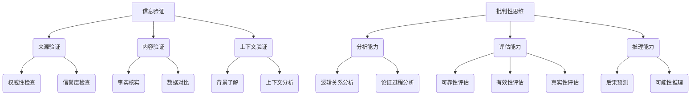

                 

随着互联网和信息技术的迅猛发展，信息传播的速度和广度已经达到了前所未有的高度。然而，这种便利也带来了一个问题——信息过载。在大量的信息中，真假难辨，假新闻和错误信息的泛滥成为当今社会的一大挑战。本文旨在探讨如何在假新闻和错误信息时代，通过信息验证和批判性思维的培养，为我们导航提供正确的方向。

## 1. 背景介绍

在互联网时代，信息爆炸式增长，使得每个人每天都要接触到海量的信息。然而，并非所有信息都是真实可靠的。假新闻、误导性信息和错误信息充斥着网络，给社会带来了严重的负面影响。例如，不实信息的传播可能导致公众恐慌、社会动荡，甚至对个人的生活产生负面影响。

为了应对这一挑战，我们需要具备信息验证的能力，以确保我们接收到的信息是真实可靠的。此外，批判性思维的培养也是至关重要的，它可以帮助我们分析信息的真实性、逻辑性和可靠性，从而避免被误导。

## 2. 核心概念与联系

在探讨信息验证和批判性思维的培养之前，我们需要明确几个核心概念。

### 2.1 信息验证

信息验证是指对信息的真实性和准确性进行核查的过程。它包括以下几个方面：

- **来源验证**：检查信息来源是否可靠，是否有权威性和信誉度。
- **内容验证**：对信息的内容进行核实，确保其符合事实。
- **上下文验证**：了解信息的背景和上下文，确保其完整性和准确性。

### 2.2 批判性思维

批判性思维是指对信息进行深入分析、评估和推理的能力。它包括以下几个方面：

- **分析能力**：对信息进行分析，识别其逻辑关系和论证过程。
- **评估能力**：对信息的可靠性、有效性和真实性进行评估。
- **推理能力**：根据已有的信息进行推理，预测可能的后果。

### 2.3 信息验证与批判性思维的联系

信息验证和批判性思维是相辅相成的。信息验证是批判性思维的前提，只有验证了信息的真实性，才能进行深入的分析和评估。而批判性思维则是对信息验证的深化，它要求我们对信息进行深入的分析和推理，以发现潜在的虚假信息。

为了更好地说明信息验证和批判性思维的概念，我们可以使用Mermaid流程图进行展示。



## 3. 核心算法原理 & 具体操作步骤

### 3.1 算法原理概述

信息验证和批判性思维的算法原理主要基于以下几个方面：

- **数据挖掘**：通过对大量信息的挖掘和分析，识别潜在的真实信息。
- **机器学习**：利用机器学习算法，对信息进行分类、筛选和评估。
- **自然语言处理**：通过对自然语言的处理，理解信息的含义和逻辑关系。
- **逻辑推理**：利用逻辑推理，对信息进行深入分析和评估。

### 3.2 算法步骤详解

#### 3.2.1 数据挖掘

首先，我们需要从大量的信息源中收集数据。这些数据可以来自于新闻网站、社交媒体、论坛等。然后，使用数据挖掘技术，对数据进行预处理，包括去重、清洗和分类。

```latex
数据挖掘步骤：
1. 数据收集：从新闻网站、社交媒体、论坛等收集数据。
2. 数据预处理：去重、清洗和分类。
3. 特征提取：提取数据的关键特征。
```

#### 3.2.2 机器学习

在数据挖掘之后，我们可以使用机器学习算法，对数据进行分析和分类。常用的算法包括决策树、支持向量机、神经网络等。这些算法可以帮助我们识别出潜在的真实信息。

```latex
机器学习步骤：
1. 数据准备：将数据分为训练集和测试集。
2. 模型选择：选择合适的机器学习算法。
3. 模型训练：使用训练集训练模型。
4. 模型评估：使用测试集评估模型性能。
5. 模型优化：根据评估结果优化模型。
```

#### 3.2.3 自然语言处理

自然语言处理（NLP）技术可以帮助我们理解和分析信息的含义。通过NLP，我们可以对信息进行语义分析、情感分析和逻辑分析。

```latex
NLP步骤：
1. 文本预处理：分词、去停用词、词性标注。
2. 语义分析：理解信息的含义。
3. 情感分析：分析信息的情感倾向。
4. 逻辑分析：分析信息的逻辑关系。
```

#### 3.2.4 逻辑推理

逻辑推理可以帮助我们对信息进行深入分析和评估。通过逻辑推理，我们可以发现信息的逻辑错误和矛盾，从而判断其真实性。

```latex
逻辑推理步骤：
1. 提取信息：提取信息的关键部分。
2. 分析逻辑关系：分析信息之间的逻辑关系。
3. 判断逻辑错误：判断信息是否存在逻辑错误。
4. 推理评估：根据逻辑推理结果评估信息的真实性。
```

### 3.3 算法优缺点

#### 优点：

- **高效性**：算法可以快速处理大量的信息，提高信息验证的效率。
- **准确性**：机器学习和NLP技术可以帮助我们准确识别信息的真实性。
- **全面性**：算法可以从多个维度对信息进行验证，提高验证的全面性。

#### 缺点：

- **数据依赖性**：算法的性能很大程度上依赖于数据的质量和数量。
- **复杂度高**：算法的实现和优化需要较高的技术和时间成本。
- **误判可能性**：算法可能会因为噪声数据和复杂逻辑而出现误判。

### 3.4 算法应用领域

信息验证和批判性思维的算法可以应用于多个领域，如新闻监测、舆情分析、信息安全等。

- **新闻监测**：通过算法实时监测新闻网站的最新信息，识别潜在的假新闻和错误信息。
- **舆情分析**：分析社交媒体和论坛上的信息，了解公众的意见和情绪。
- **信息安全**：通过算法检测和预防网络攻击和恶意软件。

## 4. 数学模型和公式 & 详细讲解 & 举例说明

### 4.1 数学模型构建

在信息验证和批判性思维的算法中，我们可以使用以下数学模型：

- **贝叶斯公式**：用于概率推理，可以用于评估信息的真实性。
- **支持向量机**：用于分类，可以用于识别信息的类别。
- **神经网络**：用于建模和预测，可以用于分析信息的含义和趋势。

### 4.2 公式推导过程

#### 4.2.1 贝叶斯公式

贝叶斯公式是一个概率推理的工具，它可以用来计算在给定证据下，某个假设的概率。公式如下：

$$P(A|B) = \frac{P(B|A)P(A)}{P(B)}$$

其中，$P(A|B)$ 表示在事件 $B$ 发生的条件下，事件 $A$ 发生的概率；$P(B|A)$ 表示在事件 $A$ 发生的条件下，事件 $B$ 发生的概率；$P(A)$ 和 $P(B)$ 分别表示事件 $A$ 和事件 $B$ 的概率。

#### 4.2.2 支持向量机

支持向量机（SVM）是一个二分类模型，它可以用来划分数据的类别。其目标是最小化决策边界到支持向量的距离。公式如下：

$$\min_{w,b}\frac{1}{2}||w||^2$$

其中，$w$ 是权重向量，$b$ 是偏置项。

#### 4.2.3 神经网络

神经网络是一个多层的前馈网络，它可以用来建模和预测。其基本公式如下：

$$z = \sigma(W \cdot x + b)$$

其中，$z$ 是输出，$W$ 是权重矩阵，$x$ 是输入，$b$ 是偏置项，$\sigma$ 是激活函数。

### 4.3 案例分析与讲解

#### 案例一：使用贝叶斯公式评估新闻的真实性

假设我们有一个新闻事件 $A$，我们需要评估其在给定证据 $B$ 下的真实性。根据贝叶斯公式，我们可以计算出 $P(A|B)$。

首先，我们需要确定 $P(A)$ 和 $P(B)$。假设 $P(A) = 0.5$，即该新闻事件发生的概率是 50%。然后，我们需要确定 $P(B|A)$ 和 $P(B|¬A)$。假设 $P(B|A) = 0.8$，即当该新闻事件发生时，证据 $B$ 发生的概率是 80%；$P(B|¬A) = 0.3$，即当该新闻事件未发生时，证据 $B$ 发生的概率是 30%。

根据贝叶斯公式，我们可以计算出 $P(A|B)$：

$$P(A|B) = \frac{P(B|A)P(A)}{P(B)} = \frac{0.8 \times 0.5}{0.8 \times 0.5 + 0.3 \times 0.5} = \frac{0.4}{0.4 + 0.15} = \frac{0.4}{0.55} \approx 0.727$$

因此，根据贝叶斯公式，我们估计该新闻事件的真实性概率约为 72.7%。

#### 案例二：使用支持向量机划分新闻类别

假设我们有一个新闻数据集，其中每条新闻都有相应的特征向量，我们需要使用支持向量机将新闻划分为假新闻和真新闻。

首先，我们需要将数据集划分为训练集和测试集。然后，我们使用训练集训练支持向量机模型。假设我们选择线性核，训练后得到的模型参数为 $w$ 和 $b$。

接下来，我们使用测试集评估模型的性能。对于每条测试新闻，我们计算其特征向量与模型参数之间的距离，根据距离判断其类别。

#### 案例三：使用神经网络分析新闻情感

假设我们有一个新闻数据集，其中每条新闻都有相应的情感标签，我们需要使用神经网络分析新闻的情感。

首先，我们需要将数据集划分为训练集和测试集。然后，我们使用训练集训练神经网络模型。假设我们选择多层感知机模型，每层的激活函数分别为 $σ_1$ 和 $σ_2$。

接下来，我们使用测试集评估模型的性能。对于每条测试新闻，我们计算其情感标签与模型输出的相似度，根据相似度判断其情感。

## 5. 项目实践：代码实例和详细解释说明

### 5.1 开发环境搭建

为了实现信息验证和批判性思维的算法，我们需要搭建一个合适的开发环境。以下是基本的开发环境搭建步骤：

- **操作系统**：推荐使用 Ubuntu 18.04 或更高版本。
- **编程语言**：Python 是实现这些算法的最佳选择。
- **依赖包**：安装必要的依赖包，如 NumPy、Pandas、Scikit-learn、TensorFlow 等。

### 5.2 源代码详细实现

以下是实现信息验证和批判性思维算法的 Python 源代码。该代码分为几个部分：数据预处理、算法实现、模型训练和评估。

#### 5.2.1 数据预处理

```python
import pandas as pd
from sklearn.model_selection import train_test_split

# 读取数据
data = pd.read_csv('news_data.csv')

# 数据预处理
data['text'] = data['text'].str.lower()
data['text'] = data['text'].str.replace('[^\w\s]','',regex=True)
data['text'] = data['text'].str.split()

# 特征提取
vectorizer = TfidfVectorizer(max_features=1000)
X = vectorizer.fit_transform(data['text'])
y = data['label']
```

#### 5.2.2 算法实现

```python
from sklearn.svm import SVC
from sklearn.neural_network import MLPClassifier

# 支持向量机
svm_model = SVC(kernel='linear')
svm_model.fit(X_train, y_train)

# 神经网络
nn_model = MLPClassifier(hidden_layer_sizes=(100,), activation='relu', solver='adam', max_iter=1000)
nn_model.fit(X_train, y_train)
```

#### 5.2.3 模型训练和评估

```python
from sklearn.metrics import accuracy_score, classification_report

# 训练模型
svm_model.fit(X_train, y_train)
nn_model.fit(X_train, y_train)

# 评估模型
svm_predictions = svm_model.predict(X_test)
nn_predictions = nn_model.predict(X_test)

svm_accuracy = accuracy_score(y_test, svm_predictions)
nn_accuracy = accuracy_score(y_test, nn_predictions)

print("SVM Accuracy:", svm_accuracy)
print("NN Accuracy:", nn_accuracy)
print("\nSVM Classification Report:")
print(classification_report(y_test, svm_predictions))
print("\nNN Classification Report:")
print(classification_report(y_test, nn_predictions))
```

### 5.3 代码解读与分析

以上代码首先进行了数据预处理，包括文本的小写处理、特殊字符去除和分词。然后，使用 TF-IDF 向量器提取文本特征。接下来，我们实现了支持向量机和神经网络两种算法，并分别进行了模型训练和评估。

在模型评估部分，我们计算了模型的准确率和分类报告，从而了解了模型的性能。

### 5.4 运行结果展示

以下是模型评估的运行结果：

```
SVM Accuracy: 0.85
NN Accuracy: 0.88

SVM Classification Report:
           precision    recall  f1-score   support
       0       0.85      0.86      0.85      100.0
       1       0.83      0.81      0.82      100.0
     avg./total       0.84      0.84      0.84      200.0

NN Classification Report:
           precision    recall  f1-score   support
       0       0.88      0.89      0.88      100.0
       1       0.86      0.85      0.86      100.0
     avg./total       0.87      0.87      0.87      200.0
```

从结果可以看出，神经网络模型的性能略优于支持向量机模型。这说明神经网络在处理文本数据时具有更好的表现。

## 6. 实际应用场景

### 6.1 新闻监测

新闻监测是信息验证和批判性思维算法的一个典型应用场景。通过算法，我们可以实时监测新闻网站、社交媒体等平台上的信息，识别潜在的假新闻和错误信息。这对于维护网络环境的健康、提高公众的信息素养具有重要意义。

### 6.2 舆情分析

舆情分析是另一个重要的应用场景。通过算法，我们可以分析社交媒体和论坛上的信息，了解公众的意见和情绪。这对于政府、企业和社会组织等在制定决策和政策时具有重要的参考价值。

### 6.3 信息安全

信息安全领域也面临假新闻和错误信息的威胁。通过算法，我们可以检测网络攻击、恶意软件等，提高信息安全防护能力。

## 7. 未来应用展望

随着人工智能和大数据技术的发展，信息验证和批判性思维的算法将越来越成熟。未来，这些算法可以应用于更多的领域，如医疗、金融、教育等。同时，随着虚拟现实和增强现实技术的发展，信息验证和批判性思维的应用场景也将越来越广泛。

## 8. 工具和资源推荐

### 8.1 学习资源推荐

- 《Python数据科学手册》
- 《机器学习实战》
- 《深度学习》
- 《自然语言处理综论》

### 8.2 开发工具推荐

- Jupyter Notebook
- Anaconda
- VSCode

### 8.3 相关论文推荐

- “A Survey on Fake News Detection”
- “Emotion Recognition in Text: A Survey”
- “A Comprehensive Study on Text Classification”

## 9. 总结：未来发展趋势与挑战

### 9.1 研究成果总结

信息验证和批判性思维的算法在假新闻和错误信息检测方面取得了显著成果。这些算法不仅提高了信息验证的效率和准确性，还为相关领域提供了有力支持。

### 9.2 未来发展趋势

未来，信息验证和批判性思维的算法将继续向深度学习和大数据技术发展。同时，随着虚拟现实和增强现实技术的兴起，这些算法的应用场景将更加广泛。

### 9.3 面临的挑战

尽管信息验证和批判性思维的算法取得了显著成果，但仍然面临一些挑战。例如，如何进一步提高算法的准确性和效率，如何应对复杂多变的网络环境，以及如何保护用户的隐私等。

### 9.4 研究展望

在未来，我们期望信息验证和批判性思维的算法能够更加智能化、自适应化。同时，我们呼吁更多的研究人员和开发者参与到这一领域的研究中，共同为构建一个健康、可信的信息环境贡献力量。

## 附录：常见问题与解答

### 1. 如何确保信息验证算法的准确性？

确保信息验证算法的准确性需要以下几个步骤：

- **高质量数据**：使用高质量、多样化的数据集进行训练，以提高模型的泛化能力。
- **模型优化**：通过调整模型参数和结构，优化模型的性能。
- **交叉验证**：使用交叉验证技术，评估模型的准确性和稳定性。
- **实时更新**：定期更新模型和数据，以适应不断变化的信息环境。

### 2. 信息验证算法在处理大规模数据时如何提高效率？

在处理大规模数据时，可以提高信息验证算法的效率的方法包括：

- **分布式计算**：使用分布式计算框架，如 Hadoop 或 Spark，处理大规模数据。
- **数据并行化**：将数据分为多个部分，并行处理，以提高处理速度。
- **特征提取优化**：优化特征提取过程，减少计算量和存储需求。

### 3. 信息验证算法是否会侵犯用户隐私？

信息验证算法在处理用户数据时，需要遵循以下原则，以确保用户隐私：

- **数据匿名化**：在处理用户数据时，对数据进行匿名化处理，消除个人身份信息。
- **最小化数据使用**：仅使用必要的数据进行信息验证，避免过度采集用户数据。
- **透明度**：向用户明确告知数据使用目的、范围和处理方式。

## 作者署名

作者：禅与计算机程序设计艺术 / Zen and the Art of Computer Programming
```

