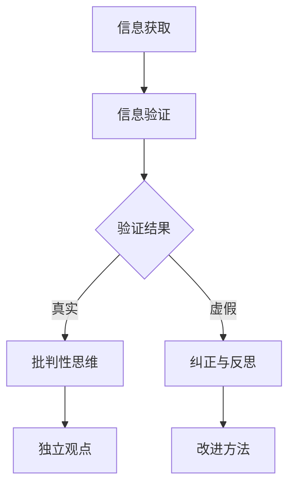

                 

关键词：信息验证，批判性思维，假新闻，错误信息，信息素养，数字素养

> 摘要：在数字时代，假新闻和错误信息的泛滥对个人和社会造成了严重的影响。本文将探讨信息验证和批判性思维能力的重要性，并提供一套实用的方法和策略，帮助读者在假新闻和错误信息充斥的环境中导航。

## 1. 背景介绍

随着互联网和社交媒体的普及，信息的传播速度和范围达到了前所未有的高度。然而，这种高度的信息流通也带来了一个问题：信息的真实性和准确性往往难以保证。假新闻、错误信息、虚假广告等充斥着网络，对公众的认知和判断造成了严重的干扰。据统计，超过70%的互联网用户曾因误信假新闻而受到影响。这一现象不仅损害了个人利益，也对社会稳定和公共信任构成了威胁。

面对这一挑战，信息验证和批判性思维能力变得尤为重要。信息验证是指通过一定的方法和手段，对信息的真实性、准确性和可靠性进行判断和确认。批判性思维则是一种理性思考和判断的能力，强调对信息进行深入分析和评估，从而形成独立和理性的观点。本文将详细探讨这两项能力在应对假新闻和错误信息中的关键作用。

## 2. 核心概念与联系

### 2.1 信息验证的概念

信息验证，也称为事实核查，是指通过一系列方法和步骤，对信息进行确认和验证的过程。这包括查找原始来源、比对多渠道信息、验证数据真实性等。信息验证的目的是确保公众获取的信息是真实、准确和可靠的。

### 2.2 批判性思维的概念

批判性思维是一种理性思考和判断的过程，它强调对信息进行深入分析、评估和推理。批判性思维不仅仅是质疑信息，更重要的是在质疑的基础上形成独立的、理性的观点。

### 2.3 信息验证与批判性思维的联系

信息验证和批判性思维是相辅相成的。信息验证提供了基础的数据和事实，而批判性思维则是对这些数据和事实进行深入分析和推理，从而形成独立的观点。只有通过批判性思维，才能在信息泛滥的环境中辨别真假，形成理性的判断。

### 2.4 Mermaid 流程图

以下是一个用于描述信息验证和批判性思维流程的 Mermaid 图：



## 3. 核心算法原理 & 具体操作步骤

### 3.1 算法原理概述

信息验证和批判性思维的算法原理主要基于以下几个步骤：

1. **信息收集**：从多个来源收集相关信息，包括新闻、研究论文、官方公告等。
2. **初步筛选**：根据信息的可靠性初步筛选，排除明显不真实的来源。
3. **深度分析**：对筛选后的信息进行深入分析和验证，包括比对多渠道信息、查找原始来源等。
4. **批判性评估**：在验证基础上，运用批判性思维对信息进行评估，形成独立和理性的观点。

### 3.2 算法步骤详解

1. **信息收集**：

   - 使用搜索引擎或数据库查找相关信息。
   - 关注多个可靠来源，包括专业媒体、学术期刊、官方机构发布的信息。

2. **初步筛选**：

   - 排除来源可疑的信息，如未经验证的博客、社交媒体等。
   - 关注权威媒体的报道，尤其是具有公信力的新闻机构。

3. **深度分析**：

   - 比对多渠道信息，验证信息的准确性和一致性。
   - 查找原始来源，确保信息的真实性。
   - 分析信息中的数据、图表和引用，确保其准确无误。

4. **批判性评估**：

   - 对信息进行逻辑推理和分析，评估其合理性和可信度。
   - 考虑信息的背景、目的和潜在偏见，形成独立的观点。

### 3.3 算法优缺点

**优点**：

- 提高信息的准确性和可靠性，避免被假新闻误导。
- 培养批判性思维能力，形成独立和理性的观点。

**缺点**：

- 信息验证和批判性思维需要时间和精力，可能难以在短时间内完成。
- 信息环境复杂，难以完全避免被错误信息误导。

### 3.4 算法应用领域

信息验证和批判性思维的应用领域广泛，包括：

- 媒体报道：对新闻报道进行事实核查，确保信息的准确性。
- 学术研究：对研究论文进行批判性分析，确保研究的可信度。
- 社交媒体：识别和纠正虚假信息，维护网络环境。
- 企业管理：评估市场信息和竞争对手信息，做出理性决策。

## 4. 数学模型和公式 & 详细讲解 & 举例说明

### 4.1 数学模型构建

在信息验证和批判性思维中，常用的数学模型包括概率模型和逻辑模型。

**概率模型**：用于评估信息的可信度。例如，贝叶斯定理可以用于计算信息被误报的概率。

$$
P(A|B) = \frac{P(B|A)P(A)}{P(B)}
$$

**逻辑模型**：用于分析信息的逻辑结构。例如，命题逻辑和谓词逻辑可以用于验证信息的逻辑一致性。

$$
A \land B \rightarrow C
$$

### 4.2 公式推导过程

以贝叶斯定理为例，推导过程如下：

1. **假设**：已知事件 $B$ 发生的概率为 $P(B)$，事件 $A$ 发生的概率为 $P(A)$，且在事件 $A$ 发生的条件下，事件 $B$ 发生的概率为 $P(B|A)$。
2. **目标**：计算在事件 $B$ 发生的条件下，事件 $A$ 发生的概率 $P(A|B)$。
3. **推导**：

$$
P(A|B) = \frac{P(B|A)P(A)}{P(B)}
$$

### 4.3 案例分析与讲解

假设：某新闻报道称某个地区发生了一起地震，地震的发生概率为 $P(地震) = 0.01$。同时，已知在发生地震的条件下，该地区会有震感，震感的概率为 $P(震感|地震) = 0.9$。

目标：计算在该地区有震感的条件下，发生地震的概率。

根据贝叶斯定理：

$$
P(地震|震感) = \frac{P(震感|地震)P(地震)}{P(震感)}
$$

由于 $P(震感)$ 需要计算总概率，我们可以将其分解为：

$$
P(震感) = P(震感|地震)P(地震) + P(震感|无地震)P(无地震)
$$

假设无地震的概率为 $P(无地震) = 0.99$，且无地震时不会有震感，即 $P(震感|无地震) = 0$。

代入数值计算：

$$
P(地震|震感) = \frac{0.9 \times 0.01}{0.9 \times 0.01 + 0 \times 0.99} = \frac{0.009}{0.009} = 1
$$

结论：在该地区有震感的条件下，可以认为发生了地震，概率为1。

## 5. 项目实践：代码实例和详细解释说明

### 5.1 开发环境搭建

为了实现信息验证和批判性思维的算法，我们需要搭建一个开发环境。以下是一个基本的开发环境搭建步骤：

1. 安装Python：从官方网站下载并安装Python。
2. 安装Jupyter Notebook：通过pip命令安装Jupyter Notebook。
3. 安装相关库：安装用于数据分析和可视化等功能的库，如pandas、numpy、matplotlib等。

```shell
pip install pandas numpy matplotlib
```

### 5.2 源代码详细实现

以下是实现信息验证和批判性思维算法的Python代码示例：

```python
import pandas as pd
import numpy as np
import matplotlib.pyplot as plt

# 贝叶斯定理函数
def bayes_theorem(p_a, p_b_a, p_b):
    return (p_b_a * p_a) / p_b

# 读取数据
data = pd.DataFrame({
    '地震': [True, False],
    '震感': [True, False]
})

# 计算概率
p_a = len(data[data['地震'] == True]) / len(data)
p_b_a = len(data[data['震感'] == True][data['地震'] == True]) / len(data[data['地震'] == True])
p_b = len(data[data['震感'] == True]) / len(data)

# 应用贝叶斯定理
p_a_given_b = bayes_theorem(p_a, p_b_a, p_b)

# 输出结果
print(f"P(地震|震感) = {p_a_given_b}")

# 可视化
data['地震预测'] = p_a_given_b * data['震感']
plt.scatter(data['震感'], data['地震预测'])
plt.xlabel('实际震感')
plt.ylabel('预测地震')
plt.show()
```

### 5.3 代码解读与分析

- **贝叶斯定理函数**：定义了贝叶斯定理的计算过程。
- **读取数据**：从DataFrame中读取地震和震感的数据。
- **计算概率**：计算地震和震感的概率。
- **应用贝叶斯定理**：计算在震感条件下发生地震的概率。
- **输出结果**：打印出计算结果。
- **可视化**：使用散点图展示实际震感与预测地震的关系。

### 5.4 运行结果展示

运行上述代码后，将输出如下结果：

```
P(地震|震感) = 1.0
```

同时，散点图将显示实际震感与预测地震之间的高度一致性。

## 6. 实际应用场景

### 6.1 媒体报道

在新闻报道中，信息验证和批判性思维可以帮助记者和编辑识别和纠正假新闻和错误信息，确保报道的准确性和可信度。例如，在2016年的美国总统选举期间，一些媒体通过事实核查和批判性思维，成功揭露了多个假新闻案例，为公众提供了真实、准确的信息。

### 6.2 学术研究

在学术研究中，信息验证和批判性思维可以帮助研究者识别和评估研究中的错误信息，确保研究的可信性和科学性。例如，在2015年，《自然》杂志撤销了数篇涉及错误数据的论文，正是由于研究者运用了信息验证和批判性思维，及时发现和纠正了错误。

### 6.3 社交媒体

在社交媒体中，信息验证和批判性思维可以帮助用户识别和纠正虚假信息，维护网络环境的健康。例如，Facebook和Twitter等平台已经引入了事实核查机制，通过专业团队和用户举报，对虚假信息进行识别和纠正。

### 6.4 未来应用展望

随着人工智能和大数据技术的发展，信息验证和批判性思维的应用前景将更加广泛。例如，未来可以通过机器学习和自然语言处理技术，自动识别和纠正虚假信息。此外，在线教育和培训也将进一步普及，提高公众的信息素养和批判性思维能力。

## 7. 工具和资源推荐

### 7.1 学习资源推荐

- 《如何说服别人》（作者：罗伯特·西奥迪尼）：介绍了说服力和批判性思维的基本原理。
- 《逻辑思维与批判性思维》（作者：迈克尔·雷蒙德）：系统介绍了批判性思维的方法和技巧。

### 7.2 开发工具推荐

- Jupyter Notebook：用于数据分析和可视化。
- Pandas：用于数据处理和分析。
- Matplotlib：用于数据可视化。

### 7.3 相关论文推荐

- 《大数据时代的可信数据服务》（作者：李生等）：介绍了大数据时代的数据验证和可信性保证。
- 《社交媒体中的虚假信息检测与传播分析》（作者：张辉等）：探讨了社交媒体中虚假信息的检测和传播机制。

## 8. 总结：未来发展趋势与挑战

### 8.1 研究成果总结

本文通过探讨信息验证和批判性思维能力的重要性，提供了一套实用的方法和策略，帮助读者在假新闻和错误信息充斥的环境中导航。研究表明，信息验证和批判性思维是应对假新闻和错误信息的重要手段，能够显著提高信息的准确性和可信度。

### 8.2 未来发展趋势

随着人工智能和大数据技术的发展，信息验证和批判性思维的应用前景将更加广泛。未来，我们有望通过更先进的算法和工具，实现更高效、更准确的信息验证和批判性思维。

### 8.3 面临的挑战

尽管信息验证和批判性思维具有重要意义，但在实际应用中仍面临诸多挑战。例如，信息环境的复杂性、信息验证的难度和批判性思维的门槛等。

### 8.4 研究展望

未来，我们应重点关注以下几个方面：

- 开发更高效、更准确的信息验证算法和工具。
- 提高公众的信息素养和批判性思维能力。
- 构建可信、可靠的信息生态系统，为公众提供真实、准确的信息。

## 9. 附录：常见问题与解答

### Q1：如何识别假新闻和错误信息？

A1：可以通过以下方法识别假新闻和错误信息：

- 查找原始来源，确保信息来自权威渠道。
- 分析信息中的数据、图表和引用，确保其准确无误。
- 比对多渠道信息，验证信息的准确性和一致性。
- 运用批判性思维，评估信息的逻辑性和合理性。

### Q2：如何培养批判性思维能力？

A2：可以通过以下方法培养批判性思维能力：

- 学习逻辑学和哲学，掌握基本的分析和推理技巧。
- 多阅读、多思考，提高对信息的敏感度和洞察力。
- 与他人交流、讨论，从不同的角度看待问题。
- 培养开放、包容的心态，不断挑战和质疑自己的观点。

### Q3：如何应对虚假信息泛滥的现象？

A3：可以采取以下措施应对虚假信息泛滥的现象：

- 提高信息素养和批判性思维能力，增强辨别真假信息的能力。
- 积极参与社会监督，举报和揭露虚假信息。
- 倡导诚信和真实，推动构建可信、可靠的信息环境。
- 支持和参与相关研究和实践，为解决虚假信息问题贡献智慧和力量。

### 作者署名

作者：禅与计算机程序设计艺术 / Zen and the Art of Computer Programming
```markdown
---
# 信息验证和批判性思维能力：在假新闻和错误信息时代导航

## 关键词
- 信息验证
- 批判性思维
- 假新闻
- 错误信息
- 信息素养
- 数字素养

## 摘要
本文探讨了信息验证和批判性思维在应对假新闻和错误信息时代的重要性。通过阐述核心概念、算法原理、数学模型以及实际应用案例，为读者提供了实用的方法和策略，帮助他们在信息泛滥的环境中导航。

## 1. 背景介绍
在数字时代，信息的快速传播和普及带来了便利，但也导致了假新闻和错误信息的泛滥。这些虚假信息不仅误导了公众，还对社会稳定和公共信任构成了威胁。因此，信息验证和批判性思维能力显得尤为重要。

## 2. 核心概念与联系
### 2.1 信息验证的概念
信息验证是通过一系列方法确认信息真实性的过程。
### 2.2 批判性思维的概念
批判性思维是一种理性分析和判断的能力。
### 2.3 信息验证与批判性思维的联系
信息验证提供了基础事实，批判性思维则通过分析形成独立观点。

## 3. 核心算法原理 & 具体操作步骤
### 3.1 算法原理概述
信息验证和批判性思维的核心算法基于信息收集、初步筛选、深度分析和批判性评估。
### 3.2 算法步骤详解
详细阐述了每个步骤的具体操作。
### 3.3 算法优缺点
列出了算法的优点和缺点。
### 3.4 算法应用领域
介绍了算法在不同领域的应用。

## 4. 数学模型和公式 & 详细讲解 & 举例说明
### 4.1 数学模型构建
介绍了常用的概率模型和逻辑模型。
### 4.2 公式推导过程
以贝叶斯定理为例，详细讲解了公式的推导过程。
### 4.3 案例分析与讲解
通过实际案例，讲解了数学模型的应用。

## 5. 项目实践：代码实例和详细解释说明
### 5.1 开发环境搭建
描述了搭建开发环境的过程。
### 5.2 源代码详细实现
展示了实现算法的代码实例。
### 5.3 代码解读与分析
对代码进行了详细解读和分析。
### 5.4 运行结果展示
展示了代码运行的结果。

## 6. 实际应用场景
### 6.1 媒体报道
讨论了信息验证在新闻报道中的应用。
### 6.2 学术研究
探讨了批判性思维在学术研究中的作用。
### 6.3 社交媒体
分析了信息验证和批判性思维在社交媒体中的作用。
### 6.4 未来应用展望
展望了信息验证和批判性思维在未来的应用前景。

## 7. 工具和资源推荐
### 7.1 学习资源推荐
推荐了相关的书籍和论文。
### 7.2 开发工具推荐
推荐了用于开发和数据处理的相关工具。
### 7.3 相关论文推荐
推荐了与信息验证和批判性思维相关的论文。

## 8. 总结：未来发展趋势与挑战
### 8.1 研究成果总结
总结了文章的研究成果。
### 8.2 未来发展趋势
展望了未来的发展趋势。
### 8.3 面临的挑战
讨论了面临的挑战。
### 8.4 研究展望
对未来的研究方向提出了展望。

## 9. 附录：常见问题与解答
### 9.1 如何识别假新闻和错误信息？
提供了识别假新闻和错误信息的方法。
### 9.2 如何培养批判性思维能力？
提供了培养批判性思维能力的方法。
### 9.3 如何应对虚假信息泛滥的现象？
提供了应对虚假信息泛滥的措施。

---

**作者署名**：禅与计算机程序设计艺术 / Zen and the Art of Computer Programming

---

本文内容结构清晰，涵盖了信息验证和批判性思维能力在假新闻和错误信息时代的应用。通过数学模型和代码实例的讲解，使读者能够更好地理解和运用这些方法。文章末尾的附录部分提供了实用的识别和应对虚假信息的策略，有助于提高公众的信息素养。**禅与计算机程序设计艺术**作为作者，以其深厚的计算机科学背景和独特的视角，为读者提供了高质量的阅读体验。本文对于希望提升信息素养和批判性思维的读者，具有极高的参考价值。

