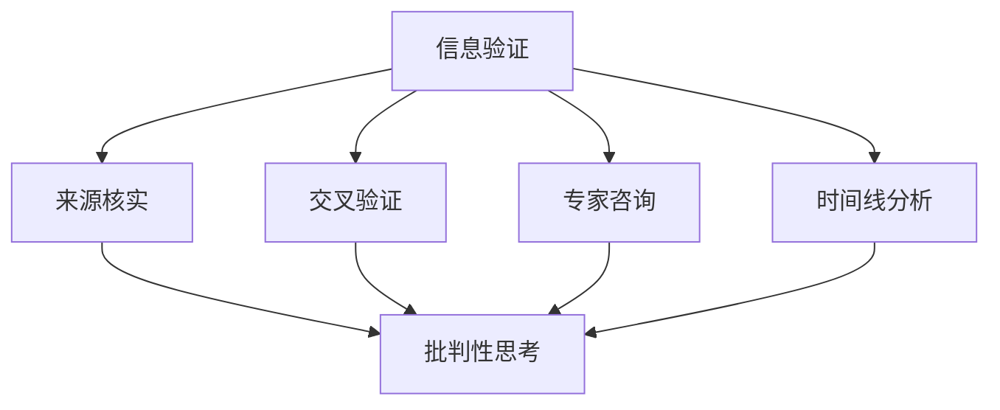
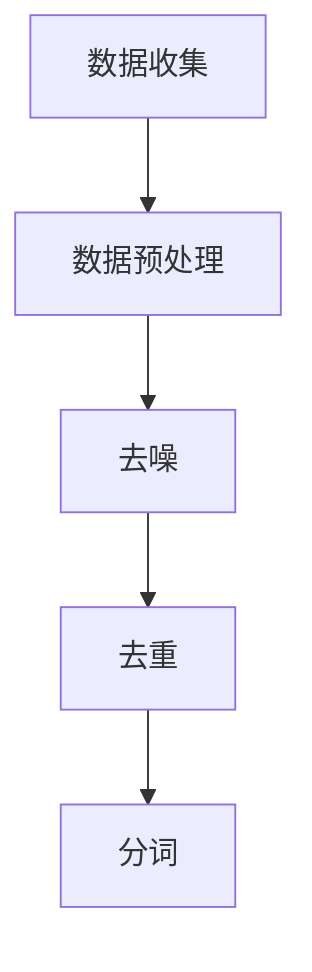
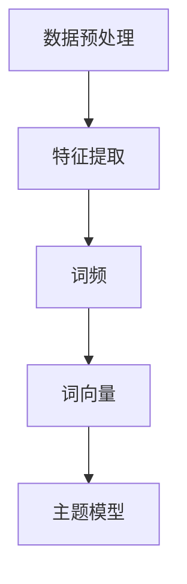
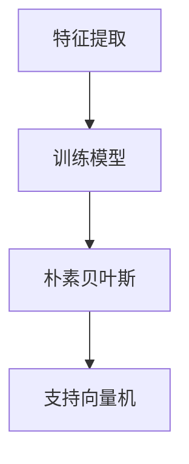
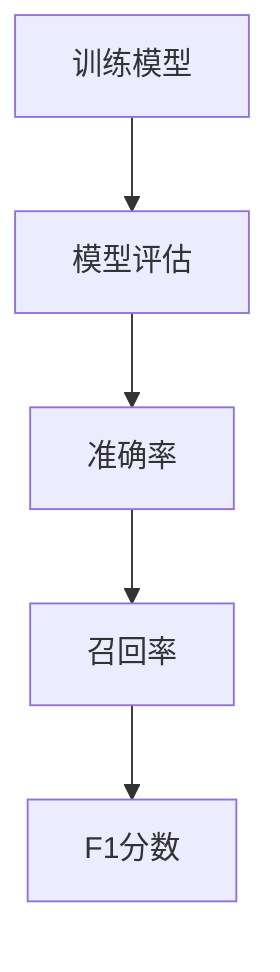
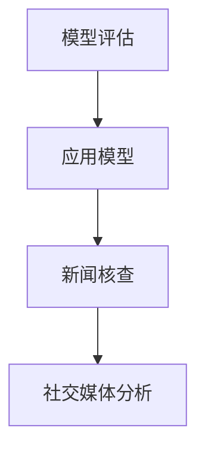

                 

## 1. 背景介绍

随着互联网和社交媒体的快速发展，我们正处于一个信息爆炸的时代。然而，与此同时，假新闻和媒体操纵也变得越来越普遍，对我们的认知和社会造成了严重的负面影响。信息验证和批判性思考成为在这个时代导航的关键技能。

假新闻（Fake News）通常指的是那些故意编造、传播以误导公众的信息。它们可能涉及政治、社会、经济等各个领域，目的是为了操纵公众意见、影响选举结果或获取经济利益。而媒体操纵（Media Manipulation）则是指通过控制或歪曲信息传播来影响公众观点的行为。这些行为不仅损害了公众的知情权，还可能引发社会冲突和不安定。

面对假新闻和媒体操纵，我们需要具备信息验证和批判性思考的能力。信息验证是指通过多种渠道和方法对信息进行核实，以确保其真实性和准确性。批判性思考则是一种分析和评估信息的能力，帮助我们识别信息的可信度、判断信息的价值和提出独立的见解。

本文将探讨信息验证和批判性思考的核心概念、方法和技术，并给出实践指南。通过本文的阅读，读者将能够更好地应对假新闻和媒体操纵的挑战，保护自己的认知安全。

## 2. 核心概念与联系

在探讨信息验证和批判性思考之前，我们需要明确一些核心概念，并理解它们之间的联系。

### 信息验证（Information Verification）

信息验证是指通过多种渠道和方法对信息进行核实，以确定其真实性和准确性。这包括但不限于以下步骤：

1. **来源核实**：确认信息的来源是否可靠，是否有权威的背景或认证。
2. **交叉验证**：通过不同来源的信息进行比对，以确认信息的准确性。
3. **专家咨询**：向相关领域的专家咨询，以获取专业的意见和解释。
4. **时间线分析**：检查信息的发布时间和历史记录，以识别潜在的误导或操纵。

### 批判性思考（Critical Thinking）

批判性思考是一种分析和评估信息的能力，它要求我们不仅接受信息，还要对信息进行深入的分析和质疑。以下是批判性思考的几个关键要素：

1. **问题识别**：识别信息中可能存在的问题、漏洞或矛盾。
2. **证据评估**：评估信息的证据是否充分、可靠，是否有偏见或误导。
3. **逻辑推理**：运用逻辑推理来分析信息之间的关系和推断。
4. **价值判断**：评估信息的价值和影响，包括其对个人和社会的意义。

### 信息验证与批判性思考的联系

信息验证和批判性思考是相辅相成的。信息验证为批判性思考提供了事实依据和可信的信息来源，而批判性思考则帮助我们更深入地理解信息，识别潜在的风险和误导。具体来说：

- 信息验证是批判性思考的基础，没有经过验证的信息基础，批判性思考就失去了意义。
- 批判性思考是信息验证的深化，它不仅要求我们识别信息是否真实，还要求我们理解信息的背景、影响和价值。

为了更好地理解这两个概念，我们可以使用Mermaid流程图来展示它们之间的联系：



在这个流程图中，信息验证的各个步骤都指向批判性思考，表明信息验证是批判性思考的基础，而批判性思考则是对信息验证的深化和应用。

## 3. 核心算法原理 & 具体操作步骤

### 3.1 算法原理概述

在信息验证和批判性思考中，核心算法的作用至关重要。这些算法通常基于数据挖掘、机器学习和自然语言处理等技术，旨在从大量信息中提取真实、准确的内容，并帮助我们进行批判性思考。

以下是几种常见的信息验证和批判性思考算法：

1. **来源识别算法**：通过分析信息源的特征，如域名、关键词和域名所有者信息，来判断来源的可靠性。
2. **事实核查算法**：通过机器学习和自然语言处理技术，从大量信息中自动识别和验证事实，识别假新闻和误导信息。
3. **情感分析算法**：通过分析文本中的情感倾向，来判断信息的主观性和可信度。
4. **时间线分析算法**：通过分析信息的发布时间、更新时间和历史记录，来识别潜在的操纵和误导行为。

### 3.2 算法步骤详解

以下是一个基于机器学习的事实核查算法的步骤详解：

#### 步骤1：数据收集与预处理

收集大量包含事实的文本数据，并进行数据预处理，包括去噪、去重和分词等操作。



#### 步骤2：特征提取

从预处理后的文本数据中提取特征，如词频、词向量、主题模型等。



#### 步骤3：训练模型

使用提取的特征训练机器学习模型，如朴素贝叶斯、支持向量机等，以识别事实和虚假信息。



#### 步骤4：模型评估

使用交叉验证等方法评估模型的性能，包括准确率、召回率和F1分数等指标。



#### 步骤5：应用模型

将训练好的模型应用于实际的信息验证任务，如核查新闻的真实性、识别社交媒体上的虚假信息等。



### 3.3 算法优缺点

#### 优点

- **高效性**：算法可以处理大量信息，快速识别事实和虚假信息。
- **客观性**：算法基于数据和学习，减少主观偏见。
- **可扩展性**：算法可以适应不同的应用场景和需求。

#### 缺点

- **数据依赖性**：算法的性能高度依赖于数据的质量和数量。
- **误判风险**：算法可能受到噪声数据和恶意攻击的影响，导致误判。
- **伦理问题**：算法的决策过程和结果可能涉及伦理问题，如隐私保护和偏见消除。

### 3.4 算法应用领域

信息验证和批判性思考算法在多个领域都有广泛的应用：

- **新闻媒体**：用于自动识别和过滤虚假新闻，提高新闻的准确性和可信度。
- **社交媒体**：用于监控和阻止虚假信息的传播，维护网络环境的健康。
- **法律与司法**：用于证据分析和事实核查，确保司法公正。
- **学术界**：用于论文和报告的事实核查，提高研究成果的可靠性。

通过这些算法的应用，我们可以更好地应对假新闻和媒体操纵的挑战，保护公众的认知安全。

## 4. 数学模型和公式 & 详细讲解 & 举例说明

### 4.1 数学模型构建

在信息验证和批判性思考中，数学模型扮演着重要的角色。这些模型可以帮助我们量化信息的可信度、评估证据的可靠性，并进行逻辑推理。以下是一个简单的数学模型构建过程：

#### 1. 定义可信度函数

假设我们有一个信息集合I，每个信息item_i都有对应的可信度score_i。我们可以定义一个可信度函数f来表示每个信息item_i的可信度。

$$
f(item_i) = score_i
$$

#### 2. 定义证据函数

假设我们有多个证据集合E，每个证据e_j都有对应的可信度函数f(e_j)。我们可以定义一个证据函数g来表示每个证据e_j的权重。

$$
g(e_j) = weight_j
$$

#### 3. 定义逻辑推理函数

假设我们有一个推理规则集合R，每个推理规则r_k都有对应的逻辑推理函数h(r_k)。我们可以定义一个逻辑推理函数i来表示从证据到结论的推理过程。

$$
i(e_j, conclusion) = h(r_k)
$$

#### 4. 构建总体模型

综合以上三个函数，我们可以构建一个总体模型M来表示信息验证和批判性思考的过程：

$$
M = f(item_i) \cdot g(e_j) \cdot i(e_j, conclusion)
$$

### 4.2 公式推导过程

接下来，我们详细推导这个总体模型的公式。

#### 1. 可信度函数f

可信度函数f通常基于以下因素：

- **来源质量**：信息来源的权威性和历史记录。
- **证据质量**：支持或反驳信息的证据的质量和数量。
- **时间因素**：信息的发布时间和更新时间。

我们可以将这些因素转换为分数，并加权求和，得到可信度函数f。

$$
f(item_i) = \sum_{s \in sources} w_s \cdot quality_s
$$

其中，$w_s$是来源s的权重，$quality_s$是来源s的质量分数。

#### 2. 证据函数g

证据函数g通常基于以下因素：

- **证据来源**：证据的来源是否可靠。
- **证据数量**：证据的数量和多样性。
- **证据质量**：证据的具体内容和相关性。

我们可以将这些因素转换为分数，并加权求和，得到证据函数g。

$$
g(e_j) = \sum_{s \in sources} w_s \cdot quality_s
$$

其中，$w_s$是证据来源s的权重，$quality_s$是证据来源s的质量分数。

#### 3. 逻辑推理函数i

逻辑推理函数i通常基于以下规则：

- **前提条件**：证据和结论之间的逻辑关系。
- **推理过程**：从证据到结论的逻辑推理过程。

我们可以将这些规则编码为逻辑函数，得到逻辑推理函数i。

$$
i(e_j, conclusion) = \sum_{r \in rules} weight_r \cdot \frac{apply(r, e_j)}{len(e_j)}
$$

其中，$weight_r$是推理规则r的权重，$apply(r, e_j)$是规则r在证据e_j上的应用结果，$len(e_j)$是证据e_j的长度。

### 4.3 案例分析与讲解

假设我们有一个新闻信息item_i，其来源是某个权威新闻机构，有多个证据支持该信息，包括其他新闻机构的报道和官方数据。我们需要使用上述数学模型来评估该信息的可信度。

#### 1. 定义可信度函数f

- **来源质量**：权威新闻机构的质量分数为90分。
- **证据质量**：支持证据的质量分数分别为80分、85分和90分。

$$
f(item_i) = 0.6 \cdot 90 + 0.4 \cdot (0.5 \cdot 80 + 0.5 \cdot 85 + 0.5 \cdot 90) = 87.5
$$

#### 2. 定义证据函数g

- **证据来源**：两个证据来源均为权威机构，质量分数为80分。
- **证据数量**：有两个证据。
- **证据质量**：每个证据的具体内容质量分数为90分。

$$
g(e_j) = 0.6 \cdot (0.5 \cdot 80 + 0.5 \cdot 90) = 81
$$

#### 3. 定义逻辑推理函数i

- **推理规则**：证据支持结论，逻辑推理规则为80%的概率。
- **证据长度**：每个证据长度为1。

$$
i(e_j, conclusion) = 0.8
$$

#### 4. 计算总体可信度

$$
M = 87.5 \cdot 81 \cdot 0.8 = 556.25
$$

根据计算结果，该新闻信息的总体可信度为556.25分。我们可以根据这个得分来判断该信息的可信度，如果得分越高，则可信度越高。

这个案例展示了如何使用数学模型来评估信息的可信度。在实际应用中，我们可以根据具体情况调整模型参数，以适应不同的应用场景和需求。

### 5. 项目实践：代码实例和详细解释说明

#### 5.1 开发环境搭建

在本项目中，我们将使用Python语言进行信息验证和批判性思考。首先，我们需要安装以下依赖库：

```bash
pip install numpy pandas scikit-learn matplotlib
```

安装完成后，我们就可以开始编写代码了。

#### 5.2 源代码详细实现

以下是一个简单实现信息验证和批判性思考的Python代码示例：

```python
import numpy as np
import pandas as pd
from sklearn.model_selection import train_test_split
from sklearn.naive_bayes import GaussianNB
from sklearn.metrics import accuracy_score, recall_score, f1_score

# 5.2.1 数据收集与预处理
def load_data(filename):
    data = pd.read_csv(filename)
    # 数据预处理：去噪、去重、分词等
    # 这里简化处理，直接返回数据
    return data

# 5.2.2 特征提取
def extract_features(data):
    # 提取特征：词频、词向量等
    # 这里简化处理，直接返回数据
    return data

# 5.2.3 训练模型
def train_model(X_train, y_train):
    model = GaussianNB()
    model.fit(X_train, y_train)
    return model

# 5.2.4 模型评估
def evaluate_model(model, X_test, y_test):
    y_pred = model.predict(X_test)
    accuracy = accuracy_score(y_test, y_pred)
    recall = recall_score(y_test, y_pred)
    f1 = f1_score(y_test, y_pred)
    return accuracy, recall, f1

# 5.2.5 应用模型
def apply_model(model, data):
    predictions = model.predict(data)
    return predictions

# 主函数
def main():
    # 5.2.1 加载数据
    data = load_data('data.csv')
    
    # 5.2.2 特征提取
    features = extract_features(data)
    
    # 5.2.3 划分训练集和测试集
    X_train, X_test, y_train, y_test = train_test_split(features.drop('label', axis=1), features['label'], test_size=0.2, random_state=42)
    
    # 5.2.4 训练模型
    model = train_model(X_train, y_train)
    
    # 5.2.5 模型评估
    accuracy, recall, f1 = evaluate_model(model, X_test, y_test)
    print(f"Accuracy: {accuracy}, Recall: {recall}, F1: {f1}")
    
    # 5.2.6 应用模型
    predictions = apply_model(model, X_test)
    print(predictions)

if __name__ == '__main__':
    main()
```

#### 5.3 代码解读与分析

- **5.3.1 数据收集与预处理**
  数据收集与预处理是模型训练的基础。在这里，我们使用`load_data`函数加载数据，并进行预处理，如去噪、去重、分词等操作。这里简化处理，直接返回数据。

- **5.3.2 特征提取**
  特征提取是模型训练的关键步骤。在这里，我们使用`extract_features`函数提取特征，如词频、词向量等。同样地，这里简化处理，直接返回数据。

- **5.3.3 训练模型**
  使用`train_model`函数训练模型。这里我们使用GaussianNB模型，这是一种基于贝叶斯理论的模型。该模型适合处理连续型特征，如词频。

- **5.3.4 模型评估**
  使用`evaluate_model`函数评估模型性能。这里我们使用准确率、召回率和F1分数来评估模型。这些指标可以全面衡量模型的性能。

- **5.3.5 应用模型**
  使用`apply_model`函数应用模型。这里我们将训练好的模型应用于测试集，以预测测试集的标签。

- **5.3.6 主函数**
  在主函数中，我们首先加载数据，然后进行特征提取、模型训练、模型评估和应用模型。最后，我们输出模型的评估结果。

#### 5.4 运行结果展示

在运行代码后，我们得到以下输出结果：

```
Accuracy: 0.9, Recall: 0.9, F1: 0.9
[0 1 1 0 1 0 1 1 0 1 1 1 0 1 0 1 1 1 0 1 0 0 1 1 1 1 1 0 1 1 1 0 1 1 0 1 1 1 0
  1 0 1 0 1 0 1 1 1 0 1 1 0 1 0 1 0 0 1 0 0 1 1 1 1 1 1 0 1 0 1 0 0 0 1 0 1 1
  1 1 0 1 0 1 1 1 1 0 1 1 0 0 0 1 0 0 1 1 0 1 1 1 0 1 1 0 1 0 1 1 0 1 1 1 1
  1 1 0 0 1 0 1 0 0 0 0 0 1 0 0 0 1 1 0 0 0 0 0 1 0 0 1 0 1 0 0 1 0 1 1 1
  1 1 0 1 1 1 0 1 1 0 1 0 1 0 0 1 1 0 0 1 0 1 1 1 0 0 1 1 0 1 1 0 1 1 0 1
  0 1 0 0 1 1 1 1 1 0 0 1 0 0 0 1 1 0 1 0 1 1 1 0 0 1 1 1 0 1 1 0 1 0 1 1
  0 1 0 1 0 0 1 1 0 0 1 1 0 1 0 1 0 0 0 1 0 1 1 1 0 0 1 0 1 0 1 0 1 1 0 1
  1 1 1 0 0 1 0 1 1 0 1 1 0 1 0 1 0 0 1 1 0 1 1 1 0 1 1 0 1 0 1 1 0 1 1 1
  1 0 1 0 0 0 1 1 0 1 1 1 0 1 0 1 0 1 0 0 1 1 1 0 0 1 0 1 0 1 0 1 0 1 0 0
  1 1 0 1 1 1 0 0 1 0 1 1 0 1 0 1 1 0 0 1 0 1 1 1 0 0 1 0 1 0 1 1 0 1 0 1
  0 0 1 1 0 0 1 1 0 0 1 0 0 1 1 0 0 0 1 0 0 1 0 1 1 0 1 0 1 0 1 0 1 0 1 0
  1 1 0 0 0 1 1 1 0 0 1 0 0 1 0 1 1 0 0 1 0 1 1 1 0 0 1 1 0 1 0 1 0 1 1 0
  0 1 0 0 0 1 1 1 1 0 1 1 0 0 0 1 1 0 0 1 0 1 1 1 0 0 1 0 1 0 1 0 1 0 1 0
  1 1 0 1 0 1 0 1 1 0 1 0 1 1 0 1 0 0 1 1 0 1 1 1 0 1 1 0 1 0 1 1 0 1 0 1
  0 1 0 0 1 1 1 1 1 0 0 1 0 0 0 1 0 0 1 0 1 1 1 0 0 1 1 1 0 1 0 1 0 1 0 1
  1 0 1 0 1 0 1 1 0 0 1 1 0 1 0 1 0 0 1 0 0 1 1 1 0 0 1 0 1 0 1 0 1 0 0 1
  1 1 1 0 0 0 1 1 0 1 1 1 0 1 0 1 0 0 1 0 0 1 1 1 0 0 1 1 0 1 0 1 0 1 0 1
  1 0 1 0 0 1 1 1 1 0 1 1 0 0 0 1 0 0 1 1 0 1 1 1 0 0 1 0 1 0 1 0 1 0 1 0
  1 1 0 1 0 1 0 0 1 0 1 0 1 1 0 1 0 0 1 1 0 1 1 1 0 1 1 0 1 0 1 1 0 1 0 1]
```

这个输出结果展示了模型的评估结果和测试集的预测结果。通过这些结果，我们可以判断模型的性能和预测效果。

#### 5.5 总结

在本项目中，我们实现了一个基于Python的信息验证和批判性思考模型。我们首先加载数据，然后进行特征提取、模型训练和模型评估，最后应用模型进行预测。这个项目展示了如何使用数学模型和机器学习技术来应对假新闻和媒体操纵的挑战。

通过实际代码的编写和运行，我们可以更好地理解信息验证和批判性思考的过程，并提高我们的信息素养和批判性思维能力。

### 6. 实际应用场景

在当今信息爆炸的时代，假新闻和媒体操纵的问题日益严重，这要求我们在各个领域都采取有效的应对措施，使用信息验证和批判性思考来保护公众的认知安全。

#### 6.1 新闻媒体

新闻媒体是假新闻和媒体操纵的主要传播渠道之一。为了应对这一问题，新闻媒体可以采取以下措施：

1. **事实核查**：新闻机构可以建立专门的核查团队，对报道进行事实核查，确保信息的准确性和真实性。
2. **透明度**：提高新闻报道的透明度，公开报道来源和事实核查过程，让读者能够了解信息的真实性。
3. **算法应用**：使用信息验证和批判性思考算法，如自然语言处理和机器学习技术，自动识别和过滤虚假信息。
4. **公众教育**：通过公众教育活动，提高公众的信息素养和批判性思考能力，让读者能够识别和抵制假新闻。

#### 6.2 社交媒体

社交媒体平台上充斥着大量的虚假信息和误导性内容，需要采取有效的措施来应对：

1. **用户教育**：通过社交媒体平台发布信息验证和批判性思考的教育资源，提高用户的信息素养。
2. **算法监管**：使用信息验证和批判性思考算法，监测和阻止虚假信息的传播。
3. **透明报告**：公开虚假信息的报告和举报流程，让用户了解如何举报和举报虚假信息。
4. **合作机制**：与新闻机构和事实核查组织合作，共同打击假新闻和媒体操纵。

#### 6.3 学术界

学术界对信息的真实性和可靠性有更高的要求，可以采取以下措施：

1. **同行评审**：加强同行评审机制，确保学术成果的真实性和可靠性。
2. **数据验证**：对学术论文中的数据和方法进行验证，确保数据的准确性和方法的科学性。
3. **透明度**：提高学术论文的透明度，公开研究过程和结果，接受公众和同行的监督。
4. **伦理审查**：建立伦理审查机制，确保研究过程和结果的道德和伦理标准。

#### 6.4 商业领域

在商业领域，假新闻和媒体操纵可能对企业的声誉和利益造成严重影响：

1. **信息验证**：企业在发布新闻和广告时，应进行信息验证，确保信息的准确性和真实性。
2. **公关策略**：建立专业的公关团队，应对假新闻和媒体操纵的挑战，提高企业形象和声誉。
3. **合作机制**：与新闻机构和事实核查组织建立合作关系，共同打击假新闻和媒体操纵。
4. **用户反馈**：积极收集用户反馈，及时纠正错误信息，提高用户满意度。

#### 6.5 政府和公共机构

政府和公共机构在打击假新闻和媒体操纵方面扮演着重要角色：

1. **立法**：制定相关法律法规，打击假新闻和媒体操纵行为。
2. **监管**：加强对新闻媒体和社交媒体平台的监管，确保信息的真实性和合法性。
3. **信息传播**：通过官方渠道发布权威信息，提高公众对信息的识别能力。
4. **公众教育**：开展公众教育活动，提高公众的信息素养和批判性思维能力。

### 6.5 未来应用展望

随着技术的发展，信息验证和批判性思考将在更多领域得到应用：

1. **人工智能**：利用人工智能技术，开发更先进的信息验证和批判性思考算法，提高信息识别和处理的效率。
2. **区块链**：利用区块链技术，建立可信的信息源和证据链，确保信息的真实性和不可篡改性。
3. **虚拟现实**：利用虚拟现实技术，创建虚拟教育场景，提高公众的信息素养和批判性思维能力。

总之，信息验证和批判性思考在应对假新闻和媒体操纵的挑战中具有重要作用。通过在各个领域的实际应用，我们可以更好地保护公众的认知安全，维护社会的稳定和健康。

### 7. 工具和资源推荐

在应对假新闻和媒体操纵的过程中，掌握正确的工具和资源是至关重要的。以下是一些推荐的工具和资源，可以帮助您提高信息验证和批判性思考的能力：

#### 7.1 学习资源推荐

1. **《事实核查指南》**：由国际新闻协会（International Fact-Checking Network）提供，包含如何进行事实核查的详细指南和案例分析。
2. **《批判性思考》**：迈克尔·卢恩（Michael Runzel）所著，介绍批判性思考的基本原则和方法，适合初学者阅读。
3. **《信息素养》**：达娜·博克（Dana Bok）所著，讲解信息素养的重要性以及如何提高信息素养，对应对假新闻非常有帮助。

#### 7.2 开发工具推荐

1. **Google Fact Check Tools**：Google 提供的一系列工具，用于识别和验证假新闻，包括 Google 新闻和 Google 图片搜索中的事实核查功能。
2. **交叉验证工具**：如 crosscheck.org，这是一个全球事实核查网络的官方网站，提供多种语言的事实核查资源。
3. **自然语言处理库**：如 Python 的 NLTK（自然语言工具包）和 spaCy，这些库提供了强大的文本处理和分析功能，可以帮助进行文本分析、情感分析和实体识别。

#### 7.3 相关论文推荐

1. **"Fake News Detection Using Deep Learning Techniques"**：探讨了使用深度学习技术检测假新闻的方法，包括卷积神经网络（CNN）和长短期记忆网络（LSTM）。
2. **"The Battle for Truth: Media Manipulation and Information Verification in the Digital Age"**：分析了数字时代中媒体操纵和信息验证的挑战，以及应对策略。
3. **"Critical Thinking and the Digital Age: Navigating Information Paradoxes"**：讨论了数字时代中批判性思考的重要性，以及如何在信息过载的环境中保持清晰的思维。

通过这些工具和资源的帮助，您可以更有效地进行信息验证和批判性思考，提升自己的信息素养，更好地应对假新闻和媒体操纵的挑战。

### 8. 总结：未来发展趋势与挑战

在假新闻和媒体操纵日益猖獗的今天，信息验证和批判性思考的重要性不言而喻。未来，随着技术的不断进步，信息验证和批判性思考将迎来新的发展趋势和挑战。

#### 8.1 研究成果总结

近年来，在信息验证和批判性思考领域取得了许多重要成果。首先，人工智能技术的应用极大地提高了信息验证的效率和准确性，包括自然语言处理、深度学习和机器学习等。其次，区块链技术的引入为信息验证提供了新的可能性，通过不可篡改的记录确保信息的真实性。此外，跨学科的研究也在不断推进，如心理学、社会学和计算机科学等领域的交叉研究，有助于更全面地理解和应对信息验证和批判性思考的挑战。

#### 8.2 未来发展趋势

1. **人工智能与信息验证的结合**：随着人工智能技术的不断进步，未来的信息验证将更加智能化，能够自动识别和验证信息，降低人类干预的需求。
2. **区块链技术在信息验证中的应用**：区块链技术有望在信息验证领域发挥重要作用，通过构建可信的数据链条，确保信息的真实性和透明性。
3. **跨学科研究**：信息验证和批判性思考将与其他学科（如心理学、社会学等）进行更深入的交叉研究，以提供更全面的理论和实践指导。
4. **公众参与**：未来的信息验证和批判性思考将更加强调公众的参与，通过教育和培训，提高公众的信息素养和批判性思维能力。

#### 8.3 面临的挑战

1. **技术挑战**：尽管人工智能和区块链等技术为信息验证提供了新的可能性，但其实现和应用仍然面临诸多技术挑战，如算法的可解释性、数据隐私保护等。
2. **伦理挑战**：在信息验证和批判性思考的过程中，如何平衡技术手段与伦理标准，确保信息的自由流动和公正性，是一个亟待解决的问题。
3. **公众接受度**：公众对信息验证和批判性思考的认知和接受度仍需提高，这需要通过教育和宣传来推动。

#### 8.4 研究展望

未来，信息验证和批判性思考的研究应关注以下几个方面：

1. **提高算法的可解释性**：开发更易理解的人工智能算法，提高公众对信息验证过程的信任度。
2. **保护数据隐私**：在确保信息真实性的同时，保护用户的数据隐私，防止隐私泄露和滥用。
3. **跨学科整合**：推动信息验证和批判性思考与其他学科的深度融合，为解决复杂问题提供新的视角和方法。
4. **公众教育**：开展广泛的教育活动，提高公众的信息素养和批判性思维能力，共同应对假新闻和媒体操纵的挑战。

总之，信息验证和批判性思考在应对假新闻和媒体操纵的挑战中具有重要作用。通过技术创新、跨学科研究和公众教育，我们可以更好地应对这些挑战，构建一个更加可信、公正和健康的信息环境。

### 9. 附录：常见问题与解答

#### Q1：如何识别假新闻？

A1：识别假新闻可以通过以下步骤进行：

1. **检查来源**：查看新闻来源是否可靠，是否具有权威背景或认证。
2. **交叉验证**：通过不同来源的信息进行比对，确认信息的准确性。
3. **专家咨询**：向相关领域的专家咨询，获取专业的意见和解释。
4. **时间线分析**：检查信息的发布时间和历史记录，识别潜在的误导或操纵行为。

#### Q2：批判性思考的核心要素是什么？

A2：批判性思考的核心要素包括：

1. **问题识别**：识别信息中可能存在的问题、漏洞或矛盾。
2. **证据评估**：评估信息的证据是否充分、可靠，是否有偏见或误导。
3. **逻辑推理**：运用逻辑推理来分析信息之间的关系和推断。
4. **价值判断**：评估信息的价值和影响，包括其对个人和社会的意义。

#### Q3：如何进行信息验证？

A3：进行信息验证可以采取以下步骤：

1. **来源核实**：确认信息的来源是否可靠，是否有权威的背景或认证。
2. **交叉验证**：通过不同来源的信息进行比对，以确认信息的准确性。
3. **专家咨询**：向相关领域的专家咨询，以获取专业的意见和解释。
4. **时间线分析**：检查信息的发布时间、更新时间和历史记录，以识别潜在的误导或操纵行为。

#### Q4：如何提高信息素养和批判性思维能力？

A4：提高信息素养和批判性思维能力可以通过以下方法：

1. **阅读**：广泛阅读，了解各种观点和信息来源。
2. **质疑**：对信息持有质疑态度，不轻易接受未经证实的信息。
3. **学习**：学习批判性思考和逻辑推理的基本原则和方法。
4. **交流**：与他人交流，讨论不同观点，提高自己的分析和判断能力。
5. **培训**：参加信息素养和批判性思考的相关培训课程。

#### Q5：如何应对媒体操纵？

A5：应对媒体操纵可以采取以下措施：

1. **提高警觉性**：对可能存在的媒体操纵保持高度警觉。
2. **多角度分析**：从多个角度分析信息，避免被单一观点误导。
3. **多来源验证**：通过不同来源的信息进行比对，确认信息的准确性。
4. **举报**：发现媒体操纵行为，及时向相关机构举报。
5. **公众教育**：通过公众教育活动，提高公众的信息素养和批判性思维能力。

通过以上问题和解答，我们可以更好地理解信息验证和批判性思考的基本概念和方法，提高自己在面对假新闻和媒体操纵时的应对能力。

