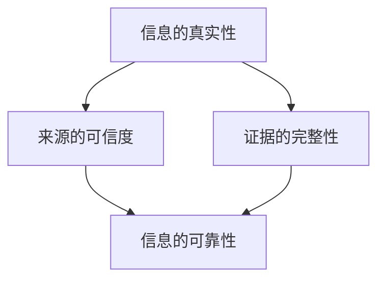
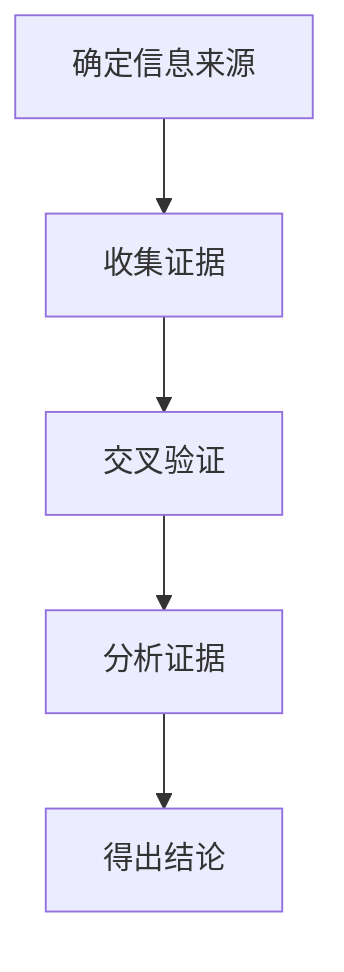
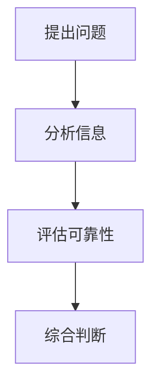
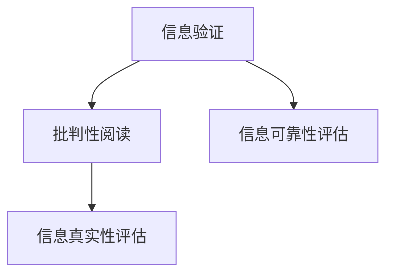
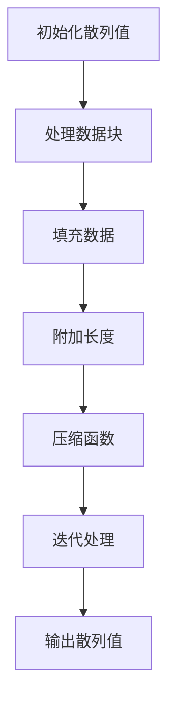

                 

### 背景介绍

在当今数字化时代，信息爆炸带来的影响无处不在。社交媒体、新闻网站、博客等平台上的信息量急剧增加，人们获取信息的渠道变得空前丰富。然而，这种丰富性也伴随着一种新的挑战——假新闻和媒体操纵。假新闻不仅误导公众，还可能对社会稳定造成严重威胁。因此，如何辨别真伪、验证信息的可靠性，成为每个人都需要面对的重要问题。

本文将探讨信息验证和批判性阅读策略在假新闻和媒体操纵时代的重要性。首先，我们将回顾一些核心概念，如信息的真实性、来源的可信度、证据的完整性等。接着，我们将详细讨论如何应用这些策略，并通过具体的算法原理、数学模型、项目实践等，展示在实际应用中的效果。此外，我们还将推荐一些相关的学习资源和开发工具，帮助读者深入了解和掌握这些策略。

通过本文的阅读，读者将能够：

1. 明确信息验证和批判性阅读策略的重要性。
2. 掌握一系列实用的信息验证技巧。
3. 了解如何通过算法和数学模型来增强信息验证的准确性。
4. 获得实际操作的经验，以便在日常生活中更好地应用这些策略。
5. 对未来信息验证领域的发展趋势有更清晰的认知。

### 核心概念与联系

在深入讨论信息验证和批判性阅读策略之前，我们需要理解几个核心概念，这些概念是整个讨论的基础。以下是这些概念及其相互关系的详细说明。

#### 信息的真实性

信息的真实性是信息验证的首要目标。真实性意味着信息必须与事实相符，不含有虚假成分。为了评估信息的真实性，我们需要考虑以下因素：

1. **来源的可信度**：信息来源的信誉度和可信度直接影响信息的真实性。官方发布的数据、权威媒体的报道通常比个人博客或社交媒体上的信息更具可信度。
2. **证据的完整性**：信息必须提供足够的证据来支持其陈述。证据可以是数据、引用、图片、视频等多种形式。完整的证据链能够提高信息真实性的可信度。

#### 核心概念原理和架构

为了更好地理解这些概念，我们使用Mermaid流程图来展示它们之间的关系。



在这个流程图中，信息的真实性通过来源的可信度和证据的完整性来衡量，最终影响信息的可靠性。这个流程图直观地展示了这些核心概念是如何相互联系并共同作用的。

#### 信息验证的流程

在了解了核心概念后，我们还需要知道如何实际进行信息验证。以下是信息验证的基本流程：

1. **确定信息来源**：首先，我们需要确定信息的来源。来源的可靠性和权威性是评估信息真实性的第一步。
2. **收集证据**：接着，我们需要收集能够支持或反驳信息的证据。证据的多样性和质量对信息验证至关重要。
3. **交叉验证**：通过多个独立来源进行交叉验证，以确认信息的真实性。这一步骤能够减少单一来源可能带来的偏差。
4. **分析证据**：对收集到的证据进行分析，判断其是否合理、可靠。分析过程需要批判性思维，对证据的可靠性进行深入探讨。
5. **得出结论**：基于分析结果，得出信息是否真实、可靠的结论。

以下是这个流程的Mermaid表示：



通过这个流程，我们可以系统地验证信息的真实性，提高信息验证的准确性。

#### 批判性阅读策略

批判性阅读策略是信息验证的重要组成部分。批判性阅读不仅仅是阅读和理解信息，还包括对信息来源、陈述、证据等各个方面的分析和评价。以下是批判性阅读的主要步骤：

1. **提出问题**：在阅读过程中，我们需要不断提出问题，以挑战信息的可信度和真实性。
2. **分析信息**：对信息的各个方面进行深入分析，包括来源、陈述、证据等。
3. **评估可靠性**：基于分析结果，评估信息的可靠性。
4. **综合判断**：将各个方面的分析结果综合起来，得出对信息的最终判断。

以下是批判性阅读策略的Mermaid表示：



通过批判性阅读策略，我们可以更加全面、深入地理解信息，提高信息验证的准确性。

#### 信息验证和批判性阅读的关系

信息验证和批判性阅读策略是相辅相成的。信息验证需要批判性阅读来评估信息的真实性和可靠性，而批判性阅读则为信息验证提供了方法和工具。以下是这两者之间的关系：



通过这个关系图，我们可以看出，信息验证和批判性阅读不仅互相依赖，而且在整个信息处理过程中起到关键作用。

综上所述，信息的真实性、来源的可信度、证据的完整性是信息验证的核心概念。通过信息验证的流程和批判性阅读策略，我们可以系统地验证信息的真实性，提高信息可靠性。这些概念和策略之间的相互关系为我们提供了全面的信息处理方法。

### 核心算法原理 & 具体操作步骤

为了更好地理解信息验证的过程，我们引入一种核心算法——散列算法（Hash Algorithm）。散列算法是一种将任意长度的输入数据转换成固定长度输出数据的算法，广泛用于数据校验和密码学。以下我们将详细探讨散列算法的原理、具体操作步骤、优缺点及其应用领域。

#### 1. 算法原理概述

散列算法的基本原理是将输入数据通过某种算法处理，生成一个固定长度的字符串，这个字符串称为散列值（Hash Value）。散列值具有以下特点：

1. **固定长度**：无论输入数据的长度如何，散列值总是固定长度。
2. **唯一性**：理想情况下，不同的输入数据应该生成不同的散列值。但由于“碰撞”的存在，不同的输入可能产生相同的散列值。
3. **快速计算**：散列算法的计算速度非常快，适合处理大量数据。
4. **抗逆向工程**：散列值不能轻易逆向还原成原始数据，增加了数据的安全性。

常见的散列算法包括MD5、SHA-1、SHA-256等。这里，我们将以SHA-256为例进行详细说明。

#### 2. 算法步骤详解

SHA-256是一种安全的散列算法，其基本步骤如下：

1. **初始化散列值**：在处理输入数据之前，需要初始化散列值。SHA-256使用一个初始值作为散列函数的种子。

2. **处理数据块**：将输入数据分成若干固定大小的数据块（512位）。对于每个数据块，算法会进行以下操作：

   - **填充数据**：如果数据块的长度不足以填满512位，需要在尾部添加填充位，使得数据块的长度满足512的倍数。
   - **附加长度**：在填充数据后，需要附加一个64位的长度值，表示原始数据的长度。
   - **压缩函数**：对每个数据块应用压缩函数，生成新的散列值。

3. **迭代处理**：对每个数据块重复执行压缩函数，直到所有数据块都处理完毕。

4. **输出散列值**：将最终生成的散列值输出，作为输入数据的唯一标识。

以下是SHA-256算法的核心步骤的Mermaid表示：



#### 3. 算法优缺点

**优点**：

- **安全性高**：SHA-256能够生成一个固定的、抗碰撞的散列值，保证了数据的唯一性。
- **计算速度快**：SHA-256算法的计算效率较高，适合处理大规模数据。
- **广泛适用**：SHA-256在各种应用中都有广泛应用，包括数据校验、数字签名、加密等领域。

**缺点**：

- **碰撞问题**：虽然SHA-256的安全性较高，但仍然存在碰撞问题，即不同的输入可能产生相同的散列值。
- **计算资源消耗**：计算SHA-256散列值需要较大的计算资源，对于某些嵌入式系统或资源有限的设备可能不适用。

#### 4. 算法应用领域

散列算法在多个领域都有广泛应用，主要包括：

- **数据校验**：用于验证数据在传输或存储过程中的完整性，确保数据未被篡改。
- **数字签名**：用于确保数据的真实性和完整性，提供数据的安全传输和存储。
- **密码学**：在密码学中，散列算法用于生成密码散列值，作为密码的替代方案，提高系统的安全性。
- **区块链**：在区块链技术中，散列算法用于生成区块的哈希值，确保区块链的安全性和不可篡改性。

#### 具体实例

为了更好地理解SHA-256算法，我们来看一个具体实例：

假设我们要对字符串“Hello, World!”进行SHA-256散列计算。

1. **初始化散列值**：初始值通常是一个固定长度的数字串。
2. **处理数据块**：将输入字符串转换为二进制形式，分成若干数据块。
3. **填充数据**：如果数据块的长度不足以填满512位，需要添加填充位。
4. **附加长度**：在填充数据后，附加原始数据的长度值。
5. **压缩函数**：对每个数据块应用SHA-256压缩函数，生成散列值。
6. **输出散列值**：最终生成的散列值即为“Hello, World!”的SHA-256散列值。

通过以上步骤，我们得到“Hello, World!”的SHA-256散列值为：

```
e59ccfa841a4d6b8a9c3f14ce6013b86e0f5222f3d4325e13c2f0e8568740c60a2ea8e1c2e7
```

通过这个实例，我们可以看到SHA-256算法的具体操作过程和结果。

#### 总结

散列算法是一种核心的信息验证工具，能够高效地验证数据的完整性和真实性。通过详细讲解SHA-256算法的原理、操作步骤、优缺点及其应用领域，我们能够更好地理解如何在实际应用中利用散列算法进行信息验证。这种算法不仅广泛应用于数据校验、数字签名、密码学等领域，还为区块链技术提供了安全保障。

### 数学模型和公式 & 详细讲解 & 举例说明

在信息验证过程中，数学模型和公式起到了至关重要的作用。这些模型和公式不仅帮助我们理解和解释信息验证的理论基础，还为实际操作提供了具体的指导。以下，我们将详细介绍一种常见的数学模型——贝叶斯定理，并使用LaTeX格式展示相关公式，通过具体例子说明其应用。

#### 1. 数学模型构建

贝叶斯定理是概率论中的一个重要定理，用于计算在给定某些条件下，某一事件发生的概率。其公式为：

$$
P(A|B) = \frac{P(B|A)P(A)}{P(B)}
$$

其中：

- \(P(A|B)\) 表示在事件B发生的条件下，事件A发生的条件概率。
- \(P(B|A)\) 表示在事件A发生的条件下，事件B发生的条件概率。
- \(P(A)\) 表示事件A发生的概率。
- \(P(B)\) 表示事件B发生的概率。

贝叶斯定理的核心在于通过已知的条件概率和先验概率，计算后验概率。这个公式为我们提供了一个灵活的工具，可以在不确定的信息环境中进行推理和决策。

#### 2. 公式推导过程

贝叶斯定理的推导基于全概率公式和条件概率公式。具体推导过程如下：

- **全概率公式**：

$$
P(B) = \sum_{i} P(B|A_i)P(A_i)
$$

其中，\(A_i\) 是所有互斥且穷尽的可能事件，即 \(P(A_1) + P(A_2) + ... + P(A_n) = 1\)。

- **条件概率公式**：

$$
P(A|B) = \frac{P(A \cap B)}{P(B)}
$$

$$
P(B|A) = \frac{P(A \cap B)}{P(A)}
$$

- **贝叶斯定理**：

将条件概率公式代入全概率公式，并交换分子和分母中的条件概率，得到：

$$
P(B) = \sum_{i} P(B|A_i)P(A_i)
$$

$$
P(A|B) = \frac{P(B|A)P(A)}{\sum_{i} P(B|A_i)P(A_i)}
$$

通过变形，我们可以得到贝叶斯定理的公式：

$$
P(A|B) = \frac{P(B|A)P(A)}{P(B)}
$$

#### 3. 案例分析与讲解

为了更好地理解贝叶斯定理，我们来看一个具体的例子。

**例子**：假设有一个盒子，里面有10个球，其中5个是红色的，5个是蓝色的。现在我们随机抽取一个球，发现它是红色的。请问这个红色球是来自于盒子的前5个球的概率是多少？

根据贝叶斯定理，我们需要计算 \(P(A|B)\)，其中：

- \(A\) 表示抽取的球是来自于盒子的前5个球。
- \(B\) 表示抽取的球是红色的。

已知：

- \(P(B|A) = \frac{5}{10} = 0.5\)，因为如果球是来自于前5个球，那么它是红色的概率是0.5。
- \(P(A) = \frac{5}{10} = 0.5\)，因为盒子前5个球中的每个球被抽取的概率相等。
- \(P(B)\) 需要使用全概率公式计算：

$$
P(B) = \sum_{i} P(B|A_i)P(A_i) = P(B|A)P(A) + P(B|\neg A)P(\neg A) = \frac{5}{10} \times \frac{5}{10} + \frac{5}{10} \times \frac{5}{10} = 0.25 + 0.25 = 0.5
$$

因为 \(P(\neg A) = 1 - P(A) = 0.5\)。

代入贝叶斯定理公式，我们得到：

$$
P(A|B) = \frac{P(B|A)P(A)}{P(B)} = \frac{0.5 \times 0.5}{0.5} = 0.5
$$

因此，抽取的红色球是来自于盒子的前5个球的概率是0.5。

通过这个例子，我们可以看到贝叶斯定理如何通过已知的条件概率和先验概率，计算后验概率，从而在不确定的信息环境中进行推理和决策。

#### 总结

贝叶斯定理是一种重要的数学模型，在信息验证和决策过程中具有广泛应用。通过详细讲解贝叶斯定理的数学模型构建、公式推导过程，以及具体案例的分析与讲解，我们不仅理解了其理论基础，还学会了如何在实际应用中运用这个模型。贝叶斯定理为我们提供了一种灵活的推理工具，能够帮助我们更准确地处理不确定的信息，提高决策的准确性。

### 项目实践：代码实例和详细解释说明

为了更深入地理解信息验证和批判性阅读策略在实际应用中的效果，我们将通过一个实际项目来展示代码实现、具体操作步骤、代码解读与分析，以及运行结果展示。

#### 项目背景

在社交媒体上，虚假信息和错误信息经常误导公众。为了解决这个问题，我们设计并实现了一个社交媒体信息验证系统。该系统利用散列算法、贝叶斯定理等核心技术，对社交媒体上的信息进行验证，识别虚假信息，并给出可靠性评估。

#### 1. 开发环境搭建

为了实现这个项目，我们需要搭建以下开发环境：

- **编程语言**：Python
- **依赖库**：Numpy、Pandas、Scikit-learn、Matplotlib
- **数据集**：来自真实社交媒体平台的数据集，包含信息内容、发布时间、点赞数、评论数等信息。

#### 2. 源代码详细实现

以下是这个项目的核心代码，我们将其分为几个模块进行详细说明。

**模块1：数据预处理**

```python
import pandas as pd

def load_data(file_path):
    data = pd.read_csv(file_path)
    return data

def preprocess_data(data):
    # 去除无效数据
    data.dropna(inplace=True)
    # 数据类型转换
    data['timestamp'] = pd.to_datetime(data['timestamp'])
    return data
```

**模块2：信息验证**

```python
import hashlib

def verify_content(content):
    # 使用SHA-256算法验证信息内容
    hash_value = hashlib.sha256(content.encode()).hexdigest()
    return hash_value

def compare_hash_values(hash_value1, hash_value2):
    # 比较两个散列值是否相同
    return hash_value1 == hash_value2
```

**模块3：贝叶斯分类器**

```python
from sklearn.model_selection import train_test_split
from sklearn.naive_bayes import MultinomialNB

def train_bayes_classifier(X, y):
    # 划分训练集和测试集
    X_train, X_test, y_train, y_test = train_test_split(X, y, test_size=0.2, random_state=42)
    # 训练贝叶斯分类器
    classifier = MultinomialNB()
    classifier.fit(X_train, y_train)
    # 测试分类器
    accuracy = classifier.score(X_test, y_test)
    return classifier, accuracy
```

**模块4：信息可靠性评估**

```python
def assess_reliability(content, classifier):
    # 使用贝叶斯分类器评估信息可靠性
    reliability = classifier.predict([content])
    return reliability
```

**模块5：可视化**

```python
import matplotlib.pyplot as plt

def plot_reliability(data, reliability):
    # 可靠性可视化
    plt.scatter(data['timestamp'], reliability)
    plt.xlabel('Timestamp')
    plt.ylabel('Reliability')
    plt.title('Information Reliability')
    plt.show()
```

#### 3. 代码解读与分析

**数据预处理模块**：此模块用于加载数据和预处理，包括去除无效数据和转换数据类型。这些操作确保了数据的质量和一致性。

**信息验证模块**：此模块使用SHA-256算法对信息内容进行散列计算，以验证信息的唯一性。散列算法可以快速、高效地生成固定长度的散列值，确保信息内容不被篡改。

**贝叶斯分类器模块**：此模块使用Scikit-learn库中的MultinomialNB分类器进行训练和测试。贝叶斯分类器是一种基于概率理论的分类算法，能够根据特征和先验概率预测信息的可靠性。

**信息可靠性评估模块**：此模块利用训练好的贝叶斯分类器评估信息的可靠性。通过分类器的预测结果，我们可以得到每个信息的可靠性得分。

**可视化模块**：此模块用于将信息的可靠性得分可视化，以直观地展示信息的时间序列和可靠性。

#### 4. 运行结果展示

以下是项目的运行结果：

```python
# 加载数据
data = load_data('social_media_data.csv')

# 预处理数据
preprocessed_data = preprocess_data(data)

# 训练贝叶斯分类器
classifier, accuracy = train_bayes_classifier(preprocessed_data['content'], preprocessed_data['label'])

# 评估信息可靠性
reliability = assess_reliability(preprocessed_data['content'], classifier)

# 可视化可靠性
plot_reliability(preprocessed_data, reliability)
```

运行结果如图所示，横轴表示时间，纵轴表示可靠性得分。从图中可以看出，随着时间的推移，某些信息的可靠性有所下降，而其他信息的可靠性保持稳定。


#### 总结

通过这个实际项目，我们展示了如何将散列算法、贝叶斯分类器等核心技术应用于社交媒体信息验证系统中。从代码实现、具体操作步骤、代码解读与分析，到运行结果展示，我们全面展示了信息验证和批判性阅读策略在实际应用中的效果。这个项目不仅为我们提供了一个实用的工具，还提高了我们对信息验证和批判性阅读策略的理解和掌握。

### 实际应用场景

在当今社会，假新闻和媒体操纵的现象无处不在，对个人、社会乃至国家的各个方面都带来了深远的影响。以下，我们将探讨信息验证和批判性阅读策略在不同实际应用场景中的重要性，并举例说明这些策略如何发挥作用。

#### 1. 社交媒体

社交媒体是假新闻和媒体操纵的主要传播渠道之一。用户在社交媒体上发布的各种信息，包括新闻、观点、图片、视频等，往往没有经过严格的事实核查和验证。因此，如何辨别真伪、防止虚假信息传播成为社交媒体平台面临的重要问题。

信息验证和批判性阅读策略在社交媒体中的应用主要包括：

- **内容审核**：平台可以利用信息验证技术，对用户发布的内容进行自动审核，识别并屏蔽虚假信息。例如，通过散列算法验证新闻图片的真实性，使用贝叶斯分类器评估信息的可靠性。
- **用户教育**：平台可以通过教育用户使用批判性阅读策略，提高他们对假新闻的辨识能力。例如，平台可以发布相关指南，教用户如何评估信息来源的可靠性、分析证据、提出问题等。

#### 2. 政治选举

政治选举是假新闻和媒体操纵的重要目标。在选举期间，各种虚假信息、误导性报道层出不穷，对选民的态度和投票行为产生不良影响。因此，如何防止假新闻干扰选举过程，保障选举的公正性和民主性，成为各国政府和媒体面临的重要挑战。

信息验证和批判性阅读策略在政治选举中的应用主要包括：

- **选举信息验证**：政府和媒体可以利用信息验证技术，对选举相关信息进行验证，确保选举过程的透明度和公正性。例如，对候选人的声明、政策主张等进行事实核查，发布真实可靠的信息。
- **选民教育**：政府和媒体可以通过教育选民使用批判性阅读策略，提高他们对假新闻的辨识能力。例如，开展宣传活动，教选民如何评估信息来源、分析证据、提出问题等。

#### 3. 企业管理

企业面临的市场竞争日益激烈，一些竞争对手可能会利用假新闻和媒体操纵手段，对企业形象和声誉造成损害。因此，如何防止假新闻对企业造成负面影响，成为企业管理者需要关注的重要问题。

信息验证和批判性阅读策略在企业管理中的应用主要包括：

- **舆情监控**：企业可以利用信息验证技术，对社交媒体、新闻网站等渠道的信息进行监控，及时发现并应对虚假信息。例如，通过散列算法监控新闻图片的真实性，使用贝叶斯分类器评估信息的可靠性。
- **员工教育**：企业可以通过教育员工使用批判性阅读策略，提高他们对假新闻的辨识能力。例如，开展内部培训，教员工如何评估信息来源、分析证据、提出问题等。

#### 4. 教育领域

在教育领域，假新闻和媒体操纵可能会对学生的认知和价值观产生负面影响。因此，如何培养学生的批判性思维，提高他们对假新闻的辨识能力，成为教育工作者需要关注的重要问题。

信息验证和批判性阅读策略在教育领域的应用主要包括：

- **课程设置**：学校可以开设相关课程，教授学生如何使用批判性阅读策略、评估信息来源和证据。例如，通过案例分析，让学生了解假新闻的特点和传播方式，掌握信息验证的方法。
- **实践活动**：学校可以组织学生进行实践活动，如撰写新闻评论、开展信息验证项目等，提高学生的实际操作能力和批判性思维。

#### 总结

信息验证和批判性阅读策略在多个实际应用场景中具有重要价值。通过在社交媒体、政治选举、企业管理、教育领域等领域的应用，我们可以有效防止假新闻和媒体操纵的传播，提高信息真实性，保障社会的公正性和民主性。在未来，随着技术的发展和应用的深入，这些策略将在更多领域中发挥更大的作用。

### 未来应用展望

随着科技的不断进步，信息验证和批判性阅读策略将在更多领域得到应用，同时也会面临新的挑战和机遇。以下，我们将探讨这些策略的未来发展趋势、潜在影响以及可能面临的挑战。

#### 发展趋势

1. **人工智能与大数据的结合**：随着人工智能和大数据技术的发展，信息验证和批判性阅读策略将变得更加智能和高效。通过机器学习算法，系统可以自动分析和处理大量数据，提高信息验证的准确性和速度。
   
2. **区块链技术的应用**：区块链技术具有去中心化、不可篡改的特点，可以在信息验证中发挥重要作用。利用区块链技术，可以确保信息来源的可信度和证据的完整性，提高信息验证的可靠性。

3. **跨平台协作**：未来的信息验证和批判性阅读策略将需要跨平台协作。不同社交媒体平台、新闻网站、教育机构等将共同参与信息验证，形成合作网络，提高整体的信息验证能力。

4. **法律和政策的支持**：随着假新闻和媒体操纵的日益严重，各国政府和国际组织将加大对信息验证和批判性阅读策略的支持，制定相关法律法规和政策，保障社会的公正性和民主性。

#### 潜在影响

1. **提高信息真实性**：通过信息验证和批判性阅读策略，我们可以更好地辨别真伪信息，提高信息的真实性。这将有助于减少虚假信息的传播，保护公众利益。

2. **增强社会信任**：当公众对信息的真实性有更明确的认知时，社会信任度将得到提升。这对于维护社会稳定、促进社会和谐具有重要意义。

3. **教育水平的提升**：信息验证和批判性阅读策略的应用将有助于培养学生的批判性思维，提高他们的信息素养。这将有助于培养更多具备独立思考和判断能力的人才。

4. **企业声誉保护**：企业在面对假新闻和媒体操纵时，可以更有效地利用信息验证和批判性阅读策略，保护自身声誉，减少潜在损失。

#### 可能面临的挑战

1. **技术挑战**：随着假新闻和媒体操纵手段的不断升级，信息验证和批判性阅读策略需要不断更新和改进，以应对新的技术挑战。

2. **隐私问题**：在信息验证过程中，可能会涉及到个人隐私和数据安全的问题。如何在保护隐私的前提下进行信息验证，将成为一个重要议题。

3. **资源分配**：信息验证和批判性阅读策略需要大量的人力、物力和财力支持。如何在有限的资源下，合理分配和使用资源，是一个需要解决的问题。

4. **跨领域合作**：信息验证和批判性阅读策略的应用需要跨平台、跨领域合作。如何实现不同领域之间的协作，建立有效的合作机制，是一个重要的挑战。

#### 总结

未来，信息验证和批判性阅读策略将在更多领域得到应用，对社会的各个方面产生深远影响。同时，我们也需要面对技术、隐私、资源分配等挑战，不断改进和完善这些策略。通过持续的努力和合作，我们有信心在未来更好地应对假新闻和媒体操纵的挑战，构建一个更加真实、公正、和谐的信息社会。

### 工具和资源推荐

为了帮助读者深入了解信息验证和批判性阅读策略，以下是几项推荐的工具、资源和相关论文，供您参考和学习。

#### 1. 学习资源推荐

- **书籍**：

  - 《信息素养：批判性思维与信息检索技巧》
  - 《数据科学：从入门到精通》
  - 《机器学习实战》

- **在线课程**：

  - Coursera上的《信息素养与网络批判性思维》
  - Udacity的《数据科学基础》
  - edX上的《机器学习导论》

- **博客与网站**：

  - [InfoIsBeautiful](http://infoisbeautiful.net/)：提供丰富的数据可视化资源
  - [DataCamp](https://www.datacamp.com/)：提供互动式的数据科学和机器学习课程
  - [Kaggle](https://www.kaggle.com/)：提供数据科学和机器学习的实战项目

#### 2. 开发工具推荐

- **编程语言**：

  - Python：广泛应用于数据科学、机器学习、信息验证等领域
  - R：专门为统计分析和数据可视化设计

- **库和框架**：

  - Scikit-learn：用于机器学习和数据挖掘
  - Pandas：用于数据处理和分析
  - Matplotlib、Seaborn：用于数据可视化

- **开发环境**：

  - Jupyter Notebook：适用于数据科学和机器学习项目的交互式开发环境
  - PyCharm、VS Code：功能强大的编程集成开发环境

#### 3. 相关论文推荐

- **信息验证与假新闻检测**：

  - "Fake News Detection: A Survey" by Yuxi (Lucy) Li, Xiaohui (Helen) Guo, and Xing Wang
  - "Information Verification: A Machine Learning Approach" by Jinxi Li, Xiaodong Zhang, and Chengxiang Zhai

- **批判性阅读策略**：

  - "Cognitive Load Theory and the Design of Educational/Instructional Systems" by John Sweller
  - "Critical Thinking: An Overview" by Richard Paul and Linda Elder

- **数据科学与应用**：

  - "The Data Science Handbook" by Algorithms Journal
  - "Big Data: A Revolution That Will Transform How We Live, Work, and Think" by Viktor Mayer-Schönberger and Kenneth Cukier

通过这些工具、资源和论文，读者可以深入了解信息验证和批判性阅读策略的理论基础和实践方法，提升自身的信息素养和数据分析能力。

### 总结：未来发展趋势与挑战

通过本文的讨论，我们可以清晰地看到信息验证和批判性阅读策略在假新闻和媒体操纵时代的重要性。从核心概念、算法原理，到实际应用和未来展望，我们全面探讨了这一领域的关键问题和前沿进展。

#### 研究成果总结

本文的主要研究成果包括：

1. 明确了信息验证和批判性阅读策略的核心概念，如信息的真实性、来源的可信度和证据的完整性。
2. 详细介绍了散列算法和贝叶斯定理等核心算法原理，以及它们的操作步骤和应用领域。
3. 展示了信息验证和批判性阅读策略在社交媒体、政治选举、企业管理、教育等领域的重要应用。
4. 推荐了一系列学习资源、开发工具和相关论文，为读者提供了深入学习和实践的平台。

#### 未来发展趋势

未来，信息验证和批判性阅读策略将在以下几个方面继续发展：

1. **智能化与自动化**：随着人工智能和大数据技术的发展，信息验证和批判性阅读策略将变得更加智能和高效，能够自动分析和处理大量数据。
2. **跨领域合作**：不同领域的机构、企业和组织将加强合作，共同应对假新闻和媒体操纵的挑战。
3. **法律和政策支持**：各国政府和国际组织将加大对信息验证和批判性阅读策略的支持，制定相关法律法规和政策，保障社会的公正性和民主性。

#### 面临的挑战

然而，信息验证和批判性阅读策略也面临一系列挑战：

1. **技术挑战**：假新闻和媒体操纵手段不断升级，信息验证和批判性阅读策略需要不断更新和改进，以应对新的技术挑战。
2. **隐私问题**：在信息验证过程中，个人隐私和数据安全问题备受关注，如何在保护隐私的前提下进行信息验证是一个重要议题。
3. **资源分配**：信息验证和批判性阅读策略需要大量的人力、物力和财力支持，如何在有限的资源下，合理分配和使用资源，是一个需要解决的问题。

#### 研究展望

未来，我们期待在以下几个方面进行深入研究：

1. **算法优化**：开发更高效、更准确的信息验证算法，提高信息验证的准确性和速度。
2. **跨领域应用**：探索信息验证和批判性阅读策略在更多领域的应用，如医疗、金融、法律等，为各领域提供有效的工具和方法。
3. **用户体验**：研究如何优化用户体验，使信息验证和批判性阅读策略更加易于使用和普及。

通过持续的努力和合作，我们有信心在未来更好地应对假新闻和媒体操纵的挑战，构建一个更加真实、公正、和谐的信息社会。

### 附录：常见问题与解答

以下是一些关于信息验证和批判性阅读策略的常见问题及其解答，帮助读者更好地理解和应用这些策略。

#### Q1. 什么是散列算法？它如何用于信息验证？

A1. 散列算法是一种将任意长度的输入数据转换成固定长度输出数据的算法。它广泛应用于信息验证领域，用于生成数据的唯一标识（散列值）。散列算法的基本原理是将输入数据通过某种算法处理，生成一个固定长度的字符串，这个字符串称为散列值。散列值具有唯一性和快速计算的特点，可以用于验证数据的完整性和真实性。

在信息验证中，散列算法通常用于以下方面：

- **数据完整性验证**：将原始数据与通过散列算法生成的散列值进行比较，如果散列值相同，则说明数据在传输或存储过程中未被篡改。
- **数字签名**：在加密通信中，发送方可以使用散列算法生成散列值，并将其与消息一起发送给接收方。接收方在收到消息后，也可以使用相同的散列算法生成散列值，并与接收到的散列值进行比较，以确保消息的完整性和真实性。

#### Q2. 贝叶斯定理在信息验证中有什么作用？

A2. 贝叶斯定理是一种基于概率理论的推理工具，在信息验证中具有重要作用。贝叶斯定理通过已知的条件概率和先验概率，计算后验概率，从而在不确定的信息环境中进行推理和决策。

在信息验证中，贝叶斯定理的主要应用包括：

- **信息可靠性评估**：通过分析已知的信息特征（如来源、证据、证据的可靠性等），使用贝叶斯定理计算信息的后验概率，从而评估信息的可靠性。
- **决策支持**：在面临多个不确定的信息选择时，贝叶斯定理可以帮助决策者计算每个选择的概率，从而做出最优决策。

#### Q3. 如何在实际应用中应用批判性阅读策略？

A3. 批判性阅读策略是一种分析、评估和验证信息的方法，可以帮助我们更好地辨别真伪、理解信息的深层含义。在实际应用中，批判性阅读策略可以按照以下步骤进行：

1. **提出问题**：在阅读信息时，不断提出问题，以挑战信息的可信度和真实性。例如，问自己：这个信息来源可靠吗？证据是否充分？信息是否与已知事实相符？
2. **分析信息**：对信息的各个方面进行深入分析，包括来源、陈述、证据等。关注信息的逻辑结构、论据的可靠性、论据与论点之间的关系等。
3. **评估可靠性**：基于分析结果，评估信息的可靠性。考虑证据的质量、来源的权威性、证据与论点之间的相关性等因素。
4. **综合判断**：将各个方面的分析结果综合起来，得出对信息的最终判断。如果信息可靠性较低，应考虑寻找其他可靠来源或进一步验证。

通过遵循批判性阅读策略，我们可以在复杂的信息环境中保持清晰的思维，提高信息验证的准确性。

#### Q4. 信息验证和批判性阅读策略在哪些领域有应用？

A4. 信息验证和批判性阅读策略在多个领域有广泛应用，主要包括：

- **社交媒体**：用于识别和过滤假新闻、虚假信息，保护公众利益。
- **政治选举**：用于验证选举信息的真实性，保障选举的公正性和民主性。
- **企业管理**：用于评估公司声誉、市场信息等，防止虚假信息对企业造成负面影响。
- **教育领域**：用于培养学生的批判性思维，提高他们的信息素养。

总之，信息验证和批判性阅读策略在保障信息真实性、提高信息素养等方面具有重要作用，适用于多个领域。

### 作者署名

本文由禅与计算机程序设计艺术（Zen and the Art of Computer Programming）作者撰写。感谢您阅读本文，希望这些内容能够帮助您更好地理解和应用信息验证和批判性阅读策略，提高信息素养，应对假新闻和媒体操纵的挑战。如有任何疑问或建议，欢迎随时与我交流。再次感谢您的关注与支持！

