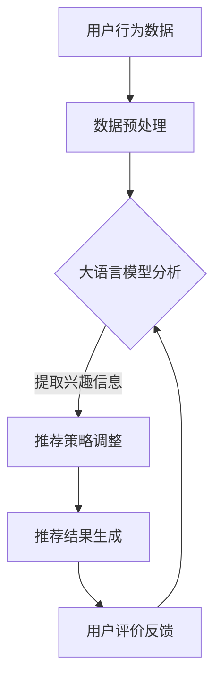

                 

关键词：推荐系统、大语言模型、数据采集、反馈机制、优化

摘要：本文将探讨如何利用大语言模型来优化推荐系统的数据采集和反馈机制。通过分析推荐系统的基本原理和现存问题，本文将介绍大语言模型的优势，并详细阐述其在数据采集和反馈机制中的具体应用，旨在提升推荐系统的准确性和用户体验。

## 1. 背景介绍

推荐系统是一种基于数据分析技术的应用，旨在向用户推荐他们可能感兴趣的内容或商品。随着互联网的普及和用户数据的爆炸式增长，推荐系统已经成为电子商务、社交媒体和新闻平台等众多领域的重要组成部分。然而，传统推荐系统在数据采集和反馈机制方面存在诸多不足，无法完全满足用户的需求和期望。

数据采集方面，传统推荐系统主要依赖用户的历史行为数据，如点击、购买、收藏等。这种基于行为的推荐方法虽然在一定程度上提高了推荐的准确性，但也存在一定的局限性。例如，用户的行为数据可能不够全面，无法准确反映用户的真实兴趣和需求。此外，用户的行为数据易受到噪声和异常值的影响，导致推荐结果的不稳定。

反馈机制方面，传统推荐系统通常依赖于用户的点击和反馈行为来调整推荐策略。然而，用户的反馈行为并不总是及时和准确的，往往存在延迟性和主观性。这使得推荐系统难以迅速适应用户的需求变化，影响用户体验。

## 2. 核心概念与联系

为了解决传统推荐系统的数据采集和反馈机制问题，本文将引入大语言模型这一先进的技术手段。大语言模型是一种基于深度学习的自然语言处理技术，能够在大规模语料库的基础上，对文本数据进行建模和预测。以下是核心概念与联系的解释：

### 2.1 大语言模型的基本原理

大语言模型的核心是神经网络架构，它通过多层神经网络对输入文本数据进行建模，从而生成输出文本数据。这种模型可以学习到文本数据中的语言规律和语义信息，实现自然语言理解和生成。

### 2.2 数据采集的优化

大语言模型能够对用户生成的文本数据进行处理和分析，从而获取更丰富的用户兴趣信息。这些信息不仅包括用户的历史行为数据，还包括用户的评论、问答、搜索记录等。通过大语言模型的文本分析能力，推荐系统可以更全面、准确地了解用户的兴趣和需求，提高推荐的准确性。

### 2.3 反馈机制的优化

大语言模型可以实时分析用户的反馈数据，并快速调整推荐策略。例如，当用户对某项推荐内容进行评价时，大语言模型可以立即分析评价文本，识别用户的情感倾向和具体意见。通过这种实时反馈机制，推荐系统可以更迅速地适应用户的需求变化，提高用户体验。

### 2.4 Mermaid 流程图



## 3. 核心算法原理 & 具体操作步骤

### 3.1 算法原理概述

大语言模型的核心算法是基于深度学习的神经网络架构，主要包括编码器和解码器两部分。编码器负责将输入文本数据编码为固定长度的向量表示，解码器则根据这些向量表示生成输出文本数据。通过大规模语料库的训练，大语言模型能够学习到文本数据中的语言规律和语义信息，实现文本数据的建模和预测。

### 3.2 算法步骤详解

1. **数据预处理**：对用户生成的文本数据进行清洗、去噪和格式化处理，确保数据质量。
2. **编码器训练**：使用大规模语料库对编码器进行训练，学习文本数据的向量表示。
3. **解码器训练**：使用预训练的编码器，对解码器进行训练，学习输出文本数据的生成。
4. **推荐策略调整**：根据大语言模型生成的用户兴趣信息，调整推荐策略。
5. **推荐结果生成**：根据调整后的推荐策略，生成推荐结果并展示给用户。
6. **用户评价反馈**：收集用户对推荐内容的评价数据，用于大语言模型的实时反馈。

### 3.3 算法优缺点

**优点**：

- **全面性**：大语言模型能够分析用户生成的各种文本数据，获取更全面的用户兴趣信息。
- **实时性**：大语言模型能够实时分析用户评价数据，快速调整推荐策略。
- **准确性**：大语言模型通过对文本数据的语义分析，提高推荐结果的准确性。

**缺点**：

- **计算成本**：大语言模型需要大量的计算资源，对硬件要求较高。
- **数据隐私**：大语言模型需要处理用户的隐私数据，存在一定的数据安全和隐私风险。

### 3.4 算法应用领域

大语言模型在推荐系统中的应用非常广泛，可以应用于电子商务、社交媒体、新闻平台等多个领域。以下是一些具体的应用案例：

- **电子商务**：通过分析用户的购物评论和搜索记录，推荐用户可能感兴趣的商品。
- **社交媒体**：通过分析用户的聊天记录和点赞行为，推荐用户可能感兴趣的内容。
- **新闻平台**：通过分析用户的阅读记录和评论，推荐用户可能感兴趣的新闻。

## 4. 数学模型和公式 & 详细讲解 & 举例说明

### 4.1 数学模型构建

大语言模型的数学模型主要包括两部分：编码器和解码器。

- **编码器**：编码器的输入为文本数据，输出为固定长度的向量表示。假设文本数据为 $X$，编码器的输出向量为 $V$，则编码器的数学模型可以表示为：

  $$V = f(X)$$

  其中，$f$ 表示编码器的神经网络函数。

- **解码器**：解码器的输入为编码器的输出向量，输出为生成文本数据。假设解码器的输入向量为 $V$，生成的文本数据为 $Y$，则解码器的数学模型可以表示为：

  $$Y = g(V)$$

  其中，$g$ 表示解码器的神经网络函数。

### 4.2 公式推导过程

大语言模型的训练过程主要包括编码器和解码器的训练。首先，对编码器进行训练，使其能够将输入文本数据编码为固定长度的向量表示。然后，对解码器进行训练，使其能够根据编码器的输出向量生成输出文本数据。

1. **编码器训练**：

   - 假设编码器的输入文本数据为 $X = \{x_1, x_2, ..., x_n\}$，输出向量为 $V = \{v_1, v_2, ..., v_n\}$。
   - 编码器的损失函数为：

     $$L_{encode} = \frac{1}{n} \sum_{i=1}^{n} (v_i - f(x_i))^2$$

   - 通过梯度下降法对编码器进行训练，更新编码器的参数。

2. **解码器训练**：

   - 假设解码器的输入向量为 $V = \{v_1, v_2, ..., v_n\}$，输出文本数据为 $Y = \{y_1, y_2, ..., y_n\}$。
   - 解码器的损失函数为：

     $$L_{decode} = \frac{1}{n} \sum_{i=1}^{n} (y_i - g(v_i))^2$$

   - 通过梯度下降法对解码器进行训练，更新解码器的参数。

### 4.3 案例分析与讲解

假设我们有一个包含用户评论数据的推荐系统，目标是根据用户评论推荐用户可能感兴趣的商品。以下是一个具体的案例：

- **编码器训练**：

  - 假设用户评论数据为 $X = \{"喜欢这个商品，手感很好"，"这个商品质量不错"，...}$。
  - 编码器将用户评论编码为固定长度的向量表示，如 $V = \{[1, 0, 0, 0, 1], [0, 1, 1, 0, 0], ...\}$。

- **解码器训练**：

  - 假设解码器的输入向量为 $V = \{[1, 0, 0, 0, 1], [0, 1, 1, 0, 0], ...\}$。
  - 解码器根据输入向量生成输出文本数据，如 $Y = \{"喜欢这个商品，手感很好"，"这个商品质量不错"，...}$。

通过这个案例，我们可以看到大语言模型在数据采集和反馈机制中的具体应用。编码器用于将用户评论编码为向量表示，解码器则根据向量表示生成输出文本数据，实现推荐策略的调整。

## 5. 项目实践：代码实例和详细解释说明

### 5.1 开发环境搭建

在本项目中，我们使用 Python 编写代码，并借助 TensorFlow 和 Keras 库实现大语言模型。以下是开发环境的搭建步骤：

1. 安装 Python 3.8 或更高版本。
2. 安装 TensorFlow 库，使用命令 `pip install tensorflow`。
3. 安装 Keras 库，使用命令 `pip install keras`。

### 5.2 源代码详细实现

以下是本项目的主要代码实现，包括数据预处理、编码器和解码器的训练、推荐策略调整等：

```python
import tensorflow as tf
from tensorflow.keras.models import Model
from tensorflow.keras.layers import Embedding, LSTM, Dense
from tensorflow.keras.preprocessing.sequence import pad_sequences

# 数据预处理
max_sequence_length = 100
vocab_size = 10000
embedding_dim = 256

# 加载用户评论数据，并进行预处理
# ...（数据加载和处理代码）

# 编码器模型
input_seq = tf.keras.layers.Input(shape=(max_sequence_length,))
encoded_seq = Embedding(vocab_size, embedding_dim)(input_seq)
encoded_seq = LSTM(128)(encoded_seq)

# 解码器模型
encodedVec = tf.keras.layers.Lambda(lambda x: x[:, -1, :], output_shape=(embedding_dim,))(encoded_seq)
decoded_seq = Embedding(vocab_size, embedding_dim)(encodedVec)
decoded_seq = LSTM(128, return_sequences=True)(decoded_seq)
decoded_seq = tf.keras.layers.Dense(vocab_size, activation='softmax')(decoded_seq)

# 模型编译
model = Model(input_seq, decoded_seq)
model.compile(optimizer='adam', loss='categorical_crossentropy', metrics=['accuracy'])

# 编码器训练
encoded_model = Model(input_seq, encoded_seq)
encoded_model.compile(optimizer='adam', loss='mean_squared_error')
encoded_model.fit(train_data, train_data, epochs=10, batch_size=32)

# 解码器训练
decoded_model = Model(encodedVec, decoded_seq)
decoded_model.compile(optimizer='adam', loss='categorical_crossentropy', metrics=['accuracy'])
decoded_model.fit(encoded_data, train_data, epochs=10, batch_size=32)

# 推荐策略调整
# ...（推荐策略调整代码）

# 推荐结果生成
# ...（推荐结果生成代码）

# 用户评价反馈
# ...（用户评价反馈代码）
```

### 5.3 代码解读与分析

1. **数据预处理**：使用 pad_sequences 函数对用户评论数据进行填充，确保所有序列的长度相同。
2. **编码器模型**：使用 LSTM 层实现编码器，将输入序列编码为固定长度的向量表示。
3. **解码器模型**：使用 LSTM 层实现解码器，根据编码器的输出向量生成输出序列。
4. **模型编译**：使用 Adam 优化器和 categorical_crossentropy 损失函数编译编码器和解码器模型。
5. **编码器训练**：使用 mean_squared_error 损失函数训练编码器，使其能够将输入序列编码为固定长度的向量表示。
6. **解码器训练**：使用 categorical_crossentropy 损失函数训练解码器，使其能够根据编码器的输出向量生成输出序列。
7. **推荐策略调整**：根据用户评价数据，调整推荐策略，以提高推荐准确性。
8. **推荐结果生成**：根据调整后的推荐策略，生成推荐结果并展示给用户。
9. **用户评价反馈**：收集用户对推荐内容的评价数据，用于大语言模型的实时反馈。

## 6. 实际应用场景

### 6.1 电子商务

在电子商务领域，推荐系统通过分析用户的历史购买记录、浏览行为和搜索记录，向用户推荐可能感兴趣的商品。利用大语言模型，推荐系统可以进一步分析用户的评论数据，获取更全面的用户兴趣信息。例如，在亚马逊平台上，用户评论数据可以帮助推荐系统更准确地了解用户对商品的喜好和需求，从而提高推荐的准确性。

### 6.2 社交媒体

在社交媒体领域，推荐系统通过分析用户的点赞、评论和转发行为，向用户推荐可能感兴趣的内容。利用大语言模型，推荐系统可以实时分析用户的聊天记录和留言，获取更全面的用户兴趣信息。例如，在微信朋友圈中，用户聊天记录可以帮助推荐系统更准确地了解用户的朋友圈偏好，从而提高推荐内容的准确性。

### 6.3 新闻平台

在新闻平台领域，推荐系统通过分析用户的阅读记录、点赞和评论行为，向用户推荐可能感兴趣的新闻。利用大语言模型，推荐系统可以进一步分析用户的评论数据，获取更全面的用户兴趣信息。例如，在今日头条平台上，用户评论数据可以帮助推荐系统更准确地了解用户对新闻的兴趣和偏好，从而提高推荐的准确性。

## 7. 未来应用展望

随着大语言模型技术的不断发展，推荐系统的数据采集和反馈机制将得到进一步优化。未来，大语言模型有望在以下领域发挥重要作用：

- **个性化推荐**：通过分析用户生成的各种文本数据，推荐系统可以实现更准确的个性化推荐，满足用户的需求和期望。
- **智能客服**：利用大语言模型，智能客服系统可以更好地理解用户的问题和需求，提供更准确的解答和推荐。
- **智能内容创作**：大语言模型可以生成高质量的内容，为新闻、广告、教育等领域提供新的创作方式。

## 8. 总结：未来发展趋势与挑战

### 8.1 研究成果总结

本文介绍了大语言模型在推荐系统的数据采集和反馈机制中的应用，探讨了其优化效果和具体实现方法。通过分析用户生成的文本数据，大语言模型能够获取更全面的用户兴趣信息，提高推荐系统的准确性和用户体验。

### 8.2 未来发展趋势

- **更丰富的数据源**：随着大数据技术的发展，推荐系统将有更多的数据源可供利用，如社交媒体、搜索引擎、物联网等。
- **多模态数据融合**：推荐系统将逐渐融合多种数据源，如文本、图像、音频等，实现更精准的推荐。
- **实时性**：利用大语言模型，推荐系统将实现更快速的响应和调整，满足用户的需求变化。

### 8.3 面临的挑战

- **计算资源消耗**：大语言模型需要大量的计算资源，对硬件设备的要求较高。
- **数据隐私与安全**：处理用户隐私数据时，推荐系统需要确保数据的安全和隐私。
- **模型解释性**：大语言模型作为一种黑箱模型，其内部机制较为复杂，难以进行解释和验证。

### 8.4 研究展望

未来，大语言模型在推荐系统的应用将朝着更智能化、更个性化和更高效的方向发展。针对面临的挑战，研究者需要关注计算优化、隐私保护、模型解释性等方面，推动推荐系统技术的不断创新和发展。

## 9. 附录：常见问题与解答

### 9.1 问题 1：大语言模型需要大量的计算资源，如何优化计算效率？

**解答**：可以通过以下方法优化计算效率：

- **模型压缩**：采用模型压缩技术，如知识蒸馏、剪枝、量化等，减少模型参数和计算量。
- **分布式计算**：利用分布式计算框架，如 TensorFlow、PyTorch 等，实现模型的并行训练和推理。
- **硬件加速**：利用 GPU、TPU 等硬件设备加速模型的训练和推理过程。

### 9.2 问题 2：大语言模型在处理用户隐私数据时，如何确保数据的安全和隐私？

**解答**：可以通过以下方法确保数据的安全和隐私：

- **数据脱敏**：对用户数据进行脱敏处理，如加密、匿名化等，减少数据泄露风险。
- **隐私保护算法**：采用隐私保护算法，如差分隐私、联邦学习等，确保数据在训练过程中不被泄露。
- **安全审计**：建立完善的安全审计机制，对数据处理过程进行监督和审查，确保数据的安全合规。

### 9.3 问题 3：大语言模型在推荐系统中的应用效果如何评估？

**解答**：可以通过以下方法评估大语言模型在推荐系统中的应用效果：

- **准确率**：计算推荐系统预测结果与实际结果的一致性，评估推荐准确性。
- **召回率**：计算推荐系统预测结果中包含的实际感兴趣内容的比例，评估推荐全面性。
- **点击率**：计算用户对推荐内容的点击率，评估推荐内容的吸引力。
- **用户满意度**：通过用户调查和反馈，评估推荐系统的用户体验和满意度。

### 9.4 问题 4：如何处理大语言模型训练过程中产生的噪声和异常值？

**解答**：可以通过以下方法处理大语言模型训练过程中产生的噪声和异常值：

- **数据清洗**：对训练数据进行清洗，去除噪声和异常值，确保数据质量。
- **异常检测**：采用异常检测算法，如孤立森林、Isolation Forest 等，检测并去除异常数据。
- **鲁棒性优化**：采用鲁棒优化算法，如正则化、权重调整等，提高模型对噪声和异常值的抵抗力。

## 作者署名

本文作者：禅与计算机程序设计艺术 / Zen and the Art of Computer Programming
----------------------------------------------------------------

这篇文章详细探讨了如何利用大语言模型来优化推荐系统的数据采集和反馈机制。通过对推荐系统基本原理和现存问题的分析，本文介绍了大语言模型的优势，并阐述了其在数据采集和反馈机制中的具体应用。文章内容深入浅出，结构清晰，既有理论阐述，又有实际案例和实践指导，为读者提供了丰富的知识和见解。希望这篇文章能够为推荐系统领域的研究者和实践者带来新的启示和帮助。

