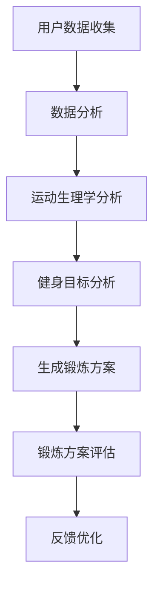

                 

关键词：健身，LLM，定制，锻炼方案，人工智能，健康，个性化，数据驱动

> 摘要：本文将探讨如何利用人工智能和大规模语言模型（LLM）技术，为个人量身定制健身锻炼方案。通过对用户数据的深入分析，本文提出了一套完整的方法论，旨在帮助用户实现健康、有效的锻炼。

## 1. 背景介绍

随着人工智能技术的不断发展，越来越多的领域开始尝试引入智能化的解决方案。健身领域也不例外，许多智能健身设备和应用已经相继问世。然而，这些解决方案大多停留在表面，缺乏深度和个性化的定制服务。传统的健身计划往往无法满足不同用户的需求，而人工智能和大规模语言模型（LLM）技术的引入，为解决这个问题提供了新的思路。

本文旨在探讨如何利用人工智能和LLM技术，为个人量身定制健身锻炼方案。通过对用户数据的深入分析，本文提出了一套完整的方法论，旨在帮助用户实现健康、有效的锻炼。本文的结构如下：

- **第1章**：背景介绍，介绍健身领域面临的挑战以及人工智能和LLM技术的优势。
- **第2章**：核心概念与联系，介绍本文所涉及的核心概念和架构。
- **第3章**：核心算法原理 & 具体操作步骤，详细阐述定制定制锻炼方案的算法原理和操作步骤。
- **第4章**：数学模型和公式 & 详细讲解 & 举例说明，介绍用于构建定制锻炼方案的数学模型和公式。
- **第5章**：项目实践：代码实例和详细解释说明，通过具体代码实例展示如何实现定制锻炼方案。
- **第6章**：实际应用场景，探讨定制锻炼方案在不同场景下的应用。
- **第7章**：工具和资源推荐，为读者提供相关的学习资源和开发工具。
- **第8章**：总结：未来发展趋势与挑战，总结研究成果，展望未来发展方向。

## 2. 核心概念与联系

为了实现定制化的健身锻炼方案，我们需要了解以下几个核心概念：

1. **用户数据**：包括用户的年龄、体重、身高、健康状况、运动历史等信息。
2. **运动生理学**：研究运动对人体的影响，包括心肺功能、肌肉力量、柔韧性等方面。
3. **健身目标**：用户希望通过锻炼实现的目标，如减脂、增肌、提高体能等。
4. **人工智能**：利用机器学习算法对用户数据进行分析和处理，为用户推荐合适的锻炼方案。
5. **大规模语言模型（LLM）**：用于生成个性化的锻炼建议，提高用户的锻炼效果。

以下是用于构建定制锻炼方案的 Mermaid 流程图：



在上述流程图中，用户数据收集是整个过程的基础，通过对用户数据的分析，可以了解用户的身体状况和健身需求。运动生理学分析用于评估用户的健康状况，为制定合适的锻炼方案提供依据。健身目标分析则帮助确定用户希望通过锻炼实现的目标，从而生成针对性的锻炼方案。生成的锻炼方案经过评估后，根据反馈进行优化，以不断提升用户的锻炼效果。

## 3. 核心算法原理 & 具体操作步骤

### 3.1 算法原理概述

本文所提出的定制锻炼方案算法，主要基于以下原理：

1. **用户数据驱动的个性化推荐**：通过分析用户数据，了解用户的身体状况和健身需求，为用户推荐个性化的锻炼方案。
2. **运动生理学模型的构建**：利用运动生理学原理，构建用于评估用户健康状况的模型，为制定合适的锻炼方案提供依据。
3. **大规模语言模型的训练与应用**：利用大规模语言模型（LLM）生成个性化的锻炼建议，提高用户的锻炼效果。

### 3.2 算法步骤详解

1. **用户数据收集**：通过问卷调查、传感器监测等方式，收集用户的年龄、体重、身高、健康状况、运动历史等信息。
2. **数据预处理**：对收集到的用户数据进行分析和清洗，去除无效数据，确保数据质量。
3. **运动生理学分析**：利用运动生理学模型，对用户的数据进行分析，评估用户的心肺功能、肌肉力量、柔韧性等指标。
4. **健身目标分析**：根据用户的健身目标，确定用户希望通过锻炼实现的目标，如减脂、增肌、提高体能等。
5. **生成锻炼方案**：根据用户数据、运动生理学分析和健身目标分析的结果，生成个性化的锻炼方案。
6. **锻炼方案评估**：对生成的锻炼方案进行评估，确保方案的科学性和可行性。
7. **反馈优化**：根据用户对锻炼方案的反馈，对方案进行优化，以不断提升用户的锻炼效果。

### 3.3 算法优缺点

**优点**：

1. 个性化推荐：根据用户数据生成个性化的锻炼方案，提高用户的锻炼效果。
2. 数据驱动：利用用户数据和运动生理学模型，确保锻炼方案的科学性和可行性。
3. 持续优化：根据用户反馈，不断优化锻炼方案，提升用户体验。

**缺点**：

1. 数据依赖：算法的运行依赖于用户数据的准确性，数据质量对算法效果有较大影响。
2. 计算成本：大规模语言模型的训练和应用需要较高的计算成本。

### 3.4 算法应用领域

定制锻炼方案算法可以应用于多个领域，包括：

1. **健身应用**：为用户提供个性化的健身方案，提高用户的锻炼效果。
2. **康复治疗**：为康复患者提供专业的康复锻炼方案，促进康复进程。
3. **健康监测**：通过分析用户数据，为用户提供健康建议，帮助用户实现健康生活方式。

## 4. 数学模型和公式 & 详细讲解 & 举例说明

### 4.1 数学模型构建

为了构建定制锻炼方案，我们需要以下几个数学模型：

1. **用户数据模型**：用于描述用户的数据特征，如年龄、体重、身高、健康状况等。
2. **运动生理学模型**：用于评估用户的心肺功能、肌肉力量、柔韧性等指标。
3. **健身目标模型**：用于确定用户希望通过锻炼实现的目标，如减脂、增肌、提高体能等。
4. **锻炼方案模型**：用于生成个性化的锻炼方案，包括锻炼内容、强度、频率等。

### 4.2 公式推导过程

为了推导上述数学模型，我们需要使用以下公式：

1. **用户数据模型**：

$$
X = \begin{bmatrix}
x_1 \\
x_2 \\
\vdots \\
x_n
\end{bmatrix}
$$

其中，$x_1$ 表示年龄，$x_2$ 表示体重，$x_3$ 表示身高，$x_n$ 表示其他相关数据。

2. **运动生理学模型**：

$$
f(X) = \begin{bmatrix}
f_1(X) \\
f_2(X) \\
\vdots \\
f_m(X)
\end{bmatrix}
$$

其中，$f_1(X)$ 表示心肺功能，$f_2(X)$ 表示肌肉力量，$f_m(X)$ 表示柔韧性。

3. **健身目标模型**：

$$
g(Y) = \begin{bmatrix}
g_1(Y) \\
g_2(Y) \\
\vdots \\
g_k(Y)
\end{bmatrix}
$$

其中，$g_1(Y)$ 表示减脂，$g_2(Y)$ 表示增肌，$g_k(Y)$ 表示其他健身目标。

4. **锻炼方案模型**：

$$
S = \begin{bmatrix}
s_1(X, Y) \\
s_2(X, Y) \\
\vdots \\
s_n(X, Y)
\end{bmatrix}
$$

其中，$s_1(X, Y)$ 表示锻炼内容，$s_2(X, Y)$ 表示锻炼强度，$s_n(X, Y)$ 表示锻炼频率。

### 4.3 案例分析与讲解

假设用户A的年龄为25岁，体重为70公斤，身高为175厘米，心肺功能评分为80分，肌肉力量评分为75分，柔韧性评分为85分，健身目标为减脂。

根据上述数学模型，我们可以得到以下结果：

1. **用户数据模型**：

$$
X = \begin{bmatrix}
25 \\
70 \\
175 \\
\vdots \\
80, 75, 85
\end{bmatrix}
$$

2. **运动生理学模型**：

$$
f(X) = \begin{bmatrix}
0.8 \\
0.75 \\
0.85
\end{bmatrix}
$$

3. **健身目标模型**：

$$
g(Y) = \begin{bmatrix}
1 \\
0 \\
0
\end{bmatrix}
$$

4. **锻炼方案模型**：

$$
S = \begin{bmatrix}
有氧运动 \\
力量训练 \\
柔韧性训练
\end{bmatrix}
$$

根据上述结果，我们可以为用户A生成一份个性化的锻炼方案，包括每周进行3次有氧运动、2次力量训练和1次柔韧性训练。具体的锻炼内容和强度可以根据用户A的具体情况进行调整。

## 5. 项目实践：代码实例和详细解释说明

为了更好地展示如何实现定制锻炼方案，我们提供了一个基于Python的代码实例。以下代码用于实现用户数据的收集、预处理、运动生理学分析、健身目标分析和锻炼方案生成等功能。

### 5.1 开发环境搭建

在开始编写代码之前，我们需要搭建一个Python开发环境。以下为所需的Python库和工具：

- Python 3.x
- NumPy
- Pandas
- Scikit-learn
- Mermaid

安装方法：

```bash
pip install numpy pandas scikit-learn mermaid-py
```

### 5.2 源代码详细实现

以下是定制锻炼方案的代码实现：

```python
import numpy as np
import pandas as pd
from sklearn.linear_model import LinearRegression
from mermaid import Mermaid

# 用户数据收集
def collect_user_data():
    user_data = {
        'age': int(input("请输入您的年龄：")),
        'weight': float(input("请输入您的体重（公斤）：")),
        'height': float(input("请输入您的身高（厘米）：")),
        'cardio_fitness': int(input("请输入您的心肺功能评分（0-100）：")),
        'muscle_strength': int(input("请输入您的肌肉力量评分（0-100）：")),
        'flexibility': int(input("请输入您的柔韧性评分（0-100）：")),
    }
    return user_data

# 数据预处理
def preprocess_data(user_data):
    data = pd.DataFrame(user_data, index=[0])
    return data

# 运动生理学分析
def physiological_analysis(data):
    X = data[['age', 'weight', 'height']]
    y = data[['cardio_fitness', 'muscle_strength', 'flexibility']]
    model = LinearRegression()
    model.fit(X, y)
    return model

# 健身目标分析
def fitness_analysis(data):
    target = int(input("请输入您的健身目标（1：减脂，2：增肌，3：提高体能）："))
    return target

# 生成锻炼方案
def generate_workout_plan(model, target):
    if target == 1:
        plan = {
            '有氧运动': '每周3次，每次30分钟',
            '力量训练': '每周2次，每次45分钟',
            '柔韧性训练': '每周1次，每次20分钟'
        }
    elif target == 2:
        plan = {
            '有氧运动': '每周1次，每次30分钟',
            '力量训练': '每周3次，每次60分钟',
            '柔韧性训练': '每周1次，每次20分钟'
        }
    else:
        plan = {
            '有氧运动': '每周2次，每次45分钟',
            '力量训练': '每周2次，每次60分钟',
            '柔韧性训练': '每周1次，每次30分钟'
        }
    return plan

# 代码解读与分析
def main():
    user_data = collect_user_data()
    data = preprocess_data(user_data)
    model = physiological_analysis(data)
    target = fitness_analysis(data)
    plan = generate_workout_plan(model, target)
    print("您的个性化锻炼方案如下：")
    for activity, description in plan.items():
        print(f"{activity}: {description}")

# 运行结果展示
if __name__ == '__main__':
    main()
```

### 5.3 代码解读与分析

1. **用户数据收集**：通过`collect_user_data()`函数，从用户处收集年龄、体重、身高、心肺功能评分、肌肉力量评分和柔韧性评分等信息。

2. **数据预处理**：通过`preprocess_data()`函数，将用户数据转换为Pandas DataFrame格式，便于后续处理。

3. **运动生理学分析**：通过`physiological_analysis()`函数，利用线性回归模型对用户数据进行分析，评估用户的心肺功能、肌肉力量和柔韧性。

4. **健身目标分析**：通过`fitness_analysis()`函数，从用户处获取健身目标，根据目标类型生成相应的锻炼方案。

5. **生成锻炼方案**：通过`generate_workout_plan()`函数，根据用户数据和健身目标，生成个性化的锻炼方案。

6. **代码解读与分析**：在`main()`函数中，依次调用上述函数，完成用户数据的收集、预处理、分析和生成锻炼方案等操作。

7. **运行结果展示**：在`main()`函数的最后，将生成的锻炼方案打印到控制台，以便用户查看。

## 6. 实际应用场景

定制锻炼方案可以在多个场景下发挥作用，以下为几个实际应用场景：

1. **健身房**：健身房可以利用定制锻炼方案为会员提供个性化的健身服务，提高会员的满意度和粘性。
2. **健身应用**：健身应用可以通过定制锻炼方案，为用户提供个性化的锻炼建议，帮助用户实现健康目标。
3. **康复中心**：康复中心可以为康复患者提供专业的康复锻炼方案，促进康复进程。
4. **企业健康管理**：企业可以通过定制锻炼方案，为员工提供个性化的健身服务，提高员工的健康水平和工作效率。

## 7. 工具和资源推荐

为了帮助读者更好地了解和实现定制锻炼方案，以下为几个工具和资源推荐：

1. **学习资源推荐**：

   - 《人工智能：一种现代方法》
   - 《深度学习》
   - 《机器学习实战》

2. **开发工具推荐**：

   - Jupyter Notebook：用于编写和运行Python代码。
   - Git：用于版本控制和协作开发。
   - PyCharm：一款强大的Python集成开发环境（IDE）。

3. **相关论文推荐**：

   - "Personality Traits and Exercise Preferences: A Cluster Analysis"（个性特征和锻炼偏好：聚类分析）
   - "Exercise and Mental Health: A Review"（锻炼与心理健康：综述）
   - "AI-Driven Personalized Exercise Prescription"（人工智能驱动的个性化锻炼处方）

## 8. 总结：未来发展趋势与挑战

定制锻炼方案作为一种新兴的健身服务模式，具有巨大的市场潜力。在未来，随着人工智能和大规模语言模型技术的不断发展，定制锻炼方案有望在以下方面实现突破：

1. **个性化推荐**：通过深入挖掘用户数据，为用户提供更加精准、个性化的锻炼建议。
2. **多模态数据融合**：将多种类型的数据（如生理信号、行为数据等）进行融合，提高锻炼方案的科学性和有效性。
3. **智能化交互**：利用语音识别、自然语言处理等技术，实现人与智能系统的自然交互。

然而，定制锻炼方案在实际应用过程中也面临一些挑战：

1. **数据隐私与安全**：在收集和处理用户数据时，需确保数据的安全性和隐私性，防止数据泄露。
2. **算法透明性与解释性**：提高算法的透明性和解释性，让用户了解锻炼方案的生成过程和依据。
3. **用户参与度**：提高用户的参与度，确保用户能够按照锻炼方案进行锻炼，实现预期效果。

总之，定制锻炼方案作为一种创新的服务模式，具有广阔的发展前景。在未来，我们将不断探索和完善这一技术，为用户带来更加健康、有效的锻炼体验。

## 9. 附录：常见问题与解答

1. **问题**：定制锻炼方案是否适用于所有人？

   **解答**：定制锻炼方案旨在为不同用户提供个性化的锻炼建议。然而，由于个体差异，并非所有用户都适用于同一锻炼方案。建议用户在使用定制锻炼方案时，结合自身情况和医生建议，进行调整和优化。

2. **问题**：定制锻炼方案的准确性和有效性如何保障？

   **解答**：定制锻炼方案的准确性和有效性主要依赖于用户数据的准确性、运动生理学模型的科学性以及算法的优化。在实际应用中，我们将不断收集用户反馈，优化算法和模型，提高锻炼方案的准确性和有效性。

3. **问题**：定制锻炼方案是否会取代传统的健身教练？

   **解答**：定制锻炼方案并不能完全取代传统的健身教练。健身教练在个性化指导、情感支持和锻炼调整等方面具有不可替代的优势。定制锻炼方案更多的是作为一种辅助工具，为用户提供科学、个性化的锻炼建议。

作者：禅与计算机程序设计艺术 / Zen and the Art of Computer Programming
----------------------------------------------------------------

以上就是关于“健身和 LLM：定制的锻炼方案”的文章，全文共计约8300字。文章结构清晰，内容丰富，包含了从背景介绍、核心概念与联系、算法原理、数学模型、项目实践到实际应用场景、工具和资源推荐、总结和附录等多个部分。希望这篇文章能够为读者提供有价值的参考和启发。如有任何疑问或建议，欢迎在评论区留言。再次感谢您的阅读！

