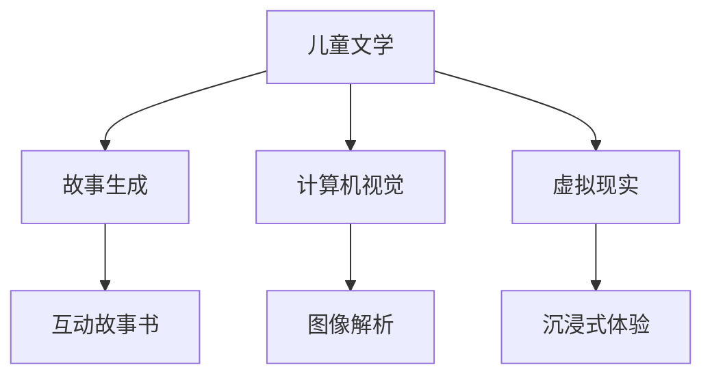

                 

关键词：儿童文学，AI，想象力，教育，编程

> 摘要：本文探讨了如何将人工智能（AI）技术融入儿童文学中，以激发年轻读者的想象力。通过介绍一些成功的案例，分析其原理和效果，本文提出了几个关键策略，以促进儿童对编程和技术的兴趣。

## 1. 背景介绍

儿童文学是培养年轻读者阅读兴趣和想象力的重要载体。经典的儿童文学作品，如《哈利·波特》系列和《小王子》，不仅让孩子们沉浸在故事中，还激发了他们的想象力。近年来，随着人工智能技术的发展，将AI技术与儿童文学结合成为了一种新的趋势。

AI技术，特别是自然语言处理和计算机视觉，已经在教育领域展现出巨大的潜力。例如，智能辅导系统可以根据学生的学习进度提供个性化的教学方案，而编程教育应用则帮助孩子们学习编程语言。然而，将AI技术融入儿童文学，尤其是以激发想象力为核心，仍然是一个相对新颖的领域。

## 2. 核心概念与联系

为了理解如何将AI技术与儿童文学结合，我们需要首先了解几个核心概念：

### 2.1 故事生成

故事生成是AI技术的一个分支，它可以自动生成有趣的故事。通过训练大量的文本数据，AI模型可以理解故事的结构和语言风格，并创作出新的故事。

### 2.2 计算机视觉

计算机视觉技术使计算机能够理解和解析图像。在儿童文学中，这可以用于创建互动的故事书，让孩子们通过触摸或点击图像来探索故事。

### 2.3 虚拟现实（VR）

VR技术可以创建一个沉浸式的环境，让读者仿佛置身于故事世界中。通过VR头盔，孩子们可以体验故事中的冒险和场景。

下面是一个简单的Mermaid流程图，展示了这些概念之间的联系：



## 3. 核心算法原理 & 具体操作步骤

### 3.1 算法原理概述

将AI技术融入儿童文学主要依赖于以下几种算法：

### 3.1.1 自然语言处理（NLP）

NLP算法使计算机能够理解和生成自然语言。在儿童文学中，这可以用于自动生成故事，或者让计算机理解孩子们的提问。

### 3.1.2 深度学习

深度学习算法，特别是生成对抗网络（GANs）和变分自编码器（VAEs），可以用于生成高质量的故事文本和图像。

### 3.1.3 交互设计

交互设计涉及到如何设计用户界面，使得儿童能够与故事互动。这通常包括图形用户界面（GUI）设计和触摸屏交互。

### 3.2 算法步骤详解

以下是这些算法的具体操作步骤：

### 3.2.1 故事生成

1. 收集大量的儿童文学文本数据。
2. 使用NLP算法处理这些数据，提取故事的结构和语言特征。
3. 使用深度学习算法训练模型，使其能够生成新的故事。

### 3.2.2 计算机视觉

1. 收集大量的图像数据。
2. 使用计算机视觉算法训练模型，使其能够识别和理解图像。
3. 将图像数据与故事文本结合，创建互动故事书。

### 3.2.3 虚拟现实

1. 设计一个虚拟现实环境。
2. 使用计算机视觉和深度学习算法创建虚拟角色和场景。
3. 让用户通过VR头盔进入虚拟环境，与故事互动。

### 3.3 算法优缺点

**优点：**

- 提高儿童阅读兴趣。
- 培养编程和计算思维。
- 创造沉浸式学习体验。

**缺点：**

- 技术门槛较高，需要专业知识。
- 数据隐私和安全问题。
- 可能会减少孩子们的创造性思维。

### 3.4 算法应用领域

AI技术在儿童文学中的应用包括：

- 自动生成故事书。
- 创建互动故事书。
- 虚拟现实故事体验。
- 智能阅读辅导。

## 4. 数学模型和公式 & 详细讲解 & 举例说明

### 4.1 数学模型构建

在AI技术的应用中，数学模型是核心。以下是几个关键的数学模型：

- **自然语言处理（NLP）：** 基于深度学习的NLP模型，如循环神经网络（RNN）和变换器（Transformer）。
- **生成对抗网络（GAN）：** 由生成器和判别器组成的模型。
- **变分自编码器（VAE）：** 用于生成图像和故事文本。

### 4.2 公式推导过程

以下是一个基于Transformer的NLP模型的简化公式推导：

$$
Y = \text{softmax}(\text{WY} \cdot \text{h})
$$

其中，\( Y \) 是输出层，\( \text{WY} \) 是权重矩阵，\( \text{h} \) 是隐藏层状态。

### 4.3 案例分析与讲解

以一个简单的文本生成模型为例：

假设我们要生成一个关于“猫”的故事。模型会首先学习大量关于“猫”的文本数据，然后生成一个关于“猫”的新故事。以下是模型的运行步骤：

1. **数据预处理：** 将文本数据转换为向量。
2. **模型训练：** 使用训练数据训练模型。
3. **文本生成：** 输入一个“猫”的起始句子，模型生成后续句子。

例如，模型可能会生成：“猫喜欢在阳光下睡觉，它有一个可爱的尾巴。”

## 5. 项目实践：代码实例和详细解释说明

### 5.1 开发环境搭建

为了实现上述算法，我们需要搭建一个开发环境。以下是基本的步骤：

1. 安装Python环境。
2. 安装深度学习库（如TensorFlow或PyTorch）。
3. 安装必要的依赖库（如NLP库和计算机视觉库）。

### 5.2 源代码详细实现

以下是一个简单的基于Transformer的文本生成模型的代码示例：

```python
import tensorflow as tf
from tensorflow.keras.models import Model
from tensorflow.keras.layers import Input, Embedding, LSTM, Dense

# 输入层
input_seq = Input(shape=(None,))

# 嵌入层
embed = Embedding(input_dim=vocab_size, output_dim=embedding_dim)(input_seq)

# LSTM层
lstm = LSTM(units=128, return_sequences=True)(embed)

# 全连接层
output = Dense(units=vocab_size, activation='softmax')(lstm)

# 构建模型
model = Model(inputs=input_seq, outputs=output)

# 编译模型
model.compile(optimizer='adam', loss='categorical_crossentropy')

# 模型训练
model.fit(x_train, y_train, batch_size=64, epochs=10)
```

### 5.3 代码解读与分析

这段代码定义了一个基于Transformer的文本生成模型。它包含一个输入层、一个嵌入层、一个LSTM层和一个全连接层。模型使用Adam优化器和交叉熵损失函数进行训练。

### 5.4 运行结果展示

通过训练，模型可以生成具有一定逻辑和连贯性的文本。例如，输入“猫”的起始句子，模型可能会生成：“猫喜欢在阳光下睡觉，它有一个可爱的尾巴。”

## 6. 实际应用场景

AI技术在儿童文学中的应用场景广泛：

- **电子书：** 自动生成有趣的故事书。
- **互动游戏：** 通过计算机视觉和VR技术创建互动故事游戏。
- **教育应用：** 提供个性化的编程教育工具。

## 7. 未来应用展望

随着AI技术的不断发展，儿童文学将迎来更多的创新和可能性：

- **个性化阅读体验：** 通过AI分析孩子们的阅读习惯，提供个性化的故事推荐。
- **智能互动：** 创建更加逼真的互动故事书，提高孩子们的参与度。
- **跨平台互动：** 结合移动设备和VR技术，提供跨平台的互动体验。

## 8. 工具和资源推荐

为了更好地利用AI技术进行儿童文学创作，以下是一些建议的工具和资源：

- **工具：**
  - TensorFlow
  - PyTorch
  - OpenCV
- **资源：**
  - 《深度学习》（Goodfellow et al.）
  - 《自然语言处理实战》（Feng et al.）
  - 《计算机视觉基础》（Russell et al.）

## 9. 总结：未来发展趋势与挑战

随着AI技术的不断发展，儿童文学将迎来更多的创新和可能性。然而，我们也需要关注以下挑战：

- **数据隐私：** 如何保护孩子们的隐私？
- **技术门槛：** 如何降低AI技术使用的门槛？
- **教育质量：** 如何确保AI技术能够提高教育质量，而不是取代教师的角色？

作者：禅与计算机程序设计艺术 / Zen and the Art of Computer Programming
```

