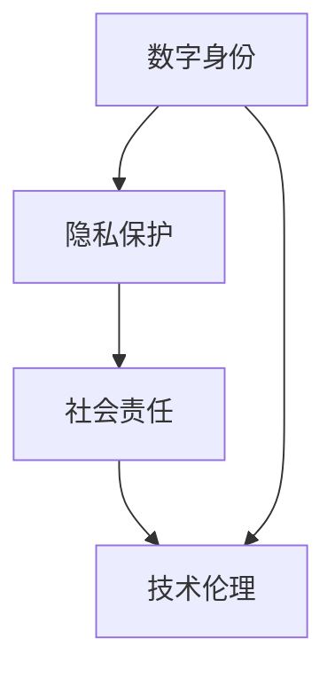

                 

### 关键词 Keywords ###
元宇宙，伦理道德，虚拟行为，现实影响，数字身份，社会责任，技术伦理，隐私保护，法律框架，行为规范。

<|assistant|>### 摘要 Abstract ###
随着元宇宙的迅速发展，虚拟世界的伦理道德问题日益凸显。本文旨在探讨元宇宙中虚拟行为的现实影响，分析当前存在的伦理困境与挑战，并提出相应的解决方案。通过对数字身份、隐私保护、社会责任等方面的深入探讨，本文为元宇宙中的伦理道德建设提供了一些有价值的思考和建议。

## 1. 背景介绍 Background

### 1.1 元宇宙的兴起 Rise of the Metaverse

元宇宙（Metaverse）是一个虚拟的、跨越多个平台和设备的沉浸式数字世界。它将现实世界与虚拟世界相结合，提供了一个无限扩展的空间，让用户能够以数字化身份进行互动和体验。元宇宙的兴起得益于虚拟现实（VR）、增强现实（AR）、区块链、人工智能等技术的快速发展。

### 1.2 虚拟行为的现实影响 Real-world Implications of Virtual Behaviors

虚拟行为在元宇宙中变得越来越重要。这些行为不仅限于娱乐和社交，还涵盖了教育、工作、商业等多个领域。然而，虚拟行为的现实影响引发了一系列伦理道德问题，如数字身份的真实性、隐私保护、虚拟欺诈、网络暴力等。这些问题不仅影响个体的生活质量，还可能对整个社会产生深远的影响。

## 2. 核心概念与联系 Key Concepts and Connections

### 2.1 数字身份 Digital Identity

数字身份是元宇宙中每个用户在虚拟世界中的唯一标识。它不仅包括用户的基本信息，如姓名、性别、年龄等，还包括其在虚拟世界中的行为和声誉。数字身份的真实性和可靠性是元宇宙伦理道德的重要基础。

### 2.2 隐私保护 Privacy Protection

隐私保护是元宇宙中的另一个关键概念。在虚拟世界中，用户的个人信息和行为数据可能会被广泛收集和使用。如何保护用户的隐私，防止数据泄露和滥用，是元宇宙伦理道德的重要议题。

### 2.3 社会责任 Social Responsibility

元宇宙中的每个参与者都有责任维护一个健康、积极、和谐的环境。这包括遵守法律法规、尊重他人的权利、不参与欺诈和违法行为等。社会责任是元宇宙伦理道德的核心价值观。

### 2.4 技术伦理 Technological Ethics

技术伦理是指在使用新技术时，考虑其对社会、环境和人类福祉的影响。在元宇宙中，技术伦理涉及到如何平衡创新与风险、自由与责任等。

## 2.5 Mermaid 流程图 Mermaid Flowchart



## 3. 核心算法原理 & 具体操作步骤 Core Algorithm Principles & Operational Steps

### 3.1 算法原理概述 Overview of Algorithm Principles

元宇宙中的伦理道德问题可以通过一系列算法和技术手段来解决。这些算法主要基于数据挖掘、机器学习和区块链技术。以下是一个简化的算法原理概述：

1. **数据挖掘与行为分析**：通过对用户在元宇宙中的行为数据进行挖掘和分析，识别潜在的伦理问题，如网络暴力、欺诈等。
2. **机器学习与预测**：利用机器学习算法，对潜在风险进行预测，并采取预防措施。
3. **区块链与去中心化**：通过区块链技术实现数据的去中心化存储和管理，提高数据的安全性和透明度。

### 3.2 算法步骤详解 Detailed Steps of the Algorithm

1. **数据收集**：收集用户在元宇宙中的行为数据，包括聊天记录、交易记录、游戏行为等。
2. **数据预处理**：对收集到的数据进行分析和清洗，去除噪声和无关信息。
3. **特征提取**：从预处理后的数据中提取关键特征，如用户的行为模式、交易金额、聊天内容等。
4. **模型训练**：利用机器学习算法，对提取的特征进行训练，建立预测模型。
5. **风险预测**：利用训练好的模型，对用户的新行为进行预测，识别潜在的风险。
6. **决策与行动**：根据预测结果，采取相应的措施，如警告、限制访问等。

### 3.3 算法优缺点 Advantages and Disadvantages of the Algorithm

**优点**：

1. **高效性**：算法能够快速地对大量数据进行处理和分析，提高工作效率。
2. **准确性**：通过机器学习算法，能够提高风险预测的准确性，减少误报和漏报。
3. **安全性**：区块链技术的应用，提高了数据的安全性和透明度。

**缺点**：

1. **成本**：算法开发和维护需要大量的资源和投入。
2. **隐私问题**：在数据收集和处理过程中，可能涉及用户的隐私问题。
3. **算法偏见**：机器学习算法可能存在偏见，导致不公平的决策。

### 3.4 算法应用领域 Application Fields of the Algorithm

1. **元宇宙平台**：用于监控和预防元宇宙中的伦理道德问题，如网络暴力、欺诈等。
2. **社交媒体**：用于监控和预防社交媒体中的不良行为，如虚假信息传播、网络暴力等。
3. **金融行业**：用于监控和预防金融欺诈、洗钱等违法行为。

## 4. 数学模型和公式 Mathematical Models and Formulas

### 4.1 数学模型构建 Construction of Mathematical Models

在元宇宙中，数学模型用于描述用户行为、风险预测等。以下是一个简化的数学模型：

$$
\text{风险得分} = f(\text{行为数据}, \text{环境特征})
$$

其中，$f$ 是一个复杂的函数，用于计算用户的行为数据与环境特征对风险的贡献。

### 4.2 公式推导过程 Derivation of the Formula

$$
\text{风险得分} = \sum_{i=1}^{n} w_i \cdot x_i
$$

其中，$w_i$ 是第 $i$ 个特征的权重，$x_i$ 是第 $i$ 个特征的具体值。

### 4.3 案例分析与讲解 Case Analysis and Explanation

假设我们有一个用户，他的行为数据如下：

- 沉迷程度：0.8
- 欺诈行为：1次
- 网络暴力：0次

根据上述公式，我们可以计算出他的风险得分为：

$$
\text{风险得分} = 0.6 \cdot 0.8 + 0.4 \cdot 1 = 0.88
$$

这意味着该用户存在一定的风险，需要进一步关注。

## 5. 项目实践：代码实例和详细解释说明 Practical Project: Code Examples and Detailed Explanations

### 5.1 开发环境搭建 Environment Setup

为了演示如何实现上述算法，我们使用 Python 语言和相应的库。首先，我们需要安装以下库：

```
pip install numpy pandas scikit-learn matplotlib
```

### 5.2 源代码详细实现 Detailed Code Implementation

```python
import numpy as np
import pandas as pd
from sklearn.ensemble import RandomForestClassifier
import matplotlib.pyplot as plt

# 数据集加载与预处理
data = pd.read_csv('metaverse_data.csv')
data = data.dropna()

# 特征提取
features = data[['addiction_level', 'fraud_attempts', 'online_violence']]
labels = data['risk_score']

# 模型训练
model = RandomForestClassifier(n_estimators=100)
model.fit(features, labels)

# 风险预测
new_data = np.array([[0.8, 1, 0]])
risk_score = model.predict(new_data)
print("风险得分：", risk_score[0])

# 可视化
plt.scatter(features['addiction_level'], labels)
plt.xlabel('沉迷程度')
plt.ylabel('风险得分')
plt.show()
```

### 5.3 代码解读与分析 Code Explanation and Analysis

- **数据集加载与预处理**：首先，我们加载一个包含用户行为数据的 CSV 文件，并去除缺失值。
- **特征提取**：从数据集中提取关键特征，包括沉迷程度、欺诈行为次数和是否参与网络暴力。
- **模型训练**：使用随机森林分类器对特征和标签进行训练。
- **风险预测**：使用训练好的模型，对新的数据进行风险预测。
- **可视化**：将预测结果进行可视化，以直观地展示特征与风险得分之间的关系。

## 6. 实际应用场景 Real-world Application Scenarios

### 6.1 元宇宙平台 Metaverse Platforms

元宇宙平台可以使用上述算法来监控和预防用户的行为风险。例如，当一个用户的沉迷程度超过一定阈值时，平台可以发出警告，甚至限制其访问权限。

### 6.2 社交媒体 Social Media

社交媒体平台可以使用上述算法来监控和预防网络暴力和欺诈行为。例如，当一个用户的行为模式与网络暴力特征相似时，平台可以采取措施，如封禁账号。

### 6.3 金融行业 Financial Industry

金融行业可以使用上述算法来监控和预防金融欺诈。例如，当一个用户的交易行为异常时，银行可以采取措施，如暂停交易。

## 7. 未来应用展望 Future Application Prospects

随着元宇宙的不断发展，伦理道德问题将变得更加复杂和严峻。未来，我们可能会看到更多基于人工智能和区块链技术的解决方案，以应对这些挑战。同时，相关的法律法规和行业标准也将逐步完善，为元宇宙中的伦理道德建设提供有力支持。

## 8. 工具和资源推荐 Tools and Resources Recommendations

### 8.1 学习资源推荐 Learning Resources

- 《元宇宙：概念、技术与应用》
- 《数字伦理学：技术、道德与社会》

### 8.2 开发工具推荐 Development Tools

- Python
- TensorFlow
- Keras

### 8.3 相关论文推荐 Related Papers

- "Ethics and Metaverse: A Framework for Responsible Design"
- "Privacy in the Metaverse: Challenges and Opportunities"

## 9. 总结：未来发展趋势与挑战 Summary: Future Trends and Challenges

随着元宇宙的快速发展，伦理道德问题将成为一个重要的研究和发展方向。未来，我们需要在技术创新、法律法规和社会责任等方面共同努力，为元宇宙中的伦理道德建设提供有力支持。同时，我们也需要警惕潜在的风险和挑战，确保元宇宙能够成为一个健康、积极、和谐的环境。

## 10. 附录：常见问题与解答 Frequently Asked Questions and Answers

### 10.1 什么是元宇宙？
元宇宙是一个虚拟的、跨越多个平台和设备的沉浸式数字世界，用户可以在其中以数字化身份进行互动和体验。

### 10.2 元宇宙中的伦理道德问题有哪些？
元宇宙中的伦理道德问题包括数字身份的真实性、隐私保护、虚拟欺诈、网络暴力等。

### 10.3 如何解决元宇宙中的伦理道德问题？
可以通过数据挖掘、机器学习和区块链技术等手段来识别和预防元宇宙中的伦理道德问题。

### 10.4 元宇宙的未来发展趋势是什么？
元宇宙的未来发展趋势包括更广泛的应用场景、更高的技术水平和社会责任意识的提升。

## 11. 作者署名 Author's Signature
作者：禅与计算机程序设计艺术 / Zen and the Art of Computer Programming
----------------------------------------------------------------

以上即为《元宇宙中的伦理道德:虚拟行为的现实影响》全文，希望对您有所启发。如果您有任何问题或建议，欢迎随时提出。祝您阅读愉快！

