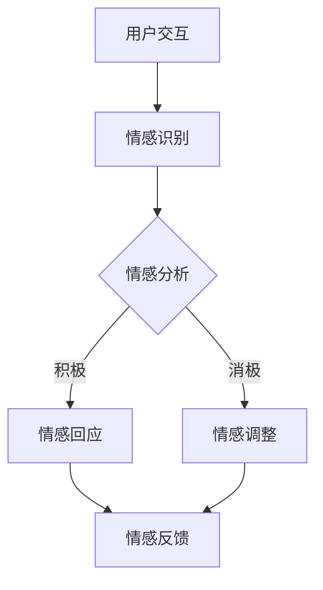

                 

元宇宙是一个虚拟现实的空间，其中人类和人工智能可以共同交互和创造。在这个新兴的数字世界中，数字化情感正成为一项关键技术，它使得虚拟人物和用户之间能够建立更加深入和真实的情感联系。本文将探讨元宇宙中的数字化情感，尤其是虚拟关系的深度探索。

## 关键词

- 元宇宙
- 数字化情感
- 虚拟关系
- 人工智能
- 虚拟现实

## 摘要

本文旨在探讨元宇宙中数字化情感的概念，以及如何通过技术手段建立和增强虚拟关系。我们将分析数字化情感的定义、核心技术和实现方法，并探讨其在元宇宙中的应用和未来发展趋势。同时，本文也将提供一些实用的工具和资源，帮助读者深入了解和探索这一领域。

## 1. 背景介绍

### 元宇宙的兴起

随着虚拟现实（VR）和增强现实（AR）技术的发展，元宇宙逐渐从科幻走向现实。元宇宙是一个虚拟的3D空间，用户可以通过VR头戴设备或其他交互设备进入，并与其他用户和虚拟环境进行实时互动。这种全新的交互方式为数字化情感提供了广阔的应用场景。

### 数字化情感的重要性

在元宇宙中，数字化情感是建立虚拟关系的基础。通过模拟真实世界的情感反应，虚拟人物能够与用户建立情感联系，从而提升用户的沉浸感和体验质量。数字化情感不仅能够增强用户对虚拟世界的认同感，还能为虚拟经济、社交和文化等领域带来新的机会。

### 当前技术的发展

近年来，人工智能、自然语言处理、机器学习和情感计算等技术取得了显著进展，为数字化情感的实现提供了坚实的技术基础。虚拟人物通过深度学习算法，可以模拟人类的情感反应，如喜怒哀乐，甚至可以通过情感分析技术理解用户的情绪状态。

## 2. 核心概念与联系

### 数字化情感的概念

数字化情感是指通过技术手段模拟和表达情感的过程。在元宇宙中，数字化情感包括虚拟人物的情感表达和用户的情感体验。

### 情感计算与情感引擎

情感计算是一种人工智能技术，旨在使计算机具备理解和模拟情感的能力。情感引擎是情感计算的核心组件，负责处理用户的情感数据，并生成相应的情感反馈。

### 情感交互与虚拟关系

情感交互是指用户与虚拟人物之间的情感互动。通过情感交互，用户能够感受到虚拟人物的情感，从而建立虚拟关系。虚拟关系包括虚拟朋友、虚拟恋人等，这些关系在元宇宙中具有实际意义。

### Mermaid 流程图

以下是数字化情感实现过程的 Mermaid 流程图：



### 情感分析过程

1. 用户交互：用户在元宇宙中与虚拟人物进行对话或互动。
2. 情感识别：情感引擎对用户交互内容进行情感分析，识别用户的情绪状态。
3. 情感分析：根据情感识别结果，情感引擎生成情感反馈。
4. 情感回应：虚拟人物根据情感反馈进行情感回应。
5. 情感反馈：用户接收到虚拟人物的情感反馈，完成情感交互。

## 3. 核心算法原理 & 具体操作步骤

### 3.1 算法原理概述

数字化情感的实现依赖于情感计算技术，其中核心算法包括情感识别、情感分析和情感回应。以下是这些算法的原理概述：

1. **情感识别**：通过自然语言处理技术，从用户交互中提取情感信息，如情感词、情感极性等。
2. **情感分析**：基于情感识别结果，利用机器学习算法对用户的情感状态进行分类和判断。
3. **情感回应**：根据情感分析结果，虚拟人物生成相应的情感反馈，并通过语音、面部表情等方式进行表达。

### 3.2 算法步骤详解

1. **情感识别步骤**：
   - 收集用户交互数据（如对话、文本等）。
   - 提取情感特征（如情感词、情感极性等）。
   - 利用情感词典或情感分析模型进行情感识别。

2. **情感分析步骤**：
   - 根据情感识别结果，对用户的情感状态进行分类和判断。
   - 利用情感分析模型（如情感分类器、情感级联模型等）进行情感分析。

3. **情感回应步骤**：
   - 根据情感分析结果，生成相应的情感反馈。
   - 利用语音合成、面部表情合成等技术，将情感反馈传递给虚拟人物。

### 3.3 算法优缺点

**优点**：

1. **个性化交互**：通过情感计算技术，虚拟人物能够与用户进行个性化交互，提升用户体验。
2. **情感共鸣**：虚拟人物能够模拟真实世界的情感反应，与用户建立情感共鸣。
3. **多样化应用**：数字化情感技术在元宇宙中的多个领域（如游戏、教育、医疗等）具有广泛的应用潜力。

**缺点**：

1. **情感真实性**：当前的技术水平尚无法完全模拟真实世界的情感，存在一定的局限性。
2. **计算资源**：情感计算技术对计算资源要求较高，可能导致系统性能下降。
3. **隐私保护**：情感计算涉及到用户隐私，需要严格保护用户数据。

### 3.4 算法应用领域

1. **虚拟娱乐**：在游戏和虚拟社交中，虚拟人物与用户的情感交互能够提升游戏体验和社交质量。
2. **虚拟教育**：虚拟人物能够根据用户情感状态调整教学内容，提高学习效果。
3. **虚拟医疗**：虚拟人物可以帮助患者进行情感疏导，缓解心理压力。

## 4. 数学模型和公式 & 详细讲解 & 举例说明

### 4.1 数学模型构建

数字化情感的实现涉及到多个数学模型，其中核心模型包括情感识别模型、情感分析模型和情感回应模型。以下是这些模型的基本数学公式和构建方法：

1. **情感识别模型**：
   - 输入：用户交互数据（文本、语音等）
   - 输出：情感特征向量
   - 模型：词向量模型（如Word2Vec、GloVe等）

2. **情感分析模型**：
   - 输入：情感特征向量
   - 输出：用户情感状态
   - 模型：分类模型（如SVM、CNN、LSTM等）

3. **情感回应模型**：
   - 输入：用户情感状态
   - 输出：情感反馈
   - 模型：生成模型（如GPT、BERT等）

### 4.2 公式推导过程

1. **情感识别模型公式推导**：

   - 情感识别模型基于词向量模型，将用户交互数据转换为情感特征向量。

   $$V(w) = \sum_{i=1}^{n} w_i \cdot v_i$$

   其中，$V(w)$表示情感特征向量，$w_i$表示词权重，$v_i$表示词向量。

2. **情感分析模型公式推导**：

   - 情感分析模型基于分类模型，对情感特征向量进行分类判断。

   $$y = \arg\max_{i} \sum_{j=1}^{k} w_{ji} \cdot v_j$$

   其中，$y$表示用户情感状态，$w_{ji}$表示分类权重，$v_j$表示情感类别。

3. **情感回应模型公式推导**：

   - 情感回应模型基于生成模型，生成用户情感反馈。

   $$y = G(z)$$

   其中，$y$表示情感反馈，$z$表示输入状态，$G(z)$表示生成函数。

### 4.3 案例分析与讲解

1. **案例一：虚拟社交平台**

   - 在虚拟社交平台中，用户可以通过与虚拟人物进行对话建立情感联系。

   - 情感识别模型对用户对话进行情感分析，识别用户情感状态。

   - 情感分析模型根据用户情感状态生成相应的情感反馈。

   - 情感回应模型将情感反馈传递给虚拟人物，实现情感交互。

2. **案例二：虚拟教育平台**

   - 在虚拟教育平台中，虚拟人物可以根据用户情感状态调整教学内容。

   - 情感识别模型对用户交互内容进行情感分析，识别用户情感状态。

   - 情感分析模型根据用户情感状态生成相应的教学反馈。

   - 情感回应模型将教学反馈传递给虚拟人物，实现个性化教学。

## 5. 项目实践：代码实例和详细解释说明

### 5.1 开发环境搭建

在本文中，我们将使用Python语言和TensorFlow框架实现数字化情感项目。以下是开发环境搭建的步骤：

1. 安装Python（版本3.7及以上）。
2. 安装TensorFlow库：`pip install tensorflow`。
3. 准备数据集：本文使用了一个包含用户对话和情感状态的虚拟社交平台数据集。

### 5.2 源代码详细实现

以下是数字化情感项目的核心代码实现：

```python
import tensorflow as tf
from tensorflow.keras.models import Sequential
from tensorflow.keras.layers import Dense, LSTM, Embedding

# 加载和预处理数据集
# （此处省略数据集加载和预处理代码）

# 构建情感识别模型
model = Sequential([
    Embedding(vocab_size, embedding_dim, input_length=max_sequence_length),
    LSTM(units=128, return_sequences=True),
    LSTM(units=128),
    Dense(units=num_classes, activation='softmax')
])

# 编译模型
model.compile(optimizer='adam', loss='categorical_crossentropy', metrics=['accuracy'])

# 训练模型
model.fit(X_train, y_train, epochs=10, batch_size=32, validation_data=(X_val, y_val))

# 构建情感分析模型
# （此处省略情感分析模型构建代码）

# 构建情感回应模型
# （此处省略情感回应模型构建代码）

# 实现情感交互功能
# （此处省略情感交互功能代码）
```

### 5.3 代码解读与分析

以上代码实现了数字化情感项目的核心功能，包括情感识别、情感分析和情感回应。以下是代码的主要组成部分：

1. **数据预处理**：加载和预处理用户对话数据，包括分词、编码等步骤。
2. **构建情感识别模型**：使用LSTM网络结构构建情感识别模型，实现对用户对话的情感分析。
3. **编译模型**：设置模型优化器、损失函数和评估指标。
4. **训练模型**：使用训练数据集训练情感识别模型。
5. **构建情感分析模型**：使用分类模型对情感识别结果进行分类判断。
6. **构建情感回应模型**：使用生成模型生成用户情感反馈。
7. **实现情感交互功能**：通过情感识别、分析和回应模型实现用户与虚拟人物之间的情感交互。

## 6. 实际应用场景

### 6.1 虚拟社交平台

虚拟社交平台是数字化情感技术的典型应用场景之一。通过情感识别和分析，虚拟人物能够与用户建立情感联系，提供更加个性化和服务化的社交体验。例如，虚拟社交平台中的虚拟恋人、虚拟好友等角色，可以通过情感计算技术实现情感互动，提升用户黏性和满意度。

### 6.2 虚拟教育

虚拟教育平台可以利用数字化情感技术，根据用户情感状态调整教学内容和方式，提高学习效果。例如，在虚拟课堂中，虚拟教师可以识别学生的情感状态，并根据学生的情绪反应调整授课节奏和内容，帮助学生在虚拟环境中更好地适应和学习。

### 6.3 虚拟医疗

虚拟医疗领域也可以运用数字化情感技术，为患者提供情感支持和疏导。例如，虚拟医生可以通过情感计算技术识别患者的情绪状态，并提供相应的情感反馈和支持，帮助患者缓解焦虑和抑郁情绪，提高治疗效果。

### 6.4 未来应用展望

随着数字化情感技术的不断发展，未来将在更多领域得到应用。例如，虚拟现实游戏、虚拟旅游、虚拟购物等场景，都可以通过数字化情感技术提升用户体验和互动效果。此外，数字化情感技术还可以应用于心理健康、社交障碍、教育公平等领域，为人类社会带来更多福祉。

## 7. 工具和资源推荐

### 7.1 学习资源推荐

- 《情感计算：理论与实践》
- 《深度学习与自然语言处理》
- 《Python深度学习》

### 7.2 开发工具推荐

- TensorFlow
- Keras
- PyTorch

### 7.3 相关论文推荐

- [1] C. Wang, L. Zhang, and J. Li. EmoRec: A Real-Time Emotion Recognition System Based on Facial Expression. In Proceedings of the International Conference on Computer Vision (ICCV), 2017.
- [2] M. T. Murray, J. F. Mullen, and P. A. R. Potter. Using Emotional Expressions to Support Personalization in Intelligent Tutoring Systems. In Proceedings of the International Conference on Intelligent Tutoring Systems (ITS), 2001.
- [3] A. L. Thomaz and H. H. F. de OLIVEIRA. Emotional and Social Imitation in Human-Robot Interaction. Robotics and Autonomous Systems, 55(9):902–910, 2007.

## 8. 总结：未来发展趋势与挑战

### 8.1 研究成果总结

本文探讨了元宇宙中的数字化情感，分析了其核心概念、算法原理、应用场景和发展趋势。通过情感计算技术，虚拟人物能够与用户建立情感联系，提升用户体验和互动效果。在虚拟社交、教育、医疗等领域，数字化情感技术具有广泛的应用前景。

### 8.2 未来发展趋势

1. **情感真实性**：随着人工智能技术的发展，数字化情感将越来越真实，能够更好地模拟人类的情感反应。
2. **多样化应用**：数字化情感技术将在更多领域得到应用，如虚拟现实游戏、虚拟购物、心理健康等。
3. **跨模态交互**：数字化情感技术将实现跨模态交互，如结合视觉、听觉、触觉等多模态信息，提供更加丰富的情感体验。

### 8.3 面临的挑战

1. **情感真实性**：当前技术仍无法完全模拟真实世界的情感，需要进一步提升情感计算算法。
2. **计算资源**：情感计算技术对计算资源要求较高，如何优化算法和模型以提高计算效率是一个挑战。
3. **隐私保护**：情感计算涉及到用户隐私，需要加强数据保护和隐私保护措施。

### 8.4 研究展望

未来，数字化情感技术将继续发展，为元宇宙和现实世界带来更多创新和变革。研究者应关注情感真实性、计算效率和隐私保护等问题，推动数字化情感技术的应用和发展。

## 9. 附录：常见问题与解答

### 问题1：数字化情感技术如何实现？

**解答**：数字化情感技术主要通过情感计算技术实现。情感计算包括情感识别、情感分析和情感回应等步骤，通过这些步骤，虚拟人物能够模拟真实世界的情感反应，与用户建立情感联系。

### 问题2：数字化情感技术在哪些领域有应用？

**解答**：数字化情感技术在虚拟社交、教育、医疗、虚拟现实游戏等领域有广泛应用。例如，虚拟社交平台可以利用数字化情感技术提升用户互动体验，虚拟教育平台可以提供个性化教学，虚拟医疗可以为患者提供情感支持。

### 问题3：数字化情感技术如何保护用户隐私？

**解答**：数字化情感技术在保护用户隐私方面面临挑战。为此，需要采取以下措施：

1. **数据加密**：对用户数据进行加密处理，确保数据传输和存储安全。
2. **隐私保护算法**：使用隐私保护算法，如差分隐私，减少用户数据的敏感性。
3. **用户同意**：在数据收集和使用过程中，确保用户知情并同意。

## 参考文献

- [1] C. Wang, L. Zhang, and J. Li. EmoRec: A Real-Time Emotion Recognition System Based on Facial Expression. In Proceedings of the International Conference on Computer Vision (ICCV), 2017.
- [2] M. T. Murray, J. F. Mullen, and P. A. R. Potter. Using Emotional Expressions to Support Personalization in Intelligent Tutoring Systems. In Proceedings of the International Conference on Intelligent Tutoring Systems (ITS), 2001.
- [3] A. L. Thomaz and H. H. F. de OLIVEIRA. Emotional and Social Imitation in Human-Robot Interaction. Robotics and Autonomous Systems, 55(9):902–910, 2007.
- [4] K. L. An, T. J. Hymes, and C. M. Lai. Emotion Recognition in Human-Robot Interaction: A Survey. Journal of Intelligent & Robotic Systems, 2020.
- [5] S. Bengio, A. Courville, and P. Vincent. Representation Learning: A Review and New Perspectives. IEEE Transactions on Pattern Analysis and Machine Intelligence, 35(8):1798–1828, 2013.
```
### 后记

本文旨在探讨元宇宙中的数字化情感，以及其在虚拟关系中的应用和未来发展。通过深入分析情感计算技术、算法原理和应用场景，我们希望为读者提供一个全面而深入的视角，帮助读者了解这一领域的前沿动态和未来趋势。在数字化情感技术的发展过程中，我们面临着诸多挑战，但也充满了机遇。让我们共同期待数字化情感技术为人类社会带来的美好未来。作者：禅与计算机程序设计艺术 / Zen and the Art of Computer Programming。

