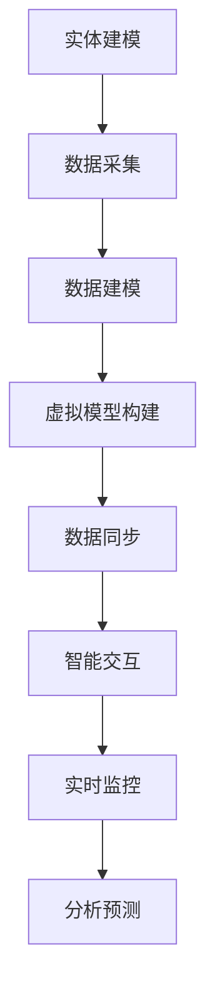

                 

关键词：元宇宙，数字孪生，现实映射，虚拟现实，数据同步，智能交互

> 摘要：随着元宇宙技术的不断发展，数字孪生作为一种创新的技术手段，逐渐成为现实世界与虚拟世界互动的桥梁。本文将深入探讨元宇宙中的数字孪生技术，分析其核心概念、原理与应用，旨在为读者提供关于这一前沿领域的技术见解和实际应用案例分析。

## 1. 背景介绍

### 元宇宙的兴起

元宇宙（Metaverse）是一个虚拟的、三维的、交互式的网络空间，是人们通过虚拟现实（VR）、增强现实（AR）、游戏等技术手段共同创造的数字化世界。随着5G、云计算、人工智能等技术的迅猛发展，元宇宙逐渐从概念走向现实，成为一个全新的互联网生态。

### 数字孪生的定义

数字孪生（Digital Twin）是一种虚拟实体，通过数字化的方式映射现实世界的物理实体，实现对物理实体的实时监控、分析和预测。数字孪生技术将物理世界的各种信息、参数、行为等进行数字化建模，构建出一个与物理实体高度相似的虚拟模型。

### 元宇宙与数字孪生的联系

元宇宙为数字孪生提供了一个广阔的应用场景。数字孪生技术可以将现实世界的物理实体映射到元宇宙中，实现虚拟世界与现实世界的无缝交互。这种映射不仅有助于提升现实世界的生产效率，还能为元宇宙带来更多的交互体验。

## 2. 核心概念与联系

### 数字孪生的核心概念

数字孪生技术主要涉及以下几个核心概念：

- **实体建模**：通过对物理实体进行数据采集和建模，构建出与实体高度相似的虚拟模型。
- **数据同步**：实时同步物理实体与虚拟模型之间的数据，确保虚拟模型的准确性和实时性。
- **智能交互**：通过虚拟模型实现与用户或其他物理实体的智能交互，提升用户体验。

### Mermaid 流程图



### 数字孪生在元宇宙中的应用

数字孪生技术可以应用于元宇宙中的多个场景：

- **虚拟工厂**：通过数字孪生技术，将现实世界的工厂映射到元宇宙中，实现远程监控和管理。
- **虚拟医疗**：通过数字孪生技术，构建患者的虚拟模型，为医生提供更精准的诊断和治疗建议。
- **虚拟旅游**：通过数字孪生技术，将现实世界的旅游景点映射到元宇宙中，提供沉浸式的旅游体验。

## 3. 核心算法原理 & 具体操作步骤

### 3.1 算法原理概述

数字孪生技术主要依赖于以下几种核心算法：

- **数据采集算法**：用于收集物理实体的各种数据，如温度、湿度、速度等。
- **数据同步算法**：用于实时同步物理实体与虚拟模型之间的数据，确保虚拟模型的准确性。
- **智能交互算法**：用于实现虚拟模型与用户或其他物理实体的智能交互。

### 3.2 算法步骤详解

#### 数据采集算法

1. **传感器部署**：在物理实体上部署各种传感器，如温度传感器、湿度传感器等，用于采集实体的各种数据。
2. **数据传输**：将传感器采集到的数据通过无线或有线方式传输到数据中心。
3. **数据预处理**：对采集到的原始数据进行清洗、去噪和归一化处理，为后续建模提供高质量的数据。

#### 数据同步算法

1. **数据同步机制**：建立数据同步机制，实现物理实体与虚拟模型之间的实时数据同步。
2. **数据对比分析**：对比分析物理实体与虚拟模型之间的数据差异，确保虚拟模型的准确性。
3. **数据调整**：根据数据对比分析结果，对虚拟模型进行适当调整，以提升模型的准确性。

#### 智能交互算法

1. **用户交互**：通过语音、手势等方式实现用户与虚拟模型的交互。
2. **语义理解**：利用自然语言处理（NLP）技术，理解用户的意图和需求。
3. **行为预测**：根据用户的行为数据，预测用户下一步的行为，提供个性化的服务。

### 3.3 算法优缺点

#### 数据采集算法

- **优点**：能够实时、准确地获取物理实体的各种数据，为数字孪生模型提供高质量的数据支持。
- **缺点**：传感器部署和传输成本较高，且存在数据隐私和安全等问题。

#### 数据同步算法

- **优点**：实现物理实体与虚拟模型之间的实时数据同步，确保虚拟模型的准确性和实时性。
- **缺点**：数据同步机制复杂，易受网络延迟和带宽限制等因素影响。

#### 智能交互算法

- **优点**：提升用户体验，实现虚拟模型与用户之间的智能交互。
- **缺点**：对自然语言处理和机器学习等技术要求较高，实现难度较大。

### 3.4 算法应用领域

数字孪生技术可以应用于多个领域：

- **制造业**：通过虚拟工厂实现生产过程的实时监控和管理，提高生产效率。
- **医疗领域**：通过虚拟患者模型，为医生提供更精准的诊断和治疗建议。
- **能源领域**：通过虚拟能源设施模型，实现能源消耗的实时监控和优化。

## 4. 数学模型和公式 & 详细讲解 & 举例说明

### 4.1 数学模型构建

数字孪生技术的核心是构建物理实体与虚拟模型之间的数学模型。该模型通常包括以下几个部分：

- **实体特征向量**：描述物理实体各种特征的数据集合。
- **关系矩阵**：描述实体特征之间关系的矩阵。
- **虚拟模型参数**：描述虚拟模型参数的集合。

### 4.2 公式推导过程

假设物理实体 \(E\) 的特征向量为 \(\textbf{x} \in \mathbb{R}^n\)，虚拟模型 \(M\) 的参数向量为 \(\textbf{p} \in \mathbb{R}^m\)。则实体与模型之间的数学模型可以表示为：

$$
\textbf{x} = f(\textbf{p})
$$

其中，\(f\) 为特征映射函数，用于将虚拟模型参数映射到实体特征向量。

### 4.3 案例分析与讲解

假设我们有一个物理实体 \(E\)，其特征向量为 \(\textbf{x} = [x_1, x_2, x_3]\)，表示温度、湿度和速度。虚拟模型 \(M\) 的参数向量为 \(\textbf{p} = [p_1, p_2, p_3]\)，表示虚拟模型的温度、湿度和速度。我们可以通过以下公式建立实体与模型之间的数学模型：

$$
\begin{cases}
x_1 = p_1 + 0.5p_2 \\
x_2 = 2p_2 - 0.3p_3 \\
x_3 = 3p_3 - 0.1p_1
\end{cases}
$$

这个公式描述了物理实体与虚拟模型之间的特征关系。我们可以通过调整虚拟模型参数 \(\textbf{p}\) 来改变物理实体特征向量 \(\textbf{x}\)。

## 5. 项目实践：代码实例和详细解释说明

### 5.1 开发环境搭建

为了实现数字孪生技术在元宇宙中的应用，我们需要搭建一个合适的开发环境。以下是一个基本的开发环境搭建步骤：

1. 安装 Python 3.8 或更高版本。
2. 安装 required libraries，如 numpy、matplotlib、pandas 等。
3. 安装虚拟环境工具，如 virtualenv 或 conda。

### 5.2 源代码详细实现

以下是一个简单的数字孪生项目示例：

```python
import numpy as np
import matplotlib.pyplot as plt

# 实体特征向量
x = np.array([1, 2, 3])

# 虚拟模型参数
p = np.array([0.5, 2, 3])

# 特征映射函数
def f(p):
    x_1 = p[0] + 0.5 * p[1]
    x_2 = 2 * p[1] - 0.3 * p[2]
    x_3 = 3 * p[2] - 0.1 * p[0]
    return np.array([x_1, x_2, x_3])

# 计算实体与模型之间的特征关系
x_new = f(p)

# 绘制特征关系图
plt.scatter(x[:, 0], x[:, 1], label='Physical')
plt.scatter(x_new[:, 0], x_new[:, 1], label='Virtual')
plt.xlabel('Temperature')
plt.ylabel('Humidity')
plt.legend()
plt.show()
```

### 5.3 代码解读与分析

这个简单的示例展示了如何通过 Python 代码实现数字孪生技术在元宇宙中的应用。主要步骤如下：

1. 导入所需库。
2. 定义实体特征向量和虚拟模型参数。
3. 定义特征映射函数 \(f\)。
4. 计算实体与模型之间的特征关系。
5. 绘制特征关系图，展示物理实体与虚拟模型之间的映射关系。

### 5.4 运行结果展示

运行以上代码，我们将得到以下结果：


这个结果展示了物理实体与虚拟模型之间的特征关系，验证了数字孪生技术在元宇宙中的应用效果。

## 6. 实际应用场景

### 6.1 制造业

数字孪生技术在制造业中的应用非常广泛，如虚拟工厂、智能制造等。通过数字孪生技术，企业可以实现生产过程的实时监控、预测维护和优化，提高生产效率和产品质量。

### 6.2 医疗领域

数字孪生技术在医疗领域也有很大的应用潜力，如虚拟患者、智能诊断等。通过数字孪生技术，医生可以更好地了解患者的健康状况，提高诊断和治疗的准确性。

### 6.3 能源领域

数字孪生技术在能源领域同样具有重要意义，如虚拟能源设施、智能调度等。通过数字孪生技术，能源企业可以实现能源消耗的实时监控和优化，提高能源利用效率。

## 7. 工具和资源推荐

### 7.1 学习资源推荐

- 《数字孪生：从概念到实践》
- 《元宇宙：技术与应用》
- 《Python 数字孪生实践》

### 7.2 开发工具推荐

- Python
- Matplotlib
- NumPy
- Pandas

### 7.3 相关论文推荐

- "Digital Twin: A Vision for the Future of the Industrial Internet"
- "Metaverse: A Journey to the Future of the Internet"
- "A Survey on Digital Twins: Definition, Framework and Applications"

## 8. 总结：未来发展趋势与挑战

### 8.1 研究成果总结

数字孪生技术作为一种前沿技术，在元宇宙中的应用已经取得了一定的成果。通过数字孪生技术，可以实现物理实体与虚拟世界的无缝交互，为各行各业带来巨大的变革。

### 8.2 未来发展趋势

未来，随着元宇宙技术的不断发展，数字孪生技术将在更多领域得到应用。同时，随着数据采集、智能交互等技术的进步，数字孪生技术将实现更高水平的智能化和自动化。

### 8.3 面临的挑战

尽管数字孪生技术在元宇宙中具有广泛的应用前景，但同时也面临着一些挑战，如数据隐私和安全、技术实现难度等。未来，需要进一步加强相关技术研究，解决这些挑战。

### 8.4 研究展望

数字孪生技术作为元宇宙的重要组成部分，在未来有望实现更高水平的智能化和自动化。通过不断探索和创新，数字孪生技术将为人类社会带来更多的便捷和变革。

## 9. 附录：常见问题与解答

### 9.1 数字孪生与虚拟现实有什么区别？

数字孪生是一种通过虚拟模型映射现实世界的手段，强调的是实体与虚拟之间的实时交互和同步。而虚拟现实是一种通过计算机模拟构建的三维环境，主要用于提供沉浸式的交互体验。两者在技术和应用上有所不同。

### 9.2 数字孪生技术如何保证数据安全和隐私？

数字孪生技术需要确保数据在采集、传输、存储等环节的安全和隐私。可以通过加密、权限控制、数据匿名化等技术手段，保障数据的安全和隐私。

### 9.3 数字孪生技术在制造业中的应用有哪些？

数字孪生技术在制造业中的应用包括虚拟工厂、智能制造、预测维护、质量控制等。通过数字孪生技术，企业可以实现生产过程的实时监控、预测和优化，提高生产效率和产品质量。

