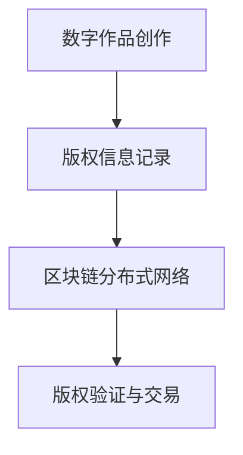
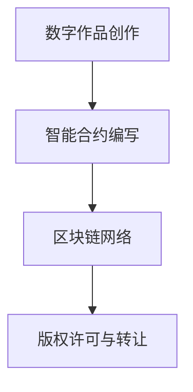
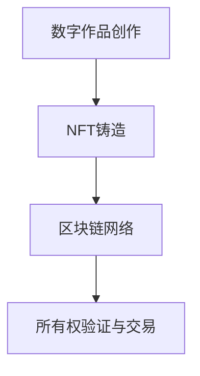
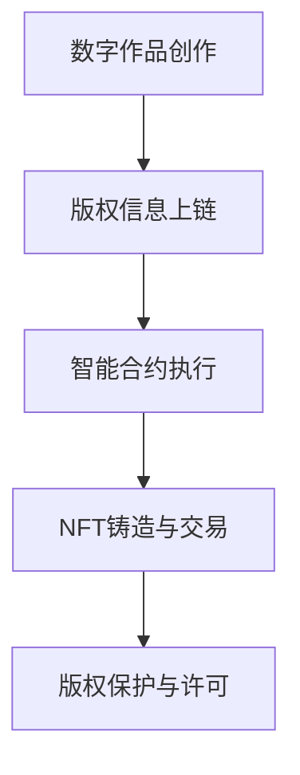

                 

关键词：元宇宙，数字版权，版权归属，区块链，智能合约，NFT，去中心化，数字资产

> 摘要：随着元宇宙的兴起，数字版权的归属问题成为了一个重要的议题。本文旨在探讨元宇宙中的数字版权的新形式，包括区块链、智能合约、NFT等技术在数字版权管理中的应用，以及这些技术如何改变传统的版权归属模式。通过分析这些技术的原理和应用场景，本文提出了数字版权管理的新思路，并展望了未来发展的趋势与挑战。

## 1. 背景介绍

在传统的互联网环境中，数字版权问题一直是一个复杂而棘手的问题。数字内容的复制和分发变得极其容易，而版权所有者的利益却难以得到有效保护。传统的版权管理模式依赖于中心化的机构，如版权局和出版社，这些机构通过法律法规和合同来维护版权所有者的权益。然而，这种方法存在一些问题，如版权纠纷、版权归属不清等。

随着区块链、智能合约和NFT等新兴技术的出现，数字版权管理开始出现新的可能性。元宇宙作为虚拟现实的一个分支，为数字版权提供了一个全新的应用场景。元宇宙是一个由虚拟世界和现实世界交互构成的综合体，用户可以在其中创建、拥有和交易虚拟资产。这些虚拟资产，如数字艺术品、虚拟房地产等，都涉及数字版权的问题。

本文将围绕元宇宙中的数字版权展开讨论，分析区块链、智能合约和NFT等技术在数字版权管理中的应用，探讨这些技术如何改变传统的版权归属模式，并提出数字版权管理的新思路。

## 2. 核心概念与联系

### 2.1 区块链

区块链是一种去中心化的分布式数据库技术，它通过密码学和共识算法确保数据的安全和不可篡改。在数字版权管理中，区块链可以用于记录和验证数字作品的版权信息，确保版权的透明性和不可篡改性。

#### Mermaid 流程图：



### 2.2 智能合约

智能合约是区块链上的自动化执行程序，它可以在满足特定条件时自动执行预定的操作。在数字版权管理中，智能合约可以用于自动执行版权许可、版权转让等操作，提高版权管理的效率和透明度。

#### Mermaid 流程图：



### 2.3 NFT（非同质化代币）

NFT是一种基于区块链技术的数字资产，每个NFT都是独一无二的，无法与其他代币互换。在数字版权管理中，NFT可以用于代表数字作品的唯一所有权，确保数字作品的真实性和稀缺性。

#### Mermaid 流程图：



### 2.4 数字版权管理

数字版权管理是一个涉及版权保护、版权许可和版权交易的综合系统。在元宇宙中，数字版权管理需要利用区块链、智能合约和NFT等技术，实现数字作品的版权透明、可验证和自动化管理。

#### Mermaid 流程图：



## 3. 核心算法原理 & 具体操作步骤

### 3.1 算法原理概述

元宇宙中的数字版权管理算法主要基于区块链、智能合约和NFT技术。该算法的核心原理是通过区块链记录数字作品的版权信息，利用智能合约自动化执行版权操作，并通过NFT实现数字作品的所有权验证和交易。

### 3.2 算法步骤详解

#### 步骤 1：版权信息上链

数字作品创作者将版权信息（如作品名称、作者信息、创作日期等）上传到区块链上，确保版权信息的透明和不可篡改。

#### 步骤 2：智能合约编写

根据版权需求，编写智能合约，定义版权许可、转让等操作的具体规则。智能合约将自动执行这些操作，提高版权管理的效率和透明度。

#### 步骤 3：NFT铸造

数字作品的所有权可以通过NFT进行验证和交易。创作者可以将数字作品铸造为NFT，使其具有唯一性和稀缺性。

#### 步骤 4：版权保护与许可

通过智能合约和区块链技术，数字作品的所有者可以轻松地管理版权，如授权他人使用作品、转让所有权等。

### 3.3 算法优缺点

#### 优点：

1. **透明性与不可篡改性**：区块链技术确保了版权信息的透明和不可篡改，提高了版权管理的可信度。
2. **自动化与高效性**：智能合约自动化执行版权操作，减少了人为干预，提高了版权管理的效率。
3. **唯一性与稀缺性**：NFT技术使数字作品具有唯一性和稀缺性，有助于提升作品的附加值。

#### 缺点：

1. **技术门槛**：区块链和智能合约技术具有一定的复杂度，对于普通用户来说可能难以理解和使用。
2. **存储成本**：区块链上的数据存储成本较高，可能导致一些小规模创作者负担过重。

### 3.4 算法应用领域

1. **数字艺术品**：NFT技术为数字艺术品提供了一个全新的交易和认证平台，艺术家可以通过NFT发行限量版数字画作。
2. **虚拟房地产**：在元宇宙中，虚拟房地产的购买、交易和管理可以通过区块链和智能合约实现，确保交易的透明和合法。
3. **数字音乐**：通过智能合约，音乐制作人可以轻松地管理音乐的版权，如授权他人播放、销售等。

## 4. 数学模型和公式 & 详细讲解 & 举例说明

### 4.1 数学模型构建

在元宇宙中的数字版权管理中，我们可以构建一个基于区块链的数学模型来描述版权的归属和流转。该模型包括以下主要变量：

- \(C\)：版权信息，包括作品名称、作者、创作日期等。
- \(P\)：版权所有者。
- \(L\)：版权许可，包括授权内容、授权期限等。
- \(T\)：版权交易，包括转让对象、转让金额等。
- \(NFT\)：NFT的所有权标识。

### 4.2 公式推导过程

我们假设一个简单的版权交易过程，创作者A将数字作品B的所有权通过NFT \(NFT_B\) 转让给买家C。该过程的数学模型可以表示为：

$$
C = \{NFT_B, P(A), T(C), \text{日期} \}
$$

其中，\(P(A)\) 表示创作者A的所有权，\(T(C)\) 表示版权转让给买家C的操作。

### 4.3 案例分析与讲解

假设创作者A创作了一部数字画作，并将其铸造为NFT \(NFT_A\)。买家B想要购买这幅画作，他们可以通过以下步骤完成交易：

1. **买家B发出购买请求**：买家B通过智能合约向创作者A发送购买请求，请求中包括购买金额和其他交易条款。
2. **创作者A确认交易**：创作者A通过智能合约确认交易，并将NFT \(NFT_A\) 转移给买家B。
3. **交易记录上链**：智能合约将交易记录上链，确保交易的透明和不可篡改。

通过上述过程，我们可以看到版权的所有权和交易流程是如何在区块链上被记录和验证的。

## 5. 项目实践：代码实例和详细解释说明

### 5.1 开发环境搭建

在进行元宇宙中的数字版权管理项目实践前，我们需要搭建一个合适的开发环境。以下是一个基本的开发环境搭建步骤：

1. **安装Node.js**：Node.js 是一个基于 Chrome V8 引擎的 JavaScript 运行环境，用于开发智能合约和区块链应用程序。
2. **安装Truffle**：Truffle 是一个用于智能合约开发、测试和部署的工具，它提供了完整的开发框架。
3. **安装Ganache**：Ganache 是一个本地区块链节点，用于测试智能合约和进行本地交易。
4. **创建项目文件夹**：在本地计算机上创建一个项目文件夹，并使用Truffle初始化项目。

### 5.2 源代码详细实现

以下是一个简单的智能合约示例，用于管理数字作品的版权：

```solidity
// SPDX-License-Identifier: MIT
pragma solidity ^0.8.0;

contract CopyrightManagement {
    // 定义版权结构体
    struct Copyright {
        string artworkName;
        address owner;
        bool isSold;
    }

    // 定义版权映射
    mapping(string => Copyright) public copyrights;

    // 创建新版权
    function createCopyright(string memory artworkName) public {
        copyrights[artworkName] = Copyright(artworkName, msg.sender, false);
    }

    // 转让版权
    function transferCopyright(string memory artworkName, address newOwner) public {
        require(copyrights[artworkName].owner == msg.sender, "Not the owner");
        copyrights[artworkName].owner = newOwner;
    }

    // 标记作品已售出
    function markAsSold(string memory artworkName) public {
        require(copyrights[artworkName].owner == msg.sender, "Not the owner");
        copyrights[artworkName].isSold = true;
    }
}
```

### 5.3 代码解读与分析

上述智能合约定义了版权管理的功能，包括创建版权、转让版权和标记作品已售出。我们来看一下每个函数的实现：

1. **createCopyright**：用于创建新的版权，创作者通过调用此函数将其作品的版权信息记录到区块链上。
2. **transferCopyright**：用于将版权转让给新的所有者。只有当前所有者才能调用此函数，以确保版权的合法转让。
3. **markAsSold**：用于标记作品已被出售。这可以用于跟踪作品的状态，确保版权转让的唯一性。

### 5.4 运行结果展示

为了演示上述智能合约的功能，我们可以使用Truffle和Ganache进行本地测试。以下是一个简单的测试脚本：

```javascript
const CopyrightManagement = artifacts.require("CopyrightManagement");

contract("CopyrightManagement", (accounts) => {
    it("should create and transfer a copyright", async () => {
        const cm = await CopyrightManagement.new();

        // 创建新版权
        await cm.createCopyright("My Artwork", { from: accounts[0] });

        // 检查版权信息
        const artworkName = "My Artwork";
        const copyright = await cm.copyrights(artworkName);
        assert.equal(copyright.owner, accounts[0], "Owner should be accounts[0]");

        // 转让版权
        await cm.transferCopyright(artworkName, accounts[1], { from: accounts[0] });

        // 检查新所有者
        const newOwner = await cm.copyrights(artworkName);
        assert.equal(newOwner.owner, accounts[1], "Owner should be accounts[1]");
    });
});
```

通过上述测试，我们可以验证智能合约的基本功能是否正常工作。

## 6. 实际应用场景

### 6.1 数字艺术品

随着区块链和NFT技术的兴起，数字艺术品市场得到了迅速发展。艺术家可以通过NFT将数字作品铸造成唯一性的数字资产，并进行公开销售。这种方式不仅提高了艺术品的附加值，还为艺术家提供了一个全新的商业模式。

### 6.2 虚拟房地产

在元宇宙中，虚拟房地产成为一个重要的应用场景。用户可以购买虚拟土地，并利用智能合约进行租赁、出售等操作。这种方式为虚拟世界中的经济发展提供了一个基础设施。

### 6.3 数字音乐

数字音乐领域也受到了区块链和NFT技术的影响。音乐制作人可以通过智能合约发行限量版的数字专辑，并通过NFT验证其唯一性和真实性。这种方式不仅保护了音乐制作人的版权，还提高了音乐作品的价值。

### 6.4 其他应用场景

除了上述领域外，数字版权管理在数字文学、虚拟角色、游戏道具等方面也有广泛的应用。通过区块链和NFT技术，这些数字资产的所有权和流转变得更加透明和可验证。

## 7. 未来应用展望

### 7.1 跨链互操作性

随着区块链技术的发展，不同区块链之间的互操作性变得越来越重要。未来，数字版权管理需要实现跨链互操作性，以便更好地整合不同区块链上的数字资产。

### 7.2 智能合约标准化

智能合约的标准化是实现高效数字版权管理的关键。未来，需要制定一套统一的智能合约标准，以确保不同区块链和应用平台之间的兼容性。

### 7.3 法律法规的完善

尽管区块链和NFT技术为数字版权管理提供了一种新的解决方案，但法律法规的完善仍然是必不可少的。未来，需要制定一套适用于元宇宙的数字版权法律法规，以保护版权所有者的合法权益。

### 7.4 技术普及与教育

区块链和NFT技术的普及和教育也是未来发展的关键。通过提高公众对数字版权管理技术的认知和接受度，可以进一步推动这一领域的发展。

## 8. 总结：未来发展趋势与挑战

### 8.1 研究成果总结

本文探讨了元宇宙中的数字版权管理问题，分析了区块链、智能合约和NFT等技术在数字版权管理中的应用。通过构建数学模型和项目实践，我们展示了这些技术在数字版权管理中的潜力。

### 8.2 未来发展趋势

未来，数字版权管理将继续在区块链和NFT技术的推动下发展。跨链互操作性、智能合约标准化、法律法规的完善以及技术普及与教育将是未来发展的主要趋势。

### 8.3 面临的挑战

尽管数字版权管理技术在元宇宙中具有巨大潜力，但仍然面临一些挑战。技术门槛、存储成本、法律法规的完善以及公众的接受度等问题需要进一步解决。

### 8.4 研究展望

未来，我们需要进一步研究如何提高数字版权管理的效率和安全性，探索新的应用场景，并推动区块链和NFT技术的普及和应用。

## 9. 附录：常见问题与解答

### 9.1 什么是NFT？

NFT（非同质化代币）是一种基于区块链技术的数字资产，每个NFT都是独一无二的，无法与其他代币互换。NFT可以用于代表数字作品的所有权、验证数字作品的真实性等。

### 9.2 区块链技术如何保障数字版权的透明性和不可篡改性？

区块链技术通过分布式账本和密码学确保数字版权信息的透明和不可篡改。每个区块中的交易记录都是加密的，并且通过共识算法验证和确认，确保数据的完整性和安全性。

### 9.3 智能合约在数字版权管理中如何发挥作用？

智能合约是区块链上的自动化执行程序，它可以在满足特定条件时自动执行预定的操作。在数字版权管理中，智能合约用于自动化版权许可、转让等操作，提高版权管理的效率和透明度。

### 9.4 数字版权管理与传统版权管理有何不同？

传统版权管理依赖于中心化的机构，如版权局和出版社。而数字版权管理利用区块链、智能合约和NFT等去中心化技术，实现数字版权的透明、可验证和自动化管理。

### 9.5 数字版权管理在元宇宙中的应用前景如何？

数字版权管理在元宇宙中具有广泛的应用前景。通过区块链和NFT技术，元宇宙中的数字资产可以实现透明、可验证和自动化管理，为艺术家、创作者和版权所有者提供新的商业模式和权益保障。未来，随着技术的进一步发展，数字版权管理将在元宇宙中发挥越来越重要的作用。

---

作者：禅与计算机程序设计艺术 / Zen and the Art of Computer Programming

