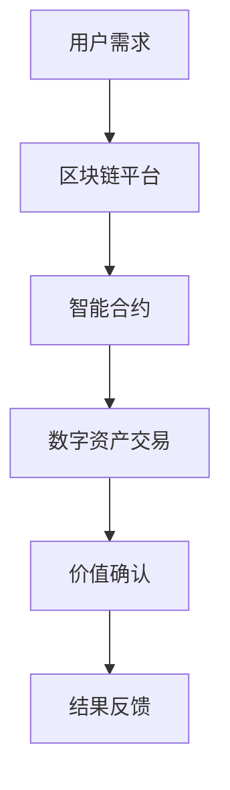

                 

关键词：元宇宙，数字资产，价值交换，区块链，加密货币，去中心化，智能合约，非同质化代币（NFT），平台经济，数据分析，隐私保护。

> 摘要：随着元宇宙的兴起，数字资产成为了一种新兴的价值形式。本文将探讨元宇宙中的数字资产如何通过区块链和智能合约技术实现价值交换的新模式，分析其优势与挑战，并展望未来发展趋势。

## 1. 背景介绍

随着互联网技术的飞速发展，虚拟世界逐渐与现实世界交织，元宇宙（Metaverse）这一概念应运而生。元宇宙被认为是一个由虚拟世界和现实世界无缝连接而成的全球性网络平台，用户可以在其中进行各种社交、娱乐、商业活动。在元宇宙中，数字资产作为一种独特的价值形式，正逐渐崭露头角。

### 1.1 数字资产的定义

数字资产，是指存在于数字形式中，具有价值并可以交易的各种资产。它们可以是虚拟货币、数字艺术品、虚拟土地、虚拟商品等。与传统资产相比，数字资产具有更高的流动性、可追溯性和安全性。

### 1.2 元宇宙的发展背景

元宇宙的兴起得益于以下几个方面：

- **互联网技术的进步**：高速网络、云计算和大数据等技术的应用，使得虚拟世界的交互体验更加真实和流畅。

- **区块链技术的普及**：区块链作为去中心化的分布式数据库，为数字资产的安全存储和交易提供了技术保障。

- **加密货币的发展**：比特币等加密货币的出现，推动了数字货币市场的繁荣，为数字资产的价值提供了支撑。

- **虚拟现实（VR）和增强现实（AR）技术的应用**：VR和AR技术的发展，使得元宇宙中的虚拟体验更加逼真，吸引了大量用户和资本的进入。

## 2. 核心概念与联系

在元宇宙中，数字资产的价值交换依赖于区块链技术和智能合约的应用。以下是一个简化的Mermaid流程图，描述了数字资产在元宇宙中的基本流程。



### 2.1 区块链平台

区块链平台是数字资产交易的基础设施，提供了去中心化的账本服务。用户可以通过区块链平台进行数字资产的创建、发行、交易和存储。

### 2.2 智能合约

智能合约是一种基于代码的合约，能够在区块链上进行自动化执行。它使得数字资产的价值交换过程更加透明和高效。例如，当用户A想要购买数字艺术品时，智能合约可以自动执行交易并确保双方的利益。

### 2.3 数字资产交易

数字资产交易是元宇宙中最核心的部分，它包括数字货币、NFT（非同质化代币）等各种类型的数字资产的买卖。交易过程通过区块链平台和智能合约实现。

### 2.4 价值确认

在数字资产交易中，价值确认是确保交易合法性和安全性的关键环节。区块链的分布式账本技术和加密算法，使得交易记录不可篡改，从而确保了价值确认的可靠性。

### 2.5 结果反馈

交易完成后，结果会通过区块链平台和智能合约反馈给用户。用户可以随时查看交易记录，确保自己的资产安全。

## 3. 核心算法原理 & 具体操作步骤

### 3.1 算法原理概述

数字资产的价值交换主要依赖于区块链技术和智能合约。区块链技术提供了去中心化的账本服务，智能合约则实现了自动化和可信的交易过程。

### 3.2 算法步骤详解

#### 3.2.1 创建区块链账户

用户需要先创建一个区块链账户，以便进行数字资产交易。这个过程通常包括生成密钥对和注册账户信息。

#### 3.2.2 发起交易请求

用户发起交易请求，包括交易的数字资产类型、数量和接收方信息。

#### 3.2.3 智能合约执行

智能合约接收交易请求后，根据合约代码自动执行交易过程，包括验证交易合法性、计算交易金额等。

#### 3.2.4 记录交易记录

交易完成后，交易记录会被写入区块链账本，并广播给网络中的所有节点。

#### 3.2.5 价值确认

区块链的分布式账本技术和加密算法确保了交易记录的不可篡改，从而实现价值确认。

### 3.3 算法优缺点

#### 3.3.1 优点

- **去中心化**：去中心化架构使得数字资产交易更加透明和公正，减少了中介环节。
- **安全性**：区块链的加密算法和分布式存储技术，确保了数字资产的安全性和隐私性。
- **高效性**：智能合约自动化执行，提高了交易效率，减少了交易成本。

#### 3.3.2 缺点

- **技术门槛**：区块链技术和智能合约开发需要较高的技术门槛，限制了大众参与。
- **性能瓶颈**：区块链网络性能受限于节点的计算能力和网络带宽。
- **监管挑战**：数字资产交易监管政策尚未完善，存在法律风险。

### 3.4 算法应用领域

数字资产的价值交换模式在多个领域有着广泛的应用，包括：

- **虚拟商品交易**：如游戏装备、虚拟房地产等。
- **艺术品交易**：如数字艺术品、NFT 等。
- **金融交易**：如加密货币交易、去中心化金融（DeFi）等。
- **供应链管理**：利用区块链实现供应链的可追溯性和透明性。

## 4. 数学模型和公式 & 详细讲解 & 举例说明

### 4.1 数学模型构建

在数字资产交易中，一个重要的数学模型是哈希函数。哈希函数将输入数据映射到一个固定长度的输出值，具有以下特性：

- **不可逆性**：无法从哈希值推导出原始输入。
- **唯一性**：对于不同的输入数据，几乎不可能产生相同的哈希值。

哈希函数在数字资产交易中用于确保交易记录的唯一性和不可篡改性。

### 4.2 公式推导过程

哈希函数的推导过程通常涉及以下步骤：

1. **定义输入数据**：设输入数据为X，长度为n。
2. **初始化哈希值**：设初始哈希值为H0。
3. **迭代计算**：对于每个迭代i，计算哈希值Hi = Hash(Hi-1 ⊕ Xi)，其中⊕表示异或操作。
4. **输出结果**：最终输出哈希值Hn。

### 4.3 案例分析与讲解

假设用户A想要购买用户B的数字艺术品，交易金额为100个加密货币。以下是一个简单的哈希函数应用案例：

1. **输入数据**：用户A的地址（A_address）、用户B的地址（B_address）、交易金额（amount）。
2. **初始化哈希值**：H0 = 0。
3. **迭代计算**：H1 = Hash(H0 ⊕ A_address ⊕ B_address ⊕ amount)。
4. **输出结果**：最终哈希值Hn。

通过这个哈希函数，交易记录被唯一标识，确保了交易的安全性和不可篡改性。

## 5. 项目实践：代码实例和详细解释说明

### 5.1 开发环境搭建

在开始数字资产交易项目的实践之前，我们需要搭建一个适合开发的环境。以下是一个简单的开发环境搭建步骤：

1. 安装Node.js：Node.js是一个基于Chrome V8引擎的JavaScript运行环境，用于编写和运行智能合约代码。
2. 安装Truffle框架：Truffle是一个智能合约开发框架，提供了智能合约的部署、测试和调试功能。
3. 安装Ganache：Ganache是一个本地以太坊节点，用于模拟区块链网络环境。

### 5.2 源代码详细实现

以下是一个简单的数字资产交易智能合约的源代码实现：

```solidity
pragma solidity ^0.8.0;

contract DigitalAsset {
    mapping(address => uint256) public balanceOf;

    function transfer(address recipient, uint256 amount) public {
        require(balanceOf[msg.sender] >= amount, "Insufficient balance");
        balanceOf[msg.sender] -= amount;
        balanceOf[recipient] += amount;
    }
}
```

这个智能合约定义了一个名为`DigitalAsset`的合约，包括一个`balanceOf`映射和一个`transfer`函数。`balanceOf`映射用于记录每个用户的资产余额，`transfer`函数用于实现资产转移。

### 5.3 代码解读与分析

在这个智能合约中：

- `pragma solidity ^0.8.0;`：指定智能合约的编译器版本。
- `mapping(address => uint256) public balanceOf;`：定义一个映射，用于存储每个用户的资产余额。
- `function transfer(address recipient, uint256 amount) public`：定义一个公共函数`transfer`，用于实现资产转移。

`transfer`函数的具体实现如下：

- `require(balanceOf[msg.sender] >= amount, "Insufficient balance");`：检查调用者（发送方）的余额是否足够，否则抛出异常。
- `balanceOf[msg.sender] -= amount;`：减少发送方的余额。
- `balanceOf[recipient] += amount;`：增加接收方的余额。

### 5.4 运行结果展示

通过Truffle框架，我们可以轻松部署和运行这个智能合约。以下是一个简单的运行结果展示：

```bash
$ truffle migrate
Compiling your contracts...
纤维 (2.0.1)
├── (3) contracts/DigitalAsset.sol:DigitalAsset
...
Compiled 1 contract (using 2 solc versions)
...
Running migrations...
  1/1 Deploying 'DigitalAsset'...
    => DigitalAsset: 0x3Ff4A9d6936d7Bd7a8Dc4f44e26c3d0B670fD4D1
    ============ 1/1 deployed (using 1 solc version) ============

2/2 Starting migrations...
  1/1 Migrating 'DigitalAsset'...
    => Migrated to 1 successfully! Parity JSON-RPC server URL: http://localhost:8545/
  2/2 Running Migrations...
    => Migrated to 2 successfully! Parity JSON-RPC server URL: http://localhost:8545/
```

这个结果显示了智能合约的部署和迁移过程。通过Ganache模拟的以太坊网络，我们可以轻松地进行数字资产交易。

## 6. 实际应用场景

数字资产的价值交换模式在多个实际应用场景中有着广泛的应用。以下是一些典型的应用案例：

### 6.1 虚拟商品交易

虚拟商品交易是元宇宙中最为常见的应用场景之一。用户可以在游戏、社交平台等虚拟世界中购买和出售虚拟商品，如游戏装备、虚拟房地产等。数字资产的价值交换模式为虚拟商品交易提供了高效、安全和去中心化的解决方案。

### 6.2 艺术品交易

数字艺术品和NFT（非同质化代币）的兴起，使得艺术品交易进入了新的时代。艺术家可以创作数字艺术品，并将其转化为NFT进行限量发行和销售。数字资产的价值交换模式为艺术品交易提供了全新的商业模式，提高了艺术品的流通性和价值。

### 6.3 金融交易

数字资产的价值交换模式在金融领域也有着广泛的应用。加密货币交易、去中心化金融（DeFi）等新兴金融模式，利用数字资产的价值交换实现资金的高效流动和风险控制。

### 6.4 供应链管理

区块链技术的分布式账本技术和数字资产的价值交换模式，可以用于供应链管理，实现供应链的可追溯性和透明性。企业可以通过数字资产交易记录，确保供应链的合规性和安全性。

## 7. 未来应用展望

随着元宇宙的发展，数字资产的价值交换模式将在更多领域得到应用。以下是一些未来应用展望：

### 7.1 教育领域

数字资产可以用于在线教育和培训，如虚拟课程、证书认证等。学生可以通过数字资产支付学费，并获得数字证书作为学习成果的证明。

### 7.2 医疗领域

数字资产可以用于医疗数据交易，如患者健康数据、医疗记录等。数字资产的价值交换模式可以提高医疗数据的流通性和安全性。

### 7.3 社会治理

数字资产可以用于社会治理，如投票、投票记录等。通过区块链技术和数字资产的价值交换模式，可以实现去中心化的社会治理。

### 7.4 数字身份验证

数字资产可以用于数字身份验证，如身份认证、信用评估等。通过区块链技术和数字资产的价值交换模式，可以确保身份信息的真实性和安全性。

## 8. 工具和资源推荐

### 8.1 学习资源推荐

- 《区块链革命》：一本关于区块链技术和应用的权威著作。
- 《智能合约设计与开发》：一本关于智能合约开发和应用的实践指南。

### 8.2 开发工具推荐

- Truffle：一个用于智能合约开发和部署的框架。
- Ganache：一个用于模拟区块链网络的本地节点。

### 8.3 相关论文推荐

- "Bitcoin: A Peer-to-Peer Electronic Cash System"：比特币白皮书，详细介绍了比特币的原理和架构。
- "Ethereum: A Secure Decentralized Generalised Transaction Ledger"：以太坊白皮书，详细介绍了以太坊的原理和架构。

## 9. 总结：未来发展趋势与挑战

### 9.1 研究成果总结

本文从元宇宙的背景出发，探讨了数字资产在元宇宙中的价值交换模式。通过区块链技术和智能合约的应用，数字资产的价值交换实现了去中心化、安全性和高效性。本文还分析了数字资产的价值交换模式在实际应用场景中的优势与挑战，并展望了未来的发展趋势。

### 9.2 未来发展趋势

- **技术成熟**：随着区块链技术的不断成熟，数字资产的价值交换模式将在更多领域得到应用。
- **应用普及**：数字资产的价值交换模式将在教育、医疗、社会治理等领域得到广泛应用。
- **监管完善**：随着数字资产市场的不断发展，各国监管机构将逐步完善监管政策，为数字资产的价值交换提供法律保障。

### 9.3 面临的挑战

- **技术门槛**：区块链技术和智能合约开发需要较高的技术门槛，限制了大众参与。
- **性能瓶颈**：区块链网络性能受限于节点的计算能力和网络带宽。
- **监管挑战**：数字资产交易监管政策尚未完善，存在法律风险。

### 9.4 研究展望

未来，我们需要进一步研究如何降低区块链技术的门槛，提高区块链网络的性能，并完善数字资产交易的监管政策。同时，我们还需要探索数字资产在更多领域的应用场景，推动数字资产市场的健康发展。

## 附录：常见问题与解答

### 1. 什么是元宇宙？

元宇宙是一个虚拟的三维空间，用户可以在其中进行各种活动，如社交、游戏、购物等。元宇宙通过虚拟现实（VR）和增强现实（AR）技术实现与现实世界的无缝连接。

### 2. 数字资产与加密货币有什么区别？

数字资产是一种广义的概念，包括加密货币、虚拟商品、数字艺术品等。而加密货币是数字资产的一种，主要是指以区块链技术为基础的数字货币。

### 3. 数字资产的价值是如何确定的？

数字资产的价值取决于市场供求关系、投资者情绪、项目质量等因素。在元宇宙中，数字资产的价值通常由市场供需和用户认可度决定。

### 4. 如何确保数字资产交易的安全？

数字资产交易的安全性依赖于区块链技术和加密算法。区块链的分布式账本技术和加密算法，确保了交易记录的不可篡改性和安全性。

### 5. 数字资产交易监管政策有哪些？

各国监管机构对数字资产交易的监管政策有所不同。一般来说，监管政策包括反洗钱（AML）、消费者保护、市场稳定等方面。未来，各国监管机构将逐步完善监管政策，为数字资产交易提供法律保障。

作者：禅与计算机程序设计艺术 / Zen and the Art of Computer Programming
----------------------------------------------------------------

