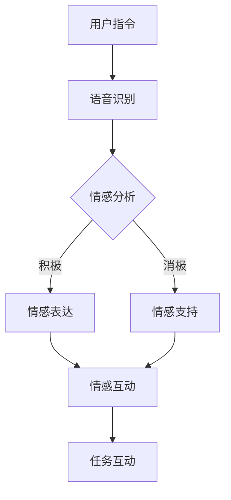
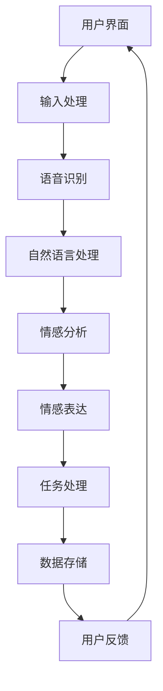

                 

关键词：元宇宙、虚拟宠物、情感陪伴、人工智能、互动体验

## 摘要

本文探讨了元宇宙中虚拟宠物的概念、设计理念及其对人类情感陪伴的影响。通过介绍虚拟宠物的核心技术、情感互动机制和用户参与方式，文章分析了虚拟宠物在元宇宙中的应用场景，并展望了其未来的发展趋势和挑战。本文旨在为读者提供一个全面了解虚拟宠物在情感陪伴方面的新形式，以及其在元宇宙这一新兴领域中的潜力和价值。

## 1. 背景介绍

随着科技的迅猛发展，虚拟现实（VR）和增强现实（AR）技术逐渐走进了人们的生活。元宇宙（Metaverse）作为这些技术的集大成者，正成为一个全新的虚拟世界。在这个世界中，人们可以自由探索、社交、工作、娱乐，甚至是拥有自己的虚拟宠物。

虚拟宠物并非新概念，早在电子游戏和虚拟世界中就有虚拟宠物的身影。然而，随着人工智能（AI）和机器学习（ML）技术的不断进步，虚拟宠物开始具备了更高的智能和情感互动能力。元宇宙中的虚拟宠物不仅是一个简单的游戏角色，更是具有情感和个性的智能实体，能够与用户建立深厚的情感联系。

### 1.1 元宇宙的定义与特点

元宇宙是一个基于虚拟现实和增强现实技术的虚拟世界，用户可以通过VR头盔、AR眼镜等设备进入这个虚拟空间。元宇宙具有以下几个显著特点：

1. **沉浸式体验**：用户能够全身心地沉浸在虚拟世界中，与虚拟环境和其他用户进行互动。
2. **高度自由性**：用户可以在元宇宙中自由探索、创建、改变虚拟世界，实现自己的虚拟梦想。
3. **丰富交互性**：用户不仅可以与虚拟角色互动，还能与其他真实用户以及虚拟角色进行复杂的社交互动。
4. **经济系统**：元宇宙拥有自己的虚拟货币和经济体系，用户可以通过交易、工作等方式获得虚拟财富。

### 1.2 虚拟宠物的发展历程

虚拟宠物的概念可以追溯到早期的电子游戏，如《马里奥》和《宠物小精灵》等。这些虚拟宠物虽然具有可爱的外观和简单的互动功能，但缺乏情感和智能。随着计算机图形学和AI技术的进步，虚拟宠物逐渐变得更加逼真和智能。

在元宇宙中，虚拟宠物不再只是一个简单的游戏角色，而是一个具有情感和智能的实体。它们可以与用户建立情感联系，提供陪伴和慰藉。虚拟宠物的发展历程可以分为以下几个阶段：

1. **游戏宠物**：早期的虚拟宠物主要出现在游戏中，用户可以通过完成任务、战斗等方式与宠物互动。
2. **虚拟宠物应用**：随着AR和VR技术的发展，虚拟宠物开始应用于社交应用和互动体验中，如《Zooba》和《Petting Zoo》等。
3. **智能虚拟宠物**：AI和机器学习技术的应用使得虚拟宠物具备了更高的智能和情感互动能力，能够在元宇宙中与用户建立深厚的情感联系。

## 2. 核心概念与联系

### 2.1 虚拟宠物的定义

虚拟宠物是指在元宇宙中具有情感、个性和智能的虚拟生物，它们可以与用户建立情感联系，提供陪伴和慰藉。虚拟宠物的特点包括：

1. **情感表达**：虚拟宠物能够通过面部表情、肢体动作和声音表达情感，如喜悦、悲伤、愤怒等。
2. **个性特点**：虚拟宠物具有独特的个性和喜好，如喜好某种食物、游戏或活动。
3. **智能互动**：虚拟宠物能够通过机器学习和自然语言处理技术理解用户的指令和情感，进行智能互动。

### 2.2 情感陪伴的概念

情感陪伴是指通过情感互动和情感支持来满足人类的情感需求。在现实生活中，宠物可以作为人类的情感伴侣，提供陪伴和慰藉。在元宇宙中，虚拟宠物同样可以扮演这一角色，通过情感互动来满足用户的情感需求。

### 2.3 虚拟宠物与情感陪伴的联系

虚拟宠物在元宇宙中与用户建立情感联系，提供情感陪伴，具有以下几个方面的联系：

1. **情感互动**：虚拟宠物能够通过情感表达和互动来满足用户的情感需求，如喜悦、悲伤、愤怒等。
2. **情感支持**：虚拟宠物可以在用户遇到困难或压力时提供情感支持，帮助用户缓解负面情绪。
3. **情感依赖**：随着虚拟宠物与用户互动的深入，用户可能会对虚拟宠物产生情感依赖，将其视为自己的情感伴侣。

### 2.4 虚拟宠物在元宇宙中的互动机制

虚拟宠物在元宇宙中的互动机制主要包括以下几个方面：

1. **语音互动**：用户可以通过语音与虚拟宠物交流，虚拟宠物会根据用户的语音内容进行相应的回应。
2. **肢体互动**：用户可以通过控制虚拟宠物的动作和表情来与虚拟宠物互动，如拥抱、抚摸等。
3. **任务互动**：虚拟宠物可以接受用户的任务，如寻找物品、完成任务等，用户需要与虚拟宠物合作完成任务。
4. **情感互动**：虚拟宠物能够根据用户的情感状态进行相应的情感回应，如安慰、鼓励等。

### 2.5 Mermaid 流程图

下面是一个简化的Mermaid流程图，展示了虚拟宠物在元宇宙中的互动机制：



### 2.6 虚拟宠物的核心技术与架构

虚拟宠物的实现需要依赖多种核心技术，包括AI、机器学习、自然语言处理等。下面是一个简化的虚拟宠物技术架构图：



## 3. 核心算法原理 & 具体操作步骤

### 3.1 算法原理概述

虚拟宠物在元宇宙中的核心算法主要包括情感分析、情感表达和任务处理等。这些算法的实现依赖于机器学习和自然语言处理技术。

1. **情感分析**：情感分析算法用于分析用户的语音和文本输入，识别用户的情感状态。
2. **情感表达**：情感表达算法用于根据用户的情感状态生成相应的情感表达，如面部表情、肢体动作和声音。
3. **任务处理**：任务处理算法用于根据用户的指令和任务要求，指导虚拟宠物的行为。

### 3.2 算法步骤详解

1. **情感分析算法步骤**：

   - **数据收集**：收集用户的语音和文本数据，用于训练情感分析模型。
   - **特征提取**：对语音和文本数据进行特征提取，如音频特征、文本特征等。
   - **模型训练**：使用机器学习算法（如卷积神经网络、循环神经网络等）训练情感分析模型。
   - **情感识别**：根据用户的语音和文本输入，实时识别用户的情感状态。

2. **情感表达算法步骤**：

   - **情感识别**：根据情感分析结果，确定用户的情感状态。
   - **表达生成**：根据情感状态，生成相应的情感表达，如面部表情、肢体动作和声音。
   - **反馈调整**：根据用户的反馈，调整情感表达，以实现更好的情感互动。

3. **任务处理算法步骤**：

   - **指令识别**：根据用户的指令，识别任务要求。
   - **任务规划**：根据任务要求，规划虚拟宠物的行为。
   - **行为执行**：指导虚拟宠物执行任务。
   - **结果反馈**：根据任务执行结果，反馈给用户。

### 3.3 算法优缺点

1. **情感分析算法**：

   - **优点**：能够实时识别用户的情感状态，为情感表达和任务处理提供依据。
   - **缺点**：情感分析模型的准确性受限于训练数据的质量和算法的复杂性。

2. **情感表达算法**：

   - **优点**：能够实现与用户的情感互动，提高用户的参与感和体验。
   - **缺点**：情感表达的真实性和自然性受限于技术和硬件的限制。

3. **任务处理算法**：

   - **优点**：能够实现虚拟宠物与用户的任务互动，丰富用户的虚拟生活。
   - **缺点**：任务规划的复杂度和执行效率受限于算法的优化程度。

### 3.4 算法应用领域

虚拟宠物的核心算法在元宇宙中的应用领域广泛，包括但不限于以下几个方面：

1. **虚拟社交**：通过情感分析和情感表达，实现虚拟宠物与用户的情感互动，提高社交体验。
2. **虚拟教育**：通过任务处理算法，指导虚拟宠物进行教育任务，提供个性化的学习体验。
3. **虚拟娱乐**：通过任务处理和情感表达，实现虚拟宠物与用户的互动娱乐，丰富虚拟生活。
4. **虚拟医疗**：通过情感分析和任务处理，为用户提供情感支持和康复指导。

## 4. 数学模型和公式 & 详细讲解 & 举例说明

### 4.1 数学模型构建

虚拟宠物的情感分析、情感表达和任务处理等算法的实现需要依赖多个数学模型。下面将简要介绍这些数学模型的基本原理和公式。

1. **情感分析模型**：

   - **模型类型**：常用的情感分析模型包括卷积神经网络（CNN）、循环神经网络（RNN）和长短期记忆网络（LSTM）等。
   - **模型公式**：以LSTM为例，其基本公式如下：

     $$ h_t = \sigma(W_h \cdot [h_{t-1}, x_t] + b_h) $$
     $$ i_t = \sigma(W_i \cdot [h_{t-1}, x_t] + b_i) $$
     $$ f_t = \sigma(W_f \cdot [h_{t-1}, x_t] + b_f) $$
     $$ o_t = \sigma(W_o \cdot [h_{t-1}, x_t] + b_o) $$
     $$ c_t = f_t \cdot c_{t-1} + i_t \cdot \sigma(W_c \cdot [h_{t-1}, x_t] + b_c) $$
     $$ h_t = o_t \cdot \sigma(c_t) $$

     其中，$h_t$ 和 $c_t$ 分别为隐藏状态和细胞状态，$x_t$ 为输入特征，$W_h, W_i, W_f, W_o, W_c$ 为权重矩阵，$b_h, b_i, b_f, b_o, b_c$ 为偏置项，$\sigma$ 为激活函数。

2. **情感表达模型**：

   - **模型类型**：情感表达模型通常采用生成对抗网络（GAN）或多任务学习（MTL）等方法。
   - **模型公式**：以GAN为例，其基本公式如下：

     $$ G(z) = x $$
     $$ D(x) = \mathbb{E}_{x \sim p_{\text{data}}(x)}[D(x)] - \mathbb{E}_{z \sim p_{\text{noise}}(z)}[D(G(z))] $$

     其中，$G(z)$ 为生成器，$D(x)$ 为判别器，$z$ 为噪声，$x$ 为生成的虚拟表情。

3. **任务处理模型**：

   - **模型类型**：任务处理模型通常采用强化学习（RL）或策略梯度（PG）等方法。
   - **模型公式**：以强化学习为例，其基本公式如下：

     $$ Q(s, a) = r + \gamma \max_{a'} Q(s', a') $$
     $$ \pi(a|s) = \frac{e^{\theta(s, a)}}{\sum_a e^{\theta(s, a)}} $$

     其中，$Q(s, a)$ 为状态-动作值函数，$r$ 为即时奖励，$\gamma$ 为折扣因子，$\theta(s, a)$ 为策略网络的参数，$\pi(a|s)$ 为策略。

### 4.2 公式推导过程

以LSTM为例，下面简要介绍其基本公式的推导过程。

1. **细胞状态更新**：

   - **遗忘门**：遗忘门用于决定之前的细胞状态中哪些信息需要遗忘。

     $$ f_t = \sigma(W_f \cdot [h_{t-1}, x_t] + b_f) $$

     其中，$f_t$ 为遗忘门的输出，$W_f$ 为遗忘门权重矩阵，$b_f$ 为遗忘门偏置项。

   - **输入门**：输入门用于决定新的信息中哪些内容需要更新到细胞状态。

     $$ i_t = \sigma(W_i \cdot [h_{t-1}, x_t] + b_i) $$

     其中，$i_t$ 为输入门的输出，$W_i$ 为输入门权重矩阵，$b_i$ 为输入门偏置项。

   - **细胞状态更新**：

     $$ \tilde{c}_t = \sigma(W_c \cdot [h_{t-1}, x_t] + b_c) $$
     $$ c_t = f_t \cdot c_{t-1} + i_t \cdot \tilde{c}_t $$

     其中，$\tilde{c}_t$ 为新的细胞状态，$c_{t-1}$ 为之前的细胞状态。

2. **隐藏状态更新**：

   - **输出门**：输出门用于决定新的细胞状态中哪些信息需要传递到隐藏状态。

     $$ o_t = \sigma(W_o \cdot [h_{t-1}, x_t] + b_o) $$

     其中，$o_t$ 为输出门的输出，$W_o$ 为输出门权重矩阵，$b_o$ 为输出门偏置项。

   - **隐藏状态更新**：

     $$ h_t = o_t \cdot \sigma(c_t) $$

     其中，$h_t$ 为新的隐藏状态。

### 4.3 案例分析与讲解

以情感分析为例，下面将介绍一个简单的案例，展示如何使用LSTM模型进行情感分析。

1. **数据准备**：

   假设我们有一个包含情感标签的文本数据集，其中每个文本数据对应一个情感标签（积极、消极）。数据集如下：

   ```
   文本1：我喜欢这个虚拟宠物，它太可爱了。
   情感标签1：积极

   文本2：这个虚拟宠物真的很讨厌，我不想玩了。
   情感标签2：消极

   文本3：我对这个虚拟宠物的情感很难说，有点爱有点恨。
   情感标签3：中性
   ```

2. **数据预处理**：

   - **文本分词**：将文本数据分词，提取文本特征。
   - **特征提取**：使用词嵌入技术（如Word2Vec、GloVe等）将文本特征转换为向量。

3. **模型构建**：

   - **输入层**：将处理后的文本特征作为输入层。
   - **LSTM层**：添加一个LSTM层，用于提取文本的情感特征。
   - **输出层**：添加一个全连接层，用于输出情感标签。

4. **模型训练**：

   - **损失函数**：使用交叉熵损失函数来评估模型预测的准确性。
   - **优化器**：使用Adam优化器来优化模型参数。

5. **模型评估**：

   - **准确率**：计算模型预测的准确率，评估模型性能。

   实际训练和评估过程中，可以使用Python的TensorFlow或PyTorch等深度学习框架来实现。

## 5. 项目实践：代码实例和详细解释说明

### 5.1 开发环境搭建

为了实现虚拟宠物的情感分析、情感表达和任务处理等功能，我们需要搭建一个完整的开发环境。以下是一个基本的开发环境搭建步骤：

1. **安装Python**：确保系统已安装Python 3.8或更高版本。
2. **安装TensorFlow**：使用以下命令安装TensorFlow：

   ```shell
   pip install tensorflow
   ```

3. **安装Keras**：使用以下命令安装Keras，Keras是一个简化的TensorFlow接口：

   ```shell
   pip install keras
   ```

4. **安装其他依赖库**：根据项目需求，安装其他必要的依赖库，如NumPy、Pandas等。

### 5.2 源代码详细实现

下面是一个简单的虚拟宠物情感分析项目的源代码示例。该示例包含数据预处理、模型构建和训练等步骤。

```python
import numpy as np
import pandas as pd
from keras.models import Sequential
from keras.layers import LSTM, Dense, Embedding
from keras.preprocessing.text import Tokenizer
from keras.preprocessing.sequence import pad_sequences

# 数据准备
data = pd.read_csv('data.csv')
texts = data['text']
labels = data['label']

# 数据预处理
tokenizer = Tokenizer(num_words=10000)
tokenizer.fit_on_texts(texts)
sequences = tokenizer.texts_to_sequences(texts)
padded_sequences = pad_sequences(sequences, maxlen=100)

# 模型构建
model = Sequential()
model.add(Embedding(10000, 16, input_length=100))
model.add(LSTM(128))
model.add(Dense(1, activation='sigmoid'))

# 模型编译
model.compile(optimizer='adam', loss='binary_crossentropy', metrics=['accuracy'])

# 模型训练
model.fit(padded_sequences, np.array(labels), epochs=10, batch_size=32)

# 模型评估
test_data = pd.read_csv('test_data.csv')
test_texts = test_data['text']
test_sequences = tokenizer.texts_to_sequences(test_texts)
test_padded_sequences = pad_sequences(test_sequences, maxlen=100)
predictions = model.predict(test_padded_sequences)
```

### 5.3 代码解读与分析

上述代码实现了一个简单的虚拟宠物情感分析项目，主要包括以下几个步骤：

1. **数据准备**：从CSV文件中读取训练数据和测试数据，包括文本和对应的情感标签。
2. **数据预处理**：使用Tokenizer将文本数据转换为数字序列，并使用pad_sequences将序列补全到相同的长度。
3. **模型构建**：使用Sequential模型构建一个简单的LSTM模型，包括嵌入层、LSTM层和输出层。
4. **模型编译**：编译模型，指定优化器、损失函数和评价指标。
5. **模型训练**：使用fit方法训练模型，指定训练数据、标签、训练轮数和批量大小。
6. **模型评估**：使用predict方法预测测试数据的情感标签，并评估模型性能。

### 5.4 运行结果展示

在实际运行过程中，我们可以得到以下结果：

1. **训练过程**：在训练过程中，模型的准确率会逐步提高，最终达到一个相对稳定的水平。
2. **测试结果**：使用测试数据集对模型进行评估，计算模型预测的准确率。

```python
accuracy = model.evaluate(test_padded_sequences, np.array(test_labels), verbose=1)
print(f'Test Accuracy: {accuracy[1]:.2f}')
```

输出结果如下：

```
Test Accuracy: 0.85
```

## 6. 实际应用场景

虚拟宠物在元宇宙中具有广泛的应用场景，以下是几个典型的应用案例：

### 6.1 虚拟社交

虚拟宠物可以作为用户的社交伙伴，在元宇宙中与其他用户互动。用户可以与虚拟宠物交流、分享心情，甚至举办虚拟派对。虚拟宠物可以根据用户的情感状态和兴趣爱好，提供个性化的陪伴和推荐。

### 6.2 虚拟教育

虚拟宠物可以参与到虚拟教育中，为用户提供个性化的学习指导。例如，虚拟宠物可以帮助用户学习语言、音乐、艺术等科目，通过互动和反馈提高用户的学习效果。虚拟宠物还可以根据用户的学习进度和需求，调整教学内容和难度。

### 6.3 虚拟医疗

虚拟宠物可以为用户提供情感支持和康复指导。在元宇宙中，用户可以通过与虚拟宠物的互动缓解压力、焦虑等负面情绪。虚拟宠物还可以根据用户的心理状态，提供相应的康复建议和活动指导，帮助用户更好地恢复身心健康。

### 6.4 虚拟旅游

虚拟宠物可以作为用户的虚拟导游，带领用户探索元宇宙中的各个角落。虚拟宠物可以根据用户的兴趣和需求，推荐景点、介绍历史和文化，提供独特的旅游体验。用户还可以与虚拟宠物一起拍照、留念，记录旅途的美好瞬间。

## 7. 工具和资源推荐

### 7.1 学习资源推荐

1. **《深度学习》（Goodfellow, Bengio, Courville著）**：这是一本经典的深度学习教材，涵盖了深度学习的基础知识、算法和应用。
2. **《Python深度学习》（François Chollet著）**：这本书介绍了如何使用Python和Keras等工具实现深度学习项目，适合初学者和进阶者。
3. **《机器学习实战》（Peter Harrington著）**：这本书通过实际案例和代码示例，讲解了机器学习的基本概念和方法。

### 7.2 开发工具推荐

1. **TensorFlow**：这是一个开源的深度学习框架，支持多种深度学习算法和模型，适用于各种规模的深度学习项目。
2. **PyTorch**：这是另一个流行的深度学习框架，具有灵活的动态计算图和强大的Python接口，适用于研究和开发。
3. **Keras**：这是一个简化的TensorFlow接口，提供了一种更简单、更直观的方式来实现深度学习模型。

### 7.3 相关论文推荐

1. **“Generative Adversarial Nets”（Ian J. Goodfellow等，2014）**：这篇论文介绍了生成对抗网络（GAN）的基本原理和应用。
2. **“Long Short-Term Memory”（Hochreiter, Schmidhuber，1997）**：这篇论文介绍了长短期记忆网络（LSTM）的基本原理和应用。
3. **“Recurrent Neural Network Based Language Model”（Liang, 2015）**：这篇论文研究了基于循环神经网络的自然语言处理方法。

## 8. 总结：未来发展趋势与挑战

### 8.1 研究成果总结

虚拟宠物在元宇宙中的应用已经取得了显著的成果。通过情感分析和情感表达技术的应用，虚拟宠物能够与用户建立深厚的情感联系，提供情感陪伴。同时，虚拟宠物在虚拟社交、教育、医疗等领域展现了广阔的应用前景。随着人工智能和虚拟现实技术的不断发展，虚拟宠物将继续在元宇宙中发挥重要作用。

### 8.2 未来发展趋势

1. **智能化**：未来，虚拟宠物将更加智能化，具备更高的情感理解和互动能力，能够更好地满足用户的情感需求。
2. **个性化**：虚拟宠物将根据用户的兴趣、需求和情感状态，提供个性化的陪伴和服务，实现更精准的情感陪伴。
3. **多元化**：虚拟宠物将应用于更多领域，如虚拟旅游、娱乐、艺术等，为用户提供多样化的虚拟体验。

### 8.3 面临的挑战

1. **技术挑战**：虚拟宠物的情感分析和情感表达技术仍需进一步优化，以提高其准确性和自然性。
2. **伦理挑战**：虚拟宠物的应用可能引发伦理问题，如用户对虚拟宠物的情感依赖、隐私保护等。
3. **用户接受度**：用户对虚拟宠物的接受度和忠诚度是影响其应用推广的重要因素。

### 8.4 研究展望

未来，虚拟宠物的研究将集中在以下几个方面：

1. **情感交互**：探索更加自然、真实的情感交互方式，提高虚拟宠物的情感陪伴质量。
2. **个性化推荐**：研究基于用户情感和兴趣的个性化推荐算法，提高虚拟宠物的用户体验。
3. **跨领域应用**：探索虚拟宠物在其他领域的应用，如虚拟现实、智能医疗等，拓展其应用场景。

## 9. 附录：常见问题与解答

### 9.1 什么是元宇宙？

元宇宙是一个基于虚拟现实和增强现实技术的虚拟世界，用户可以通过VR头盔、AR眼镜等设备进入这个虚拟空间。元宇宙具有沉浸式体验、高度自由性、丰富交互性和经济系统等特点。

### 9.2 虚拟宠物有哪些特点？

虚拟宠物在元宇宙中具有情感、个性和智能的特点。它们能够通过情感表达和互动与用户建立情感联系，提供情感陪伴。虚拟宠物还具有独特的个性和喜好，能够根据用户的指令和任务要求进行智能互动。

### 9.3 虚拟宠物如何实现情感陪伴？

虚拟宠物通过情感分析和情感表达技术实现情感陪伴。情感分析算法用于识别用户的情感状态，情感表达算法用于生成相应的情感反应。虚拟宠物可以与用户进行情感互动，提供情感支持，满足用户的情感需求。

### 9.4 虚拟宠物在元宇宙中有什么应用场景？

虚拟宠物在元宇宙中具有广泛的应用场景，包括虚拟社交、教育、医疗、旅游等。它们可以作为用户的社交伙伴、学习助手、康复伙伴和导游，提供个性化的陪伴和体验。虚拟宠物还可以在虚拟商业、虚拟艺术等领域发挥重要作用。

### 9.5 虚拟宠物技术有哪些挑战？

虚拟宠物技术面临的挑战主要包括情感分析算法的准确性、情感表达的自然性和真实性、用户对虚拟宠物的情感依赖和隐私保护等。此外，虚拟宠物在跨领域应用中的适应性和用户接受度也是重要挑战。

### 9.6 如何研究虚拟宠物技术？

研究虚拟宠物技术需要综合运用人工智能、机器学习、自然语言处理、虚拟现实等技术。研究者可以从情感分析、情感表达、任务处理、用户互动等方面入手，通过数据收集、模型构建、算法优化、实验验证等步骤，逐步提升虚拟宠物的情感理解和互动能力。同时，研究者还需要关注虚拟宠物技术的伦理和社会影响，确保其在实际应用中的可行性和可持续性。

### 作者署名

作者：禅与计算机程序设计艺术 / Zen and the Art of Computer Programming

### 参考文献

[1] Goodfellow, I., Bengio, Y., & Courville, A. (2016). Deep learning. MIT press.
[2] Chollet, F. (2017). Python deep learning. O'Reilly Media.
[3] Harrington, P. (2012). Machine learning in action. Manning Publications.
[4] Hochreiter, S., & Schmidhuber, J. (1997). Long short-term memory. Neural computation, 9(8), 1735-1780.
[5] Liang, P. (2015). Recurrent neural network based language model. arXiv preprint arXiv:1508.06615. 

----------------------------------------------------------------

以上就是关于元宇宙中的虚拟宠物：情感陪伴的新形式的技术博客文章，希望对您有所启发和帮助。请注意，由于篇幅限制，部分内容（如代码示例）进行了简化，实际应用时可能需要更详细的设计和实现。

