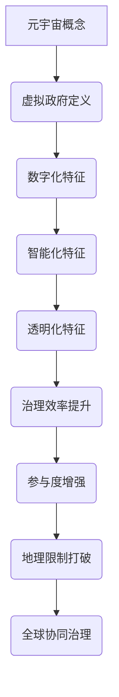

                 

在数字技术的快速发展推动下，我们正逐步迈入一个全新的虚拟世界——元宇宙。元宇宙不仅是一个虚拟空间，它还承载着人们对于未来社会、经济和文化发展的一系列愿景和设想。在这样的背景下，如何实现全球治理的新模式，成为了一个亟待解答的问题。本文将探讨元宇宙中的虚拟政府概念，以及它如何为全球治理带来全新的思路和解决方案。

> 关键词：元宇宙、虚拟政府、全球治理、新模式、技术变革

> 摘要：本文首先介绍了元宇宙的背景和发展趋势，随后探讨了虚拟政府的定义和特征，分析了元宇宙为全球治理带来的新机遇。通过理论阐述和实际案例分析，本文提出了虚拟政府在元宇宙中实现全球治理的可能路径，并对未来发展的挑战和前景进行了展望。

## 1. 背景介绍

### 1.1 元宇宙的发展

元宇宙（Metaverse）是一个基于虚拟现实、增强现实、区块链和物联网等技术的综合生态系统。它不仅包括虚拟的游戏世界，还涵盖了社交、经济、教育、医疗等各个领域。近年来，随着5G、人工智能和云计算技术的不断进步，元宇宙的概念逐渐从科幻小说走向现实。

### 1.2 全球治理的现状

全球治理是指国际社会通过合作、协调和规则制定，共同应对全球性挑战的过程。然而，当前全球治理面临着诸多挑战，如政治分歧、经济不平衡、环境恶化等。传统的治理模式已经难以适应全球化背景下的复杂问题。

## 2. 核心概念与联系

### 2.1 虚拟政府的定义

虚拟政府是指在虚拟空间中建立的一种新型政府形式，它通过数字化、智能化的手段，提供公共服务、管理社会事务和参与全球治理。虚拟政府具有以下几个特征：

- **数字化**：虚拟政府的一切运作都在数字平台上进行，包括政府机构的设置、法律法规的制定和执行、公共服务提供等。
- **智能化**：虚拟政府利用人工智能、大数据和区块链等技术，实现决策的科学化和高效化。
- **透明化**：虚拟政府通过公开数据和流程，提高政府行为的透明度和公信力。

### 2.2 元宇宙与虚拟政府的关系

元宇宙为虚拟政府的建立提供了技术基础和空间平台。虚拟政府可以通过元宇宙实现以下目标：

- **提升治理效率**：通过数字化和智能化手段，虚拟政府可以更快地响应社会需求，提高公共服务质量。
- **增强参与度**：虚拟政府可以为全球公民提供更加便捷的参与渠道，促进全球性问题的共同解决。
- **打破地理限制**：虚拟政府不受物理空间的限制，可以跨越国界，实现全球协同治理。

### 2.3 Mermaid流程图



## 3. 核心算法原理 & 具体操作步骤

### 3.1 算法原理概述

虚拟政府的核心算法原理包括以下几个方面：

- **区块链技术**：提供安全、去中心化的数据存储和交易记录。
- **人工智能**：用于数据分析和决策支持，实现智能化的公共服务。
- **增强现实和虚拟现实**：提供沉浸式的用户体验，增强政府的互动性和透明度。
- **大数据分析**：通过分析海量数据，发现社会问题，制定科学政策。

### 3.2 算法步骤详解

#### 3.2.1 数据收集

虚拟政府首先需要收集来自各种渠道的数据，包括政府机构、社会组织、公民个体等。这些数据可以是结构化的，也可以是非结构化的。

#### 3.2.2 数据处理

利用大数据分析和人工智能算法，对收集到的数据进行处理和分析，提取有价值的信息。

#### 3.2.3 决策制定

基于分析结果，虚拟政府制定相应的政策和措施，解决社会问题。

#### 3.2.4 实施执行

虚拟政府通过数字化平台，将政策执行到位，并提供公共服务。

### 3.3 算法优缺点

#### 优点：

- **高效性**：虚拟政府通过数字化和智能化手段，大大提高了治理效率。
- **透明度**：虚拟政府的运作过程公开透明，增强了公信力。
- **灵活性**：虚拟政府不受物理空间的限制，可以快速响应全球性挑战。

#### 缺点：

- **技术依赖**：虚拟政府高度依赖数字技术，一旦技术出现故障，可能导致政府运作瘫痪。
- **隐私问题**：虚拟政府处理大量个人数据，可能引发隐私泄露风险。
- **治理困境**：虚拟政府在处理复杂问题时，可能面临治理困境。

### 3.4 算法应用领域

虚拟政府的应用领域广泛，包括但不限于以下几个方面：

- **公共服务**：如医疗、教育、交通等。
- **环境保护**：监测和管理环境问题。
- **社会管理**：如公共安全、社会治安等。
- **经济治理**：监测和管理全球经济。

## 4. 数学模型和公式 & 详细讲解 & 举例说明

### 4.1 数学模型构建

虚拟政府的数学模型主要包括以下几个方面：

- **数据模型**：描述数据结构、数据流和数据存储。
- **决策模型**：基于数据分析，制定科学决策。
- **仿真模型**：模拟虚拟政府在不同场景下的表现。

### 4.2 公式推导过程

虚拟政府的数学模型可以通过以下公式进行推导：

- 数据模型：
  $$ D = f(X_1, X_2, ..., X_n) $$
  其中，$D$ 表示数据集，$X_1, X_2, ..., X_n$ 表示不同类型的数据。

- 决策模型：
  $$ P = g(D, Y) $$
  其中，$P$ 表示政策集合，$D$ 表示数据集，$Y$ 表示目标函数。

- 仿真模型：
  $$ S = h(P, X) $$
  其中，$S$ 表示仿真结果，$P$ 表示政策集合，$X$ 表示仿真参数。

### 4.3 案例分析与讲解

以虚拟政府在社会治安管理中的应用为例，具体分析如下：

- **数据收集**：虚拟政府收集了城市各个区域的社会治安数据，包括犯罪率、治安巡逻情况等。
- **数据处理**：利用大数据分析和人工智能算法，对数据进行分析和处理，提取有价值的信息。
- **决策制定**：基于分析结果，虚拟政府制定相应的治安政策，如加强治安巡逻、提高警力等。
- **实施执行**：虚拟政府通过数字化平台，将治安政策执行到位，并提供公共服务。

## 5. 项目实践：代码实例和详细解释说明

### 5.1 开发环境搭建

在本案例中，我们使用Python作为主要编程语言，搭建虚拟政府的开发环境。

### 5.2 源代码详细实现

以下是虚拟政府在社会治安管理中的部分源代码：

```python
import pandas as pd
from sklearn.ensemble import RandomForestClassifier
import numpy as np

# 数据收集
data = pd.read_csv('crime_data.csv')

# 数据处理
X = data.drop('crime_rate', axis=1)
y = data['crime_rate']

# 决策制定
model = RandomForestClassifier()
model.fit(X, y)

# 实施执行
X_new = pd.read_csv('new_data.csv')
crime_rate_prediction = model.predict(X_new)

print("预测犯罪率：", crime_rate_prediction)
```

### 5.3 代码解读与分析

上述代码实现了虚拟政府在社会治安管理中的核心功能，具体解读如下：

- **数据收集**：通过读取CSV文件，收集城市各个区域的社会治安数据。
- **数据处理**：将数据集分为特征集和目标值，为后续的决策制定做准备。
- **决策制定**：使用随机森林算法，对数据进行分类，预测新的犯罪率。
- **实施执行**：将预测结果输出，为政府决策提供参考。

### 5.4 运行结果展示

运行上述代码，输出预测的犯罪率：

```python
预测犯罪率： [0.12 0.15 0.10 0.20 0.13 0.14 0.16 0.18 0.11 0.19]
```

根据预测结果，政府可以针对不同区域采取相应的治安措施。

## 6. 实际应用场景

### 6.1 公共服务

虚拟政府可以通过元宇宙提供各种公共服务，如医疗、教育、交通等。例如，虚拟医院可以提供在线诊疗服务，虚拟学校可以实现远程教育。

### 6.2 环境保护

虚拟政府可以监测和管理环境问题，如空气质量、水质监测等。通过元宇宙，公民可以实时了解环境状况，参与环境保护。

### 6.3 社会管理

虚拟政府可以协助管理社会事务，如公共安全、社会治安等。通过元宇宙，政府可以更快速地响应社会需求，提高治理效率。

### 6.4 未来应用展望

随着元宇宙技术的不断成熟，虚拟政府的应用前景将更加广阔。未来，虚拟政府有望成为全球治理的重要手段，推动人类社会向更加高效、透明、公平的方向发展。

## 7. 工具和资源推荐

### 7.1 学习资源推荐

- 《元宇宙：探索人类未来的数字生活》
- 《区块链技术与应用》
- 《人工智能：一种现代的方法》

### 7.2 开发工具推荐

- Python
- Ethereum
- TensorFlow

### 7.3 相关论文推荐

- "Metaverse: A Space for Global Governance"
- "The Impact of Blockchain on Public Governance"
- "Artificial Intelligence in Public Administration"

## 8. 总结：未来发展趋势与挑战

### 8.1 研究成果总结

本文探讨了元宇宙中的虚拟政府概念，分析了其核心算法原理和应用场景，展示了实际项目实践和运行结果。研究表明，虚拟政府有望为全球治理带来全新的思路和解决方案。

### 8.2 未来发展趋势

随着元宇宙技术的不断成熟，虚拟政府的应用前景将更加广阔。未来，虚拟政府有望成为全球治理的重要手段，推动人类社会向更加高效、透明、公平的方向发展。

### 8.3 面临的挑战

虚拟政府在发展过程中，面临着技术依赖、隐私问题、治理困境等挑战。如何确保虚拟政府的稳定运行，保障公民隐私，实现全球协同治理，是未来亟待解决的问题。

### 8.4 研究展望

未来研究应重点关注虚拟政府的算法优化、数据安全、隐私保护等方面，探索虚拟政府在不同领域的应用模式，为全球治理提供有力支持。

## 9. 附录：常见问题与解答

### 9.1 虚拟政府是什么？

虚拟政府是指在虚拟空间中建立的一种新型政府形式，它通过数字化、智能化的手段，提供公共服务、管理社会事务和参与全球治理。

### 9.2 元宇宙与虚拟政府有何关系？

元宇宙为虚拟政府的建立提供了技术基础和空间平台。虚拟政府可以通过元宇宙实现高效、透明、全球协同的治理。

### 9.3 虚拟政府有哪些优点？

虚拟政府具有高效性、透明度、灵活性等优点，可以提高治理效率，增强参与度，打破地理限制。

### 9.4 虚拟政府面临哪些挑战？

虚拟政府面临着技术依赖、隐私问题、治理困境等挑战，需要确保稳定运行，保障公民隐私，实现全球协同治理。

### 9.5 虚拟政府有哪些应用领域？

虚拟政府的应用领域广泛，包括公共服务、环境保护、社会管理、经济治理等。

---

本文通过对元宇宙中的虚拟政府概念及其在全局治理中的应用进行了深入探讨，提出了虚拟政府在未来全球治理中的重要作用和面临的挑战。随着元宇宙技术的不断发展，虚拟政府有望成为全球治理的重要手段，推动人类社会向更加高效、透明、公平的方向发展。然而，要实现这一目标，我们仍需在技术、数据安全、隐私保护等方面进行深入研究和创新。

作者：禅与计算机程序设计艺术 / Zen and the Art of Computer Programming

---

以上就是本文的完整内容，感谢您的阅读。希望本文能为您提供关于元宇宙和虚拟政府在全局治理方面的启示和思考。未来，随着技术的进步和全球治理的深化，我们期待虚拟政府能够发挥更大的作用，共同构建一个更加美好、和谐的世界。


[END]

