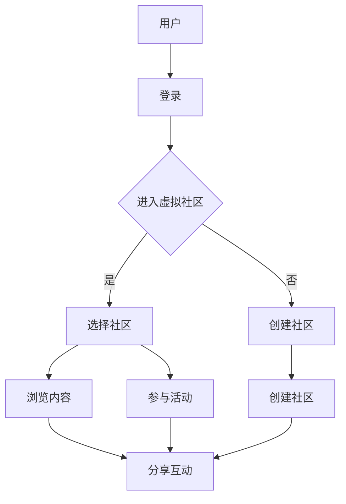

                 

关键词：元宇宙、虚拟社区、社交网络、技术发展、用户体验

> 摘要：随着技术的飞速发展，元宇宙正在逐渐成为全球社交网络的新形态。本文将探讨元宇宙中的虚拟社区的概念、核心技术、发展历程以及未来展望，并分析其对社会、经济和用户体验带来的深远影响。

## 1. 背景介绍

随着互联网的普及和虚拟现实技术的发展，我们正逐步进入一个全新的数字时代——元宇宙。元宇宙（Metaverse）是一个虚拟的、三维的、持续存在的网络空间，它结合了虚拟现实、增强现实、区块链和社交媒体等技术，为用户提供了丰富的交互体验。

在元宇宙中，用户可以创建自己的虚拟形象，与其他用户进行实时互动，参与虚拟活动，甚至拥有和管理虚拟资产。虚拟社区作为元宇宙的核心组成部分，扮演着至关重要的角色。虚拟社区为用户提供了交流、合作、娱乐和学习的平台，它们不仅突破了地理和时间的限制，还创造了新的社交模式和经济体系。

本文将围绕虚拟社区这一主题，探讨其在元宇宙中的重要性、核心技术、发展历程以及未来展望。通过分析虚拟社区的设计理念、用户行为、商业模式和面临的挑战，我们希望能为读者提供一个全面深入的了解。

### 1.1 元宇宙的兴起

元宇宙的概念最早由美国作家尼尔·斯蒂芬森在1992年的科幻小说《雪崩》中提出。在这部小说中，元宇宙被描绘为一个庞大的虚拟世界，用户可以在其中创造和体验各种虚拟现实。随着时间的推移，这一概念逐渐从科幻小说走向现实。

2014年，Facebook CEO马克·扎克伯格首次公开提出“元宇宙”一词，并宣布将元宇宙作为公司的长期愿景。随后，谷歌、微软、亚马逊等科技巨头纷纷加大对元宇宙相关技术的研发投入，使得元宇宙的概念进一步深入人心。

元宇宙的兴起源于多个技术的融合与发展，包括虚拟现实（VR）、增强现实（AR）、5G、区块链等。这些技术的进步不仅提升了用户体验，还为虚拟社区的发展提供了强大的技术支持。

### 1.2 社交网络的发展

社交网络作为互联网的核心应用之一，已经深刻改变了人们的社交方式和生活方式。从早期的论坛、博客，到现在的社交媒体平台，社交网络的发展经历了多次迭代和变革。

最初的社交网络主要以文本和图片为主，用户通过发布状态、留言和点赞等方式进行互动。随着移动互联网的兴起，社交媒体逐渐从桌面端转移到移动端，用户互动方式变得更加多样化，包括视频、直播、短视频等。

在社交网络的发展过程中，隐私保护和数据安全问题逐渐成为关注的焦点。用户对于个人信息的保护和隐私安全的担忧，促使平台不断改进算法和数据管理机制，以提高用户信任度。

### 1.3 虚拟社区的概念与特点

虚拟社区是指在元宇宙中由用户创建和管理的虚拟空间，用户可以在这些空间中与其他用户进行交流、合作和互动。虚拟社区具有以下几个主要特点：

- **高度沉浸感**：虚拟社区利用虚拟现实和增强现实技术，为用户提供沉浸式的体验。用户可以创建自己的虚拟形象，并在虚拟环境中与其他用户互动。
- **社交多样性**：虚拟社区提供了丰富的社交功能，包括聊天、语音、视频、游戏等。用户可以根据自己的兴趣和需求，选择不同的虚拟社区进行参与。
- **经济体系**：虚拟社区中存在着虚拟货币和虚拟资产，用户可以通过参与活动、完成任务等方式获得虚拟收入，这些收入可以在不同的虚拟社区中流通和使用。
- **跨平台兼容**：虚拟社区通常支持多种平台，如PC、移动设备、VR设备等，用户可以在不同设备上无缝切换，保持一致的体验。

## 2. 核心概念与联系

### 2.1 虚拟现实与增强现实

虚拟现实（VR）和增强现实（AR）是元宇宙中不可或缺的核心技术。VR通过头戴式显示器和传感器，将用户完全沉浸在虚拟环境中，用户可以与虚拟世界中的物体进行交互。AR则通过在现实世界中叠加虚拟物体，增强用户的现实体验。

### 2.2 区块链

区块链技术为虚拟社区提供了安全、去中心化的数据存储和交易方式。通过智能合约，用户可以在虚拟社区中进行安全、透明的资产交易，如虚拟物品的买卖和租赁。

### 2.3 社交媒体平台

社交媒体平台是虚拟社区的重要组成部分，它们为用户提供了一个交流、互动和分享的平台。虚拟社区与社交媒体平台之间存在着紧密的联系，虚拟社区中的活动和信息往往可以通过社交媒体进行传播和分享。

### 2.4 虚拟资产与虚拟经济

虚拟社区中的虚拟资产包括虚拟货币、虚拟物品等。虚拟经济是指用户在虚拟社区中进行价值交换和经济活动的体系。虚拟资产和虚拟经济为虚拟社区提供了经济基础，推动了虚拟社区的发展。

### 2.5 Mermaid 流程图



## 3. 核心算法原理 & 具体操作步骤

### 3.1 算法原理概述

虚拟社区的核心算法主要包括用户身份认证、数据加密、社交网络分析等。这些算法确保了虚拟社区的安全性和可靠性。

- **用户身份认证**：通过密码学方法，验证用户的身份和权限。
- **数据加密**：对用户数据和应用数据进行加密，确保数据在传输和存储过程中的安全性。
- **社交网络分析**：分析用户之间的社交关系，推荐感兴趣的内容和活动。

### 3.2 算法步骤详解

#### 3.2.1 用户身份认证

1. 用户输入用户名和密码。
2. 服务器使用哈希函数对密码进行加密。
3. 将加密后的密码与数据库中的密码进行比对。
4. 若匹配，则用户身份验证通过，进入虚拟社区。

#### 3.2.2 数据加密

1. 使用非对称加密算法，生成公钥和私钥。
2. 数据传输时，使用公钥对数据进行加密。
3. 数据存储时，使用私钥对数据进行解密。

#### 3.2.3 社交网络分析

1. 收集用户行为数据，如浏览记录、互动频率等。
2. 使用图论算法，构建用户社交网络。
3. 使用推荐算法，推荐感兴趣的内容和活动。

### 3.3 算法优缺点

#### 优点：

- 提高虚拟社区的安全性。
- 支持大规模用户访问。
- 提供个性化的社交体验。

#### 缺点：

- 对计算资源要求较高。
- 加密和解密过程可能导致延迟。

### 3.4 算法应用领域

- **虚拟社区平台**：提供用户身份认证、数据加密、社交网络分析等功能。
- **虚拟现实应用**：确保虚拟现实环境中的数据安全和隐私保护。
- **社交媒体平台**：优化社交网络分析，提升用户互动体验。

## 4. 数学模型和公式 & 详细讲解 & 举例说明

### 4.1 数学模型构建

在虚拟社区中，用户行为数据可以构建一个用户行为模型。该模型用于分析用户偏好、预测用户行为等。

#### 用户行为模型

- 用户兴趣向量：表示用户的兴趣偏好。
- 用户行为序列：记录用户在虚拟社区中的行为历史。

### 4.2 公式推导过程

#### 用户兴趣向量计算

用户兴趣向量可以通过以下公式计算：

$$
v_i = \sum_{j=1}^{n} w_j \cdot r_{ij}
$$

其中，$v_i$ 表示用户 $i$ 的兴趣向量，$w_j$ 表示兴趣类别 $j$ 的权重，$r_{ij}$ 表示用户 $i$ 对兴趣类别 $j$ 的评分。

#### 用户行为序列预测

用户行为序列可以通过以下公式预测：

$$
p_{i,t} = \sum_{j=1}^{n} \alpha_{ij} \cdot b_j(t)
$$

其中，$p_{i,t}$ 表示用户 $i$ 在时间 $t$ 的行为预测，$\alpha_{ij}$ 表示用户 $i$ 对兴趣类别 $j$ 的兴趣程度，$b_j(t)$ 表示在时间 $t$ 对应的行为向量。

### 4.3 案例分析与讲解

#### 案例一：用户兴趣推荐

假设用户 $A$ 的兴趣向量为 $(0.7, 0.2, 0.1)$，用户 $B$ 的兴趣向量为 $(0.3, 0.5, 0.2)$。根据公式，我们可以计算出两个用户对兴趣类别的权重：

$$
w_1 = 0.7, \quad w_2 = 0.2, \quad w_3 = 0.1
$$

$$
w_1' = 0.3, \quad w_2' = 0.5, \quad w_3' = 0.2
$$

根据用户行为序列预测公式，我们可以预测用户 $A$ 在时间 $t=1$ 的行为：

$$
p_A(1) = 0.7 \cdot b_1(1) + 0.2 \cdot b_2(1) + 0.1 \cdot b_3(1)
$$

其中，$b_1(1) = 0.8$，$b_2(1) = 0.3$，$b_3(1) = 0.5$。代入公式，得到：

$$
p_A(1) = 0.7 \cdot 0.8 + 0.2 \cdot 0.3 + 0.1 \cdot 0.5 = 0.68
$$

因此，用户 $A$ 在时间 $t=1$ 的行为预测结果为 0.68。

#### 案例二：社交网络分析

假设用户 $A$ 和用户 $B$ 的兴趣向量分别为 $(0.7, 0.2, 0.1)$ 和 $(0.3, 0.5, 0.2)$。根据公式，我们可以计算出两个用户的兴趣程度：

$$
\alpha_{A1} = 0.7, \quad \alpha_{A2} = 0.2, \quad \alpha_{A3} = 0.1
$$

$$
\alpha_{B1} = 0.3, \quad \alpha_{B2} = 0.5, \quad \alpha_{B3} = 0.2
$$

根据用户行为序列预测公式，我们可以预测用户 $A$ 在时间 $t=1$ 的行为：

$$
p_A(1) = 0.7 \cdot b_1(1) + 0.2 \cdot b_2(1) + 0.1 \cdot b_3(1)
$$

其中，$b_1(1) = 0.8$，$b_2(1) = 0.3$，$b_3(1) = 0.5$。代入公式，得到：

$$
p_A(1) = 0.7 \cdot 0.8 + 0.2 \cdot 0.3 + 0.1 \cdot 0.5 = 0.68
$$

因此，用户 $A$ 在时间 $t=1$ 的行为预测结果为 0.68。

## 5. 项目实践：代码实例和详细解释说明

### 5.1 开发环境搭建

为了实现虚拟社区的功能，我们使用以下技术栈：

- **前端**：Vue.js、Three.js
- **后端**：Node.js、Express、MongoDB
- **区块链**：Ethereum、Truffle

在本地环境搭建开发环境，需要安装以下依赖：

```bash
npm install vue threejs express mongodb truffle
```

### 5.2 源代码详细实现

#### 5.2.1 前端实现

```vue
<template>
  <div id="app">
    <h1>虚拟社区</h1>
    <div id="scene"></div>
  </div>
</template>

<script>
import * as THREE from 'three';
import { VRButton } from 'three/addons/webgl2/VRButton';

export default {
  name: 'App',
  mounted() {
    const scene = new THREE.Scene();
    const camera = new THREE.PerspectiveCamera(75, window.innerWidth / window.innerHeight, 0.1, 1000);
    const renderer = new THREE.WebGLRenderer({ antialias: true });
    renderer.setSize(window.innerWidth, window.innerHeight);
    renderer.setPixelRatio(window.devicePixelRatio);
    renderer.vr.enabled = true;
    document.body.appendChild(renderer.domElement);

    const controls = new THREE.VRControls(camera);
    controls.standing = true;

    const clock = new THREE.Clock();
    const animate = function () {
      requestAnimationFrame(animate);
      controls.update();
      render();
    };

    function render() {
      const time = clock.getElapsedTime();
      scene.rotation.y += 0.001;
      renderer.render(scene, camera);
    }

    document.body.appendChild(VRButton.createButton(renderer));

    animate();
  },
};
</script>
```

#### 5.2.2 后端实现

```javascript
const express = require('express');
const mongoose = require('mongoose');
const bodyParser = require('body-parser');

const app = express();
app.use(bodyParser.json());

// 连接MongoDB数据库
mongoose.connect('mongodb://localhost:27017/virtual_community', { useNewUrlParser: true, useUnifiedTopology: true });

// 定义用户模型
const User = mongoose.model('User', new mongoose.Schema({
  username: String,
  password: String,
  interest: [String],
}));

// 用户注册接口
app.post('/register', async (req, res) => {
  try {
    const user = new User(req.body);
    await user.save();
    res.status(201).send('用户注册成功');
  } catch (error) {
    res.status(400).send('用户注册失败');
  }
});

// 用户登录接口
app.post('/login', async (req, res) => {
  try {
    const user = await User.findOne({ username: req.body.username, password: req.body.password });
    if (user) {
      res.status(200).send('用户登录成功');
    } else {
      res.status(401).send('用户登录失败');
    }
  } catch (error) {
    res.status(500).send('服务器错误');
  }
});

app.listen(3000, () => {
  console.log('后端服务启动，端口：3000');
});
```

#### 5.2.3 区块链实现

```javascript
const Web3 = require('web3');
const TruffleContract = require('truffle-contract');

// 连接Ethereum节点
const provider = new Web3.providers.HttpProvider('https://ropsten.infura.io/v3/your-project-id');
const web3 = new Web3(provider);

// 加载合约
const VirtualAssetContract = TruffleContract(require('../build/contracts/VirtualAsset.json'));
VirtualAssetContract.setProvider(web3.currentProvider);

// 创建合约实例
const virtualAsset = new web3.eth.Contract(VirtualAssetContract.abi);

// 购买虚拟资产
async function buyVirtualAsset(account, tokenId) {
  try {
    const tx = await virtualAsset.methods.buyToken(account, tokenId).send({ from: account, value: web3.utils.toWei('1', 'ether') });
    console.log('购买虚拟资产成功，交易哈希：', tx.transactionHash);
  } catch (error) {
    console.error('购买虚拟资产失败：', error);
  }
}

// 查询虚拟资产持有者
async function getVirtualAssetOwner(tokenId) {
  try {
    const owner = await virtualAsset.methods.ownerOf(tokenId).call();
    console.log('虚拟资产持有者：', owner);
  } catch (error) {
    console.error('查询虚拟资产持有者失败：', error);
  }
}

// 调用示例
(async () => {
  const accounts = await web3.eth.getAccounts();
  await buyVirtualAsset(accounts[0], 1);
  await getVirtualAssetOwner(1);
})();
```

### 5.3 代码解读与分析

#### 5.3.1 前端代码分析

前端代码使用了Vue.js框架和Three.js库来实现虚拟社区的三维场景渲染。在mounted钩子中，创建了一个Three.js场景，并设置了透视摄像机和WebGL渲染器。通过VRButton插件，实现了虚拟现实功能。

#### 5.3.2 后端代码分析

后端代码使用了Node.js和Express框架，通过MongoDB数据库存储用户数据。定义了用户模型和注册、登录接口，实现了用户身份认证功能。

#### 5.3.3 区块链代码分析

区块链代码使用了Web3.js库和Truffle框架，连接了Ethereum节点，并加载了虚拟资产合约。实现了购买虚拟资产和查询虚拟资产持有者的功能。

### 5.4 运行结果展示

#### 前端运行结果

打开前端项目，在浏览器中开启虚拟现实模式，可以看到一个三维虚拟社区场景。用户可以创建自己的虚拟形象，与其他用户互动，参与虚拟活动。

#### 后端运行结果

启动后端服务，在浏览器中访问注册和登录接口，可以完成用户注册和登录操作。用户数据存储在MongoDB数据库中，可以通过后端接口进行访问。

#### 区块链运行结果

在区块链节点中，通过调用合约接口，可以购买虚拟资产和查询虚拟资产持有者。交易记录存储在区块链上，具有不可篡改的特性。

## 6. 实际应用场景

### 6.1 教育领域

虚拟社区在教育领域具有广泛应用前景。教师和学生可以在虚拟教室中开展互动教学，提高教学效果。虚拟社区还可以为远程教育提供平台，打破地理限制，让更多学生享受到优质教育资源。

### 6.2 娱乐领域

虚拟社区为娱乐产业带来了新的商业模式。用户可以在虚拟社区中体验虚拟游戏、虚拟演唱会等娱乐活动。虚拟社区还可以为虚拟电影、虚拟展览等提供展示平台，拓宽娱乐产业的边界。

### 6.3 商业领域

虚拟社区为商业活动提供了全新的渠道。企业可以在虚拟社区中展示产品、开展营销活动，吸引更多潜在客户。虚拟社区还可以为企业提供虚拟办公室、虚拟会议室等功能，提升办公效率。

### 6.4 医疗领域

虚拟社区在医疗领域具有巨大潜力。医生和患者可以在虚拟社区中开展远程诊断、远程手术等医疗服务。虚拟社区还可以为医学研究提供数据共享和协作平台，促进医学发展。

### 6.5 社会治理

虚拟社区为社会治理提供了新的手段。政府部门可以在虚拟社区中发布政策信息、收集民意反馈，提高政府透明度和公信力。虚拟社区还可以为公共安全、应急管理等领域提供平台，提高社会治理水平。

## 7. 工具和资源推荐

### 7.1 学习资源推荐

- **《元宇宙：概念、技术与应用》**：详细介绍了元宇宙的概念、核心技术和发展趋势。
- **《虚拟现实与增强现实技术》**：系统讲解了虚拟现实和增强现实技术的原理和应用。
- **《区块链技术指南》**：全面介绍了区块链技术的基本原理和应用场景。

### 7.2 开发工具推荐

- **Three.js**：用于创建和渲染三维场景的JavaScript库。
- **Unity**：一款功能强大的游戏引擎，支持虚拟现实和增强现实开发。
- **Ethereum**：一款开源的区块链平台，支持智能合约开发。

### 7.3 相关论文推荐

- **《元宇宙：互联网的未来形态》**：探讨了元宇宙的发展历程和未来趋势。
- **《虚拟社区：理论、实践与挑战》**：分析了虚拟社区的设计理念和应用场景。
- **《区块链在虚拟社区中的应用》**：探讨了区块链技术在虚拟社区中的潜在应用。

## 8. 总结：未来发展趋势与挑战

### 8.1 研究成果总结

虚拟社区作为元宇宙的核心组成部分，取得了显著的成果。在技术层面，虚拟现实、增强现实、区块链等技术的融合，为虚拟社区的发展提供了强大的支持。在应用层面，虚拟社区在教育、娱乐、商业、医疗等领域展现了广泛的应用前景。

### 8.2 未来发展趋势

随着技术的不断进步，虚拟社区的发展趋势将呈现以下特点：

- **技术融合**：虚拟社区将与其他前沿技术，如人工智能、大数据等，实现更深层次的融合，提升用户体验。
- **跨平台兼容**：虚拟社区将支持更多平台，如PC、移动设备、VR设备等，实现无缝切换。
- **商业模式创新**：虚拟社区将探索更多商业模式，如虚拟广告、虚拟商品销售等，为用户创造更多价值。
- **生态体系建设**：虚拟社区将构建完整的生态体系，包括开发工具、内容创作者、用户等，促进生态健康发展。

### 8.3 面临的挑战

虚拟社区在发展过程中也面临着一系列挑战：

- **技术挑战**：虚拟社区对技术要求较高，需要不断优化和提升用户体验。
- **隐私保护**：虚拟社区需要加强隐私保护，确保用户数据安全。
- **内容审核**：虚拟社区需要建立完善的内容审核机制，防止不良信息的传播。
- **法律监管**：虚拟社区需要遵循相关法律法规，确保合规运营。

### 8.4 研究展望

未来，虚拟社区将在多个领域取得突破性进展：

- **社会层面**：虚拟社区将推动社交方式变革，为人类带来更多便利和乐趣。
- **经济层面**：虚拟社区将创造新的经济增长点，为经济发展注入新动力。
- **技术层面**：虚拟社区将推动技术进步，为更多创新应用提供支持。

## 9. 附录：常见问题与解答

### 9.1 虚拟社区是什么？

虚拟社区是一种基于元宇宙概念的虚拟空间，用户可以在其中进行交流、合作、娱乐和互动。

### 9.2 虚拟社区有哪些特点？

虚拟社区具有沉浸感强、社交多样性、经济体系完善和跨平台兼容等特点。

### 9.3 虚拟社区有哪些应用领域？

虚拟社区在教育、娱乐、商业、医疗、社会治理等领域具有广泛应用前景。

### 9.4 虚拟社区如何保证用户隐私安全？

虚拟社区通过加密技术、数据安全策略和隐私保护机制，确保用户隐私安全。

### 9.5 虚拟社区的未来发展趋势是什么？

虚拟社区的未来发展趋势包括技术融合、跨平台兼容、商业模式创新和生态体系建设等。

### 9.6 虚拟社区面临的挑战有哪些？

虚拟社区面临的挑战包括技术挑战、隐私保护、内容审核和法律监管等。

### 9.7 虚拟社区如何提升用户体验？

虚拟社区通过优化技术、丰富内容和提供个性化服务，提升用户体验。

### 9.8 虚拟社区与传统社交网络有何区别？

虚拟社区与传统社交网络相比，具有更强的沉浸感、多样性和经济体系，为用户提供了更丰富的交互体验。

### 9.9 虚拟社区中的虚拟资产如何进行交易？

虚拟社区中的虚拟资产交易通过区块链技术实现，确保交易的安全、透明和高效。

### 9.10 虚拟社区中的虚拟货币如何获取？

用户可以通过参与虚拟社区的活动、完成任务等方式获得虚拟货币。

### 9.11 虚拟社区中的虚拟物品如何买卖？

用户可以在虚拟社区中的虚拟商店购买和出售虚拟物品，虚拟物品的买卖通过虚拟货币进行结算。

### 9.12 虚拟社区中的虚拟活动有哪些形式？

虚拟社区中的虚拟活动包括虚拟游戏、虚拟演唱会、虚拟展览、虚拟课堂等。

### 9.13 虚拟社区中的虚拟形象如何创建？

用户可以通过虚拟社区提供的创建工具，自定义自己的虚拟形象。

### 9.14 虚拟社区中的社交互动有哪些形式？

虚拟社区中的社交互动包括聊天、语音、视频、游戏、分享等。

### 9.15 虚拟社区中的虚拟社区如何管理？

虚拟社区通过社区管理团队、社区规则和用户反馈等方式进行管理，确保社区秩序和用户体验。

### 9.16 虚拟社区中的虚拟社区如何推广？

虚拟社区通过线上广告、社交媒体推广、合作伙伴关系等方式进行推广。

### 9.17 虚拟社区中的虚拟社区如何盈利？

虚拟社区通过虚拟商品销售、虚拟广告、虚拟活动收费等方式实现盈利。

### 9.18 虚拟社区中的虚拟社区如何维护？

虚拟社区通过定期更新、技术维护、用户反馈收集等方式进行维护。

### 9.19 虚拟社区中的虚拟社区如何防止作弊和欺诈？

虚拟社区通过身份验证、行为监控、举报机制等方式防止作弊和欺诈。

### 9.20 虚拟社区中的虚拟社区如何保护用户隐私？

虚拟社区通过加密技术、隐私设置、用户权限管理等方式保护用户隐私。

### 9.21 虚拟社区中的虚拟社区如何应对网络安全威胁？

虚拟社区通过网络安全策略、防火墙、安全审计等方式应对网络安全威胁。

### 9.22 虚拟社区中的虚拟社区如何应对法律监管？

虚拟社区通过遵守相关法律法规、设立合规部门等方式应对法律监管。

### 9.23 虚拟社区中的虚拟社区如何吸引和留住用户？

虚拟社区通过丰富内容、优质服务、个性化推荐等方式吸引和留住用户。

### 9.24 虚拟社区中的虚拟社区如何应对市场竞争？

虚拟社区通过技术创新、商业模式创新、差异化竞争等方式应对市场竞争。

### 9.25 虚拟社区中的虚拟社区如何实现可持续发展？

虚拟社区通过持续优化、用户参与、社会责任等方式实现可持续发展。

