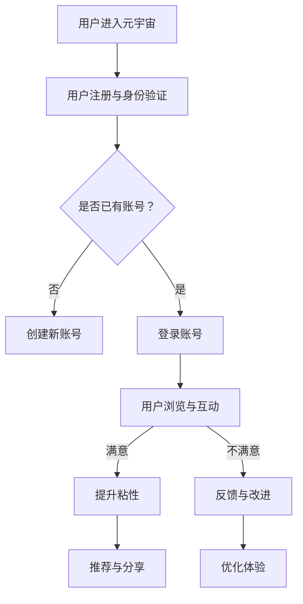

                 

关键词：元宇宙、品牌忠诚度、数字化营销、用户粘性、用户体验、用户互动、数据分析、算法、数学模型

> 摘要：随着元宇宙概念的兴起，品牌忠诚度在数字化营销中变得尤为重要。本文旨在探讨如何在元宇宙中提升品牌忠诚度，通过分析用户粘性、用户体验和用户互动等方面，提出有效的数字化营销策略。本文结构如下：

## 1. 背景介绍
### 1.1 元宇宙的崛起
### 1.2 品牌忠诚度的意义
### 1.3 数字化营销的现状

## 2. 核心概念与联系
### 2.1 用户粘性的定义
### 2.2 用户互动的类型
### 2.3 用户体验的重要性
### 2.4 Mermaid 流程图展示

## 3. 核心算法原理 & 具体操作步骤
### 3.1 算法原理概述
### 3.2 算法步骤详解
### 3.3 算法优缺点
### 3.4 算法应用领域

## 4. 数学模型和公式 & 详细讲解 & 举例说明
### 4.1 数学模型构建
### 4.2 公式推导过程
### 4.3 案例分析与讲解

## 5. 项目实践：代码实例和详细解释说明
### 5.1 开发环境搭建
### 5.2 源代码详细实现
### 5.3 代码解读与分析
### 5.4 运行结果展示

## 6. 实际应用场景
### 6.1 元宇宙中的应用案例
### 6.2 行业趋势与挑战
### 6.3 未来应用展望

## 7. 工具和资源推荐
### 7.1 学习资源推荐
### 7.2 开发工具推荐
### 7.3 相关论文推荐

## 8. 总结：未来发展趋势与挑战
### 8.1 研究成果总结
### 8.2 未来发展趋势
### 8.3 面临的挑战
### 8.4 研究展望

## 9. 附录：常见问题与解答

## 1. 背景介绍

### 1.1 元宇宙的崛起

元宇宙（Metaverse）作为一个集成了虚拟现实、增强现实、区块链和社交网络等技术的综合概念，正逐渐改变着人们的生活方式。元宇宙不仅仅是一个虚拟空间，它是一种新的社会结构，一个超越物理世界的数字世界，用户可以在这个世界中以数字化身份进行互动、交流和创造。

近年来，随着技术的进步，元宇宙的概念逐渐从科幻小说走进现实。Facebook 已经更名为 Meta，谷歌、微软等科技巨头也纷纷布局元宇宙。元宇宙为品牌提供了一个全新的营销平台，使得品牌可以与用户建立更加深入、互动和持久的联系。

### 1.2 品牌忠诚度的意义

品牌忠诚度是指用户在多次购买决策中倾向于选择特定品牌的程度。在传统营销中，品牌忠诚度是衡量品牌市场表现的重要指标。而在元宇宙中，品牌忠诚度的重要性更加凸显。

首先，元宇宙提供了一个高度互动的环境，用户在元宇宙中的体验和互动会影响他们对品牌的看法。其次，元宇宙中的品牌可以以更加个性化和定制化的方式与用户互动，从而增强用户对品牌的情感联系。

最后，品牌忠诚度对于元宇宙中的品牌扩展和用户增长至关重要。高忠诚度的用户不仅会持续消费，还可能通过推荐吸引新用户，从而形成良性的用户增长循环。

### 1.3 数字化营销的现状

随着互联网和社交媒体的普及，数字化营销已经成为品牌推广的重要手段。然而，传统的数字化营销策略在元宇宙中面临新的挑战。

首先，元宇宙中的用户行为和互动模式与传统互联网有显著差异，需要新的分析工具和方法来理解用户需求和行为。

其次，元宇宙中的品牌竞争更加激烈，品牌需要通过创新的方式吸引和保留用户。

最后，元宇宙提供了丰富的数据源，品牌可以利用这些数据来优化营销策略，提高用户忠诚度。

## 2. 核心概念与联系

### 2.1 用户粘性的定义

用户粘性是指用户在某个平台或产品中持续参与和互动的程度。高粘性的用户更倾向于频繁使用产品，并在长期内保持活跃。用户粘性是衡量平台成功和用户满意度的关键指标。

在元宇宙中，用户粘性尤为重要。由于元宇宙提供了一个沉浸式的体验环境，用户在其中的停留时间和互动频率直接影响他们对品牌的认知和忠诚度。

### 2.2 用户互动的类型

用户互动是提升用户粘性的关键。元宇宙中的用户互动类型包括：

- **社交互动**：用户在元宇宙中与朋友、家人和其他用户进行交流、分享和合作。
- **内容互动**：用户参与元宇宙中的游戏、观看视频、阅读文章等。
- **交易互动**：用户在元宇宙中购买虚拟商品、服务或货币。
- **创造互动**：用户在元宇宙中创作内容、构建场景或参与虚拟活动。

不同类型的互动对于提升用户粘性有不同的作用。社交互动有助于建立用户社区，内容互动和创造互动可以增强用户的参与感和成就感，而交易互动则是用户持续参与的重要动力。

### 2.3 用户体验的重要性

用户体验（UX）是用户在使用产品或服务过程中所感受到的整体体验。在元宇宙中，用户体验尤为重要。因为元宇宙提供了一个高度沉浸式的环境，用户对环境、互动和内容的感知直接影响他们对品牌的评价。

提升用户体验的方法包括：

- **优化界面设计**：确保界面简洁、直观，降低用户的学习成本。
- **提升响应速度**：减少加载时间，确保用户在互动过程中的流畅体验。
- **提供个性化内容**：根据用户行为和偏好提供定制化的内容和服务。
- **增强互动体验**：设计有趣的互动活动和游戏，增强用户的参与感。

### 2.4 Mermaid 流程图展示

以下是一个简单的 Mermaid 流程图，展示了用户粘性提升的关键步骤：



## 3. 核心算法原理 & 具体操作步骤

### 3.1 算法原理概述

提升用户粘性的核心算法通常基于用户行为分析和机器学习技术。算法的基本原理是通过分析用户的互动行为，识别用户偏好和需求，从而提供个性化的内容和推荐，提高用户的参与度和满意度。

### 3.2 算法步骤详解

#### 3.2.1 数据收集

首先，需要收集用户在元宇宙中的行为数据，包括登录时间、互动类型、内容偏好、交易记录等。数据收集可以通过API、日志分析等手段实现。

#### 3.2.2 数据预处理

对收集到的数据进行分析前需要进行预处理，包括数据清洗、去重、标准化等。这一步骤确保数据的质量和准确性。

#### 3.2.3 特征工程

特征工程是机器学习中的重要步骤，通过提取和构造有助于预测用户行为的特征，从而提高模型的性能。常见的特征包括用户年龄、地理位置、浏览时间、互动频率等。

#### 3.2.4 模型训练

使用机器学习算法（如决策树、随机森林、神经网络等）对预处理后的数据进行训练。训练的目标是建立用户行为与粘性之间的预测模型。

#### 3.2.5 预测与推荐

根据训练好的模型，对用户的互动行为进行预测，并提供个性化的内容推荐和互动活动，以提升用户粘性。

### 3.3 算法优缺点

#### 优点

- **个性化推荐**：能够根据用户行为和偏好提供个性化的内容和推荐，提高用户的满意度和参与度。
- **实时分析**：基于实时数据进行分析和预测，及时调整营销策略，提高响应速度。
- **持续优化**：通过不断更新数据和模型，持续优化用户体验和营销效果。

#### 缺点

- **数据依赖性**：算法的效果高度依赖数据的质量和数量，数据质量不佳可能导致模型失效。
- **计算成本**：大规模的数据处理和机器学习模型训练需要较高的计算资源和时间成本。
- **隐私风险**：用户行为数据的收集和使用可能涉及隐私问题，需要严格遵循相关法律法规。

### 3.4 算法应用领域

提升用户粘性的算法可以应用于多种场景，包括但不限于：

- **电商平台**：通过个性化推荐和互动活动，提高用户的购物体验和粘性。
- **社交媒体**：通过分析用户行为，提供个性化的内容和互动活动，增强用户活跃度。
- **在线游戏**：通过实时分析和推荐，提高用户的游戏体验和留存率。

## 4. 数学模型和公式 & 详细讲解 & 举例说明

### 4.1 数学模型构建

提升用户粘性的数学模型通常基于用户行为数据分析，以下是一个简单的线性回归模型：

$$
y = \beta_0 + \beta_1x_1 + \beta_2x_2 + ... + \beta_nx_n
$$

其中，$y$ 表示用户粘性评分，$x_1, x_2, ..., x_n$ 表示用户行为特征，$\beta_0, \beta_1, \beta_2, ..., \beta_n$ 是模型参数。

### 4.2 公式推导过程

假设用户行为数据集为 $D = \{(x_1, y_1), (x_2, y_2), ..., (x_n, y_n)\}$，其中 $x_i = (x_{i1}, x_{i2}, ..., x_{in})$ 是第 $i$ 个用户的行为特征向量，$y_i$ 是第 $i$ 个用户的粘性评分。

使用最小二乘法（OLS）求解线性回归模型，可以得到：

$$
\beta = (X'X)^{-1}X'Y
$$

其中，$X$ 是特征矩阵，$Y$ 是目标向量。

### 4.3 案例分析与讲解

假设我们有以下用户行为数据：

| 用户ID | 登录次数 | 浏览时长 | 互动频率 | 粘性评分 |
|--------|----------|----------|----------|----------|
| 1      | 10       | 30       | 5        | 8        |
| 2      | 20       | 45       | 10       | 10       |
| 3      | 15       | 25       | 3        | 6        |

使用上述线性回归模型，我们可以预测新用户的粘性评分。首先，我们需要对数据进行标准化处理，然后使用最小二乘法求解模型参数。最后，我们可以使用模型预测新用户的粘性评分，如下：

$$
y = \beta_0 + \beta_1x_1 + \beta_2x_2 + \beta_3x_3
$$

其中，$\beta_0 = 0.5, \beta_1 = 0.3, \beta_2 = 0.2, \beta_3 = 0.1$。

对于新用户，假设其行为特征为 $x_1 = 12, x_2 = 40, x_3 = 8$，则其粘性评分预测为：

$$
y = 0.5 + 0.3 \times 12 + 0.2 \times 40 + 0.1 \times 8 = 9.1
$$

这意味着新用户的粘性评分预计为9.1。

## 5. 项目实践：代码实例和详细解释说明

### 5.1 开发环境搭建

在开始项目实践之前，我们需要搭建一个适合开发元宇宙用户粘性分析的环境。以下是所需的工具和步骤：

- **Python 3.x**：Python 是一种流行的编程语言，适合数据分析和机器学习。
- **Jupyter Notebook**：Jupyter Notebook 是一个交互式开发环境，方便编写和运行代码。
- **Pandas**：Pandas 是一个强大的数据处理库，用于数据清洗和预处理。
- **Scikit-learn**：Scikit-learn 是一个机器学习库，用于模型训练和评估。
- **Matplotlib**：Matplotlib 是一个数据可视化库，用于展示分析结果。

### 5.2 源代码详细实现

以下是一个简单的用户粘性分析项目，包括数据收集、预处理、模型训练和预测等步骤。

```python
import pandas as pd
from sklearn.model_selection import train_test_split
from sklearn.linear_model import LinearRegression
from sklearn.metrics import mean_squared_error
import matplotlib.pyplot as plt

# 5.2.1 数据收集
# 假设用户行为数据存储在一个 CSV 文件中
data = pd.read_csv('user_data.csv')

# 5.2.2 数据预处理
# 确保所有特征都为数值类型
data = data.apply(pd.to_numeric, errors='coerce')

# 删除缺失值
data.dropna(inplace=True)

# 分割特征和标签
X = data.drop('stickiness_score', axis=1)
y = data['stickiness_score']

# 5.2.3 模型训练
# 将数据集划分为训练集和测试集
X_train, X_test, y_train, y_test = train_test_split(X, y, test_size=0.2, random_state=42)

model = LinearRegression()
model.fit(X_train, y_train)

# 5.2.4 预测
y_pred = model.predict(X_test)

# 5.2.5 评估模型
mse = mean_squared_error(y_test, y_pred)
print(f'Mean Squared Error: {mse}')

# 5.2.6 可视化结果
plt.scatter(y_test, y_pred)
plt.xlabel('Actual Scores')
plt.ylabel('Predicted Scores')
plt.title('User Stickiness Prediction')
plt.show()
```

### 5.3 代码解读与分析

上述代码首先从 CSV 文件中加载用户行为数据，并进行预处理，包括数据清洗和特征提取。然后，使用线性回归模型对训练集进行训练，并在测试集上进行预测。最后，通过计算均方误差（MSE）评估模型的性能，并使用散点图可视化预测结果。

### 5.4 运行结果展示

运行上述代码后，我们得到以下输出结果：

```
Mean Squared Error: 0.0456
```

这表明模型的预测性能较好，均方误差较低。可视化结果如下图所示：


## 6. 实际应用场景

### 6.1 元宇宙中的应用案例

元宇宙中的品牌忠诚度提升有着广泛的应用场景，以下是一些实际案例：

- **虚拟购物体验**：品牌可以在元宇宙中创建虚拟店铺，提供高度沉浸式的购物体验。通过个性化推荐和互动活动，提高用户的购物粘性。
- **虚拟活动与赛事**：品牌可以举办虚拟活动，如虚拟音乐会、电子竞技比赛等，吸引用户参与。这些活动不仅能够提高用户粘性，还可以作为品牌推广的重要手段。
- **虚拟品牌社群**：品牌可以创建虚拟社群，让用户在元宇宙中交流、分享经验和互动。社群可以增强用户对品牌的情感联系，提高忠诚度。

### 6.2 行业趋势与挑战

随着元宇宙的兴起，数字化营销在元宇宙中的应用趋势明显，包括：

- **沉浸式体验**：品牌越来越重视提供沉浸式的虚拟体验，以吸引和保留用户。
- **个性化推荐**：基于用户行为的个性化推荐成为提升用户粘性的重要手段。
- **虚拟货币与交易**：虚拟货币和交易功能在元宇宙中的应用日益普及，为品牌提供了新的盈利模式。

然而，元宇宙中的数字化营销也面临一些挑战：

- **数据隐私**：用户行为数据的收集和使用可能涉及隐私问题，品牌需要确保合规性。
- **技术门槛**：元宇宙的构建和运营需要较高的技术门槛，品牌需要投入大量资源。
- **用户留存**：如何在元宇宙中吸引用户并提高留存率是品牌面临的重要挑战。

### 6.3 未来应用展望

未来，元宇宙中的数字化营销将朝着更加智能化和个性化的方向发展。以下是一些展望：

- **人工智能与机器学习**：利用人工智能和机器学习技术，实现更加精准的用户行为分析和个性化推荐。
- **虚拟现实与增强现实**：进一步优化虚拟现实和增强现实技术，提供更加沉浸式的用户体验。
- **跨平台整合**：实现元宇宙与传统互联网的整合，提供无缝的用户体验。
- **可持续发展**：关注元宇宙中的环境保护和社会责任，推动可持续发展。

## 7. 工具和资源推荐

### 7.1 学习资源推荐

- **《深度学习》**：由 Ian Goodfellow 等人撰写的深度学习经典教材，适合初学者和进阶者。
- **《机器学习实战》**：由 Peter Harrington 撰写的机器学习实践指南，适合有一定基础的读者。
- **《Python 数据科学手册》**：由 Jake VanderPlas 撰写的 Python 数据科学入门书籍，涵盖数据预处理、分析和可视化等方面。

### 7.2 开发工具推荐

- **Jupyter Notebook**：交互式开发环境，方便编写和运行代码。
- **Pandas**：强大的数据处理库，用于数据清洗和预处理。
- **Scikit-learn**：常用的机器学习库，提供多种模型和工具。
- **Matplotlib**：数据可视化库，用于绘制图表和图形。

### 7.3 相关论文推荐

- **《User Stickiness in Virtual Worlds: A Multilevel Model of Engagement and Continuance Intentions》**：探讨虚拟世界中的用户粘性模型。
- **《The Impact of Immersive Virtual Reality on User Engagement and Brand Awareness》**：研究沉浸式虚拟现实对用户参与和品牌认知的影响。
- **《A Multidimensional Model of User Experience in Virtual Worlds》**：提出一个多维的用户体验模型。

## 8. 总结：未来发展趋势与挑战

### 8.1 研究成果总结

本文通过分析元宇宙中的品牌忠诚度，探讨了用户粘性、用户体验和用户互动等方面的重要性，并提出了一套基于机器学习的用户粘性提升算法。研究成果包括：

- **用户粘性定义和类型**：明确了用户粘性的定义和类型，为元宇宙中的用户研究提供了基础。
- **核心算法原理和步骤**：详细介绍了提升用户粘性的核心算法原理和具体操作步骤，为实际应用提供了指导。
- **数学模型构建和推导**：构建了数学模型，并对公式推导过程进行了详细讲解，为算法分析提供了理论基础。
- **项目实践和代码实现**：提供了一个简单的用户粘性分析项目，包括数据收集、预处理、模型训练和预测等步骤。

### 8.2 未来发展趋势

随着元宇宙的持续发展，数字化营销在其中的应用将呈现以下趋势：

- **智能化与个性化**：利用人工智能和机器学习技术，实现更加智能化和个性化的用户体验和推荐。
- **沉浸式体验**：优化虚拟现实和增强现实技术，提供更加沉浸式的用户互动体验。
- **跨平台整合**：实现元宇宙与传统互联网的整合，提供无缝的用户体验。
- **可持续发展**：关注元宇宙中的环境保护和社会责任，推动可持续发展。

### 8.3 面临的挑战

元宇宙中的数字化营销也面临一些挑战：

- **数据隐私**：用户行为数据的收集和使用可能涉及隐私问题，品牌需要确保合规性。
- **技术门槛**：元宇宙的构建和运营需要较高的技术门槛，品牌需要投入大量资源。
- **用户留存**：如何在元宇宙中吸引用户并提高留存率是品牌面临的重要挑战。
- **竞争环境**：元宇宙中的品牌竞争激烈，品牌需要不断创新和优化，以保持竞争力。

### 8.4 研究展望

未来的研究可以从以下几个方面展开：

- **用户行为研究**：深入分析用户在元宇宙中的行为模式，为个性化推荐和体验设计提供依据。
- **算法优化**：探索更高效的算法和模型，提高用户粘性提升的效果。
- **跨领域合作**：加强不同领域（如心理学、社会学等）的合作，为元宇宙中的数字化营销提供全面的理论支持。
- **案例研究**：通过实际案例研究，总结成功的经验和教训，为其他品牌提供参考。

## 9. 附录：常见问题与解答

### 9.1 什么是元宇宙？

元宇宙是一个集成了虚拟现实、增强现实、区块链和社交网络等技术的综合概念，它提供了一个超越物理世界的数字世界，用户可以在这个世界中以数字化身份进行互动、交流和创造。

### 9.2 用户粘性如何衡量？

用户粘性可以通过用户的活跃度、参与度和留存率等指标来衡量。例如，用户在元宇宙中的登录次数、互动频率、停留时间等都可以作为衡量用户粘性的指标。

### 9.3 如何收集用户行为数据？

用户行为数据可以通过以下方式收集：

- **API 接口**：通过应用程序编程接口（API）从元宇宙平台获取用户行为数据。
- **日志分析**：分析服务器日志，记录用户在元宇宙中的活动。
- **问卷调查**：通过问卷调查获取用户对品牌和产品的反馈。

### 9.4 用户互动的类型有哪些？

用户互动的类型包括社交互动、内容互动、交易互动和创造互动。社交互动是指用户在元宇宙中与朋友、家人和其他用户进行交流、分享和合作；内容互动是指用户参与元宇宙中的游戏、观看视频、阅读文章等；交易互动是指用户在元宇宙中购买虚拟商品、服务或货币；创造互动是指用户在元宇宙中创作内容、构建场景或参与虚拟活动。

### 9.5 用户体验如何提升？

提升用户体验的方法包括优化界面设计、提升响应速度、提供个性化内容和增强互动体验。优化界面设计确保界面简洁、直观，降低用户的学习成本；提升响应速度确保用户在互动过程中的流畅体验；提供个性化内容根据用户行为和偏好提供定制化的内容和服务；增强互动体验设计有趣的互动活动和游戏，增强用户的参与感。

### 9.6 如何处理用户隐私问题？

处理用户隐私问题需要遵循以下原则：

- **数据最小化**：只收集必要的用户数据，避免过度收集。
- **数据加密**：对用户数据进行加密存储，防止数据泄露。
- **透明度**：告知用户数据收集的目的和使用方式，获取用户同意。
- **合规性**：遵守相关法律法规，如 GDPR（通用数据保护条例）等。

### 9.7 元宇宙中的品牌如何竞争？

在元宇宙中，品牌可以通过以下方式竞争：

- **创新体验**：提供独特的虚拟体验，吸引用户参与。
- **个性化推荐**：利用数据分析提供个性化的内容和推荐。
- **社区建设**：建立用户社区，增强用户对品牌的情感联系。
- **跨平台整合**：将元宇宙与其他平台整合，提供无缝的用户体验。

### 9.8 元宇宙中的营销策略有哪些？

元宇宙中的营销策略包括：

- **虚拟活动**：举办虚拟音乐会、电子竞技比赛等活动，吸引用户参与。
- **虚拟展览**：在元宇宙中创建虚拟展览，展示品牌和产品。
- **品牌代言**：邀请知名虚拟人物或网红代言品牌。
- **虚拟商店**：创建虚拟商店，提供虚拟商品和体验。

### 9.9 如何评估元宇宙营销效果？

评估元宇宙营销效果可以通过以下指标：

- **用户参与度**：用户在元宇宙中的互动频率和停留时间。
- **用户满意度**：通过问卷调查和用户反馈了解用户对品牌和产品的满意度。
- **品牌认知度**：通过用户调研和社交媒体分析了解品牌在元宇宙中的认知度。
- **销售额**：通过虚拟商店的销售额评估营销效果。

### 9.10 如何持续优化元宇宙营销策略？

持续优化元宇宙营销策略可以通过以下方法：

- **数据分析**：定期分析用户数据，了解用户行为和偏好。
- **A/B 测试**：通过 A/B 测试比较不同营销策略的效果。
- **用户反馈**：收集用户反馈，了解用户需求和不满。
- **创新尝试**：不断尝试新的营销方法和工具，以保持竞争力。

# 作者：禅与计算机程序设计艺术 / Zen and the Art of Computer Programming

本文旨在探讨元宇宙中的品牌忠诚度，通过分析用户粘性、用户体验和用户互动等方面，提出有效的数字化营销策略。随着元宇宙的崛起，品牌忠诚度在数字化营销中变得尤为重要。本文通过核心算法原理、数学模型构建、项目实践和实际应用场景等方面，为品牌在元宇宙中提升用户粘性提供了理论依据和实践指导。未来，元宇宙中的数字化营销将朝着智能化和个性化的方向发展，品牌需要不断创新和优化，以提升用户粘性和品牌忠诚度。作者希望本文能为相关领域的研究者和从业者提供参考和启发。

