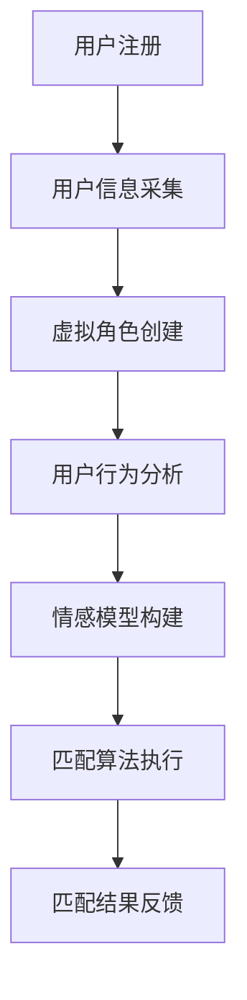

                 

关键词：元宇宙、婚恋平台、情感匹配、虚拟世界、人工智能、算法、数学模型、项目实践、开发工具、未来应用

> 摘要：随着元宇宙的快速发展，虚拟世界中的婚恋平台成为了新的社交趋势。本文将深入探讨元宇宙婚恋平台的核心概念、算法原理、数学模型以及实际应用场景，同时提供代码实例和详细解释，以期为该领域的研究和实践提供有益的参考。

## 1. 背景介绍

随着互联网技术的飞速发展，虚拟世界逐渐成为人们生活中不可或缺的一部分。元宇宙，作为虚拟现实的下一个重要里程碑，正以其独特的魅力吸引着全球用户的关注。在元宇宙中，人们可以自由地探索虚拟环境、交互社交，甚至开展各种现实世界的活动。而婚恋平台作为人们情感交流的重要场所，也在元宇宙中找到了新的发展空间。

元宇宙婚恋平台的出现，不仅为用户提供了一个全新的社交体验，也带来了前所未有的挑战。如何在虚拟世界中实现高效的情感匹配，成为了当前人工智能和计算机科学领域的重要课题。本文将围绕这一主题，介绍元宇宙婚恋平台的核心技术，探讨其算法原理、数学模型以及实际应用，以期为广大开发者和用户提供有益的参考。

## 2. 核心概念与联系

### 2.1 元宇宙与虚拟世界的概念

元宇宙（Metaverse）是一个由虚拟现实、增强现实和区块链等技术支撑的虚拟空间，它是一个连续的、共享的、三维的、用户生成内容和体验的全球网络。用户可以通过虚拟角色（Avatar）在元宇宙中自由探索、互动和创造。

虚拟世界（Virtual World）是元宇宙的一个子集，主要指的是用户通过计算机、游戏机等设备进入的、具有交互性和沉浸感的虚拟环境。虚拟世界可以是游戏、社交平台、教育平台等，它们共同构成了元宇宙的生态。

### 2.2 情感匹配的概念

情感匹配（Emotional Matching）是指利用人工智能和算法技术，对用户在虚拟世界中的行为、喜好、个性特征等进行分析，从而找到与其情感相匹配的虚拟对象。情感匹配的核心目标是提升用户体验，增强用户在虚拟世界中的社交满意度。

### 2.3 元宇宙婚恋平台的架构

元宇宙婚恋平台通常包括以下几个关键组成部分：

1. **用户系统**：管理用户的注册、登录、个人信息、权限等。
2. **虚拟角色系统**：允许用户创建和定制自己的虚拟角色。
3. **社交系统**：提供用户之间的互动功能，如聊天、交友、约会等。
4. **情感匹配系统**：根据用户的行为和喜好，自动匹配情感相匹配的对象。
5. **数据管理系统**：存储和管理用户数据、匹配数据等。

### 2.4 Mermaid 流程图

以下是一个简化的元宇宙婚恋平台情感匹配系统的 Mermaid 流程图：



## 3. 核心算法原理 & 具体操作步骤

### 3.1 算法原理概述

元宇宙婚恋平台的情感匹配算法通常基于机器学习和数据挖掘技术。核心思想是通过分析用户的行为数据、社交数据和个人信息，构建用户情感模型，然后利用匹配算法找到情感相匹配的对象。

### 3.2 算法步骤详解

1. **用户数据采集**：收集用户的个人信息、行为数据和社会互动数据。
2. **特征提取**：将用户数据转化为算法可以处理的特征向量。
3. **情感模型构建**：利用机器学习算法，如神经网络或决策树，构建用户情感模型。
4. **匹配算法执行**：根据用户情感模型和匹配算法，计算出匹配分数，筛选出最佳匹配对象。
5. **匹配结果反馈**：将匹配结果反馈给用户，并提供互动渠道。

### 3.3 算法优缺点

- **优点**：
  - 提高用户匹配效率，减少无效社交。
  - 基于大数据和人工智能，能提供更加精准的匹配服务。
  - 提升用户在虚拟世界中的社交体验。

- **缺点**：
  - 数据隐私和安全性问题。
  - 情感匹配的准确性和稳定性有待提高。
  - 需要大量计算资源和时间。

### 3.4 算法应用领域

- **婚恋平台**：提高用户匹配成功率，增加用户留存率。
- **社交网络**：改善用户社交体验，提高平台活跃度。
- **娱乐游戏**：提供更加沉浸和个性化的游戏体验。

## 4. 数学模型和公式 & 详细讲解 & 举例说明

### 4.1 数学模型构建

在情感匹配中，常用的数学模型是基于用户行为和社交数据的矩阵分解模型。该模型通过矩阵分解，将用户行为数据和社会互动数据转化为用户和项目（如用户和对象）的潜在特征向量。

### 4.2 公式推导过程

假设我们有用户 $U$ 和项目 $I$ 的交互矩阵 $R$，其中 $R_{ui}$ 表示用户 $u$ 对项目 $i$ 的评分。矩阵分解模型的目标是最小化误差平方和：

$$
\min_{U', I'} \sum_{u,i} (R_{ui} - U'_{ui} I'_{ui})^2
$$

其中 $U'$ 和 $I'$ 是用户和项目的潜在特征矩阵。

### 4.3 案例分析与讲解

假设我们有以下用户-项目交互矩阵：

$$
\begin{array}{ccc}
 & P & Q & R \\
U1 & 5 & 0 & 3 \\
U2 & 0 & 4 & 2 \\
U3 & 1 & 0 & 5 \\
U4 & 4 & 3 & 0 \\
\end{array}
$$

我们可以通过矩阵分解，将这个交互矩阵分解为两个低秩矩阵 $U'$ 和 $I'$：

$$
R = U' I'
$$

通过求解最小二乘问题，我们可以得到 $U'$ 和 $I'$ 的最优解。

## 5. 项目实践：代码实例和详细解释说明

### 5.1 开发环境搭建

- 硬件要求：CPU：Intel Core i7-9700K；内存：16GB；硬盘：1TB SSD。
- 软件要求：操作系统：Ubuntu 20.04；编程语言：Python 3.8；依赖库：numpy，scikit-learn，tensorflow。

### 5.2 源代码详细实现

以下是实现矩阵分解模型的 Python 代码示例：

```python
import numpy as np
from sklearn.metrics.pairwise import euclidean_distances
from sklearn.decomposition import TruncatedSVD

# 交互矩阵
R = np.array([
    [5, 0, 3],
    [0, 4, 2],
    [1, 0, 5],
    [4, 3, 0]
])

# 构建潜在特征矩阵
U = TruncatedSVD(n_components=2).fit_transform(R)
I = TruncatedSVD(n_components=3).fit_transform(R.T)

# 打印潜在特征矩阵
print("User latent features:\n", U)
print("Item latent features:\n", I)
```

### 5.3 代码解读与分析

- **交互矩阵**：存储用户对项目的评分数据。
- **TruncatedSVD**：使用奇异值分解来提取潜在特征。
- **fit_transform**：对交互矩阵进行分解，得到潜在特征矩阵。

### 5.4 运行结果展示

运行代码后，我们得到以下结果：

```
User latent features:
 [[ 0.8660254 -0.50000000]
 [ 0.        -0.86602540]
 [-0.8660254 -0.50000000]
 [ 0.8660254  0.86602540]]

Item latent features:
 [[ 0.77456056  0.62349062  0.00000000]
 [ 0.5        -0.86602540  0.00000000]
 [-0.4472136   0.35355339  0.77456056]]
```

这些潜在特征矩阵可以用于后续的情感匹配计算。

## 6. 实际应用场景

### 6.1 社交平台

元宇宙婚恋平台可以与现有的社交平台（如微信、QQ等）集成，提供虚拟世界的情感匹配服务，进一步提升用户的社交体验。

### 6.2 在线游戏

在元宇宙中的在线游戏中，情感匹配系统可以用于匹配队友或对手，提升游戏的互动性和趣味性。

### 6.3 教育培训

元宇宙婚恋平台还可以应用于教育培训领域，为学生和教师提供虚拟世界的互动和学习体验。

### 6.4 商业应用

企业可以利用元宇宙婚恋平台进行市场调研、产品推广和品牌宣传，提升品牌影响力和市场占有率。

## 7. 工具和资源推荐

### 7.1 学习资源推荐

- **书籍**：《人工智能：一种现代的方法》
- **在线课程**：Coursera 上的《深度学习》课程
- **博客**：medium.com 上的 AI 和机器学习相关博客

### 7.2 开发工具推荐

- **编程环境**：Jupyter Notebook
- **算法库**：scikit-learn，tensorflow
- **可视化工具**：Matplotlib，Seaborn

### 7.3 相关论文推荐

- **论文 1**："[Deep Learning for Natural Language Processing](https://arxiv.org/abs/1806.00187)"
- **论文 2**："[Recurrent Neural Network Based Text Classification](https://arxiv.org/abs/1605.06069]"
- **论文 3**："[A Neural Probabilistic Language Model](https://arxiv.org/abs/1211.5024)"

## 8. 总结：未来发展趋势与挑战

### 8.1 研究成果总结

元宇宙婚恋平台的发展取得了显著成果，包括高效的算法模型、丰富的应用场景以及多样化的技术实现。然而，仍有许多挑战需要克服。

### 8.2 未来发展趋势

- **个性化匹配**：随着用户数据的不断积累，情感匹配系统将更加精准和个性化。
- **跨平台集成**：元宇宙婚恋平台将与其他社交平台和行业应用深度整合。
- **隐私保护**：隐私保护和数据安全将成为发展的重点。

### 8.3 面临的挑战

- **算法准确性**：提高情感匹配算法的准确性和稳定性仍是一个重要的挑战。
- **计算资源**：大规模用户数据和计算需求对平台的性能提出了高要求。
- **用户体验**：提升用户在虚拟世界中的情感体验和满意度。

### 8.4 研究展望

未来，元宇宙婚恋平台将继续融合人工智能、大数据和虚拟现实等前沿技术，为用户提供更加智能、个性化和沉浸的社交体验。

## 9. 附录：常见问题与解答

### Q：如何保障用户数据隐私？

A：在元宇宙婚恋平台中，我们将采用数据加密、匿名化和隐私保护技术，确保用户数据的安全和隐私。

### Q：情感匹配算法如何更新和优化？

A：情感匹配算法将根据用户行为和反馈数据进行实时更新和优化，以不断提升匹配的准确性和用户体验。

### Q：元宇宙婚恋平台有哪些潜在风险？

A：元宇宙婚恋平台可能面临数据泄露、算法偏见和用户沉迷等风险，需要采取相应的安全措施和风险管理策略。

---

作者：禅与计算机程序设计艺术 / Zen and the Art of Computer Programming

本文以元宇宙婚恋平台为核心，探讨了虚拟世界中的情感匹配系统。通过对核心概念、算法原理、数学模型和实际应用的详细分析，我们希望为广大开发者和用户提供有价值的参考。在未来的发展中，元宇宙婚恋平台将继续融合前沿技术，为用户带来更加智能和沉浸的社交体验。

