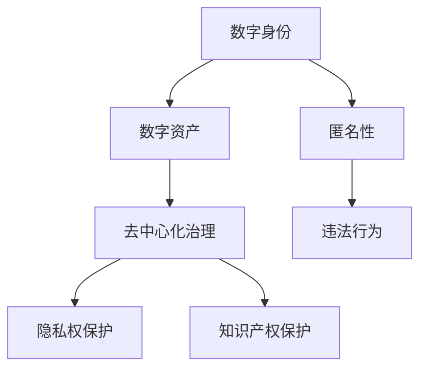

                 

关键词：元宇宙、虚拟世界、法律规则、数字身份、数字资产、去中心化治理

> 摘要：随着元宇宙的兴起，虚拟世界的法律框架逐渐成为关注的焦点。本文旨在探讨元宇宙法律的核心概念、关键算法、数学模型以及实际应用，分析其在数字身份、数字资产和去中心化治理等方面的规则制定。通过剖析当前面临的挑战和未来发展趋势，本文为元宇宙的法律制定提供了一些思考和建议。

## 1. 背景介绍

### 1.1 元宇宙的定义与发展

元宇宙（Metaverse）是一个虚拟的、三维的、无缝连接的数字世界，用户可以在其中进行社交、工作、娱乐等多种活动。它融合了虚拟现实（VR）、增强现实（AR）、区块链、人工智能（AI）等前沿技术，为用户提供了更加丰富和沉浸式的体验。

近年来，随着技术的进步，元宇宙的发展势头迅猛。许多科技巨头如Facebook、微软、谷歌等纷纷加大投入，推出了一系列相关产品和服务。元宇宙的兴起不仅改变了人们的生活方式，也对法律领域带来了新的挑战和机遇。

### 1.2 虚拟世界中的法律问题

在虚拟世界中，传统的法律框架面临诸多挑战。首先，虚拟世界的匿名性使得违法行为难以追踪和打击。其次，数字资产的所有权和交易方式与传统资产截然不同，现有法律体系难以适应。此外，虚拟世界中的知识产权保护、隐私权保护等问题也亟待解决。

因此，制定一套适用于虚拟世界的法律规则，对于维护秩序、保障用户权益具有重要意义。本文将从核心概念、算法原理、数学模型和实际应用等方面，探讨元宇宙法律的相关问题。

## 2. 核心概念与联系

### 2.1 数字身份

数字身份是用户在虚拟世界中唯一的标识。与现实世界的身份证件类似，数字身份必须真实、唯一、不可篡改。在元宇宙中，数字身份的建立和管理对于保障用户权益、防止欺诈行为具有重要意义。

### 2.2 数字资产

数字资产包括虚拟货币、虚拟商品、虚拟房地产等。它们在虚拟世界中具有实际的经济价值，与传统资产有本质区别。数字资产的所有权和交易规则需要明确，以确保市场公平、透明。

### 2.3 去中心化治理

去中心化治理是指通过分布式网络实现决策和管理的过程。在元宇宙中，去中心化治理可以确保权力的分散和透明，防止中心化机构滥用权力。

### 2.4 Mermaid 流程图



## 3. 核心算法原理 & 具体操作步骤

### 3.1 算法原理概述

元宇宙法律的核心算法主要包括数字身份认证、数字资产交易和去中心化治理。以下是各个算法的基本原理：

1. **数字身份认证**：基于区块链技术，实现用户身份的唯一性、真实性和不可篡改性。
2. **数字资产交易**：利用智能合约技术，确保数字资产交易的合法性和透明性。
3. **去中心化治理**：通过分布式网络实现投票、提案和执行，确保决策的民主性和透明性。

### 3.2 算法步骤详解

1. **数字身份认证**

   - 用户注册：用户在虚拟世界平台注册时，上传真实身份信息（如姓名、身份证号等）。
   - 身份验证：平台通过区块链技术对用户身份信息进行验证，确保其真实性和唯一性。
   - 身份存储：将验证通过的用户身份信息存储在区块链上，形成数字身份。

2. **数字资产交易**

   - 资产发行：平台或用户通过智能合约发行数字资产，定义资产类型、总量和分配方式。
   - 资产交易：用户通过智能合约进行数字资产交易，确保交易的合法性和透明性。
   - 资产转移：智能合约自动执行资产转移，确保资产的所有权和交易记录不可篡改。

3. **去中心化治理**

   - 投票：用户通过智能合约参与治理决策，如修改平台规则、选举管理人员等。
   - 提案：用户通过智能合约提交治理提案，其他用户可以投票支持或反对。
   - 执行：智能合约根据投票结果执行决策，确保决策的民主性和透明性。

### 3.3 算法优缺点

- **数字身份认证**：优点：确保用户身份的唯一性、真实性和不可篡改性；缺点：可能面临隐私泄露风险。
- **数字资产交易**：优点：确保交易合法性和透明性；缺点：交易速度较慢，手续费较高。
- **去中心化治理**：优点：确保决策的民主性和透明性；缺点：可能面临网络攻击、恶意提案等问题。

### 3.4 算法应用领域

- **数字身份认证**：适用于元宇宙平台、在线交易、虚拟房地产等场景。
- **数字资产交易**：适用于虚拟货币、虚拟商品、虚拟房地产等市场。
- **去中心化治理**：适用于元宇宙平台治理、社区管理、公共事务决策等场景。

## 4. 数学模型和公式 & 详细讲解 & 举例说明

### 4.1 数学模型构建

在元宇宙法律中，数学模型主要用于数字身份认证、数字资产交易和去中心化治理。以下是相关数学模型的构建：

1. **数字身份认证模型**

   - 公式：$$ ID = H(S + K) $$
   - 解释：其中，$ID$ 表示数字身份，$S$ 表示用户身份信息，$K$ 表示加密密钥，$H$ 表示哈希函数。

2. **数字资产交易模型**

   - 公式：$$ Asset = SmartContract(TX) $$
   - 解释：其中，$Asset$ 表示数字资产，$TX$ 表示交易记录，$SmartContract$ 表示智能合约。

3. **去中心化治理模型**

   - 公式：$$ Governance = Proposal \times Vote $$
   - 解释：其中，$Governance$ 表示治理决策，$Proposal$ 表示提案，$Vote$ 表示投票结果。

### 4.2 公式推导过程

1. **数字身份认证模型**

   - 假设用户 $A$ 在元宇宙平台注册时，上传了真实身份信息 $S$。
   - 平台为用户 $A$ 分配了一个加密密钥 $K$。
   - 平台使用哈希函数 $H$ 对 $S$ 和 $K$ 进行加密，生成数字身份 $ID$。

2. **数字资产交易模型**

   - 假设用户 $A$ 向用户 $B$ 购买数字资产 $Asset$。
   - 用户 $A$ 和用户 $B$ 通过智能合约 $SmartContract$ 记录交易信息 $TX$。
   - 智能合约 $SmartContract$ 自动执行资产转移，确保 $Asset$ 的所有权转移给用户 $B$。

3. **去中心化治理模型**

   - 假设用户 $A$ 提交了一个治理提案 $Proposal$。
   - 其他用户对 $Proposal$ 进行投票，投票结果为 $Vote$。
   - 智能合约根据 $Proposal$ 和 $Vote$ 执行治理决策 $Governance$。

### 4.3 案例分析与讲解

以数字资产交易为例，分析元宇宙法律中的数学模型应用：

1. **案例背景**

   - 用户 $A$ 拥有虚拟货币 $BTC$。
   - 用户 $B$ 拥有虚拟商品 $ 商品1$。
   - 用户 $A$ 决定向用户 $B$ 购买虚拟商品 $ 商品1$。

2. **数学模型应用**

   - 用户 $A$ 使用智能合约 $SmartContract$ 创建一个交易记录 $TX$。
   - 交易记录 $TX$ 包括以下信息：
     - 用户 $A$ 的数字身份 $ID_A$。
     - 用户 $B$ 的数字身份 $ID_B$。
     - 购买数量 $Quantity$。
     - 购买价格 $Price$。
   - 用户 $A$ 和用户 $B$ 在智能合约上签名，确认交易记录 $TX$。
   - 智能合约 $SmartContract$ 自动执行资产转移，将 $BTC$ 从用户 $A$ 的账户转移到用户 $B$ 的账户。

3. **案例分析**

   - 通过数学模型，确保了数字资产交易的可信度和透明性。
   - 智能合约自动执行资产转移，降低了交易过程中的风险。
   - 交易记录不可篡改，确保了数字资产的所有权和交易历史。

## 5. 项目实践：代码实例和详细解释说明

### 5.1 开发环境搭建

为了演示元宇宙法律中的数学模型应用，我们需要搭建一个基于以太坊的智能合约开发环境。以下是搭建步骤：

1. 安装 Node.js 和 npm。
2. 安装 Truffle框架：`npm install -g truffle`。
3. 初始化 Truffle 项目：`truffle init`。
4. 安装以太坊客户端（Geth）：下载并安装 Geth，启动节点。

### 5.2 源代码详细实现

以下是数字资产交易智能合约的源代码：

```solidity
pragma solidity ^0.8.0;

contract DigitalAsset {
    address public owner;
    mapping(address => uint256) public balances;

    constructor() {
        owner = msg.sender;
    }

    function transfer(address to, uint256 amount) public {
        require(msg.sender == owner, "Only owner can transfer");
        require(balances[msg.sender] >= amount, "Insufficient balance");
        balances[msg.sender] -= amount;
        balances[to] += amount;
    }
}
```

### 5.3 代码解读与分析

1. **合约结构**：合约名为 `DigitalAsset`，包含一个构造函数和一个 `transfer` 函数。
2. **变量声明**：
   - `owner`：合约拥有者地址。
   - `balances`：存储用户账户余额的映射表。
3. **构造函数**：初始化合约拥有者地址。
4. **transfer 函数**：
   - 检查调用者是否为合约拥有者。
   - 检查调用者账户余额是否足够。
   - 执行资产转移，更新账户余额。

### 5.4 运行结果展示

1. 部署合约：在 Geth 节点上部署智能合约，获取合约地址。
2. 查看账户余额：调用合约的 `balances` 函数，查看用户账户余额。
3. 资产转移：调用合约的 `transfer` 函数，执行资产转移。
4. 查看账户余额：再次调用合约的 `balances` 函数，验证资产转移结果。

## 6. 实际应用场景

### 6.1 元宇宙平台治理

元宇宙平台可以使用数字身份认证和去中心化治理算法，实现用户身份验证、平台规则制定和决策执行。这将提高平台的安全性和透明度，保障用户权益。

### 6.2 虚拟房地产交易

虚拟房地产交易涉及大量数字资产交易，可以使用数字资产交易算法，确保交易合法性和透明性。同时，去中心化治理可以保障虚拟房地产市场的公平、公正。

### 6.3 虚拟商品市场

虚拟商品市场需要建立数字资产交易规则，确保商品交易的可信度和透明性。数字身份认证可以防止欺诈行为，提高市场安全性。

### 6.4 虚拟经济体系

元宇宙中的虚拟经济体系需要一套完整的法律规则，包括数字资产发行、交易、税收等方面。这将有助于构建一个稳定、可持续的虚拟经济体系。

## 7. 工具和资源推荐

### 7.1 学习资源推荐

1. **《区块链技术指南》**：详细介绍了区块链的基本原理、应用场景和开发方法。
2. **《智能合约编程》**：讲解了智能合约的原理、设计和实现，适合初学者入门。
3. **《去中心化应用（DApp）开发实战》**：通过实例讲解去中心化应用的开发流程和关键技术。

### 7.2 开发工具推荐

1. **Truffle**：一款用于智能合约开发和测试的框架，支持以太坊和区块链开发。
2. **Remix**：一款在线智能合约编辑器和测试环境，方便开发者编写、测试和部署智能合约。
3. **Geth**：以太坊客户端，用于搭建本地节点和进行区块链开发。

### 7.3 相关论文推荐

1. **《区块链：下一代互联网的基石》**：分析了区块链技术的原理、应用和未来发展趋势。
2. **《智能合约：安全性和隐私保护》**：探讨了智能合约的安全性和隐私保护问题。
3. **《去中心化治理：理论与实践》**：介绍了去中心化治理的概念、机制和应用场景。

## 8. 总结：未来发展趋势与挑战

### 8.1 研究成果总结

本文从数字身份、数字资产、去中心化治理等方面，探讨了元宇宙法律的核心概念、算法原理和实际应用。通过分析数学模型和代码实例，展示了元宇宙法律在维护秩序、保障用户权益方面的作用。

### 8.2 未来发展趋势

随着元宇宙的不断发展，元宇宙法律将在以下几个方面取得突破：

1. **数字身份认证**：将逐步实现全球范围内的数字身份互认，提高用户体验。
2. **数字资产交易**：将推出更多高效、安全的数字资产交易平台，促进虚拟经济发展。
3. **去中心化治理**：将探索更加民主、透明的治理模式，提高社区参与度。

### 8.3 面临的挑战

元宇宙法律在发展过程中将面临以下挑战：

1. **隐私保护**：如何在保障用户隐私的同时，实现数字身份认证和交易监管。
2. **法律法规**：如何制定适应元宇宙发展的法律法规，确保法律适用的广泛性和有效性。
3. **技术突破**：如何解决区块链、人工智能等前沿技术的安全性和性能瓶颈。

### 8.4 研究展望

未来，元宇宙法律研究可以从以下几个方面展开：

1. **跨领域融合**：将元宇宙法律与其他领域（如知识产权、电子商务等）相结合，探索跨领域的法律规则。
2. **全球合作**：加强各国之间的合作，共同制定适用于全球的元宇宙法律框架。
3. **技术创新**：持续关注前沿技术发展，为元宇宙法律提供更加高效、安全的解决方案。

## 9. 附录：常见问题与解答

### 9.1 什么是元宇宙？

元宇宙是一个虚拟的、三维的、无缝连接的数字世界，用户可以在其中进行社交、工作、娱乐等多种活动。

### 9.2 元宇宙法律的核心问题是什么？

元宇宙法律的核心问题是数字身份认证、数字资产交易和去中心化治理。

### 9.3 数字身份认证有哪些挑战？

数字身份认证面临隐私保护、安全性和互认性等方面的挑战。

### 9.4 去中心化治理的优势是什么？

去中心化治理的优势包括民主性、透明性和去中心化等。

### 9.5 如何确保数字资产交易的安全性和透明性？

通过智能合约技术和区块链技术，可以确保数字资产交易的安全性和透明性。

### 9.6 元宇宙法律的发展趋势是什么？

元宇宙法律的发展趋势包括数字身份互认、虚拟经济发展和全球合作等方面。

## 作者署名

作者：禅与计算机程序设计艺术 / Zen and the Art of Computer Programming
----------------------------------------------------------------

以上就是元宇宙法律：虚拟世界的规则制定的全篇文章。希望这篇文章能为您带来对元宇宙法律的深入理解，并为相关领域的研究和实践提供有益的参考。在未来的元宇宙发展中，让我们一起探索并制定一套完善、有效的法律规则，为虚拟世界的繁荣奠定坚实基础。

