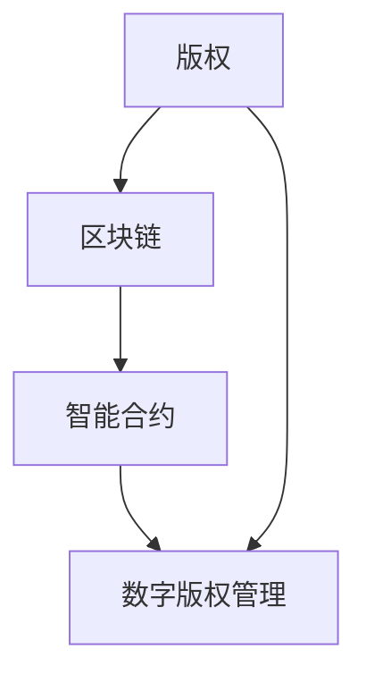

                 

关键词：元宇宙、版权保护、数字版权、智能管理、区块链、人工智能

> 摘要：随着元宇宙的兴起，数字版权保护成为了一个亟待解决的问题。本文将探讨元宇宙背景下数字版权保护的核心概念、算法原理、数学模型以及实际应用，并提出未来发展的趋势与挑战。

## 1. 背景介绍

随着互联网和数字技术的发展，数字版权问题日益凸显。特别是在元宇宙这样的虚拟世界中，数字内容的创作、分发和消费变得更加复杂和多样，使得版权保护变得尤为重要。元宇宙是一个虚拟的3D世界，用户可以在其中创建和体验各种虚拟场景和活动。这使得数字版权的保护问题变得更加复杂和多样化。

### 1.1 元宇宙简介

元宇宙（Metaverse）是一个虚拟的3D世界，用户可以在其中创建和体验各种虚拟场景和活动。它是一个高度沉浸式的数字世界，通过虚拟现实（VR）、增强现实（AR）等技术实现。元宇宙的应用范围广泛，包括游戏、社交、教育、工作等领域。

### 1.2 数字版权问题

数字版权问题主要涉及数字内容的原创性、归属权和控制权等方面。在元宇宙中，数字内容的创作、分发和消费变得高度复杂，使得数字版权的保护变得更加困难。例如，如何保护虚拟世界中的原创艺术作品、游戏内的虚拟物品等。

## 2. 核心概念与联系

在元宇宙中，数字版权保护的核心概念包括版权、区块链、智能合约等。以下是一个简化的Mermaid流程图，展示了这些概念之间的关系。



### 2.1 版权

版权是指原创作品的创作者对其作品所享有的权利。在元宇宙中，版权主要涉及虚拟世界中的原创数字内容，如艺术作品、游戏设计、虚拟物品等。

### 2.2 区块链

区块链是一种分布式账本技术，可以确保数据的安全性和不可篡改性。在数字版权保护中，区块链被用于记录版权信息，确保版权的透明性和可追溯性。

### 2.3 智能合约

智能合约是一种在区块链上自动执行代码的合约。在元宇宙中，智能合约可以自动执行版权许可和版权交易，确保版权的合法性和效率。

### 2.4 数字版权管理

数字版权管理（DRM）是指一系列技术和管理措施，用于保护数字内容的版权。在元宇宙中，数字版权管理涉及到版权的注册、许可、监控和维权等方面。

## 3. 核心算法原理 & 具体操作步骤

### 3.1 算法原理概述

元宇宙中的数字版权保护算法主要基于区块链技术和智能合约。以下是一个简化的算法原理概述。

### 3.2 算法步骤详解

1. **版权注册**：创作者将版权信息（如作品名称、作者、创作时间等）上传到区块链，进行版权注册。
2. **版权许可**：版权持有者通过智能合约向使用者发放版权许可，规定使用权限（如观看、复制、修改等）。
3. **版权交易**：版权持有者可以通过智能合约进行版权交易，将版权转让给其他用户。
4. **版权监控**：系统实时监控版权使用情况，发现侵权行为及时采取措施。

### 3.3 算法优缺点

**优点**：
- **透明性**：区块链技术确保版权信息透明，便于公众监督。
- **不可篡改性**：区块链上的数据具有高度可信性，防止版权信息被篡改。
- **高效性**：智能合约自动执行版权许可和交易，提高版权管理效率。

**缺点**：
- **技术门槛**：区块链和智能合约技术复杂，对普通用户有一定技术门槛。
- **成本问题**：区块链交易需要支付手续费，可能对小型创作者造成负担。

### 3.4 算法应用领域

数字版权保护算法在元宇宙中具有广泛的应用领域，包括游戏、影视、音乐、虚拟物品等。

## 4. 数学模型和公式 & 详细讲解 & 举例说明

### 4.1 数学模型构建

数字版权保护中的数学模型主要包括加密算法、哈希函数和签名算法等。

### 4.2 公式推导过程

- **加密算法**：加密公式为 $C = E(K, P)$，其中 $C$ 为密文，$K$ 为密钥，$P$ 为明文。
- **哈希函数**：哈希公式为 $H = Hash(P)$，其中 $H$ 为哈希值，$P$ 为输入数据。
- **签名算法**：签名公式为 $S = Sign(K, P)$，其中 $S$ 为签名，$K$ 为密钥，$P$ 为数据。

### 4.3 案例分析与讲解

假设一个创作者创建了一个虚拟艺术作品，并希望对其进行版权保护。以下是具体的操作步骤：

1. **版权注册**：创作者将艺术作品上传到区块链，并使用哈希函数生成哈希值，作为版权的唯一标识。
2. **版权许可**：创作者通过智能合约向使用者发放版权许可，规定使用权限（如观看、复制等）。
3. **版权交易**：使用者可以通过智能合约支付版权费用，获得相应权限。
4. **版权监控**：系统实时监控使用情况，发现侵权行为及时采取措施。

## 5. 项目实践：代码实例和详细解释说明

### 5.1 开发环境搭建

在开发数字版权保护项目时，需要搭建以下环境：

- **区块链平台**：例如Ethereum。
- **编程语言**：例如Solidity（用于编写智能合约）。
- **开发工具**：例如Truffle（用于部署和测试智能合约）。

### 5.2 源代码详细实现

以下是一个简单的数字版权保护智能合约的实现示例：

```solidity
pragma solidity ^0.8.0;

contract CopyrightProtection {
    mapping(string => bool) public copyrightRegistry;

    function registerCopyright(string memory _work) public {
        require(!copyrightRegistry[_work], "Copyright already registered");
        copyrightRegistry[_work] = true;
    }

    function requestPermission(string memory _work) public {
        require(copyrightRegistry[_work], "No copyright registered for this work");
        // ... 处理请求并发放权限的逻辑
    }

    // ... 其他相关功能的实现
}
```

### 5.3 代码解读与分析

以上代码实现了一个简单的数字版权保护智能合约，包括版权注册和请求权限两个功能。版权注册功能使用一个映射（mapping）结构存储版权信息，请求权限功能检查版权是否已注册，并根据结果执行相应操作。

### 5.4 运行结果展示

通过Truffle部署智能合约并调用相关函数，可以查看版权注册和请求权限的结果。例如：

```bash
$ truffle run registerCopyright "My Virtual Art"
```

## 6. 实际应用场景

### 6.1 游戏领域

在游戏领域，数字版权保护算法可以确保虚拟游戏物品的所有权和管理。例如，虚拟道具、装备等可以通过区块链和智能合约进行确权和交易，防止盗版和作弊行为。

### 6.2 影视领域

在影视领域，数字版权保护算法可以确保影视作品在全球范围内的版权管理。例如，电影、电视剧等可以通过区块链记录版权信息，进行版权授权和交易，确保内容的合法使用。

### 6.3 音乐领域

在音乐领域，数字版权保护算法可以确保音乐作品的版权归属和授权。例如，音乐创作者可以通过区块链记录音乐作品的版权信息，进行版权授权和交易，确保音乐作品的合法使用和收益分配。

## 7. 工具和资源推荐

### 7.1 学习资源推荐

- **区块链技术教程**：[Blockchain tutorials](https://www.blockchain.com/blockchain-tutorials)
- **Solidity教程**：[Solidity tutorials](https://solidity-by-example.org/)

### 7.2 开发工具推荐

- **Truffle**：[Truffle documentation](https://www.trufflesuite.com/docs/truffle/getting-started/quick-start)
- **Hardhat**：[Hardhat documentation](https://hardhat.org/getting-started/)

### 7.3 相关论文推荐

- **《Blockchain Technology: A Comprehensive Overview》**：作者：Sanghoon Hong, Yong Liu，期刊：IEEE Access
- **《Smart Contracts: A New Paradigm for Digital Asset Management》**：作者：Nicolas Christin，期刊：ACM Transactions on Computer Systems

## 8. 总结：未来发展趋势与挑战

### 8.1 研究成果总结

数字版权保护技术在元宇宙中的应用已经取得了一定的成果，包括区块链、智能合约等技术的应用，为数字版权的保护提供了新的途径。

### 8.2 未来发展趋势

随着元宇宙的不断发展，数字版权保护技术将更加成熟和普及。未来发展趋势包括：

- **区块链技术的进一步发展**：区块链技术的性能和安全性将得到进一步提升，为数字版权保护提供更好的支持。
- **智能合约的多样化**：智能合约将应用于更多场景，实现更复杂的版权管理功能。

### 8.3 面临的挑战

数字版权保护技术在元宇宙中仍然面临一些挑战，包括：

- **技术门槛**：区块链和智能合约技术复杂，对普通用户和技术开发人员提出了更高的要求。
- **法律法规**：数字版权保护相关的法律法规需要进一步完善，以适应元宇宙的发展。

### 8.4 研究展望

未来研究应重点关注以下几个方面：

- **提高技术性能**：优化区块链和智能合约的性能，提高数字版权保护的效率和可靠性。
- **降低技术门槛**：开发更易于使用的工具和平台，降低数字版权保护的门槛。

## 9. 附录：常见问题与解答

### 9.1 什么是区块链？

区块链是一种分布式数据库技术，用于存储和传输数据。它具有去中心化、不可篡改、透明等特点。

### 9.2 什么是智能合约？

智能合约是一种在区块链上自动执行代码的合约。它通过预定义的条件和操作，实现自动化执行和验证。

### 9.3 区块链和智能合约在数字版权保护中有什么作用？

区块链技术可以确保数字版权信息的透明性和不可篡改性，智能合约可以实现版权许可、交易等自动化操作，提高数字版权保护的效率和可靠性。

## 作者署名

作者：禅与计算机程序设计艺术 / Zen and the Art of Computer Programming
----------------------------------------------------------------

以上就是关于《元宇宙版权保护:数字版权的智能管理》的文章内容，希望对您有所帮助。如有任何疑问，请随时提问。

