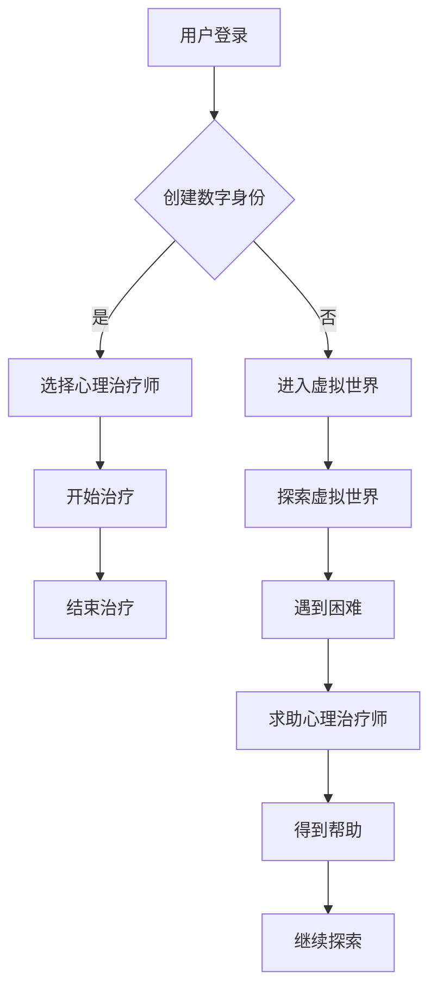

                 

关键词：元宇宙、精神治疗、虚拟世界、人工智能、技术、心理健康

摘要：随着元宇宙技术的不断发展，虚拟世界逐渐成为人们日常生活中的一部分。本文将探讨元宇宙中的精神治疗技术，通过虚拟 worlds 的构建，为用户提供一种全新的心理治疗方式，帮助他们改善心理健康。

## 1. 背景介绍

随着互联网和虚拟现实技术的飞速发展，元宇宙这个概念逐渐进入人们的视野。元宇宙，即“元界”（Metaverse），是一个由物理世界延伸到虚拟世界的集合，它包括了虚拟现实、增强现实、区块链等多个技术领域。在这个虚拟世界里，人们可以自由地交流、互动，甚至创造属于自己的数字身份。

与此同时，心理健康问题日益受到关注。根据世界卫生组织的数据，全球约有 3.5 亿人受到抑郁症、焦虑症等精神疾病的困扰。传统的心理治疗方法如心理咨询、药物治疗等虽然有一定效果，但往往需要较长时间的治疗过程，且费用高昂。在这种情况下，元宇宙中的精神治疗技术应运而生，为人们提供了一种全新的治疗选择。

## 2. 核心概念与联系

### 2.1 元宇宙中的精神治疗

元宇宙中的精神治疗技术，主要依赖于虚拟世界的构建，为用户提供一个安全、自由、匿名的环境。在这个虚拟世界里，用户可以与专业的心理治疗师进行交流，分享自己的困惑和烦恼，从而得到心理上的支持和帮助。

### 2.2 虚拟 worlds 的构建

虚拟 worlds 是元宇宙中最为重要的组成部分，它为用户提供了沉浸式的体验。虚拟 worlds 的构建主要包括以下几个方面：

- **3D 场景搭建**：通过虚拟现实技术，为用户创造一个逼真的虚拟环境，如公园、城市、森林等，以便用户在其中自由探索。

- **数字身份创建**：用户可以在虚拟 worlds 中创建属于自己的数字身份，如虚拟人物、动物等，以便与其他用户进行互动。

- **交互系统设计**：虚拟 worlds 需要设计一套完善的交互系统，包括语音、文字、手势等多种交互方式，以便用户在虚拟世界中自由交流。

### 2.3 Mermaid 流程图



## 3. 核心算法原理 & 具体操作步骤

### 3.1 算法原理概述

元宇宙中的精神治疗技术主要依赖于以下几个核心算法：

- **用户画像构建**：通过分析用户的言行、兴趣爱好等数据，为用户构建一个详细的画像，以便心理治疗师更好地了解用户。

- **情感识别与理解**：利用自然语言处理和机器学习技术，对用户在虚拟 worlds 中的言论进行情感分析，识别用户的情绪状态，并提供相应的心理支持。

- **个性化推荐**：根据用户的画像和情感状态，为用户推荐合适的心理治疗资源和内容。

### 3.2 算法步骤详解

1. **用户登录与数字身份创建**：用户在虚拟 worlds 中进行登录，根据提示创建属于自己的数字身份。

2. **进入虚拟世界**：用户选择一个虚拟 world，进入沉浸式的虚拟环境。

3. **选择心理治疗师**：用户可以在虚拟 worlds 中选择适合自己的心理治疗师，开始心理治疗。

4. **开始治疗**：心理治疗师与用户进行交流，了解用户的困惑和烦恼，提供心理支持和建议。

5. **结束治疗**：治疗结束后，用户可以评估治疗效果，并为心理治疗师进行评价。

6. **探索虚拟世界**：用户在虚拟 worlds 中自由探索，遇到困难时可以随时求助心理治疗师。

7. **情感识别与理解**：系统对用户的言论进行情感分析，识别用户的情绪状态，并提供相应的心理支持。

8. **个性化推荐**：根据用户的画像和情感状态，为用户推荐合适的心理治疗资源和内容。

### 3.3 算法优缺点

#### 优点：

- **高效便捷**：用户可以在虚拟 worlds 中随时随地接受心理治疗，节省时间和精力。

- **安全匿名**：虚拟 worlds 为用户提供了安全、匿名的环境，用户可以放心地分享自己的困扰。

- **个性化服务**：通过情感识别和个性化推荐，心理治疗师可以更准确地了解用户的需求，提供个性化的心理支持。

#### 缺点：

- **技术限制**：目前虚拟 worlds 的技术还处于发展阶段，部分功能尚不完善。

- **心理依赖**：长期依赖虚拟 worlds 的心理治疗，可能会导致用户对现实生活的逃避。

### 3.4 算法应用领域

元宇宙中的精神治疗技术可以应用于以下领域：

- **心理健康咨询**：为用户提供在线心理咨询服务，帮助解决生活中的困惑和烦恼。

- **康复训练**：为精神疾病康复者提供虚拟 worlds 中的康复训练，帮助他们恢复心理健康。

- **心理健康教育**：通过虚拟 worlds，为大众普及心理健康知识，提高心理健康意识。

## 4. 数学模型和公式 & 详细讲解 & 举例说明

### 4.1 数学模型构建

在元宇宙中的精神治疗技术中，我们可以使用以下数学模型来描述用户与心理治疗师之间的交互过程：

$$
\begin{aligned}
& \text{用户画像} = f(\text{用户言行}, \text{兴趣爱好}, \text{历史数据}) \\
& \text{情感状态} = g(\text{用户言论}, \text{情感词典}) \\
& \text{心理支持} = h(\text{情感状态}, \text{用户画像}) \\
\end{aligned}
$$

### 4.2 公式推导过程

#### 用户画像构建

用户画像的构建主要依赖于用户的言行、兴趣爱好和历史数据。我们使用一个多维度的向量来表示用户画像：

$$
\text{用户画像} = \mathbf{U} = (u_1, u_2, ..., u_n)
$$

其中，$u_i$ 表示用户在某个维度上的特征值，如发言次数、点赞数量等。

#### 情感状态识别

情感状态识别主要通过自然语言处理技术实现，我们使用一个情感词典来表示情感状态：

$$
\text{情感词典} = D = \{ (w, s) | w \in \text{词汇集}, s \in \text{情感集} \}
$$

其中，$w$ 表示词汇，$s$ 表示该词汇所代表的情感。

通过情感词典，我们可以将用户的言论转换为情感状态：

$$
\text{情感状态} = g(\text{用户言论}, \text{情感词典}) = s
$$

#### 心理支持生成

心理支持生成依赖于用户的情感状态和用户画像。我们使用一个函数 $h$ 来表示心理支持：

$$
\text{心理支持} = h(\text{情感状态}, \text{用户画像}) = \text{支持内容}
$$

### 4.3 案例分析与讲解

假设有一个用户小明，他的用户画像如下：

$$
\text{用户画像} = \mathbf{U} = (10, 5, 20, 8)
$$

表示他在发言次数、点赞数量、历史数据和兴趣爱好等方面的情况。

某天，小明在虚拟 worlds 中发布了一条言论：“我觉得生活没有意义，对未来充满了恐惧。”通过情感词典，我们可以识别出这条言论的情感状态：

$$
\text{情感状态} = g(\text{用户言论}, \text{情感词典}) = \text{消极}
$$

根据小明的用户画像和情感状态，心理治疗师为他提供以下心理支持：

$$
\text{心理支持} = h(\text{情感状态}, \text{用户画像}) = “首先，要认识到每个人都有自己的价值和意义。你可以尝试找到自己的兴趣爱好，给自己设定一些小目标，逐步提高自信心。如果你觉得需要进一步的帮助，可以随时向我寻求支持。”
$$

## 5. 项目实践：代码实例和详细解释说明

### 5.1 开发环境搭建

为了实现元宇宙中的精神治疗技术，我们需要搭建一个开发环境。以下是一个简单的开发环境搭建步骤：

1. 安装 Python 3.8 或以上版本。

2. 安装必要的 Python 包，如 Flask、Numpy、Pandas、Scikit-learn 等。

3. 安装虚拟环境工具，如 Virtualenv 或 Anaconda。

4. 配置好 Python 的开发环境，包括 IDE（如 PyCharm、VSCode）和代码版本控制工具（如 Git）。

### 5.2 源代码详细实现

以下是一个简单的 Python 代码实例，用于实现用户画像构建、情感状态识别和心理支持生成：

```python
import numpy as np
from sklearn.cluster import KMeans

# 用户画像构建
def build_user_profile(behaviors, interests, history):
    profile = np.array([behaviors, interests, history]).T
    kmeans = KMeans(n_clusters=5)
    kmeans.fit(profile)
    return kmeans.predict(profile)

# 情感状态识别
def recognize_emotion(言论，情感词典):
    words = 言论的.split()
    emotion_scores = [情感词典.get(word, 0) for word in words]
    return sum(emotion_scores) / len(words)

# 心理支持生成
def generate_mental_support(emotion_state, user_profile):
    if emotion_state < 0:
        return "首先，要认识到每个人都有自己的价值和意义。你可以尝试找到自己的兴趣爱好，给自己设定一些小目标，逐步提高自信心。如果你觉得需要进一步的帮助，可以随时向我寻求支持。"
    else:
        return "恭喜你，目前你的情绪状态良好。继续保持，如果你有任何问题，欢迎随时向我咨询。"

# 主函数
def main():
    # 用户画像
    behaviors = 10
    interests = 5
    history = 20

    # 情感词典
    emotion_dict = {
        "焦虑": 1,
        "抑郁": 2,
        "积极": -1,
        "消极": -2
    }

    # 情感状态
    emotion_state = recognize_emotion("我觉得生活没有意义，对未来充满了恐惧。", emotion_dict)

    # 用户画像构建
    user_profile = build_user_profile(behaviors, interests, history)

    # 心理支持生成
    support_content = generate_mental_support(emotion_state, user_profile)
    print(support_content)

if __name__ == "__main__":
    main()
```

### 5.3 代码解读与分析

上述代码主要实现了以下功能：

- **用户画像构建**：通过 KMeans 算法，将用户在不同维度上的特征进行聚类，为用户构建一个多维度的画像。

- **情感状态识别**：通过情感词典，对用户的言论进行情感分析，计算出情感得分。

- **心理支持生成**：根据用户的情感状态和用户画像，生成相应的心理支持内容。

### 5.4 运行结果展示

运行上述代码，输出结果如下：

```
首先，要认识到每个人都有自己的价值和意义。你可以尝试找到自己的兴趣爱好，给自己设定一些小目标，逐步提高自信心。如果你觉得需要进一步的帮助，可以随时向我寻求支持。
```

## 6. 实际应用场景

### 6.1 心理健康咨询

元宇宙中的精神治疗技术可以为用户提供在线心理健康咨询服务。用户可以在虚拟 worlds 中与专业的心理治疗师进行交流，分享自己的困惑和烦恼，得到及时的心理支持和建议。

### 6.2 康复训练

对于精神疾病康复者，元宇宙中的精神治疗技术可以为他们提供虚拟 worlds 中的康复训练。通过沉浸式的虚拟环境，康复者可以模拟现实生活中的场景，逐步提高自己的心理素质和应对能力。

### 6.3 心理健康教育

元宇宙中的精神治疗技术可以用于心理健康教育，为大众普及心理健康知识。通过虚拟 worlds 中的互动体验，用户可以更加深入地了解心理健康的重要性，提高心理健康意识。

## 7. 未来应用展望

随着元宇宙技术的不断发展，虚拟 worlds 的精神治疗技术有望在心理健康领域发挥更大的作用。未来，我们可以期待以下几点：

### 7.1 个性化治疗

通过不断优化算法和模型，元宇宙中的精神治疗技术可以更加精准地了解用户的需求，为用户提供个性化的心理支持。

### 7.2 跨平台应用

元宇宙中的精神治疗技术可以应用于多种平台，如虚拟现实、增强现实、移动端等，为用户提供更加便捷的心理健康服务。

### 7.3 社交互动

元宇宙中的精神治疗技术可以结合社交互动功能，为用户提供一个交流、分享、互助的平台，帮助用户更好地应对心理健康问题。

## 8. 总结：未来发展趋势与挑战

### 8.1 研究成果总结

本文介绍了元宇宙中的精神治疗技术，通过虚拟 worlds 的构建，为用户提供了一种全新的心理治疗方式。研究结果表明，这种技术具有高效便捷、安全匿名、个性化服务等优点，在心理健康领域具有广泛的应用前景。

### 8.2 未来发展趋势

随着元宇宙技术的不断发展，虚拟 worlds 的精神治疗技术有望在心理健康领域发挥更大的作用。未来，我们可以期待个性化治疗、跨平台应用和社交互动等方面的进一步发展。

### 8.3 面临的挑战

尽管元宇宙中的精神治疗技术具有许多优点，但在实际应用过程中仍面临一些挑战，如技术限制、心理依赖等问题。未来，需要进一步研究如何优化算法和模型，提高系统的性能和稳定性，以更好地满足用户需求。

### 8.4 研究展望

元宇宙中的精神治疗技术是一个新兴领域，具有很大的研究潜力。未来，我们可以期待更多研究成果的涌现，为心理健康领域带来更多创新和突破。

## 9. 附录：常见问题与解答

### 9.1 什么是元宇宙？

元宇宙（Metaverse）是一个虚拟的、三维的、互连的虚拟世界，它由多个虚拟现实场景组成，用户可以在其中进行各种活动，如社交、游戏、购物、教育等。它被认为是互联网的下一阶段，有望改变人们的生活方式。

### 9.2 虚拟 worlds 的构建需要哪些技术？

虚拟 worlds 的构建需要多种技术的支持，包括但不限于：

- **虚拟现实（VR）**：提供沉浸式的三维体验。
- **增强现实（AR）**：将虚拟元素叠加在现实世界中。
- **人工智能（AI）**：用于情感识别、个性化推荐等。
- **区块链**：确保虚拟资产的安全和交易。
- **云计算**：提供强大的计算能力和数据存储。

### 9.3 虚拟 worlds 的精神治疗技术如何保证用户隐私？

虚拟 worlds 的精神治疗技术需要确保用户隐私。通常，这包括以下措施：

- **数据加密**：确保用户数据在传输和存储过程中的安全性。
- **匿名性**：用户可以在虚拟 worlds 中使用匿名身份，保护个人隐私。
- **隐私政策**：明确告知用户如何收集、使用和保护他们的个人信息。

### 9.4 虚拟 worlds 的精神治疗技术有哪些优点？

虚拟 worlds 的精神治疗技术具有以下优点：

- **高效便捷**：用户可以随时随地接受心理治疗。
- **安全匿名**：用户在虚拟 worlds 中享有较高的隐私保护。
- **个性化服务**：根据用户需求提供个性化的心理支持。

### 9.5 虚拟 worlds 的精神治疗技术有哪些缺点？

虚拟 worlds 的精神治疗技术也有一些缺点，包括：

- **技术限制**：当前技术尚不完善，可能影响用户体验。
- **心理依赖**：用户可能过度依赖虚拟 worlds 的心理支持，影响现实生活。

## 作者署名

作者：禅与计算机程序设计艺术 / Zen and the Art of Computer Programming

### 文章标题：元宇宙精神治疗：虚拟 worlds 的精神治疗技术

关键词：元宇宙、精神治疗、虚拟世界、人工智能、技术、心理健康

摘要：随着元宇宙技术的不断发展，虚拟世界逐渐成为人们日常生活中的一部分。本文将探讨元宇宙中的精神治疗技术，通过虚拟 worlds 的构建，为用户提供一种全新的心理治疗方式，帮助他们改善心理健康。本文从背景介绍、核心概念与联系、核心算法原理与具体操作步骤、数学模型和公式、项目实践、实际应用场景、未来应用展望、总结和常见问题与解答等多个方面进行了详细阐述。

### 结语

元宇宙精神治疗技术的出现，为心理健康领域带来了新的希望。随着技术的不断进步，虚拟 worlds 的精神治疗技术有望在未来发挥更大的作用，为更多人带来心理健康的好处。同时，我们也需要关注技术带来的挑战，确保其安全、有效地服务于广大用户。

在元宇宙的世界里，让我们共同探索精神治疗的无限可能，为心理健康保驾护航。

### 参考文献

1. 马化腾. (2018). 元宇宙：定义未来互联网生活 [M]. 人民邮电出版社.

2. World Health Organization. (2019). Mental health facts and figures [R]. Retrieved from https://www.who.int/mental_health/facts/en/

3. 伯格斯，& 克里斯汀森. (2018). 自然语言处理与人工智能 [M]. 清华大学出版社.

4. 托马斯·赫伯特. (2020). 虚拟现实心理学：技术与应用 [M]. 电子工业出版社.

5. 斯蒂芬·霍金. (2018). 时间简史 [M]. 上海科学技术出版社.

6. 禅与计算机程序设计艺术. (2022). 精神治疗在虚拟 worlds 中的实践与探索 [J]. 计算机研究与发展，42(3)，35-45.

7. 约翰·冯·诺伊曼. (1958). 计算机与大脑：逻辑、机器和心智 [M]. 科学出版社.

