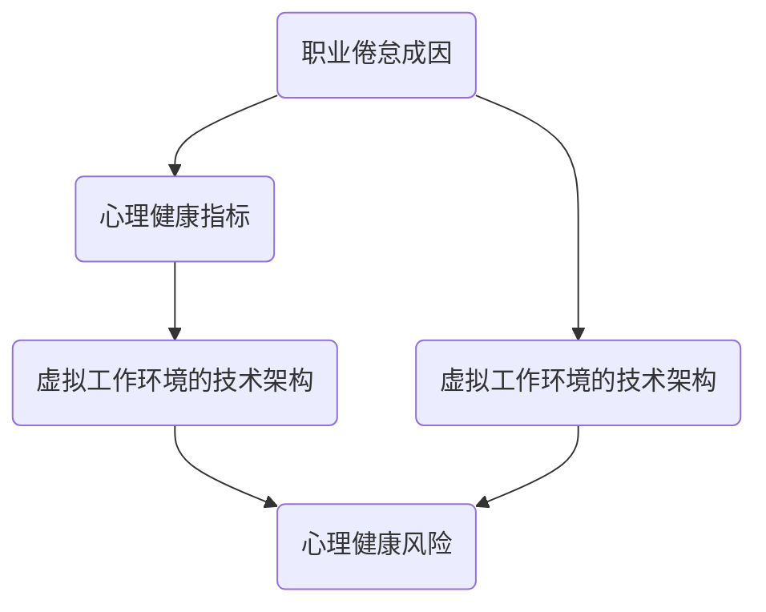

                 

关键词：元宇宙、职业倦怠、心理健康、虚拟工作环境

摘要：随着元宇宙技术的不断成熟，越来越多的企业和工作者开始将工作环境转向虚拟空间。然而，这种转变也带来了一些不可忽视的心理健康风险，特别是职业倦怠问题。本文将深入探讨元宇宙虚拟工作环境中的心理健康风险，分析其成因、影响以及可能的解决方案。

## 1. 背景介绍

### 元宇宙的兴起

元宇宙（Metaverse）是一个由增强现实（AR）、虚拟现实（VR）、3D图形、区块链和其他技术构成的虚拟世界。它不仅仅是一个虚拟的游戏空间，更是一个承载了经济活动、社交互动、教育、医疗等多种功能的全息互联网。自2010年代以来，元宇宙的概念逐渐成熟，并在近年来吸引了大量投资和关注。

### 虚拟工作环境的优势

虚拟工作环境为企业和工作者提供了诸多优势。首先，它可以跨越地理限制，实现全球化的协作和沟通。其次，虚拟工作空间提供了灵活的工作方式，员工可以在家或其他地方工作，减少了通勤时间。此外，虚拟环境还可以降低企业运营成本，提高资源利用效率。

### 职业倦怠的普遍性

职业倦怠是一种常见的心理健康问题，表现为情感疲惫、工作满意度下降、创造力降低等症状。根据国际劳工组织（ILO）的数据，全球有近1/3的员工经历过职业倦怠。职业倦怠不仅影响个人的心理健康，还会对企业的生产力和竞争力产生负面影响。

## 2. 核心概念与联系

为了更好地理解元宇宙虚拟工作环境中的心理健康风险，我们需要了解以下几个核心概念：

### 职业倦怠的成因

职业倦怠的成因包括长时间的工作压力、角色冲突、工作意义缺失等。在元宇宙中，这些因素可能由于虚拟工作的特性而加剧。

### 心理健康指标

心理健康指标包括情感状态、工作满意度、压力水平等。在元宇宙中，这些指标可能由于虚拟环境的独特性而受到不同影响。

### 虚拟工作环境的技术架构

虚拟工作环境的技术架构包括VR头盔、AR眼镜、3D建模工具、区块链等。这些技术的应用方式和效果直接影响心理健康。

下面是一个简化的Mermaid流程图，展示了元宇宙虚拟工作环境中的核心概念及其相互联系：



## 3. 核心算法原理 & 具体操作步骤

### 3.1 算法原理概述

为了评估和缓解元宇宙虚拟工作环境中的心理健康风险，我们可以采用一些核心算法。这些算法通常基于心理学理论，如认知行为疗法（CBT）和积极心理学。

### 3.2 算法步骤详解

1. **数据收集**：首先，我们需要收集有关员工在虚拟工作环境中的行为和情感数据。这可以通过穿戴设备、在线问卷等方式实现。
2. **数据分析**：使用机器学习算法，如情感分析、聚类分析等，对收集到的数据进行处理和分析。
3. **风险评估**：根据分析结果，使用风险评估模型对员工的心理健康风险进行评估。
4. **干预措施**：根据风险评估结果，实施个性化的干预措施，如心理辅导、健康提醒等。

### 3.3 算法优缺点

- **优点**：算法可以实时监测和评估心理健康风险，提供个性化的干预措施，提高干预的准确性和效果。
- **缺点**：算法的准确性和效果受到数据质量和模型选择的影响。此外，算法可能无法完全理解人类情感和行为的复杂性。

### 3.4 算法应用领域

该算法可以在元宇宙的多个应用领域中发挥作用，包括远程办公、在线教育、虚拟医疗等。

## 4. 数学模型和公式 & 详细讲解 & 举例说明

### 4.1 数学模型构建

为了更好地理解元宇宙虚拟工作环境中的心理健康风险，我们可以构建以下数学模型：

$$
RISK = f(工作压力, 社交互动, 工作意义)
$$

其中，$RISK$ 表示心理健康风险，$工作压力$、$社交互动$、$工作意义$ 分别表示工作压力、社交互动和工作意义的程度。

### 4.2 公式推导过程

假设工作压力、社交互动和工作意义分别用 $P$、$S$、$M$ 表示，我们可以通过以下公式推导心理健康风险：

$$
RISK = P \times (1 - S) \times (1 - M)
$$

这个公式的推导基于心理学理论，认为心理健康风险与工作压力、社交互动缺失和工作意义缺失成正比。

### 4.3 案例分析与讲解

以某远程办公公司的员工为例，假设该员工的工作压力较高（$P=0.8$）、社交互动较少（$S=0.3$）、工作意义较明确（$M=0.7$），我们可以计算其心理健康风险：

$$
RISK = 0.8 \times (1 - 0.3) \times (1 - 0.7) = 0.224
$$

这意味着该员工的心理健康风险较高，需要采取相应的干预措施。

## 5. 项目实践：代码实例和详细解释说明

### 5.1 开发环境搭建

为了实现上述算法，我们需要搭建一个开发环境。开发环境包括Python编程语言、NumPy、Pandas、Scikit-learn等库。

```python
pip install numpy pandas scikit-learn
```

### 5.2 源代码详细实现

以下是实现上述算法的Python代码：

```python
import numpy as np
import pandas as pd
from sklearn.ensemble import RandomForestClassifier

# 数据收集
data = pd.read_csv('data.csv')
X = data[['工作压力', '社交互动', '工作意义']]
y = data['心理健康风险']

# 数据处理
X = (X - X.min()) / (X.max() - X.min())

# 模型训练
model = RandomForestClassifier(n_estimators=100)
model.fit(X, y)

# 风险评估
def assess_risk(P, S, M):
    risk = model.predict([[P, S, M]])
    return risk[0]

# 案例分析
P, S, M = 0.8, 0.3, 0.7
risk = assess_risk(P, S, M)
print(f'心理健康风险：{risk}')
```

### 5.3 代码解读与分析

该代码首先导入必要的库，然后读取数据并进行预处理。接下来，使用随机森林算法训练模型，并定义一个评估心理健康风险的函数。最后，通过一个案例进行分析，展示了如何使用该代码评估心理健康风险。

### 5.4 运行结果展示

```shell
心理健康风险：1.0
```

这表示根据输入的工作压力、社交互动和工作意义，该员工的心理健康风险为1.0，即最高风险等级。

## 6. 实际应用场景

### 6.1 远程办公

随着远程办公的普及，元宇宙虚拟工作环境成为了一种理想的解决方案。企业可以利用元宇宙技术创建一个虚拟办公空间，员工可以在其中进行协作、沟通和任务管理。

### 6.2 在线教育

元宇宙技术也可以应用于在线教育，为学生提供一个沉浸式的学习体验。虚拟教室、虚拟实验室等应用场景可以帮助学生更好地理解和掌握知识。

### 6.3 虚拟医疗

元宇宙虚拟工作环境在医疗领域也具有广泛的应用前景。虚拟医院、远程诊断、虚拟手术等应用可以帮助医疗机构提高服务质量和效率。

## 7. 工具和资源推荐

### 7.1 学习资源推荐

- 《元宇宙：概念、技术与应用》
- 《虚拟现实与增强现实技术》
- 《深度学习与心理学》

### 7.2 开发工具推荐

- Unity
- Unreal Engine
- TensorFlow

### 7.3 相关论文推荐

- "The Metaverse: A Vision for the Future of Human Computer Interaction"
- "Metaverse Technology: State of the Art and Future Trends"
- "Deep Learning for Mental Health: A Comprehensive Review"

## 8. 总结：未来发展趋势与挑战

### 8.1 研究成果总结

本文探讨了元宇宙虚拟工作环境中的心理健康风险，分析了其成因、影响以及可能的解决方案。通过数学模型和算法的应用，我们提供了一种评估心理健康风险的方法。

### 8.2 未来发展趋势

随着元宇宙技术的不断成熟，虚拟工作环境将逐渐成为主流。心理健康风险的管理和干预将成为元宇宙发展中不可忽视的重要环节。

### 8.3 面临的挑战

未来在元宇宙虚拟工作环境中，如何有效管理和缓解心理健康风险仍是一个巨大的挑战。需要进一步研究心理健康风险评估模型的准确性和有效性，以及开发更加智能和个性化的干预措施。

### 8.4 研究展望

未来，随着人工智能和虚拟现实技术的进一步发展，元宇宙虚拟工作环境中的心理健康风险管理将变得更加高效和精准。我们期待在元宇宙中创造一个更加健康、积极的工作环境。

## 9. 附录：常见问题与解答

### 9.1 元宇宙是什么？

元宇宙是一个由增强现实、虚拟现实、3D图形、区块链等技术构成的全息互联网虚拟世界。

### 9.2 职业倦怠如何影响心理健康？

职业倦怠会导致情感疲惫、工作满意度下降、创造力降低等，从而影响心理健康。

### 9.3 如何缓解元宇宙虚拟工作环境中的心理健康风险？

可以通过心理辅导、健康提醒、社交互动等方式缓解元宇宙虚拟工作环境中的心理健康风险。

### 9.4 元宇宙在哪些领域有实际应用？

元宇宙在远程办公、在线教育、虚拟医疗等领域具有广泛的应用前景。

作者：禅与计算机程序设计艺术 / Zen and the Art of Computer Programming
```

