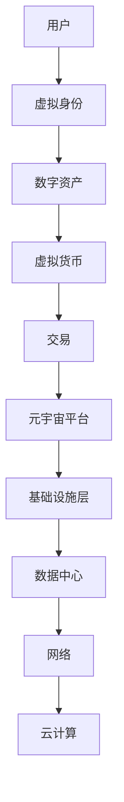

                 

关键词：元宇宙、职业规划、虚拟世界、职业发展、技能需求

> 摘要：随着元宇宙的兴起，虚拟世界的职业发展路径成为了一个热门话题。本文将深入探讨元宇宙中的职业规划，分析虚拟世界对传统职业的冲击，并探讨个人如何在元宇宙中找到合适的职业发展路径。

## 1. 背景介绍

### 元宇宙的定义

元宇宙是一个基于区块链和虚拟现实技术构建的虚拟世界，它融合了多种技术，如虚拟现实（VR）、增强现实（AR）、数字货币、智能合约等，为用户提供了全新的交互方式和体验。元宇宙不仅是娱乐和社交的场所，更是各种商业活动的新平台。

### 元宇宙的兴起

近年来，随着技术的进步和用户需求的增加，元宇宙的兴起已经成为不可逆转的趋势。许多知名科技公司，如Facebook、谷歌、微软等，都在积极布局元宇宙，推出相关产品和服务。

## 2. 核心概念与联系

### 元宇宙中的核心概念

在元宇宙中，有几个核心概念需要了解：

- **虚拟身份**：用户在元宇宙中的数字代表，可以是虚拟人物或动物等。
- **数字资产**：在元宇宙中可以交易和转移的数字资产，如虚拟地产、虚拟商品等。
- **虚拟货币**：在元宇宙中用于交易和支付的工具，如加密货币等。

### 元宇宙的架构

元宇宙的架构可以分为三个层次：

1. **基础设施层**：包括云计算、数据中心、网络基础设施等。
2. **平台层**：包括虚拟现实、增强现实等技术，以及提供元宇宙服务的平台。
3. **应用层**：包括各种元宇宙中的应用程序和服务，如游戏、社交、电商等。

### Mermaid 流程图



## 3. 核心算法原理 & 具体操作步骤

### 3.1 算法原理概述

在元宇宙中，核心算法主要涉及以下几个方面：

- **虚拟现实算法**：用于创建和渲染虚拟环境。
- **智能合约算法**：用于处理元宇宙中的数字资产交易。
- **区块链算法**：用于确保元宇宙中的数据安全和交易透明。

### 3.2 算法步骤详解

#### 3.2.1 虚拟现实算法

1. **数据采集**：通过传感器、摄像头等设备采集现实世界的三维数据。
2. **数据处理**：对采集到的数据进行处理，包括降噪、增强、建模等。
3. **渲染**：使用图形渲染技术将处理后的数据转换为虚拟环境。

#### 3.2.2 智能合约算法

1. **编写合约**：根据业务需求编写智能合约代码。
2. **部署合约**：将智能合约部署到区块链网络。
3. **执行合约**：在元宇宙中进行交易时，自动执行智能合约。

#### 3.2.3 区块链算法

1. **数据加密**：使用加密算法保护元宇宙中的数据。
2. **分布式存储**：将数据分布式存储在区块链网络中。
3. **交易验证**：通过共识算法验证交易的合法性。

### 3.3 算法优缺点

#### 虚拟现实算法

- **优点**：提供沉浸式体验，增强用户互动性。
- **缺点**：计算资源消耗大，对硬件要求高。

#### 智能合约算法

- **优点**：提高交易效率，降低成本。
- **缺点**：代码一旦部署，难以更改。

#### 区块链算法

- **优点**：确保数据安全，提高透明度。
- **缺点**：交易速度较慢，存储容量有限。

### 3.4 算法应用领域

- **虚拟现实算法**：游戏、教育、医疗等。
- **智能合约算法**：金融、电商、供应链管理等。
- **区块链算法**：数字资产交易、去中心化应用等。

## 4. 数学模型和公式 & 详细讲解 & 举例说明

### 4.1 数学模型构建

在元宇宙中，数学模型主要用于以下几个方面：

- **三维建模**：使用向量计算和几何算法构建虚拟环境。
- **智能合约**：使用逻辑运算和条件语句编写智能合约代码。
- **区块链**：使用加密算法和共识算法保证数据安全。

### 4.2 公式推导过程

#### 三维建模

- **向量计算**：$$ \vec{v} = \vec{p_2} - \vec{p_1} $$
- **几何算法**：$$ \text{距离} = \sqrt{(x_2 - x_1)^2 + (y_2 - y_1)^2 + (z_2 - z_1)^2} $$

#### 智能合约

- **逻辑运算**：$$ \text{条件} ? \text{值1} : \text{值2} $$
- **条件语句**：$$ \text{if} \ \text{条件} \ \text{then} \ \text{操作} $$

#### 区块链

- **加密算法**：$$ \text{加密}(\text{明文}, \text{密钥}) = \text{密文} $$
- **共识算法**：$$ \text{验证}(\text{交易}, \text{签名}) = \text{真} \ \text{或} \ \text{假} $$

### 4.3 案例分析与讲解

#### 三维建模案例

假设我们有一个三维空间中的两个点 $P_1(1, 2, 3)$ 和 $P_2(4, 5, 6)$，我们需要计算这两个点之间的距离。

使用向量计算公式，我们有：

$$ \vec{v} = \vec{p_2} - \vec{p_1} = (4-1, 5-2, 6-3) = (3, 3, 3) $$

然后计算向量 $ \vec{v} $ 的长度：

$$ \text{距离} = \sqrt{(3)^2 + (3)^2 + (3)^2} = \sqrt{27} = 3\sqrt{3} $$

#### 智能合约案例

假设我们编写一个简单的智能合约，用于计算两个数的和。

```solidity
pragma solidity ^0.8.0;

contract Calculator {
    function add(uint a, uint b) public pure returns (uint) {
        return a + b;
    }
}
```

在这个例子中，我们使用了条件语句来计算两个数的和。

#### 区块链案例

假设我们使用椭圆曲线加密算法来加密一段明文。

```plaintext
明文: Hello, World!
密钥: 123456
加密后的密文: b'0x8c8a0b092322d636610b3d1d8022c6a5d4c588dab8e1d34c5e2d90c9237d6945'
```

在这个例子中，我们使用了加密算法将明文加密为密文。

## 5. 项目实践：代码实例和详细解释说明

### 5.1 开发环境搭建

为了在元宇宙中进行开发，我们需要搭建一个合适的开发环境。以下是搭建开发环境的基本步骤：

1. 安装Node.js和npm。
2. 安装Truffle框架和Ganache模拟区块链。
3. 创建一个智能合约项目。

### 5.2 源代码详细实现

以下是使用Truffle框架创建的一个简单的智能合约项目。

```solidity
// SPDX-License-Identifier: MIT
pragma solidity ^0.8.0;

contract MetaVerse {
    mapping(address => uint) public balanceOf;

    function deposit() external payable {
        balanceOf[msg.sender()] += msg.value;
    }

    function withdraw(uint amount) external {
        require(amount <= balanceOf[msg.sender()], "Insufficient balance");
        balanceOf[msg.sender()] -= amount;
        payable(msg.sender()).transfer(amount);
    }
}
```

在这个智能合约中，我们实现了存款和取款的功能。

### 5.3 代码解读与分析

在这个智能合约中，我们使用了两个核心函数：

- `deposit()`：用于存款，接收以太币并将其添加到合约的余额。
- `withdraw()`：用于取款，从合约的余额中减去指定的金额并返回给调用者。

### 5.4 运行结果展示

通过使用Ganache模拟区块链，我们可以测试这个智能合约的功能。

```plaintext
> truffle console
> await metaVerse.deposit({value: web3.utils.toWei('1', 'ether')});
> await metaVerse.withdraw(web3.utils.toWei('0.5', 'ether'));
```

在这个例子中，我们首先向合约存款1以太币，然后从合约中取款0.5以太币。

## 6. 实际应用场景

### 6.1 虚拟现实游戏

在元宇宙中，虚拟现实游戏是一个重要的应用领域。玩家可以在虚拟世界中进行游戏，体验沉浸式的游戏体验。

### 6.2 虚拟房地产

元宇宙中的虚拟房地产也成为了一种新的投资方式。用户可以购买、租赁和出售虚拟地产，实现虚拟世界的财富增值。

### 6.3 虚拟社交

虚拟社交是元宇宙的另一个重要应用。用户可以在虚拟世界中建立社交关系，进行互动和交流。

### 6.4 虚拟教育与培训

元宇宙为教育和培训提供了新的机会。通过虚拟现实技术，用户可以进行在线学习、模拟实验和互动培训。

## 7. 工具和资源推荐

### 7.1 学习资源推荐

- **《区块链技术指南》**：详细介绍了区块链的基础知识和应用。
- **《智能合约开发实战》**：通过实际案例讲解了智能合约的开发和部署。

### 7.2 开发工具推荐

- **Truffle**：一个用于以太坊开发的框架。
- **Ganache**：一个用于本地模拟以太坊区块链的工具。

### 7.3 相关论文推荐

- **《元宇宙：虚拟世界的未来》**：讨论了元宇宙的概念、架构和应用。
- **《区块链与虚拟现实：融合与创新》**：探讨了区块链和虚拟现实技术的结合。

## 8. 总结：未来发展趋势与挑战

### 8.1 研究成果总结

随着技术的不断进步，元宇宙已经成为一个热门领域。已经有许多研究成果展示了元宇宙的潜力，如虚拟现实、区块链、智能合约等技术的应用。

### 8.2 未来发展趋势

预计元宇宙将继续快速发展，为各行业带来新的机会。未来，我们将看到更多的虚拟现实应用、更高效的区块链技术和更智能的智能合约。

### 8.3 面临的挑战

尽管元宇宙具有巨大的潜力，但也面临着一些挑战。包括技术问题、法律问题、隐私问题等。

### 8.4 研究展望

随着技术的不断进步，元宇宙将不断发展。未来，我们将看到更多的创新应用和更高效的解决方案。

## 9. 附录：常见问题与解答

### 问题1：元宇宙中的虚拟货币是什么？

元宇宙中的虚拟货币是指在元宇宙中进行交易和支付的工具，通常是加密货币，如比特币、以太坊等。

### 问题2：如何进入元宇宙？

要进入元宇宙，你需要安装一个虚拟现实头盔或使用手机或电脑进行远程连接。

### 问题3：元宇宙中的职业有哪些？

元宇宙中的职业包括虚拟房地产开发商、虚拟商品制造商、虚拟世界导游、虚拟现实游戏设计师等。

---

作者：禅与计算机程序设计艺术 / Zen and the Art of Computer Programming
----------------------------------------------------------------


