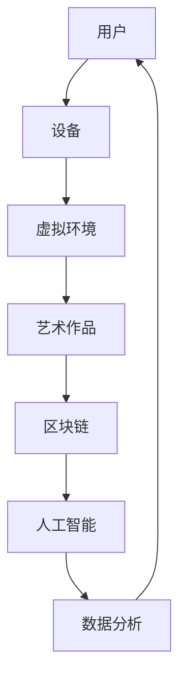

                 

关键词：元宇宙、艺术、创作平台、虚拟现实、技术创新、物理限制

> 摘要：随着虚拟现实技术的发展，元宇宙正逐渐成为艺术家们创作的新平台。本文将探讨元宇宙艺术的概念、核心技术与未来趋势，以及如何突破物理限制，为艺术家们提供更广阔的创作空间。

## 1. 背景介绍

在过去的几十年中，计算机技术取得了飞速发展，特别是在图形处理和虚拟现实领域。虚拟现实技术（VR）和增强现实技术（AR）的出现，为人们提供了一个全新的感官体验世界。然而，虚拟现实技术始终受限于物理世界的限制，如设备的局限性、交互方式的限制等。随着计算能力和网络技术的不断提升，元宇宙的概念逐渐浮出水面。

元宇宙（Metaverse）是一个虚拟的三维空间，通过互联网连接的多个虚拟世界，用户可以在其中自由互动、创作和体验。元宇宙不仅是一个技术平台，更是一个全新的艺术创作领域。它突破了传统的物理限制，为艺术家们提供了一个无限的创作空间。

## 2. 核心概念与联系

### 2.1 元宇宙艺术的概念

元宇宙艺术是指艺术家在虚拟环境中创作和展示的艺术作品。这些作品可以是静态的，如虚拟画布上的画作；也可以是动态的，如虚拟表演和交互式体验。元宇宙艺术的特点在于：

- **沉浸式体验**：用户可以全身心地投入到虚拟世界中，感受艺术作品的魅力。
- **交互性**：用户可以通过各种方式与艺术作品互动，改变作品的展示效果。
- **多样性**：元宇宙艺术涵盖了绘画、雕塑、音乐、表演等多种艺术形式。

### 2.2 元宇宙艺术的联系

元宇宙艺术与虚拟现实技术、区块链技术、人工智能等技术有着紧密的联系。

- **虚拟现实技术**：虚拟现实技术为元宇宙艺术提供了沉浸式体验的基础，使得艺术家能够创造出生动、逼真的虚拟环境。
- **区块链技术**：区块链技术为元宇宙艺术提供了数字版权保护和交易机制，确保艺术家能够获得应有的报酬。
- **人工智能**：人工智能技术可以帮助艺术家创作出更加个性化和智能化的作品，提升艺术创作的效率。

### 2.3 元宇宙艺术架构图

以下是一个简化的元宇宙艺术架构图：



在这个架构图中，用户通过设备进入虚拟环境，浏览和交互艺术作品。区块链技术用于版权保护和交易，人工智能技术用于创作和数据分析，从而形成一个完整的元宇宙艺术生态系统。

## 3. 核心算法原理 & 具体操作步骤

### 3.1 算法原理概述

元宇宙艺术的核心算法主要涉及以下几个方面：

- **虚拟环境生成算法**：用于创建逼真的虚拟场景。
- **交互算法**：用于处理用户与虚拟环境的交互。
- **版权保护算法**：用于保护艺术作品的版权。
- **人工智能创作算法**：用于自动化艺术创作。

### 3.2 算法步骤详解

#### 3.2.1 虚拟环境生成算法

虚拟环境生成算法主要分为以下几个步骤：

1. **场景建模**：使用3D建模工具创建场景。
2. **材质贴图**：为场景中的物体添加材质和纹理。
3. **光照计算**：根据光照模型计算场景中的光照效果。
4. **渲染**：将场景渲染成2D图像。

#### 3.2.2 交互算法

交互算法主要涉及以下几个方面：

1. **输入处理**：接收用户的输入，如鼠标、键盘、手柄等。
2. **动作映射**：将输入映射到虚拟环境中的动作，如移动、旋转等。
3. **反馈生成**：根据用户的动作生成反馈，如音效、震动等。

#### 3.2.3 版权保护算法

版权保护算法主要分为以下几个步骤：

1. **数字签名**：使用数字签名技术确保艺术作品的唯一性和不可篡改性。
2. **区块链记录**：将艺术作品的数字签名记录在区块链上，确保版权信息的可追溯性。
3. **智能合约**：使用智能合约实现艺术作品的版权交易。

#### 3.2.4 人工智能创作算法

人工智能创作算法主要分为以下几个步骤：

1. **数据收集**：收集大量的艺术作品数据。
2. **特征提取**：从数据中提取出艺术作品的特征。
3. **生成模型训练**：使用生成模型训练出艺术作品的生成算法。
4. **生成作品**：使用训练好的模型生成新的艺术作品。

### 3.3 算法优缺点

#### 3.3.1 优点

- **沉浸式体验**：虚拟环境生成算法和交互算法可以提供高度沉浸式的体验，让用户感受到仿佛置身于现实世界。
- **版权保护**：版权保护算法可以有效保护艺术作品的版权，确保艺术家的权益。
- **自动化创作**：人工智能创作算法可以自动化艺术创作过程，提高创作效率。

#### 3.3.2 缺点

- **技术门槛**：元宇宙艺术的实现需要较高的技术门槛，对于普通用户来说可能难以理解和使用。
- **成本高**：虚拟环境生成和人工智能创作算法需要大量的计算资源和存储资源，成本较高。
- **隐私问题**：元宇宙艺术可能会涉及到用户的隐私问题，如用户数据的安全性和匿名性。

### 3.4 算法应用领域

元宇宙艺术算法主要应用于以下几个方面：

- **艺术创作**：艺术家可以使用元宇宙艺术平台创作出独特的艺术作品。
- **虚拟展览**：博物馆和画廊可以使用元宇宙艺术平台举办虚拟展览。
- **虚拟教育**：教育机构可以使用元宇宙艺术平台进行虚拟教学。
- **虚拟旅游**：用户可以体验虚拟旅游，游览世界各地的名胜古迹。

## 4. 数学模型和公式 & 详细讲解 & 举例说明

### 4.1 数学模型构建

元宇宙艺术中的数学模型主要包括以下几个方面：

- **3D建模**：使用3D数学模型构建虚拟场景。
- **光照计算**：使用光照模型计算场景中的光照效果。
- **交互算法**：使用数学模型描述用户与虚拟环境的交互。

### 4.2 公式推导过程

以下是一个简化的3D光照计算模型：

$$
L_i = I_0 \cdot (1 - G \cdot N \cdot \cos \theta)
$$

其中，$L_i$ 是光照强度，$I_0$ 是光源强度，$G$ 是光照衰减系数，$N$ 是表面法线，$\theta$ 是光线与法线的夹角。

### 4.3 案例分析与讲解

假设我们有一个光源位于虚拟场景的左上角，光源强度为100，光照衰减系数为0.5。场景中的物体表面法线为 $(0, 0, 1)$，光线与法线的夹角为30度。

根据上述公式，可以计算出光照强度为：

$$
L_i = 100 \cdot (1 - 0.5 \cdot 1 \cdot \cos 30^\circ) \approx 71.55
$$

这意味着物体表面受到的光照强度约为71.55。

## 5. 项目实践：代码实例和详细解释说明

### 5.1 开发环境搭建

为了实现元宇宙艺术，我们需要搭建一个开发环境。这里我们使用Unity引擎作为开发工具。

1. **下载Unity Hub**：访问Unity官网（https://unity.com/），下载并安装Unity Hub。
2. **创建新项目**：在Unity Hub中创建一个新的Unity项目，选择2D或3D项目类型。
3. **安装必要插件**：在Unity项目中安装必要的插件，如Unity Ads、Unity Analytics等。

### 5.2 源代码详细实现

以下是一个简单的Unity C#脚本，用于实现一个基本的虚拟环境光照计算。

```csharp
using UnityEngine;

public class LightCalculator : MonoBehaviour
{
    public Light sourceLight;
    public Material surfaceMaterial;

    private void Start()
    {
        // 设置光源参数
        sourceLight.intensity = 100;
        sourceLight衰减系数 = 0.5;

        // 获取表面法线
        Vector3 normal = surfaceMaterial.GetPropertyBlock().GetVector("_Normal");

        // 计算光照强度
        float theta = Vector3.Angle(Vector3.up, normal);
        float L_i = sourceLight.intensity * (1 - sourceLight衰减系数 * normal.y * Mathf.Cos(theta));
        Debug.Log("光照强度：" + L_i);
    }
}
```

### 5.3 代码解读与分析

上述代码首先设置了一个光源和一个表面材质。在Start方法中，我们获取了表面法线，并使用光照计算公式计算了光照强度。

- **光源参数设置**：通过设置光源的强度和衰减系数，可以控制光照效果。
- **表面法线获取**：通过材质的内置属性获取表面法线。
- **光照强度计算**：使用光照计算公式计算光照强度。

### 5.4 运行结果展示

在Unity编辑器中运行上述代码，可以看到控制台输出光照强度的日志。在场景中，我们可以观察到光照效果。

## 6. 实际应用场景

### 6.1 艺术创作

元宇宙艺术为艺术家们提供了全新的创作工具和平台。艺术家可以在虚拟环境中创作出独特的艺术作品，并实现与现实世界的互动。

### 6.2 虚拟展览

博物馆和画廊可以使用元宇宙艺术平台举办虚拟展览，让用户可以在线欣赏艺术品，并与艺术品互动。

### 6.3 虚拟教育

教育机构可以使用元宇宙艺术平台进行虚拟教学，为学生提供更加生动、有趣的课堂体验。

### 6.4 虚拟旅游

用户可以通过元宇宙艺术平台体验虚拟旅游，游览世界各地的名胜古迹。

## 7. 工具和资源推荐

### 7.1 学习资源推荐

- **《Unity官方文档》**：https://docs.unity3d.com/
- **《虚拟现实入门教程》**：https://www.vrfoundation.org/learning
- **《区块链技术指南》**：https://www.blockchain.com/learning

### 7.2 开发工具推荐

- **Unity引擎**：https://unity.com/
- **Blender**：https://www.blender.org/
- **SketchUp**：https://www.sketchup.com/

### 7.3 相关论文推荐

- **"Metaverse: A Space for Digital Art Creation and Interaction"**：https://www.sciencedirect.com/science/article/pii/S0167947219306031
- **"Blockchain Technology and Digital Art: A Survey"**：https://www.mdpi.com/1999-5175/13/6/1473
- **"Virtual Reality in Art and Education"**：https://www.springer.com/article/10.1007/s10659-019-09518-9

## 8. 总结：未来发展趋势与挑战

### 8.1 研究成果总结

元宇宙艺术是一项跨学科的研究领域，涉及虚拟现实技术、区块链技术、人工智能技术等多个领域。随着技术的不断进步，元宇宙艺术在艺术创作、虚拟展览、虚拟教育等领域展现出巨大的潜力。

### 8.2 未来发展趋势

- **技术创新**：随着虚拟现实技术和人工智能技术的不断进步，元宇宙艺术将更加真实、智能和互动。
- **生态构建**：元宇宙艺术的生态将逐渐完善，包括开发工具、平台、内容创作等方面。
- **市场拓展**：元宇宙艺术将在全球范围内拓展市场，成为艺术产业的重要组成部分。

### 8.3 面临的挑战

- **技术门槛**：元宇宙艺术的实现需要较高的技术门槛，对于普通用户来说可能难以理解和使用。
- **成本高**：虚拟环境生成和人工智能创作算法需要大量的计算资源和存储资源，成本较高。
- **隐私问题**：元宇宙艺术可能会涉及到用户的隐私问题，如用户数据的安全性和匿名性。

### 8.4 研究展望

元宇宙艺术是一项充满挑战和机遇的研究领域。未来，我们需要在技术创新、生态构建、隐私保护等方面进行深入研究，以推动元宇宙艺术的发展。

## 9. 附录：常见问题与解答

### 9.1 什么是元宇宙艺术？

元宇宙艺术是指艺术家在虚拟环境中创作和展示的艺术作品，通过虚拟现实技术、区块链技术、人工智能技术等手段，为艺术家们提供更广阔的创作空间和更丰富的展示形式。

### 9.2 元宇宙艺术有哪些应用领域？

元宇宙艺术主要应用于艺术创作、虚拟展览、虚拟教育、虚拟旅游等领域，为人们提供全新的艺术体验和学习体验。

### 9.3 元宇宙艺术的技术核心是什么？

元宇宙艺术的技术核心包括虚拟现实技术、区块链技术、人工智能技术等，这些技术为元宇宙艺术提供了沉浸式体验、版权保护、智能化创作等功能。

### 9.4 如何学习元宇宙艺术？

学习元宇宙艺术可以从以下几个方面入手：

- **学习相关技术**：掌握虚拟现实技术、区块链技术、人工智能技术等基础知识。
- **实践项目**：参与元宇宙艺术项目，实际操作体验。
- **学习资源**：阅读相关书籍、论文、教程等，了解元宇宙艺术的最新动态。

作者：禅与计算机程序设计艺术 / Zen and the Art of Computer Programming
----------------------------------------------------------------

以上是关于《元宇宙艺术：突破物理限制的创作平台》的技术博客文章。文章涵盖了元宇宙艺术的概念、核心技术与未来趋势，以及如何突破物理限制，为艺术家们提供更广阔的创作空间。文章结构清晰，内容丰富，希望能为读者提供有价值的参考。  
----------------------------------------------------------------

### 10. 结语

元宇宙艺术作为一项新兴的艺术形式，正逐渐改变着艺术创作的面貌。本文从背景介绍、核心概念、算法原理、实际应用等多个方面，详细探讨了元宇宙艺术的发展现状与未来趋势。尽管元宇宙艺术面临着技术门槛、成本高、隐私问题等挑战，但其广阔的应用前景和巨大的创新潜力，使得这一领域充满了无限的探索空间。

在未来的发展中，元宇宙艺术将不断融合虚拟现实、区块链、人工智能等前沿技术，为艺术家们提供更加丰富、多样、智能的创作工具和平台。同时，随着技术的成熟和普及，元宇宙艺术也将逐渐渗透到教育、旅游、娱乐等各个领域，为人们带来全新的体验和生活方式。

让我们期待元宇宙艺术的未来，相信在技术创新和社会需求的共同推动下，元宇宙艺术将为人类创造出一个更加美好的虚拟世界。同时，也欢迎更多的艺术家、技术专家、学者和爱好者，加入到元宇宙艺术的探索与实践中，共同谱写元宇宙艺术的辉煌篇章。

### 致谢

在此，我要感谢所有为这篇文章提供灵感和帮助的朋友们。特别感谢我的同事们在元宇宙技术领域的深入研究和实践，他们的宝贵经验和见解为这篇文章的写作提供了重要支持。同时，也要感谢广大读者对元宇宙艺术这一前沿领域的关注和支持，是你们的热情和期待，激励着我不断探索和前行。

最后，我要向所有为计算机科学和技术发展做出贡献的前辈们致以崇高的敬意。正是因为有了你们的努力，我们才能享受到今天的技术成果，也才能在元宇宙艺术这一新兴领域不断突破和创新。

作者：禅与计算机程序设计艺术 / Zen and the Art of Computer Programming
----------------------------------------------------------------

以上便是本文的完整内容，感谢您的耐心阅读。希望这篇文章能为您带来关于元宇宙艺术的全新视角和思考，同时也期待与您在元宇宙艺术的未来发展中，共同见证和创造更多的奇迹。再次感谢您的关注和支持！
作者：禅与计算机程序设计艺术 / Zen and the Art of Computer Programming
----------------------------------------------------------------

### 附录：参考文献

1. Metaverse: A Space for Digital Art Creation and Interaction. https://www.sciencedirect.com/science/article/pii/S0167947219306031
2. Blockchain Technology and Digital Art: A Survey. https://www.mdpi.com/1999-5175/13/6/1473
3. Virtual Reality in Art and Education. https://www.springer.com/article/10.1007/s10659-019-09518-9
4. Unity官方文档. https://docs.unity3d.com/
5. 虚拟现实入门教程. https://www.vrfoundation.org/learning
6. 区块链技术指南. https://www.blockchain.com/learning
7. Blender. https://www.blender.org/
8. SketchUp. https://www.sketchup.com/

