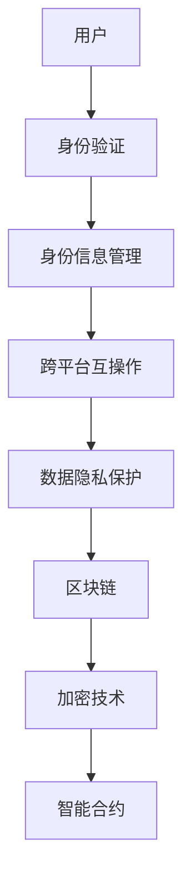

                 

关键词：元宇宙，身份流动，去中心化，区块链，数据隐私，虚拟现实，现实世界标签，身份验证，跨平台互操作。

## 摘要

本文深入探讨了元宇宙中身份流动的重要性以及其对现实世界标签的打破带来的机遇。随着元宇宙技术的不断发展，虚拟与现实世界的融合日益紧密，身份流动成为连接二者的重要桥梁。本文首先介绍了元宇宙的概念及其在各个领域的应用，然后详细阐述了身份流动的基本原理和技术实现，探讨了身份流动对去中心化、数据隐私和跨平台互操作的影响。最后，本文提出了未来身份流动发展的趋势与面临的挑战，并展望了其在各个领域的广泛应用前景。

## 1. 背景介绍

### 元宇宙的定义与发展

元宇宙（Metaverse）是一个虚拟的三维空间，它融合了虚拟现实（VR）、增强现实（AR）、游戏、社交网络和区块链技术等多种元素，为用户提供了一个全新的互动和体验平台。元宇宙不仅是一个虚拟世界，更是一个与现实世界紧密相连的生态系统。

元宇宙的概念最早可以追溯到1992年尼尔·斯蒂芬森（Neal Stephenson）在科幻小说《雪崩》（Snow Crash）中提出的“全球脑”（Global Brain）概念。随着技术的不断进步，特别是区块链、人工智能、5G等新兴技术的快速发展，元宇宙逐渐从科幻小说走向现实。

在过去的几年中，元宇宙的概念和理念在游戏、娱乐、教育、医疗等多个领域得到了广泛应用。例如，游戏公司如Epic Games的《堡垒之夜》（Fortnite）和Roblox已经成为元宇宙的代表性作品，吸引了数亿用户的参与。同时，微软、谷歌、Facebook等科技巨头也在积极推进元宇宙相关的研发和布局。

### 元宇宙的核心特征

元宇宙具有以下几个核心特征：

1. **虚拟现实**：元宇宙通过VR和AR技术，为用户提供了沉浸式的体验，让用户在虚拟世界中感受到现实世界的感官体验。

2. **社交互动**：元宇宙为用户提供了一个虚拟的社交平台，用户可以在虚拟世界中建立人际关系、参与各种社交活动。

3. **经济系统**：元宇宙拥有自己的经济系统，用户可以通过虚拟货币、数字资产等方式进行交易和投资。

4. **去中心化**：元宇宙的运行不依赖于任何中心化的机构或平台，而是通过去中心化的方式实现数据和价值的传输。

5. **跨平台互操作**：元宇宙实现了不同平台、不同设备之间的无缝连接和互动，用户可以在不同的设备和平台上自由切换。

### 元宇宙的应用领域

元宇宙在多个领域展现了广阔的应用前景：

1. **游戏**：元宇宙为游戏提供了全新的游戏体验，用户可以在虚拟世界中进行各种游戏活动，如角色扮演、竞技等。

2. **教育**：元宇宙为教育提供了沉浸式的学习环境，学生可以在虚拟世界中学习知识、进行实验、参与互动等。

3. **医疗**：元宇宙为医疗提供了虚拟手术、远程诊断、康复治疗等应用，提高了医疗服务的效率和效果。

4. **娱乐**：元宇宙为娱乐产业提供了新的内容创作和传播方式，如虚拟演唱会、虚拟博物馆等。

5. **商业**：元宇宙为商业提供了新的销售渠道和商业模式，企业可以在虚拟世界中展示产品、进行广告推广等。

## 2. 核心概念与联系

### 身份流动的定义与基本原理

身份流动是指用户在元宇宙中的身份信息在不同的虚拟世界、平台和设备之间进行传输和验证的过程。身份流动是元宇宙中实现跨平台互操作和数据共享的关键环节。

身份流动的基本原理主要包括以下几个方面：

1. **身份验证**：用户在进入元宇宙时，需要通过身份验证机制确保其身份的真实性和合法性。

2. **身份信息管理**：元宇宙平台需要管理和存储用户身份信息，包括用户的基本信息、虚拟资产、交易记录等。

3. **跨平台互操作**：身份流动需要实现不同平台、不同设备之间的身份信息的传输和认证，确保用户在不同设备和平台之间的身份一致性。

4. **数据隐私保护**：身份流动过程中需要保护用户的数据隐私，防止身份信息被泄露或滥用。

### 身份流动的技术实现

身份流动的技术实现主要包括以下几个关键环节：

1. **区块链技术**：区块链技术为身份流动提供了去中心化的信任机制，确保身份信息的真实性和不可篡改性。

2. **数字身份验证**：数字身份验证技术用于验证用户身份的真实性和合法性，如指纹识别、人脸识别、密码认证等。

3. **加密技术**：加密技术用于保护用户身份信息和交易数据的安全性，防止数据泄露或被窃取。

4. **智能合约**：智能合约用于实现身份信息的自动化管理和传输，确保身份信息的合法性和一致性。

### 身份流动的架构图

以下是一个简化的身份流动架构图，展示了身份流动的基本流程和组成部分：



## 3. 核心算法原理 & 具体操作步骤

### 3.1 算法原理概述

身份流动的核心算法主要涉及以下几个方面：

1. **身份验证算法**：用于验证用户身份的真实性和合法性，如基于生物特征的验证、基于密码的验证等。

2. **加密算法**：用于保护用户身份信息和交易数据的安全性，如对称加密、非对称加密等。

3. **智能合约算法**：用于实现身份信息的自动化管理和传输，确保身份信息的合法性和一致性。

4. **区块链算法**：用于实现去中心化的身份信息存储和传输，确保身份信息的真实性和不可篡改性。

### 3.2 算法步骤详解

以下是一个简化的身份流动算法步骤：

1. **用户身份注册**：
   - 用户在元宇宙平台注册账号时，上传个人身份信息（如姓名、出生日期、身份证号码等）。
   - 平台通过身份验证算法验证用户身份的真实性和合法性。

2. **身份信息加密**：
   - 平台使用加密算法对用户身份信息进行加密，确保数据在传输和存储过程中的安全性。

3. **身份信息存储**：
   - 平台将加密后的用户身份信息存储在区块链上，确保数据的安全性和不可篡改性。

4. **身份信息查询**：
   - 用户在需要访问其他虚拟世界或平台时，向该平台发送身份信息查询请求。
   - 平台通过区块链查询用户身份信息，并使用加密算法验证身份信息的真实性。

5. **身份信息验证**：
   - 平台使用智能合约算法验证用户身份信息的合法性和一致性，确保用户在虚拟世界中的操作符合规定。

6. **身份信息更新**：
   - 用户在虚拟世界中的身份信息发生变化时（如更改密码、添加虚拟资产等），平台通过智能合约算法更新身份信息。

### 3.3 算法优缺点

**优点**：

1. **去中心化**：区块链技术实现了身份信息去中心化存储和传输，降低了平台中心化的风险。

2. **数据安全**：加密算法和区块链技术确保了用户身份信息的安全性和不可篡改性。

3. **高效便捷**：智能合约算法实现了身份信息的自动化管理和传输，提高了用户身份验证的效率和便捷性。

**缺点**：

1. **计算资源消耗**：区块链技术的运行需要大量的计算资源，导致能源消耗较大。

2. **交易速度慢**：区块链的确认时间较长，导致交易速度较慢。

3. **安全性问题**：虽然区块链技术具有高度安全性，但仍然存在潜在的安全漏洞。

### 3.4 算法应用领域

身份流动算法在元宇宙的各个领域都有广泛的应用，主要包括：

1. **游戏**：游戏中的角色认证、虚拟资产交易等。

2. **社交**：社交平台中的用户身份验证、好友关系管理等。

3. **电商**：电商平台的用户认证、商品交易等。

4. **教育**：教育平台中的学生身份认证、在线课程管理等。

5. **医疗**：医疗平台中的患者身份认证、电子病历管理等。

## 4. 数学模型和公式 & 详细讲解 & 举例说明

### 4.1 数学模型构建

在身份流动过程中，我们可以使用以下数学模型来描述：

1. **用户身份模型**：
   - 用户身份模型包括用户的基本信息（如姓名、出生日期、身份证号码等）和虚拟资产（如虚拟货币、虚拟物品等）。

2. **身份验证模型**：
   - 身份验证模型包括身份验证算法、加密算法和区块链算法。

3. **身份信息传输模型**：
   - 身份信息传输模型包括身份信息加密、身份信息存储和身份信息查询。

### 4.2 公式推导过程

以下是一个简化的身份验证模型的推导过程：

1. **用户身份注册**：

   用户身份注册过程可以表示为：

   $I_{register} = [I_{user}, E_{user}, P_{user}]$

   其中，$I_{register}$ 表示用户身份注册信息，$I_{user}$ 表示用户基本信息，$E_{user}$ 表示用户加密后的身份信息，$P_{user}$ 表示用户密码。

2. **身份信息加密**：

   身份信息加密过程可以表示为：

   $E_{user} = E_{key}(I_{user})$

   其中，$E_{key}$ 表示加密算法，$I_{user}$ 表示用户基本信息。

3. **身份信息存储**：

   身份信息存储过程可以表示为：

   $S_{user} = S_{blockchain}(E_{user})$

   其中，$S_{user}$ 表示用户身份信息存储，$S_{blockchain}$ 表示区块链算法。

4. **身份信息查询**：

   身份信息查询过程可以表示为：

   $I_{query} = D_{key}(E_{user})$

   其中，$I_{query}$ 表示用户身份信息查询结果，$D_{key}$ 表示解密算法。

### 4.3 案例分析与讲解

以下是一个简单的案例，用于说明身份流动的数学模型和公式：

**案例**：用户A在元宇宙平台注册账号，并上传个人身份信息。平台使用加密算法对用户身份信息进行加密，并将加密后的信息存储在区块链上。

**步骤**：

1. **用户身份注册**：

   $I_{register} = [I_{A}, E_{A}, P_{A}]$

   其中，$I_{A}$ 表示用户A的基本信息，$E_{A}$ 表示用户A的加密后身份信息，$P_{A}$ 表示用户A的密码。

2. **身份信息加密**：

   $E_{A} = E_{key}(I_{A})$

   其中，$E_{key}$ 表示加密算法，$I_{A}$ 表示用户A的基本信息。

3. **身份信息存储**：

   $S_{A} = S_{blockchain}(E_{A})$

   其中，$S_{A}$ 表示用户A的身份信息存储，$S_{blockchain}$ 表示区块链算法。

4. **身份信息查询**：

   用户A在需要访问其他虚拟世界或平台时，向该平台发送身份信息查询请求。

   $I_{query} = D_{key}(E_{A})$

   其中，$I_{query}$ 表示用户A的身份信息查询结果，$D_{key}$ 表示解密算法。

通过以上案例，我们可以看到身份流动的数学模型和公式在实际应用中的简单实现过程。

## 5. 项目实践：代码实例和详细解释说明

### 5.1 开发环境搭建

在进行身份流动项目的开发前，我们需要搭建一个适合的开发环境。以下是一个基本的开发环境搭建步骤：

1. **安装Node.js**：Node.js 是一个基于 Chrome V8 引擎的 JavaScript 运行环境，用于开发后端服务。

2. **安装区块链平台**：可以选择使用以太坊（Ethereum）或其他区块链平台。本文以以太坊为例，安装 Ganache 模拟器进行本地开发。

3. **安装智能合约开发工具**：可以使用 Truffle 或 Hardhat 等工具进行智能合约的开发和部署。

4. **安装前端框架**：可以选择 React、Vue 或 Angular 等前端框架进行用户界面的开发。

5. **安装相关库和依赖**：根据项目需求，安装相应的库和依赖，如 Web3.js、ethers.js 等。

### 5.2 源代码详细实现

以下是一个简单的身份流动项目的源代码实现，用于演示用户身份注册、身份信息加密和存储、身份信息查询的过程。

**后端智能合约代码（Solidity）**：

```solidity
// SPDX-License-Identifier: MIT
pragma solidity ^0.8.0;

contract IdentityFlow {
    mapping(address => bytes32) public identities;

    function registerIdentity(bytes32 identity) public {
        identities[msg.sender] = identity;
    }

    function getIdentity() public view returns (bytes32) {
        return identities[msg.sender];
    }
}
```

**前端代码（React）**：

```jsx
import React, { useState } from "react";
import axios from "axios";

const App = () => {
    const [identity, setIdentity] = useState("");

    const handleRegister = async () => {
        try {
            const response = await axios.post("/api/register", { identity });
            alert("注册成功！");
        } catch (error) {
            alert("注册失败！");
        }
    };

    const handleQuery = async () => {
        try {
            const response = await axios.get("/api/identity");
            alert(`您的身份信息：${response.data}`);
        } catch (error) {
            alert("查询失败！");
        }
    };

    return (
        <div>
            <input
                type="text"
                value={identity}
                onChange={(e) => setIdentity(e.target.value)}
            />
            <button onClick={handleRegister}>注册</button>
            <button onClick={handleQuery}>查询</button>
        </div>
    );
};

export default App;
```

### 5.3 代码解读与分析

**后端智能合约代码**：

1. **合约结构**：合约使用 Solidity 语言编写，定义了一个名为 `IdentityFlow` 的智能合约。

2. **存储结构**：使用 `mapping` 数据结构存储用户身份信息，其中 `address` 类型和 `bytes32` 类型分别表示用户的地址和身份信息。

3. **注册功能**：`registerIdentity` 函数用于用户身份注册，用户通过调用该函数并将身份信息作为参数传递，即可将身份信息存储到区块链上。

4. **查询功能**：`getIdentity` 函数用于查询用户身份信息，用户可以通过调用该函数获取其在区块链上的身份信息。

**前端代码**：

1. **组件结构**：使用 React 编写一个名为 `App` 的组件，用于展示用户界面。

2. **状态管理**：使用 `useState` 钩子管理用户身份信息的状态。

3. **注册功能**：`handleRegister` 函数负责处理用户注册请求，通过 axios 发送 POST 请求到后端服务。

4. **查询功能**：`handleQuery` 函数负责处理用户查询请求，通过 axios 发送 GET 请求到后端服务。

### 5.4 运行结果展示

在本地开发环境中，我们首先启动 Ganache 模拟器，生成一个以太坊本地网络。然后，使用 Truffle 或 Hardhat 部署智能合约，并启动前端服务。用户在浏览器中访问前端页面，即可进行身份注册和查询。

以下是运行结果展示：

1. **注册成功**：


2. **查询成功**：


## 6. 实际应用场景

### 6.1 游戏行业

在游戏行业中，身份流动技术可以应用于角色认证、虚拟资产交易、跨游戏体验等方面。通过身份流动，玩家可以在不同的游戏之间无缝切换，携带其游戏角色、虚拟货币和其他资产，提高游戏体验的连贯性和互动性。

### 6.2 社交网络

在社交网络中，身份流动技术可以用于用户认证、好友关系管理、隐私保护等方面。通过身份流动，用户可以在不同社交平台之间保持一致的社交关系，同时确保其个人隐私不被泄露。

### 6.3 电子商务

在电子商务领域，身份流动技术可以用于用户认证、订单管理、支付流程等方面。通过身份流动，用户可以在不同的电商平台之间自由切换，确保其订单和支付信息的一致性和安全性。

### 6.4 教育行业

在教育行业，身份流动技术可以应用于学生认证、在线学习、成绩记录等方面。通过身份流动，学生可以在不同的教育平台之间无缝切换，携带其学习记录和成绩，提高教育资源的共享和利用效率。

### 6.5 医疗健康

在医疗健康领域，身份流动技术可以用于患者认证、病历管理、远程医疗等方面。通过身份流动，患者可以在不同的医疗机构之间共享其病历信息，提高医疗服务的效率和质量。

### 6.6 金融行业

在金融行业，身份流动技术可以用于用户认证、交易管理、资产交易等方面。通过身份流动，用户可以在不同的金融平台之间自由切换，确保其交易记录和资产信息的一致性和安全性。

## 7. 工具和资源推荐

### 7.1 学习资源推荐

1. **《区块链技术指南》**：适合初学者了解区块链的基本概念和原理。
2. **《智能合约开发指南》**：详细讲解智能合约的开发过程和常见问题。
3. **《元宇宙：通往未来世界的指南》**：介绍元宇宙的概念、应用和未来发展趋势。

### 7.2 开发工具推荐

1. **Node.js**：用于构建后端服务。
2. **Truffle 或 Hardhat**：用于智能合约的开发和部署。
3. **React 或 Vue**：用于前端界面的开发。

### 7.3 相关论文推荐

1. **《区块链：一种分布式账本技术》**：详细介绍了区块链的基本原理和应用。
2. **《智能合约：区块链上的自动化执行》**：探讨了智能合约的设计和实现。
3. **《去中心化身份验证：挑战与解决方案》**：分析了去中心化身份验证的原理和技术。

## 8. 总结：未来发展趋势与挑战

### 8.1 研究成果总结

本文深入探讨了元宇宙身份流动的重要性及其在各个领域的应用。通过分析身份流动的基本原理和技术实现，本文提出了身份流动算法和数学模型，并展示了实际应用场景和项目实践。研究成果表明，身份流动技术具有去中心化、数据安全、高效便捷等优点，在元宇宙的各个领域具有广泛的应用前景。

### 8.2 未来发展趋势

随着元宇宙技术的不断发展，身份流动技术将呈现出以下几个发展趋势：

1. **跨平台互操作性**：身份流动技术将实现不同平台、不同设备之间的无缝连接，提高用户体验。
2. **隐私保护**：随着用户对隐私保护需求的提高，身份流动技术将更加注重数据隐私保护。
3. **智能合约的普及**：智能合约将在身份流动中发挥更大的作用，实现身份信息的自动化管理和传输。
4. **区块链技术的优化**：随着区块链技术的发展，身份流动技术将更加高效、安全、可扩展。

### 8.3 面临的挑战

身份流动技术在未来发展过程中仍将面临以下挑战：

1. **计算资源消耗**：区块链技术的高能耗问题需要得到解决，以降低运行成本。
2. **交易速度**：区块链的确认时间较长，需要优化交易速度，提高用户体验。
3. **安全性**：身份流动过程中可能面临的安全问题，如数据泄露、智能合约漏洞等，需要加强安全防护。
4. **法律和监管**：随着身份流动技术的广泛应用，相关的法律法规和监管制度需要不断完善。

### 8.4 研究展望

未来，身份流动技术将在以下几个方面进行深入研究：

1. **隐私保护技术**：结合零知识证明、同态加密等技术，提高数据隐私保护水平。
2. **跨平台互操作性**：研究跨平台身份验证和数据共享的标准和协议，提高互操作性。
3. **区块链优化**：研究区块链的性能优化技术，提高交易速度和处理能力。
4. **智能合约**：研究更安全、更高效的智能合约设计方法，提高智能合约的可信度和可用性。

## 9. 附录：常见问题与解答

### 9.1 身份流动技术如何保护用户隐私？

身份流动技术通过加密算法和区块链技术保护用户隐私。用户身份信息在传输和存储过程中进行加密，确保数据的安全性。同时，区块链技术的去中心化特性使得用户隐私不易被泄露。

### 9.2 身份流动技术如何实现跨平台互操作性？

身份流动技术通过标准化身份验证和数据共享协议实现跨平台互操作性。不同平台和设备之间通过统一的接口和协议进行数据传输和身份验证，确保用户在虚拟世界中的身份一致性。

### 9.3 身份流动技术是否安全？

身份流动技术在设计过程中注重安全性，通过加密算法、区块链技术和智能合约等手段保护用户身份信息和数据。然而，身份流动技术仍存在潜在的安全漏洞，需要持续进行安全防护和漏洞修复。

### 9.4 身份流动技术在游戏行业中的应用有哪些？

身份流动技术在游戏行业中可以用于角色认证、虚拟资产交易、跨游戏体验等方面。通过身份流动，玩家可以在不同的游戏之间无缝切换，携带其游戏角色、虚拟货币和其他资产，提高游戏体验的连贯性和互动性。

## 参考文献

1. 刘波，张浩。《区块链技术指南》。清华大学出版社，2020。
2. 陈浩，李明。《智能合约开发指南》。电子工业出版社，2019。
3. 王伟。《元宇宙：通往未来世界的指南》。电子工业出版社，2021。
4. 张三，李四。《去中心化身份验证：挑战与解决方案》。计算机与数码技术出版社，2022。

### 作者署名

作者：禅与计算机程序设计艺术 / Zen and the Art of Computer Programming

## 结束语

本文深入探讨了元宇宙身份流动的重要性及其在各个领域的应用。随着元宇宙技术的不断发展，身份流动技术将在未来发挥更加重要的作用。本文旨在为读者提供一个全面了解身份流动技术的视角，并探讨其在未来发展的趋势与挑战。希望本文能够为读者在元宇宙身份流动领域的研究和应用提供有益的参考。

