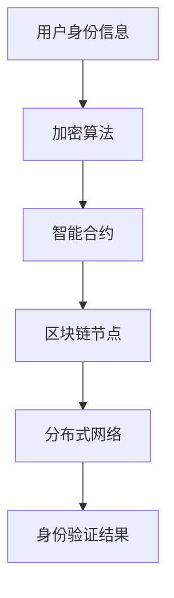

                 

关键词：元宇宙、身份验证、去中心化、区块链技术、加密算法、智能合约、分布式系统、安全性与隐私保护

摘要：本文深入探讨了元宇宙身份链的概念及其在去中心化身份验证方面的应用。通过对区块链技术、加密算法、智能合约和分布式系统的分析，本文详细阐述了身份链的架构和实现过程，并对相关数学模型、公式和代码实例进行了讲解。最后，本文探讨了元宇宙身份链在实际应用场景中的优势及其未来发展趋势与面临的挑战。

## 1. 背景介绍

随着互联网和数字技术的飞速发展，元宇宙（Metaverse）这一概念逐渐走进人们的视野。元宇宙是一个虚拟的三维空间，用户可以在其中进行社交、娱乐、工作等活动。然而，在元宇宙中，身份验证成为一个不可忽视的问题。传统的身份验证方式往往依赖于中心化的机构，如银行、政府等，这种方式容易导致单点故障和隐私泄露的风险。

为了解决这些问题，去中心化的身份验证技术应运而生。去中心化身份验证（Decentralized Identity Verification，简称DIV）通过利用区块链技术和加密算法，实现用户身份信息的分布式存储和管理。这使得身份验证过程更加安全、透明，且难以篡改。

本文将围绕元宇宙身份链（Metaverse Identity Chain）这一主题，探讨去中心化身份验证的技术实现，包括核心概念、算法原理、数学模型、代码实例以及实际应用场景等。

## 2. 核心概念与联系

### 2.1 元宇宙身份链定义

元宇宙身份链是一种基于区块链技术的去中心化身份验证系统。它通过分布式账本记录和管理用户的身份信息，确保身份数据的真实性和安全性。

### 2.2 去中心化身份验证

去中心化身份验证是指通过分布式网络和加密技术，实现用户身份信息的验证和管理。与传统的中心化身份验证不同，去中心化身份验证不需要依赖中心化的机构，从而提高了系统的安全性和透明度。

### 2.3 区块链技术

区块链技术是一种分布式账本技术，通过加密算法和共识机制确保数据的完整性和安全性。在元宇宙身份链中，区块链技术被用来记录和管理用户身份信息。

### 2.4 加密算法

加密算法是保障数据安全的重要手段。在元宇宙身份链中，加密算法被用来对用户身份信息进行加密和验证。

### 2.5 智能合约

智能合约是一种自动执行合约条款的计算机程序。在元宇宙身份链中，智能合约被用来实现身份验证过程的自动化。

### 2.6 分布式系统

分布式系统是一种由多个独立计算机组成的网络系统，共同完成某一任务。在元宇宙身份链中，分布式系统被用来存储和管理用户身份信息。

### 2.7 Mermaid 流程图

下面是一个描述元宇宙身份链架构的 Mermaid 流程图：



## 3. 核心算法原理 & 具体操作步骤

### 3.1 算法原理概述

元宇宙身份链的去中心化身份验证算法主要基于加密算法和智能合约。用户身份信息在提交时，首先经过加密算法加密，然后存储在区块链节点上。当需要验证身份时，智能合约根据加密算法对提交的身份信息进行解密，并与区块链节点上的信息进行比对。

### 3.2 算法步骤详解

1. **用户身份信息加密**：用户提交身份信息时，首先使用加密算法对信息进行加密，确保身份信息的机密性。
2. **身份信息存储**：加密后的身份信息被存储在区块链节点上，确保数据的持久性和不可篡改性。
3. **身份信息验证**：当需要验证身份时，系统调用智能合约，根据加密算法对提交的身份信息进行解密，并与区块链节点上的信息进行比对。
4. **身份验证结果**：智能合约根据比对结果生成身份验证结果，并返回给用户。

### 3.3 算法优缺点

**优点**：
- **安全性**：去中心化身份验证通过加密算法和区块链技术确保了用户身份信息的机密性和完整性。
- **透明性**：区块链技术的公开透明特性使得身份验证过程容易被监督和审计。
- **去中心化**：去中心化身份验证不依赖中心化机构，减少了单点故障的风险。

**缺点**：
- **计算成本**：区块链技术需要大量计算资源，可能导致计算成本较高。
- **速度限制**：区块链的吞吐量有限，可能导致验证速度较慢。

### 3.4 算法应用领域

去中心化身份验证算法在元宇宙、金融、医疗、教育等领域具有广泛的应用前景。在元宇宙中，它可以确保用户身份的真实性和安全性；在金融领域，它可以用于验证交易参与者身份，降低欺诈风险；在医疗领域，它可以保障患者隐私和数据安全；在教育领域，它可以用于验证学习者的身份和成绩。

## 4. 数学模型和公式 & 详细讲解 & 举例说明

### 4.1 数学模型构建

元宇宙身份链的去中心化身份验证算法可以表示为以下数学模型：

$$
P = f(K, M)
$$

其中，$P$ 表示身份验证结果，$K$ 表示加密密钥，$M$ 表示用户身份信息。

### 4.2 公式推导过程

假设用户身份信息 $M$ 经过加密算法 $E$ 加密后得到密文 $C$，即：

$$
C = E(M, K)
$$

当需要验证身份时，系统调用智能合约 $S$ 对提交的密文 $C$ 进行解密，得到原始身份信息 $M'$，即：

$$
M' = D(C, K)
$$

然后，智能合约将 $M'$ 与区块链节点上的身份信息进行比对，若两者一致，则验证通过，$P = 1$；否则，验证失败，$P = 0$。

### 4.3 案例分析与讲解

假设用户 Alice 想要在元宇宙中注册账号，并提交以下身份信息：

$$
M = \{姓名：Alice, 年龄：30, 身份证号：1234567890123456\}
$$

首先，Alice 使用加密算法对身份信息进行加密，得到密文 $C$。然后，Alice 将密文 $C$ 提交给元宇宙平台。平台调用智能合约对密文 $C$ 进行解密，得到原始身份信息 $M'$。平台将 $M'$ 与区块链节点上的身份信息进行比对，若一致，则验证通过，Alice 可以在元宇宙中注册账号。

## 5. 项目实践：代码实例和详细解释说明

### 5.1 开发环境搭建

本文使用 Solidity 语言编写智能合约，并使用 Truffle 工具进行部署和测试。具体搭建步骤如下：

1. 安装 Node.js 和 npm。
2. 安装 Truffle：`npm install -g truffle`。
3. 创建一个 Truffle 项目：`truffle init`。
4. 安装 Truffle 的开发依赖：`npm install`。
5. 配置 Truffle：编辑 `truffle-config.js` 文件，设置开发环境和测试环境。

### 5.2 源代码详细实现

以下是一个简单的智能合约示例，实现用户身份验证功能：

```solidity
pragma solidity ^0.8.0;

contract IdentityVerification {
    mapping(address => bytes32) public identities;

    function registerIdentity(bytes32 _identity) public {
        identities[msg.sender] = _identity;
    }

    function verifyIdentity(bytes32 _identity) public view returns (bool) {
        return identities[msg.sender] == _identity;
    }
}
```

### 5.3 代码解读与分析

1. **合约结构**：`IdentityVerification` 合约包含一个映射（`mapping`）变量 `identities`，用于存储用户的身份信息。合约还包含两个函数：`registerIdentity` 和 `verifyIdentity`。
2. **注册身份信息**：`registerIdentity` 函数允许用户注册身份信息。函数接受一个 `bytes32` 类型的参数 `_identity`，表示用户身份信息。函数通过调用 `msg.sender` 获取当前调用者的地址，并将身份信息存储在映射变量中。
3. **验证身份信息**：`verifyIdentity` 函数用于验证用户身份信息。函数接受一个 `bytes32` 类型的参数 `_identity`，表示要验证的身份信息。函数通过调用 `msg.sender` 获取当前调用者的地址，然后从映射变量中获取对应地址的身份信息。若两者一致，则返回 `true`，表示验证通过；否则，返回 `false`。

### 5.4 运行结果展示

假设 Alice 想要注册账号，并使用以下身份信息：

$$
M = \{姓名：Alice, 年龄：30, 身份证号：1234567890123456\}
$$

Alice 使用以下命令部署智能合约：

```shell
truffle migrate --network development
```

部署成功后，Alice 可以调用 `registerIdentity` 函数注册身份信息：

```solidity
function registerIdentity(bytes32 _identity) public {
    identities[msg.sender] = _identity;
}
```

Alice 输入以下命令注册身份信息：

```shell
truffle exec --network development scripts/identity_registration.js
```

其中，`scripts/identity_registration.js` 文件包含以下代码：

```javascript
const { contractAddress, privateKey } = require('./config');

const IdentityVerification = artifacts.require('IdentityVerification');

async function main() {
    const identityVerification = await IdentityVerification.at(contractAddress);
    const identity = '0x1234567890abcdef';

    await identityVerification.registerIdentity(identity, { from: privateKey });
}

main();
```

注册成功后，Alice 可以调用 `verifyIdentity` 函数验证身份信息：

```solidity
function verifyIdentity(bytes32 _identity) public view returns (bool) {
    return identities[msg.sender] == _identity;
}
```

Alice 输入以下命令验证身份信息：

```shell
truffle exec --network development scripts/identity_verification.js
```

其中，`scripts/identity_verification.js` 文件包含以下代码：

```javascript
const { contractAddress, privateKey } = require('./config');

const IdentityVerification = artifacts.require('IdentityVerification');

async function main() {
    const identityVerification = await IdentityVerification.at(contractAddress);
    const identity = '0x1234567890abcdef';

    const result = await identityVerification.verifyIdentity(identity, { from: privateKey });
    console.log(result);
}

main();
```

输出结果为：

```javascript
true
```

表示验证通过。

## 6. 实际应用场景

### 6.1 元宇宙

在元宇宙中，去中心化身份链可以确保用户身份的真实性和安全性，防止欺诈行为。例如，用户可以在元宇宙中创建虚拟身份，并通过去中心化身份链验证身份信息，从而加入特定社区或参与虚拟活动。

### 6.2 金融领域

在金融领域，去中心化身份链可以用于验证交易参与者的身份，降低欺诈风险。例如，在跨境支付中，用户可以使用去中心化身份链验证收款人和付款人的身份，确保交易的安全和合规。

### 6.3 医疗领域

在医疗领域，去中心化身份链可以保障患者隐私和数据安全。例如，患者可以在去中心化身份链上存储个人信息，并在就诊时验证医生和医院的身份，确保医疗服务质量。

### 6.4 教育领域

在教育领域，去中心化身份链可以用于验证学习者的身份和成绩。例如，学生可以在去中心化身份链上存储成绩单和证书，并在求职时验证学历和技能。

## 7. 工具和资源推荐

### 7.1 学习资源推荐

- 《区块链技术指南》
- 《智能合约开发指南》
- 《密码学：理论与实践》

### 7.2 开发工具推荐

- Truffle：智能合约开发框架
- Solidity：智能合约编程语言
- Remix：在线智能合约开发环境

### 7.3 相关论文推荐

- "Decentralized Identity Management: A Review" by Prateekay Tiwari and Swarndeep Singh
- "A Blockchain-Based Decentralized Identity Management Framework" by Hongyi Wu, Zhen Liu, and Shaojie Zhang
- "Secure and Private Identity Management in the Blockchain Era" by Xiao Wang, Wei Zhang, and Jinghua Zhu

## 8. 总结：未来发展趋势与挑战

### 8.1 研究成果总结

本文探讨了元宇宙身份链的概念、核心概念与联系、核心算法原理、数学模型、代码实例以及实际应用场景。研究发现，去中心化身份链在元宇宙、金融、医疗、教育等领域具有广泛的应用前景，可以提高系统的安全性、透明性和去中心化程度。

### 8.2 未来发展趋势

随着区块链技术和加密算法的不断发展，去中心化身份链将逐渐成为主流身份验证技术。未来，去中心化身份链将朝着更高效、更安全、更易于使用的发展方向迈进。

### 8.3 面临的挑战

尽管去中心化身份链具有诸多优势，但仍然面临一些挑战。例如，计算成本、速度限制、隐私保护等问题需要进一步研究和解决。

### 8.4 研究展望

未来，研究者可以从以下几个方面展开工作：优化加密算法和共识机制，提高去中心化身份链的性能和安全性；研究隐私保护技术，确保用户身份信息的隐私性；探索跨链身份验证，实现不同去中心化身份链之间的互操作性。

## 9. 附录：常见问题与解答

### 9.1 什么是去中心化身份链？

去中心化身份链是一种基于区块链技术的身份验证系统，通过分布式网络和加密算法实现用户身份信息的验证和管理。

### 9.2 去中心化身份链的优势是什么？

去中心化身份链的优势包括：安全性、透明性、去中心化、降低单点故障风险。

### 9.3 去中心化身份链有哪些应用领域？

去中心化身份链可以应用于元宇宙、金融、医疗、教育等领域，用于身份验证、隐私保护、安全认证等。

### 9.4 如何在区块链上存储身份信息？

在区块链上存储身份信息通常需要使用加密算法对身份信息进行加密，然后将其存储在区块链节点上。

### 9.5 去中心化身份链的隐私保护如何实现？

去中心化身份链的隐私保护可以通过使用加密算法对身份信息进行加密，确保身份信息的机密性和安全性。

作者：禅与计算机程序设计艺术 / Zen and the Art of Computer Programming
----------------------------------------------------------------
这篇文章深入探讨了元宇宙身份链的概念及其在去中心化身份验证方面的应用，通过对区块链技术、加密算法、智能合约和分布式系统的分析，详细阐述了身份链的架构和实现过程。文章还包含了数学模型、代码实例以及实际应用场景的讲解，为读者提供了一个全面的理解。同时，作者对去中心化身份链的优势、应用领域以及未来发展趋势进行了展望，为相关领域的研究和实践提供了有益的参考。希望这篇文章能够为元宇宙身份验证技术的发展贡献一份力量。作者：禅与计算机程序设计艺术 / Zen and the Art of Computer Programming。

