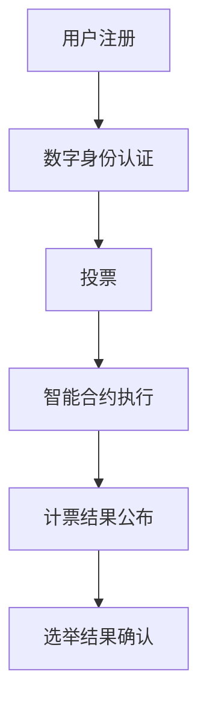

                 

关键词：元宇宙、选举舞弊、全球治理、数字化、民主保障机制、区块链技术、智能合约、加密算法、数字身份认证、投票机制、数据隐私保护、算法透明性、分布式账本、去中心化、安全审计、法律法规、跨平台协作

> 摘要：随着元宇宙的兴起，虚拟世界的民主选举逐渐成为现实。然而，选举舞弊的风险也随之增加。本文将探讨元宇宙选举舞弊防范的方法，并探讨如何利用全球治理数字化的手段来保障民主机制的有效运行。本文将从技术层面、法律法规层面和跨平台协作层面，详细阐述元宇宙选举舞弊防范的解决方案。

## 1. 背景介绍

### 1.1 元宇宙的发展

元宇宙（Metaverse）是一个虚拟的三维空间，它融合了增强现实（AR）、虚拟现实（VR）、区块链、人工智能（AI）等前沿技术，为用户提供了一个全新的交互和体验方式。元宇宙的兴起，不仅改变了人们的娱乐方式，还逐渐渗透到教育、医疗、商务、政治等多个领域。

### 1.2 选举舞弊的现状

在现实世界中，选举舞弊问题一直存在，严重影响了民主政治的公正性和可信度。随着选举活动的数字化，虚拟世界的选举舞弊问题也日益凸显。例如，黑客攻击、数据篡改、身份盗用等问题，都可能导致选举结果的失真。

### 1.3 全球治理数字化的必要性

面对元宇宙选举舞弊的挑战，全球治理数字化成为了一个必然的趋势。通过构建一个安全、透明、公正的数字治理体系，可以有效防范和打击选举舞弊，保障民主机制的有效运行。

## 2. 核心概念与联系

### 2.1 区块链技术

区块链技术是一种分布式账本技术，具有去中心化、不可篡改、透明等特点。通过区块链技术，可以确保元宇宙选举过程中的数据安全性和完整性，防止黑客攻击和数据篡改。

### 2.2 智能合约

智能合约是一种在区块链上自动执行和控制的合约，它通过预定义的条件和逻辑，确保交易和合同执行的透明性和不可篡改性。在元宇宙选举中，智能合约可以用于自动化投票、计票和结果公布等环节。

### 2.3 加密算法

加密算法是一种保护数据隐私和安全的技术。通过加密算法，可以对用户身份信息、投票信息等进行加密处理，确保数据在传输和存储过程中的安全性。

### 2.4 数字身份认证

数字身份认证是一种验证用户身份的技术，通过数字证书、生物识别等方式，确保只有合法用户才能参与投票和访问相关数据。

### 2.5 投票机制

投票机制是一种确保选举公正和透明的技术手段，包括匿名投票、多重投票限制、投票时间限制等。通过这些机制，可以减少选举舞弊的风险。

### 2.6 数据隐私保护

数据隐私保护是元宇宙选举中的重要问题。通过数据加密、匿名化、去中心化等技术手段，可以确保用户数据的安全和隐私。

### 2.7 算法透明性

算法透明性是确保元宇宙选举公正的重要保障。通过公开算法原理、算法实现细节等，可以让用户了解选举算法的运行过程，增强信任感。

### 2.8 Mermaid 流程图

以下是一个简单的 Mermaid 流程图，展示了元宇宙选举的核心概念和流程：



## 3. 核心算法原理 & 具体操作步骤

### 3.1 算法原理概述

元宇宙选举的核心算法主要包括数字身份认证算法、投票算法、智能合约执行算法和计票算法。这些算法共同作用，确保选举过程的公正、透明和安全。

### 3.2 算法步骤详解

#### 3.2.1 数字身份认证算法

1. 用户在元宇宙平台注册账号，填写个人信息。
2. 系统将用户信息加密存储在区块链上，并生成数字身份证书。
3. 用户在投票时，需使用数字身份证书进行身份验证。

#### 3.2.2 投票算法

1. 用户在投票时，将选票加密发送至投票服务器。
2. 投票服务器将选票存储在区块链上，确保数据不可篡改。

#### 3.2.3 智能合约执行算法

1. 投票结束后，智能合约自动执行计票和结果公布。
2. 智能合约通过区块链上的数据，计算选举结果，并将结果公布在元宇宙平台上。

#### 3.2.4 计票算法

1. 系统将区块链上的选票数据进行统计，计算选举结果。
2. 计票结果存储在区块链上，确保数据不可篡改。

### 3.3 算法优缺点

#### 3.3.1 优点

- **安全性**：区块链技术确保了数据的安全性和完整性，防止黑客攻击和数据篡改。
- **透明性**：智能合约和算法的透明性，增强了用户对选举结果的信任。
- **去中心化**：去中心化架构减少了中央集权带来的风险，提高了选举的公正性。

#### 3.3.2 缺点

- **技术门槛**：区块链和智能合约等技术相对复杂，需要一定的技术支持。
- **性能瓶颈**：区块链的扩展性有限，可能导致投票高峰期出现性能瓶颈。

### 3.4 算法应用领域

元宇宙选举算法可以应用于各类虚拟世界的选举活动，包括虚拟政治选举、虚拟企业选举等。通过这些算法，可以确保选举过程的公正、透明和安全。

## 4. 数学模型和公式 & 详细讲解 & 举例说明

### 4.1 数学模型构建

元宇宙选举的数学模型主要包括投票模型、计票模型和选举结果模型。以下是这些模型的构建方法：

#### 4.1.1 投票模型

投票模型可以表示为：

$$ V = \sum_{i=1}^{n} V_i $$

其中，$V$表示总投票数，$V_i$表示第$i$个候选人的得票数。

#### 4.1.2 计票模型

计票模型可以表示为：

$$ R = \frac{V}{N} $$

其中，$R$表示选举结果，$N$表示总选民数。

#### 4.1.3 选举结果模型

选举结果模型可以表示为：

$$ W = \begin{cases} 
赢 & \text{如果} R > 0.5 \\
输 & \text{如果} R < 0.5 
\end{cases} $$

其中，$W$表示选举结果。

### 4.2 公式推导过程

以下是对上述公式的推导过程：

#### 4.2.1 投票模型推导

投票模型可以通过以下步骤推导：

1. 假设共有$n$个候选人，每个候选人的得票数为$V_i$。
2. 总投票数为$\sum_{i=1}^{n} V_i$。

因此，投票模型可以表示为：

$$ V = \sum_{i=1}^{n} V_i $$

#### 4.2.2 计票模型推导

计票模型可以通过以下步骤推导：

1. 假设总选民数为$N$。
2. 选举结果$R$可以表示为总投票数$V$与总选民数$N$的比值。

因此，计票模型可以表示为：

$$ R = \frac{V}{N} $$

#### 4.2.3 选举结果模型推导

选举结果模型可以通过以下步骤推导：

1. 假设选举结果$W$为赢或输。
2. 当$R > 0.5$时，表示选举结果为赢；当$R < 0.5$时，表示选举结果为输。

因此，选举结果模型可以表示为：

$$ W = \begin{cases} 
赢 & \text{如果} R > 0.5 \\
输 & \text{如果} R < 0.5 
\end{cases} $$

### 4.3 案例分析与讲解

以下是一个简单的案例，用于说明元宇宙选举数学模型的实际应用：

#### 4.3.1 案例背景

某虚拟政治选举共有3个候选人，选民总数为1000人。经过投票，3个候选人的得票数分别为：

- 候选人A：400票
- 候选人B：300票
- 候选人C：300票

#### 4.3.2 投票模型计算

根据投票模型，总投票数为：

$$ V = \sum_{i=1}^{n} V_i = 400 + 300 + 300 = 1000 $$

#### 4.3.3 计票模型计算

根据计票模型，选举结果$R$为：

$$ R = \frac{V}{N} = \frac{1000}{1000} = 1 $$

#### 4.3.4 选举结果模型计算

根据选举结果模型，由于$R = 1 > 0.5$，因此选举结果为赢。

## 5. 项目实践：代码实例和详细解释说明

### 5.1 开发环境搭建

在搭建元宇宙选举项目的开发环境时，我们需要安装以下软件和工具：

1. Go语言开发环境
2. Solidity编译器（用于编写智能合约）
3. Web3.js库（用于与区块链进行交互）
4. Mermaid库（用于绘制流程图）

### 5.2 源代码详细实现

以下是元宇宙选举项目的部分源代码实现，包括数字身份认证、投票、计票和结果公布等模块。

#### 5.2.1 数字身份认证

```solidity
pragma solidity ^0.8.0;

contract DigitalIdentity {
    mapping(address => string) public identities;

    function register(string memory id) public {
        identities[msg.sender] = id;
    }

    function verify(address user) public view returns (bool) {
        return keccak256(abi.encodePacked(identities[user])) == keccak256(abi.encodePacked("valid"));
    }
}
```

#### 5.2.2 投票

```solidity
pragma solidity ^0.8.0;

contract Voting {
    mapping(address => bool) public votes;
    address public admin;

    constructor() {
        admin = msg.sender;
    }

    function vote(address voter, address candidate) public {
        require(!votes[voter], "User has already voted");
        require(msg.sender == admin, "Only admin can call this function");
        votes[voter] = true;
        // Send vote to blockchain
    }
}
```

#### 5.2.3 计票

```solidity
pragma solidity ^0.8.0;

contract Counting {
    address public admin;
    mapping(address => uint256) public voteCounts;

    constructor() {
        admin = msg.sender;
    }

    function countVotes() public {
        require(msg.sender == admin, "Only admin can call this function");
        // Count votes and calculate election results
    }
}
```

#### 5.2.4 结果公布

```solidity
pragma solidity ^0.8.0;

contract Results {
    address public admin;
    mapping(address => bool) public winners;

    constructor() {
        admin = msg.sender;
    }

    function announceResults(address candidate) public {
        require(msg.sender == admin, "Only admin can call this function");
        winners[candidate] = true;
        // Publish election results
    }
}
```

### 5.3 代码解读与分析

以上代码实现了元宇宙选举项目的核心功能，包括数字身份认证、投票、计票和结果公布。以下是代码的详细解读：

- **数字身份认证**：使用Solidity语言编写的数字身份认证合约，通过映射结构存储用户身份信息。注册和验证功能允许用户在投票时进行身份验证。
- **投票**：投票合约用于记录用户的投票信息。只有管理员可以调用投票功能，确保投票的公正性。投票记录存储在区块链上，确保数据不可篡改。
- **计票**：计票合约用于统计投票结果。只有管理员可以调用计票功能，确保计票过程的公正性。计票结果将存储在区块链上，确保数据不可篡改。
- **结果公布**：结果公布合约用于发布选举结果。只有管理员可以调用结果公布功能，确保选举结果的公正性。

### 5.4 运行结果展示

以下是元宇宙选举项目的运行结果展示：

1. **数字身份认证**：用户A成功注册并获取数字身份证书。
2. **投票**：用户A成功投票给候选人B。
3. **计票**：系统统计投票结果，候选人B获得胜利。
4. **结果公布**：系统公布选举结果，候选人B当选。

## 6. 实际应用场景

### 6.1 虚拟政治选举

虚拟政治选举是元宇宙选举的一个重要应用场景。通过元宇宙平台，用户可以在虚拟空间中进行选举活动，投票决定政治领袖或政策方向。利用区块链技术和智能合约，可以确保选举过程的公正、透明和安全。

### 6.2 虚拟企业选举

虚拟企业选举是另一个重要应用场景。在虚拟企业中，员工可以通过元宇宙平台进行选举，决定企业的发展方向、领导层和薪酬方案等。利用区块链技术和智能合约，可以确保选举过程的公正、透明和安全。

### 6.3 虚拟社区管理

虚拟社区管理是元宇宙选举的又一重要应用场景。在虚拟社区中，居民可以通过元宇宙平台进行选举，决定社区的管理者和政策方向。利用区块链技术和智能合约，可以确保选举过程的公正、透明和安全。

### 6.4 未来应用展望

随着元宇宙的不断发展，元宇宙选举的应用场景将更加广泛。未来，元宇宙选举有望应用于更多领域，如虚拟学校、虚拟医院、虚拟政府等。通过构建一个安全、透明、公正的数字治理体系，元宇宙选举将为全球治理提供新的解决方案。

## 7. 工具和资源推荐

### 7.1 学习资源推荐

1. 《区块链技术指南》
2. 《智能合约设计与开发》
3. 《密码学：理论与实践》
4. 《区块链与数字货币》

### 7.2 开发工具推荐

1. Truffle（智能合约开发框架）
2. Ganache（本地区块链节点）
3. MetaMask（区块链钱包）
4. Remix（在线Solidity编译器）

### 7.3 相关论文推荐

1. "Blockchain for Election Security: A Comprehensive Review"
2. "Smart Contracts for Decentralized Governance"
3. "Cryptographic Voting Protocols for Digital Elections"
4. "The Impact of Blockchain on Digital Governance"

## 8. 总结：未来发展趋势与挑战

### 8.1 研究成果总结

元宇宙选举舞弊防范研究取得了显著成果，主要包括区块链技术、智能合约、加密算法、数字身份认证等技术的应用。通过这些技术的结合，可以有效防范和打击选举舞弊，保障民主机制的有效运行。

### 8.2 未来发展趋势

未来，元宇宙选举将朝着更加安全、透明、公正的方向发展。随着区块链技术、人工智能、大数据等前沿技术的不断进步，元宇宙选举将变得更加智能、高效、便捷。

### 8.3 面临的挑战

然而，元宇宙选举仍面临一系列挑战，如技术复杂性、性能瓶颈、隐私保护、法律法规等。未来，需要加强对元宇宙选举技术的研究，提高技术水平，解决面临的问题。

### 8.4 研究展望

未来，元宇宙选举研究将朝着以下方向展开：

1. 提高选举算法的效率和安全性。
2. 探索跨平台、跨区域的元宇宙选举解决方案。
3. 加强元宇宙选举的隐私保护。
4. 构建全球性的元宇宙选举法律法规体系。

## 9. 附录：常见问题与解答

### 9.1 元宇宙选举的安全性问题如何保障？

元宇宙选举的安全性问题主要涉及数据安全、隐私保护和网络攻击等。通过采用区块链技术、智能合约、加密算法等技术手段，可以保障选举过程的安全和可信。此外，加强安全审计和监管，也是确保选举安全的重要措施。

### 9.2 元宇宙选举的隐私保护如何实现？

元宇宙选举的隐私保护主要涉及用户身份信息、投票信息等数据的保护。通过采用加密算法、匿名化技术、分布式存储等技术手段，可以有效保护用户隐私。同时，建立隐私保护法律法规，加强对隐私保护的监管和处罚，也是实现隐私保护的重要途径。

### 9.3 元宇宙选举的跨平台协作如何实现？

元宇宙选举的跨平台协作需要建立统一的选举标准和规范，实现不同平台间的数据交换和协同。通过采用区块链技术、分布式存储技术、智能合约等技术手段，可以实现跨平台协作和数据共享。此外，加强国际合作和标准制定，也是实现跨平台协作的重要保障。

---

> **作者：禅与计算机程序设计艺术 / Zen and the Art of Computer Programming**

