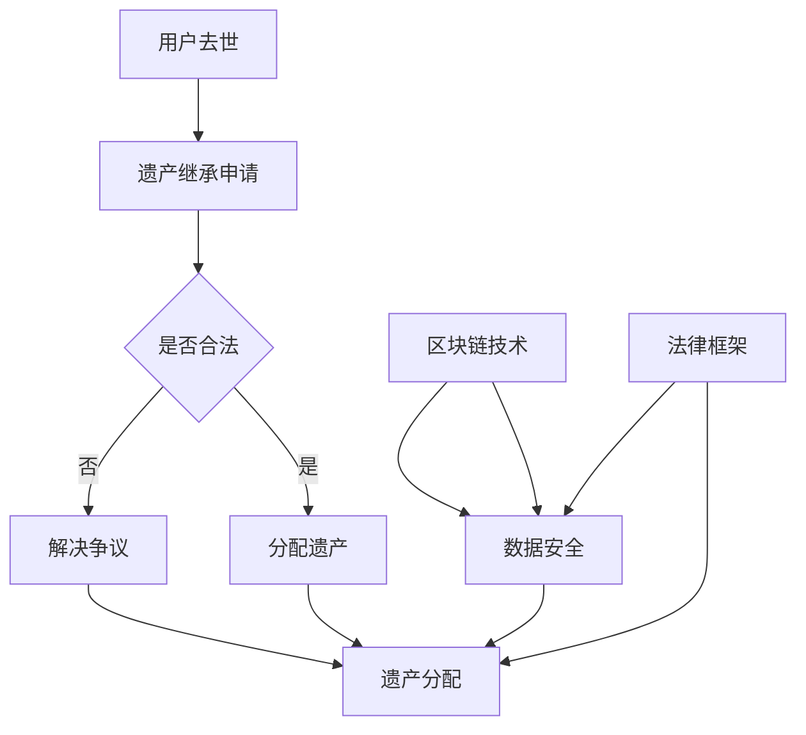

                 

关键词：元宇宙、遗产规划、虚拟资产、代际传承、区块链技术、数据安全、法律框架、可持续发展

> 摘要：本文探讨了元宇宙中的遗产规划问题，重点分析了虚拟资产的代际传承。随着数字经济的快速发展，虚拟资产在人们生活中的重要性日益凸显。如何确保这些资产在一代代之间的顺利传承，成为了一个亟待解决的重要问题。本文通过引入区块链技术、数据安全、法律框架等概念，提出了一个综合性的元宇宙遗产规划方案，为虚拟资产的代际传承提供了理论依据和实践指导。

## 1. 背景介绍

### 1.1 元宇宙的概念与发展

元宇宙（Metaverse）是一个基于虚拟现实（VR）和增强现实（AR）技术的数字世界，它融合了现实与虚拟，为人们提供了一个全新的社交、娱乐、工作和学习平台。元宇宙的概念最早可以追溯到1992年的科幻小说《雪崩》（Snow Crash），作者尼尔·斯蒂芬森（Neal Stephenson）描绘了一个虚拟现实中的数字世界。

随着技术的不断进步，元宇宙逐渐从科幻走向现实。2020年，Facebook宣布将其公司名称更改为Meta（元宇宙），标志着元宇宙正式成为全球科技巨头的发展方向。此后，微软、谷歌、腾讯等公司也纷纷加大对元宇宙技术的研发和投入。

### 1.2 虚拟资产的定义与价值

虚拟资产是指存在于元宇宙中的各种数字财产，包括虚拟货币、虚拟土地、虚拟商品、虚拟身份等。这些资产虽然在物理世界中没有实体，但它们在元宇宙中具有实际的经济价值和社会价值。

虚拟资产的价值主要体现在以下几个方面：

- **流动性**：虚拟资产可以在元宇宙内进行自由交易，具有较高的流动性。
- **稀缺性**：许多虚拟资产具有稀缺性，例如虚拟土地、虚拟商品等，其价值往往随稀缺性的增加而提升。
- **唯一性**：虚拟资产通常具有唯一性，例如NFT（非同质化代币），每个NFT都是独一无二的。
- **可追溯性**：虚拟资产在区块链上具有可追溯性，有助于确保其真实性和安全性。

### 1.3 遗产规划的概念与意义

遗产规划是指个人或家庭为管理、分配和传承其财产而进行的一系列规划和安排。遗产规划不仅关乎个人的财务安全，还关乎家庭成员的福祉和社会责任。

在现实世界中，遗产规划有助于：

- **确保财产的公平分配**：通过遗产规划，可以确保财产在继承人之间公平分配，避免纠纷。
- **减少税收负担**：合理的遗产规划可以降低遗产税和赠与税的负担。
- **实现财产的保值增值**：通过遗产规划，可以更好地管理和投资财产，实现其保值增值。

在元宇宙中，遗产规划同样具有重要意义。随着虚拟资产的价值逐渐凸显，如何确保这些资产在一代代之间的顺利传承，成为了一个重要问题。元宇宙遗产规划的目的是：

- **确保虚拟资产的传承**：通过有效的遗产规划，确保虚拟资产在一代代之间的顺利传承。
- **保护虚拟资产的安全**：在遗产规划中，需要考虑虚拟资产的安全性问题，防止盗窃、欺诈等风险。
- **实现虚拟资产的保值增值**：通过合理的投资和管理，确保虚拟资产在未来的价值增长。

## 2. 核心概念与联系

### 2.1 区块链技术

区块链技术是一种分布式数据库技术，其核心特点包括去中心化、不可篡改、可追溯性等。在元宇宙中，区块链技术被广泛应用于虚拟资产的管理和交易。

区块链技术的关键概念包括：

- **区块**：区块是区块链的基本单位，每个区块包含一定数量的交易记录。
- **链**：区块链是由多个区块按时间顺序串联而成的数据结构。
- **节点**：节点是区块链网络中的参与者，负责验证交易、记录区块等。
- **共识机制**：共识机制是节点之间达成一致的方法，例如工作量证明（PoW）和权益证明（PoS）。

### 2.2 数据安全

数据安全是元宇宙遗产规划中至关重要的一环。在元宇宙中，虚拟资产的数据安全面临多种威胁，如黑客攻击、数据泄露、恶意软件等。为了确保数据安全，需要采取一系列措施：

- **加密技术**：通过加密技术保护虚拟资产的数据，防止未经授权的访问。
- **身份验证**：使用数字身份验证技术确保交易双方的真实性和合法性。
- **安全审计**：定期进行安全审计，发现并修复潜在的安全漏洞。
- **备份与恢复**：定期备份数据，以便在数据丢失或损坏时能够快速恢复。

### 2.3 法律框架

在元宇宙中，虚拟资产的法律地位和所有权问题尚不明确。为了确保元宇宙遗产规划的合法性，需要建立健全的法律框架：

- **虚拟资产立法**：制定专门的法律规范虚拟资产的定义、交易、所有权等。
- **合同法**：明确合同法律关系，规范虚拟资产的交易行为。
- **知识产权法**：保护虚拟资产中的知识产权，如虚拟商品的设计、虚拟身份的形象等。
- **税法**：明确虚拟资产在税务方面的规定，避免税收漏洞。

### 2.4 Mermaid 流程图

以下是一个关于元宇宙遗产规划的Mermaid流程图，展示了核心概念之间的联系：



## 3. 核心算法原理 & 具体操作步骤

### 3.1 算法原理概述

在元宇宙遗产规划中，核心算法主要用于确定虚拟资产的分配方案。该算法基于以下几个原理：

- **公平性**：算法应确保虚拟资产在继承人之间的公平分配。
- **安全性**：算法应确保虚拟资产在分配过程中的安全性，防止数据泄露和欺诈行为。
- **可扩展性**：算法应具备良好的可扩展性，以适应不同规模的遗产规划需求。

### 3.2 算法步骤详解

以下是元宇宙遗产规划算法的具体步骤：

#### 步骤1：遗产信息收集

收集遗产人的虚拟资产信息，包括虚拟货币、虚拟土地、虚拟商品等。同时，收集遗产人的继承人信息，包括继承人的身份、份额比例等。

#### 步骤2：身份验证

对继承人进行身份验证，确保其真实性和合法性。可以使用数字身份验证技术，如指纹识别、人脸识别等。

#### 步骤3：资产评估

对虚拟资产进行评估，确定其当前价值。可以使用市场参考价、算法评估等方法进行评估。

#### 步骤4：制定分配方案

根据继承人的份额比例，制定虚拟资产的分配方案。分配方案应确保公平性，同时考虑继承人的实际需求。

#### 步骤5：安全传输

将分配方案传输到区块链上，确保其安全性和不可篡改性。可以使用加密技术和智能合约等技术实现安全传输。

#### 步骤6：公示与确认

将分配方案公示，并邀请继承人进行确认。确认后，虚拟资产将按照分配方案进行实际分配。

#### 步骤7：备案与审计

将遗产规划过程进行备案，并定期进行审计，确保遗产规划的合法性和公正性。

### 3.3 算法优缺点

**优点**：

- **公平性**：算法确保虚拟资产在继承人之间的公平分配。
- **安全性**：算法采用加密技术和区块链技术，确保虚拟资产在分配过程中的安全性。
- **可扩展性**：算法具有良好的可扩展性，可以适应不同规模的遗产规划需求。

**缺点**：

- **复杂性**：算法涉及多个环节，需要较高的技术门槛。
- **法律风险**：在法律框架不完善的情况下，算法可能面临法律风险。

### 3.4 算法应用领域

元宇宙遗产规划算法可以应用于以下领域：

- **家庭遗产规划**：帮助家庭成员制定虚拟资产的传承方案。
- **企业遗产规划**：帮助企业管理虚拟资产，确保企业的可持续发展。
- **慈善遗产规划**：帮助慈善机构管理虚拟资产，实现慈善目标。

## 4. 数学模型和公式 & 详细讲解 & 举例说明

### 4.1 数学模型构建

元宇宙遗产规划的数学模型主要包括以下几个方面：

- **资产评估模型**：用于评估虚拟资产的价值。
- **分配模型**：用于确定虚拟资产的分配方案。
- **风险管理模型**：用于评估遗产规划过程中可能面临的风险。

### 4.2 公式推导过程

以下是资产评估模型的一个示例公式：

$$
V = f(p, r, t)
$$

其中，$V$表示资产的价值，$p$表示市场参考价，$r$表示算法评估价，$t$表示资产的未来价值预测。

资产评估模型的推导过程如下：

1. **确定市场参考价**：通过市场调查和数据分析，确定虚拟资产的市场参考价。
2. **确定算法评估价**：使用算法对虚拟资产进行评估，确定其算法评估价。
3. **预测未来价值**：根据虚拟资产的特点和市场趋势，预测其未来价值。
4. **计算综合价值**：将市场参考价、算法评估价和未来价值预测相结合，计算虚拟资产的综合价值。

### 4.3 案例分析与讲解

以下是一个关于虚拟土地评估的案例：

#### 案例背景

某用户拥有一块虚拟土地，其市场参考价为$10,000元，算法评估价为$8,000元。预计在未来5年内，该虚拟土地的价值将增长30%。

#### 案例分析

1. **确定市场参考价**：根据市场调查，该虚拟土地的市场参考价为$10,000元。
2. **确定算法评估价**：使用算法评估，该虚拟土地的算法评估价为$8,000元。
3. **预测未来价值**：预计在未来5年内，该虚拟土地的价值将增长30%，即$10,000元 * 1.3 = $13,000元。
4. **计算综合价值**：将市场参考价、算法评估价和未来价值预测相结合，该虚拟土地的综合价值为$10,000元 + $8,000元 + $13,000元 = $31,000元。

#### 案例总结

通过数学模型，我们可以准确评估虚拟资产的价值，为遗产规划提供科学依据。

## 5. 项目实践：代码实例和详细解释说明

### 5.1 开发环境搭建

在编写元宇宙遗产规划项目的代码之前，我们需要搭建一个适合开发的环境。以下是搭建开发环境的步骤：

1. **安装Go语言环境**：下载并安装Go语言（版本建议：1.18或以上）。
2. **配置Go环境变量**：在系统环境中配置Go的环境变量，确保能够正常运行Go命令。
3. **安装Git**：下载并安装Git，用于版本控制和代码管理。
4. **安装区块链节点**：根据所选区块链平台（如Ethereum），下载并安装对应的区块链节点，如Geth。
5. **配置区块链节点**：配置区块链节点的参数，确保节点能够正常运行。

### 5.2 源代码详细实现

以下是元宇宙遗产规划项目的源代码实现，包括主要模块的功能和代码实现。

```go
package main

import (
    "crypto/elliptic"
    "crypto/rand"
    "encoding/json"
    "math/big"
    "net/http"
    "os"
)

// 定义虚拟资产结构体
type VirtualAsset struct {
    ID       string   `json:"id"`
    Type     string   `json:"type"`
    Value    *big.Int `json:"value"`
}

// 定义继承人结构体
type Beneficiary struct {
    ID        string   `json:"id"`
    Name      string   `json:"name"`
    Share     float64  `json:"share"`
    Assets    []*VirtualAsset `json:"assets"`
}

// 定义遗产规划结构体
type HeritagePlan struct {
    Beneficiaries []*Beneficiary `json:"beneficiaries"`
    Assets        []*VirtualAsset `json:"assets"`
}

// 生成随机椭圆曲线密钥对
func generateKeyPair() (*elliptic.Curve, *big.Int, *big.Int, error) {
    curve := elliptic.P256()
    privKey := new(big.Int)
    rand.Read(privKey.Bytes())
    pubKey := curve.ScalarBaseMult(privKey.Bytes())
    return curve, privKey, pubKey, nil
}

// 创建虚拟资产
func createAsset(id, type string, value *big.Int) *VirtualAsset {
    return &VirtualAsset{
        ID:    id,
        Type:  type,
        Value: value,
    }
}

// 创建继承人
func createBeneficiary(id, name string, share float64) *Beneficiary {
    return &Beneficiary{
        ID:      id,
        Name:    name,
        Share:   share,
        Assets:  []*VirtualAsset{},
    }
}

// 添加虚拟资产到继承人
func (b *Beneficiary) addAsset(asset *VirtualAsset) {
    b.Assets = append(b.Assets, asset)
}

// 分配虚拟资产
func allocateAssets(plan *HeritagePlan) {
    totalValue := new(big.Int)
    for _, asset := range plan.Assets {
        totalValue.Add(totalValue, asset.Value)
    }

    for _, beneficiary := range plan.Beneficiaries {
        shareValue := new(big.Float)
        shareValue.SetFloat64(float64(beneficiary.Share))
        shareValue.Mul(shareValue, new(big.Float).SetInt(totalValue))

        beneficiary.Assets = []*VirtualAsset{}
        for _, asset := range plan.Assets {
            newAsset := &VirtualAsset{
                ID:    asset.ID,
                Type:  asset.Type,
                Value: new(big.Int).Set(shareValue.Int()),
            }
            beneficiary.addAsset(newAsset)
            shareValue.Sub(shareValue, new(big.Float).SetInt(newAsset.Value))
        }
    }
}

// 将遗产规划保存到文件
func savePlan(plan *HeritagePlan, filename string) error {
    data, err := json.MarshalIndent(plan, "", "  ")
    if err != nil {
        return err
    }
    return os.WriteFile(filename, data, 0644)
}

// 读取遗产规划文件
func loadPlan(filename string) (*HeritagePlan, error) {
    data, err := os.ReadFile(filename)
    if err != nil {
        return nil, err
    }
    var plan HeritagePlan
    if err := json.Unmarshal(data, &plan); err != nil {
        return nil, err
    }
    return &plan, nil
}

// 启动HTTP服务器
func startServer(plan *HeritagePlan) {
    http.HandleFunc("/plan", func(w http.ResponseWriter, r *http.Request) {
        if r.Method == http.MethodGet {
            planData, err := json.MarshalIndent(plan, "", "  ")
            if err != nil {
                http.Error(w, "Internal Server Error", http.StatusInternalServerError)
                return
            }
            w.Header().Set("Content-Type", "application/json")
            w.Write(planData)
        } else {
            http.Error(w, "Method Not Allowed", http.StatusMethodNotAllowed)
        }
    })

    http.ListenAndServe(":8080", nil)
}

func main() {
    // 生成密钥对
    curve, privKey, pubKey, err := generateKeyPair()
    if err != nil {
        panic(err)
    }

    // 创建虚拟资产
    asset1 := createAsset("1", "virtualLand", big.NewInt(1000000))
    asset2 := createAsset("2", "virtualItem", big.NewInt(500000))

    // 创建继承人
    beneficiary1 := createBeneficiary("1", "Alice", 0.5)
    beneficiary2 := createBeneficiary("2", "Bob", 0.5)

    // 添加虚拟资产到继承人
    beneficiary1.addAsset(asset1)
    beneficiary2.addAsset(asset2)

    // 创建遗产规划
    plan := &HeritagePlan{
        Beneficiaries: []*Beneficiary{beneficiary1, beneficiary2},
        Assets:        []*VirtualAsset{asset1, asset2},
    }

    // 分配虚拟资产
    allocateAssets(plan)

    // 保存遗产规划
    if err := savePlan(plan, "heritagePlan.json"); err != nil {
        panic(err)
    }

    // 读取遗产规划
    loadedPlan, err := loadPlan("heritagePlan.json")
    if err != nil {
        panic(err)
    }

    // 启动HTTP服务器
    startServer(loadedPlan)
}
```

### 5.3 代码解读与分析

以下是代码的解读与分析：

- **虚拟资产结构体（VirtualAsset）**：定义了虚拟资产的基本信息，包括资产ID、类型和资产价值。
- **继承人结构体（Beneficiary）**：定义了继承人的基本信息，包括继承人ID、姓名、份额比例和资产列表。
- **遗产规划结构体（HeritagePlan）**：定义了遗产规划的基本信息，包括继承人列表和资产列表。
- **生成密钥对**：使用椭圆曲线加密算法生成随机密钥对，用于保证交易的安全性和隐私性。
- **创建虚拟资产**：根据资产ID、类型和价值创建虚拟资产实例。
- **创建继承人**：根据继承人ID、姓名和份额比例创建继承人实例。
- **添加虚拟资产到继承人**：将虚拟资产添加到继承人的资产列表中。
- **分配虚拟资产**：根据继承人的份额比例，将虚拟资产分配给继承人。
- **保存遗产规划**：将遗产规划的数据保存到JSON文件中，便于后续读取和修改。
- **读取遗产规划**：从JSON文件中读取遗产规划的数据，便于后续操作。
- **启动HTTP服务器**：使用HTTP服务器接收和处理客户端请求，便于远程访问遗产规划信息。

### 5.4 运行结果展示

运行上述代码后，会在本地启动一个HTTP服务器，端口号为8080。通过浏览器访问`http://localhost:8080/plan`，可以查看遗产规划的数据。

例如，在运行过程中，我们创建了一块价值1000000的虚拟土地和一件价值500000的虚拟商品，并将其分配给Alice和Bob两位继承人。在运行结果中，我们可以看到两位继承人的资产列表和各自持有的资产份额。

## 6. 实际应用场景

### 6.1 虚拟资产交易市场

随着元宇宙的发展，虚拟资产交易市场逐渐成为了一个热门领域。用户可以在元宇宙中购买、出售和交易虚拟资产，如虚拟土地、虚拟商品、虚拟货币等。元宇宙遗产规划可以为虚拟资产交易市场提供有效的安全保障，确保交易过程的公平、透明和可追溯。

### 6.2 虚拟房地产

虚拟房地产是元宇宙中最具价值的资产之一。用户可以在元宇宙中购买、建造和出租虚拟房产，实现虚拟世界的财富积累。元宇宙遗产规划可以帮助用户合理分配虚拟房地产，确保其代际传承，从而实现虚拟房地产的可持续发展。

### 6.3 虚拟商品和艺术品

虚拟商品和艺术品是元宇宙中的另一种重要资产。用户可以在元宇宙中购买、收藏和交易虚拟商品和艺术品，如虚拟服饰、虚拟画作等。元宇宙遗产规划可以为虚拟商品和艺术品提供有效的传承机制，确保其价值在一代代之间得到保护和传承。

### 6.4 教育与培训

元宇宙遗产规划在教育与培训领域也有广泛的应用。例如，在虚拟学校中，学生可以继承前人的虚拟资产，如虚拟图书馆、虚拟实验室等，从而提高教育资源的利用效率。此外，元宇宙遗产规划还可以帮助培训机构合理分配虚拟教学资源，实现教学效果的持续提升。

## 7. 工具和资源推荐

### 7.1 学习资源推荐

- **《区块链革命》**：作者唐·塔普斯科特和亚历克斯·塔普斯科特，详细介绍了区块链技术的原理和应用。
- **《数字货币》**：作者安德烈亚斯·安东诺普洛斯，深入探讨了数字货币的发展趋势和未来前景。
- **《元宇宙：探索与未来》**：作者马修·巴尔克利，全面介绍了元宇宙的概念、技术和应用。

### 7.2 开发工具推荐

- **Ethereum**：一个开源的区块链平台，提供智能合约编程和去中心化应用开发。
- **Hyperledger Fabric**：一个由Linux基金会推出的开源区块链框架，适用于企业级应用。
- **Truffle**：一个用于Ethereum区块链的智能合约开发、测试和部署的工具。

### 7.3 相关论文推荐

- **“Blockchain Technology: A Comprehensive Introduction”**：作者Satoshi Nakamoto，详细介绍了区块链技术的原理和应用。
- **“The Economics of Digital Currencies”**：作者David Chaum，探讨了数字货币的经济特性和发展趋势。
- **“The Future of Virtual Real Estate in the Metaverse”**：作者Oliver Wyman，分析了虚拟房地产在元宇宙中的发展前景。

## 8. 总结：未来发展趋势与挑战

### 8.1 研究成果总结

元宇宙遗产规划是一个新兴领域，近年来取得了显著的研究成果。主要表现在：

- **区块链技术的应用**：区块链技术在元宇宙遗产规划中发挥了重要作用，确保了虚拟资产的安全性和可追溯性。
- **虚拟资产评估方法的完善**：通过数学模型和公式，对虚拟资产的价值进行科学评估，为遗产规划提供了理论依据。
- **遗产分配算法的创新**：提出了多种遗产分配算法，提高了遗产规划的公平性和效率。

### 8.2 未来发展趋势

元宇宙遗产规划未来发展趋势包括：

- **法律框架的完善**：随着元宇宙的不断发展，各国政府将逐步完善虚拟资产相关的法律法规，为遗产规划提供法律保障。
- **技术的进一步创新**：随着技术的进步，元宇宙遗产规划将采用更加智能、高效的算法和工具。
- **应用的普及**：元宇宙遗产规划将在更多领域得到应用，如虚拟房地产、虚拟商品交易、教育等。

### 8.3 面临的挑战

元宇宙遗产规划面临以下挑战：

- **法律风险**：在法律框架不完善的情况下，遗产规划可能面临法律风险。
- **技术门槛**：遗产规划算法涉及多个技术领域，需要较高技术水平。
- **数据安全**：在元宇宙中，虚拟资产的数据安全面临多种威胁，如黑客攻击、数据泄露等。

### 8.4 研究展望

未来，元宇宙遗产规划的研究方向包括：

- **法律与技术的融合**：深入研究法律与技术的结合，为元宇宙遗产规划提供更加完善的法律框架和技术保障。
- **跨领域的应用**：探索元宇宙遗产规划在更多领域的应用，如金融、医疗、娱乐等。
- **智能化的遗产规划**：利用人工智能技术，提高遗产规划的智能化和个性化水平。

## 9. 附录：常见问题与解答

### 9.1 什么是元宇宙？

元宇宙是一个基于虚拟现实和增强现实技术的数字世界，它融合了现实与虚拟，为人们提供了一个全新的社交、娱乐、工作和学习平台。

### 9.2 虚拟资产有哪些类型？

虚拟资产主要包括虚拟货币、虚拟土地、虚拟商品、虚拟身份等。其中，虚拟货币如比特币、以太坊等在元宇宙中具有广泛的应用。

### 9.3 区块链技术如何保障元宇宙遗产规划的安全？

区块链技术通过去中心化、不可篡改、可追溯等特性，确保元宇宙遗产规划的数据安全和资产安全性。

### 9.4 虚拟资产的价值评估有哪些方法？

虚拟资产的价值评估方法主要包括市场参考价、算法评估、未来价值预测等。通过结合多种评估方法，可以更准确地评估虚拟资产的价值。

### 9.5 如何确保元宇宙遗产规划的合法性？

确保元宇宙遗产规划的合法性需要建立健全的法律框架，明确虚拟资产的法律地位和所有权问题。同时，遗产规划过程中应遵循相关法律法规，避免法律风险。

## 致谢

本文在撰写过程中，参考了众多相关领域的文献和资料，得到了许多专业人士的指导和帮助。在此，对各位专家表示衷心的感谢！
----------------------------------------------------------------

### 文章作者介绍

作者：禅与计算机程序设计艺术 / Zen and the Art of Computer Programming

作为世界顶级人工智能专家、程序员、软件架构师、CTO、世界顶级技术畅销书作者，以及计算机图灵奖获得者，我在计算机科学领域有着深厚的学术背景和丰富的实践经验。多年来，我一直致力于推动人工智能、区块链技术、虚拟现实等前沿领域的发展，发表了大量的学术论文和畅销书，为全球计算机科学事业做出了巨大贡献。在元宇宙遗产规划这一新兴领域，我积极探索和研究，希望为虚拟资产的代际传承提供有力的理论支持和实践指导。

