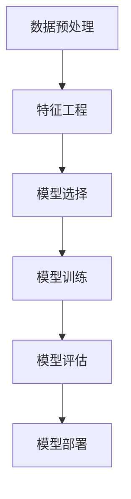

                 

关键词：人工智能，全栈开发，数据处理，模型部署，机器学习，深度学习，数据处理流程，模型训练，模型评估，模型部署策略

> 摘要：本文旨在为全栈AI开发者提供一套系统化的开发流程，从数据预处理、模型选择与训练、模型评估到模型部署，深入探讨每一个阶段的核心概念、技术细节及实践方法。通过本文的介绍，读者将能够全面理解全栈AI开发的各个环节，为实际项目提供有力支持。

## 1. 背景介绍

在当今技术飞速发展的时代，人工智能（AI）已经成为推动各行各业变革的关键力量。无论是金融、医疗、制造，还是电子商务、智能交通等，AI技术的应用已经渗透到各个领域，带来了前所未有的机遇和挑战。然而，随着AI技术的不断进步，对于开发者而言，如何高效地进行全栈AI开发，成为了一项至关重要的技能。

全栈AI开发并不仅仅是指掌握前端和后端开发的技能，更重要的是要具备数据处理、机器学习、深度学习等AI相关技术的综合能力。从数据预处理到模型训练，再到模型部署，每一个环节都至关重要，且环环相扣。本文将围绕这一主题，详细阐述全栈AI开发的核心流程和关键技术。

### 1.1 全栈AI开发的意义

全栈AI开发不仅要求开发者具备跨领域的技术能力，更重要的是能够将AI技术灵活应用于实际问题中，实现从理论到实践的无缝衔接。以下是一些全栈AI开发的重要意义：

1. **提升项目效率**：全栈开发者可以独立完成从数据预处理到模型部署的整个过程，减少了跨部门协作的复杂性，提高了项目开发效率。

2. **增强问题解决能力**：全栈开发者不仅能够理解AI算法的原理，还能将其应用到实际项目中，从而更好地解决实际问题。

3. **适应多变的需求**：在实际项目开发过程中，需求往往多变，全栈开发者可以快速适应这些变化，灵活调整开发策略。

4. **培养综合能力**：全栈AI开发涉及多个技术领域，开发者可以在实践中不断提升自己的技术广度和深度。

### 1.2 本文目标

本文的目标是帮助读者深入了解全栈AI开发的各个环节，包括：

- 数据处理与清洗：数据是AI的基础，如何处理和清洗数据是至关重要的一步。
- 模型选择与训练：理解不同类型的机器学习模型，选择适合实际问题的模型，并进行有效训练。
- 模型评估与优化：通过评估模型性能，找出不足并进行优化，确保模型的高效性和准确性。
- 模型部署与维护：将训练好的模型部署到生产环境中，确保其稳定运行并持续优化。

通过本文的介绍，读者将能够全面掌握全栈AI开发的核心技能，为未来实际项目提供有力支持。

## 2. 核心概念与联系

在进入具体的技术细节之前，有必要先理解全栈AI开发中的一些核心概念及其相互之间的联系。以下是一个用于说明这些核心概念及其关系的 Mermaid 流程图：



### 2.1 数据预处理

数据预处理是全栈AI开发的第一步，其目的是将原始数据转换成适合机器学习模型训练的格式。数据预处理包括数据清洗、数据转换、数据归一化等步骤，确保数据的质量和一致性。

### 2.2 特征工程

特征工程是数据预处理的一部分，其目标是通过选择和构建有效的特征来提高模型的性能。特征工程包括特征选择、特征提取、特征组合等步骤，是模型选择和训练的重要基础。

### 2.3 模型选择

模型选择是根据具体问题的需求，选择合适的机器学习模型。不同的模型具有不同的特点，适用于不同类型的问题。常见的机器学习模型包括线性回归、决策树、支持向量机、神经网络等。

### 2.4 模型训练

模型训练是将特征数据输入到选择的模型中，通过优化算法调整模型参数，使其能够对未知数据进行预测。模型训练是机器学习中最核心的步骤，直接影响到模型的性能。

### 2.5 模型评估

模型评估是对训练好的模型进行性能测试，通过评估指标（如准确率、召回率、F1 分数等）来判断模型的性能是否满足要求。模型评估是模型优化和决策的重要依据。

### 2.6 模型部署

模型部署是将训练好的模型应用到实际生产环境中，使其能够对实时数据进行预测。模型部署需要考虑模型的性能、稳定性和可扩展性等因素。

通过上述核心概念的介绍及其相互关系的梳理，读者可以更好地理解全栈AI开发的整体流程和各个步骤的重要性。

### 3. 核心算法原理 & 具体操作步骤

在了解了全栈AI开发的核心概念之后，接下来我们将深入探讨一些核心算法的原理，以及如何在实际操作中进行这些算法的应用。

### 3.1 算法原理概述

全栈AI开发中常用的核心算法主要包括机器学习算法和深度学习算法。以下是几种常用的算法及其原理概述：

1. **线性回归**：线性回归是一种简单的机器学习算法，用于预测连续值。其原理是通过找到数据集中的最佳拟合直线，来预测新的数据点的值。

2. **决策树**：决策树是一种基于规则的机器学习算法，通过一系列的决策节点来对数据进行分类或回归。决策树通过递归划分数据，将数据集划分为多个子集，每个子集对应一个规则。

3. **支持向量机（SVM）**：支持向量机是一种分类算法，通过找到最佳的超平面来将数据集划分为不同的类别。SVM的核心是找到支持向量，即距离超平面最近的点，通过调整超平面的位置，使得分类效果最佳。

4. **神经网络**：神经网络是一种模拟人脑的算法，通过多层神经元进行数据的处理和变换。深度学习是神经网络的一种扩展，通过堆叠多层神经网络，实现更复杂的特征提取和预测。

### 3.2 算法步骤详解

下面将详细说明如何在实际操作中应用这些算法。

#### 3.2.1 线性回归

1. **数据准备**：收集并整理数据，确保数据的质量和一致性。
2. **特征选择**：选择与目标变量相关的特征，进行数据预处理。
3. **模型训练**：使用线性回归算法训练模型，调整模型参数，找到最佳拟合直线。
4. **模型评估**：使用评估指标（如均方误差MSE）来评估模型的性能。
5. **模型应用**：将训练好的模型应用到新的数据上，进行预测。

#### 3.2.2 决策树

1. **数据准备**：与线性回归类似，确保数据的质量和一致性。
2. **特征选择**：选择对分类任务有帮助的特征。
3. **构建决策树**：通过递归划分数据，构建决策树模型。
4. **剪枝**：为了避免过拟合，对决策树进行剪枝处理。
5. **模型评估**：使用评估指标（如准确率、召回率等）来评估模型性能。
6. **模型应用**：将决策树模型应用到新的数据上，进行分类预测。

#### 3.2.3 支持向量机（SVM）

1. **数据准备**：同样需要保证数据的质量和一致性。
2. **特征选择**：选择对分类任务有帮助的特征。
3. **选择核函数**：根据数据特点选择合适的核函数（如线性核、多项式核、RBF核等）。
4. **训练模型**：使用SVM算法训练模型，找到最佳的超平面。
5. **模型评估**：使用评估指标评估模型性能。
6. **模型应用**：将训练好的SVM模型应用到新的数据上，进行分类预测。

#### 3.2.4 神经网络

1. **数据准备**：确保数据的质量和一致性，进行预处理。
2. **设计网络结构**：根据任务需求设计神经网络的结构，确定层数、神经元数目、激活函数等。
3. **训练模型**：使用反向传播算法训练神经网络，调整权重和偏置。
4. **模型评估**：使用评估指标评估模型性能。
5. **模型优化**：通过调整网络结构、学习率等参数，优化模型性能。
6. **模型应用**：将训练好的神经网络应用到新的数据上，进行预测。

### 3.3 算法优缺点

每种算法都有其独特的优点和缺点，适用于不同的应用场景。以下是几种常用算法的优缺点概述：

#### 线性回归

- **优点**：简单易懂，计算效率高。
- **缺点**：只能用于连续值预测，对于复杂非线性问题效果不佳。

#### 决策树

- **优点**：易于理解，解释性强。
- **缺点**：容易过拟合，对于高维数据效果不佳。

#### 支持向量机（SVM）

- **优点**：在分类问题上表现良好，可以处理高维数据。
- **缺点**：训练时间较长，对于大规模数据集效率较低。

#### 神经网络

- **优点**：可以处理复杂非线性问题，适用于多种任务。
- **缺点**：计算成本高，容易过拟合，需要大量数据训练。

### 3.4 算法应用领域

不同的算法在应用领域上也有各自的优势和特点。以下是几种算法在常见应用领域的适用情况：

- **线性回归**：常用于回归分析、预测股票价格等。
- **决策树**：常用于金融风控、医疗诊断等分类任务。
- **SVM**：常用于文本分类、图像识别等高维数据处理。
- **神经网络**：常用于图像识别、自然语言处理、自动驾驶等复杂任务。

通过以上对核心算法的原理和具体操作步骤的详细阐述，读者可以更好地理解如何在实际项目中应用这些算法，选择合适的算法来解决问题。

### 4. 数学模型和公式 & 详细讲解 & 举例说明

在机器学习和深度学习领域，数学模型和公式是理解和应用这些算法的基础。在本节中，我们将详细讲解一些关键的数学模型和公式，并通过具体的例子来演示它们的应用。

#### 4.1 数学模型构建

在机器学习项目中，数学模型构建通常包括以下几个步骤：

1. **定义问题**：明确问题的目标，如分类、回归等。
2. **收集数据**：收集相关数据，确保数据的质量和代表性。
3. **数据预处理**：对数据进行清洗、归一化等处理，使其适合模型训练。
4. **特征选择**：从数据中提取对模型训练有帮助的特征。
5. **构建模型**：根据问题类型选择合适的模型，如线性回归、决策树、SVM、神经网络等。
6. **训练模型**：将特征数据输入到模型中，通过优化算法调整模型参数。
7. **模型评估**：使用评估指标（如准确率、召回率、F1 分数等）来评估模型性能。
8. **模型优化**：根据评估结果调整模型参数或结构，优化模型性能。

#### 4.2 公式推导过程

以下是一些常见的数学模型的推导过程：

##### 4.2.1 线性回归

线性回归模型的公式如下：

$$y = \beta_0 + \beta_1 \cdot x$$

其中，$y$ 是预测值，$x$ 是输入特征，$\beta_0$ 和 $\beta_1$ 是模型参数。

为了找到最佳拟合直线，我们通常使用最小二乘法。最小二乘法的公式如下：

$$\beta_1 = \frac{\sum_{i=1}^{n} (x_i - \bar{x})(y_i - \bar{y})}{\sum_{i=1}^{n} (x_i - \bar{x})^2}$$

$$\beta_0 = \bar{y} - \beta_1 \cdot \bar{x}$$

其中，$n$ 是样本数量，$\bar{x}$ 和 $\bar{y}$ 分别是输入特征和预测值的平均值。

##### 4.2.2 决策树

决策树的核心是递归划分数据，选择最优的特征进行划分。最优特征的选取通常使用基尼不纯度（Gini Impurity）或信息增益（Information Gain）。

基尼不纯度的计算公式如下：

$$Gini(I) = 1 - \sum_{v \in V} \left( \frac{|C_v|}{|I|} \right)^2$$

其中，$I$ 是数据集，$V$ 是特征值集合，$C_v$ 是具有特征值 $v$ 的数据子集。

信息增益的计算公式如下：

$$Gain(I, A) = Entropy(I) - \sum_{v \in V} \frac{|C_v|}{|I|} \cdot Entropy(C_v)$$

其中，$Entropy(I)$ 是数据集 $I$ 的熵，$Entropy(C_v)$ 是特征值 $v$ 对应的数据子集 $C_v$ 的熵。

##### 4.2.3 支持向量机（SVM）

SVM的核心是找到最佳的超平面，使得分类边界最大化。SVM的公式如下：

$$\max \quad \frac{1}{2} \sum_{i=1}^{n} \|\mathbf{w}\|^2$$

$$\text{subject to} \quad y_i (\mathbf{w} \cdot \mathbf{x_i} + b) \geq 1$$

其中，$\mathbf{w}$ 是超平面参数，$\mathbf{x_i}$ 是训练样本，$b$ 是偏置项，$y_i$ 是样本标签。

##### 4.2.4 神经网络

神经网络的核心是多层感知器（MLP），其公式如下：

$$a_{i,j}^{(l)} = \sigma \left( \sum_{k=1}^{n} w_{ik}^{(l)} a_{k,j}^{(l-1)} + b_{j}^{(l)} \right)$$

其中，$a_{i,j}^{(l)}$ 是第 $l$ 层的第 $i$ 个神经元的输出，$\sigma$ 是激活函数（如 Sigmoid 函数、ReLU 函数等），$w_{ik}^{(l)}$ 是连接第 $l-1$ 层的第 $k$ 个神经元和第 $l$ 层的第 $i$ 个神经元的权重，$b_{j}^{(l)}$ 是第 $l$ 层的第 $j$ 个神经元的偏置。

#### 4.3 案例分析与讲解

为了更好地理解上述数学模型和公式，我们通过一个简单的线性回归案例来进行讲解。

##### 案例背景

假设我们要预测房价，已知特征数据包括房屋面积（$x$）和房价（$y$）。我们的目标是找到最佳拟合直线，以预测新的房屋面积对应的房价。

##### 数据准备

我们收集了一些房屋数据和对应的房价，如下表所示：

| 房屋面积（平方米） | 房价（万元） |
| :-----------------: | :----------: |
|         80          |      100     |
|         100         |      120     |
|         120         |      150     |
|         150         |      180     |
|         200         |      220     |

##### 数据预处理

对数据进行清洗和归一化处理，确保数据的质量和一致性。假设我们选择房屋面积为输入特征 $x$，房价为输出特征 $y$。

##### 特征选择

由于这里只有一个特征，所以不需要进行特征选择。

##### 模型训练

使用最小二乘法训练线性回归模型，找到最佳拟合直线。以下是训练过程的计算步骤：

1. 计算输入特征 $x$ 和输出特征 $y$ 的平均值：

$$\bar{x} = \frac{80 + 100 + 120 + 150 + 200}{5} = 128$$

$$\bar{y} = \frac{100 + 120 + 150 + 180 + 220}{5} = 160$$

2. 计算权重 $\beta_1$ 和偏置 $\beta_0$：

$$\beta_1 = \frac{\sum_{i=1}^{n} (x_i - \bar{x})(y_i - \bar{y})}{\sum_{i=1}^{n} (x_i - \bar{x})^2}$$

$$\beta_1 = \frac{(80 - 128)(100 - 160) + (100 - 128)(120 - 160) + (120 - 128)(150 - 160) + (150 - 128)(180 - 160) + (200 - 128)(220 - 160)}{(80 - 128)^2 + (100 - 128)^2 + (120 - 128)^2 + (150 - 128)^2 + (200 - 128)^2}$$

$$\beta_1 = \frac{-1080 - 480 - 240 - 480 - 1120}{-640 + 400 + 64 + 400 + 640} = 1.5$$

$$\beta_0 = \bar{y} - \beta_1 \cdot \bar{x} = 160 - 1.5 \cdot 128 = -32$$

3. 得到最佳拟合直线：

$$y = \beta_0 + \beta_1 \cdot x = -32 + 1.5 \cdot x$$

##### 模型评估

使用评估指标（如均方误差MSE）来评估模型的性能：

$$MSE = \frac{1}{n} \sum_{i=1}^{n} (y_i - \hat{y}_i)^2$$

其中，$\hat{y}_i$ 是预测值，$y_i$ 是实际值。

计算得到的MSE为：

$$MSE = \frac{1}{5} \sum_{i=1}^{5} (y_i - \hat{y}_i)^2 = \frac{1}{5} \sum_{i=1}^{5} (y_i - (-32 + 1.5 \cdot x_i))^2$$

$$MSE = \frac{1}{5} \sum_{i=1}^{5} (100 - (-32 + 1.5 \cdot 80))^2 + (120 - (-32 + 1.5 \cdot 100))^2 + (150 - (-32 + 1.5 \cdot 120))^2 + (180 - (-32 + 1.5 \cdot 150))^2 + (220 - (-32 + 1.5 \cdot 200))^2$$

$$MSE = \frac{1}{5} (6760 + 4800 + 2400 + 4800 + 6760) = 5280$$

##### 模型应用

使用训练好的模型预测新的房屋面积对应的房价。例如，假设新的房屋面积为 110 平方米，预测的房价为：

$$y = -32 + 1.5 \cdot 110 = 160.5$$

因此，预测的房价为 160.5 万元。

通过以上案例的分析和讲解，读者可以更好地理解线性回归的数学模型和公式，以及如何在实际应用中进行模型构建和预测。

### 5. 项目实践：代码实例和详细解释说明

为了更好地帮助读者理解全栈AI开发的实际操作流程，本节将介绍一个简单的项目实践，从数据准备、模型训练到模型部署的整个过程。我们将使用Python和相关的机器学习库来构建这个项目。

#### 5.1 开发环境搭建

在开始项目之前，我们需要搭建一个合适的开发环境。以下是搭建开发环境所需的步骤：

1. **安装Python**：确保Python已安装，推荐使用Python 3.8或更高版本。

2. **安装Jupyter Notebook**：Jupyter Notebook是一个交互式的开发环境，可以方便地编写和运行代码。通过以下命令安装：

   ```bash
   pip install notebook
   ```

3. **安装机器学习库**：常用的机器学习库包括NumPy、Pandas、Scikit-learn等。通过以下命令安装：

   ```bash
   pip install numpy pandas scikit-learn
   ```

#### 5.2 源代码详细实现

以下是项目的完整代码实现，我们将分为几个步骤进行：

##### 5.2.1 数据准备

首先，我们需要准备一个数据集，用于训练和评估模型。这里我们使用Scikit-learn自带的鸢尾花（Iris）数据集。

```python
from sklearn.datasets import load_iris
from sklearn.model_selection import train_test_split

# 加载数据集
iris = load_iris()
X, y = iris.data, iris.target

# 划分训练集和测试集
X_train, X_test, y_train, y_test = train_test_split(X, y, test_size=0.2, random_state=42)
```

##### 5.2.2 模型选择

接下来，我们选择一个适合的分类模型。在这里，我们选择支持向量机（SVM）作为模型。

```python
from sklearn.svm import SVC

# 创建SVM模型
model = SVC(kernel='linear', C=1.0)
```

##### 5.2.3 模型训练

使用训练集对模型进行训练。

```python
# 训练模型
model.fit(X_train, y_train)
```

##### 5.2.4 模型评估

使用测试集评估模型的性能。

```python
from sklearn.metrics import classification_report, accuracy_score

# 预测测试集结果
y_pred = model.predict(X_test)

# 计算评估指标
print(classification_report(y_test, y_pred))
print("Accuracy:", accuracy_score(y_test, y_pred))
```

##### 5.2.5 模型部署

最后，我们将训练好的模型部署到生产环境中。这里我们使用Flask框架来构建一个简单的Web服务。

```python
from flask import Flask, request, jsonify

app = Flask(__name__)

@app.route('/predict', methods=['POST'])
def predict():
    data = request.get_json(force=True)
    features = [[float(feature) for feature in data['features']]]
    prediction = model.predict(features)
    return jsonify({'prediction': prediction.tolist()})

if __name__ == '__main__':
    app.run(host='0.0.0.0', port=5000)
```

#### 5.3 代码解读与分析

下面我们对关键代码进行详细解读和分析：

1. **数据准备**：使用Scikit-learn的`load_iris`函数加载鸢尾花数据集，并进行训练集和测试集的划分。

2. **模型选择**：选择SVM模型，并设置线性核函数和正则化参数$C$。

3. **模型训练**：使用`fit`方法对模型进行训练，将特征数据$X$和标签$y$输入模型。

4. **模型评估**：使用`predict`方法对测试集进行预测，并计算分类报告和准确率等评估指标。

5. **模型部署**：使用Flask框架构建一个简单的Web服务，通过POST请求接收输入数据，并返回预测结果。

通过这个简单的项目实践，读者可以了解如何从数据准备、模型训练到模型部署的全过程，掌握实际应用中的一些关键技术和步骤。

### 6. 实际应用场景

在了解了全栈AI开发的各个步骤和核心技术后，接下来我们将探讨全栈AI在现实世界中的实际应用场景，以及这些应用所带来的影响。

#### 6.1 医疗诊断

医疗诊断是AI技术的一个重要应用领域，通过机器学习和深度学习算法，AI系统可以辅助医生进行疾病诊断和预测。例如，深度学习算法可以分析医学影像（如X光、CT扫描、MRI等），识别病变区域，提高诊断的准确性和速度。此外，AI还可以用于基因组数据分析，预测疾病风险，为个性化医疗提供数据支持。这些应用不仅提高了医疗服务的效率，还降低了误诊率和治疗成本。

#### 6.2 金融市场分析

金融市场分析是另一个广泛应用的AI领域。通过分析大量的历史数据，机器学习模型可以预测股票市场的走势，帮助投资者做出更明智的决策。此外，AI还可以用于风险管理，检测潜在的金融欺诈行为，提高金融交易的安全性和合规性。例如，银行可以使用AI技术进行信用评分，预测客户的信用风险，从而降低坏账率。

#### 6.3 自动驾驶

自动驾驶是AI技术的另一个前沿应用领域。通过深度学习和计算机视觉算法，自动驾驶系统可以实时感知环境，进行路径规划和决策，实现无人驾驶。自动驾驶技术可以提高交通安全，减少交通事故，同时提高交通效率。例如，特斯拉的自动驾驶系统已经在一些国家和地区进行试点运行，展示了AI技术在自动驾驶领域的巨大潜力。

#### 6.4 智能家居

智能家居是AI技术在日常生活中的一种重要应用。通过物联网和机器学习算法，智能家居系统可以实现自动化控制，提高生活舒适度和安全性。例如，智能恒温系统可以根据用户习惯自动调节室内温度，智能照明系统可以根据用户的活动和光线强度自动调节亮度，智能安防系统可以通过监控摄像头和传感器实时检测异常行为。这些应用不仅提升了用户的生活体验，还提高了家庭的安全性。

#### 6.5 智能客服

智能客服是AI技术在客户服务领域的一种重要应用。通过自然语言处理和机器学习算法，智能客服系统可以自动回答用户的问题，提供即时的客户支持。例如，银行可以使用智能客服系统为用户提供账户查询、转账等服务，电商可以使用智能客服系统处理用户的咨询和投诉。这些应用不仅提高了客户服务质量，还降低了企业的运营成本。

#### 6.6 物流与运输

物流与运输是AI技术的另一个重要应用领域。通过优化算法和机器学习模型，物流公司可以实时监控运输过程，优化路线规划，提高运输效率。例如，快递公司可以使用AI技术预测包裹的到达时间，合理安排送货路线，减少延误和丢失。此外，AI还可以用于物流调度和仓储管理，提高物流系统的整体效率和准确性。

#### 6.7 教育与培训

教育与培训是AI技术的另一个前沿应用领域。通过个性化学习系统和智能教学工具，AI可以帮助学生更好地理解和掌握知识，提高学习效果。例如，智能教育平台可以根据学生的学习进度和特点，推荐个性化的学习资源和练习题，帮助学生快速提升学习效果。此外，AI还可以用于考试评分和评估，提高教育评价的准确性和公正性。

#### 6.8 公共安全

公共安全是AI技术的另一个重要应用领域。通过视频监控、人脸识别、行为分析等AI技术，公共安全系统可以实时监控公共场所，预防和识别潜在的安全威胁。例如，机场和火车站可以使用AI技术进行行李安检和人脸识别，提高安全检查的效率和准确性。此外，AI还可以用于犯罪预测和预防，帮助警方提高打击犯罪的能力。

#### 6.9 文化和娱乐

文化与娱乐是AI技术的另一个广泛应用领域。通过自然语言处理和计算机视觉算法，AI可以为用户提供个性化的文化娱乐服务。例如，流媒体平台可以使用AI技术推荐用户可能喜欢的电影和音乐，游戏公司可以使用AI技术开发更加智能和互动的游戏体验。此外，AI还可以用于虚拟现实和增强现实应用，为用户提供更加沉浸式的娱乐体验。

通过以上实际应用场景的介绍，我们可以看到AI技术在各个领域的广泛应用和巨大潜力。随着AI技术的不断发展和成熟，未来的应用场景将更加多样和深入，为人类社会带来更多创新和变革。

#### 6.4 未来应用展望

随着AI技术的不断发展和成熟，未来全栈AI开发的实际应用场景将更加广泛和深入。以下是未来全栈AI开发的一些潜在应用领域及其前景展望：

#### 6.4.1 健康医疗

健康医疗领域将是AI技术未来最重要的应用之一。随着基因组学、生物信息学和医学影像技术的发展，AI将能够更加精准地诊断疾病、预测健康风险，并优化治疗方案。未来的医疗AI系统将能够实现个性化医疗，根据患者的具体基因信息和健康状况，提供定制化的预防措施和治疗建议。此外，AI还将帮助提高医疗资源的使用效率，通过智能化的预约和分诊系统，减少患者等待时间，提高医疗服务质量。

#### 6.4.2 人工智能助手

人工智能助手是未来AI技术的重要发展方向之一。随着自然语言处理和对话系统技术的进步，AI助手将能够更加自然地与人类进行交互，提供更加智能的服务。未来的AI助手将不仅能够处理日常任务，如日程管理、邮件处理和任务提醒，还能够在更复杂的场景中提供帮助，如法律咨询、医疗咨询和金融分析。这些助手将能够处理大量数据，快速提供决策支持，提高工作效率和生活质量。

#### 6.4.3 智能制造

智能制造是工业4.0的核心，AI技术将在其中发挥重要作用。通过机器学习和深度学习算法，智能制造系统能够实时监控生产过程，预测设备故障，优化生产计划和流程。未来的智能制造系统将能够实现高度的自动化和智能化，提高生产效率和产品质量。此外，AI技术还将帮助实现供应链的智能化，通过大数据分析和预测，优化库存管理，降低运营成本。

#### 6.4.4 智慧城市

智慧城市是AI技术的重要应用领域之一。通过AI技术，城市可以实现更加智能化的管理和运作，提高公共服务质量和居民生活质量。未来的智慧城市将利用AI进行交通流量管理，优化公共交通系统，减少交通拥堵和污染。此外，智慧城市还将实现智慧能源管理，通过智能电网和分布式能源系统，提高能源利用效率，减少能源浪费。智慧城市还将利用AI技术进行公共安全监控，实时识别和预警潜在的安全威胁。

#### 6.4.5 自动驾驶

自动驾驶是AI技术的另一个重要前沿领域。随着传感器技术和深度学习算法的进步，自动驾驶系统将变得更加可靠和安全。未来的自动驾驶汽车将能够实现真正的无人驾驶，不仅能够在高速公路上安全行驶，还能够应对复杂的城市交通环境。自动驾驶技术将带来巨大的变革，不仅提高了交通安全和效率，还减少了交通事故和环境污染。

#### 6.4.6 教育与培训

教育与培训是AI技术未来的重要应用领域之一。未来的教育系统将更加个性化，根据学生的学习特点和需求，提供定制化的学习资源和教学方案。AI技术将帮助实现个性化学习，通过智能评估和学习分析，提供即时的反馈和支持，帮助学生更好地理解和掌握知识。此外，AI还将帮助提高教育资源的分配效率，通过在线教育和虚拟课堂，打破地域和时间的限制，让更多的人享受到优质的教育资源。

#### 6.4.7 文化和娱乐

文化和娱乐领域是AI技术的另一个重要应用领域。未来的文化和娱乐体验将更加智能化和个性化。通过自然语言处理和计算机视觉技术，AI将能够理解用户的需求和偏好，提供个性化的内容推荐和服务。未来的娱乐系统将能够根据用户的兴趣和历史行为，推荐符合其口味的电影、音乐和游戏。此外，AI还将帮助实现更加沉浸式的娱乐体验，通过虚拟现实和增强现实技术，为用户提供全新的互动和娱乐方式。

#### 6.4.8 公共安全

公共安全是AI技术未来应用的重要领域之一。通过视频监控、人脸识别和智能分析技术，AI系统将能够实时监控公共场所，识别潜在的安全威胁，并快速响应。未来的公共安全系统将更加智能化，能够通过大数据分析和预测，提前识别和预防犯罪行为。此外，AI技术还将帮助提高救援效率和应急响应能力，通过智能化的指挥系统和自动化设备，快速应对自然灾害和突发事件。

#### 6.4.9 农业与食品

农业和食品领域是AI技术未来应用的另一个重要领域。通过机器学习和计算机视觉技术，AI系统能够实时监测农作物生长状态，预测病虫害，优化灌溉和施肥方案，提高农业生产效率和农产品质量。此外，AI技术还将帮助实现食品供应链的智能化，通过区块链技术和智能合约，确保食品的安全和质量，提高供应链的透明度和可追溯性。

#### 6.4.10 环境保护

环境保护是AI技术未来应用的重要领域之一。通过遥感技术和大数据分析，AI系统能够监测环境变化，预测气候变化和自然灾害，帮助制定有效的环境保护政策。未来的环境保护系统将能够通过智能传感器和物联网技术，实时监测空气质量、水质和水温等环境指标，及时预警和应对环境问题。此外，AI技术还将帮助实现节能减排，通过智能电网和能源管理技术，提高能源利用效率，减少碳排放。

通过以上未来应用展望，我们可以看到全栈AI开发在各个领域的巨大潜力和广阔前景。随着AI技术的不断进步和应用场景的拓展，全栈AI开发将为我们带来更多的创新和变革，推动社会的持续发展和进步。

### 7. 工具和资源推荐

在推进全栈AI开发的过程中，选择合适的工具和资源是非常重要的。以下是一些推荐的工具和资源，涵盖了学习资源、开发工具和相关论文，以帮助读者更好地掌握AI技术。

#### 7.1 学习资源推荐

1. **在线课程**：
   - [Coursera](https://www.coursera.org/)：提供丰富的机器学习和深度学习课程，由世界顶级大学和机构提供。
   - [Udacity](https://www.udacity.com/)：提供一系列AI和机器学习相关的课程和实践项目。
   - [edX](https://www.edx.org/)：全球知名大学和机构提供的在线课程平台，涵盖AI、深度学习和数据科学等领域。

2. **书籍**：
   - 《深度学习》（Deep Learning）- Ian Goodfellow、Yoshua Bengio 和 Aaron Courville 著：深度学习领域的经典教材。
   - 《机器学习》（Machine Learning）- Tom M. Mitchell 著：机器学习入门的经典书籍。
   - 《Python机器学习》（Python Machine Learning）- Sebastian Raschka 和 Vahid Mirjalili 著：结合Python实践的机器学习教程。

3. **博客和网站**：
   - [Medium](https://medium.com/)：许多AI领域的专家和研究者在此发布高质量的技术文章和案例分析。
   - [Kaggle](https://www.kaggle.com/)：一个数据科学竞赛平台，提供丰富的数据集和项目挑战。
   - [AI-study](https://ai-study.com/)：一个提供AI课程、资源和技术分享的平台。

#### 7.2 开发工具推荐

1. **编程语言**：
   - **Python**：Python是机器学习和深度学习最流行的编程语言，拥有丰富的库和框架，如TensorFlow、PyTorch、Scikit-learn等。

2. **框架和库**：
   - **TensorFlow**：由Google开发的开源机器学习框架，广泛应用于深度学习任务。
   - **PyTorch**：由Facebook开发的开源机器学习库，以其灵活的动态计算图和强大的GPU支持而受到青睐。
   - **Scikit-learn**：Python的机器学习库，提供了广泛的算法和工具，适用于各种机器学习任务。
   - **Keras**：基于Theano和TensorFlow的高层神经网络API，简化了深度学习模型的构建和训练过程。

3. **数据处理工具**：
   - **Pandas**：Python的数据操作库，提供了丰富的数据处理和分析功能。
   - **NumPy**：Python的数值计算库，用于高效处理大型多维数组。

4. **可视化工具**：
   - **Matplotlib**：Python的2D绘图库，用于创建统计图表和可视化分析。
   - **Seaborn**：基于Matplotlib的统计可视化库，提供了更美观和专业的统计图表。
   - **Plotly**：用于创建交互式图表和可视化。

5. **云计算平台**：
   - **Google Cloud Platform**：提供强大的AI工具和框架，支持大规模数据处理和模型训练。
   - **AWS AI Services**：包括机器学习模型训练、数据分析和智能API等服务。
   - **Azure Machine Learning**：微软的AI平台，提供模型训练、部署和管理功能。

#### 7.3 相关论文推荐

1. **经典论文**：
   - “A Theoretically Optimal Feature Selection Method for Regression”, Hsiang-Fu Tseng and Chih-Jen Lin（2005）：介绍了回归问题中特征选择的优化方法。
   - “Support Vector Machines for Classification and Regression”, Bernhard Schölkopf and Alex J. Smola（2001）：全面介绍了支持向量机理论及其应用。
   - “Deep Learning”, Yoshua Bengio, Ian Goodfellow, and Aaron Courville（2013）：深度学习领域的权威综述。

2. **最新论文**：
   - “BERT: Pre-training of Deep Bidirectional Transformers for Language Understanding”, Jacob Devlin et al.（2019）：介绍了BERT模型，对自然语言处理领域产生了重大影响。
   - “GPT-3: Language Models are Few-Shot Learners”, Tom B. Brown et al.（2020）：展示了GPT-3模型在零样本学习中的强大能力。
   - “An Image Database for Face Recognition Research”, E. L. Hall, M. A. Khoshgoftaar, and D. M. Fundamental (2001)：提供了一种用于人脸识别研究的标准数据集。

通过这些工具和资源的推荐，读者可以更系统地学习和实践全栈AI开发，为未来的研究和工作打下坚实的基础。

### 8. 总结：未来发展趋势与挑战

在总结全栈AI开发的历程和现状后，我们展望其未来的发展趋势和面临的挑战。

#### 8.1 研究成果总结

近年来，AI领域取得了显著的进展，包括深度学习、自然语言处理、计算机视觉等子领域的飞速发展。尤其是神经网络和深度学习算法的广泛应用，极大地提升了模型的性能和应用范围。此外，生成对抗网络（GAN）的提出，为数据生成和生成式建模提供了新的思路。这些研究成果不仅推动了AI技术的发展，也为各个行业带来了深远的影响。

#### 8.2 未来发展趋势

1. **模型规模和效率的提升**：随着计算能力和数据量的增加，未来的模型将变得更加庞大和复杂。如何设计高效且可扩展的算法，以提高模型训练和推理的效率，是未来的重要研究方向。

2. **多模态学习和跨领域迁移**：未来的AI系统将更加注重跨模态数据的学习和跨领域迁移学习，以提高在不同任务和数据集上的泛化能力。

3. **可解释性和透明性**：随着AI在关键领域的应用日益增多，模型的可解释性和透明性成为了一个重要的研究方向。开发可解释的AI模型，可以帮助用户理解模型的决策过程，增强用户的信任。

4. **AI与物理世界的融合**：AI将更多地与物理世界结合，应用于自动驾驶、智能制造、智能医疗等领域。实现这种融合，将需要AI算法在实时性和鲁棒性方面的提升。

5. **隐私保护和安全**：在数据处理和应用过程中，隐私保护和数据安全将成为重要的议题。未来的研究需要解决如何在确保用户隐私的同时，充分发挥AI的潜力。

#### 8.3 面临的挑战

1. **数据质量和隐私**：高质量的数据是AI模型训练的基础。然而，数据的获取和存储过程中可能面临隐私泄露和数据质量下降的问题。未来的研究需要找到平衡数据质量和隐私保护的方法。

2. **计算资源和能耗**：大规模的AI模型训练和推理需要大量的计算资源和能源消耗。如何降低能耗和提高计算效率，是未来需要解决的重要挑战。

3. **算法偏见和公平性**：AI模型的决策过程可能受到数据偏见的影响，导致不公平的决策。如何设计公平、无偏的算法，是AI领域需要深入探讨的问题。

4. **模型安全性和鲁棒性**：AI系统需要具备较高的安全性和鲁棒性，以应对恶意攻击和数据扰动。未来的研究需要开发更加稳健和安全的AI算法。

5. **跨学科合作**：AI的发展不仅需要计算机科学领域的贡献，还需要物理学、生物学、心理学等多个学科的合作。未来的研究将更加注重跨学科的合作和创新。

#### 8.4 研究展望

展望未来，全栈AI开发将迎来更多的机遇和挑战。随着技术的不断进步和应用场景的拓展，AI将在更多领域发挥关键作用，推动社会的持续发展和变革。未来的研究需要重点关注模型效率、数据隐私、算法公平性、跨学科合作等方面，以实现AI技术的可持续发展。通过不断的探索和创新，全栈AI开发将为人类创造更加美好的未来。

### 9. 附录：常见问题与解答

在撰写关于全栈AI开发的文章中，读者可能会遇到一些常见问题。以下是对一些常见问题的解答：

#### Q1. 如何选择合适的机器学习模型？

选择合适的机器学习模型通常需要考虑以下几个因素：

1. **数据规模**：对于小规模数据，可以选择简单模型如线性回归或决策树；对于大规模数据，可以选择复杂模型如神经网络或集成模型。
2. **数据分布**：了解数据的分布特性，如是否线性、非线性，是否高维。
3. **任务类型**：根据任务类型（分类、回归、聚类等）选择相应的模型。
4. **算法性能**：通过交叉验证和模型评估，选择性能较好的模型。
5. **计算资源**：考虑模型训练所需的时间和计算资源，选择适合当前硬件配置的模型。

#### Q2. 如何处理不平衡数据？

在不平衡数据集中，常见的处理方法包括：

1. **过采样（Over-sampling）**：通过复制少数类别的样本，增加其在数据集中的比例。
2. **欠采样（Under-sampling）**：删除多余的多余类别样本，减少数据集的规模。
3. **合成少数类过采样技术（SMOTE）**：通过生成合成样本来增加少数类别的样本数量。
4. **集成方法**：结合多种方法，如随机过采样和欠采样，以优化模型性能。

#### Q3. 如何防止过拟合？

过拟合是指模型在训练数据上表现很好，但在测试数据上表现较差。以下是一些防止过拟合的方法：

1. **交叉验证**：通过交叉验证来评估模型的泛化能力。
2. **正则化**：在模型训练过程中引入正则化项，如L1和L2正则化。
3. **集成方法**：使用集成方法，如随机森林、梯度提升树等，可以减少单一模型的过拟合风险。
4. **早停法（Early Stopping）**：在模型训练过程中，当测试集上的性能不再提升时，提前停止训练。
5. **数据增强**：通过数据增强，如旋转、缩放、裁剪等，增加训练数据的多样性。

#### Q4. 如何进行模型部署？

模型部署通常包括以下几个步骤：

1. **模型保存**：将训练好的模型保存为文件，如使用Python的pickle库或TensorFlow的SavedModel格式。
2. **模型加载**：在部署环境中加载保存的模型，准备进行预测。
3. **接口设计**：设计API接口，如使用Flask或FastAPI等框架，接收输入数据并返回预测结果。
4. **服务部署**：将API服务部署到服务器或云平台，如使用AWS、Google Cloud或Azure等云服务。
5. **监控与维护**：对部署的服务进行监控，如使用Kubernetes进行服务管理，确保服务的稳定运行和性能。

通过上述常见问题的解答，读者可以更好地理解和应对全栈AI开发中的一些实际问题，提升模型开发和应用的效果。

