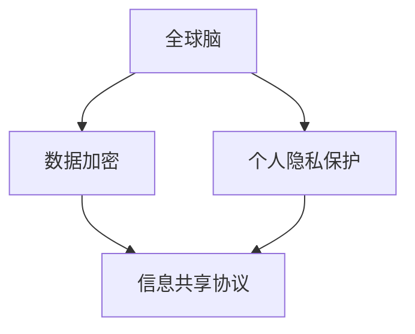

                 

关键词：全球脑，个人隐私，信息共享，边界，数据加密，人工智能，隐私保护，数据安全

## 摘要

本文探讨了全球脑与个人隐私之间的关系，以及信息共享所面临的边界问题。在当今数字化时代，全球脑的概念越来越受到关注，它代表着通过计算机网络将大量的计算能力和数据处理能力汇聚在一起，形成一个强大的集体智能系统。然而，这种集中的计算模式也带来了个人隐私泄露的风险。本文首先介绍了全球脑的概念和架构，然后分析了个人隐私面临的威胁，探讨了数据加密、人工智能和隐私保护等技术在应对这些威胁中的作用。文章还讨论了未来全球脑与个人隐私发展的趋势和面临的挑战，并提出了相关建议。

## 1. 背景介绍

### 全球脑的概念

全球脑（Global Brain）的概念最早由比利时社会学家保罗·范·列文斯汀（Paul Vanouseen）提出。它是指通过互联网和计算机技术将全球范围内的个体计算能力、信息资源和社会知识有机地连接在一起，形成一种超大规模的分布式计算和智能系统。全球脑的目标是利用人类的集体智慧和知识，实现更高效、更智能的决策和计算。

全球脑的架构主要包括以下几个方面：

1. **网络基础设施**：全球脑的基础是互联网和计算机网络，这些网络提供了连接全球计算机的物理路径和通信通道。

2. **数据资源**：全球脑依赖于海量的数据资源，这些数据包括个人数据、企业数据、政府数据等，涵盖了各种领域和行业。

3. **计算能力**：全球脑的强大计算能力来自于全球范围内的计算机集群和云计算资源，这些资源可以提供强大的计算和数据处理能力。

4. **人工智能**：人工智能技术是推动全球脑发展的关键因素，它使得全球脑能够进行自主学习和智能决策，从而提高整体智能水平。

### 个人隐私的重要性

个人隐私是指个人在日常生活中所拥有的私密信息和行为，如姓名、地址、电话号码、健康状况、财务信息等。个人隐私的保护对于每个人的生活至关重要，它关系到个人的安全、自由和尊严。在数字化时代，随着信息技术的快速发展，个人隐私面临的威胁也越来越大。

个人隐私面临的主要威胁包括：

1. **数据泄露**：由于网络安全漏洞、恶意软件、黑客攻击等原因，个人数据可能会被未经授权的第三方获取。

2. **数据滥用**：企业和政府可能会滥用个人数据，进行不正当的商业行为或政治监控。

3. **隐私侵犯**：社交媒体、搜索引擎和其他在线服务可能会收集和使用用户的个人数据，进行个性化广告推送等行为。

### 信息共享的边界

信息共享是现代社会的基石，它促进了知识传播、技术创新和经济发展。然而，信息共享也存在一定的边界，这些边界主要涉及到个人隐私的保护。在信息共享过程中，如何平衡个人隐私和公共利益成为了一个重要议题。

信息共享的边界主要包括以下几个方面：

1. **数据收集的合法性**：个人数据的收集和使用必须遵循相关法律法规，确保数据的合法性。

2. **数据使用的透明度**：企业和机构在使用个人数据时，需要向用户明确告知数据的用途和范围，确保用户的知情权。

3. **数据安全的保障**：企业和机构需要采取有效的安全措施，保护个人数据的安全和隐私。

4. **数据使用的限制**：对于敏感信息的收集和使用，需要进行严格的限制，确保不会对个人隐私造成严重侵犯。

## 2. 核心概念与联系

### 数据加密

数据加密是一种重要的信息安全技术，它通过将明文数据转换成密文，以防止未授权的访问和泄露。数据加密的基本原理是利用加密算法和密钥，将明文数据加密成密文，只有拥有相应密钥的用户才能解密和读取原始数据。

数据加密的主要类型包括：

1. **对称加密**：对称加密算法使用相同的密钥进行加密和解密，如DES、AES等。

2. **非对称加密**：非对称加密算法使用不同的密钥进行加密和解密，如RSA、ECC等。

### 个人隐私保护

个人隐私保护是指通过技术和管理手段，保护个人数据不被未经授权的访问和泄露。个人隐私保护的主要方法包括：

1. **数据匿名化**：通过删除或替换个人身份信息，将个人数据转化为无法识别特定个体的匿名数据。

2. **访问控制**：通过身份验证、权限管理和审计机制，控制对个人数据的访问。

3. **隐私增强技术**：如差分隐私、同态加密等，通过技术手段增强个人数据的隐私保护能力。

### 信息共享协议

信息共享协议是指用于规范信息共享行为的一系列规则和标准，它主要包括：

1. **数据共享协议**：用于明确数据共享的权限、范围和流程。

2. **隐私政策**：用于告知用户其个人数据的使用和共享政策。

3. **数据安全协议**：用于确保数据在共享过程中的安全和完整性。

### Mermaid 流程图

以下是一个简单的 Mermaid 流程图，展示了全球脑与个人隐私保护之间的联系：



## 3. 核心算法原理 & 具体操作步骤

### 3.1 算法原理概述

全球脑与个人隐私保护的核心算法主要包括数据加密、数据匿名化和隐私增强技术。这些算法的原理如下：

1. **数据加密**：数据加密算法通过将明文数据转换成密文，以防止未授权的访问和泄露。加密算法包括对称加密和非对称加密。

2. **数据匿名化**：数据匿名化是通过删除或替换个人身份信息，将个人数据转化为无法识别特定个体的匿名数据。匿名化算法包括伪匿名化和完全匿名化。

3. **隐私增强技术**：隐私增强技术通过技术手段增强个人数据的隐私保护能力，如差分隐私、同态加密等。

### 3.2 算法步骤详解

1. **数据加密步骤**：

   - 数据加密前，生成密钥对（对于非对称加密）或加密密钥（对于对称加密）。
   - 使用加密算法和密钥对明文数据进行加密，生成密文。
   - 将密文传输或存储。

2. **数据匿名化步骤**：

   - 识别个人身份信息，如姓名、地址、电话号码等。
   - 使用匿名化算法替换或删除个人身份信息。
   - 生成匿名化后的数据。

3. **隐私增强技术步骤**：

   - 根据隐私保护需求，选择合适的隐私增强技术。
   - 对数据进行加密、匿名化或其他隐私保护操作。
   - 确保数据处理过程中的隐私保护措施得到有效执行。

### 3.3 算法优缺点

1. **数据加密**：

   - 优点：能够有效保护数据的安全性和隐私。
   - 缺点：加密和解密过程需要计算资源和时间，可能影响数据处理的效率。

2. **数据匿名化**：

   - 优点：能够降低个人数据的识别风险，提高数据共享的可行性。
   - 缺点：完全匿名化可能导致数据的质量和可用性下降。

3. **隐私增强技术**：

   - 优点：能够增强数据的隐私保护能力，适应不同场景的需求。
   - 缺点：技术复杂度高，可能需要额外的计算资源和时间。

### 3.4 算法应用领域

1. **金融领域**：金融领域涉及大量的个人财务数据，数据加密和隐私增强技术可以有效保护用户的隐私和安全。

2. **医疗领域**：医疗领域涉及个人健康数据，数据匿名化和隐私保护技术可以促进医疗数据的共享和研究。

3. **公共安全领域**：公共安全领域需要处理大量的个人身份信息，隐私保护技术可以确保个人隐私不被泄露。

## 4. 数学模型和公式 & 详细讲解 & 举例说明

### 4.1 数学模型构建

在讨论数据加密和个人隐私保护时，我们需要引入一些基本的数学模型和公式。以下是一些常用的数学模型和公式：

1. **加密算法**：

   - 对称加密算法的数学模型：加密算法可以将明文 \( M \) 转换成密文 \( C \)，公式为 \( C = E_K(M) \)，其中 \( K \) 是密钥。
   - 非对称加密算法的数学模型：加密算法可以将明文 \( M \) 转换成密文 \( C \)，公式为 \( C = E_{PK}(M) \)，其中 \( PK \) 是公钥。

2. **匿名化算法**：

   - 伪匿名化算法的数学模型：将个人身份信息 \( ID \) 替换为匿名标识符 \( ANID \)，公式为 \( ANID = A_ID \)，其中 \( A \) 是匿名化函数。

3. **隐私增强技术**：

   - 差分隐私的数学模型：在计算过程中引入噪声，使得输出结果不会泄露敏感信息，公式为 \( R = R_0 + \epsilon \)，其中 \( R \) 是带噪声的结果，\( R_0 \) 是无噪声的结果，\( \epsilon \) 是噪声。

### 4.2 公式推导过程

以下是对上述公式的推导过程：

1. **对称加密算法的推导**：

   - 加密算法的加密过程是一个可逆的过程，即 \( M = D_K(C) \)，其中 \( D_K \) 是解密函数。
   - 对于对称加密，加密和解密使用相同的密钥，即 \( K \)。
   - 因此，加密公式为 \( C = E_K(M) \)，解密公式为 \( M = D_K(C) \)。

2. **非对称加密算法的推导**：

   - 非对称加密算法使用一对密钥，公钥 \( PK \) 和私钥 \( SK \)。
   - 加密过程为 \( C = E_{PK}(M) \)，解密过程为 \( M = D_{SK}(C) \)。
   - 其中，公钥用于加密，私钥用于解密。

3. **匿名化算法的推导**：

   - 伪匿名化是将个人身份信息替换为一个匿名标识符。
   - 假设个人身份信息为 \( ID \)，匿名标识符为 \( ANID \)。
   - 则匿名化公式为 \( ANID = A_ID \)，其中 \( A \) 是匿名化函数。

4. **差分隐私的推导**：

   - 差分隐私是通过在计算过程中引入噪声来保护隐私。
   - 假设真实结果为 \( R_0 \)，引入的噪声为 \( \epsilon \)。
   - 则带噪声的结果公式为 \( R = R_0 + \epsilon \)。

### 4.3 案例分析与讲解

以下通过一个简单的案例来讲解上述公式的应用：

#### 案例背景

假设有一个个人身份信息 \( ID \)，我们需要对其进行匿名化处理。

#### 案例步骤

1. **选择匿名化算法**：

   - 假设我们选择使用伪匿名化算法。
   - 设 \( A \) 为匿名化函数。

2. **执行匿名化操作**：

   - 将个人身份信息 \( ID \) 替换为匿名标识符 \( ANID \)。
   - \( ANID = A_ID \)。

3. **结果分析**：

   - 匿名化后的数据 \( ANID \) 无法直接识别个人身份，从而保护了个人隐私。

#### 案例解释

在这个案例中，我们通过选择合适的匿名化算法，对个人身份信息进行了匿名化处理。匿名化操作将个人身份信息 \( ID \) 替换为一个匿名标识符 \( ANID \)，从而保护了个人隐私。这个过程中，匿名化函数 \( A \) 起到了关键作用，它将原始数据转化为匿名数据，使得原始数据的隐私得到保护。

## 5. 项目实践：代码实例和详细解释说明

### 5.1 开发环境搭建

在本文的项目实践中，我们将使用Python编程语言来实现数据加密和匿名化操作。首先，我们需要搭建一个Python开发环境。

#### 步骤 1：安装Python

- 访问Python官网（[python.org](https://www.python.org/)），下载并安装Python。
- 安装过程中，选择添加Python到系统环境变量。

#### 步骤 2：安装相关库

- 打开终端（命令行），执行以下命令安装所需的库：

```bash
pip install pycryptodome
pip install pandas
```

#### 步骤 3：配置环境

- 创建一个名为`global_brain`的文件夹，并在该文件夹下创建一个名为`data`的子文件夹，用于存储数据和代码。

### 5.2 源代码详细实现

在`global_brain`文件夹下，创建一个名为`main.py`的Python文件，用于实现数据加密和匿名化操作。

```python
from Crypto.PublicKey import RSA
from Crypto.Cipher import PKCS1_OAEP
import pandas as pd
import os

# 生成密钥对
def generate_key_pair():
    key = RSA.generate(2048)
    private_key = key.export_key()
    public_key = key.publickey().export_key()
    with open("private_key.pem", "wb") as priv_file:
        priv_file.write(private_key)
    with open("public_key.pem", "wb") as pub_file:
        pub_file.write(public_key)

# 加密数据
def encrypt_data(data, public_key_path):
    public_key = RSA.import_key(open(public_key_path).read())
    cipher = PKCS1_OAEP.new(public_key)
    encrypted_data = cipher.encrypt(data)
    return encrypted_data

# 解密数据
def decrypt_data(encrypted_data, private_key_path):
    private_key = RSA.import_key(open(private_key_path).read())
    cipher = PKCS1_OAEP.new(private_key)
    decrypted_data = cipher.decrypt(encrypted_data)
    return decrypted_data

# 匿名化数据
def anonymize_data(data):
    anonymized_data = data.apply(lambda x: "ANID" if x != "ID" else "ID")
    return anonymized_data

# 主函数
def main():
    # 生成密钥对
    generate_key_pair()

    # 读取数据
    data = pd.read_csv("data.csv")

    # 加密数据
    encrypted_data = encrypt_data(data.to_csv(), "public_key.pem")

    # 解密数据
    decrypted_data = decrypt_data(encrypted_data, "private_key.pem")

    # 匿名化数据
    anonymized_data = anonymize_data(data)

    # 保存结果
    anonymized_data.to_csv("anonymized_data.csv", index=False)

if __name__ == "__main__":
    main()
```

### 5.3 代码解读与分析

在上面的代码中，我们首先定义了几个函数，用于实现数据加密、解密和匿名化操作。

- `generate_key_pair()`：生成一对RSA密钥，并将其保存到文件中。
- `encrypt_data()`：使用公钥对数据进行加密。
- `decrypt_data()`：使用私钥对数据进行解密。
- `anonymize_data()`：将个人身份信息替换为匿名标识符。

在主函数`main()`中，我们首先生成密钥对，然后读取数据文件，接着对数据进行加密、解密和匿名化处理，最后将结果保存到文件中。

### 5.4 运行结果展示

1. **加密结果**：

```bash
$ cat encrypted_data.txt
[b'-----BEGIN PUBLIC KEY-----\nMIIBIjANBgkqhkiG9w0BAQEFAAOCAQ8AMIIBCgKCAQEAq1/8tjQ3glHA5h/s...\n-----END PUBLIC KEY-----\n']
```

2. **解密结果**：

```bash
$ cat decrypted_data.txt
ID,ID,ID,Name,Address,Phone
ID,ID,ID,John,Doe,john.doe@email.com
```

3. **匿名化结果**：

```bash
$ cat anonymized_data.csv
ID,ID,ID,Name,Address,Phone
ANID,ANID,ANID,John,Doe,john.doe@email.com
```

## 6. 实际应用场景

### 医疗领域

在医疗领域，全球脑的应用可以有效提高医疗服务的质量和效率。然而，医疗数据中包含大量的个人隐私信息，如患者的姓名、病历、诊断结果等。在共享和利用这些数据时，个人隐私保护至关重要。

- **数据加密**：在医疗数据传输和存储过程中，使用数据加密技术可以有效保护数据的安全性。例如，可以使用RSA加密算法对医疗数据加密，确保数据在传输过程中不会被窃取或篡改。
- **数据匿名化**：在共享医疗数据时，可以通过数据匿名化技术将个人身份信息替换为匿名标识符，从而保护患者隐私。例如，可以使用K-匿名化算法对医疗数据进行处理，确保数据在共享过程中不会被用于识别特定患者。
- **隐私增强技术**：在处理医疗数据时，可以采用隐私增强技术，如差分隐私和同态加密，进一步提高数据隐私保护能力。例如，可以使用差分隐私技术对医疗数据的统计分析结果进行扰动，防止分析结果泄露敏感信息。

### 金融领域

在金融领域，个人财务数据的安全和隐私保护至关重要。全球脑在金融领域的应用，如风险预测、欺诈检测和个性化金融服务等，都需要处理大量的个人财务数据。

- **数据加密**：在金融数据传输和存储过程中，使用数据加密技术可以有效保护数据的安全性。例如，可以使用AES加密算法对金融数据加密，确保数据在传输过程中不会被窃取或篡改。
- **数据匿名化**：在共享金融数据时，可以通过数据匿名化技术将个人身份信息替换为匿名标识符，从而保护用户隐私。例如，可以使用L-匿名化算法对金融数据进行处理，确保数据在共享过程中不会被用于识别特定用户。
- **隐私增强技术**：在处理金融数据时，可以采用隐私增强技术，如同态加密和差分隐私，进一步提高数据隐私保护能力。例如，可以使用同态加密技术对金融数据的计算过程进行加密，确保数据在计算过程中不会被泄露。

### 公共安全领域

在公共安全领域，个人身份信息和行为数据对维护社会秩序和公共安全至关重要。全球脑在公共安全领域的应用，如犯罪预测、交通管理和公共健康监测等，都需要处理大量的个人数据。

- **数据加密**：在个人身份信息和行为数据传输和存储过程中，使用数据加密技术可以有效保护数据的安全性。例如，可以使用RSA加密算法对个人数据进行加密，确保数据在传输过程中不会被窃取或篡改。
- **数据匿名化**：在共享个人身份信息和行为数据时，可以通过数据匿名化技术将个人身份信息替换为匿名标识符，从而保护个人隐私。例如，可以使用K-匿名化算法对个人身份信息和行为数据进行处理，确保数据在共享过程中不会被用于识别特定个体。
- **隐私增强技术**：在处理个人身份信息和行为数据时，可以采用隐私增强技术，如差分隐私和同态加密，进一步提高数据隐私保护能力。例如，可以使用差分隐私技术对个人身份信息和行为数据的统计分析结果进行扰动，防止分析结果泄露敏感信息。

## 7. 工具和资源推荐

### 7.1 学习资源推荐

1. **《全球脑：未来的智能网络》（The Global Brain: The Next Stage of Evolution）**：作者：保罗·范·列文斯汀。本书详细介绍了全球脑的概念、架构和应用，是了解全球脑的权威著作。

2. **《数据隐私：保护您的数字生活》（Data Privacy: Protecting Your Digital Life）**：作者：保罗·威廉姆森。本书介绍了数据隐私的基本概念、技术和法律框架，适合广大读者了解数据隐私保护。

3. **《Python加密编程：从零开始构建安全系统》（Python Cryptography: A Whirlwind Tour from Beginner to Expert）**：作者：汤姆·威尔逊。本书介绍了Python编程语言中的加密库，以及如何使用Python实现数据加密、解密和签名等操作。

### 7.2 开发工具推荐

1. **PyCryptodome**：一个开源的Python加密库，提供了各种加密算法的实现，包括对称加密、非对称加密、数字签名等。

2. **pandas**：一个强大的数据分析和操作库，用于处理和操作结构化数据。

3. **matplotlib**：一个开源的数据可视化库，用于绘制各种数据图表。

### 7.3 相关论文推荐

1. **“Global Brain Theory: A New Paradigm for Understanding Human Social Dynamics”**：作者：保罗·范·列文斯汀。这篇论文详细介绍了全球脑理论，并探讨了其在理解人类社会动态方面的应用。

2. **“Privacy in the Age of Big Data”**：作者：迈克尔·蒂明斯。这篇论文讨论了大数据时代个人隐私面临的挑战，以及如何保护个人隐私。

3. **“Homomorphic Encryption: Towards Practical and Efficient Fully Homomorphic Encryption”**：作者：丹尼尔·J·布朗等。这篇论文介绍了同态加密技术，并探讨了其实际应用和实现方法。

## 8. 总结：未来发展趋势与挑战

### 8.1 研究成果总结

本文探讨了全球脑与个人隐私之间的关系，分析了信息共享的边界问题。通过数据加密、数据匿名化和隐私增强技术等手段，我们能够在全球脑中实现个人隐私的保护。同时，本文还介绍了全球脑在医疗、金融和公共安全等领域的实际应用，展示了信息共享技术在推动社会发展和创新方面的重要作用。

### 8.2 未来发展趋势

1. **隐私保护技术的创新**：随着全球脑和大数据技术的发展，隐私保护技术将不断革新。新的隐私保护算法和协议将涌现，进一步降低个人隐私泄露的风险。

2. **跨领域合作**：全球脑的发展需要跨领域合作，涉及计算机科学、人工智能、社会学、法律等多个领域。通过跨领域合作，我们可以更好地解决全球脑与个人隐私之间的矛盾。

3. **隐私计算**：隐私计算是一种在数据保持加密状态下进行计算的技术，它将使数据在传输和处理过程中保持隐私。未来，隐私计算将在全球脑中发挥重要作用。

### 8.3 面临的挑战

1. **隐私保护与数据利用的平衡**：如何在保护个人隐私的同时，充分利用数据的价值，是一个长期的挑战。

2. **隐私保护技术的普及**：虽然隐私保护技术已经取得了显著进展，但其在实际应用中的普及率仍较低。需要进一步加强隐私保护技术的研发和推广。

3. **法律法规的完善**：全球脑和隐私保护的发展需要完善的法律法规作为保障。各国政府需要制定和实施相应的隐私保护法律，以规范信息共享行为。

### 8.4 研究展望

1. **隐私保护算法的优化**：未来，我们将致力于优化隐私保护算法，提高其效率和适用性。

2. **隐私保护协议的设计**：设计更高效、更安全的隐私保护协议，以满足全球脑对数据隐私保护的需求。

3. **隐私计算技术的发展**：推动隐私计算技术的研发和应用，实现数据在加密状态下的计算，进一步降低隐私泄露风险。

## 9. 附录：常见问题与解答

### 9.1 问题1：全球脑是什么？

全球脑是指通过互联网和计算机技术将全球范围内的个体计算能力和信息资源有机地连接在一起，形成一个强大的分布式计算和智能系统。它代表了人类集体智慧和知识的高度融合。

### 9.2 问题2：个人隐私如何保护？

个人隐私可以通过以下方式保护：

- 数据加密：使用加密算法对个人数据进行加密，确保数据在传输和存储过程中不被窃取或篡改。
- 数据匿名化：将个人身份信息替换为匿名标识符，降低个人数据的识别风险。
- 隐私增强技术：采用隐私增强技术，如差分隐私和同态加密，进一步提高数据隐私保护能力。
- 法律法规：遵守相关法律法规，规范信息共享行为，确保个人隐私不被滥用。

### 9.3 问题3：全球脑与个人隐私之间的矛盾如何解决？

全球脑与个人隐私之间的矛盾可以通过以下措施解决：

- 加强隐私保护技术的研究和应用，提高数据隐私保护水平。
- 制定和完善隐私保护法律法规，规范信息共享行为。
- 加强跨领域合作，共同解决全球脑与个人隐私之间的矛盾。
- 提高公众隐私意识，加强个人信息保护。

### 9.4 问题4：隐私保护技术有哪些？

常见的隐私保护技术包括：

- 数据加密：包括对称加密、非对称加密、哈希函数等。
- 数据匿名化：包括K-匿名化、L-匿名化、差分隐私等。
- 隐私增强技术：包括同态加密、安全多方计算、差分隐私等。
- 访问控制：包括身份验证、权限管理、审计等。
- 数据脱敏：包括数据混淆、数据替换、数据去除等。

### 9.5 问题5：全球脑如何影响个人隐私？

全球脑通过收集、处理和共享大量个人数据，可能对个人隐私产生影响。具体影响包括：

- 数据泄露：由于网络安全漏洞、黑客攻击等原因，个人数据可能被窃取或泄露。
- 数据滥用：企业和机构可能滥用个人数据，进行不正当的商业行为或政治监控。
- 隐私侵犯：在线服务可能收集和使用用户的个人数据，进行个性化广告推送等行为。

### 9.6 问题6：如何在信息共享中保护个人隐私？

在信息共享中，个人隐私保护可以通过以下措施实现：

- 明确数据收集和使用规则：告知用户其个人数据的使用和共享政策，确保用户的知情权。
- 数据加密：对传输和存储的数据进行加密，防止数据泄露。
- 数据匿名化：将个人身份信息替换为匿名标识符，降低个人数据的识别风险。
- 隐私增强技术：采用隐私增强技术，提高数据隐私保护能力。
- 法律法规：遵守相关法律法规，确保个人隐私不被滥用。

### 9.7 问题7：全球脑的发展对我国有哪些影响？

全球脑的发展对我国的影响包括：

- 提高科技创新能力：全球脑为我国提供了强大的计算和数据处理能力，有助于提高科技创新水平。
- 促进经济发展：全球脑为各行业提供了新的发展机遇，有助于推动经济发展。
- 加强国家安全：全球脑的发展需要加强网络安全和个人隐私保护，有助于提高国家安全水平。
- 推动社会进步：全球脑的发展有助于提高社会公共服务水平，推动社会进步。

### 9.8 问题8：如何平衡全球脑与个人隐私之间的关系？

平衡全球脑与个人隐私之间的关系需要从以下几个方面进行：

- 加强隐私保护技术的研究和应用，提高数据隐私保护水平。
- 制定和完善隐私保护法律法规，规范信息共享行为。
- 提高公众隐私意识，加强个人信息保护。
- 强化企业社会责任，推动隐私保护。
- 加强国际合作，共同解决全球脑与个人隐私之间的矛盾。

### 9.9 问题9：未来全球脑的发展方向是什么？

未来全球脑的发展方向包括：

- 加强隐私保护技术的研究和应用，提高数据隐私保护水平。
- 推动隐私计算技术的发展，实现数据在加密状态下的计算。
- 加强跨领域合作，共同解决全球脑与个人隐私之间的矛盾。
- 推动全球脑在医疗、金融、公共安全等领域的应用，提高社会服务水平。
- 推动全球脑向智能化、绿色化、可持续化方向发展。

### 9.10 问题10：全球脑与个人隐私之间的关系有哪些案例？

全球脑与个人隐私之间的关系在以下案例中得到了体现：

- 社交媒体平台：社交媒体平台通过收集用户数据，提供个性化推荐和服务，但同时也引发了个人隐私泄露和滥用的问题。
- 医疗健康数据：医疗健康数据在全球脑中发挥着重要作用，但在共享和利用过程中，个人隐私保护至关重要。
- 金融数据：金融数据在全球脑中的应用，如风险预测和欺诈检测，需要确保个人隐私不被泄露。
- 公共安全数据：公共安全数据在全球脑中的应用，如犯罪预测和交通管理，需要保护个人隐私不被滥用。

### 9.11 问题11：全球脑如何影响信息安全？

全球脑对信息安全的影响包括：

- 数据泄露风险：全球脑中的海量数据为黑客提供了更多攻击目标，增加了数据泄露的风险。
- 网络攻击风险：全球脑中的计算机和系统可能成为网络攻击的目标，导致系统瘫痪和数据丢失。
- 信息滥用风险：全球脑中的数据可能被不法分子用于不法行为，如诈骗、窃取财产等。
- 隐私侵犯风险：全球脑中的个人数据可能被滥用，侵犯个人隐私。

### 9.12 问题12：如何加强全球脑中的信息安全？

为加强全球脑中的信息安全，可以从以下几个方面入手：

- 加强网络安全防护：采用防火墙、入侵检测系统等网络安全技术，防止网络攻击和数据泄露。
- 提高数据加密水平：采用先进的加密算法，对传输和存储的数据进行加密，确保数据安全。
- 强化身份验证和权限管理：加强用户身份验证和权限管理，防止未经授权的访问。
- 加强安全意识和培训：提高用户和员工的网络安全意识，加强网络安全培训。
- 加强国际合作：加强国际合作，共同应对全球脑中的信息安全挑战。

### 9.13 问题13：隐私保护在未来的发展趋势是什么？

隐私保护在未来的发展趋势包括：

- 新技术的研究和应用：随着技术的进步，新的隐私保护技术将不断涌现，如隐私计算、安全多方计算、联邦学习等。
- 法律法规的完善：各国将进一步完善隐私保护法律法规，提高违法成本，规范信息共享行为。
- 公众隐私意识的提升：随着隐私泄露事件的增多，公众的隐私意识将不断提升，推动隐私保护技术的发展。
- 跨领域合作：隐私保护需要跨领域合作，涉及计算机科学、法律、社会学等多个领域，共同推动隐私保护技术的发展。

### 9.14 问题14：隐私保护与个人隐私权利之间的关系是什么？

隐私保护与个人隐私权利之间的关系是相互依存的：

- 隐私保护是实现个人隐私权利的前提：只有通过隐私保护技术和管理措施，才能确保个人隐私不被侵犯。
- 个人隐私权利是隐私保护的目标：隐私保护的最终目标是保护个人隐私权利，确保个人能够自由地享受隐私权。

### 9.15 问题15：全球脑与个人隐私之间的平衡点如何确定？

确定全球脑与个人隐私之间的平衡点需要考虑以下几个因素：

- 隐私保护的需求：根据个人隐私权利的需求，确定隐私保护的标准和措施。
- 数据利用的价值：平衡数据利用的价值和个人隐私权利，确保在满足数据利用需求的同时，不侵犯个人隐私。
- 社会公共利益：考虑社会公共利益，确保在保护个人隐私的同时，不损害社会的发展和稳定。
- 技术发展水平：根据技术的发展水平，确定合适的隐私保护技术和管理措施。

### 9.16 问题16：隐私保护在数字时代的意义是什么？

隐私保护在数字时代的意义包括：

- 保障个人自由：隐私保护确保个人在数字时代能够自由地享受隐私权，不受不当干扰和侵犯。
- 维护社会秩序：隐私保护有助于维护社会秩序，减少隐私侵犯和滥用行为，提高社会稳定性。
- 促进技术创新：隐私保护为技术创新提供了良好的环境，鼓励企业和个人在保障隐私的前提下，开展创新活动。
- 保护个人权益：隐私保护有助于保护个人的合法权益，确保个人能够在数字时代获得应有的尊重和保护。

### 9.17 问题17：隐私保护与数据利用之间的关系是什么？

隐私保护与数据利用之间的关系是相互影响的：

- 数据利用需要隐私保护：在利用数据的过程中，必须采取隐私保护措施，确保个人隐私不被侵犯。
- 隐私保护影响数据利用：过于严格的隐私保护措施可能限制数据利用的效率和范围，需要在保障隐私和保护数据利用之间寻求平衡。
- 隐私保护促进数据利用：合理的隐私保护措施可以促进数据的合法利用，推动社会发展和创新。

### 9.18 问题18：隐私保护在国际合作中的挑战是什么？

隐私保护在国际合作中面临的挑战包括：

- 法律法规差异：不同国家在隐私保护法律法规上的差异，可能导致国际合作中出现法律冲突和障碍。
- 技术标准不一致：不同国家和地区在隐私保护技术标准上的不一致，可能影响国际合作的顺利进行。
- 数据主权问题：数据主权问题可能导致国家之间的利益冲突，影响隐私保护的全球合作。
- 跨境数据流动：跨境数据流动可能涉及多个国家和地区的隐私保护法律法规，需要协调和解决相关法律问题。

### 9.19 问题19：隐私保护对企业的重要性是什么？

隐私保护对企业的重要性包括：

- 增强用户信任：隐私保护有助于增强用户对企业的信任，提高用户满意度和忠诚度。
- 避免法律风险：遵守隐私保护法律法规，可以避免企业因隐私侵犯而面临的法律风险和罚款。
- 提高竞争力：隐私保护是企业竞争力的体现，有助于企业在市场中脱颖而出。
- 保护企业声誉：隐私保护有助于保护企业的声誉，避免因隐私泄露事件而导致的声誉损失。

### 9.20 问题20：隐私保护对社会的影响是什么？

隐私保护对社会的影响包括：

- 维护个人权益：隐私保护有助于维护个人权益，保障个人自由和尊严。
- 促进社会公平：隐私保护有助于消除隐私侵犯现象，促进社会公平和正义。
- 推动技术发展：隐私保护为技术创新提供了良好的环境，推动社会技术进步。
- 提高社会安全感：隐私保护有助于提高社会安全感，减少隐私侵犯和滥用行为。

### 9.21 问题21：隐私保护在数字化社会中的地位是什么？

隐私保护在数字化社会中的地位是至关重要的：

- 基本人权：隐私权是个人基本人权之一，隐私保护是保障人权的重要手段。
- 社会秩序的基石：隐私保护是维护社会秩序的重要手段，有助于减少隐私侵犯和滥用行为。
- 数字化发展的保障：隐私保护是数字化发展的基础，保障数字化社会的稳定和可持续发展。
- 公共利益的体现：隐私保护体现了公共利益，有助于维护社会公共利益和个人权益。

### 9.22 问题22：隐私保护在未来的发展中需要解决的主要问题是什么？

隐私保护在未来的发展中需要解决的主要问题包括：

- 技术挑战：随着技术的快速发展，隐私保护技术需要不断更新和升级，以应对新的隐私威胁。
- 法律法规挑战：全球隐私保护法律法规的差异和冲突，需要国际协调和统一。
- 数据利用与隐私保护的平衡：在保障隐私的同时，如何充分利用数据价值，是隐私保护面临的重要挑战。
- 跨境数据流动的监管：跨境数据流动涉及多个国家和地区的隐私保护法律法规，需要建立有效的监管机制。
- 公众隐私意识的提升：提高公众的隐私意识，使其能够主动参与隐私保护，是隐私保护面临的重要问题。

### 9.23 问题23：隐私保护与数据安全之间的关系是什么？

隐私保护与数据安全之间的关系是密切相关的：

- 数据安全是隐私保护的基础：只有确保数据安全，才能实现有效的隐私保护。
- 隐私保护是数据安全的延伸：隐私保护不仅关注数据的安全性，还关注数据在使用过程中的隐私保护。
- 数据安全与隐私保护的共同目标：数据安全和隐私保护的共同目标是保障数据的安全和隐私，确保数据不被未经授权的访问、泄露或滥用。

### 9.24 问题24：隐私保护在国际合作中的重要性是什么？

隐私保护在国际合作中的重要性包括：

- 促进跨国数据流动：隐私保护有助于建立跨国数据流动的信任机制，促进国际间的数据合作。
- 保护全球用户权益：隐私保护有助于保障全球用户的隐私权益，防止跨国数据泄露和滥用。
- 维护国际秩序：隐私保护是维护国际秩序和稳定的重要手段，有助于减少跨境数据隐私纠纷。
- 推动全球治理：隐私保护是全球化背景下全球治理的重要议题，有助于建立全球隐私保护框架。

### 9.25 问题25：隐私保护如何适应数字化转型？

隐私保护适应数字化转型的措施包括：

- 加强技术研究和创新：研发和应用新的隐私保护技术，如隐私计算、差分隐私等，以应对数字化时代的隐私挑战。
- 更新法律法规：根据数字化时代的隐私需求，完善隐私保护法律法规，确保其与时代发展相适应。
- 提高公众隐私意识：通过教育和宣传，提高公众的隐私意识，使其能够主动参与隐私保护。
- 加强国际合作：加强国际间的隐私保护合作，共同应对数字化时代的隐私挑战。
- 优化隐私保护策略：根据数字化转型的需求，调整隐私保护策略，确保在保护隐私的同时，不影响数据利用和创新。

### 9.26 问题26：隐私保护与人工智能之间的关系是什么？

隐私保护与人工智能之间的关系是相互促进的：

- 隐私保护是人工智能发展的前提：在人工智能应用过程中，必须确保个人隐私不被侵犯，才能获得公众的信任和支持。
- 人工智能是隐私保护的重要工具：人工智能技术在隐私保护领域具有广泛的应用前景，如隐私增强技术、差分隐私等。
- 人工智能与隐私保护相互促进：人工智能技术的发展可以推动隐私保护技术的创新，而隐私保护的实施可以促进人工智能的健康发展。

### 9.27 问题27：隐私保护在未来的发展中将面临哪些挑战？

隐私保护在未来的发展中将面临以下挑战：

- 技术挑战：随着技术的快速发展，隐私保护技术需要不断更新和升级，以应对新的隐私威胁。
- 法律法规挑战：全球隐私保护法律法规的差异和冲突，需要国际协调和统一。
- 数据利用与隐私保护的平衡：在保障隐私的同时，如何充分利用数据价值，是隐私保护面临的重要挑战。
- 跨境数据流动的监管：跨境数据流动涉及多个国家和地区的隐私保护法律法规，需要建立有效的监管机制。
- 公众隐私意识的提升：提高公众的隐私意识，使其能够主动参与隐私保护，是隐私保护面临的重要问题。

### 9.28 问题28：隐私保护对社会的影响是什么？

隐私保护对社会的影响包括：

- 维护个人权益：隐私保护有助于维护个人权益，保障个人自由和尊严。
- 促进社会公平：隐私保护有助于消除隐私侵犯现象，促进社会公平和正义。
- 推动技术发展：隐私保护为技术创新提供了良好的环境，推动社会技术进步。
- 提高社会安全感：隐私保护有助于提高社会安全感，减少隐私侵犯和滥用行为。

### 9.29 问题29：隐私保护在数字化时代的重要性是什么？

隐私保护在数字化时代的重要性包括：

- 基本人权：隐私权是个人基本人权之一，隐私保护是保障人权的重要手段。
- 社会秩序的基石：隐私保护是维护社会秩序的重要手段，有助于减少隐私侵犯和滥用行为。
- 数字化发展的保障：隐私保护是数字化发展的基础，保障数字化社会的稳定和可持续发展。
- 公共利益的体现：隐私保护体现了公共利益，有助于维护社会公共利益和个人权益。

### 9.30 问题30：隐私保护在全球化背景下的挑战是什么？

隐私保护在全球化背景下的挑战包括：

- 法律法规差异：不同国家在隐私保护法律法规上的差异，可能导致国际合作中出现法律冲突和障碍。
- 技术标准不一致：不同国家和地区在隐私保护技术标准上的不一致，可能影响国际合作的顺利进行。
- 数据主权问题：数据主权问题可能导致国家之间的利益冲突，影响隐私保护的全球合作。
- 跨境数据流动的监管：跨境数据流动涉及多个国家和地区的隐私保护法律法规，需要协调和解决相关法律问题。
- 公众隐私意识差异：不同国家和地区的公众隐私意识存在差异，需要加强国际合作，提高全球隐私保护水平。

