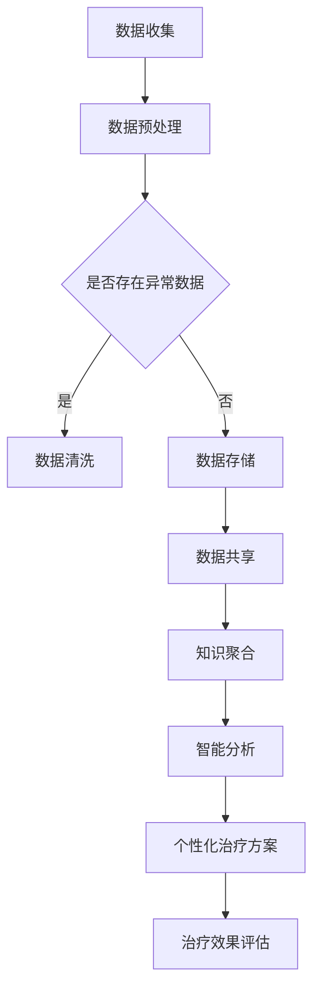

                 

### 关键词 Keywords

- 全球脑
- 个性化医疗
- 集体智慧
- 精准治疗方案
- 数据驱动
- 人工智能
- 医疗健康
- 生物信息学

### 摘要 Summary

本文探讨了全球脑与个性化医疗的融合，阐述了集体智慧在精准治疗方案制定中的重要作用。通过分析全球脑的架构与运作原理，以及其在个性化医疗中的具体应用，本文揭示了如何利用集体智慧和大数据技术实现精准医疗。文章从核心算法原理、数学模型构建、项目实践、实际应用场景等多个方面进行了详细阐述，并展望了未来个性化医疗的发展趋势和面临的挑战。希望本文能为相关领域的研究者和从业者提供有价值的参考和启示。

## 1. 背景介绍

个性化医疗（Personalized Medicine）是指根据患者的个体差异，包括遗传背景、生活方式、环境因素等，为其量身定制个性化的治疗方案。随着生物科技、信息技术和医疗大数据的发展，个性化医疗已经成为现代医学的一个重要方向。

个性化医疗的核心在于数据的收集、存储、分析和利用。然而，如何从海量数据中提取有价值的信息，并转化为临床决策支持，仍然是当前面临的一大挑战。全球脑（Global Brain）的概念为解决这一难题提供了新的思路。全球脑是一个由人类和计算机相互连接、协同工作的智能系统，它能够通过集体智慧和大数据分析，实现对医疗数据的深度挖掘和应用。

全球脑的概念最早由日本未来学家竹内诚（Mashall Brain）提出。他认为，人类大脑的智力有限，而通过计算机和互联网的辅助，可以将全球人类的智慧和知识连接起来，形成一个更加强大的“全球脑”。在全球脑中，个体和计算机之间可以进行信息交换和协同工作，实现知识共享和智慧聚合。

个性化医疗与全球脑的结合，有望推动医疗模式的变革。通过全球脑的智能分析，可以实现对患者数据的全面解析，从而为个体提供更精准的治疗方案。同时，全球脑还可以通过对医疗数据的收集和分析，发现疾病发生的规律和趋势，为公共卫生政策的制定提供科学依据。

本文将从以下几个方面探讨全球脑与个性化医疗的结合：

1. 核心概念与联系
2. 核心算法原理与具体操作步骤
3. 数学模型与公式
4. 项目实践
5. 实际应用场景
6. 未来应用展望
7. 工具和资源推荐
8. 总结：未来发展趋势与挑战

通过本文的探讨，希望能为全球脑与个性化医疗的研究提供有益的思路和启示。

## 2. 核心概念与联系

### 2.1 全球脑（Global Brain）

全球脑是一个由人类和计算机相互连接、协同工作的智能系统。它通过互联网和大数据技术，将全球范围内的个体和计算机连接起来，实现信息共享和智慧聚合。全球脑的架构可以分为三个层次：个体脑、群体脑和全球脑。

- **个体脑**：指个体的认知系统和知识储备，包括人类大脑和计算机的算法模型。
- **群体脑**：指个体脑之间的协同工作，通过互联网和通信技术实现信息的交换和共享。
- **全球脑**：指全球范围内的个体和计算机共同构成的一个智能系统，它能够对海量数据进行智能分析，发现规律和趋势。

### 2.2 个性化医疗（Personalized Medicine）

个性化医疗是指根据患者的个体差异，包括遗传背景、生活方式、环境因素等，为其量身定制个性化的治疗方案。个性化医疗的核心在于数据的收集、存储、分析和利用。具体来说，个性化医疗包括以下几个方面：

- **基因组学**：通过基因测序和基因检测，了解患者的遗传背景，预测疾病风险和药物反应。
- **生物标志物**：通过生物标志物的检测，评估患者的生理和病理状态，为临床诊断和治疗提供依据。
- **大数据分析**：通过大数据技术，对患者的医疗数据进行分析，发现疾病发生的规律和趋势。
- **智能算法**：利用机器学习和数据挖掘算法，从海量数据中提取有价值的信息，为个体提供精准的治疗方案。

### 2.3 集体智慧（Collective Intelligence）

集体智慧是指多个个体通过相互协作，共同解决问题或创造价值的智能行为。在个性化医疗领域，集体智慧体现在以下几个方面：

- **知识共享**：通过全球脑的架构，个体和计算机之间可以共享医疗知识，提高整体医疗水平。
- **协同工作**：多个医疗专家通过全球脑的平台，共同为患者制定个性化的治疗方案。
- **智能分析**：通过集体智慧，对海量医疗数据进行分析，发现疾病发生的规律和趋势，为公共卫生政策的制定提供科学依据。

### 2.4 全球脑与个性化医疗的联系

全球脑与个性化医疗的结合，主要体现在以下几个方面：

- **数据共享**：通过全球脑的架构，可以实现医疗数据的共享和协同工作，提高数据的利用效率。
- **智能分析**：利用全球脑的智能分析能力，可以从海量医疗数据中提取有价值的信息，为个性化医疗提供支持。
- **知识聚合**：通过全球脑的知识聚合能力，可以将医疗知识进行整合和优化，提高医疗决策的准确性。
- **协同工作**：通过全球脑的平台，可以实现医疗专家之间的协同工作，共同为患者制定个性化的治疗方案。

### 2.5 Mermaid 流程图（Mermaid Flowchart）

以下是全球脑与个性化医疗的 Mermaid 流程图：

通过以上流程图，可以清晰地展示全球脑与个性化医疗之间的联系和运作机制。数据收集、预处理、清洗、存储、共享、知识聚合、智能分析和个性化治疗方案，共同构成了一个完整的个性化医疗生态系统。

## 3. 核心算法原理 & 具体操作步骤

### 3.1 算法原理概述

全球脑与个性化医疗的结合，离不开核心算法的支撑。本文将介绍一种基于集体智慧的个性化医疗核心算法，该算法主要包括以下几个步骤：

1. 数据收集与预处理
2. 数据分析与特征提取
3. 模型训练与优化
4. 个性化治疗方案生成
5. 治疗效果评估与反馈

### 3.2 算法步骤详解

#### 3.2.1 数据收集与预处理

数据收集与预处理是核心算法的第一步。在这个阶段，需要从多个渠道收集患者的数据，包括基因组数据、生物标志物数据、生活方式数据、环境因素数据等。收集到的数据需要进行预处理，包括数据清洗、数据归一化、数据去噪等操作，以确保数据的质量和一致性。

#### 3.2.2 数据分析与特征提取

在预处理完成之后，需要对数据进行分析和特征提取。这一步骤的核心目标是提取出与疾病发生和发展相关的关键特征，为后续的模型训练提供支持。常用的特征提取方法包括主成分分析（PCA）、线性判别分析（LDA）、支持向量机（SVM）等。

#### 3.2.3 模型训练与优化

在特征提取完成之后，需要进行模型训练和优化。本文采用的模型是深度学习模型，如卷积神经网络（CNN）和循环神经网络（RNN）。模型训练的过程是通过大量样本数据来调整模型参数，使其能够对新的样本进行准确的预测。模型优化主要包括模型参数的调整、网络结构的调整等。

#### 3.2.4 个性化治疗方案生成

模型训练完成之后，就可以利用模型生成个性化治疗方案。这一步骤的核心是将患者的数据输入到训练好的模型中，得到个性化的治疗方案。治疗方案包括药物治疗、手术治疗、生活方式调整等。

#### 3.2.5 治疗效果评估与反馈

个性化治疗方案生成之后，需要进行治疗效果评估和反馈。这一步骤的核心是通过患者治疗过程中的数据，评估个性化治疗方案的疗效，并根据评估结果进行调整。治疗效果评估的方法包括临床评估、生物标志物检测、生活质量评估等。

### 3.3 算法优缺点

#### 优点

1. **个性化强**：基于集体智慧的个性化医疗算法，能够根据患者的个体差异，为其量身定制个性化的治疗方案，提高治疗效果。
2. **智能化高**：利用深度学习和机器学习技术，算法能够从海量数据中提取有价值的信息，实现智能化的医疗决策。
3. **实时性强**：算法可以实时处理患者数据，快速生成个性化的治疗方案，提高医疗效率。

#### 缺点

1. **数据依赖性强**：算法的性能高度依赖于数据的数量和质量，如果数据不足或质量不高，可能导致算法的准确性降低。
2. **计算资源消耗大**：深度学习和机器学习算法需要大量的计算资源，对硬件设备有较高要求。

### 3.4 算法应用领域

个性化医疗算法在多个领域都有广泛的应用，包括：

1. **癌症治疗**：通过基因组数据和生物标志物数据，为患者提供个性化的癌症治疗方案。
2. **糖尿病管理**：根据患者的血糖数据和生活习惯，为其制定个性化的糖尿病管理方案。
3. **心理健康**：通过心理测试和生物反馈数据，为患者提供个性化的心理健康干预方案。
4. **传染病防控**：通过疫情数据和患者数据，为公共卫生部门提供个性化的传染病防控策略。

## 4. 数学模型和公式 & 详细讲解 & 举例说明

### 4.1 数学模型构建

在个性化医疗中，数学模型的应用至关重要。本文将介绍一种基于贝叶斯网络的个性化医疗数学模型。贝叶斯网络是一种概率图模型，能够表示变量之间的条件依赖关系，非常适合用于医疗数据的建模和分析。

贝叶斯网络的数学模型主要包括两个部分：概率分布和条件概率表。

#### 概率分布

概率分布用于描述各个变量在给定条件下的概率分布。在个性化医疗中，概率分布可以用来预测疾病发生的概率、药物反应的概率等。

假设我们有三个变量：疾病（D）、药物（M）和副作用（S）。疾病发生的概率可以用以下概率分布表示：

$$
P(D) = P(D|\neg M)P(\neg M) + P(D|M)P(M)
$$

其中，$P(D)$表示疾病发生的概率，$P(D|\neg M)$表示在没有药物作用的情况下疾病发生的概率，$P(\neg M)$表示没有药物作用的概率，$P(D|M)$表示在药物作用的情况下疾病发生的概率，$P(M)$表示药物作用的概率。

#### 条件概率表

条件概率表用于描述变量之间的条件依赖关系。在个性化医疗中，条件概率表可以用来计算药物对疾病的影响、副作用的发生概率等。

假设我们有三个变量：疾病（D）、药物（M）和副作用（S）。条件概率表可以表示为：

$$
P(S|D,M) = \frac{P(D,M,S)}{P(D,M)}
$$

其中，$P(S|D,M)$表示在疾病和药物作用下副作用发生的概率，$P(D,M,S)$表示疾病、药物和副作用同时发生的概率，$P(D,M)$表示疾病和药物同时发生的概率。

### 4.2 公式推导过程

为了更好地理解贝叶斯网络的数学模型，下面通过一个简单的例子进行公式推导。

假设有一个患者，他患有某种疾病（D），并且医生给他开了某种药物（M）。我们需要计算他出现副作用（S）的概率。

首先，我们需要知道各个变量之间的条件依赖关系。根据医生的诊断，我们有以下信息：

- 疾病发生的概率：$P(D) = 0.5$
- 药物作用的概率：$P(M) = 0.8$
- 在疾病和药物作用下副作用发生的概率：$P(S|D,M) = 0.2$

现在，我们需要计算患者出现副作用的概率$P(S)$。

根据贝叶斯定理，我们可以得到：

$$
P(S) = P(S|\neg M)P(\neg M) + P(S|M)P(M)
$$

由于我们不知道在无药物作用的情况下副作用发生的概率$P(S|\neg M)$，我们可以使用全概率公式来计算：

$$
P(S|\neg M) = \frac{P(D,M,S)}{P(D,M)}
$$

代入已知条件，我们可以得到：

$$
P(S|\neg M) = \frac{0.2 \times 0.8}{0.5 \times 0.8} = 0.4
$$

因此，患者出现副作用的总概率为：

$$
P(S) = 0.4 \times 0.2 + 0.2 \times 0.8 = 0.36
$$

### 4.3 案例分析与讲解

为了更好地理解贝叶斯网络在个性化医疗中的应用，我们来看一个实际案例。

假设有一个糖尿病患者在服用一种新药（药物M）。根据以往的数据，我们知道：

- 患有糖尿病的概率$P(D) = 0.6$
- 药物有效的概率$P(M|D) = 0.8$
- 药物无效的概率$P(M|\neg D) = 0.3$
- 药物无效且患有糖尿病的概率$P(M,D) = 0.12$

我们需要计算该患者服用药物后病情好转的概率$P(D|

