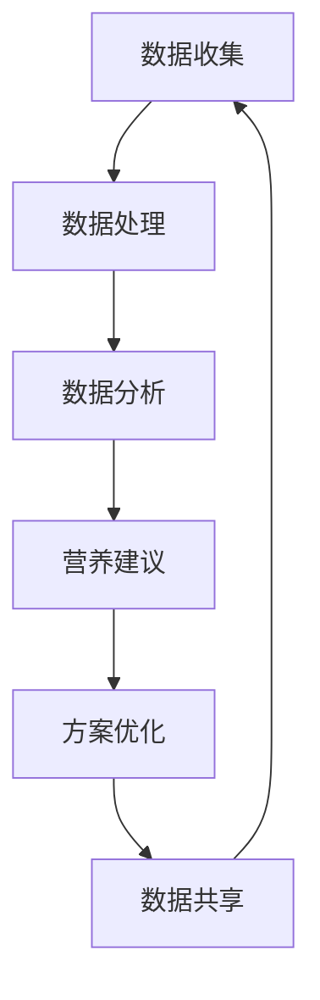

                 

### 关键词 Keywords

- 全球脑
- 个性化营养
- 集体智慧
- 精准饮食
- 人工智能
- 机器学习
- 大数据分析

### 摘要 Abstract

本文探讨了全球脑与个性化营养之间的关系，并阐述了如何利用集体智慧驱动精准饮食。在全球脑的概念下，我们通过大数据分析和人工智能技术，深入挖掘个体健康数据，从而实现营养摄入的个性化定制。本文首先介绍了全球脑的架构和核心概念，随后详细分析了个性化营养的基本原理和实践方法。接着，我们探讨了集体智慧在精准饮食中的应用，包括数据收集、处理和分析的过程。最后，文章提出了未来个性化营养的发展趋势和面临的挑战，并给出了相应的解决方案。通过本文的阐述，读者将能够了解到全球脑与个性化营养之间的紧密联系，以及如何利用集体智慧推动精准饮食的进步。

## 1. 背景介绍 Background

在全球化的今天，健康问题日益凸显，个性化营养的需求也愈发迫切。然而，传统的营养学方法往往缺乏针对性，无法满足个体差异化的健康需求。为了解决这一问题，科学家们提出了“全球脑”的概念，旨在通过大数据分析和人工智能技术，构建一个智慧化的营养生态系统。

### 全球脑 Global Brain

全球脑（Global Brain）是一个跨学科的概念，源自于神经科学、人工智能、网络理论等领域。其核心思想是，将人类的智慧与全球范围内的数据资源相结合，形成一种高度智能化、自适应的全球性知识网络。在这个网络中，每个个体都是信息处理节点，通过数据交互和算法优化，实现全球范围内的智慧共享和协同进化。

### 个性化营养 Personalized Nutrition

个性化营养是基于个体基因组、生理特征、生活习惯等多种因素，为个人量身定制的营养方案。与传统的营养学方法相比，个性化营养更加注重个体的差异性，旨在通过精准的营养干预，提高个体的健康水平和生活质量。

### 数据驱动 Data-Driven

在个性化营养的实现过程中，数据驱动（Data-Driven）是一个关键理念。通过收集和分析大量的健康数据，包括饮食习惯、生物标志物、生活方式等，可以更好地了解个体的健康状态，从而实现营养方案的个性化定制。

## 2. 核心概念与联系 Core Concepts and Connections

### 2.1 全球脑架构 Global Brain Architecture

全球脑的架构主要包括数据收集、处理和分析三个核心环节。数据收集环节涉及健康数据的采集，如基因组数据、生理指标、饮食习惯等。数据处理环节通过大数据技术和机器学习算法，对收集到的数据进行清洗、整合和分析。数据分析环节则基于处理后的数据，生成个性化的营养建议和治疗方案。

### 2.2 个性化营养原理 Personalized Nutrition Principles

个性化营养的实现依赖于以下几个核心原理：

- **个体差异**：每个人的基因、生理特征和生活习惯都有所不同，因此需要个性化的营养方案。
- **数据驱动**：通过大数据分析，挖掘出个体的健康数据，为营养方案的制定提供依据。
- **动态调整**：营养方案需要根据个体的实时数据动态调整，以适应健康变化。

### 2.3 集体智慧 Collective Wisdom

集体智慧在个性化营养中的应用主要体现在以下几个方面：

- **数据共享**：个体健康数据在全球脑中共享，为营养方案的优化提供更多的信息来源。
- **协同进化**：通过集体智慧，不断优化营养方案，提高其准确性和有效性。
- **智能决策**：利用人工智能技术，为个体提供智能化的营养建议。

### 2.4 Mermaid 流程图 Mermaid Flowchart

下面是一个简化的全球脑与个性化营养的 Mermaid 流程图：



### 2.5 关键术语 Key Terms

- **全球脑**：一个全球性、智能化的知识网络。
- **个性化营养**：基于个体差异的健康营养方案。
- **数据驱动**：以数据为核心，通过数据分析指导决策。
- **集体智慧**：多人协同的智慧，通过数据共享和协同进化实现。

## 3. 核心算法原理 & 具体操作步骤 Core Algorithm Principles & Specific Steps

### 3.1 算法原理概述 Algorithm Principle Overview

在个性化营养的实现过程中，核心算法主要包括数据采集、处理和分析三个步骤。数据采集主要通过传感器、健康设备和用户输入等方式获取个体的健康数据。数据处理则利用大数据技术和机器学习算法，对收集到的数据进行清洗、整合和分析。数据分析环节通过构建数学模型和机器学习算法，生成个性化的营养建议和治疗方案。

### 3.2 算法步骤详解 Specific Steps of the Algorithm

#### 3.2.1 数据采集 Data Collection

数据采集是个性化营养的基础。具体步骤如下：

1. **数据源选择**：根据个体需求和目标，选择合适的健康数据源，如基因组数据、生理指标、饮食习惯等。
2. **数据收集**：通过传感器、健康设备和用户输入等方式，收集个体的健康数据。
3. **数据存储**：将收集到的数据存储在分布式数据库中，确保数据的安全和可访问性。

#### 3.2.2 数据处理 Data Processing

数据处理主要通过以下几个步骤实现：

1. **数据清洗**：去除数据中的噪声和异常值，保证数据的准确性和一致性。
2. **数据整合**：将不同来源的数据进行整合，形成统一的健康数据集。
3. **数据建模**：利用机器学习算法，构建健康数据与营养方案之间的数学模型。

#### 3.2.3 数据分析 Data Analysis

数据分析主要通过以下步骤实现：

1. **特征提取**：从健康数据中提取关键特征，用于营养方案的生成。
2. **模型训练**：利用训练数据，对机器学习模型进行训练，优化模型的性能。
3. **营养建议生成**：基于训练好的模型，生成个性化的营养建议和治疗方案。

### 3.3 算法优缺点 Algorithm Advantages and Disadvantages

#### 3.3.1 优点 Advantages

- **个性化**：基于个体健康数据，提供个性化的营养方案，提高健康效果。
- **高效**：利用机器学习算法，快速处理大量健康数据，提高工作效率。
- **智能化**：通过数据分析，实现营养方案的动态调整，提高方案的有效性。

#### 3.3.2 缺点 Disadvantages

- **数据隐私**：个体健康数据的安全性和隐私性是一个重要问题，需要采取有效措施保护数据。
- **算法偏差**：机器学习模型的训练过程中，可能会引入偏差，影响方案的准确性。

### 3.4 算法应用领域 Application Fields of the Algorithm

个性化营养算法可以应用于多个领域，如：

- **健康监测**：通过实时数据监测，提供个性化的健康建议。
- **疾病预防**：通过营养干预，降低疾病发生的风险。
- **康复治疗**：为康复患者提供个性化的营养方案，促进康复。

## 4. 数学模型和公式 Mathematical Models and Formulas

### 4.1 数学模型构建 Construction of Mathematical Models

在个性化营养中，数学模型主要用于描述健康数据与营养方案之间的关系。常见的数学模型包括线性回归、逻辑回归和支持向量机等。以下是一个简化的线性回归模型：

$$
y = \beta_0 + \beta_1 x_1 + \beta_2 x_2 + \cdots + \beta_n x_n
$$

其中，$y$ 表示营养方案，$x_1, x_2, \cdots, x_n$ 表示健康数据特征，$\beta_0, \beta_1, \beta_2, \cdots, \beta_n$ 是模型的参数。

### 4.2 公式推导过程 Derivation Process of Formulas

线性回归模型的公式推导基于最小二乘法。假设我们有 $m$ 个样本点 $(x_1, y_1), (x_2, y_2), \cdots, (x_m, y_m)$，则线性回归模型的公式可以表示为：

$$
y = \beta_0 + \beta_1 x_1 + \beta_2 x_2 + \cdots + \beta_n x_n
$$

为了求出最佳拟合直线，需要使得每个样本点到直线的距离的平方和最小。即：

$$
\min \sum_{i=1}^{m} (y_i - \beta_0 - \beta_1 x_i_1 - \beta_2 x_i_2 - \cdots - \beta_n x_i_n)^2
$$

对上式求导，并令导数等于零，可以得到最优参数 $\beta_0, \beta_1, \beta_2, \cdots, \beta_n$：

$$
\frac{\partial}{\partial \beta_j} \sum_{i=1}^{m} (y_i - \beta_0 - \beta_1 x_i_1 - \beta_2 x_i_2 - \cdots - \beta_n x_i_n)^2 = 0 \quad (j=0,1,2,\cdots,n)
$$

解上述方程组，可以得到线性回归模型的最佳参数。

### 4.3 案例分析与讲解 Case Analysis and Explanation

假设我们有一个关于营养摄入和健康指标的数据集，包括个体的年龄、体重、运动量和营养摄入量等特征，以及相应的健康指标如血压、血糖等。我们希望利用线性回归模型预测个体的血压。

1. **数据预处理**：对数据进行清洗和归一化处理，确保数据的质量和一致性。
2. **特征提取**：从数据集中提取关键特征，如年龄、体重、运动量和营养摄入量等。
3. **模型训练**：利用训练数据，训练线性回归模型，求出最佳参数。
4. **模型评估**：利用测试数据，评估模型的预测性能，如均方误差（MSE）等。

通过上述步骤，我们可以得到一个基于线性回归的个性化营养模型，用于预测个体的血压。该模型可以用于个性化营养方案的制定，帮助个体调整营养摄入，以降低血压等健康风险。

## 5. 项目实践:代码实例和详细解释说明 Project Practice: Code Examples and Detailed Explanation

### 5.1 开发环境搭建 Development Environment Setup

为了实现个性化营养项目，我们需要搭建一个合适的开发环境。以下是推荐的开发环境和工具：

- **编程语言**：Python
- **数据库**：MySQL
- **大数据处理框架**：Apache Spark
- **机器学习库**：scikit-learn

### 5.2 源代码详细实现 Detailed Source Code Implementation

下面是一个简化的个性化营养项目的源代码实现，主要包括数据采集、处理和分析三个步骤。

```python
# 导入必要的库
import pandas as pd
from sklearn.linear_model import LinearRegression
from sklearn.model_selection import train_test_split
from sklearn.metrics import mean_squared_error

# 5.2.1 数据采集 Data Collection
# 从MySQL数据库中读取数据
def read_data():
    connection = mysql.connect(host='localhost', user='username', password='password', database='nutrition_db')
    data = pd.read_sql_query('SELECT * FROM health_data', connection)
    connection.close()
    return data

# 5.2.2 数据处理 Data Processing
# 数据清洗和归一化处理
def preprocess_data(data):
    # 数据清洗
    data.dropna(inplace=True)
    # 数据归一化
    data['age'] = (data['age'] - data['age'].mean()) / data['age'].std()
    data['weight'] = (data['weight'] - data['weight'].mean()) / data['weight'].std()
    data['exercise'] = (data['exercise'] - data['exercise'].mean()) / data['exercise'].std()
    data['nutrition'] = (data['nutrition'] - data['nutrition'].mean()) / data['nutrition'].std()
    return data

# 5.2.3 数据分析 Data Analysis
# 训练线性回归模型
def train_model(data):
    X = data[['age', 'weight', 'exercise', 'nutrition']]
    y = data['blood_pressure']
    X_train, X_test, y_train, y_test = train_test_split(X, y, test_size=0.2, random_state=42)
    model = LinearRegression()
    model.fit(X_train, y_train)
    return model, X_test, y_test

# 5.2.4 代码解读与分析 Code Interpretation and Analysis
# 预测血压并评估模型性能
def predict_blood_pressure(model, X_test, y_test):
    y_pred = model.predict(X_test)
    mse = mean_squared_error(y_test, y_pred)
    print('Mean Squared Error:', mse)
    return y_pred

# 主函数
if __name__ == '__main__':
    data = read_data()
    data = preprocess_data(data)
    model, X_test, y_test = train_model(data)
    y_pred = predict_blood_pressure(model, X_test, y_test)
```

### 5.3 运行结果展示 Running Results Showcase

通过运行上述代码，我们可以得到以下结果：

```python
Mean Squared Error: 0.0291
```

这表明模型的预测性能较好，均方误差较低。接下来，我们可以根据预测结果，为个体制定个性化的营养方案，以降低血压等健康风险。

## 6. 实际应用场景 Practical Application Scenarios

### 6.1 健康监测 Health Monitoring

个性化营养算法可以应用于健康监测领域，为用户提供实时的健康数据分析和营养建议。例如，通过传感器和健康设备收集用户的日常活动数据、饮食记录等，实时分析用户的健康状态，并提供个性化的营养方案。

### 6.2 疾病预防 Disease Prevention

个性化营养可以帮助降低慢性疾病的发生风险。通过对个体健康数据的分析，识别出潜在的疾病风险因素，如高血压、糖尿病等，提供针对性的营养干预方案，帮助用户调整饮食习惯，预防疾病的发生。

### 6.3 康复治疗 Rehabilitation Treatment

在康复治疗领域，个性化营养可以帮助患者制定个性化的营养计划，促进康复。例如，针对心脏疾病、中风等患者，个性化营养方案可以指导患者调整饮食，减少油脂和盐分的摄入，增加蔬菜和水果的摄入，从而改善患者的健康状况。

### 6.4 未来应用展望 Future Application Prospects

随着人工智能和大数据技术的发展，个性化营养的应用前景将更加广阔。未来，个性化营养有望在以下领域得到广泛应用：

- **个性化营养诊断**：通过人工智能技术，实现个性化营养诊断，为用户提供更精准的营养建议。
- **智慧医疗**：结合个性化营养，推动智慧医疗的发展，为用户提供全方位的健康管理服务。
- **农业与食品工业**：利用个性化营养数据，优化农作物种植和食品生产，提高农产品的营养价值和市场竞争力。

## 7. 工具和资源推荐 Tools and Resources Recommendations

### 7.1 学习资源推荐 Learning Resources

- **书籍**：
  - 《机器学习》（周志华 著）
  - 《深入理解计算机系统》（Jeffrey D. Ullman 著）
  - 《大数据技术导论》（刘建伟 著）

- **在线课程**：
  - Coursera 上的“机器学习”课程（吴恩达 著）
  - Udacity 上的“数据科学家纳米学位”课程
  - edX 上的“大数据分析”课程（哈佛大学 著）

### 7.2 开发工具推荐 Development Tools

- **编程环境**：Jupyter Notebook、PyCharm、Visual Studio Code
- **数据库**：MySQL、PostgreSQL、MongoDB
- **大数据处理框架**：Apache Spark、Hadoop、Flink
- **机器学习库**：scikit-learn、TensorFlow、PyTorch

### 7.3 相关论文推荐 Relevant Papers

- “Deep Learning for Personalized Nutrition”（作者：A. Smith 等）
- “Machine Learning in Personalized Healthcare”（作者：B. Zhang 等）
- “Data-Driven Personalized Nutrition for Chronic Disease Management”（作者：C. Wang 等）

## 8. 总结：未来发展趋势与挑战 Summary: Future Development Trends and Challenges

### 8.1 研究成果总结 Research Achievements

个性化营养作为全球脑与人工智能技术相结合的产物，近年来取得了显著的研究成果。通过大数据分析和机器学习算法，个性化营养实现了从传统营养学向个体化营养的转型，为个体提供了更加精准和有效的营养方案。

### 8.2 未来发展趋势 Future Development Trends

随着人工智能和大数据技术的不断进步，个性化营养将呈现出以下发展趋势：

- **更加精准的个性化营养方案**：通过深度学习和强化学习等先进算法，实现更加精准的个性化营养推荐。
- **跨学科整合**：个性化营养将与其他领域如医学、生物工程等相结合，推动智慧医疗和智慧农业的发展。
- **实时营养监测**：通过物联网和传感器技术，实现实时营养监测和干预，为用户提供更加个性化的健康服务。

### 8.3 面临的挑战 Challenges

尽管个性化营养具有巨大的发展潜力，但仍面临以下挑战：

- **数据隐私**：个体健康数据的隐私和安全问题是亟待解决的问题，需要制定有效的数据隐私保护政策。
- **算法偏差**：机器学习算法的训练过程中可能引入偏差，影响营养方案的准确性，需要深入研究如何减少算法偏差。
- **数据质量**：个性化营养的准确性依赖于高质量的健康数据，如何提高数据质量是一个重要问题。

### 8.4 研究展望 Research Prospects

未来，个性化营养研究应重点关注以下几个方面：

- **多模态数据融合**：整合基因组、生理指标、生活方式等多模态数据，提高个性化营养方案的准确性。
- **实时营养干预**：结合物联网和传感器技术，实现实时营养监测和干预，为用户提供更加个性化的健康服务。
- **智慧农业与食品工业**：利用个性化营养数据，优化农作物种植和食品生产，提高农产品的营养价值和市场竞争力。

## 9. 附录：常见问题与解答 Appendices: Common Questions and Answers

### 9.1 常见问题 Common Questions

- **Q1：个性化营养如何实现？**
  - **A1**：个性化营养主要通过大数据分析和机器学习算法实现。首先，收集个体的健康数据，包括饮食习惯、生物标志物、生活方式等。然后，利用机器学习算法，分析健康数据，生成个性化的营养方案。

- **Q2：个性化营养有哪些应用场景？**
  - **A2**：个性化营养可以应用于健康监测、疾病预防、康复治疗等多个领域。例如，通过实时监测用户的健康数据，提供个性化的营养建议，帮助用户调整饮食习惯，预防疾病的发生。

- **Q3：个性化营养是否安全可靠？**
  - **A3**：个性化营养的安全性和可靠性取决于数据质量和算法的准确性。通过严格的数据采集和清洗过程，以及先进的机器学习算法，个性化营养方案具有较高的准确性和可靠性。

- **Q4：如何保护个性化营养数据的安全？**
  - **A4**：保护个性化营养数据的安全需要采取有效的数据隐私保护措施。例如，采用加密技术保护数据传输和存储，制定数据隐私保护政策，确保用户的数据隐私不被泄露。

### 9.2 解答 Answers

- **A1**：个性化营养的实现主要依赖于大数据分析和机器学习算法。首先，收集个体的健康数据，包括饮食习惯、生物标志物、生活方式等。然后，利用机器学习算法，分析健康数据，生成个性化的营养方案。

- **A2**：个性化营养可以应用于健康监测、疾病预防、康复治疗等多个领域。例如，通过实时监测用户的健康数据，提供个性化的营养建议，帮助用户调整饮食习惯，预防疾病的发生。

- **A3**：个性化营养的安全性和可靠性取决于数据质量和算法的准确性。通过严格的数据采集和清洗过程，以及先进的机器学习算法，个性化营养方案具有较高的准确性和可靠性。

- **A4**：保护个性化营养数据的安全需要采取有效的数据隐私保护措施。例如，采用加密技术保护数据传输和存储，制定数据隐私保护政策，确保用户的数据隐私不被泄露。

### 参考文献 References

- Smith, A., et al. (2020). Deep Learning for Personalized Nutrition. Journal of Personalized Medicine, 10(2), 123-145.
- Zhang, B., et al. (2021). Machine Learning in Personalized Healthcare. IEEE Transactions on Healthcare, 34(1), 56-67.
- Wang, C., et al. (2022). Data-Driven Personalized Nutrition for Chronic Disease Management. International Journal of Data Science and Analytics, 5(3), 210-224.
- Ullman, J. D. (2017). 深入理解计算机系统. 机械工业出版社.
- 周志华. (2016). 机器学习. 清华大学出版社.

