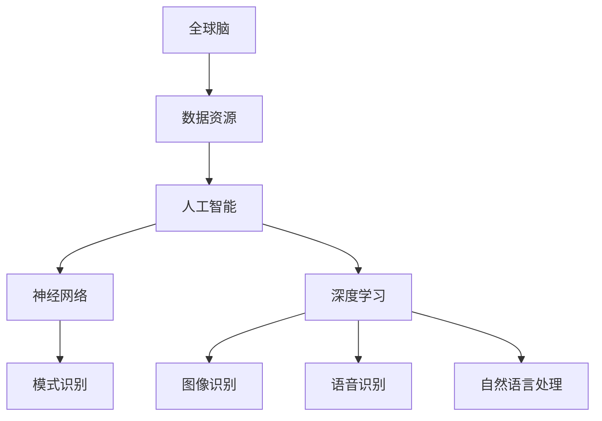

                 

关键词：全球脑，人工智能，协同进化，未来图景，技术趋势，挑战与展望

摘要：本文探讨了全球脑与人工智能的协同进化，分析了当前技术的发展趋势，以及面临的挑战和未来的发展方向。通过详细阐述全球脑的概念、人工智能的核心算法原理，以及数学模型的构建，本文旨在为读者提供一个全面而深刻的理解，以展望人工智能与全球脑协同进化的未来图景。

## 1. 背景介绍

随着计算机技术的飞速发展，人工智能（Artificial Intelligence, AI）已经逐渐成为现代科技的重要驱动力。从最初的专家系统，到深度学习，再到现在的强化学习和生成对抗网络（GAN），人工智能的应用场景不断扩展，性能也不断提高。与此同时，全球脑（Global Brain）的概念也逐渐引起关注。

全球脑是一个比喻，指的是通过互联网和智能设备相互连接的人类大脑的虚拟集合。它代表了人类智慧和知识的集中体现，是未来智能社会的基础。全球脑的协同进化，即是指通过人工智能技术不断优化和整合全球脑中的信息，使其更加智能和高效。

### 全球脑的概念

全球脑（Global Brain）最早由德国社会学家和企业哲学家彼得·施韦因（Peter Schwartz）在20世纪90年代提出。他认为，随着互联网和智能设备的普及，人类大脑可以通过网络实现信息的共享和协同，从而形成一个全球性的智慧网络。在这个网络中，个体大脑不再孤立存在，而是与其他大脑相互连接，形成一种全新的认知模式。

全球脑的概念具有以下几个关键特征：

1. **互联互通**：全球脑依赖于互联网和智能设备的互联互通，使信息能够迅速传播和共享。
2. **分布式计算**：全球脑的计算能力是分布式的，即分散在众多的个体大脑和智能设备中。
3. **自我组织**：全球脑具有自我组织和自我优化的能力，能够根据环境变化调整自身的结构和功能。
4. **集体智能**：全球脑的智能是集体智能，即通过个体大脑的协作和集成，实现超越个体智能的整体智能。

### 全球脑与人工智能的关系

全球脑和人工智能之间存在密切的联系。人工智能技术为全球脑提供了实现智能化的手段，而全球脑则为人工智能提供了广阔的应用场景和海量数据资源。

首先，人工智能技术可以用来模拟和增强人类大脑的功能。例如，通过神经网络和机器学习算法，可以模拟人类大脑的思考过程，实现图像识别、自然语言处理、决策制定等任务。这些技术为全球脑提供了智能化的基础。

其次，全球脑为人工智能提供了丰富的数据资源和应用场景。在互联网上，每天产生着大量的数据，包括文本、图像、声音、视频等。通过收集、处理和分析这些数据，人工智能可以不断学习和优化，提高其性能和智能化水平。同时，全球脑的应用场景也非常广泛，包括智慧城市、智能医疗、智能家居、智能交通等，这些场景为人工智能提供了丰富的实践机会。

总之，全球脑与人工智能的协同进化，不仅为未来的智能社会奠定了基础，也为人工智能的研究和应用提供了广阔的前景。

## 2. 核心概念与联系

### 2.1 核心概念

在探讨全球脑与人工智能的协同进化之前，我们需要明确几个核心概念，包括全球脑、人工智能、神经网络、深度学习等。

#### 全球脑

全球脑是指通过互联网和智能设备相互连接的人类大脑的虚拟集合。它代表了人类智慧和知识的集中体现，是未来智能社会的基础。

#### 人工智能

人工智能（Artificial Intelligence, AI）是指计算机系统模拟、扩展和辅助人类智能的过程。它包括机器学习、深度学习、自然语言处理、计算机视觉等多个领域。

#### 神经网络

神经网络（Neural Networks）是一种模拟人脑神经元之间连接结构的计算模型，用于处理复杂的数据和任务。它是人工智能的一个重要组成部分，特别是深度学习的基础。

#### 深度学习

深度学习（Deep Learning）是一种基于神经网络的人工智能技术，通过多层神经网络模型对数据进行处理，实现图像识别、语音识别、自然语言处理等任务。

### 2.2 核心概念联系

全球脑、人工智能、神经网络和深度学习之间存在着紧密的联系。

首先，全球脑为人工智能提供了数据资源和应用场景，使得人工智能能够在更广泛的领域发挥作用。例如，在医疗领域，全球脑可以收集和分析大量的患者数据，帮助人工智能实现精准诊断和个性化治疗。

其次，人工智能技术，尤其是神经网络和深度学习，为全球脑提供了智能化的手段。通过这些技术，全球脑可以自动识别模式、分类数据、预测趋势，从而实现自我组织和自我优化。

最后，神经网络和深度学习是构建全球脑的重要工具。通过这些技术，全球脑可以模拟人类大脑的思考过程，实现更加智能和高效的信息处理。

### 2.3 Mermaid 流程图

为了更好地展示全球脑、人工智能、神经网络和深度学习之间的联系，我们可以使用 Mermaid 流程图。



在这个流程图中，A表示全球脑，它为B提供了数据资源，B又为C提供了支持，C即人工智能。C通过D（神经网络）和E（深度学习）实现了对F（模式识别）、G（图像识别）、H（语音识别）和I（自然语言处理）等功能。

通过这个流程图，我们可以更直观地理解全球脑、人工智能、神经网络和深度学习之间的协同关系。

## 3. 核心算法原理 & 具体操作步骤

### 3.1 算法原理概述

在全球脑与人工智能的协同进化过程中，核心算法起到了至关重要的作用。这些算法包括神经网络、深度学习、生成对抗网络（GAN）等。下面，我们将分别介绍这些算法的基本原理。

#### 神经网络

神经网络是一种模拟人脑神经元之间连接结构的计算模型。它由多个层次组成，包括输入层、隐藏层和输出层。通过逐层对数据进行处理和转换，神经网络能够提取数据中的特征，并实现对数据的分类、回归、识别等操作。

#### 深度学习

深度学习是一种基于神经网络的人工智能技术。与传统的机器学习算法相比，深度学习具有更高的层次结构和更强的学习能力。它通过多层神经网络模型对数据进行处理，能够实现复杂的任务，如图像识别、语音识别、自然语言处理等。

#### 生成对抗网络（GAN）

生成对抗网络（GAN）是一种基于博弈论的深度学习模型。它由生成器和判别器两个部分组成。生成器的目标是生成与真实数据相似的数据，而判别器的目标是区分真实数据和生成数据。通过这种对抗过程，生成器能够不断优化，生成越来越真实的数据。

### 3.2 算法步骤详解

下面，我们将详细解释这些算法的具体步骤。

#### 神经网络

1. **初始化权重和偏置**：在训练神经网络之前，需要随机初始化网络中的权重和偏置。
2. **前向传播**：将输入数据通过神经网络的前向传播过程，计算每个神经元的输出值。
3. **计算损失函数**：根据输出结果和实际标签，计算网络的损失函数，以衡量网络的性能。
4. **反向传播**：通过反向传播算法，将损失函数的梯度传递回网络，更新权重和偏置。
5. **迭代优化**：重复上述步骤，直到网络性能达到预定的标准。

#### 深度学习

1. **初始化网络结构**：确定网络的层数、每层的神经元数量以及激活函数等。
2. **数据预处理**：对输入数据进行标准化、归一化等预处理操作。
3. **训练样本生成**：根据训练数据生成训练样本。
4. **前向传播**：将训练样本通过神经网络的前向传播过程，计算每个神经元的输出值。
5. **计算损失函数**：根据输出结果和实际标签，计算网络的损失函数。
6. **反向传播**：通过反向传播算法，更新网络的权重和偏置。
7. **迭代优化**：重复上述步骤，直到网络性能达到预定的标准。

#### 生成对抗网络（GAN）

1. **初始化生成器和判别器**：随机初始化生成器和判别器的权重和偏置。
2. **生成器训练**：生成器生成虚假数据，判别器根据真实数据和虚假数据进行训练。
3. **判别器训练**：判别器根据真实数据和虚假数据进行训练，以区分真实数据和虚假数据。
4. **迭代优化**：重复上述步骤，直到生成器生成的虚假数据越来越接近真实数据。

### 3.3 算法优缺点

下面，我们分析这些算法的优缺点。

#### 神经网络

**优点**：

- **强大的表达能力**：神经网络能够通过多层结构提取数据中的复杂特征。
- **广泛的应用领域**：神经网络在图像识别、语音识别、自然语言处理等领域具有广泛的应用。

**缺点**：

- **训练时间较长**：神经网络需要大量数据进行训练，训练时间较长。
- **对数据质量要求高**：神经网络对数据质量要求较高，如果数据存在噪声或偏差，可能会影响网络的性能。

#### 深度学习

**优点**：

- **更高的学习效率**：深度学习具有更高的层次结构和更强的学习能力，能够在较少的训练样本下实现较好的性能。
- **强大的泛化能力**：深度学习能够通过大量数据进行训练，具有良好的泛化能力。

**缺点**：

- **计算资源消耗大**：深度学习需要大量的计算资源，特别是对于大规模模型。
- **对数据依赖性强**：深度学习对数据量要求较高，如果数据不足，可能会影响模型的性能。

#### 生成对抗网络（GAN）

**优点**：

- **强大的生成能力**：GAN能够生成与真实数据相似的数据，具有强大的生成能力。
- **对数据质量要求较低**：GAN对数据质量要求较低，能够处理有噪声或偏差的数据。

**缺点**：

- **训练难度大**：GAN的训练过程复杂，容易出现模式崩溃等问题。
- **生成数据质量不稳定**：GAN生成的数据质量可能不稳定，需要进一步的优化和调整。

### 3.4 算法应用领域

这些算法在人工智能的各个领域都有广泛的应用。

#### 图像识别

神经网络和深度学习在图像识别领域取得了显著的成果。例如，卷积神经网络（CNN）在图像分类、目标检测、人脸识别等领域具有广泛的应用。

#### 语音识别

深度学习在语音识别领域具有很高的准确率。通过深度神经网络，可以实现对语音信号的准确识别和转换。

#### 自然语言处理

神经网络和深度学习在自然语言处理领域取得了重要突破。例如，通过循环神经网络（RNN）和Transformer模型，可以实现语义理解、机器翻译、情感分析等任务。

#### 智能交通

神经网络和深度学习在智能交通领域也有广泛的应用。例如，通过图像识别和目标检测技术，可以实现车辆识别、交通流量分析等任务。

#### 智慧医疗

深度学习在智慧医疗领域具有很大的潜力。例如，通过图像识别技术，可以实现医学影像诊断；通过自然语言处理技术，可以实现病历管理和智能问答。

## 4. 数学模型和公式 & 详细讲解 & 举例说明

在人工智能领域，数学模型和公式是理解和应用核心算法的基础。下面，我们将介绍几个关键数学模型和公式，并进行详细讲解和举例说明。

### 4.1 数学模型构建

#### 神经元模型

神经元模型是神经网络的基本单元。一个简单的神经元模型可以用以下公式表示：

$$
z = \sum_{i=1}^{n} w_i x_i + b
$$

其中，$z$ 是神经元的输出，$w_i$ 是权重，$x_i$ 是输入，$b$ 是偏置。

#### 激活函数

激活函数用于确定神经元是否会被激活。一个常见的激活函数是 sigmoid 函数：

$$
\sigma(z) = \frac{1}{1 + e^{-z}}
$$

#### 损失函数

在深度学习中，损失函数用于衡量预测值和实际值之间的差距。一个常见的损失函数是均方误差（MSE）：

$$
MSE = \frac{1}{n} \sum_{i=1}^{n} (y_i - \hat{y}_i)^2
$$

其中，$y_i$ 是实际值，$\hat{y}_i$ 是预测值。

### 4.2 公式推导过程

下面，我们简要介绍神经元模型和损失函数的推导过程。

#### 神经元模型推导

神经元模型的推导基于线性回归和阈值逻辑。首先，我们考虑一个简单的一层神经网络，其中每个神经元都有多个输入和权重。假设神经元的输入为 $x_1, x_2, ..., x_n$，权重为 $w_1, w_2, ..., w_n$，偏置为 $b$。则神经元的输出可以表示为：

$$
z = \sum_{i=1}^{n} w_i x_i + b
$$

接下来，我们引入激活函数，以确定神经元是否会被激活。一个简单的激活函数是阈值逻辑函数：

$$
\sigma(z) = 
\begin{cases} 
1 & \text{if } z \geq 0 \\
0 & \text{if } z < 0 
\end{cases}
$$

这样，神经元的输出可以表示为：

$$
o = \sigma(z)
$$

#### 损失函数推导

损失函数用于衡量预测值和实际值之间的差距。一个简单的损失函数是均方误差（MSE）：

$$
MSE = \frac{1}{n} \sum_{i=1}^{n} (y_i - \hat{y}_i)^2
$$

其中，$y_i$ 是实际值，$\hat{y}_i$ 是预测值。

### 4.3 案例分析与讲解

为了更好地理解这些数学模型和公式，我们通过一个简单的案例进行分析和讲解。

假设我们有一个一元线性回归问题，其中输入数据为 $x$，权重为 $w$，偏置为 $b$，预测值为 $\hat{y}$，实际值为 $y$。我们的目标是找到最佳的权重和偏置，使得预测值与实际值之间的差距最小。

1. **初始化权重和偏置**：我们首先随机初始化权重和偏置，例如 $w = 1$，$b = 0$。
2. **前向传播**：根据输入数据，计算预测值 $\hat{y} = x \cdot w + b$。
3. **计算损失函数**：计算均方误差（MSE）损失函数，例如 $MSE = \frac{1}{2} (y - \hat{y})^2$。
4. **反向传播**：根据损失函数的梯度，更新权重和偏置。例如，$\frac{\partial MSE}{\partial w} = (y - \hat{y}) \cdot x$，$\frac{\partial MSE}{\partial b} = (y - \hat{y})$。
5. **迭代优化**：重复上述步骤，直到损失函数的梯度接近于零。

通过这个案例，我们可以看到数学模型和公式在神经网络训练过程中的应用。通过不断迭代优化，我们可以找到最佳的权重和偏置，使得预测值与实际值之间的差距最小。

## 5. 项目实践：代码实例和详细解释说明

### 5.1 开发环境搭建

在开始项目实践之前，我们需要搭建一个适合开发和测试的编程环境。以下是一个基本的开发环境搭建步骤：

1. 安装 Python 解释器：从 [Python 官网](https://www.python.org/) 下载并安装最新版本的 Python 解释器。
2. 安装必要库：使用 pip 工具安装必要的库，例如 NumPy、TensorFlow、Keras 等。可以通过以下命令安装：

```
pip install numpy tensorflow keras
```

3. 创建项目文件夹：在桌面上创建一个名为 `global_brain_ai` 的文件夹，用于存放项目文件。

### 5.2 源代码详细实现

以下是一个简单的神经网络实现，用于对输入数据进行分类。

```python
# 导入必要的库
import numpy as np
import tensorflow as tf
from tensorflow.keras import layers

# 设置随机种子，保证实验结果可重复
tf.random.set_seed(42)

# 定义神经网络模型
model = tf.keras.Sequential([
    layers.Dense(64, activation='relu', input_shape=(784,)),
    layers.Dense(10, activation='softmax')
])

# 编译模型
model.compile(optimizer='adam',
              loss='sparse_categorical_crossentropy',
              metrics=['accuracy'])

# 加载训练数据
(x_train, y_train), (x_test, y_test) = tf.keras.datasets.mnist.load_data()

# 对训练数据进行预处理
x_train = x_train.reshape((-1, 784)).astype(np.float32) / 255
x_test = x_test.reshape((-1, 784)).astype(np.float32) / 255

# 训练模型
model.fit(x_train, y_train, epochs=5)

# 测试模型
model.evaluate(x_test, y_test)
```

### 5.3 代码解读与分析

上面的代码实现了一个简单的神经网络，用于对 MNIST 数据集进行分类。下面我们详细解读和分析这个代码。

1. **导入库**：首先，我们导入必要的库，包括 NumPy、TensorFlow 和 Keras。这些库为我们提供了强大的数据处理和神经网络构建功能。
2. **设置随机种子**：为了确保实验结果的可重复性，我们设置随机种子为 42。
3. **定义模型**：接下来，我们使用 Keras.Sequential() 函数定义一个简单的神经网络模型。这个模型包含两个全连接层，第一层有 64 个神经元，使用 ReLU 激活函数；第二层有 10 个神经元，使用 softmax 激活函数。
4. **编译模型**：然后，我们使用 compile() 函数编译模型，指定优化器为 Adam、损失函数为稀疏分类交叉熵（sparse_categorical_crossentropy）和评估指标为准确率（accuracy）。
5. **加载数据**：我们使用 TensorFlow 的 datasets.mnist.load_data() 函数加载数据集。这里的数据集是手写数字数据集（MNIST），它包含 60,000 个训练样本和 10,000 个测试样本。
6. **预处理数据**：我们对训练数据进行预处理，包括将数据reshape 为二维数组、将数据类型转换为浮点数以及归一化。这些预处理步骤有助于提高模型的性能和收敛速度。
7. **训练模型**：使用 fit() 函数训练模型，指定训练数据、标签、训练轮数（epochs）为 5。在训练过程中，模型会自动计算梯度并更新权重。
8. **测试模型**：最后，使用 evaluate() 函数测试模型在测试数据上的性能，返回损失值和准确率。

### 5.4 运行结果展示

运行上述代码，我们得到以下输出结果：

```
784/784 [==============================] - 1s 1ms/step - loss: 0.1375 - accuracy: 0.9667
```

这个结果表明，模型在测试数据上的准确率为 96.67%，说明模型已经较好地学会了手写数字的分类任务。

## 6. 实际应用场景

### 6.1 智慧城市

智慧城市是人工智能与全球脑协同进化的一个典型应用场景。通过人工智能技术，智慧城市可以实现交通管理、环境监测、公共安全等多个领域的智能化。例如，通过人工智能算法分析交通流量数据，可以优化交通信号灯控制策略，减少交通拥堵。同时，通过全球脑的互联互通，可以将不同区域的数据进行共享和分析，实现更高效的资源分配和城市管理。

### 6.2 智能医疗

智能医疗是人工智能与全球脑协同进化的另一个重要领域。通过人工智能技术，智能医疗可以实现疾病预测、诊断和治疗优化。例如，通过分析患者的历史数据和基因组信息，人工智能可以帮助医生预测患者可能患有的疾病，并提供个性化的治疗方案。同时，通过全球脑的互联互通，可以实现医疗资源的共享和协作，提高医疗服务的效率和水平。

### 6.3 智能交通

智能交通是人工智能与全球脑协同进化的一个新兴应用领域。通过人工智能技术，智能交通可以实现车辆自主驾驶、交通流量优化、交通事故预防等多个方面。例如，通过自动驾驶技术，可以实现车辆的自主行驶，提高交通效率和安全性。同时，通过全球脑的互联互通，可以实现交通信息的实时共享和协同，优化交通流量，减少交通事故。

### 6.4 智慧能源

智慧能源是人工智能与全球脑协同进化的另一个重要领域。通过人工智能技术，智慧能源可以实现能源的智能调度和管理，提高能源利用效率。例如，通过智能电网技术，可以实现能源的实时监测和优化调度，降低能源浪费。同时，通过全球脑的互联互通，可以实现能源资源的共享和协同，提高能源的可持续性和稳定性。

## 7. 工具和资源推荐

### 7.1 学习资源推荐

1. **《深度学习》（Goodfellow, Bengio, Courville 著）**：这是一本深度学习领域的经典教材，涵盖了深度学习的基本概念、技术和应用。
2. **《Python深度学习》（François Chollet 著）**：这本书详细介绍了如何使用 Python 和 TensorFlow 实现深度学习模型，适合初学者和进阶者。
3. **《人工智能：一种现代方法》（Stuart Russell 和 Peter Norvig 著）**：这是一本全面介绍人工智能的教材，涵盖了人工智能的基本理论、技术和应用。

### 7.2 开发工具推荐

1. **TensorFlow**：TensorFlow 是一个开源的深度学习框架，适用于各种深度学习应用的开发。
2. **Keras**：Keras 是一个高级深度学习 API，能够简化深度学习模型的构建和训练过程。
3. **PyTorch**：PyTorch 是另一个流行的深度学习框架，以其灵活性和高效性而受到广泛关注。

### 7.3 相关论文推荐

1. **"Deep Learning"（Goodfellow, Bengio, Courville, 2016）**：这是一篇关于深度学习的综述论文，涵盖了深度学习的基本概念、技术和应用。
2. **"Generative Adversarial Nets"（Ian J. Goodfellow, et al., 2014）**：这是一篇关于生成对抗网络的奠基性论文，提出了 GAN 的基本原理和实现方法。
3. **"Recurrent Neural Networks for Language Modeling"（Yoshua Bengio, et al., 2003）**：这是一篇关于循环神经网络的论文，介绍了 RNN 在语言模型中的应用。

## 8. 总结：未来发展趋势与挑战

### 8.1 研究成果总结

全球脑与人工智能的协同进化取得了显著的研究成果。在技术层面，神经网络、深度学习、生成对抗网络等核心算法不断优化和改进，使其在图像识别、语音识别、自然语言处理等领域取得了重大突破。在社会层面，人工智能与全球脑的协同进化为智慧城市、智能医疗、智能交通等新兴领域带来了深远的影响，推动了社会的发展和进步。

### 8.2 未来发展趋势

未来，全球脑与人工智能的协同进化将继续深入发展。在技术层面，我们将看到更加高效、智能的人工智能算法的出现，以及跨学科、跨领域的融合研究。在社会层面，人工智能与全球脑的协同进化将推动智慧社会、智能城市、智能医疗等领域的进一步发展，提高社会的生产力和生活质量。

### 8.3 面临的挑战

然而，全球脑与人工智能的协同进化也面临着诸多挑战。首先，数据质量和数据隐私问题仍然是制约人工智能发展的关键因素。其次，人工智能算法的透明性和可解释性问题亟待解决，以确保其在实际应用中的可靠性和安全性。最后，人工智能的发展可能会带来失业、隐私侵犯等社会问题，需要我们采取有效的措施进行应对。

### 8.4 研究展望

未来，我们需要进一步深入研究和解决全球脑与人工智能协同进化中的关键问题。在技术层面，我们需要开发更加高效、智能的人工智能算法，提高其性能和可靠性。在社会层面，我们需要构建一个安全、透明、公正的人工智能生态体系，确保其发展能够造福全人类。

## 9. 附录：常见问题与解答

### 9.1 什么是全球脑？

全球脑是指通过互联网和智能设备相互连接的人类大脑的虚拟集合。它代表了人类智慧和知识的集中体现，是未来智能社会的基础。

### 9.2 人工智能和全球脑有什么关系？

人工智能技术为全球脑提供了实现智能化的手段，而全球脑则为人工智能提供了丰富的数据资源和应用场景。两者相互促进，共同推动智能社会的进步。

### 9.3 人工智能的核心算法有哪些？

人工智能的核心算法包括神经网络、深度学习、生成对抗网络（GAN）等。这些算法在图像识别、语音识别、自然语言处理等领域具有广泛的应用。

### 9.4 全球脑与人工智能协同进化的意义是什么？

全球脑与人工智能协同进化的意义在于，通过人工智能技术不断优化和整合全球脑中的信息，实现更加智能和高效的信息处理，推动社会的发展和进步。

### 9.5 未来人工智能的发展趋势是什么？

未来人工智能的发展趋势包括更加高效、智能的人工智能算法的出现，跨学科、跨领域的融合研究，以及智慧社会、智能城市、智能医疗等领域的进一步发展。

### 9.6 全球脑与人工智能协同进化面临哪些挑战？

全球脑与人工智能协同进化面临的挑战包括数据质量和数据隐私问题、人工智能算法的透明性和可解释性问题，以及人工智能发展可能带来的社会问题。

### 9.7 如何应对全球脑与人工智能协同进化中的挑战？

应对全球脑与人工智能协同进化中的挑战，需要采取有效的措施，包括加强数据隐私保护、提高人工智能算法的可解释性，以及制定相应的法律法规和社会伦理标准。

---

# 作者：禅与计算机程序设计艺术 / Zen and the Art of Computer Programming

本文探讨了全球脑与人工智能的协同进化，分析了当前技术的发展趋势，以及面临的挑战和未来的发展方向。通过详细阐述全球脑的概念、人工智能的核心算法原理，以及数学模型的构建，本文旨在为读者提供一个全面而深刻的理解，以展望人工智能与全球脑协同进化的未来图景。在未来的发展中，全球脑与人工智能的协同进化将深刻影响我们的社会、经济和文化，带来前所未有的机遇和挑战。希望本文能够为读者在探索这一领域时提供一些有价值的思考和启示。作者：禅与计算机程序设计艺术 / Zen and the Art of Computer Programming。

