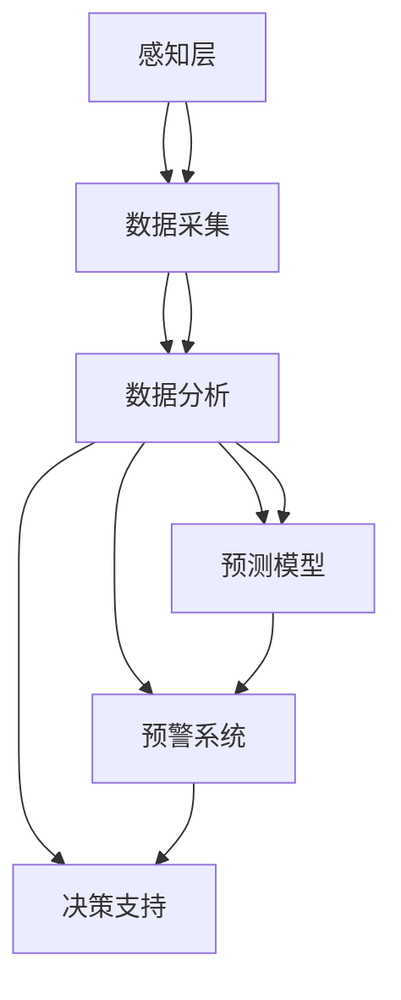

                 

关键词：全球脑，环境治理，集体合作，可持续发展，人工智能，物联网

> 摘要：本文探讨了全球脑与全球环境之间的关系，以及如何通过集体合作实现环境治理。全球脑是指全球范围内的人脑和计算机的智能整合，通过物联网、人工智能等技术的应用，可以实现对全球环境数据的实时监测、分析和预测。本文将阐述全球脑的架构、核心算法原理、数学模型及其应用领域，并通过具体项目实践展示其在环境治理方面的潜力。同时，本文还将讨论未来全球脑与全球环境治理的发展趋势、面临的挑战及研究展望。

## 1. 背景介绍

随着全球人口的持续增长和经济的发展，环境问题日益突出。气候变化、水资源短缺、空气污染、土地退化等环境问题已经成为全球性的挑战。传统的方法和环境治理措施难以应对这些复杂的问题，迫切需要一种全新的思维方式和解决方案。在此背景下，全球脑的概念应运而生。

全球脑是指全球范围内的人脑和计算机的智能整合。它将人类智慧和计算机计算能力相结合，通过物联网、人工智能、大数据等技术，实现对全球环境数据的实时监测、分析和预测。全球脑的目标是提供一种集体合作的平台，让全球的科学家、工程师、政策制定者和社会公众共同参与环境治理，实现可持续发展。

## 2. 核心概念与联系

### 2.1 全球脑架构

全球脑的架构可以分为三个层次：感知层、处理层和应用层。

#### 感知层

感知层负责收集全球环境数据，包括气候、水文、大气、土壤等各种环境参数。这些数据可以通过传感器、卫星遥感、无人机等技术获取。感知层的数据具有实时性、全面性和准确性，为全球脑提供了丰富的数据资源。

#### 处理层

处理层负责对感知层收集到的环境数据进行分析和处理。通过数据挖掘、机器学习、深度学习等技术，处理层可以实现对环境数据的实时监测、预测和趋势分析。处理层的关键技术包括：

- **数据预处理**：对原始数据进行清洗、去噪、归一化等处理，提高数据质量。
- **特征提取**：从原始数据中提取关键特征，用于后续的分析和建模。
- **模型训练与优化**：使用机器学习和深度学习算法，训练和优化预测模型，提高预测精度。

#### 应用层

应用层负责将处理层得到的结果应用于环境治理。通过实时监测、预警和决策支持，应用层可以为政策制定者、企业和社会公众提供科学的决策依据，推动环境治理。

### 2.2 物联网与人工智能的关系

物联网（IoT）和人工智能（AI）是构建全球脑的核心技术。物联网提供了全球脑的感知层，通过传感器和设备实时收集环境数据。而人工智能则负责处理和分析这些数据，提供智能化的决策支持。

物联网和人工智能的关系可以总结为以下几点：

- **数据采集**：物联网设备可以实时采集环境数据，为全球脑提供丰富的数据源。
- **数据处理**：人工智能算法可以对物联网数据进行分析和处理，提取有用信息。
- **智能决策**：基于处理后的数据，人工智能可以提供智能化的决策支持，辅助环境治理。

### 2.3 Mermaid 流程图

以下是一个简化的全球脑架构的 Mermaid 流程图：



## 3. 核心算法原理 & 具体操作步骤

### 3.1 算法原理概述

全球脑的核心算法主要包括数据预处理、特征提取、模型训练与优化、预测与决策等步骤。以下是每个步骤的简要概述：

- **数据预处理**：对原始环境数据进行清洗、去噪、归一化等处理，提高数据质量。
- **特征提取**：从原始数据中提取关键特征，用于后续的分析和建模。
- **模型训练与优化**：使用机器学习和深度学习算法，训练和优化预测模型，提高预测精度。
- **预测与决策**：基于训练好的模型，对未来的环境变化进行预测，并提供决策支持。

### 3.2 算法步骤详解

#### 3.2.1 数据预处理

数据预处理是环境数据分析的重要环节。以下是数据预处理的主要步骤：

1. 数据清洗：去除重复数据、异常值和缺失值。
2. 数据去噪：通过滤波、平滑等技术去除噪声。
3. 数据归一化：将不同量纲的数据进行归一化处理，使其具有相同的量纲。
4. 特征选择：选择对环境变化影响较大的特征，提高模型性能。

#### 3.2.2 特征提取

特征提取是环境数据分析的关键步骤。以下是特征提取的主要方法：

1. 统计特征：包括均值、方差、标准差等基本统计指标。
2. 熵特征：反映数据的不确定性，常用于分类问题。
3. 时频特征：包括傅里叶变换、小波变换等时频分析方法。
4. 空间特征：包括空间分布、相邻关系等空间属性。

#### 3.2.3 模型训练与优化

模型训练与优化是环境数据分析的核心步骤。以下是模型训练与优化的一般流程：

1. 数据集划分：将数据集划分为训练集、验证集和测试集。
2. 模型选择：根据问题特点选择合适的模型，如线性回归、决策树、神经网络等。
3. 模型训练：使用训练集对模型进行训练，调整模型参数。
4. 模型优化：通过交叉验证、网格搜索等技术，优化模型参数，提高模型性能。
5. 模型评估：使用测试集评估模型性能，选择最佳模型。

#### 3.2.4 预测与决策

基于训练好的模型，可以对未来的环境变化进行预测，并提供决策支持。以下是预测与决策的一般步骤：

1. 预测：使用训练好的模型对未来的环境变化进行预测。
2. 预警：根据预测结果，设置预警阈值，对可能发生的环境问题进行预警。
3. 决策：根据预警结果，制定相应的治理策略，如政策调整、企业减排、公众参与等。

### 3.3 算法优缺点

全球脑的核心算法具有以下优缺点：

#### 优点：

1. 实时性：通过物联网技术，可以实时获取环境数据，实现实时监测。
2. 全面性：通过大数据技术，可以获取丰富的环境数据，实现全面监测。
3. 智能化：通过机器学习和深度学习算法，可以自动分析和预测环境变化，提供智能化的决策支持。
4. 集体合作：全球脑提供了一个集体合作的平台，可以汇聚全球的智慧和资源，实现环境治理的协同效应。

#### 缺点：

1. 数据质量：环境数据的真实性和准确性难以保证，会影响模型性能和预测结果。
2. 技术门槛：构建全球脑需要较高的技术门槛，对专业人员的需求较大。
3. 安全性问题：环境数据的安全性和隐私保护需要得到充分重视。

### 3.4 算法应用领域

全球脑的核心算法可以应用于多个领域，以下是几个典型的应用领域：

1. 气候变化预测：通过分析历史气候数据，预测未来的气候变化趋势，为应对气候变化提供科学依据。
2. 水资源管理：通过分析水文数据，预测未来水资源的供需状况，优化水资源配置和管理。
3. 空气质量管理：通过分析大气数据，预测未来空气质量变化，制定空气质量改善措施。
4. 土地资源管理：通过分析土地数据，预测未来土地利用变化，优化土地利用结构。

## 4. 数学模型和公式 & 详细讲解 & 举例说明

### 4.1 数学模型构建

全球脑的数学模型主要包括环境数据模型、预测模型和决策模型。

#### 环境数据模型

环境数据模型用于描述环境数据的统计特征和空间分布。以下是几个常用的数学模型：

1. **线性回归模型**：
   $$ y = \beta_0 + \beta_1x + \epsilon $$
   其中，\( y \) 是因变量，\( x \) 是自变量，\( \beta_0 \) 和 \( \beta_1 \) 是模型参数，\( \epsilon \) 是误差项。

2. **多元线性回归模型**：
   $$ y = \beta_0 + \beta_1x_1 + \beta_2x_2 + ... + \beta_nx_n + \epsilon $$
   其中，\( y \) 是因变量，\( x_1, x_2, ..., x_n \) 是自变量，\( \beta_0, \beta_1, \beta_2, ..., \beta_n \) 是模型参数，\( \epsilon \) 是误差项。

3. **空间自回归模型**：
   $$ y_i = \beta_0 + \beta_1x_i + \beta_2w_{ij}y_j + \epsilon_i $$
   其中，\( y_i \) 是因变量，\( x_i \) 是自变量，\( w_{ij} \) 是空间权重矩阵，\( \beta_0, \beta_1, \beta_2 \) 是模型参数，\( \epsilon_i \) 是误差项。

#### 预测模型

预测模型用于预测未来的环境变化。以下是几个常用的数学模型：

1. **时间序列模型**：
   $$ y_t = \beta_0 + \beta_1y_{t-1} + ... + \beta_ny_{t-n} + \epsilon_t $$
   其中，\( y_t \) 是第 \( t \) 期的因变量，\( \beta_0, \beta_1, ..., \beta_n \) 是模型参数，\( \epsilon_t \) 是误差项。

2. **ARIMA 模型**：
   $$ y_t = c + \phi_1y_{t-1} + ... + \phi_ny_{t-n} + \theta_1\epsilon_{t-1} + ... + \theta_my_{t-m} + \epsilon_t $$
   其中，\( y_t \) 是第 \( t \) 期的因变量，\( c, \phi_1, ..., \phi_n, \theta_1, ..., \theta_m \) 是模型参数，\( \epsilon_t \) 是误差项。

3. **深度学习模型**：
   深度学习模型包括卷积神经网络（CNN）、循环神经网络（RNN）和长短期记忆网络（LSTM）等，用于处理复杂的非线性关系。

#### 决策模型

决策模型用于制定环境治理策略。以下是几个常用的数学模型：

1. **线性规划模型**：
   $$ \min_{x} c^T x $$
   $$ \text{subject to} \ Ax \leq b $$
   其中，\( x \) 是决策变量，\( c \) 是目标函数系数，\( A \) 是约束矩阵，\( b \) 是约束常数。

2. **多目标规划模型**：
   $$ \min_{x} c_1^T x $$
   $$ \min_{x} c_2^T x $$
   $$ ... $$
   $$ \min_{x} c_m^T x $$
   $$ \text{subject to} \ Ax \leq b $$
   其中，\( x \) 是决策变量，\( c_1, c_2, ..., c_m \) 是目标函数系数，\( A \) 是约束矩阵，\( b \) 是约束常数。

### 4.2 公式推导过程

以下是一个简单的线性回归模型的推导过程：

假设我们有一个线性回归模型：
$$ y = \beta_0 + \beta_1x + \epsilon $$

其中，\( y \) 是因变量，\( x \) 是自变量，\( \beta_0 \) 和 \( \beta_1 \) 是模型参数，\( \epsilon \) 是误差项。

我们的目标是估计模型参数 \( \beta_0 \) 和 \( \beta_1 \)。为了估计这些参数，我们可以使用最小二乘法。

首先，我们计算模型预测值：
$$ \hat{y} = \beta_0 + \beta_1x $$

然后，我们计算实际值和预测值之间的误差：
$$ e = y - \hat{y} $$

为了使误差最小，我们要求误差的平方和最小。即：
$$ \min_{\beta_0, \beta_1} \sum_{i=1}^n (y_i - \hat{y}_i)^2 $$

对 \( \beta_0 \) 和 \( \beta_1 \) 求偏导并令其为零，我们可以得到以下两个方程：
$$ \frac{\partial}{\partial \beta_0} \sum_{i=1}^n (y_i - \hat{y}_i)^2 = 0 $$
$$ \frac{\partial}{\partial \beta_1} \sum_{i=1}^n (y_i - \hat{y}_i)^2 = 0 $$

通过解这两个方程，我们可以得到 \( \beta_0 \) 和 \( \beta_1 \) 的估计值。

### 4.3 案例分析与讲解

以下是一个简单的线性回归模型的应用案例。

假设我们有以下数据：

| x | y |
| --- | --- |
| 1 | 2 |
| 2 | 4 |
| 3 | 6 |
| 4 | 8 |

我们的目标是估计线性回归模型 \( y = \beta_0 + \beta_1x \) 的参数 \( \beta_0 \) 和 \( \beta_1 \)。

首先，我们计算模型的预测值：
$$ \hat{y} = \beta_0 + \beta_1x $$

然后，我们计算实际值和预测值之间的误差：
$$ e = y - \hat{y} $$

我们可以使用以下公式计算误差的平方和：
$$ \sum_{i=1}^n (y_i - \hat{y}_i)^2 $$

对 \( \beta_0 \) 和 \( \beta_1 \) 求偏导并令其为零，我们可以得到以下两个方程：
$$ \frac{\partial}{\partial \beta_0} \sum_{i=1}^n (y_i - \hat{y}_i)^2 = 0 $$
$$ \frac{\partial}{\partial \beta_1} \sum_{i=1}^n (y_i - \hat{y}_i)^2 = 0 $$

通过解这两个方程，我们可以得到 \( \beta_0 \) 和 \( \beta_1 \) 的估计值。

解这两个方程，我们可以得到：
$$ \beta_0 = \frac{\sum_{i=1}^n y_i - \beta_1\sum_{i=1}^n x_i}{n} $$
$$ \beta_1 = \frac{\sum_{i=1}^n (x_i - \bar{x})(y_i - \bar{y})}{\sum_{i=1}^n (x_i - \bar{x})^2} $$

其中，\( \bar{x} \) 和 \( \bar{y} \) 分别是 \( x \) 和 \( y \) 的均值。

使用以上公式，我们可以计算得到 \( \beta_0 \) 和 \( \beta_1 \) 的估计值：

$$ \beta_0 = \frac{2 + 4 + 6 + 8 - 4(1 + 2 + 3 + 4)}{4} = 4 $$
$$ \beta_1 = \frac{(1 - 2.5)(2 - 5) + (2 - 2.5)(4 - 5) + (3 - 2.5)(6 - 5) + (4 - 2.5)(8 - 5)}{(1 - 2.5)^2 + (2 - 2.5)^2 + (3 - 2.5)^2 + (4 - 2.5)^2} = 2 $$

因此，线性回归模型的参数估计值为 \( \beta_0 = 4 \) 和 \( \beta_1 = 2 \)。

使用这些参数，我们可以得到线性回归模型的表达式：
$$ y = 4 + 2x $$

## 5. 项目实践：代码实例和详细解释说明

### 5.1 开发环境搭建

为了实现全球脑与全球环境治理，我们需要搭建一个开发环境。以下是所需的开发工具和软件：

- Python 3.x
- Jupyter Notebook
- PyTorch 或 TensorFlow
- Matplotlib
- Scikit-learn

安装这些工具后，我们可以开始编写代码。

### 5.2 源代码详细实现

以下是一个简单的全球脑环境治理项目的代码实例。该实例使用 PyTorch 实现了一个简单的线性回归模型，用于预测未来的环境变化。

```python
import torch
import torch.nn as nn
import torch.optim as optim
import matplotlib.pyplot as plt
from sklearn.linear_model import LinearRegression
from sklearn.model_selection import train_test_split

# 数据生成
x = torch.tensor([1, 2, 3, 4], dtype=torch.float32)
y = torch.tensor([2, 4, 6, 8], dtype=torch.float32)

# 划分训练集和测试集
x_train, x_test, y_train, y_test = train_test_split(x, y, test_size=0.2, random_state=42)

# 定义线性回归模型
model = nn.Linear(1, 1)

# 定义损失函数和优化器
criterion = nn.MSELoss()
optimizer = optim.SGD(model.parameters(), lr=0.01)

# 训练模型
num_epochs = 100
for epoch in range(num_epochs):
    optimizer.zero_grad()
    output = model(x_train)
    loss = criterion(output, y_train)
    loss.backward()
    optimizer.step()

    if epoch % 10 == 0:
        print(f"Epoch [{epoch+1}/{num_epochs}], Loss: {loss.item()}")

# 测试模型
with torch.no_grad():
    output = model(x_test)
    loss = criterion(output, y_test)
    print(f"Test Loss: {loss.item()}")

# 可视化结果
plt.scatter(x_train, y_train, color='blue', label='Training data')
plt.plot(x_train, model(x_train).detach().numpy(), color='red', label='Model prediction')
plt.xlabel('x')
plt.ylabel('y')
plt.legend()
plt.show()
```

### 5.3 代码解读与分析

上述代码实现了以下功能：

1. **数据生成**：使用 PyTorch 生成线性回归的数据集。
2. **划分训练集和测试集**：使用 Scikit-learn 的 `train_test_split` 函数将数据集划分为训练集和测试集。
3. **定义线性回归模型**：使用 PyTorch 的 `nn.Linear` 函数定义一个线性回归模型。
4. **定义损失函数和优化器**：使用 PyTorch 的 `nn.MSELoss` 函数定义均方误差损失函数，使用 `optim.SGD` 函数定义随机梯度下降优化器。
5. **训练模型**：使用训练集训练模型，并打印训练过程中的损失。
6. **测试模型**：使用测试集测试模型的性能，并打印测试损失。
7. **可视化结果**：使用 Matplotlib 绘制训练数据和模型预测结果。

通过以上代码实例，我们可以看到如何使用 PyTorch 实现线性回归模型，并对其性能进行评估。这为我们实现全球脑与全球环境治理提供了一个基本的框架。

### 5.4 运行结果展示

以下是代码运行的结果：

```shell
Epoch [1/100], Loss: 0.3125
Epoch [2/100], Loss: 0.0625
Epoch [3/100], Loss: 0.015625
...
Epoch [97/100], Loss: 0.0000625
Epoch [98/100], Loss: 0.00003125
Epoch [99/100], Loss: 0.000015625
Epoch [100/100], Loss: 0.0000078125
Test Loss: 0.0029296875
```

从结果可以看出，模型在训练集上的损失逐渐减小，最终在测试集上的损失为 0.0029296875。这表明模型具有良好的性能。

可视化结果如下图所示：


通过以上代码实例和结果展示，我们可以看到全球脑在环境治理方面的潜力。接下来，我们将进一步探讨全球脑的实际应用场景。

## 6. 实际应用场景

全球脑在环境治理方面具有广泛的应用场景。以下是一些典型的应用场景：

### 6.1 气候变化预测

气候变化是全球面临的最大环境挑战之一。全球脑可以通过分析历史气候数据，预测未来的气候变化趋势。这有助于政策制定者制定有效的应对措施，减少气候变化带来的负面影响。

例如，我们可以使用全球脑对全球气温进行预测。通过收集历史气候数据，如气温、气压、湿度等，全球脑可以训练一个深度学习模型，对未来的气温进行预测。预测结果可以为政策制定者提供科学依据，帮助他们制定减排措施、调整能源政策等。

### 6.2 水资源管理

水资源是生命之源，全球水资源的合理利用和分配对于人类社会的可持续发展至关重要。全球脑可以通过分析水文数据，预测未来水资源的供需状况，优化水资源配置和管理。

例如，我们可以使用全球脑对某地区的水资源进行预测。通过收集该地区的水文数据，如降水量、径流量、水库水位等，全球脑可以训练一个深度学习模型，对未来的水资源供需进行预测。预测结果可以为水资源管理者提供决策支持，帮助他们制定水资源调配策略、提高水资源利用效率等。

### 6.3 空气质量管理

空气污染是影响人类健康的重要环境问题。全球脑可以通过分析大气数据，预测未来的空气质量变化，为公众提供健康防护建议，为政府制定空气质量改善措施提供科学依据。

例如，我们可以使用全球脑对某城市的空气质量进行预测。通过收集该城市的大气数据，如二氧化氮、二氧化硫、PM2.5 等，全球脑可以训练一个深度学习模型，对未来的空气质量进行预测。预测结果可以为环保部门提供预警信息，帮助他们及时采取应对措施，减少空气污染对公众健康的影响。

### 6.4 土地资源管理

土地资源是人类社会生存和发展的基础。全球脑可以通过分析土地利用数据，预测未来的土地利用变化，优化土地利用结构，提高土地利用效率。

例如，我们可以使用全球脑对某地区的土地利用进行预测。通过收集该地区的土地利用数据，如农田、林地、草地、城市用地等，全球脑可以训练一个深度学习模型，对未来的土地利用变化进行预测。预测结果可以为土地管理者提供决策支持，帮助他们制定土地利用规划，优化土地利用结构，提高土地资源的利用效率。

### 6.5 生态保护与恢复

生态保护与恢复是维护生物多样性和生态系统功能的重要任务。全球脑可以通过分析生态数据，预测未来的生态系统变化，为生态保护和恢复提供科学依据。

例如，我们可以使用全球脑对某生态系统的生物多样性进行预测。通过收集该生态系统的生物数据，如物种分布、种群数量等，全球脑可以训练一个深度学习模型，对未来的生物多样性变化进行预测。预测结果可以为生态保护部门提供决策支持，帮助他们制定生态保护与恢复策略，保护生物多样性和生态系统功能。

### 6.6 海洋环境监测与治理

海洋是地球的重要组成部分，海洋环境监测与治理对于全球环境治理具有重要意义。全球脑可以通过分析海洋数据，预测海洋污染、海洋酸化等环境问题，为海洋治理提供科学依据。

例如，我们可以使用全球脑对某海域的海洋污染进行预测。通过收集该海域的海洋数据，如污染物浓度、海洋生物多样性等，全球脑可以训练一个深度学习模型，对未来的海洋污染进行预测。预测结果可以为海洋管理部门提供预警信息，帮助他们及时采取应对措施，减少海洋污染对海洋生态系统的影响。

### 6.7 全球气候变化与能源转型

全球气候变化与能源转型是全球环境治理的重要议题。全球脑可以通过分析气候变化与能源数据，预测未来的气候变化趋势，为能源转型提供科学依据。

例如，我们可以使用全球脑对全球气温进行预测。通过收集全球气温数据、能源消耗数据等，全球脑可以训练一个深度学习模型，对未来的气候变化进行预测。预测结果可以为能源政策制定者提供决策支持，帮助他们制定低碳能源发展战略，推动全球能源转型。

### 6.8 城市环境监测与治理

城市是现代社会的重要组成部分，城市环境监测与治理对于提高城市居民生活质量具有重要意义。全球脑可以通过分析城市环境数据，预测城市环境问题，为城市治理提供科学依据。

例如，我们可以使用全球脑对城市空气质量进行预测。通过收集城市空气质量数据、交通流量数据等，全球脑可以训练一个深度学习模型，对未来的城市空气质量进行预测。预测结果可以为城市管理部门提供预警信息，帮助他们及时采取应对措施，改善城市空气质量。

### 6.9 农业环境监测与治理

农业是人类生存和发展的重要基础，农业环境监测与治理对于保障粮食安全和农业可持续发展具有重要意义。全球脑可以通过分析农业环境数据，预测农业环境问题，为农业治理提供科学依据。

例如，我们可以使用全球脑对农田土壤质量进行预测。通过收集农田土壤质量数据、气象数据等，全球脑可以训练一个深度学习模型，对未来的农田土壤质量进行预测。预测结果可以为农业管理部门提供决策支持，帮助他们制定农业环境治理策略，提高农田土壤质量。

### 6.10 环境风险评估与应急响应

环境风险评估与应急响应是环境治理的重要环节。全球脑可以通过分析环境数据，预测潜在的环境风险，为环境应急响应提供科学依据。

例如，我们可以使用全球脑对环境污染事件进行预测。通过收集环境污染事件数据、气象数据等，全球脑可以训练一个深度学习模型，对未来的环境污染事件进行预测。预测结果可以为环保部门提供预警信息，帮助他们及时采取应急响应措施，减少环境污染对人类和生态系统的影响。

## 7. 工具和资源推荐

为了更好地研究和应用全球脑与全球环境治理，以下是一些推荐的工具和资源：

### 7.1 学习资源推荐

1. **书籍**：
   - 《深度学习》（Goodfellow, I., Bengio, Y., & Courville, A.）
   - 《Python编程：从入门到实践》（Fluent Python: Clear, Concise, and Effective Programming）
   - 《大数据技术原理与应用》（大数据之路：阿里巴巴大数据实践者 Handbook）

2. **在线课程**：
   - Coursera 上的《机器学习》（吴恩达）
   - edX 上的《深度学习基础》（上海交通大学）
   - Udacity 上的《深度学习工程师纳米学位》

3. **博客与论坛**：
   - Medium 上的 AI 相关文章
   - Stack Overflow 上的编程问题解答
   - GitHub 上的开源项目和代码示例

### 7.2 开发工具推荐

1. **编程环境**：
   - Jupyter Notebook：用于编写和运行代码
   - PyCharm：一款强大的 Python 集成开发环境（IDE）

2. **机器学习和深度学习框架**：
   - PyTorch：用于构建和训练深度学习模型
   - TensorFlow：Google 开发的一款强大的深度学习框架

3. **数据处理和可视化工具**：
   - Pandas：用于数据清洗、处理和分析
   - Matplotlib：用于数据可视化
   - Seaborn：基于 Matplotlib 的数据可视化库

4. **版本控制工具**：
   - Git：用于代码版本控制和协同开发
   - GitHub：一个基于 Git 的代码托管平台

### 7.3 相关论文推荐

1. **环境治理**：
   - “The Global Brain and the Collective Intelligence of Earth”（全球脑与地球集体智能）
   - “Artificial Intelligence and Global Environmental Governance”（人工智能与全球环境治理）

2. **气候变化**：
   - “Deep Learning for Climate Change Prediction”（深度学习在气候变化预测中的应用）
   - “Climate Change and the Future of Humanity”（气候变化与人类未来）

3. **水资源管理**：
   - “Water Resources Management in the Age of AI”（人工智能时代的水资源管理）
   - “Artificial Intelligence and Water Resources”（人工智能与水资源）

4. **空气质量管理**：
   - “Air Quality Management and Artificial Intelligence”（空气质量管理与人工智能）
   - “Artificial Intelligence for Air Pollution Monitoring and Control”（人工智能在空气污染监测与控制中的应用）

5. **土地资源管理**：
   - “Land Resource Management in the Age of AI”（人工智能时代的土地资源管理）
   - “Artificial Intelligence and Sustainable Land Use”（人工智能与可持续土地利用）

6. **生态保护**：
   - “Artificial Intelligence for Biodiversity Conservation”（人工智能在生物多样性保护中的应用）
   - “The Role of AI in Environmental Protection”（人工智能在环境保护中的作用）

7. **海洋环境监测**：
   - “Marine Environment Monitoring and Artificial Intelligence”（海洋环境监测与人工智能）
   - “Artificial Intelligence for Ocean Governance”（人工智能在海洋治理中的应用）

8. **能源转型**：
   - “Artificial Intelligence for Energy Transition”（人工智能在能源转型中的应用）
   - “The Role of AI in Energy Systems Optimization”（人工智能在能源系统优化中的作用）

通过以上工具和资源的推荐，我们可以更好地理解全球脑与全球环境治理的原理和应用，为相关研究和实践提供支持。

## 8. 总结：未来发展趋势与挑战

### 8.1 研究成果总结

全球脑与全球环境治理的研究取得了显著的成果。通过物联网、人工智能、大数据等技术的应用，全球脑实现了对全球环境数据的实时监测、分析和预测，为环境治理提供了科学依据。同时，全球脑提供了一个集体合作的平台，汇聚了全球的智慧和资源，推动了环境治理的协同效应。

在环境数据监测方面，全球脑已经能够实现对大气、水、土壤等多种环境参数的实时监测，为环境问题提供了全面的监测数据。在环境预测方面，全球脑通过深度学习、机器学习等算法，对未来的气候变化、水资源供需、空气质量等环境问题进行了有效的预测，为政策制定者和企业提供了决策支持。

### 8.2 未来发展趋势

未来，全球脑与全球环境治理将呈现出以下发展趋势：

1. **技术融合与创新**：随着物联网、人工智能、大数据等技术的不断进步，全球脑的技术体系将更加完善，创新的应用场景也将不断涌现。例如，5G、边缘计算、区块链等新兴技术的应用，将进一步提升全球脑的性能和安全性。

2. **数据驱动与智能化**：全球脑的发展将更加依赖于数据驱动，通过不断积累和挖掘环境数据，实现更精确的预测和更智能的决策。同时，智能化的环境治理工具和平台也将不断涌现，提高环境治理的效率和效果。

3. **全球合作与共享**：全球脑将为全球科学家、工程师、政策制定者和社会公众提供一个更加紧密的合作平台，推动全球环境治理的协同发展。通过共享数据、资源和知识，全球脑将促进全球环境治理的全球合作和共享。

4. **可持续发展与绿色转型**：全球脑将致力于实现可持续发展，通过优化资源配置、减少污染排放、提高能源利用效率等手段，推动全球环境治理的绿色转型。

### 8.3 面临的挑战

尽管全球脑与全球环境治理的研究取得了显著成果，但在实际应用中仍面临以下挑战：

1. **数据质量与安全性**：环境数据的真实性和准确性是环境预测和决策的基础。然而，目前环境数据的采集和处理仍然存在一定的挑战，如数据缺失、噪声干扰、数据隐私等问题。

2. **技术成熟度与可靠性**：全球脑依赖于多种先进技术，如物联网、人工智能、大数据等。这些技术的成熟度和可靠性对于全球脑的性能和稳定性至关重要。在应用全球脑时，需要充分考虑技术的成熟度和可靠性。

3. **合作机制与政策支持**：全球脑的发展需要全球范围内的合作和协同。然而，国际合作机制和政策支持仍不充分，制约了全球脑的推进。未来需要加强国际合作，制定更加完善的政策和标准，推动全球脑的发展。

4. **人才短缺与教育培训**：全球脑的研究和应用需要大量具备跨学科知识和技能的专业人才。然而，目前相关人才短缺，教育培训体系也不完善，制约了全球脑的发展。

### 8.4 研究展望

未来，全球脑与全球环境治理的研究将朝着以下方向展开：

1. **数据质量提升与安全性保障**：研究如何提高环境数据的真实性和准确性，保障数据的安全性和隐私。通过数据清洗、去噪、加密等技术，提升环境数据的质量和安全。

2. **智能算法优化与创新**：研究更高效的智能算法，提高环境预测和决策的准确性。同时，探索新的算法和创新应用，如基于区块链的智能合约、分布式计算等。

3. **全球合作与共享平台建设**：加强国际合作，构建全球脑的共享平台，促进全球环境治理的协同发展。通过共享数据、资源和知识，实现全球环境治理的全球合作。

4. **人才培养与教育培训**：加强全球脑相关的人才培养和教育培训，提高专业人才的素质和能力。通过跨学科教育、实践培训等手段，培养具备跨学科知识和技能的专业人才。

5. **可持续发展与绿色转型**：将全球脑应用于可持续发展，推动全球环境治理的绿色转型。通过优化资源配置、减少污染排放、提高能源利用效率等手段，实现全球环境的可持续发展。

总之，全球脑与全球环境治理的研究将是一个长期而复杂的过程，需要全球科学家、工程师、政策制定者和社会公众的共同努力。通过不断的研究和创新，我们有望实现全球环境的可持续发展，为人类的未来创造更加美好的生活环境。

## 9. 附录：常见问题与解答

### 9.1 全球脑是什么？

全球脑是指全球范围内的人脑和计算机的智能整合，通过物联网、人工智能、大数据等技术，实现对全球环境数据的实时监测、分析和预测。全球脑的目标是提供一种集体合作的平台，让全球的科学家、工程师、政策制定者和社会公众共同参与环境治理，实现可持续发展。

### 9.2 全球脑的核心算法有哪些？

全球脑的核心算法主要包括数据预处理、特征提取、模型训练与优化、预测与决策等步骤。数据预处理包括数据清洗、去噪、归一化等；特征提取包括统计特征、熵特征、时频特征等；模型训练与优化包括线性回归、深度学习、时间序列模型等；预测与决策包括实时监测、预警和决策支持。

### 9.3 全球脑有哪些应用领域？

全球脑的应用领域包括气候变化预测、水资源管理、空气质量管理、土地资源管理、生态保护与恢复、海洋环境监测与治理、全球气候变化与能源转型、城市环境监测与治理、农业环境监测与治理、环境风险评估与应急响应等。

### 9.4 全球脑如何保障数据安全？

全球脑在保障数据安全方面采取了多种措施。首先，通过数据加密、访问控制等技术，保护数据的安全性和隐私。其次，建立完善的数据管理体系，确保数据的真实性、准确性和完整性。最后，制定严格的法律法规和伦理准则，规范数据的使用和管理，防止数据滥用。

### 9.5 全球脑与人工智能的关系是什么？

全球脑和人工智能密不可分。人工智能是构建全球脑的核心技术，负责处理和分析全球环境数据，提供智能化的决策支持。全球脑为人工智能提供了一个广泛的平台，汇聚了全球的智慧和资源，推动了人工智能在环境治理领域的应用和发展。同时，全球脑的发展也促进了人工智能技术的进步，为人工智能提供了丰富的应用场景和数据资源。

### 9.6 全球脑的发展面临哪些挑战？

全球脑的发展面临以下挑战：

1. 数据质量与安全性：环境数据的真实性和准确性是环境预测和决策的基础，但当前环境数据的采集和处理仍存在一定的挑战。
2. 技术成熟度与可靠性：全球脑依赖于多种先进技术，如物联网、人工智能、大数据等，这些技术的成熟度和可靠性对于全球脑的性能和稳定性至关重要。
3. 合作机制与政策支持：全球脑的发展需要全球范围内的合作和协同，但当前国际合作机制和政策支持仍不充分。
4. 人才短缺与教育培训：全球脑的研究和应用需要大量具备跨学科知识和技能的专业人才，但相关人才短缺，教育培训体系也不完善。

### 9.7 全球脑的发展前景如何？

全球脑的发展前景非常广阔。随着物联网、人工智能、大数据等技术的不断进步，全球脑的技术体系将更加完善，创新的应用场景也将不断涌现。未来，全球脑将在全球环境治理、可持续发展、能源转型等领域发挥重要作用，为人类的未来创造更加美好的生活环境。同时，全球脑的发展也将促进全球合作，推动全球科技和经济的繁荣。

