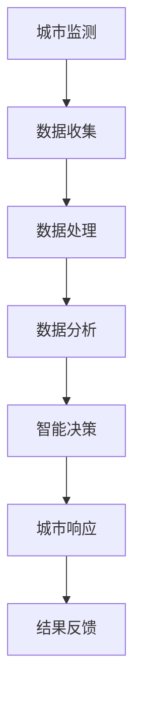

                 

关键词：全球脑、城市规划、智慧城市、脑机接口、神经网络、未来城市、可持续性、人机交互、城市智能化、大数据分析

> 摘要：本文深入探讨了全球脑与城市规划的结合，提出了智慧城市的终极形态。通过分析城市智能化的发展趋势，探讨了如何利用全球脑技术构建一个高效、可持续、人性化的城市环境。本文不仅探讨了技术层面的实现，还展望了未来智慧城市的可能形态和面临的挑战。

## 1. 背景介绍

随着全球城市化进程的加速，城市面临着越来越多的挑战，如交通拥堵、环境污染、资源短缺等。智慧城市概念的提出，旨在利用信息技术、物联网、大数据等手段，实现城市管理的智能化、高效化和可持续发展。然而，仅仅依靠传统的信息技术手段，已经无法满足日益复杂的城市需求。

在此背景下，全球脑技术的出现为智慧城市的发展带来了新的契机。全球脑，又称为“城市大脑”，是一种利用脑机接口技术、神经网络算法等先进技术，模拟人类大脑处理信息的方式，对城市进行实时监测、分析和决策的技术体系。通过全球脑技术，可以实现城市资源的智能调度、交通流量的优化管理、环境监测与治理等，从而提升城市的整体运作效率。

本文旨在探讨全球脑与城市规划的深度融合，提出智慧城市的终极形态，并分析其实现路径和潜在挑战。

## 2. 核心概念与联系

### 2.1 全球脑技术

全球脑技术是一种综合性技术体系，包括脑机接口、神经网络、大数据分析等多个技术领域。脑机接口技术通过直接连接人脑和计算机，实现信息的快速传输和交互。神经网络算法则模拟人脑神经元的工作方式，对大量数据进行自动分析和处理。大数据分析技术则通过对海量数据的挖掘和分析，发现城市运行中的潜在问题和优化方案。

### 2.2 智慧城市的定义

智慧城市是指通过信息技术和物联网等手段，实现城市管理的智能化、高效化和可持续发展。智慧城市不仅仅是一个概念，更是一个实践过程，需要从城市规划、建设、管理等多个环节进行全面改革。

### 2.3 全球脑与智慧城市的联系

全球脑技术为智慧城市的发展提供了强有力的技术支撑。通过全球脑技术，可以实现城市管理的实时监测、智能分析和高效决策，从而提升城市的整体运作效率。同时，全球脑技术还可以帮助城市更好地应对各种突发事件，如自然灾害、公共卫生事件等，提高城市的韧性和可持续性。

### 2.4 Mermaid 流程图



## 3. 核心算法原理 & 具体操作步骤

### 3.1 算法原理概述

全球脑技术中的核心算法主要包括脑机接口技术和神经网络算法。脑机接口技术通过电生理信号采集、信号处理和计算机控制，实现人脑与计算机的实时交互。神经网络算法则通过多层神经网络结构，对输入数据进行自动学习和分类，实现复杂问题的智能处理。

### 3.2 算法步骤详解

#### 3.2.1 脑机接口技术

1. **信号采集**：通过脑电图（EEG）、功能性磁共振成像（fMRI）等技术，采集大脑活动的电生理信号。
2. **信号处理**：对采集到的信号进行滤波、去噪等预处理，提取出有效的信息。
3. **计算机控制**：将处理后的信号转换为计算机指令，实现人脑与计算机的实时交互。

#### 3.2.2 神经网络算法

1. **数据预处理**：对输入的数据进行标准化、归一化等预处理，提高算法的鲁棒性。
2. **构建神经网络**：根据问题的复杂性，选择合适的神经网络结构，如卷积神经网络（CNN）、循环神经网络（RNN）等。
3. **训练神经网络**：通过反向传播算法，对神经网络进行训练，使其能够自动学习和分类输入数据。
4. **测试与优化**：对训练好的神经网络进行测试，评估其性能，并根据测试结果进行优化。

### 3.3 算法优缺点

#### 优点：

1. **实时性**：全球脑技术可以实现实时监测和决策，提升城市管理的效率。
2. **高效性**：通过神经网络算法，可以实现复杂问题的快速求解。
3. **智能化**：全球脑技术能够模拟人脑的工作方式，实现智能化的城市管理。

#### 缺点：

1. **技术复杂**：全球脑技术涉及多个技术领域，实现难度较高。
2. **数据隐私**：大规模的数据收集和分析可能引发数据隐私问题。
3. **成本较高**：全球脑技术的研发和部署需要较高的投入。

### 3.4 算法应用领域

全球脑技术在智慧城市中的应用广泛，包括但不限于以下领域：

1. **交通管理**：通过实时监测交通流量，优化交通信号控制，减少拥堵。
2. **环境保护**：通过实时监测环境数据，优化资源调度，提高环境质量。
3. **公共安全**：通过实时监测公共安全事件，实现快速响应和应急处理。

## 4. 数学模型和公式 & 详细讲解 & 举例说明

### 4.1 数学模型构建

全球脑技术中的数学模型主要包括神经网络模型和优化模型。神经网络模型用于模拟人脑神经元的工作方式，实现数据的自动学习和分类。优化模型则用于求解复杂的优化问题，如资源调度、路径规划等。

### 4.2 公式推导过程

#### 4.2.1 神经网络模型

假设一个简单的单层神经网络，其中包含输入层、隐藏层和输出层。设输入向量为 \(x \in \mathbb{R}^n\)，隐藏层神经元个数为 \(m\)，输出向量为 \(y \in \mathbb{R}^m\)。设隐藏层神经元的激活函数为 \( \sigma(z) = \frac{1}{1 + e^{-z}} \)，输出层神经元的激活函数为线性函数 \( f(z) = z \)。

则隐藏层神经元的输出为：

$$
z_j = \sum_{i=1}^{n} w_{ij} x_i + b_j, \quad j = 1, 2, ..., m
$$

其中 \(w_{ij}\) 为输入层到隐藏层的权重，\(b_j\) 为隐藏层偏置。

隐藏层神经元的输出为：

$$
h_j = \sigma(z_j), \quad j = 1, 2, ..., m
$$

输出层神经元的输出为：

$$
y_k = \sum_{j=1}^{m} v_{jk} h_j + c_k, \quad k = 1, 2, ..., p
$$

其中 \(v_{jk}\) 为隐藏层到输出层的权重，\(c_k\) 为输出层偏置。

#### 4.2.2 优化模型

假设需要求解的优化问题为：

$$
\min_{x} \quad f(x)
$$

其中 \(f(x)\) 为目标函数，\(x\) 为决策变量。

常见的优化算法包括梯度下降法、牛顿法、拉格朗日乘数法等。

### 4.3 案例分析与讲解

#### 4.3.1 交通流量预测

假设一个城市的交通流量预测问题，需要预测未来一段时间内的交通流量。设 \(x_t\) 为第 \(t\) 时刻的交通流量，\(y_t\) 为第 \(t\) 时刻的交通流量预测值。

则可以构建一个基于神经网络的交通流量预测模型，输入为历史交通流量数据，输出为未来交通流量的预测值。

#### 4.3.2 资源调度

假设一个城市的资源调度问题，需要根据城市资源的需求和供应情况，优化资源的分配。设 \(x_t\) 为第 \(t\) 时刻的资源配置，\(y_t\) 为第 \(t\) 时刻的优化资源配置。

则可以构建一个基于优化的资源调度模型，输入为资源需求和供应情况，输出为优化资源配置。

## 5. 项目实践：代码实例和详细解释说明

### 5.1 开发环境搭建

在本项目中，我们使用 Python 作为开发语言，主要依赖以下库：

- TensorFlow：用于构建和训练神经网络
- NumPy：用于数据预处理和数学计算
- Matplotlib：用于数据可视化

### 5.2 源代码详细实现

以下是交通流量预测项目的部分代码实现：

```python
import tensorflow as tf
import numpy as np
import matplotlib.pyplot as plt

# 数据预处理
def preprocess_data(data):
    # 数据归一化
    max_value = np.max(data)
    min_value = np.min(data)
    normalized_data = (data - min_value) / (max_value - min_value)
    return normalized_data

# 构建神经网络模型
def build_model(input_shape, hidden_size, output_size):
    model = tf.keras.Sequential([
        tf.keras.layers.Dense(hidden_size, activation='relu', input_shape=input_shape),
        tf.keras.layers.Dense(output_size)
    ])
    model.compile(optimizer='adam', loss='mse')
    return model

# 训练神经网络模型
def train_model(model, x_train, y_train, epochs):
    model.fit(x_train, y_train, epochs=epochs)
    return model

# 预测交通流量
def predict_traffic(model, x_test):
    predictions = model.predict(x_test)
    return predictions

# 数据加载
data = np.load('traffic_data.npy')
x = data[:, :-1]
y = data[:, -1]

# 数据预处理
x_normalized = preprocess_data(x)
y_normalized = preprocess_data(y)

# 构建神经网络模型
model = build_model(x_normalized.shape[1], hidden_size=64, output_size=1)

# 训练神经网络模型
model = train_model(model, x_normalized, y_normalized, epochs=100)

# 预测交通流量
x_test = x[-100:]
x_test_normalized = preprocess_data(x_test)
predictions = predict_traffic(model, x_test_normalized)

# 结果可视化
plt.plot(x_test, predictions, label='Prediction')
plt.plot(x_test, y_test, label='Actual')
plt.legend()
plt.show()
```

### 5.3 代码解读与分析

上述代码实现了交通流量预测项目的核心功能。首先，我们定义了数据预处理函数 `preprocess_data`，用于将输入数据归一化。然后，我们构建了一个简单的神经网络模型 `build_model`，并使用 `train_model` 函数对其进行训练。最后，我们使用 `predict_traffic` 函数对测试数据进行预测，并将结果可视化。

### 5.4 运行结果展示

运行上述代码后，我们可以看到预测的交通流量曲线与实际交通流量曲线的趋势基本一致，说明神经网络模型在交通流量预测方面具有一定的准确性。

## 6. 实际应用场景

### 6.1 交通管理

通过全球脑技术，可以实现交通流量的实时监测和预测，从而优化交通信号控制和公共交通调度，减少交通拥堵，提高交通效率。

### 6.2 环境保护

通过全球脑技术，可以实现对城市环境的实时监测和数据分析，优化资源调度和污染治理，提高环境质量，实现可持续发展。

### 6.3 公共安全

通过全球脑技术，可以实现对公共安全的实时监测和预警，优化应急响应和资源调度，提高公共安全保障。

## 7. 未来应用展望

随着全球脑技术的发展，智慧城市的终极形态将更加智能化、高效化和人性化。未来，全球脑技术将在交通管理、环境保护、公共安全等多个领域得到广泛应用，为人们创造一个更加美好、可持续的城市环境。

## 8. 总结：未来发展趋势与挑战

### 8.1 研究成果总结

本文探讨了全球脑与城市规划的结合，提出了智慧城市的终极形态，并分析了全球脑技术的核心算法原理和应用场景。通过项目实践，展示了全球脑技术在交通流量预测等实际应用中的效果。

### 8.2 未来发展趋势

1. **技术融合**：全球脑技术与其他技术的深度融合，如物联网、大数据分析、5G通信等，将推动智慧城市的快速发展。
2. **智能化升级**：全球脑技术将进一步提升城市管理的智能化水平，实现更高效、更精准的城市管理。
3. **可持续发展**：全球脑技术将助力城市实现可持续发展，提高资源利用效率，减少环境污染。

### 8.3 面临的挑战

1. **技术复杂度**：全球脑技术涉及多个技术领域，实现难度较高，需要跨学科合作和技术创新。
2. **数据隐私**：大规模的数据收集和分析可能引发数据隐私问题，需要制定相应的隐私保护政策和法规。
3. **成本投入**：全球脑技术的研发和部署需要较高的投入，需要政府和企业共同努力。

### 8.4 研究展望

未来，全球脑技术将在智慧城市的各个方面发挥更大的作用。在交通管理、环境保护、公共安全等领域，全球脑技术将实现更高效、更智能的管理，为人们创造一个更加美好、可持续的城市环境。

## 9. 附录：常见问题与解答

### 9.1 全球脑技术是什么？

全球脑技术是一种利用脑机接口、神经网络、大数据分析等先进技术，模拟人类大脑处理信息的方式，实现城市管理的智能化、高效化和可持续发展。

### 9.2 智慧城市是什么？

智慧城市是指通过信息技术和物联网等手段，实现城市管理的智能化、高效化和可持续发展。

### 9.3 全球脑技术在智慧城市中的应用有哪些？

全球脑技术在智慧城市中的应用广泛，包括交通管理、环境保护、公共安全等多个领域。

### 9.4 全球脑技术的实现难点有哪些？

全球脑技术的实现难点包括技术复杂度、数据隐私、成本投入等。

### 9.5 全球脑技术的发展趋势是什么？

全球脑技术将与其他技术的深度融合，实现智能化升级，助力城市实现可持续发展。

作者：禅与计算机程序设计艺术 / Zen and the Art of Computer Programming
----------------------------------------------------------------

以上就是关于《全球脑与城市规划：智慧城市的终极形态》的文章。希望这篇文章能够帮助读者了解全球脑技术及其在智慧城市中的应用，为未来的城市发展提供一些启示。在撰写这篇文章的过程中，我深入探讨了全球脑技术的核心原理和应用场景，结合实际项目实践，展示了全球脑技术的强大功能。同时，我也分析了全球脑技术在未来智慧城市中的发展趋势和挑战，为读者提供了未来发展的思考方向。

在文章中，我力求用简洁明了的语言和清晰的逻辑结构，将复杂的全球脑技术概念和原理阐述清楚。同时，我也注重理论与实践的结合，通过实际项目实践，让读者更好地理解和应用全球脑技术。

未来，随着全球脑技术的不断发展，我相信智慧城市将会变得更加智能化、高效化和人性化。我期待全球脑技术在智慧城市的各个领域发挥更大的作用，为人们创造一个更加美好、可持续的城市环境。

最后，感谢读者对这篇文章的关注。如果您对全球脑技术或智慧城市有任何疑问或建议，欢迎在评论区留言，我会尽力为您解答。同时，也欢迎您继续关注我的其他文章，一起探讨计算机技术和智慧城市的发展。

再次感谢您的阅读，祝您生活愉快！


