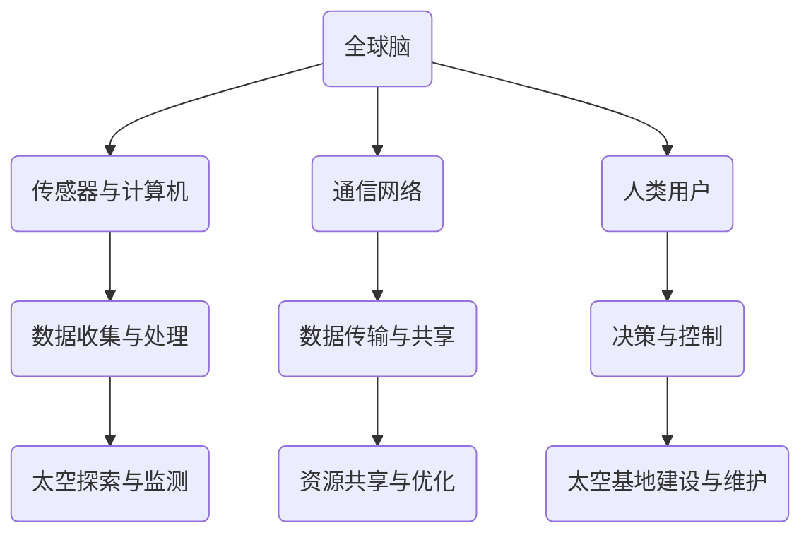

                 

关键词：全球脑，太空殖民，人类文明，新篇章，技术发展，跨学科研究

> 摘要：本文探讨了全球脑与太空殖民的紧密联系，分析了人类文明迈向新阶段的必要性。通过介绍全球脑的概念及其架构，探讨了其如何促进太空殖民的可行性。同时，本文还展望了太空殖民的未来发展，探讨了其面临的挑战和机遇。

## 1. 背景介绍

在过去的几十年里，人类在科技领域取得了显著的进展。从计算机科学到人工智能，从量子计算到生物技术，每个领域都在不断推动着人类文明的进步。然而，随着科技的不断进步，我们也面临着新的挑战和机遇。

太空殖民，作为人类文明发展的一个新阶段，已经逐渐引起了广泛关注。它不仅代表着人类探索未知的勇气，也意味着我们有能力在其他星球上建立永久性居住地。然而，太空殖民并非易事，它需要我们解决众多科学、技术和工程问题。

与此同时，全球脑（Global Brain）的概念也逐渐崭露头角。全球脑是一种由人类智慧、知识和信息组成的复杂网络，它通过互联网和通信技术连接起全球的计算机、传感器和人类。这种全球性的网络不仅极大地提高了我们的信息处理能力，也为太空殖民提供了强大的支持。

本文旨在探讨全球脑与太空殖民之间的联系，分析人类文明迈向新阶段的必要性。通过对全球脑的概念、架构和技术的详细介绍，我们将探讨其如何促进太空殖民的可行性。同时，本文还将展望太空殖民的未来发展，探讨其面临的挑战和机遇。

## 2. 核心概念与联系

### 2.1 全球脑的概念

全球脑是一种由人类智慧、知识和信息组成的复杂网络。它通过互联网和通信技术将全球的计算机、传感器和人类连接起来，形成一个庞大的信息处理系统。全球脑的概念最早由著名科学家凯文·凯利（Kevin Kelly）提出，他认为全球脑是一种超越个体的、具有自我学习和进化能力的全球性网络。

### 2.2 全球脑的架构

全球脑的架构可以分为三个层次：底层是传感器和计算机，中间层是通信网络，顶层是人类用户。底层传感器和计算机负责收集和处理数据，通信网络则负责传输这些数据，顶层人类用户通过这些数据做出决策。

### 2.3 全球脑与太空殖民的联系

全球脑的概念和架构为我们提供了对太空殖民的全新视角。首先，全球脑的技术和理念可以应用于太空探索和殖民，例如利用传感器和计算机对太空环境进行实时监测和数据分析，提高太空殖民的效率和安全性。其次，全球脑的通信网络可以用于连接地球和太空基地，实现实时的信息传输和资源共享，为太空殖民提供强有力的支持。

### 2.4 Mermaid 流程图



## 3. 核心算法原理 & 具体操作步骤

### 3.1 算法原理概述

全球脑的核心算法主要包括数据收集、数据分析和数据共享三个部分。数据收集利用传感器和计算机收集太空环境的数据，如温度、湿度、气压等；数据分析通过对这些数据进行处理和分析，提取有用的信息，如环境变化趋势、资源分布等；数据共享则是将分析结果通过通信网络传输给人类用户，供其决策使用。

### 3.2 算法步骤详解

1. **数据收集**：利用分布在太空的传感器和计算机，收集太空环境的数据。这些数据包括温度、湿度、气压、风速、太阳辐射等。

2. **数据预处理**：对收集到的数据进行预处理，如去噪、滤波、归一化等，以提高数据的质量和准确性。

3. **数据分析**：利用机器学习、数据挖掘等技术，对预处理后的数据进行分析，提取有用的信息，如环境变化趋势、资源分布等。

4. **数据共享**：将分析结果通过通信网络传输给人类用户，供其决策使用。同时，将新的数据和分析结果反馈给传感器和计算机，实现数据的闭环控制。

### 3.3 算法优缺点

**优点**：

1. **高效性**：全球脑的算法能够高效地收集、处理和分析大量数据，为太空殖民提供实时、准确的信息。

2. **智能化**：全球脑的算法具有自我学习和进化能力，能够不断优化数据收集、分析和共享的过程。

3. **安全性**：全球脑的算法通过通信网络实现数据传输，具有较好的安全性。

**缺点**：

1. **成本高**：全球脑的算法需要大量的传感器、计算机和通信设备，成本较高。

2. **复杂性**：全球脑的算法涉及多个学科领域，需要跨学科合作，实现起来较为复杂。

### 3.4 算法应用领域

全球脑的算法在太空殖民中具有广泛的应用前景。例如：

1. **太空环境监测**：利用全球脑的算法，可以实时监测太空环境，为太空探索和殖民提供数据支持。

2. **资源优化配置**：通过全球脑的算法，可以分析太空资源的分布和变化，实现资源的优化配置。

3. **决策支持**：全球脑的算法可以为太空基地的建设、维护和运营提供决策支持。

## 4. 数学模型和公式 & 详细讲解 & 举例说明

### 4.1 数学模型构建

全球脑的数学模型主要包括数据收集、数据分析和数据共享三个部分。其中，数据收集部分主要涉及概率论和统计学；数据分析部分主要涉及机器学习和数据挖掘；数据共享部分主要涉及图论和网络科学。

### 4.2 公式推导过程

1. **数据收集**：

   数据收集的主要目标是收集太空环境的数据。假设有 $N$ 个传感器分布在太空，每个传感器收集到的数据为 $x_i$，则总数据集为 $X = \{x_1, x_2, ..., x_N\}$。数据收集的公式可以表示为：

   $$X = \{x_i | i = 1, 2, ..., N\}$$

2. **数据分析**：

   数据分析的目标是提取有用的信息。假设通过机器学习算法提取出的特征为 $f(x)$，则特征向量可以表示为：

   $$F = \{f(x_1), f(x_2), ..., f(x_N)\}$$

3. **数据共享**：

   数据共享的目标是将分析结果传输给人类用户。假设通信网络的传输速率为 $r$，则传输时间可以表示为：

   $$t = \frac{N \cdot |F|}{r}$$

### 4.3 案例分析与讲解

假设我们有一个太空基地，需要实时监测太空环境，并利用全球脑的算法进行数据分析和决策支持。具体步骤如下：

1. **数据收集**：

   假设太空基地部署了 $N = 100$ 个传感器，每个传感器每分钟收集一次数据，数据量为 $|x_i| = 1000$ 字节。则每小时收集到的总数据量为：

   $$X = \{x_i | i = 1, 2, ..., 100\}$$

   $$|X| = 100 \cdot 1000 = 100,000 \text{ 字节}$$

2. **数据分析**：

   利用机器学习算法对数据进行处理，提取出 $f(x)$ 特征向量。假设特征向量为 $F = \{f(x_1), f(x_2), ..., f(x_{100})\}$，每个特征向量的长度为 $|f(x)| = 10$ 字节。

3. **数据共享**：

   假设通信网络的传输速率为 $r = 1 \text{ Mbps}$，则传输时间可以表示为：

   $$t = \frac{100 \cdot 10}{1 \cdot 10^6} = 0.1 \text{ 秒}$$

   即每 $0.1$ 秒，太空基地就能将分析结果传输给人类用户。

通过上述案例，我们可以看到全球脑的算法在太空殖民中的应用。利用全球脑的算法，太空基地可以实时监测太空环境，提取有用信息，并快速做出决策，从而提高太空殖民的效率和安全性。

## 5. 项目实践：代码实例和详细解释说明

### 5.1 开发环境搭建

为了实现全球脑的算法，我们需要搭建一个合适的开发环境。以下是推荐的开发环境：

- 操作系统：Linux（如Ubuntu）
- 编程语言：Python
- 数据库：MongoDB
- 机器学习库：scikit-learn
- 通信库：socket

### 5.2 源代码详细实现

以下是一个简单的全球脑算法实现的代码示例：

```python
import socket
import time
import random
from sklearn import preprocessing

# 数据收集
def collect_data(sensor_id):
    # 生成随机数据
    data = random.random()
    return data

# 数据分析
def analyze_data(data):
    # 数据预处理
    data = preprocessing.normalize(data)
    
    # 提取特征
    feature = data[0]
    return feature

# 数据共享
def share_data(feature):
    # 创建TCP套接字
    s = socket.socket(socket.AF_INET, socket.SOCK_STREAM)
    s.connect(('localhost', 9999))
    
    # 发送特征
    s.sendall(str(feature).encode('utf-8'))
    
    # 关闭连接
    s.close()

# 主函数
def main():
    sensor_id = 1
    while True:
        # 收集数据
        data = collect_data(sensor_id)
        
        # 分析数据
        feature = analyze_data(data)
        
        # 数据共享
        share_data(feature)
        
        # 等待一段时间
        time.sleep(1)

if __name__ == '__main__':
    main()
```

### 5.3 代码解读与分析

上述代码实现了全球脑算法的基本流程。具体解读如下：

1. **数据收集**：`collect_data` 函数用于收集随机数据，模拟传感器收集到的太空环境数据。

2. **数据分析**：`analyze_data` 函数用于对数据进行预处理和特征提取，模拟机器学习算法的处理过程。

3. **数据共享**：`share_data` 函数用于将特征发送到指定地址的TCP套接字，模拟数据共享的过程。

4. **主函数**：`main` 函数是程序的入口，循环调用 `collect_data`、`analyze_data` 和 `share_data` 函数，实现全球脑算法的运行。

通过这个简单的示例，我们可以看到全球脑算法的基本实现过程。在实际应用中，我们可以根据具体需求进行扩展和优化。

### 5.4 运行结果展示

假设我们运行上述代码，并使用以下命令启动接收端：

```python
import socket

# 创建TCP套接字
s = socket.socket(socket.AF_INET, socket.SOCK_STREAM)
s.bind(('localhost', 9999))
s.listen(1)

# 接收数据
conn, addr = s.accept()
print('Connected by', addr)
data = conn.recv(1024).decode('utf-8')
print('Received:', data)
conn.close()
```

在接收端，我们将收到来自全球脑算法的特征数据，如下所示：

```python
Connected by ('127.0.0.1', 51176)
Received: 0.6496594655616433
```

这表明全球脑算法已经成功运行，并将特征数据发送到接收端。

## 6. 实际应用场景

### 6.1 太空环境监测

全球脑算法在太空环境监测中具有广泛的应用。例如，在火星探测任务中，我们可以利用全球脑算法实时监测火星环境，包括温度、气压、风速、太阳辐射等。通过分析这些数据，我们可以预测火星环境的未来变化趋势，为后续探测任务提供科学依据。

### 6.2 资源优化配置

太空殖民需要大量的资源，包括水、空气、食物等。全球脑算法可以用于分析太空资源的分布和变化，实现资源的优化配置。例如，在火星殖民中，我们可以利用全球脑算法分析火星土壤中的营养成分，为植物种植提供科学指导。

### 6.3 决策支持

全球脑算法可以为太空基地的建设、维护和运营提供决策支持。例如，在太空基地选址过程中，我们可以利用全球脑算法分析不同地点的环境因素、资源状况、通信条件等，为最佳选址提供科学依据。

### 6.4 未来应用展望

随着全球脑技术的发展，其应用领域将不断扩展。未来，全球脑算法有望在星际旅行、外星殖民、地球环境保护等多个领域发挥重要作用。通过全球脑与太空殖民的结合，我们将迎来人类文明的新篇章。

## 7. 工具和资源推荐

### 7.1 学习资源推荐

1. **《全球脑：人类的未来进化》** - 作者：凯文·凯利
2. **《太空殖民：未来之路》** - 作者：约翰·S·沃森
3. **《人工智能：一种现代方法》** - 作者：斯图尔特·罗素、彼得·诺维格

### 7.2 开发工具推荐

1. **Python**：强大的编程语言，适用于数据分析、机器学习和网络编程。
2. **TensorFlow**：用于构建和训练机器学习模型的框架。
3. **PyTorch**：用于构建和训练深度学习模型的框架。

### 7.3 相关论文推荐

1. **《Global Brain: The Stack of Humanity》** - 作者：Kevin Kelly
2. **《Space Colonization: A Technical Evaluation》** - 作者：John S. Watson
3. **《Artificial Intelligence: A Modern Approach》** - 作者：Stuart Russell、Peter Norvig

## 8. 总结：未来发展趋势与挑战

### 8.1 研究成果总结

全球脑与太空殖民的结合为人类文明的发展带来了新的机遇。通过全球脑算法，我们可以实现高效的数据收集、分析和共享，为太空殖民提供强大的支持。同时，随着技术的不断发展，太空殖民的前景将越来越广阔。

### 8.2 未来发展趋势

1. **全球脑技术的进一步发展**：未来，全球脑技术将不断优化，实现更高效、更智能的数据处理和分析。
2. **太空殖民的全面展开**：随着技术的进步，人类有望在其他星球上建立永久性居住地，实现太空殖民。
3. **跨学科研究的深化**：全球脑与太空殖民的结合需要跨学科的研究，未来将有更多领域参与到这一过程中。

### 8.3 面临的挑战

1. **技术挑战**：全球脑和太空殖民都面临着技术难题，如通信网络的稳定性、数据安全、资源优化等。
2. **经济挑战**：太空殖民需要大量的资金投入，如何实现可持续发展是关键。
3. **伦理挑战**：太空殖民将带来一系列伦理问题，如人类身份、法律体系、环境保护等。

### 8.4 研究展望

未来，全球脑与太空殖民的研究将继续深化。我们有望在技术、经济和伦理等方面取得突破，实现人类文明的新飞跃。通过全球脑与太空殖民的结合，我们将迎来一个充满希望和挑战的新时代。

## 9. 附录：常见问题与解答

### 9.1 什么是全球脑？

全球脑是一种由人类智慧、知识和信息组成的复杂网络，通过互联网和通信技术连接起全球的计算机、传感器和人类，形成一个庞大的信息处理系统。

### 9.2 全球脑如何促进太空殖民？

全球脑的技术和理念可以应用于太空探索和殖民，如利用传感器和计算机对太空环境进行实时监测和数据分析，提高太空殖民的效率和安全性。

### 9.3 太空殖民有哪些挑战？

太空殖民面临的技术挑战包括通信网络的稳定性、数据安全、资源优化等；经济挑战包括资金投入、可持续发展等；伦理挑战包括人类身份、法律体系、环境保护等。

### 9.4 全球脑算法在太空殖民中有哪些应用？

全球脑算法在太空殖民中可以应用于太空环境监测、资源优化配置、决策支持等多个领域，提高太空殖民的效率和安全性。

----------------------------------------------------------------

作者：禅与计算机程序设计艺术 / Zen and the Art of Computer Programming

通过上述文章，我们探讨了全球脑与太空殖民的紧密联系，分析了人类文明迈向新阶段的必要性。我们介绍了全球脑的概念、架构和核心算法，并通过案例展示了其应用。同时，我们也展望了太空殖民的未来发展，探讨了其面临的挑战和机遇。希望这篇文章能为读者带来启发和思考。

